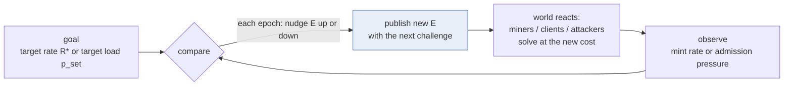
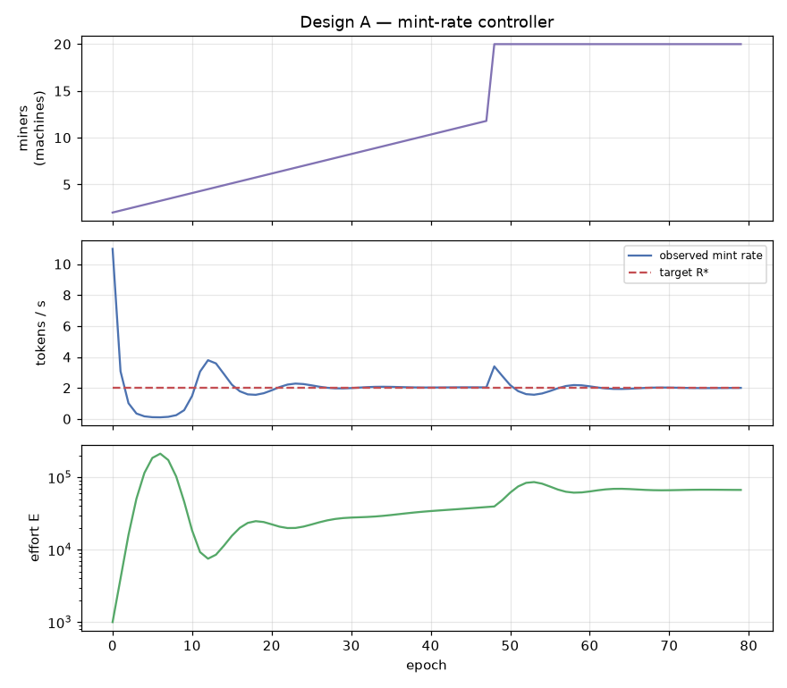
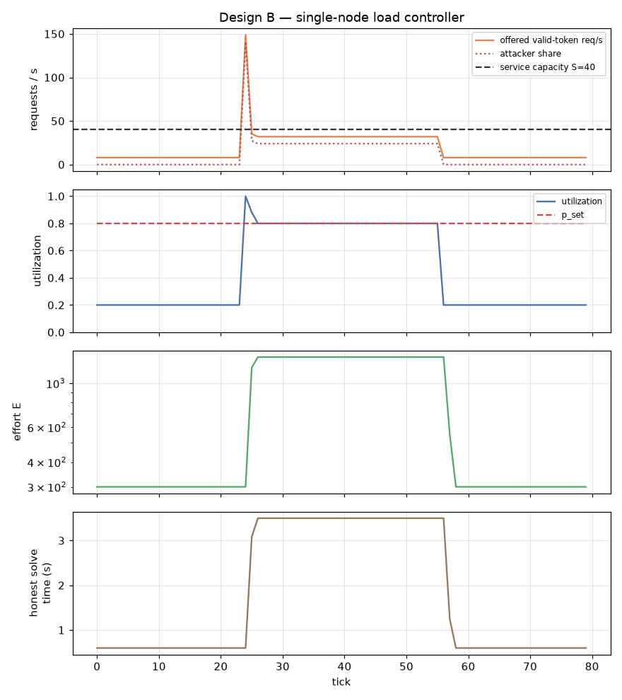
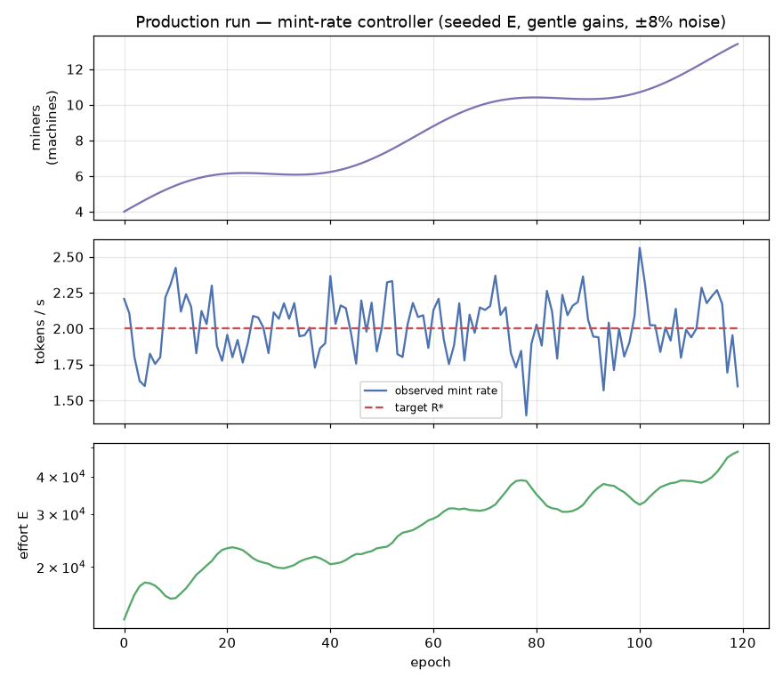
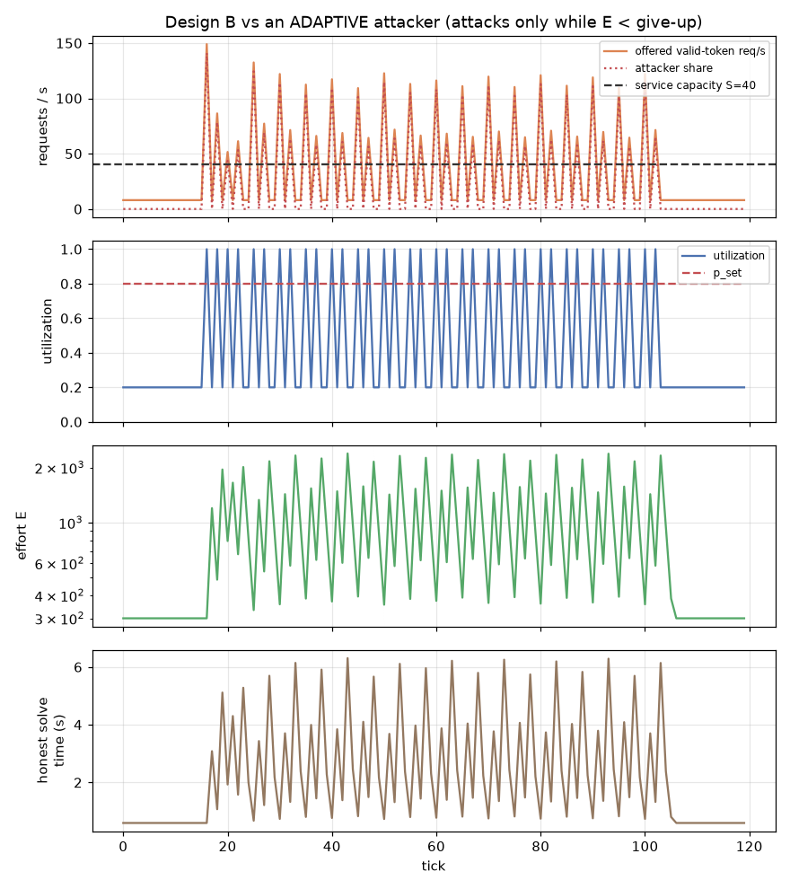
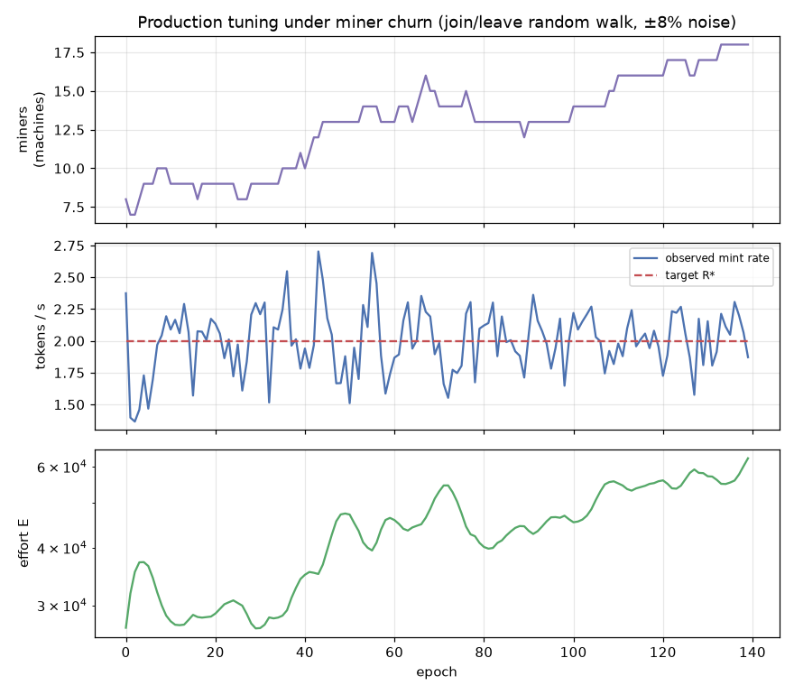

# Controlling Equi-X difficulty (`E`) automatically

`findings.md` measures what the effort parameter `E` *does*: raising it makes every token linearly more expensive to produce while verification stays at ~15 µs. This document answers the follow-up question: **who sets `E`, and how does it keep up when conditions change?** Setting it once by hand fails quietly — miners join and leave, attackers come and go, solvers get faster — and a fixed `E` slowly drifts away from whatever goal it was chosen for. The fix is a *feedback controller*: a small loop that watches one number, compares it to a goal, and nudges `E` after each period. This document develops two such controllers (one for mining, one for DoS protection), explains why they are stable, and shows them running in a simulator calibrated on the real measured numbers. Nothing here is wired into the live benchmark runners — it is a design with a runnable, tested reference, meant to be understood and tuned before it controls anything real.



## Why control is easy here: rate ≈ 1/`E`

One measured fact (`findings.md` §7a) does almost all the work: on fixed hardware, the token production rate is **approximately inversely proportional to `E`**. Measured on the reference machine: 69 → 24 → 5.5 → 1.7 → 0.67 tokens/s as `E` goes 100 → 300 → 1,000 → 3,000 → 10,000. Double the difficulty, roughly halve the output. (The law is not exact — individual segments run ~±30% off pure 1/`E` in *both* directions, e.g. 300→1,000 is steeper, 3,000→10,000 shallower — but a feedback loop absorbs model error like that automatically: it just takes one extra correction step. That tolerance is the whole point of closing the loop.)

This shape makes the controller almost trivial, for three reasons.

**The correction is a simple multiplication.** If the system produces twice as much as wanted, doubling `E` fixes it in one move. No search, no model fitting — the update rule is `E ← E × (observed ÷ wanted)`.

**No capacity model is needed.** The loop reacts only to what it *observes*. It never needs to know how many miners exist or how fast their hardware is; if capacity doubles, the observed rate doubles, and the next update doubles `E`. Drift of any kind — hardware, population, attack size — is absorbed the same way.

**Raising `E` costs the controller's side nothing.** Verification is O(1) in `E` (~15 µs regardless), and — measured in `findings.md` §5a — **the messages don't grow either**: a token is 24 bytes (8 B nonce + 16 B solution) at *every* difficulty, byte-identical at `E` = 100 and `E` = 3,000. So the controller can escalate as hard as it likes; the entire cost of a higher `E` lands on whoever must solve, as CPU time — never on the verifier, the network, or the packet size.

## Design A — holding a network's mint rate (mining)

**The problem in plain words.** A token-minting protocol wants tokens created at a steady pace — say 2 per second network-wide — no matter how much solving power shows up. More miners at fixed `E` means more tokens per second, so `E` must rise as the network grows (and fall if it shrinks). This is exactly what Bitcoin's difficulty retargeting does; here it is specialized to the 1/`E` law.

**The rule in one sentence.** Once per epoch, multiply `E` by *(observed rate ÷ target rate)*, with two safety limits explained below.

```python
def retarget(E, tokens_in_window, window_seconds, R_target):
    R_obs  = ewma(tokens_in_window / window_seconds)   # smoothed observed rate
    factor = clamp(R_obs / R_target, 1/4, 4)           # bounded per-epoch step
    return clamp(E * factor, E_MIN, E_MAX)             # bounded difficulty
    # publish the new E with the next challenge epoch
```

**Why it works, and what the safety limits are for.** Minting twice too fast means `E` must double — and `R_obs / R_target` is exactly 2, so one update lands on target. Two standard ingredients keep the loop from misbehaving on real, noisy data:

- **EWMA** (*exponentially weighted moving average*) — a cheap way to smooth a noisy series: `smoothed ← α·new + (1−α)·smoothed`. Without it the controller would chase every random fluctuation in the token arrival process — and that process is genuinely noisy: token-find times are near-**exponential** (memoryless), with standard deviation roughly equal to the mean (`findings.md` §7a), so a window counting `N` tokens has ~±1/√`N` relative noise. Size the epoch so `N` is large enough that this noise is below your tolerance, and set `α` accordingly: higher reacts faster but passes more noise through.
- **The ±4× per-epoch clamp** — no single update may move `E` by more than 4× in either direction (Bitcoin uses the same bound). This prevents one weird window — a burst of lucky tokens, an outage — from flinging the difficulty somewhere it takes many epochs to recover from.

| Parameter | What it is | Typical | Raising it means |
|---|---|---|---|
| `R_target` | wanted mint rate | protocol goal | — |
| `E_MIN`, `E_MAX` | hard difficulty bounds | 100 … very large | floor keeps a real puzzle; ceiling bounds the worst-case honest solve time |
| `max_factor` | per-epoch step clamp | 4 | faster tracking, more overshoot |
| `ewma` weight | smoothing memory | 0.15–0.3 | more responsive, noisier |
| epoch length | how often `E` updates | minutes | slower reaction, steadier `E` |

## Design B — protecting one node under load (DoS)

**The problem in plain words.** A single service wants two things at once: charge honest clients as *little* puzzle-work as possible in quiet times, and make a flood of requests as *expensive* as possible for whoever sends it. The node can't see the attacker's machines — but it doesn't need to. It can feel its own load, and load is the one thing the attacker cannot fake away: every accepted request had to carry a valid token, and tokens cost solve time.

**The rule in one sentence.** Watch the node's *admission pressure* — valid-token requests arriving per second, divided by what the node can serve per second — and multiply `E` up when pressure exceeds the target, down when it falls below.

```python
def adjust(E, valid_requests_per_s, capacity_per_s):
    p = valid_requests_per_s / capacity_per_s    # pressure: >1 = overloaded
    e = p - P_SET                                # error vs target (e.g. 0.8)
    if abs(e) <= DEADBAND:                       # close enough: don't twitch
        return E
    factor = clamp(exp(K * e), 1/4, 4)           # up when hot, down when cool
    return clamp(E * factor, E_MIN, E_MAX)
```

**Why it works.** Pressure above target means valid tokens are arriving faster than the node wants to serve. Raising `E` makes the *next* token cost more solve time for everyone, which mechanically caps how many valid requests per second the whole world can present — the attacker's token stream thins out until pressure sits back at the target. When the flood stops, pressure falls below target and `E` decays back toward `E_MIN`, so honest clients quickly return to paying almost nothing. Three terms of art, briefly:

- **Pressure target `P_SET` ≈ 0.8** — aim below 1.0 on purpose: the ~20% headroom absorbs bursts *while* the controller is still reacting.
- **Deadband** — a small "close enough" zone (±0.03) around the target where `E` holds still. Without it, `E` would jitter up and down every tick on measurement noise. Its intended consequence: if load pins pressure exactly at target, `E` *holds* — which is correct, that is the equilibrium — and only decays once pressure actually drops below the band.
- **Gain `K`** — how aggressively pressure error translates into difficulty change (`exp(K·e)` turns an error of ±0.6 into roughly a 2.5× step at `K` = 1.5). Higher reacts faster but overshoots more.

**What this controller does and does NOT do.** It bounds the node's *load*, keeping utilization near `p_set` so the service stays responsive — but it does **not** prioritize honest traffic. At equilibrium the attacker still occupies whatever share of the served capacity it can pay for (in Run 2 below, roughly three-quarters of the admitted requests during the attack); the controller simply makes that share *expensive enough to bound*, not zero. Separating honest from malicious traffic is a different job, and the tool for it is **per-client difficulty**: keep the global `E` low and raise it only for unrecognized or suspect sources, so clients with a good history are spared entirely while attackers pay the escalated price.

**The honest-client tradeoff, stated plainly.** Defense is not free for legitimate users: while an attack is being throttled, *their* solve time rises too — and because token-find time is heavy-tailed (near-exponential), an unlucky honest client waits well past the mean (p95 ≈ 3× mean). In the simulation below, an honest client pays ~0.60 s per request at rest and ~3.5 s at the peak of the attack (mean; the unlucky tail is longer), then falls right back when the attack ends. `E_MIN` bounds what honest clients pay in peacetime; `E_MAX` bounds the worst they can ever be asked to pay — set `E_MAX` against your p95 latency budget, not the mean.

**Tokens must be single-use.** This controller's input is the *valid-token request rate*, and verification is stateless — so if one valid token can be replayed, an attacker solves once and then inflates the pressure signal at wire speed for free, driving `E` up against honest clients while paying nothing. Design B is only sound on top of single-use enforcement: a spent-token cache keyed on `(challenge, nonce)` until the challenge rotates, or per-client challenge binding (see `findings.md` §6, which quantifies the cache cost). Assume it is in place.

| Parameter | What it is | Typical | Raising it means |
|---|---|---|---|
| `P_SET` | target pressure | 0.8 | runs closer to saturation, less burst headroom |
| `K` | gain | 1.5 | faster throttling, more overshoot |
| `E_MIN`, `E_MAX` | difficulty bounds | 300 … large | peacetime vs worst-case honest cost |
| `max_factor` | per-tick step clamp | 4 | bigger single-step escalation |
| `DEADBAND` | hold-still zone | 0.03 | steadier `E`, slower fine correction |

## Practicalities both designs share

**`E` travels with the challenge.** A challenge is issued together with the difficulty in force; the controller only ever sets the `E` of the *next* epoch. The epoch/rotation period therefore *is* the reaction latency — choose it against how fast your demand actually moves.

**Don't invalidate solvers mid-flight.** A client that started solving at `E` = 1,000 must not be rejected because the controller moved to 1,400 meanwhile. Accept a token if it clears the `E` that was in force *when its challenge was issued* (or within a small tolerance). Combined with the step clamps, an honest client can never be stranded by a difficulty jump.

**Message sizes never enter the picture.** Because the token is 24 bytes at any difficulty (measured across `E` = 100…10,000 in `findings.md` §5a, and constant by construction beyond — a solution is always 8 indices), no controller decision has a bandwidth consequence. The only network-visible effect of the whole mechanism is how often challenges rotate; the packets themselves are byte-identical whether `E` is 100 or 100,000.

**Where the numbers come from.** The measured mint-rate curve from the mining benchmark calibrates everything: it seeds the starting `E` (see `equilibrium_E` below), justifies the multiplicative law (rate ≈ 1/`E`), and bounds `E_MIN`/`E_MAX` in terms of real seconds of honest solve time.

## The reference implementation, run against the measured curve

`harness/equix_bench/difficulty_control.py` implements both controllers (`MintRateController`, `LoadController`), a helper `equilibrium_E(machines, target_rate)` that inverts the measured curve to find the `E` where a given fleet mints a given rate, and a simulator that drives the loops against synthetic demand. It is calibrated on `MEASURED_MINT` — the pooled measured points from `results/main/mining.csv` — and unit-tested in `harness/tests/test_difficulty_control.py` (convergence to target, tracking a capacity step, throttling an attack, the 1/`E` model, and noise-stability are all asserted). Run the demo:

```bash
PYTHONPATH=harness python3 -m equix_bench.difficulty_control --out results/control
```

It writes five plots (`control_mining`, `control_dos`, `control_production`, `control_adaptive`, `control_churn`) plus a `summary.md`. The five runs below build from the easy case to the honest stress tests.

### Run 1 — Design A from a cold start, miners grow 2 → 20

The network starts at 2 miners minting far above target, ramps to 12, then a hashpower spike jumps it to 20 — and the controller starts from a deliberately wrong `E` = 1,000. It drives `E` up to ~67,000 and holds the mint rate at the 2 tokens/s target throughout. The early wobble is the *underdamped transient*: starting far from equilibrium, the first corrections overshoot and ring for a few epochs before settling — visible on purpose, because it is what the production tuning below is designed to avoid.



### Run 2 — Design B absorbing a flood (ticks 24–56)

Honest load is a steady 8 req/s against a 40 req/s node; at tick 24 a 6-machine flood begins offering ~150 valid-token req/s. The node saturates for about 2 ticks — the time the controller needs to react — then `E` climbs 300 → ~1,350, the attacker's achievable token rate collapses back to the 0.8 × 40 target, and utilization pins at `p_set` for the rest of the attack. Honest solve time pays the documented price (0.60 s → ~3.5 s). The attack stops at tick 56; `E` decays home and honest cost returns to 0.60 s.



### Run 3 — Design A tuned for production

The cold start above is the worst case; a deployment never needs to begin ignorant. Here `E` is **seeded at equilibrium** (`equilibrium_E()` — no hard-coded constants), gains are gentle (`max_factor` = 2, `ewma` = 0.15), capacity grows organically 4 → 13 miners, and the observed rate carries ±8% measurement noise. The result is what production should look like: no overshoot anywhere, `E` gliding ~10,500 → ~48,000 as capacity grows, mint rate on target throughout. Two honesty notes on reading it: the settled tail is +1.4% from target *as observed*, but +3.1% on the *noise-free* rate — that is the controller's real systematic lag against a continuously rising ramp (a multiplicative-only controller always trails a moving target slightly; the noisy average partly hides it, so judge tracking by the noise-free number). If that lag matters, the standard fix is adding an integral term — see limitations.



### Run 4 — Design B against an *adaptive* attacker (the honest stress test)

A constant flood is the easy case. A rational attacker instead *watches* `E`: it attacks while solving is cheap and pauses when the controller escalates past its give-up point, resuming as `E` decays. Simulated with a give-up at `E` = 800, the loop does **not** settle — it **sawtooths**. Each cycle: the attacker floods → the node saturates for about one tick → `E` climbs past 800 → the attacker pauses → `E` decays back below 800 → the attacker returns. Over the attack window the node sits saturated ~40% of the time and `E` oscillates ~330–2,400, dragging honest clients along the same sawtooth (their solve time swings ~0.6–6 s).



This is a genuine limitation of a pure decay controller, and it is worth stating rather than hiding: the mean load is still bounded (the attacker cannot exceed `p_set` on average), but the *peaks* reach saturation and honest latency is volatile. Three standard mitigations, in increasing order of effort: **(1) asymmetric rates** — raise `E` fast, decay it slowly (a long EWMA on the *downswing* only), so the attacker's pause is punished by a difficulty that lingers; **(2) hysteresis** — hold the escalated `E` for a cooldown after pressure drops, instead of decaying immediately; **(3) per-client `E`** (as above), which removes the incentive entirely because the *attacker's* difficulty stays high regardless of aggregate load. The simulator makes trying these one-liners: swap the decay term or the deadband in `LoadController`.

### Run 5 — Design A under realistic miner churn

The production run above grew capacity along a smooth line; a real network is lumpier. Here the miner count is a **random walk** — each tick miners independently join or leave — between 7 and 18, on top of the same ±8% rate noise. The production tuning handles it without drama: the mint rate holds to within ~1% of target (noise-free) across the whole run, because each difficulty update only reacts to the observed rate and neither knows nor cares *why* capacity moved.



## Limitations, and what a production version would add

The simulator's "world" is deliberately simple: the measured mint-rate curve times a machine count. It does not model honest clients giving up when solve latency grows, mixed solver speeds across a network, or consensus/reorg dynamics in the mining case — a production design should layer those in. **Pool mining and share validation** (miners submitting low-difficulty *shares* to prove work toward a high-difficulty token) are out of scope here: the mint-rate control law is unchanged — a pool is just an aggregation layer in front of it — but share-difficulty selection and variance-reduction are their own design and are not modeled. The controllers are the minimal stable versions (one smoother, one clamp, one deadband each); the standard upgrades, if needed, are a **PI controller** (adding an *integral* term — accumulated past error — which removes the steady lag visible in Run 3), **gain scheduling** (larger `K` far from target, smaller near it — fast reaction without jitter), and, for Design B specifically, **asymmetric fast-up/slow-down** to defeat the adaptive sawtooth of Run 4. None of this is wired into the live runners: it is a reference to tune against the measured data before any deployment.
