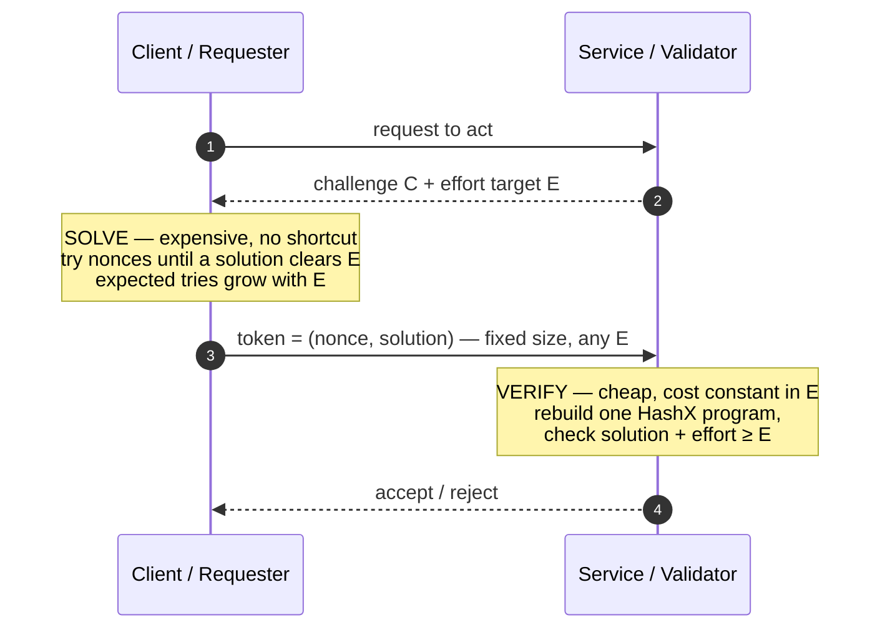
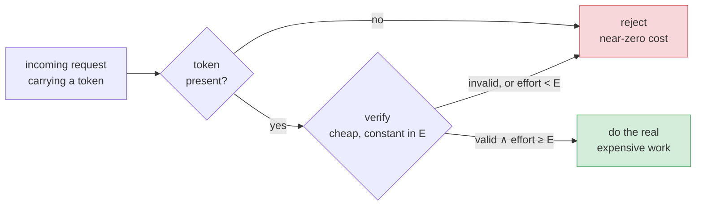
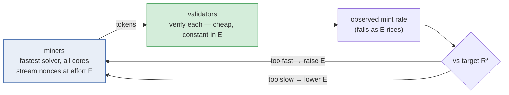

# Equi-X benchmark: findings and how to use it

Reference runs: `configs/full.toml` on **three machines**, each measured under idle conditions (`scripts/run_when_idle.sh` gates on sustained CPU idle), then merged with `equix_bench combine` into one per-device report (`results/combined/`):

| Device | CPU | Cores | Arch / OS |
|---|---|---|---|
| **M4 Pro** | Apple M4 Pro | 14 (10P + 4E) | aarch64 / macOS |
| **285HX** | Intel Core Ultra 9 285HX | 24 | x86-64 / Linux |
| **Pi 5** | Raspberry Pi 5 | 4 | aarch64 / Linux |

Two implementations are compared: **equix-c** (tevador/equix + hashx, the C reference; built with the autotuned flags in `build/runners/c/equix_runner.flags`) and **equix-rust** (the Arti `equix`/`hashx` crates). Per-operation times are medians of **100 repetitions**; aggregate throughput and mining rates are pooled totals (tokens over busy time), as noted per table.

> **Solve and verify are measured over a *stream of challenges*, not one fixed instance.** Each rep derives a fresh challenge by SHA-256-chaining the seed (`vary_challenge`), with challenge generation excluded from timing, so medians/p95 reflect the spread across challenges. This matters most for **verify**: verifying a *diverse* (cold) challenge each time costs ~1.6–2× a repeated (warm) one — a real cost the old fixed-challenge measurement hid (see §3). Raw data: `results/combined/results.csv`, `.../concurrency.csv`, `.../mining.csv`.

> **Read the core-count labels.** Every table says whether it is **[1 core]** (one operation at a time) or **[N cores]** (whole machine busy at once, N = that device's core count). They answer different questions: 1-core = *how expensive is one operation*; N-core = *how much a whole machine sustains*.

> **Portability headline.** The single biggest cross-device finding: the **C JIT is blocked only on Apple Silicon** (macOS W^X needs `MAP_JIT`, which the C backend omits). On both Linux boxes — x86-64 *and* aarch64 — the C JIT engages, and on the 285HX the C-JIT solve (**4.19 ms**) is actually a hair *faster* than Rust (4.40 ms), reversing the M4 ranking. Size security against whichever solver is fastest *on the attacker's platform*, never against one machine's ranking.

---

## 1. What Equi-X is, in one minute

Equi-X is an **asymmetric proof-of-work (a "client puzzle")**: given a *challenge* it is **expensive to find** a solution but **cheap to check** one. That single asymmetry — hard to produce, trivial to verify — is the entire basis for both use cases in this report.

It has two moving parts. **HashX** is a per-challenge hash function: for each challenge a short random program is generated and (optionally) JIT-compiled to native code, so the hash is different every time and cannot be precomputed or shortcut. The **Equi-X solver** is an Equihash-style search that must find a set of 8 HashX outputs that **sum to zero** (Equihash's XOR replaced by modular addition — a subset-sum variant); finding such a set needs many hash evaluations and ~1.8 MB of memory, while **checking** a proposed set is only a handful of hash evaluations.

On top of the base puzzle, Tor proposal 327 adds an **effort** (difficulty) parameter. A solver keeps trying different *nonces* until it finds a solution whose "effort value" clears a target `E`; the expected number of tries — and therefore the solve cost — grows **linearly with `E`**, while verification stays constant. `E` is the difficulty knob used by both use cases below.

### 1a. How an exchange works (message schema)

The puzzle is used in a simple request/response between a **requester** (who must pay the cost) and a **service/validator** (who only checks). The service picks the challenge and difficulty; the requester does the expensive solve; the service does the cheap verify.



The expensive SOLVE step is this loop — the only way to a token is to keep solving until one clears the target:

```python
def solve(C, E):                        # client side; cost grows linearly with E
    for nonce in count(0):
        prog = hashx_program(C, nonce)  # fresh hash function per nonce (JIT-compiled)
        for sol in equix_solve(prog):   # Equihash-style search, ~3-4 MB memory
            if effort(C, nonce, sol) >= E:
                return (nonce, sol)     # the token: 8 B nonce + 16 B solution
```

The cheap VERIFY step, by contrast, has no loop at all — it rebuilds one hash program for the exact `(C, nonce)` the client submitted and runs two O(1) checks, which is why its cost never depends on `E`:

```python
def verify(C, E, token):                 # service side; ~15–25 µs at ANY difficulty
    nonce, sol = token                   # 8 B + 16 B — the whole proof
    prog = hashx_program(C, nonce)       # rebuild the same per-nonce hash function
    return (equix_verify(prog, sol)      # the 8 indices' hashes sum to zero?
            and effort(C, nonce, sol) >= E)  # and the solution clears the target?
```

The symbols, at a glance (their consequences and trade-offs are the subject of §2):

| Symbol | Name | Set by | In one line |
|---|---|---|---|
| `C` | challenge / seed | service | picks the puzzle instance; fresh `C` = fresh puzzle |
| `E` | effort / difficulty | service | the cost knob: solve time ∝ `E`, verify time unaffected |
| `nonce` | search counter | client | what the solver iterates; expected tries ∝ `E` |
| `sol` | solution | client | 8 indices; with `nonce`, forms the 24 B token |
| `prog` | HashX program | derived from `C‖nonce` | the per-nonce hash function (JIT-compiled where supported) |

Intuition: verification recomputes exactly one thing — the HashX program for the submitted `(C, nonce)` — checks the solution against it, and checks the effort threshold. The requester, by contrast, had to run the solver across *many* nonces to find a qualifying solution. The gap between "many solves" and "one check" is what the two use cases sell.

---

## 2. Parameters and their consequences

| Parameter | What it is | Consequence |
|---|---|---|
| **challenge / seed `C`** | Bytes that pick the puzzle instance (and the HashX program) | Freshness / anti-replay. A new challenge voids all precomputation. **Solve** time is ~flat across challenges (measured spread < 1%), but **verify** is ~1.6–2× costlier on a *fresh* challenge than a repeated one — a cold HashX program per request (§3). |
| **effort target `E`** | Difficulty threshold a solution must clear | **The cost knob.** Attacker/miner time to produce one accepted token ∝ `E`. Verify time is **independent of `E`**. This is the lever for both DoS pricing and mining rate. |
| **nonce** | The value the solver iterates while searching | Not set by the defender; it is what the solver burns effort on. Expected nonces tried ∝ `E`. |
| **runtime: interpret vs JIT-compile** | Whether HashX runs as an interpreter or is compiled to native code | Big speed effect (see §3). An open-network adversary always uses the compiled path where available, so **security must be calibrated to the compiled speed**. |
| **message sizes** | Wire bytes of challenge / token / response | **Constant in `E`** (measured, §5a): a token is always 8 B nonce + 16 B solution = 24 B. Difficulty costs the solver time, never bandwidth. |

---

## 3. Solve and verify — single core

**[1 core] median per operation, across the varied-challenge stream (fastest runtime per impl in bold context):**

| Operation | Runtime | M4 Pro | 285HX | Pi 5 |
|---|---|---|---|---|
| **solve** `equix-rust` | JIT | **4.61 ms** | 4.40 ms | 21.15 ms |
| **solve** `equix-c` | JIT | *n/a — falls back to interpreter* | **4.19 ms** | 21.21 ms |
| solve `equix-rust` | interpreted | 29.5 ms | 35.7 ms | 116 ms |
| solve `equix-c` | interpreted | 39.9 ms | 36.5 ms | 121.6 ms |
| **verify** `equix-c` (cold) | fastest | 26.6 µs | **24.5 µs** | 54.7 µs |
| verify `equix-rust` (cold) | fastest | 34.4 µs | 36.7 µs | 79.6 µs |
| HashX program build | interpret | ~2.6 µs | ~2.6 µs | ~4.2 µs |

Three findings dominate everything downstream.

**(1) The C JIT is blocked *only* on Apple Silicon.** The C reference ships an aarch64 JIT (`hashx/src/compiler_a64.c`), but it maps executable memory with plain `mmap`+`mprotect`, omitting the `MAP_JIT` flag macOS's W^X policy requires — the kernel rejects it, so on the M4 Pro the C runner falls back to the interpreter (`try-compile` → interpreted; `must-compile` → clean error). Rust JITs via `dynasmrt`, which sets `MAP_JIT`. **But on both Linux hosts the C JIT engages** (x86-64 *and* the Pi's aarch64): on the 285HX the C-JIT solve is **4.19 ms vs Rust's 4.40 ms** — C is marginally *faster* — and on the Pi 5 the two are a dead heat at ~21.2 ms. So "Rust is the only fast solver" is a macOS artifact, not a property of Equi-X.

**(2) Verify is cheap and roughly constant in difficulty, but *not* constant across challenges.** Measured over the varied-challenge stream, one verify is **~24–27 µs (C) / ~34–37 µs (Rust)** on the fast CPUs and ~55/80 µs on the Pi — about **~170× cheaper than one fastest solve** (M4/285HX), ~150–900× cheaper depending on device. The key nuance the varied-challenge measurement exposes: verifying a *fresh* challenge each time (a cold HashX program) costs ~1.6–2× more than repeatedly verifying one *fixed* challenge (warm). The warm figure shows up in the concurrency throughput (§4, ~15–18 µs/op on the fast CPUs where the same challenge is reused); the cold figure here is what a deployment using **per-client challenges** (the §6 anti-replay recommendation) actually pays. C verifies faster than Rust on all three devices.

**(3) C verifies faster; Rust (usually) solves faster.** On every device C is the quicker *verifier*; for *solving*, Rust wins on the M4 (C has no JIT there) and ties/loses narrowly on Linux. A defender therefore prefers C; a solver's best choice is platform-dependent.

> **Open-network consequence.** Everyone who wants throughput runs the fastest solver *for their platform* — Rust-JIT (4.61 ms) on macOS, but C-JIT (4.19 ms) on x86-64 Linux. The slow interpreted numbers (30–120 ms) are irrelevant to an adversary and must **not** size protection; doing so would overstate safety ~8×. All security math below uses the fastest per-platform solver, and treats these CPU figures as a **floor** on attacker capability (GPUs/FPGAs would be faster still), not a ceiling.

---

## 4. Sustained throughput — multiple cores

Single-core time tells you the cost of one operation; to size a real machine we ran `N` workers at once (`N` up to the core count) and measured aggregate throughput. Solving works over a ~1.8 MB in-memory table, so parallel workers contend for cache/bandwidth and scale **sub-linearly** — most visibly on the many-core 285HX and the P+E-core M4 (its last workers land on slow efficiency cores). (Methodology: each worker's measured window is sized to ≥ 0.5 s — tens of thousands of reps for a ~17 µs verify — so the windows genuinely overlap; without that, a fast op's "concurrent" measurement quietly degenerates to serial-rate × N. Concurrency reuses one fixed challenge, so its verify is the *warm* ~15–18 µs, not §3's cold ~25 µs.)

**Measured aggregate peak per device (fastest runtime per impl), 1-core → whole-machine:**

| Device (cores) | Operation | best impl | 1-core | machine peak | scaling vs N× |
|---|---|---|---|---|---|
| **M4 Pro** (14) | solve | rust (JIT) | 218/s | **2,853/s** | 93% |
| | verify | c | 54,918/s | **734,306/s** | 96% |
| **285HX** (24) | solve | c (JIT) | 239/s | **4,455/s** | 78% |
| | verify | c | 65,867/s | **1,409,325/s** | 89% |
| **Pi 5** (4) | solve | c (JIT) | 47/s | **187/s** | 99% |
| | verify | c | 23,715/s | **92,572/s** | 98% |

Whole-machine, fastest path: the 285HX sustains **~4,450 solves/s** and **~1.4 M verifies/s**; the M4 Pro ~2,850 and ~734 k; the Pi 5 ~187 and ~93 k. The **~300× headroom** between a machine's solve and verify throughput (285HX: 1.4 M ÷ 4.5 k ≈ 315×) is the asymmetry made concrete, and it holds on every device. Small machines scale *more* linearly (Pi 5 at 98–99%: only 4 identical cores, no bandwidth wall reached); big ones give up efficiency to contention (285HX solve 78%, M4 solve 93% but hurt by the efficiency cores). Under saturation a single verify stretches to ~17 µs (285HX) / ~19 µs (M4 C) — worth remembering when sizing a defender at full load.

> **Memory footprint differs sharply by implementation on Linux.** Rust workers stay tiny (~4 MB each). The **C runner's per-process RSS is much larger on Linux** (~70 MB baseline vs ~3.4 MB on macOS), so C *verify* at 24 workers on the 285HX touches **~9.5 GB** total, while Rust verify at 24 workers uses ~118 MB. If you run the C verifier at high concurrency on Linux, budget RAM accordingly (or prefer the Rust verifier, which is both leaner and — for verify — within a few µs).

The per-core vs whole-machine distinction matters for *capacity*, not for the *asymmetry*. Because solving and verifying parallelize at similar efficiency, the attacker-to-defender cost **ratio is roughly constant with core count** — cores change *how many* requests a node handles, not *how lopsided* the fight is.

---

## 5. Difficulty (effort) scaling

The key property for both use cases is that **producing a token gets linearly more expensive as `E` rises, while verifying it stays constant**. The measured cost grows about linearly with effort across the tested range, as the design predicts. Verification is constant in `E` **by construction** — it checks one solution and one threshold, never searching — and the measured verify times are flat across every challenge and runtime tested (we did not need to re-measure verify at each effort level; nothing in it depends on `E`).

> **A measurement caveat that matters.** The runner's effort search is *deterministic* from its starting nonce, so a single run is one draw of a heavy-tailed random search, not an average. The `full.toml` effort sweep takes exactly one such draw per target and happened to be lucky — it reached effort ≥ 1000 in **114 attempts on all three devices** (identical, because the search is deterministic and challenge-independent), whereas pooling many independent nonce ranges (the mining benchmark, §7a) gives **~474 attempts**: the single draw understates the true expected cost by ~**4×**. The combined `report.md` DoS section is computed from that single-draw sweep (hence its verdict "effective from `E` ≥ 1000"); §6 and §7 below use the pooled mining measurement instead — the statistically honest cost, which is effective from `E` ≥ 300.

### 5a. Message sizes vs difficulty (measured)

Cost is only half the wire story — does the *message* grow with difficulty? It does not, and this is now measured rather than assumed: the benchmark records the wire bytes of **every token actually minted** across the difficulty sweep, on all three devices (the runners report each winning token's nonce and solution bytes; see `solution_bytes_*`/`nonce_bytes_wire` in `results/combined/mining.csv`).

| Message | Contents | Size | Grows with `E`? |
|---|---|---|---|
| challenge (service → client) | seed `C` + effort target `E` | a few bytes + 4 B | **no** |
| token (client → service) | nonce (8 B) + solution (16 B) | **24 B** | **no** — measured 16 B solution + 8 B nonce at every `E` from 100 to 3,000, on all three devices |
| token, prop-327 style | + explicit effort field | ~28 B | **no** |
| response | accept / reject | ~1 B | **no** |

The solution is 8 Equi-X indices × 16 bits = **16 bytes by construction**, independent of difficulty — the effort threshold changes *which* solutions qualify, never their shape — and the nonce field is a protocol constant (8 B here; Tor uses similar). Every minted token across the measured sweep confirms it: identical 16 B + 8 B at `E` = 100 and `E` = 3,000, on M4 Pro, 285HX, and Pi 5 alike. **Raising difficulty multiplies the attacker's CPU time while the packet stays ~24 bytes** — difficulty is invisible to the network layer, so no bandwidth/MTU consideration constrains how high `E` can go.

---

## 6. Using Equi-X as DoS protection — a single node's view

A node that offers a costly service (a circuit, an API call, an introduction) demands that each request carry a valid Equi-X token at effort `E` before it does any real work. The node only ever **verifies** — cheaply, and it can reject a request that carries no token essentially for free.



The economics: the attacker pays roughly the **solve time at `E` per accepted request** (the table below), while every box on the node's side costs microseconds or less.

**What the node can absorb.** Verify is ~15–25 µs on one core (warm/cold, §3); a whole machine screens **~1.4 M tokens/s** on the 24-core 285HX, ~734 k/s on the 14-core M4, ~93 k/s on the 4-core Pi 5 (measured, §4). Screening is essentially free, and the token adds only ~24 bytes to each request at **any** difficulty (§5a) — raising `E` under attack costs the defender neither CPU nor bandwidth.

**Garbage costs the defender no more than valid tokens (measured).** The cheapest imaginable attack — flooding *invalid* tokens to burn verify CPU — does not work: rejecting a token costs the same or **less** than accepting one. From the dedicated invalid-token measurement: Rust 19.6 µs valid vs 19.3 µs corrupted vs 17.4 µs pure garbage; C 18.3 µs valid vs **14.5 µs** corrupted, because the C verifier aborts at the first failed partial-sum check. So the per-machine screening floor above holds even against 100%-invalid traffic, and an attacker cannot steer verification onto a costlier path.

**Tokens must be single-use — say it out loud.** Verification is stateless, so nothing in the puzzle itself stops one valid 24 B token from being replayed at wire speed while its challenge is live — which would collapse this entire table (one 2.6 s solve, unlimited requests) and, worse, feed a difficulty controller's "valid requests" signal so that `E` ratchets up against honest clients while the attacker keeps paying nothing. Every deployment needs one of: **(a) per-client challenges** (bind `C` to the client/connection, as Tor's prop-327 binds it to the introduction context), **(b) a spent-token cache** keyed on `(C, nonce)` until the challenge rotates — memory is trivially bounded at accepted-rate × rotation period × 24 B (a node accepting 1,000 tokens/s on a 60 s rotation needs ~1.4 MB), or **(c) rotation short enough** that the replay window is acceptable. The numbers in this section assume single-use enforcement.

*Challenge size and rotation.* The challenge `C` only needs enough entropy that an attacker cannot precompute solutions for a future challenge — a random **32-byte seed** (Tor's choice) is ample and costs nothing on the wire (§5a). Rotation period is a three-way trade: shorter bounds the replay window (option c) and the spent-token cache (option b), but must stay comfortably longer than an honest client's p95 solve time so in-flight solvers aren't invalidated (accept a token against the `C` it was issued under). At `E` = 1,000 (p95 ≈ 8 s), a rotation of ~30–60 s is a reasonable middle.

**Where the 10,000× bar comes from.** It is an operating threshold (the harness default), not a law of nature. The way to read it: the protection factor is the number of *attacker core-seconds* needed per *defender core-second* of screening — at 10,000× an attacker must commit roughly ten thousand cores to keep one defender core busy, i.e. even a botnet pays real money to nuisance-level effect. Pick your own bar from your threat model; the table gives the measured curve to price it with.

**What an attacker must pay.** To get one accepted request at effort `E`, the fastest solver spends the solve time for that difficulty. Because the marginal attacker runs the fastest solver on every core, one attacker machine's accepted-token output is the whole-machine mint rate measured in §7a.

**The asymmetry (protection factor = attacker time per token ÷ verify time), [1 core], MEASURED.** Attacker time/token is the pooled §7a per-core token time on the **fastest attacker platform** (285HX, Rust-JIT; the M4 is within ~10%); verify is the **cold** 24.5 µs a per-client-challenge deployment pays (§3):

| Effort `E` | Attacker time / token [1 core, 285HX] | Protection factor (cold verify) | Verdict (10,000× bar) |
|---|---|---|---|
| 100 | 0.28 s | ~11,500× | just above the line |
| 300 | 0.79 s | ~32,000× | effective |
| 1,000 | 2.58 s | ~105,000× | effective |
| 3,000 | 9.01 s | ~368,000× | effective |
| 10,000 | ~30 s (∝ 1/E extrapolation) | ~1,200,000× | effective |

*Sensitivity — and it cuts both ways.* The denominator is the verify time. **Cold** (per-client challenge, the anti-replay default) is ~24.5 µs and gives the factors above; **warm** (one global challenge, replay-exposed) is ~15 µs and lifts every factor ~1.6×. The **weaker** hardware is *better* protected, not worse: the Pi 5 verifies in ~55 µs but its attacker also solves ~4× slower, and its cheap-verify-vs-slow-solve balance yields *higher* factors (E=1,000 ≈ 171,000×). Price against the fastest *attacker* and your own *defender* verify; the conclusions survive either warm/cold choice.

With a 10,000× "effective" bar, protection is solid from **`E` ≥ 300** on every device, and `E` = 100 sits just above the line even on the cold, fastest-attacker reading. These pooled factors supersede the single-draw sweep in the combined `report.md` (whose luck-of-one-draw cost made it read "effective from `E` ≥ 1000" — 4–5× lower at mid difficulties). Concretely: to sustain 1,000 abusive requests/s at `E` = 1,000, an attacker needs ~1,000 × 2.58 s = **~2,580 core-seconds every second ≈ 108 machines of the 285HX class (24 cores)** — or ~185 M4-class (14-core) — while the defender screens those 1,000/s using ~0.025 of one core.

**Choosing `E` (single node) — budget for the tail, not the mean.** Token-find time is close to exponential (§7a): the *median* honest client pays ~0.7× the quoted mean, but **1 in 20 pays ~3× the mean** (p95). On a fast single core (285HX/M4), read the costs as: `E` = 300 → mean ≈ 0.8 s, p95 ≈ **2.4 s**; `E` = 1,000 → mean ≈ 2.6 s, p95 ≈ **7.7 s** (a Pi-class client pays ~4× these). For a user-facing gate, pick `E` so that *three times* the mean solve time fits your latency budget on your slowest expected client; `E` = 300 suits a login / new circuit, `E` = 1,000+ suits high-value or under-attack endpoints where multi-second waits are acceptable. Because verify cost never changes with `E`, you can **raise difficulty during an attack at no cost to the defender**.

---

## 7. Using Equi-X for mining / token-rate control

In a token-minting protocol, participants ("miners") produce valid Equi-X solutions at the current difficulty `E` to earn tokens; validators check them. This is ordinary proof-of-work, but with Equi-X's cheap, effort-independent verification.



**Controlling the rate.** Global mint rate = (total network solve throughput) ÷ (attempts per token), and attempts per token ∝ `E` (§5), so **raising `E` linearly lowers the mint rate**, exactly like PoW difficulty — doubling `E` roughly halves tokens/s network-wide. The protocol picks `E` to hit a target rate given its estimate of total network capacity.

**Why Equi-X suits mining.** Validation cost is O(1) in `E` and ~15–25 µs, so validators check miners' work cheaply **no matter how high difficulty goes** — the miner's cost rises with `E`, the validator's does not.

**Everyone uses the fastest solver — so calibrate to it.** The marginal miner runs the best implementation on the best hardware; slower ones simply mine less. Difficulty must be set against the **fastest** solver *for the platform in play* — Rust-JIT (4.61 ms) on Apple Silicon, C-JIT (4.19 ms) on x86-64 — not an average: the interpreter-vs-JIT gap alone is ~8× on the *same* CPU. Equi-X's GPU/ASIC resistance comes from **HashX generating a fresh random program per nonce** (the RandomX idea, scaled down): specialized hardware cannot bake in a circuit for a function that changes every attempt, and the program mix is tuned to a CPU's strengths — with the solver's ~1.8 MB working set adding a modest memory requirement per parallel instance. This keeps mining CPU-fair and difficulty predictable; our figures are CPU-only, so a production protocol should still assume some headroom for better-optimized or accelerated solvers.

### 7a. Measured mint rate vs difficulty

Measured **under idle conditions** (`scripts/run_when_idle.sh` gates on sustained CPU idle) as part of the `--full` profile, using the fastest solver (Rust, JIT) on all cores of each machine. The whole-machine rate is the decision-relevant figure and is a **pooled** estimator: total tokens minted over total busy seconds across `cores` concurrent streams × 5 searches each, on independent nonce ranges, with failed searches charged to the denominator. Pooling matters: summing per-worker rates from few heavy-tailed samples inflates the result 6–25%. The per-core column is machine ÷ cores — a *loaded* figure, expected to sit somewhat below the idle sequential 1-core rate also in `mining.csv` (contention + the M4's efficiency-core mix). Data: `results/combined/mining.csv`.

**Whole-machine mint rate [tokens/s], fastest solver (Rust-JIT), all cores:**

| Difficulty `E` | attempts/token (~0.4·E) | M4 Pro [14c] | 285HX [24c] | Pi 5 [4c] |
|---|---|---|---|---|
| 100 | ~42 | 54.0 | **85.2** | 4.45 |
| 300 | ~131 | 17.9 | **30.5** | 1.40 |
| 1,000 | ~474 | 5.55 | **9.28** | 0.42 |
| 3,000 | ~1,500 | 1.62 | **2.67** | 0.17 |

On every device the machine mint rate falls **approximately as 1/E**: across the measured 30× span (`E` = 100 → 3,000) the rate drops **32×** on the 285HX, **33×** on the M4, and **26×** on the Pi 5 — i.e. **doubling difficulty roughly halves the mint rate**, a predictable control knob with ~±30% local slack. The three machines' rates scale with core count as expected (285HX ≈ 24/14 × M4 ≈ 1.6×; Pi 5 ≈ 4/14 × M4 ≈ 0.3×), and the *shape* of the curve — the thing a difficulty controller cares about — is identical across all three, so one calibration transfers with a per-fleet capacity multiplier.

**Why attempts ≈ 0.4–0.5·`E`.** Each solve attempt yields **~2.0 solutions on average** (measured `solutions_mean` ≈ 1.97–2.17 in `results.csv`, matching the upstream design's ~2), and each solution's effort value clears target `E` with probability ~1/`E` — so a token needs about `E`/2.1 ≈ 0.47·`E` attempts. The measured ~0.35–0.49·`E` range across devices is that constant plus sampling noise.

**The distribution, not just the mean.** Attempt counts are geometric, so token-find times are close to **exponential** — memoryless, heavy-tailed. Measured signature: median/mean ≈ 0.69 (= ln 2, the exponential's fingerprint) at `E` = 100–1,000, with stddev ≈ mean. Practical readings: the *median* token arrives in ~0.7× the mean time, **p95 ≈ 3× the mean**; for mining, token inter-arrival is Poisson-like, so a window collecting `N` tokens has ~±1/√`N` relative noise (size Design A's epoch so `N` is large enough for the noise you can tolerate); for DoS, quote honest-client cost as a tail, not a mean (§6).

**Setting difficulty for a target rate.** Because rate ≈ ∝ 1/`E`, scale from any measured point: the 285HX mints 9.28 tokens/s at `E` = 1,000, so to hold it to 1 token/s you raise `E` to ~9,300 (the M4 to ~5,600, the Pi to ~420); for a real network, sum each machine class's rate and solve the same way. For **mixed fleets**: throughputs simply add (each machine mints at its own `M(E)`), while *pricing* — the per-token cost that security arguments lean on — is governed by the fastest machine class, exactly like the fastest-solver rule in §3. Validation cost stays ~15–25 µs at every `E`, so raising difficulty never burdens validators.

**Closing the loop.** The above is open-loop (set `E` from a capacity estimate). §8 covers a closed-loop controller that adjusts `E` to demand/load automatically.

---

## 8. Controlling `E` automatically (demand-driven)

The open-loop rule "compute `E` from a capacity estimate" is brittle in practice — capacity, attacker size, and solver speed all drift. Because the measured law is simply rate ∝ 1/`E` with constant, near-free verification, a **closed-loop** controller is cheap and needs no absolute model: it reacts multiplicatively to what it observes and self-corrects. Two controllers cover the two use cases; both are implemented and unit-tested in `harness/equix_bench/difficulty_control.py`, with the full design in `difficulty-control.md`.

**Design A — mint-rate controller (mining).** Once per epoch, `E ← E · clamp(R_obs / R*, ¼, 4)`: if the network mints too fast, raise `E` proportionally. This is PoW-style retargeting specialized to the 1/`E` law, robust to hashpower drift because it uses only the observed rate.

**Design B — single-node load controller (DoS).** Each tick, `E ← E · exp(k · (p − p_set))` where `p` = offered valid-token rate ÷ service capacity: raise `E` under pressure to throttle, let it decay toward `E_min` when idle so honest clients pay the least. Raising `E` is free for the defender (verify is `E`-independent); the cost lands on whoever generates load, with honest solve time as the visible tradeoff.

**Simulated on the measured curve.** A simulator (`python -m equix_bench.difficulty_control`) drives both controllers against synthetic demand, calibrated on the pooled §7a curve — cold-start convergence, a DoS flood being throttled, adaptive (pause/resume) attackers, miner churn, and a production-tuned run are all exercised, with plots and full narratives in `difficulty-control.md`. The headline: with production tuning (`E` seeded at equilibrium via `equilibrium_E()`, gentle gains, ±8% measurement noise) the loop tracks its target within a few percent and never overshoots; the representative run:


This is a design plus an offline reference, not wired into the live runners; it exists so the loop (clamps, gain, deadband, epoch length) can be tuned against the measured data before it controls anything real.

## 9. Compiler flags (secondary)

We built the C runner under gcc/clang at various `-O` levels and compared. The effect of optimization level depends on whether the JIT engages. On the **M4 Pro**, where the C JIT is blocked and solving runs in the interpreter, **optimization level barely moves solve time above `-O2`**: every `-O2`/`-O3` variant lands within ~1% of each other, and only `-O0` is a real regression (~2×). On the **Linux hosts the JIT engages**, so solve is dominated by JIT-emitted code and the C compiler's flags matter even *less* — the interpreter path they optimize is off the hot path entirely. Absolute levels also shift a few percent between runs with machine state, so the comparison is only meaningful within a run; across tuning passes the winner has flipped between `-O3 -flto`, `-O3`, and `-O2` by margins of ~1–2% that don't survive to the next pass. The honest conclusion: **no fixed fast-tier flag choice is defensible; the only defensible policy is to measure and install per machine**, which is what `scripts/autotune_c_flags.sh` does — it now benchmarks each candidate over the **same SHA-256-varied challenge stream** the main run uses (1,000 reps, seed-derived per rep, so the winner is chosen against the challenge distribution rather than one instance), installs the fastest, and records the choice in `build/runners/c/equix_runner.flags` and `build/provenance.json`.

---

## 10. Summary

- **Measured across three CPUs** (Apple M4 Pro, Intel 285HX, Raspberry Pi 5) over a varied-challenge stream, then merged with `combine` — so every figure is per-device, not one machine's.
- **Asymmetry is real and large:** one fastest solve costs ~170 cold verifies, and one pooled effort-1,000 token ~105,000 verifies; the 24-core 285HX solves ~4,450/s but verifies ~1.4 M/s (~315×), and the ratio holds on every device.
- **Effort is an approximately linear difficulty knob** for solving (measured within ~30% of ideal 1/`E` on all three devices); verification is constant and cheap — ideal for both DoS pricing and mining-rate control.
- **DoS:** pooled-measurement effective (≥ 10,000×) from `E` ≥ 300 on every device (~105,000× at `E` = 1,000; `E` = 100 just above the bar) — the combined `report.md`'s single-draw sweep is 4–5× more conservative and reads effective from `E` ≥ 1,000. Raise `E` freely under attack at zero defender cost. **Two deployment must-knows:** tokens must be single-use (spent-token cache or per-client challenges — else replay collapses the asymmetry, and per-client challenges are why verify is priced *cold*), and a garbage flood is harmless (invalid ≤ valid verify cost, measured).
- **Budget for the tail:** token-find time is near-exponential (median ≈ 0.7× mean, p95 ≈ 3× mean), so quote honest-client cost against the tail, not the mean — and against your slowest client class (a Pi pays ~4× a fast core).
- **Mining (measured, pooled):** at `E` = 100 / 300 / 1,000 / 3,000 the 285HX mints 85 / 30 / 9.3 / 2.7 tokens/s, the M4 54 / 18 / 5.6 / 1.6, the Pi 5 4.5 / 1.4 / 0.42 / 0.17 — rate ≈ ∝ 1/`E` everywhere (30× difficulty → ~30× rate), so difficulty sets the mint rate directly; validation stays ~15–25 µs at any `E`.
- **Message sizes are constant in difficulty (measured, §5a):** every minted token on every device is exactly 8 B nonce + 16 B solution = 24 B — difficulty costs solver CPU, never bandwidth.
- **Always size against the fastest solver — which is platform-dependent.** Rust-JIT (4.61 ms) on Apple Silicon, but **C-JIT (4.19 ms) on x86-64 Linux, edging out Rust**; the C JIT is blocked only on macOS (no `MAP_JIT`), where it runs ~8× slower interpreted. Never generalize one machine's C-vs-Rust ranking. Treat these CPU numbers as a floor (GPUs/FPGAs faster still).
- **C verifies faster; RAM differs:** C is the quicker verifier on all three devices, but its per-process RSS is ~70 MB on Linux vs ~4 MB for Rust — so C verify at high concurrency (24 workers) touches ~9.5 GB. Prefer the lean Rust verifier at scale, or budget RAM.
- **Single-core vs multi-core:** per-core numbers give the asymmetry *ratio* (invariant to core count); whole-machine numbers give absolute *capacity* — small machines scale near-linearly (Pi 98–99%), big ones give up efficiency to memory contention (285HX solve 78%).
- **Automatic `E` control (§8):** a closed-loop controller (mint-rate for mining, load for DoS) adjusts `E` using only the measured ~1/`E` law, whose *shape* is identical across all three devices so one calibration transfers with a capacity multiplier; production tuning tracks target within ~1–3% with no overshoot. Caveat: the DoS load controller *sawtooths* against a pause/resume attacker — mitigated by fast-up/slow-down decay or per-client `E`. Design and simulations in `difficulty-control.md`.

*Reproduce:* on each machine `./scripts/run_all.sh --full` (main run incl. DoS, concurrency, mining), collect the `results/main` trees under one directory, then `scripts/combine_all.sh <dir>` (or `make combine ROOT=<dir>`) to build the per-device `results/combined/report.md` this document summarizes. Controller demo: `PYTHONPATH=harness python3 -m equix_bench.difficulty_control --out results/control`.
