# Equi-X Benchmark Report

- Generated: 2026-07-28T12:48:59+00:00
- Config: `configs/full.toml`
- Devices (CPUs): intel-r-core-tm-ultra-9-285hx-7-1-5-200-fc44-x86-64
    - `intel-r-core-tm-ultra-9-285hx-7-1-5-200-fc44-x86-64`: Intel(R) Core(TM) Ultra 9 285HX (x86_64, cpu)
- `equix-c`: version 1.0.0, commit b7bb7d9, built with gcc-16.1.1 20260515 (Red Hat 16.1.1-2)
- `equix-rust`: version 0.7.0, commit crate-0.7.0, built with rustc

## Correctness cross-check (interop gate)

**Overall: PASS ✅**

| kind | detail | result |
|------|--------|--------|
| interop | equix-c->equix-rust: all 4 solutions for deadbeef verify OK | PASS |
| interop | equix-c->equix-rust: all 2 solutions for cafe verify OK | PASS |
| interop | equix-c->equix-rust: all 3 solutions for 0000000000000002 verify OK | PASS |
| interop | equix-rust->equix-c: all 4 solutions for deadbeef verify OK | PASS |
| interop | equix-rust->equix-c: all 2 solutions for cafe verify OK | PASS |
| interop | equix-rust->equix-c: all 3 solutions for 0000000000000002 verify OK | PASS |
| effort-agreement | effort (attempts, achieved) across impls: {'equix-c': (114, 1922), 'equix-rust': (114, 1922)} -- AGREE | PASS |

## DoS-protection effectiveness (this system)

Equi-X defends by making requesters *solve* (expensive) while the service only *verifies* (cheap). Protection factor = measured attacker time to craft one accepted token at a given effort ÷ measured verify time. Judged **effective** when ≥ 10000× on every measured point.

**Verdict: EFFECTIVE ✅** (effective from — `intel-r-core-tm-ultra-9-285hx-7-1-5-200-fc44-x86-64`: effort ≥ 1000).

At effort 10000, an attacker needs ~2.64s (impl `equix-c`) to craft one accepted request, while the defender verifies in ~24.37µs (**108,444×** asymmetry; one core screens ~41,029 requests/s vs the attacker's ~0.38 tokens/s).

| device | effort | attacker time/token | attacker impl | verify time | protection factor | verify/s | attacker tokens/s |
|---|---|---|---|---|---|---|---|
| intel-r-core-tm-ultra-9-285hx-7-1-5-200-fc44-x86-64 | 100 | 16.627 ms | equix-c | 24.373 µs | 682× | 41,029 | 60.142 |
| intel-r-core-tm-ultra-9-285hx-7-1-5-200-fc44-x86-64 | 1000 | 502.878 ms | equix-rust | 24.373 µs | 20,633× | 41,029 | 1.989 |
| intel-r-core-tm-ultra-9-285hx-7-1-5-200-fc44-x86-64 | 10000 | 2.643 s | equix-c | 24.373 µs | 108,444× | 41,029 | 0.378 |

## Sustained throughput under concurrency (measured)

The DoS section above reports **per-core** capacity as 1/latency from a single serial op. This section instead **measures** aggregate throughput with *N* worker processes running at once (N stepping up to the core count), so it captures real memory-bandwidth contention. It is additive — the per-core figures above are unchanged.

Measured on up to **24** concurrent workers. *Peak* is the best aggregate ops/s observed; *knee* is the worker count where it peaks (adding workers past it stops helping). *Naïve N×* is the per-core figure multiplied by the core count — what a linear extrapolation would (over)predict; the *efficiency* column is measured peak ÷ naïve N×.

| impl | operation | 1 worker (per-core) | knee | measured peak | naïve N× | scaling efficiency |
|---|---|---|---|---|---|---|
| equix-c | solve | 239 ops/s | 24 workers | **4,455 ops/s** | 5,747 ops/s | 78% |
| equix-rust | solve | 231 ops/s | 24 workers | **4,104 ops/s** | 5,553 ops/s | 74% |
| equix-c | verify | 65,867 ops/s | 24 workers | **1,409,325 ops/s** | 1,580,819 ops/s | 89% |
| equix-rust | verify | 77,682 ops/s | 24 workers | **1,352,554 ops/s** | 1,864,367 ops/s | 73% |

### solve: throughput vs. concurrency

| impl | workers | ok | aggregate ops/s | per-worker ops/s | scaling eff. | peak RSS |
|---|---|---|---|---|---|---|
| equix-c | 1 | 1 | 239 | 239 | 100% | 72 MB |
| equix-c | 2 | 2 | 484 | 242 | 101% | 143 MB |
| equix-c | 4 | 4 | 927 | 232 | 97% | 287 MB |
| equix-c | 8 | 8 | 1,834 | 229 | 96% | 574 MB |
| equix-c | 16 | 16 | 3,223 | 201 | 84% | 1159 MB |
| equix-c | 24 | 24 | 4,455 | 186 | 78% | 1769 MB |
| equix-rust | 1 | 1 | 231 | 231 | 100% | 4 MB |
| equix-rust | 2 | 2 | 464 | 232 | 100% | 9 MB |
| equix-rust | 4 | 4 | 891 | 223 | 96% | 17 MB |
| equix-rust | 8 | 8 | 1,783 | 223 | 96% | 34 MB |
| equix-rust | 16 | 16 | 3,032 | 189 | 82% | 68 MB |
| equix-rust | 24 | 24 | 4,104 | 171 | 74% | 101 MB |

### verify: throughput vs. concurrency

| impl | workers | ok | aggregate ops/s | per-worker ops/s | scaling eff. | peak RSS |
|---|---|---|---|---|---|---|
| equix-c | 1 | 1 | 65,867 | 65,867 | 100% | 75 MB |
| equix-c | 2 | 2 | 129,705 | 64,853 | 98% | 188 MB |
| equix-c | 4 | 4 | 251,673 | 62,918 | 96% | 461 MB |
| equix-c | 8 | 8 | 508,752 | 63,594 | 97% | 1178 MB |
| equix-c | 16 | 16 | 994,574 | 62,161 | 94% | 3660 MB |
| equix-c | 24 | 24 | 1,409,325 | 58,722 | 89% | 9538 MB |
| equix-rust | 1 | 1 | 77,682 | 77,682 | 100% | 5 MB |
| equix-rust | 2 | 2 | 156,958 | 78,479 | 101% | 10 MB |
| equix-rust | 4 | 4 | 302,608 | 75,652 | 97% | 19 MB |
| equix-rust | 8 | 8 | 609,124 | 76,140 | 98% | 39 MB |
| equix-rust | 16 | 16 | 1,024,362 | 64,023 | 82% | 78 MB |
| equix-rust | 24 | 24 | 1,352,554 | 56,356 | 73% | 118 MB |

## Mining rate vs difficulty (measured)

How many effort-qualified tokens can be minted per second at a given difficulty. The **whole-machine** rate is the reliable figure: it averages one streaming search per core over independent nonce ranges. Per-core is that rate divided by the core count (token-find time is heavy-tailed, so the separately-sampled single-core mean is noisier and can even exceed the machine rate ÷ cores at low sample counts — prefer the derived per-core). Mint rate falls ~1/effort, so difficulty sets the rate directly.

**`equix-rust`** on `intel-r-core-tm-ultra-9-285hx-7-1-5-200-fc44-x86-64` (base `abcd`), whole-machine = 24 cores:

| difficulty (effort) | mean attempts/token | tokens/s [24 cores] | tokens/s [1 core, ÷24] |
|---|---|---|---|
| 100 | 45 | **85.23** | 3.551 |
| 300 | 135 | **30.47** | 1.269 |
| 1000 | 474 | **9.28** | 0.387 |
| 3000 | 1,535 | **2.67** | 0.111 |

**Message sizes (measured from every minted token):** 
E=100: solution 16 B + nonce 8 B; E=300: solution 16 B + nonce 8 B; E=1000: solution 16 B + nonce 8 B; E=3000: solution 16 B + nonce 8 B.
Token size is **constant in difficulty**: every token at every measured E is exactly 16 B solution + 8 B nonce — raising E raises solve cost, never message size.

> Over a 30× rise in difficulty (100→3000), the machine mint rate fell 32× — ~1/effort, so halving the target roughly doubles the mint rate.

## Comparison plots (every plot compares C vs Rust; with multiple CPUs each plot is faceted per CPU and `xdev_*` charts compare CPUs directly)

### Solve Time By Runtime

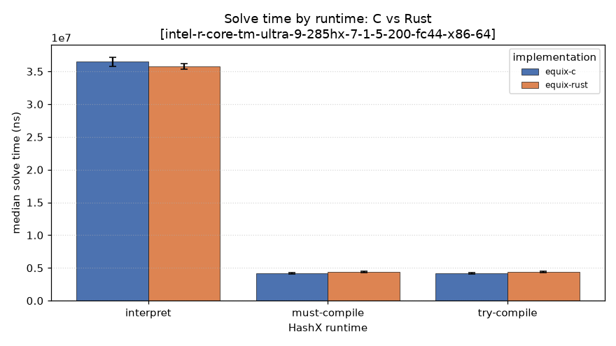

### Throughput

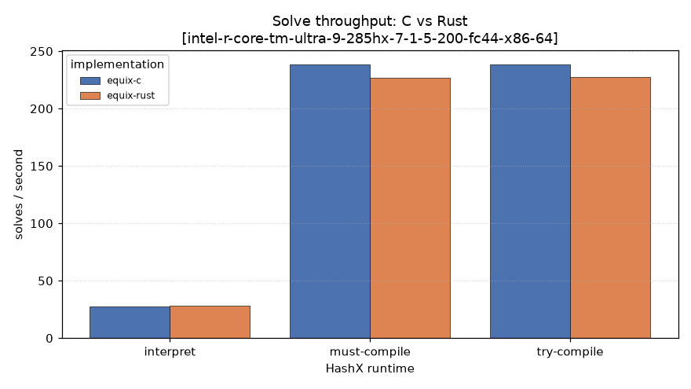

### Jit Speedup

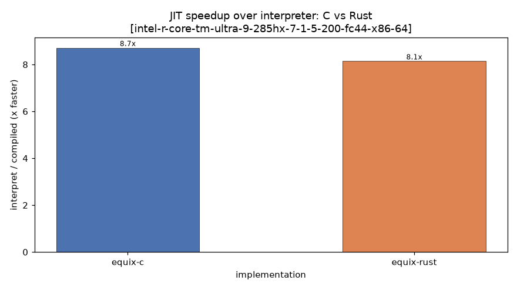

### Peak Rss

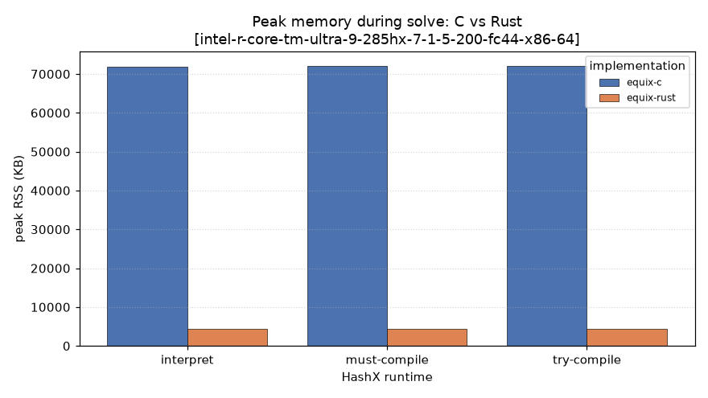

### Solve Distribution

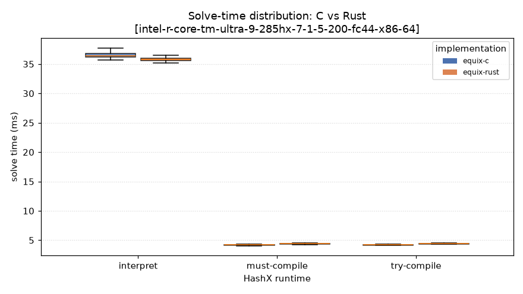

### Verify Time

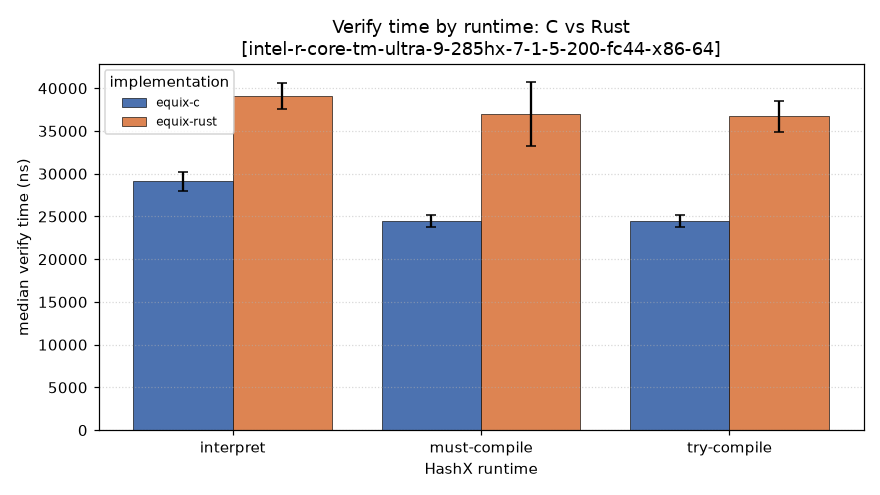

### Compile Overhead

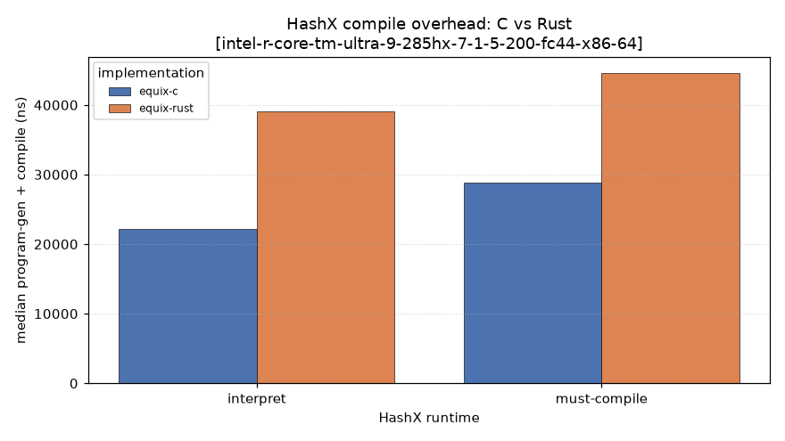

### Effort Attempts

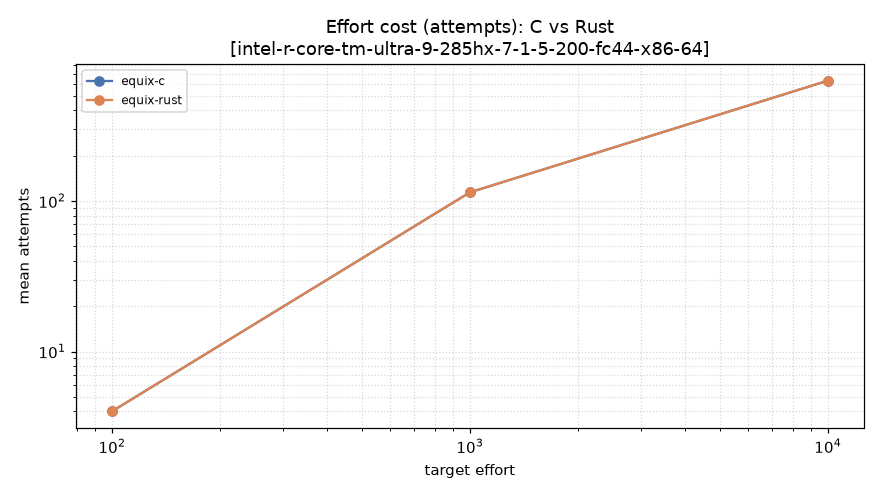

### Effort Time

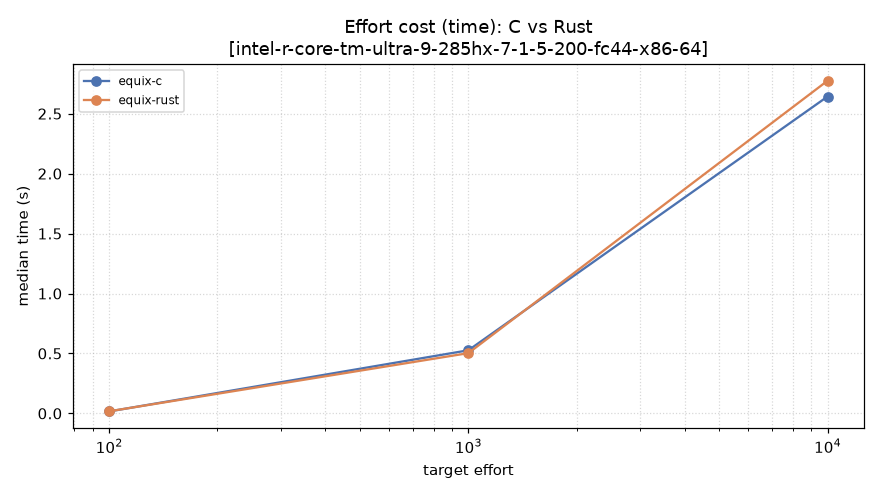

### Dos Protection

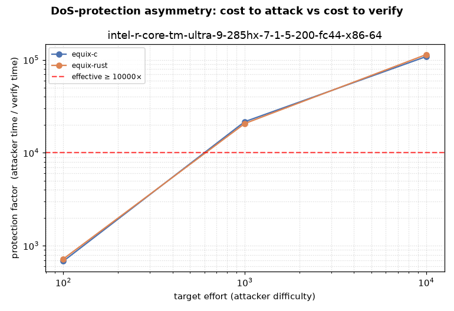

### Concurrency Solve

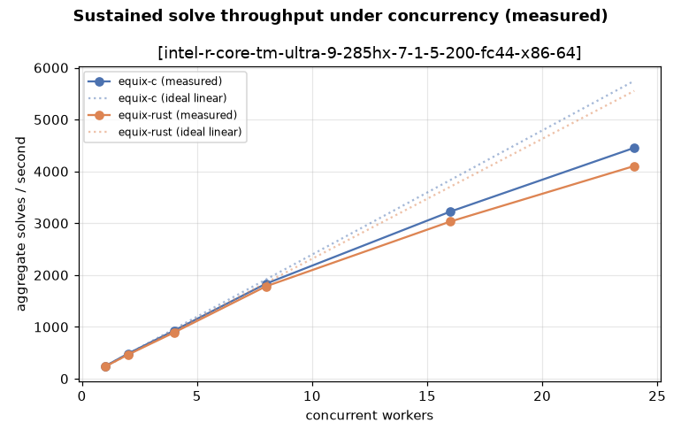

### Concurrency Verify

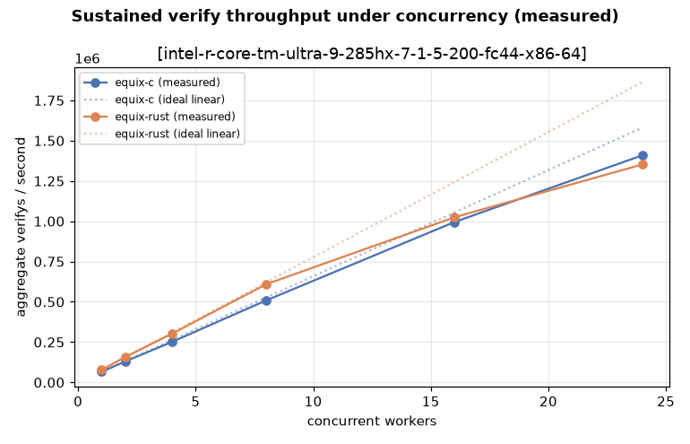

### Mining Rate

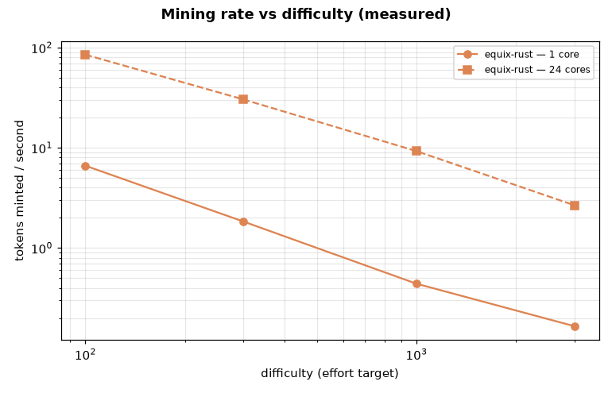

## solve results

| device | challenge | impl | runtime | median | p95 | solves/s | hashes/s | sols/solve | RSS(KB) |
|---|---|---|---|---|---|---|---|---|---|
| intel-r-core-tm-ultra-9-285hx-7-1-5-200-fc44-x86-64 | 0000000000000002 | equix-c | interpreted | 36.479 ms | 37.232 ms | 27.4 | 1,796,532 | 2.01 | 71912 |
| intel-r-core-tm-ultra-9-285hx-7-1-5-200-fc44-x86-64 | 0000000000000002 | equix-c | compiled | 4.191 ms | 4.264 ms | 238.6 | 15,637,189 | 2.01 | 72104 |
| intel-r-core-tm-ultra-9-285hx-7-1-5-200-fc44-x86-64 | 0000000000000002 | equix-c | compiled | 4.194 ms | 4.293 ms | 238.4 | 15,624,272 | 2.01 | 71912 |
| intel-r-core-tm-ultra-9-285hx-7-1-5-200-fc44-x86-64 | 0000000000000002 | equix-rust | interpreted | 35.696 ms | 36.070 ms | 28.0 | 1,835,950 | 2.01 | 4356 |
| intel-r-core-tm-ultra-9-285hx-7-1-5-200-fc44-x86-64 | 0000000000000002 | equix-rust | compiled | 4.390 ms | 4.479 ms | 227.8 | 14,926,927 | 2.01 | 4316 |
| intel-r-core-tm-ultra-9-285hx-7-1-5-200-fc44-x86-64 | 0000000000000002 | equix-rust | compiled | 4.395 ms | 4.485 ms | 227.5 | 14,912,471 | 2.01 | 4408 |
| intel-r-core-tm-ultra-9-285hx-7-1-5-200-fc44-x86-64 | 0102030405060708 | equix-c | interpreted | 36.311 ms | 36.679 ms | 27.5 | 1,804,850 | 2.17 | 71912 |
| intel-r-core-tm-ultra-9-285hx-7-1-5-200-fc44-x86-64 | 0102030405060708 | equix-c | compiled | 4.186 ms | 4.275 ms | 238.9 | 15,655,250 | 2.17 | 72296 |
| intel-r-core-tm-ultra-9-285hx-7-1-5-200-fc44-x86-64 | 0102030405060708 | equix-c | compiled | 4.189 ms | 4.262 ms | 238.7 | 15,646,086 | 2.17 | 72104 |
| intel-r-core-tm-ultra-9-285hx-7-1-5-200-fc44-x86-64 | 0102030405060708 | equix-rust | interpreted | 35.880 ms | 36.377 ms | 27.9 | 1,826,510 | 2.17 | 4384 |
| intel-r-core-tm-ultra-9-285hx-7-1-5-200-fc44-x86-64 | 0102030405060708 | equix-rust | compiled | 4.385 ms | 4.469 ms | 228.1 | 14,946,652 | 2.17 | 4400 |
| intel-r-core-tm-ultra-9-285hx-7-1-5-200-fc44-x86-64 | 0102030405060708 | equix-rust | compiled | 4.400 ms | 4.523 ms | 227.3 | 14,894,574 | 2.17 | 4260 |
| intel-r-core-tm-ultra-9-285hx-7-1-5-200-fc44-x86-64 | cafe | equix-c | interpreted | 36.208 ms | 36.897 ms | 27.6 | 1,809,974 | 1.98 | 71912 |
| intel-r-core-tm-ultra-9-285hx-7-1-5-200-fc44-x86-64 | cafe | equix-c | compiled | 4.186 ms | 4.276 ms | 238.9 | 15,657,373 | 1.98 | 72104 |
| intel-r-core-tm-ultra-9-285hx-7-1-5-200-fc44-x86-64 | cafe | equix-c | compiled | 4.177 ms | 4.273 ms | 239.4 | 15,688,817 | 1.98 | 72104 |
| intel-r-core-tm-ultra-9-285hx-7-1-5-200-fc44-x86-64 | cafe | equix-rust | interpreted | 35.918 ms | 36.322 ms | 27.8 | 1,824,602 | 1.98 | 4336 |
| intel-r-core-tm-ultra-9-285hx-7-1-5-200-fc44-x86-64 | cafe | equix-rust | compiled | 4.414 ms | 4.522 ms | 226.6 | 14,847,984 | 1.98 | 4304 |
| intel-r-core-tm-ultra-9-285hx-7-1-5-200-fc44-x86-64 | cafe | equix-rust | compiled | 4.395 ms | 4.477 ms | 227.5 | 14,911,587 | 1.98 | 4288 |
| intel-r-core-tm-ultra-9-285hx-7-1-5-200-fc44-x86-64 | deadbeef | equix-c | interpreted | 36.993 ms | 37.990 ms | 27.0 | 1,771,585 | 1.97 | 71912 |
| intel-r-core-tm-ultra-9-285hx-7-1-5-200-fc44-x86-64 | deadbeef | equix-c | compiled | 4.193 ms | 4.290 ms | 238.5 | 15,629,813 | 1.97 | 72104 |
| intel-r-core-tm-ultra-9-285hx-7-1-5-200-fc44-x86-64 | deadbeef | equix-c | compiled | 4.199 ms | 4.340 ms | 238.1 | 15,606,615 | 1.97 | 71912 |
| intel-r-core-tm-ultra-9-285hx-7-1-5-200-fc44-x86-64 | deadbeef | equix-rust | interpreted | 35.706 ms | 36.099 ms | 28.0 | 1,835,451 | 1.97 | 4348 |
| intel-r-core-tm-ultra-9-285hx-7-1-5-200-fc44-x86-64 | deadbeef | equix-rust | compiled | 4.437 ms | 4.532 ms | 225.4 | 14,770,743 | 1.97 | 4376 |
| intel-r-core-tm-ultra-9-285hx-7-1-5-200-fc44-x86-64 | deadbeef | equix-rust | compiled | 4.398 ms | 4.506 ms | 227.4 | 14,900,858 | 1.97 | 4336 |

## verify results

| device | challenge | impl | runtime | median | p95 | result | RSS(KB) |
|---|---|---|---|---|---|---|---|
| intel-r-core-tm-ultra-9-285hx-7-1-5-200-fc44-x86-64 | 0000000000000002 | equix-c | interpreted | 29.352 µs | 30.478 µs | OK | 72680 |
| intel-r-core-tm-ultra-9-285hx-7-1-5-200-fc44-x86-64 | 0000000000000002 | equix-c | compiled | 24.485 µs | 25.398 µs | OK | 73064 |
| intel-r-core-tm-ultra-9-285hx-7-1-5-200-fc44-x86-64 | 0000000000000002 | equix-c | compiled | 24.532 µs | 25.137 µs | OK | 72872 |
| intel-r-core-tm-ultra-9-285hx-7-1-5-200-fc44-x86-64 | 0000000000000002 | equix-rust | interpreted | 39.005 µs | 40.165 µs | OK | 4396 |
| intel-r-core-tm-ultra-9-285hx-7-1-5-200-fc44-x86-64 | 0000000000000002 | equix-rust | compiled | 37.090 µs | 38.557 µs | OK | 4324 |
| intel-r-core-tm-ultra-9-285hx-7-1-5-200-fc44-x86-64 | 0000000000000002 | equix-rust | compiled | 36.711 µs | 38.094 µs | OK | 4336 |
| intel-r-core-tm-ultra-9-285hx-7-1-5-200-fc44-x86-64 | cafe | equix-c | interpreted | 29.243 µs | 30.475 µs | OK | 72872 |
| intel-r-core-tm-ultra-9-285hx-7-1-5-200-fc44-x86-64 | cafe | equix-c | compiled | 24.453 µs | 25.206 µs | OK | 73064 |
| intel-r-core-tm-ultra-9-285hx-7-1-5-200-fc44-x86-64 | cafe | equix-c | compiled | 24.373 µs | 25.162 µs | OK | 72872 |
| intel-r-core-tm-ultra-9-285hx-7-1-5-200-fc44-x86-64 | cafe | equix-rust | interpreted | 39.194 µs | 40.806 µs | OK | 4360 |
| intel-r-core-tm-ultra-9-285hx-7-1-5-200-fc44-x86-64 | cafe | equix-rust | compiled | 37.218 µs | 44.864 µs | OK | 4432 |
| intel-r-core-tm-ultra-9-285hx-7-1-5-200-fc44-x86-64 | cafe | equix-rust | compiled | 36.584 µs | 38.682 µs | OK | 4412 |
| intel-r-core-tm-ultra-9-285hx-7-1-5-200-fc44-x86-64 | deadbeef | equix-c | interpreted | 28.764 µs | 29.799 µs | OK | 72680 |
| intel-r-core-tm-ultra-9-285hx-7-1-5-200-fc44-x86-64 | deadbeef | equix-c | compiled | 24.525 µs | 24.940 µs | OK | 72872 |
| intel-r-core-tm-ultra-9-285hx-7-1-5-200-fc44-x86-64 | deadbeef | equix-c | compiled | 24.547 µs | 25.130 µs | OK | 72872 |
| intel-r-core-tm-ultra-9-285hx-7-1-5-200-fc44-x86-64 | deadbeef | equix-rust | interpreted | 39.039 µs | 40.843 µs | OK | 4344 |
| intel-r-core-tm-ultra-9-285hx-7-1-5-200-fc44-x86-64 | deadbeef | equix-rust | compiled | 36.691 µs | 38.922 µs | OK | 4300 |
| intel-r-core-tm-ultra-9-285hx-7-1-5-200-fc44-x86-64 | deadbeef | equix-rust | compiled | 36.826 µs | 38.804 µs | OK | 4400 |

## hashx_compile results

| device | challenge | impl | runtime | median compile | median exec | RSS(KB) |
|---|---|---|---|---|---|---|
| intel-r-core-tm-ultra-9-285hx-7-1-5-200-fc44-x86-64 | 0102030405060708 | equix-c | interpreted | 24.858 µs | 2.930 µs | 73448 |
| intel-r-core-tm-ultra-9-285hx-7-1-5-200-fc44-x86-64 | 0102030405060708 | equix-c | compiled | 28.561 µs | 155 ns | 73448 |
| intel-r-core-tm-ultra-9-285hx-7-1-5-200-fc44-x86-64 | 0102030405060708 | equix-rust | interpreted | 38.767 µs | 2.882 µs | 2476 |
| intel-r-core-tm-ultra-9-285hx-7-1-5-200-fc44-x86-64 | 0102030405060708 | equix-rust | compiled | 44.692 µs | 176 ns | 2460 |
| intel-r-core-tm-ultra-9-285hx-7-1-5-200-fc44-x86-64 | deadbeef | equix-c | interpreted | 19.529 µs | 2.554 µs | 73448 |
| intel-r-core-tm-ultra-9-285hx-7-1-5-200-fc44-x86-64 | deadbeef | equix-c | compiled | 29.149 µs | 144 ns | 73448 |
| intel-r-core-tm-ultra-9-285hx-7-1-5-200-fc44-x86-64 | deadbeef | equix-rust | interpreted | 39.304 µs | 2.865 µs | 2432 |
| intel-r-core-tm-ultra-9-285hx-7-1-5-200-fc44-x86-64 | deadbeef | equix-rust | compiled | 44.584 µs | 185 ns | 2476 |

## effort results

| device | base | target | impl | runtime | mean attempts | median time | mean achieved |
|---|---|---|---|---|---|---|---|
| intel-r-core-tm-ultra-9-285hx-7-1-5-200-fc44-x86-64 | abcd | 10000 | equix-c | compiled | 629.0 | 2.643 s | 11898 |
| intel-r-core-tm-ultra-9-285hx-7-1-5-200-fc44-x86-64 | abcd | 10000 | equix-rust | compiled | 629.0 | 2.775 s | 11898 |
| intel-r-core-tm-ultra-9-285hx-7-1-5-200-fc44-x86-64 | abcd | 1000 | equix-c | compiled | 114.0 | 526.612 ms | 1922 |
| intel-r-core-tm-ultra-9-285hx-7-1-5-200-fc44-x86-64 | abcd | 1000 | equix-rust | compiled | 114.0 | 502.878 ms | 1922 |
| intel-r-core-tm-ultra-9-285hx-7-1-5-200-fc44-x86-64 | abcd | 100 | equix-c | compiled | 4.0 | 16.627 ms | 141 |
| intel-r-core-tm-ultra-9-285hx-7-1-5-200-fc44-x86-64 | abcd | 100 | equix-rust | compiled | 4.0 | 17.578 ms | 141 |

---
_See `results.csv` for the full flat dataset and `raw/results.json` for per-rep data._