# Equi-X Benchmark Report

- Generated: 2026-07-28T10:25:17+00:00
- Config: `configs/full.toml`
- Devices (CPUs): apple-m4-pro-25-5-0
    - `apple-m4-pro-25-5-0`: Apple M4 Pro (aarch64, cpu)
- `equix-c`: version 1.0.0, commit b7bb7d9, built with clang-21.0.0 (clang-2100.1.1.101)
- `equix-rust`: version 0.7.0, commit crate-0.7.0, built with rustc

## Correctness cross-check (interop gate)

**Overall: PASS ✅**

| kind | detail | result |
|------|--------|--------|
| interop | equix-c->equix-rust: all 4 solutions for deadbeef verify OK | PASS |
| interop | equix-c->equix-rust: all 2 solutions for cafe verify OK | PASS |
| interop | equix-c->equix-rust: all 3 solutions for 0000000000000002 verify OK | PASS |
| interop | equix-rust->equix-c: all 4 solutions for deadbeef verify OK | PASS |
| interop | equix-rust->equix-c: all 2 solutions for cafe verify OK | PASS |
| interop | equix-rust->equix-c: all 3 solutions for 0000000000000002 verify OK | PASS |
| effort-agreement | effort (attempts, achieved) across impls: {'equix-c': (114, 1922), 'equix-rust': (114, 1922)} -- AGREE | PASS |

## DoS-protection effectiveness (this system)

Equi-X defends by making requesters *solve* (expensive) while the service only *verifies* (cheap). Protection factor = measured attacker time to craft one accepted token at a given effort ÷ measured verify time. Judged **effective** when ≥ 10000× on every measured point.

**Verdict: EFFECTIVE ✅** (effective from — `apple-m4-pro-25-5-0`: effort ≥ 1000).

At effort 10000, an attacker needs ~2.9s (impl `equix-rust`) to craft one accepted request, while the defender verifies in ~26.62µs (**108,966×** asymmetry; one core screens ~37,559 requests/s vs the attacker's ~0.34 tokens/s).

| device | effort | attacker time/token | attacker impl | verify time | protection factor | verify/s | attacker tokens/s |
|---|---|---|---|---|---|---|---|
| apple-m4-pro-25-5-0 | 100 | 18.246 ms | equix-rust | 26.625 µs | 685× | 37,559 | 54.806 |
| apple-m4-pro-25-5-0 | 1000 | 529.609 ms | equix-rust | 26.625 µs | 19,892× | 37,559 | 1.888 |
| apple-m4-pro-25-5-0 | 10000 | 2.901 s | equix-rust | 26.625 µs | 108,966× | 37,559 | 0.345 |

## Sustained throughput under concurrency (measured)

The DoS section above reports **per-core** capacity as 1/latency from a single serial op. This section instead **measures** aggregate throughput with *N* worker processes running at once (N stepping up to the core count), so it captures real memory-bandwidth contention. It is additive — the per-core figures above are unchanged.

Measured on up to **14** concurrent workers. *Peak* is the best aggregate ops/s observed; *knee* is the worker count where it peaks (adding workers past it stops helping). *Naïve N×* is the per-core figure multiplied by the core count — what a linear extrapolation would (over)predict; the *efficiency* column is measured peak ÷ naïve N×.

| impl | operation | 1 worker (per-core) | knee | measured peak | naïve N× | scaling efficiency |
|---|---|---|---|---|---|---|
| equix-c | solve | 25 ops/s | 14 workers | **276 ops/s** | 351 ops/s | 79% |
| equix-rust | solve | 218 ops/s | 14 workers | **2,853 ops/s** | 3,053 ops/s | 93% |
| equix-c | verify | 54,918 ops/s | 14 workers | **734,306 ops/s** | 768,851 ops/s | 96% |
| equix-rust | verify | 57,143 ops/s | 14 workers | **633,887 ops/s** | 800,000 ops/s | 79% |

### solve: throughput vs. concurrency

| impl | workers | ok | aggregate ops/s | per-worker ops/s | scaling eff. | peak RSS |
|---|---|---|---|---|---|---|
| equix-c | 1 | 1 | 25 | 25 | 100% | 3 MB |
| equix-c | 2 | 2 | 49 | 24 | 97% | 7 MB |
| equix-c | 4 | 4 | 93 | 23 | 93% | 13 MB |
| equix-c | 8 | 8 | 185 | 23 | 92% | 26 MB |
| equix-c | 14 | 14 | 276 | 20 | 79% | 46 MB |
| equix-rust | 1 | 1 | 218 | 218 | 100% | 4 MB |
| equix-rust | 2 | 2 | 431 | 215 | 99% | 7 MB |
| equix-rust | 4 | 4 | 845 | 211 | 97% | 15 MB |
| equix-rust | 8 | 8 | 1,658 | 207 | 95% | 29 MB |
| equix-rust | 14 | 14 | 2,853 | 204 | 93% | 51 MB |

### verify: throughput vs. concurrency

| impl | workers | ok | aggregate ops/s | per-worker ops/s | scaling eff. | peak RSS |
|---|---|---|---|---|---|---|
| equix-c | 1 | 1 | 54,918 | 54,918 | 100% | 3 MB |
| equix-c | 2 | 2 | 108,354 | 54,177 | 99% | 6 MB |
| equix-c | 4 | 4 | 213,693 | 53,423 | 97% | 11 MB |
| equix-c | 8 | 8 | 424,195 | 53,024 | 97% | 22 MB |
| equix-c | 14 | 14 | 734,306 | 52,450 | 96% | 39 MB |
| equix-rust | 1 | 1 | 57,143 | 57,143 | 100% | 4 MB |
| equix-rust | 2 | 2 | 111,630 | 55,815 | 98% | 9 MB |
| equix-rust | 4 | 4 | 198,553 | 49,638 | 87% | 18 MB |
| equix-rust | 8 | 8 | 380,671 | 47,584 | 83% | 36 MB |
| equix-rust | 14 | 14 | 633,887 | 45,278 | 79% | 62 MB |

## Mining rate vs difficulty (measured)

How many effort-qualified tokens can be minted per second at a given difficulty. The **whole-machine** rate is the reliable figure: it averages one streaming search per core over independent nonce ranges. Per-core is that rate divided by the core count (token-find time is heavy-tailed, so the separately-sampled single-core mean is noisier and can even exceed the machine rate ÷ cores at low sample counts — prefer the derived per-core). Mint rate falls ~1/effort, so difficulty sets the rate directly.

**`equix-rust`** on `apple-m4-pro-25-5-0` (base `abcd`), whole-machine = 14 cores:

| difficulty (effort) | mean attempts/token | tokens/s [14 cores] | tokens/s [1 core, ÷14] |
|---|---|---|---|
| 100 | 42 | **54.01** | 3.858 |
| 300 | 133 | **17.90** | 1.278 |
| 1000 | 473 | **5.55** | 0.396 |
| 3000 | 1,486 | **1.62** | 0.116 |

**Message sizes (measured from every minted token):** 
E=100: solution 16 B + nonce 8 B; E=300: solution 16 B + nonce 8 B; E=1000: solution 16 B + nonce 8 B; E=3000: solution 16 B + nonce 8 B.
Token size is **constant in difficulty**: every token at every measured E is exactly 16 B solution + 8 B nonce — raising E raises solve cost, never message size.

> Over a 30× rise in difficulty (100→3000), the machine mint rate fell 33× — ~1/effort, so halving the target roughly doubles the mint rate.

## Comparison plots (every plot compares C vs Rust; with multiple CPUs each plot is faceted per CPU and `xdev_*` charts compare CPUs directly)

### Solve Time By Runtime

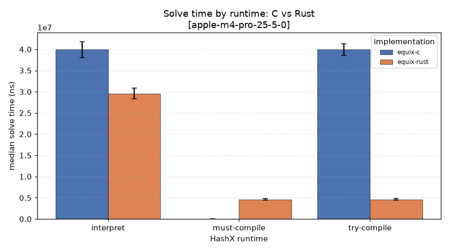

### Throughput

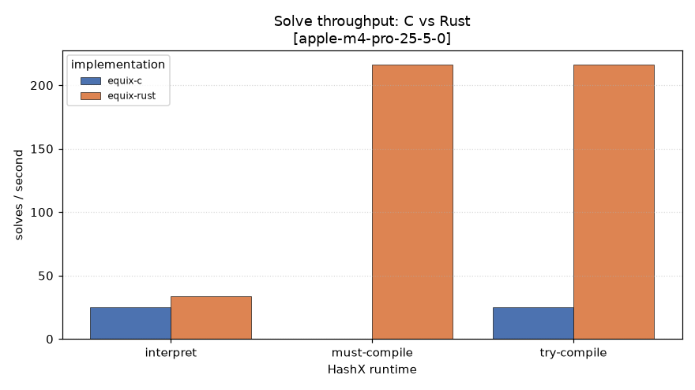

### Jit Speedup

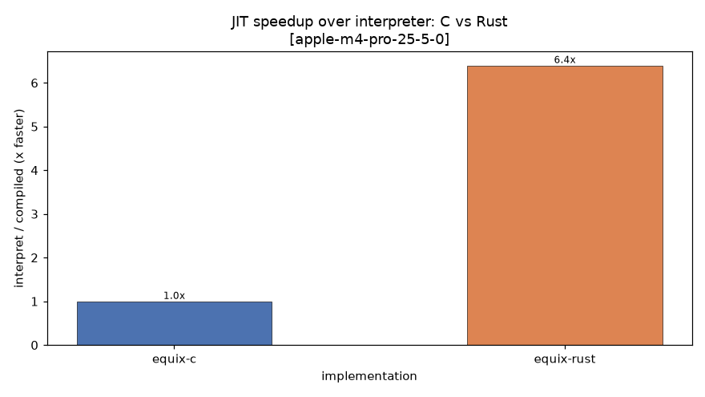

### Peak Rss

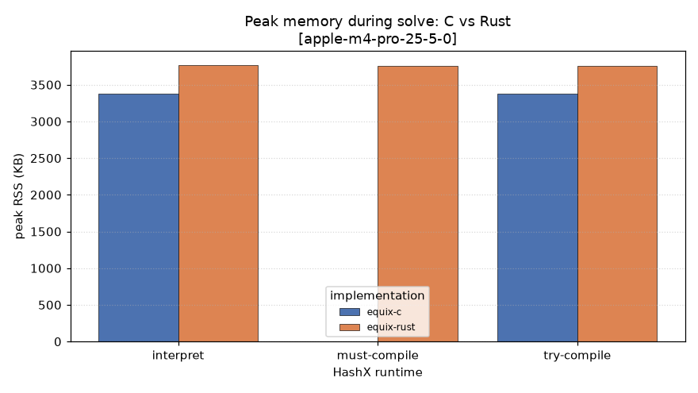

### Solve Distribution

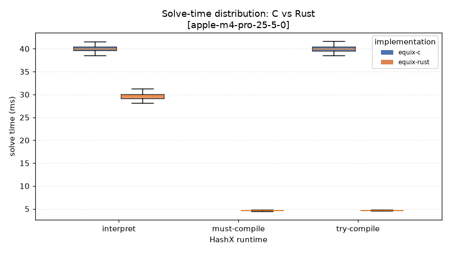

### Verify Time

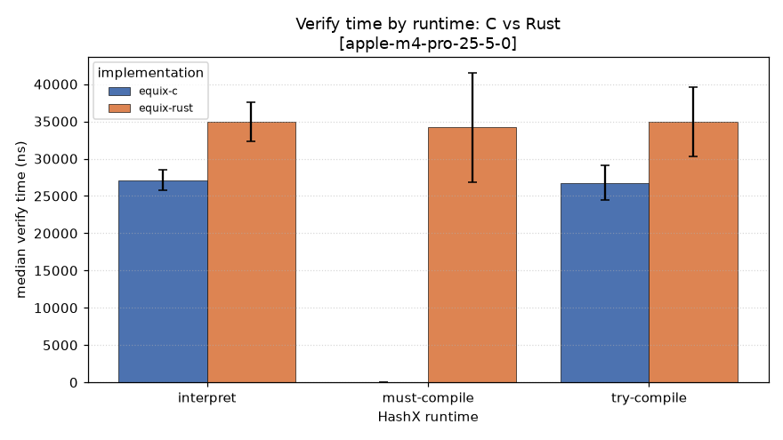

### Compile Overhead

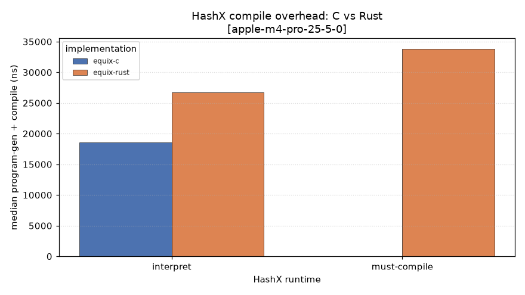

### Effort Attempts

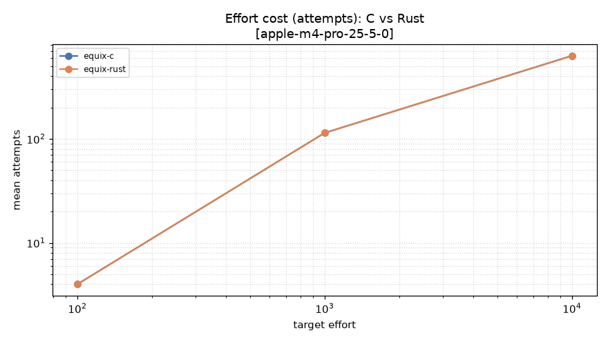

### Effort Time

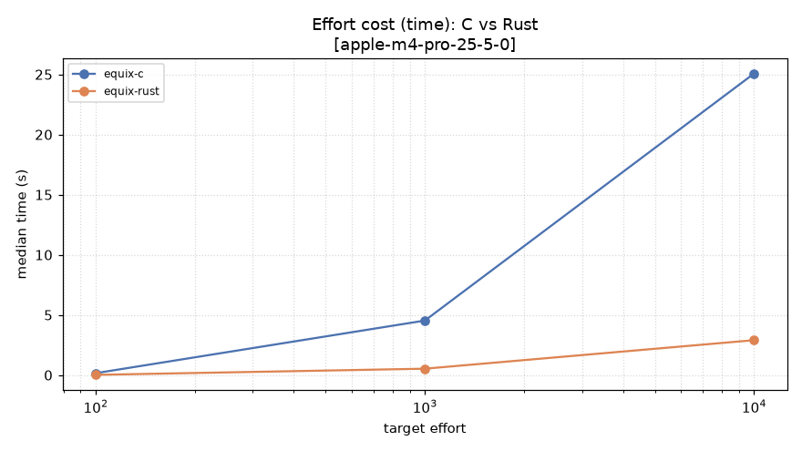

### Dos Protection

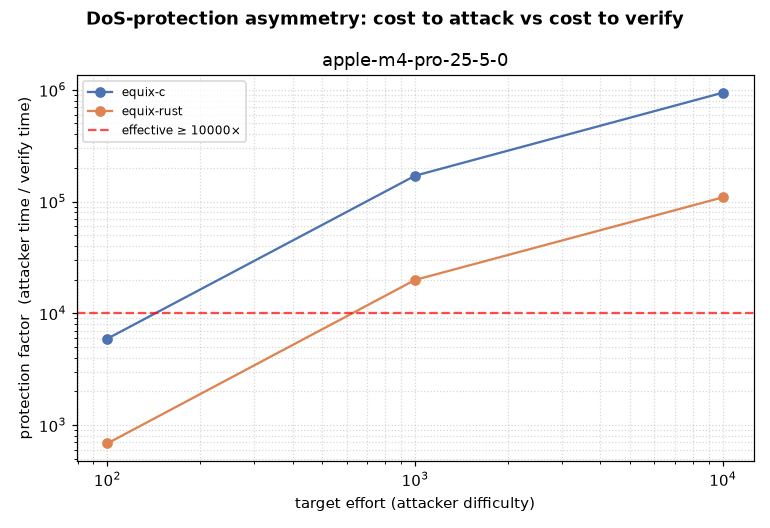

### Concurrency Solve

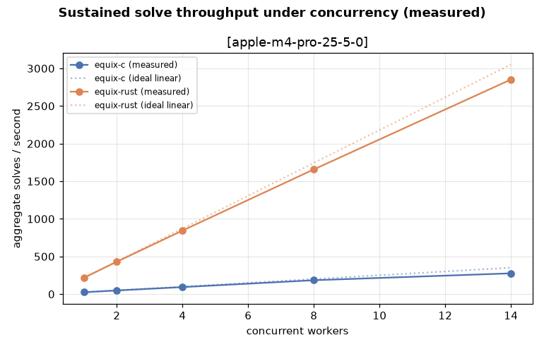

### Concurrency Verify

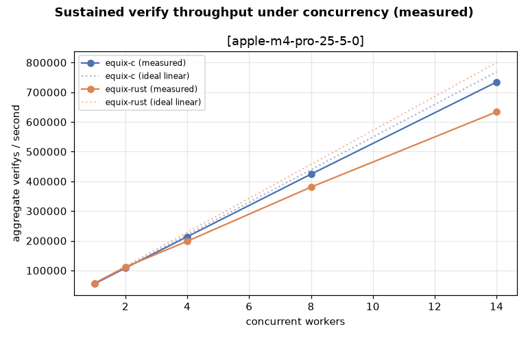

### Mining Rate

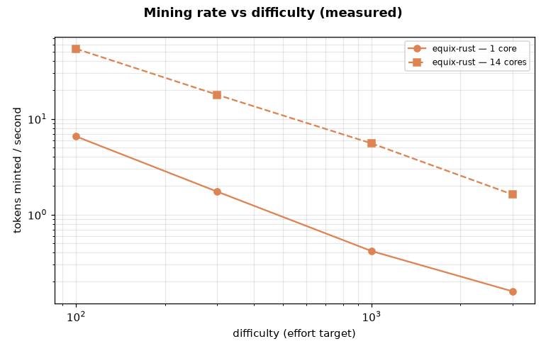

## solve results

| device | challenge | impl | runtime | median | p95 | solves/s | hashes/s | sols/solve | RSS(KB) |
|---|---|---|---|---|---|---|---|---|---|
| apple-m4-pro-25-5-0 | 0000000000000002 | equix-c | interpreted | 39.795 ms | 40.876 ms | 25.1 | 1,646,839 | 2.01 | 3376 |
| apple-m4-pro-25-5-0 | 0000000000000002 | equix-c | None | 0 ns | 0 ns | 0.0 | 0 | 0.00 | 1440 |
| apple-m4-pro-25-5-0 | 0000000000000002 | equix-c | interpreted (fallback) | 39.849 ms | 41.056 ms | 25.1 | 1,644,624 | 2.01 | 3376 |
| apple-m4-pro-25-5-0 | 0000000000000002 | equix-rust | interpreted | 29.525 ms | 30.942 ms | 33.9 | 2,219,659 | 2.01 | 3760 |
| apple-m4-pro-25-5-0 | 0000000000000002 | equix-rust | compiled | 4.628 ms | 4.746 ms | 216.1 | 14,161,653 | 2.01 | 3744 |
| apple-m4-pro-25-5-0 | 0000000000000002 | equix-rust | compiled | 4.610 ms | 4.721 ms | 216.9 | 14,215,283 | 2.01 | 3744 |
| apple-m4-pro-25-5-0 | 0102030405060708 | equix-c | interpreted | 40.109 ms | 44.323 ms | 24.9 | 1,633,943 | 2.17 | 3376 |
| apple-m4-pro-25-5-0 | 0102030405060708 | equix-c | None | 0 ns | 0 ns | 0.0 | 0 | 0.00 | 1440 |
| apple-m4-pro-25-5-0 | 0102030405060708 | equix-c | interpreted (fallback) | 40.144 ms | 41.151 ms | 24.9 | 1,632,504 | 2.17 | 3376 |
| apple-m4-pro-25-5-0 | 0102030405060708 | equix-rust | interpreted | 29.600 ms | 30.640 ms | 33.8 | 2,214,021 | 2.17 | 3760 |
| apple-m4-pro-25-5-0 | 0102030405060708 | equix-rust | compiled | 4.606 ms | 4.728 ms | 217.1 | 14,227,561 | 2.17 | 3760 |
| apple-m4-pro-25-5-0 | 0102030405060708 | equix-rust | compiled | 4.608 ms | 4.708 ms | 217.0 | 14,222,801 | 2.17 | 3744 |
| apple-m4-pro-25-5-0 | cafe | equix-c | interpreted | 39.930 ms | 41.032 ms | 25.0 | 1,641,272 | 1.98 | 3376 |
| apple-m4-pro-25-5-0 | cafe | equix-c | None | 0 ns | 0 ns | 0.0 | 0 | 0.00 | 1440 |
| apple-m4-pro-25-5-0 | cafe | equix-c | interpreted (fallback) | 40.077 ms | 42.201 ms | 25.0 | 1,635,243 | 1.98 | 3376 |
| apple-m4-pro-25-5-0 | cafe | equix-rust | interpreted | 29.733 ms | 30.856 ms | 33.6 | 2,204,139 | 1.98 | 3792 |
| apple-m4-pro-25-5-0 | cafe | equix-rust | compiled | 4.618 ms | 4.753 ms | 216.6 | 14,192,514 | 1.98 | 3760 |
| apple-m4-pro-25-5-0 | cafe | equix-rust | compiled | 4.645 ms | 4.971 ms | 215.3 | 14,109,504 | 1.98 | 3760 |
| apple-m4-pro-25-5-0 | deadbeef | equix-c | interpreted | 39.902 ms | 41.081 ms | 25.1 | 1,642,432 | 1.97 | 3376 |
| apple-m4-pro-25-5-0 | deadbeef | equix-c | None | 0 ns | 0 ns | 0.0 | 0 | 0.00 | 1440 |
| apple-m4-pro-25-5-0 | deadbeef | equix-c | interpreted (fallback) | 39.801 ms | 41.001 ms | 25.1 | 1,646,573 | 1.97 | 3376 |
| apple-m4-pro-25-5-0 | deadbeef | equix-rust | interpreted | 29.508 ms | 31.168 ms | 33.9 | 2,220,948 | 1.97 | 3776 |
| apple-m4-pro-25-5-0 | deadbeef | equix-rust | compiled | 4.624 ms | 4.864 ms | 216.3 | 14,172,692 | 1.97 | 3760 |
| apple-m4-pro-25-5-0 | deadbeef | equix-rust | compiled | 4.640 ms | 4.758 ms | 215.5 | 14,122,870 | 1.97 | 3760 |

## verify results

| device | challenge | impl | runtime | median | p95 | result | RSS(KB) |
|---|---|---|---|---|---|---|---|
| apple-m4-pro-25-5-0 | 0000000000000002 | equix-c | interpreted | 27.438 µs | 28.834 µs | OK | 3376 |
| apple-m4-pro-25-5-0 | 0000000000000002 | equix-c | None | 0 ns | 0 ns | None | 1440 |
| apple-m4-pro-25-5-0 | 0000000000000002 | equix-c | interpreted (fallback) | 26.958 µs | 31.042 µs | OK | 3376 |
| apple-m4-pro-25-5-0 | 0000000000000002 | equix-rust | interpreted | 35.792 µs | 37.500 µs | OK | 3744 |
| apple-m4-pro-25-5-0 | 0000000000000002 | equix-rust | compiled | 34.645 µs | 45.500 µs | OK | 3744 |
| apple-m4-pro-25-5-0 | 0000000000000002 | equix-rust | compiled | 34.750 µs | 41.625 µs | OK | 3744 |
| apple-m4-pro-25-5-0 | cafe | equix-c | interpreted | 27.021 µs | 28.000 µs | OK | 3376 |
| apple-m4-pro-25-5-0 | cafe | equix-c | None | 0 ns | 0 ns | None | 1440 |
| apple-m4-pro-25-5-0 | cafe | equix-c | interpreted (fallback) | 26.750 µs | 28.417 µs | OK | 3376 |
| apple-m4-pro-25-5-0 | cafe | equix-rust | interpreted | 33.666 µs | 37.667 µs | OK | 3792 |
| apple-m4-pro-25-5-0 | cafe | equix-rust | compiled | 33.521 µs | 38.500 µs | OK | 3744 |
| apple-m4-pro-25-5-0 | cafe | equix-rust | compiled | 35.313 µs | 39.208 µs | OK | 3744 |
| apple-m4-pro-25-5-0 | deadbeef | equix-c | interpreted | 26.917 µs | 28.708 µs | OK | 3376 |
| apple-m4-pro-25-5-0 | deadbeef | equix-c | None | 0 ns | 0 ns | None | 1440 |
| apple-m4-pro-25-5-0 | deadbeef | equix-c | interpreted (fallback) | 26.625 µs | 27.792 µs | OK | 3376 |
| apple-m4-pro-25-5-0 | deadbeef | equix-rust | interpreted | 35.396 µs | 37.625 µs | OK | 3760 |
| apple-m4-pro-25-5-0 | deadbeef | equix-rust | compiled | 34.375 µs | 40.667 µs | OK | 3744 |
| apple-m4-pro-25-5-0 | deadbeef | equix-rust | compiled | 34.875 µs | 38.125 µs | OK | 3744 |

## hashx_compile results

| device | challenge | impl | runtime | median compile | median exec | RSS(KB) |
|---|---|---|---|---|---|---|
| apple-m4-pro-25-5-0 | 0102030405060708 | equix-c | interpreted | 18.833 µs | 2.729 µs | 1504 |
| apple-m4-pro-25-5-0 | 0102030405060708 | equix-c | None | 0 ns | 0 ns | 1440 |
| apple-m4-pro-25-5-0 | 0102030405060708 | equix-rust | interpreted | 25.687 µs | 2.708 µs | 1856 |
| apple-m4-pro-25-5-0 | 0102030405060708 | equix-rust | compiled | 35.125 µs | 3.250 µs | 1856 |
| apple-m4-pro-25-5-0 | deadbeef | equix-c | interpreted | 18.375 µs | 2.625 µs | 1504 |
| apple-m4-pro-25-5-0 | deadbeef | equix-c | None | 0 ns | 0 ns | 1440 |
| apple-m4-pro-25-5-0 | deadbeef | equix-rust | interpreted | 27.750 µs | 2.854 µs | 1856 |
| apple-m4-pro-25-5-0 | deadbeef | equix-rust | compiled | 32.584 µs | 2.708 µs | 1856 |

## effort results

| device | base | target | impl | runtime | mean attempts | median time | mean achieved |
|---|---|---|---|---|---|---|---|
| apple-m4-pro-25-5-0 | abcd | 10000 | equix-c | interpreted (fallback) | 629.0 | 25.072 s | 11898 |
| apple-m4-pro-25-5-0 | abcd | 10000 | equix-rust | compiled | 629.0 | 2.901 s | 11898 |
| apple-m4-pro-25-5-0 | abcd | 1000 | equix-c | interpreted (fallback) | 114.0 | 4.532 s | 1922 |
| apple-m4-pro-25-5-0 | abcd | 1000 | equix-rust | compiled | 114.0 | 529.610 ms | 1922 |
| apple-m4-pro-25-5-0 | abcd | 100 | equix-c | interpreted (fallback) | 4.0 | 157.840 ms | 141 |
| apple-m4-pro-25-5-0 | abcd | 100 | equix-rust | compiled | 4.0 | 18.246 ms | 141 |

---
_See `results.csv` for the full flat dataset and `raw/results.json` for per-rep data._