# Equi-X Benchmark Report

- Generated: 2026-07-28T11:07:37+00:00
- Config: `configs/full.toml`
- Devices (CPUs): raspberry-pi-5-model-b-rev-1-1-6-18-34-rpt-rpi-2712
    - `raspberry-pi-5-model-b-rev-1-1-6-18-34-rpt-rpi-2712`: Raspberry Pi 5 Model B Rev 1.1 (aarch64, cpu)
- `equix-c`: version 1.0.0, commit b7bb7d9, built with gcc-14.2.0
- `equix-rust`: version 0.7.0, commit crate-0.7.0, built with rustc

## Correctness cross-check (interop gate)

**Overall: PASS ✅**

| kind | detail | result |
|------|--------|--------|
| interop | equix-c->equix-rust: all 4 solutions for deadbeef verify OK | PASS |
| interop | equix-c->equix-rust: all 2 solutions for cafe verify OK | PASS |
| interop | equix-c->equix-rust: all 3 solutions for 0000000000000002 verify OK | PASS |
| interop | equix-rust->equix-c: all 4 solutions for deadbeef verify OK | PASS |
| interop | equix-rust->equix-c: all 2 solutions for cafe verify OK | PASS |
| interop | equix-rust->equix-c: all 3 solutions for 0000000000000002 verify OK | PASS |
| effort-agreement | effort (attempts, achieved) across impls: {'equix-c': (114, 1922), 'equix-rust': (114, 1922)} -- AGREE | PASS |

## DoS-protection effectiveness (this system)

Equi-X defends by making requesters *solve* (expensive) while the service only *verifies* (cheap). Protection factor = measured attacker time to craft one accepted token at a given effort ÷ measured verify time. Judged **effective** when ≥ 10000× on every measured point.

**Verdict: EFFECTIVE ✅** (effective from — `raspberry-pi-5-model-b-rev-1-1-6-18-34-rpt-rpi-2712`: effort ≥ 1000).

At effort 10000, an attacker needs ~13.3s (impl `equix-rust`) to craft one accepted request, while the defender verifies in ~54.68µs (**242,625×** asymmetry; one core screens ~18,290 requests/s vs the attacker's ~0.08 tokens/s).

| device | effort | attacker time/token | attacker impl | verify time | protection factor | verify/s | attacker tokens/s |
|---|---|---|---|---|---|---|---|
| raspberry-pi-5-model-b-rev-1-1-6-18-34-rpt-rpi-2712 | 100 | 84.146 ms | equix-rust | 54.675 µs | 1,539× | 18,290 | 11.884 |
| raspberry-pi-5-model-b-rev-1-1-6-18-34-rpt-rpi-2712 | 1000 | 2.404 s | equix-rust | 54.675 µs | 43,973× | 18,290 | 0.416 |
| raspberry-pi-5-model-b-rev-1-1-6-18-34-rpt-rpi-2712 | 10000 | 13.266 s | equix-rust | 54.675 µs | 242,625× | 18,290 | 0.075 |

## Sustained throughput under concurrency (measured)

The DoS section above reports **per-core** capacity as 1/latency from a single serial op. This section instead **measures** aggregate throughput with *N* worker processes running at once (N stepping up to the core count), so it captures real memory-bandwidth contention. It is additive — the per-core figures above are unchanged.

Measured on up to **4** concurrent workers. *Peak* is the best aggregate ops/s observed; *knee* is the worker count where it peaks (adding workers past it stops helping). *Naïve N×* is the per-core figure multiplied by the core count — what a linear extrapolation would (over)predict; the *efficiency* column is measured peak ÷ naïve N×.

| impl | operation | 1 worker (per-core) | knee | measured peak | naïve N× | scaling efficiency |
|---|---|---|---|---|---|---|
| equix-c | solve | 47 ops/s | 4 workers | **187 ops/s** | 189 ops/s | 99% |
| equix-rust | solve | 47 ops/s | 4 workers | **186 ops/s** | 190 ops/s | 98% |
| equix-c | verify | 23,509 ops/s | 4 workers | **92,931 ops/s** | 94,036 ops/s | 99% |
| equix-rust | verify | 18,336 ops/s | 4 workers | **69,357 ops/s** | 73,345 ops/s | 95% |

### solve: throughput vs. concurrency

| impl | workers | ok | aggregate ops/s | per-worker ops/s | scaling eff. | peak RSS |
|---|---|---|---|---|---|---|
| equix-c | 1 | 1 | 47 | 47 | 100% | 69 MB |
| equix-c | 2 | 2 | 94 | 47 | 100% | 137 MB |
| equix-c | 4 | 4 | 187 | 47 | 99% | 275 MB |
| equix-rust | 1 | 1 | 47 | 47 | 100% | 4 MB |
| equix-rust | 2 | 2 | 95 | 47 | 100% | 8 MB |
| equix-rust | 4 | 4 | 186 | 46 | 98% | 15 MB |

### verify: throughput vs. concurrency

| impl | workers | ok | aggregate ops/s | per-worker ops/s | scaling eff. | peak RSS |
|---|---|---|---|---|---|---|
| equix-c | 1 | 1 | 23,509 | 23,509 | 100% | 69 MB |
| equix-c | 2 | 2 | 47,113 | 23,556 | 100% | 156 MB |
| equix-c | 4 | 4 | 92,931 | 23,233 | 99% | 343 MB |
| equix-rust | 1 | 1 | 18,336 | 18,336 | 100% | 3 MB |
| equix-rust | 2 | 2 | 35,828 | 17,914 | 98% | 6 MB |
| equix-rust | 4 | 4 | 69,357 | 17,339 | 95% | 11 MB |

## Mining rate vs difficulty (measured)

How many effort-qualified tokens can be minted per second at a given difficulty. The **whole-machine** rate is the reliable figure: it averages one streaming search per core over independent nonce ranges. Per-core is that rate divided by the core count (token-find time is heavy-tailed, so the separately-sampled single-core mean is noisier and can even exceed the machine rate ÷ cores at low sample counts — prefer the derived per-core). Mint rate falls ~1/effort, so difficulty sets the rate directly.

**`equix-rust`** on `raspberry-pi-5-model-b-rev-1-1-6-18-34-rpt-rpi-2712` (base `abcd`), whole-machine = 4 cores:

| difficulty (effort) | mean attempts/token | tokens/s [4 cores] | tokens/s [1 core, ÷4] |
|---|---|---|---|
| 100 | 35 | **4.47** | 1.118 |
| 300 | 125 | **1.40** | 0.350 |
| 1000 | 494 | **0.43** | 0.106 |
| 3000 | 1,288 | **0.17** | 0.043 |

**Message sizes (measured from every minted token):** 
E=100: solution 16 B + nonce 8 B; E=300: solution 16 B + nonce 8 B; E=1000: solution 16 B + nonce 8 B; E=3000: solution 16 B + nonce 8 B.
Token size is **constant in difficulty**: every token at every measured E is exactly 16 B solution + 8 B nonce — raising E raises solve cost, never message size.

> Over a 30× rise in difficulty (100→3000), the machine mint rate fell 26× — ~1/effort, so halving the target roughly doubles the mint rate.

## Comparison plots (every plot compares C vs Rust; with multiple CPUs each plot is faceted per CPU and `xdev_*` charts compare CPUs directly)

### Solve Time By Runtime

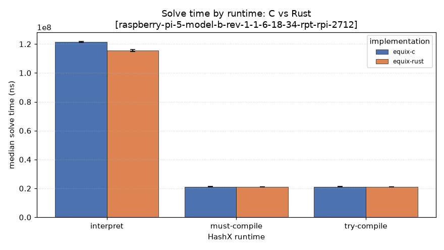

### Throughput

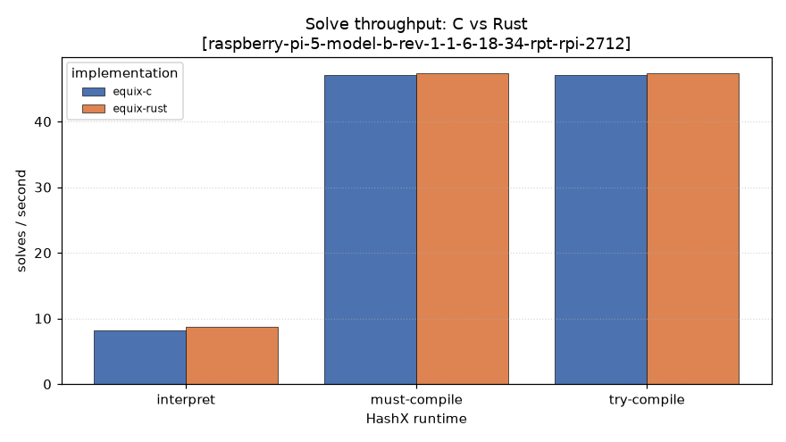

### Jit Speedup

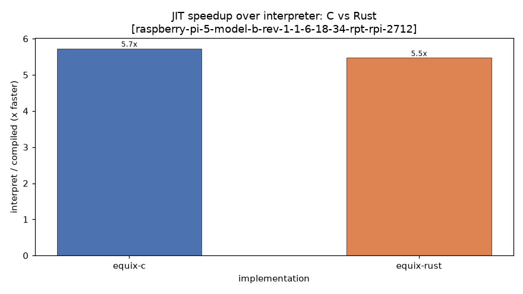

### Peak Rss

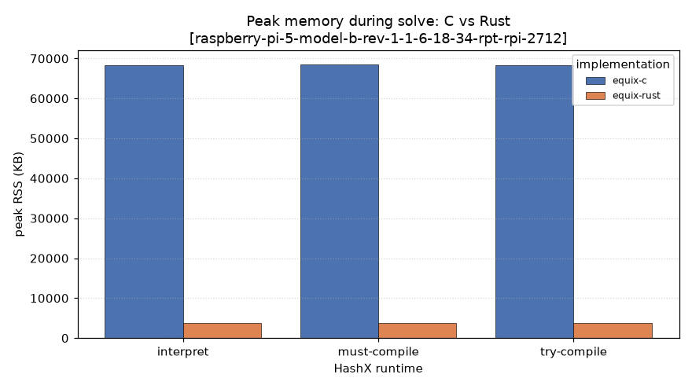

### Solve Distribution

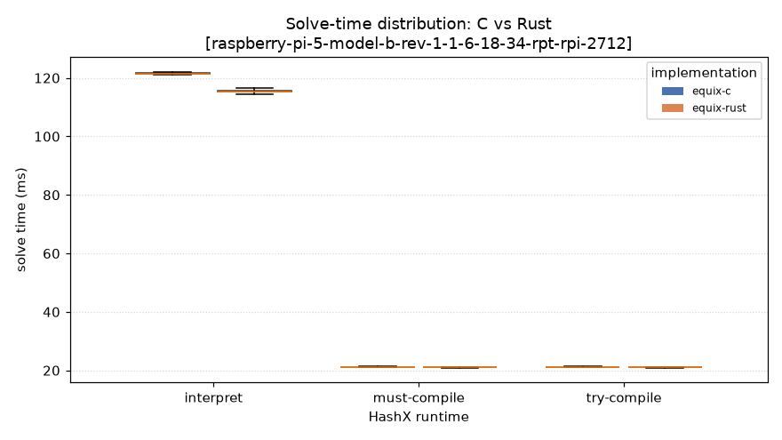

### Verify Time

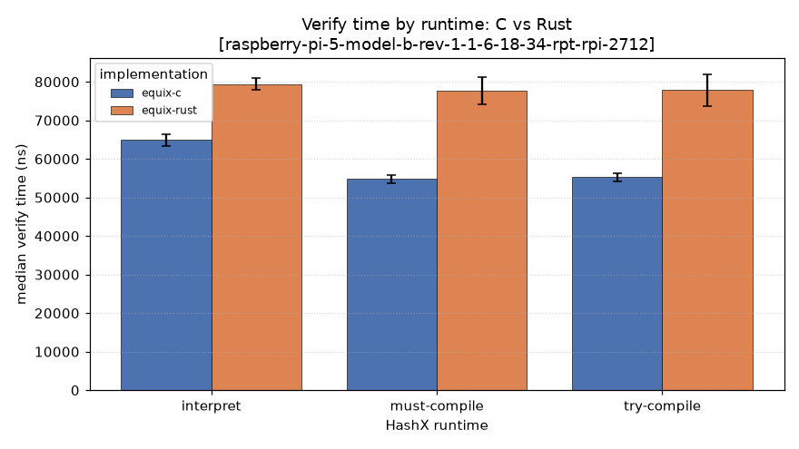

### Compile Overhead

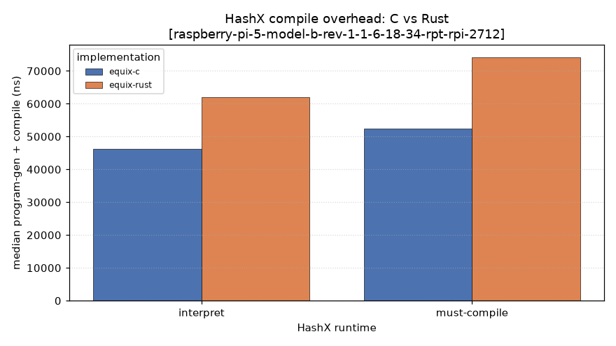

### Effort Attempts

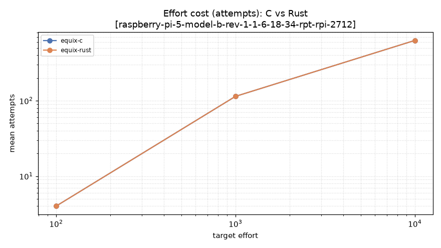

### Effort Time

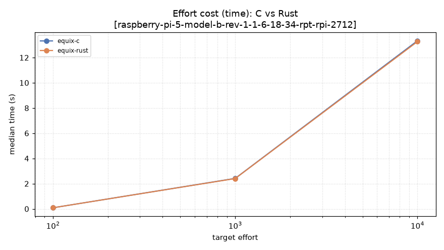

### Dos Protection

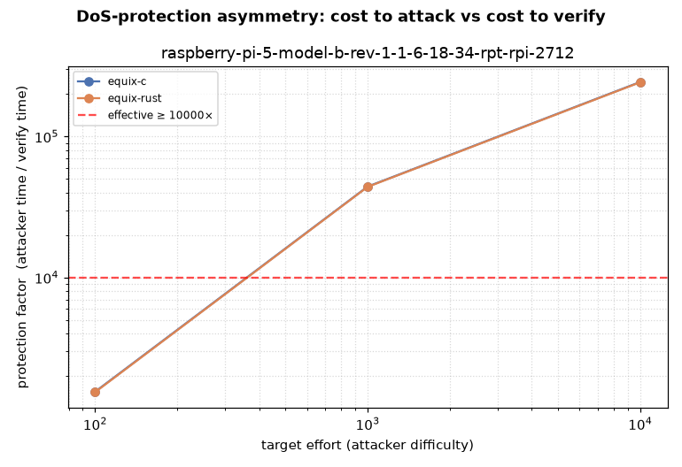

### Concurrency Solve

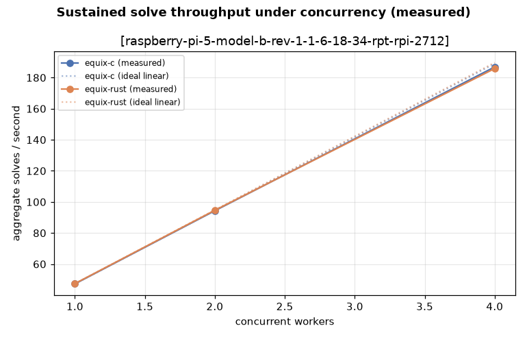

### Concurrency Verify

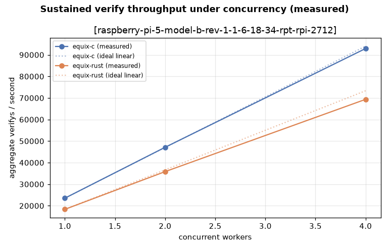

### Mining Rate

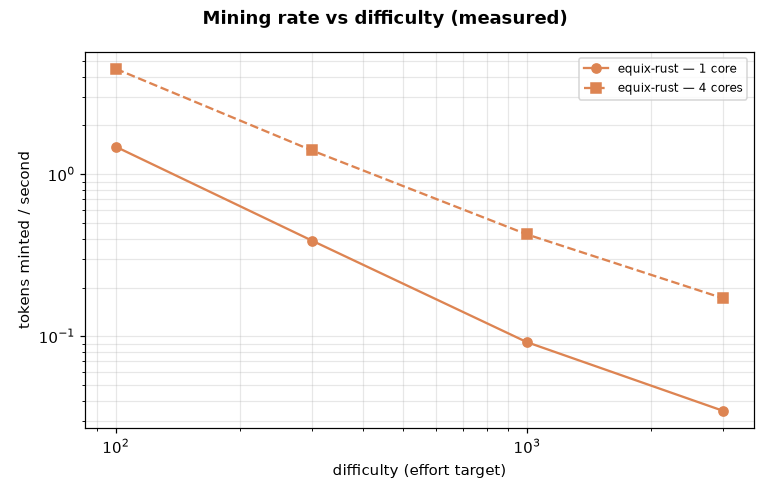

## solve results

| device | challenge | impl | runtime | median | p95 | solves/s | hashes/s | sols/solve | RSS(KB) |
|---|---|---|---|---|---|---|---|---|---|
| raspberry-pi-5-model-b-rev-1-1-6-18-34-rpt-rpi-2712 | 0000000000000002 | equix-c | interpreted | 121.571 ms | 122.066 ms | 8.2 | 539,077 | 2.01 | 68336 |
| raspberry-pi-5-model-b-rev-1-1-6-18-34-rpt-rpi-2712 | 0000000000000002 | equix-c | compiled | 21.213 ms | 21.289 ms | 47.1 | 3,089,392 | 2.01 | 68336 |
| raspberry-pi-5-model-b-rev-1-1-6-18-34-rpt-rpi-2712 | 0000000000000002 | equix-c | compiled | 21.216 ms | 21.292 ms | 47.1 | 3,088,924 | 2.01 | 68336 |
| raspberry-pi-5-model-b-rev-1-1-6-18-34-rpt-rpi-2712 | 0000000000000002 | equix-rust | interpreted | 115.422 ms | 115.974 ms | 8.7 | 567,793 | 2.01 | 3840 |
| raspberry-pi-5-model-b-rev-1-1-6-18-34-rpt-rpi-2712 | 0000000000000002 | equix-rust | compiled | 21.100 ms | 21.195 ms | 47.4 | 3,106,038 | 2.01 | 3856 |
| raspberry-pi-5-model-b-rev-1-1-6-18-34-rpt-rpi-2712 | 0000000000000002 | equix-rust | compiled | 21.100 ms | 21.201 ms | 47.4 | 3,105,919 | 2.01 | 3856 |
| raspberry-pi-5-model-b-rev-1-1-6-18-34-rpt-rpi-2712 | 0102030405060708 | equix-c | interpreted | 121.549 ms | 121.972 ms | 8.2 | 539,175 | 2.17 | 68336 |
| raspberry-pi-5-model-b-rev-1-1-6-18-34-rpt-rpi-2712 | 0102030405060708 | equix-c | compiled | 21.210 ms | 21.293 ms | 47.1 | 3,089,925 | 2.17 | 68848 |
| raspberry-pi-5-model-b-rev-1-1-6-18-34-rpt-rpi-2712 | 0102030405060708 | equix-c | compiled | 21.206 ms | 21.288 ms | 47.2 | 3,090,424 | 2.17 | 68336 |
| raspberry-pi-5-model-b-rev-1-1-6-18-34-rpt-rpi-2712 | 0102030405060708 | equix-rust | interpreted | 115.366 ms | 116.148 ms | 8.7 | 568,071 | 2.17 | 3840 |
| raspberry-pi-5-model-b-rev-1-1-6-18-34-rpt-rpi-2712 | 0102030405060708 | equix-rust | compiled | 21.085 ms | 21.194 ms | 47.4 | 3,108,186 | 2.17 | 3856 |
| raspberry-pi-5-model-b-rev-1-1-6-18-34-rpt-rpi-2712 | 0102030405060708 | equix-rust | compiled | 21.087 ms | 21.193 ms | 47.4 | 3,107,934 | 2.17 | 3856 |
| raspberry-pi-5-model-b-rev-1-1-6-18-34-rpt-rpi-2712 | cafe | equix-c | interpreted | 121.507 ms | 121.947 ms | 8.2 | 539,360 | 1.98 | 68336 |
| raspberry-pi-5-model-b-rev-1-1-6-18-34-rpt-rpi-2712 | cafe | equix-c | compiled | 21.206 ms | 21.290 ms | 47.2 | 3,090,442 | 1.98 | 68848 |
| raspberry-pi-5-model-b-rev-1-1-6-18-34-rpt-rpi-2712 | cafe | equix-c | compiled | 21.207 ms | 21.290 ms | 47.2 | 3,090,296 | 1.98 | 68336 |
| raspberry-pi-5-model-b-rev-1-1-6-18-34-rpt-rpi-2712 | cafe | equix-rust | interpreted | 115.349 ms | 116.102 ms | 8.7 | 568,153 | 1.98 | 3824 |
| raspberry-pi-5-model-b-rev-1-1-6-18-34-rpt-rpi-2712 | cafe | equix-rust | compiled | 21.080 ms | 21.177 ms | 47.4 | 3,108,919 | 1.98 | 3856 |
| raspberry-pi-5-model-b-rev-1-1-6-18-34-rpt-rpi-2712 | cafe | equix-rust | compiled | 21.082 ms | 21.168 ms | 47.4 | 3,108,564 | 1.98 | 3856 |
| raspberry-pi-5-model-b-rev-1-1-6-18-34-rpt-rpi-2712 | deadbeef | equix-c | interpreted | 121.584 ms | 121.907 ms | 8.2 | 539,020 | 1.97 | 68336 |
| raspberry-pi-5-model-b-rev-1-1-6-18-34-rpt-rpi-2712 | deadbeef | equix-c | compiled | 21.213 ms | 21.299 ms | 47.1 | 3,089,363 | 1.97 | 68336 |
| raspberry-pi-5-model-b-rev-1-1-6-18-34-rpt-rpi-2712 | deadbeef | equix-c | compiled | 21.220 ms | 21.298 ms | 47.1 | 3,088,426 | 1.97 | 68336 |
| raspberry-pi-5-model-b-rev-1-1-6-18-34-rpt-rpi-2712 | deadbeef | equix-rust | interpreted | 115.547 ms | 116.101 ms | 8.7 | 567,179 | 1.97 | 3824 |
| raspberry-pi-5-model-b-rev-1-1-6-18-34-rpt-rpi-2712 | deadbeef | equix-rust | compiled | 21.110 ms | 21.248 ms | 47.4 | 3,104,547 | 1.97 | 3856 |
| raspberry-pi-5-model-b-rev-1-1-6-18-34-rpt-rpi-2712 | deadbeef | equix-rust | compiled | 21.105 ms | 21.187 ms | 47.4 | 3,105,177 | 1.97 | 3856 |

## verify results

| device | challenge | impl | runtime | median | p95 | result | RSS(KB) |
|---|---|---|---|---|---|---|---|
| raspberry-pi-5-model-b-rev-1-1-6-18-34-rpt-rpi-2712 | 0000000000000002 | equix-c | interpreted | 64.527 µs | 66.055 µs | OK | 68848 |
| raspberry-pi-5-model-b-rev-1-1-6-18-34-rpt-rpi-2712 | 0000000000000002 | equix-c | compiled | 54.703 µs | 55.833 µs | OK | 69360 |
| raspberry-pi-5-model-b-rev-1-1-6-18-34-rpt-rpi-2712 | 0000000000000002 | equix-c | compiled | 54.889 µs | 55.907 µs | OK | 68848 |
| raspberry-pi-5-model-b-rev-1-1-6-18-34-rpt-rpi-2712 | 0000000000000002 | equix-rust | interpreted | 79.055 µs | 80.481 µs | OK | 3856 |
| raspberry-pi-5-model-b-rev-1-1-6-18-34-rpt-rpi-2712 | 0000000000000002 | equix-rust | compiled | 77.361 µs | 79.925 µs | OK | 3872 |
| raspberry-pi-5-model-b-rev-1-1-6-18-34-rpt-rpi-2712 | 0000000000000002 | equix-rust | compiled | 78.453 µs | 84.499 µs | OK | 3872 |
| raspberry-pi-5-model-b-rev-1-1-6-18-34-rpt-rpi-2712 | cafe | equix-c | interpreted | 64.684 µs | 66.370 µs | OK | 68848 |
| raspberry-pi-5-model-b-rev-1-1-6-18-34-rpt-rpi-2712 | cafe | equix-c | compiled | 54.675 µs | 55.888 µs | OK | 69360 |
| raspberry-pi-5-model-b-rev-1-1-6-18-34-rpt-rpi-2712 | cafe | equix-c | compiled | 55.315 µs | 56.573 µs | OK | 68848 |
| raspberry-pi-5-model-b-rev-1-1-6-18-34-rpt-rpi-2712 | cafe | equix-rust | interpreted | 79.777 µs | 81.629 µs | OK | 3856 |
| raspberry-pi-5-model-b-rev-1-1-6-18-34-rpt-rpi-2712 | cafe | equix-rust | compiled | 77.842 µs | 82.333 µs | OK | 3888 |
| raspberry-pi-5-model-b-rev-1-1-6-18-34-rpt-rpi-2712 | cafe | equix-rust | compiled | 77.425 µs | 80.573 µs | OK | 3872 |
| raspberry-pi-5-model-b-rev-1-1-6-18-34-rpt-rpi-2712 | deadbeef | equix-c | interpreted | 65.518 µs | 66.684 µs | OK | 68848 |
| raspberry-pi-5-model-b-rev-1-1-6-18-34-rpt-rpi-2712 | deadbeef | equix-c | compiled | 54.925 µs | 55.722 µs | OK | 68848 |
| raspberry-pi-5-model-b-rev-1-1-6-18-34-rpt-rpi-2712 | deadbeef | equix-c | compiled | 55.481 µs | 56.481 µs | OK | 68848 |
| raspberry-pi-5-model-b-rev-1-1-6-18-34-rpt-rpi-2712 | deadbeef | equix-rust | interpreted | 79.416 µs | 80.722 µs | OK | 3856 |
| raspberry-pi-5-model-b-rev-1-1-6-18-34-rpt-rpi-2712 | deadbeef | equix-rust | compiled | 77.981 µs | 81.518 µs | OK | 3856 |
| raspberry-pi-5-model-b-rev-1-1-6-18-34-rpt-rpi-2712 | deadbeef | equix-rust | compiled | 77.638 µs | 80.980 µs | OK | 3872 |

## hashx_compile results

| device | challenge | impl | runtime | median compile | median exec | RSS(KB) |
|---|---|---|---|---|---|---|
| raspberry-pi-5-model-b-rev-1-1-6-18-34-rpt-rpi-2712 | 0102030405060708 | equix-c | interpreted | 46.184 µs | 4.148 µs | 69360 |
| raspberry-pi-5-model-b-rev-1-1-6-18-34-rpt-rpi-2712 | 0102030405060708 | equix-c | compiled | 52.111 µs | 333 ns | 69360 |
| raspberry-pi-5-model-b-rev-1-1-6-18-34-rpt-rpi-2712 | 0102030405060708 | equix-rust | interpreted | 61.786 µs | 4.241 µs | 1984 |
| raspberry-pi-5-model-b-rev-1-1-6-18-34-rpt-rpi-2712 | 0102030405060708 | equix-rust | compiled | 73.592 µs | 352 ns | 2000 |
| raspberry-pi-5-model-b-rev-1-1-6-18-34-rpt-rpi-2712 | deadbeef | equix-c | interpreted | 46.157 µs | 4.148 µs | 69360 |
| raspberry-pi-5-model-b-rev-1-1-6-18-34-rpt-rpi-2712 | deadbeef | equix-c | compiled | 52.796 µs | 333 ns | 69360 |
| raspberry-pi-5-model-b-rev-1-1-6-18-34-rpt-rpi-2712 | deadbeef | equix-rust | interpreted | 62.129 µs | 4.241 µs | 1968 |
| raspberry-pi-5-model-b-rev-1-1-6-18-34-rpt-rpi-2712 | deadbeef | equix-rust | compiled | 74.870 µs | 352 ns | 2000 |

## effort results

| device | base | target | impl | runtime | mean attempts | median time | mean achieved |
|---|---|---|---|---|---|---|---|
| raspberry-pi-5-model-b-rev-1-1-6-18-34-rpt-rpi-2712 | abcd | 10000 | equix-c | compiled | 629.0 | 13.333 s | 11898 |
| raspberry-pi-5-model-b-rev-1-1-6-18-34-rpt-rpi-2712 | abcd | 10000 | equix-rust | compiled | 629.0 | 13.266 s | 11898 |
| raspberry-pi-5-model-b-rev-1-1-6-18-34-rpt-rpi-2712 | abcd | 1000 | equix-c | compiled | 114.0 | 2.416 s | 1922 |
| raspberry-pi-5-model-b-rev-1-1-6-18-34-rpt-rpi-2712 | abcd | 1000 | equix-rust | compiled | 114.0 | 2.404 s | 1922 |
| raspberry-pi-5-model-b-rev-1-1-6-18-34-rpt-rpi-2712 | abcd | 100 | equix-c | compiled | 4.0 | 84.780 ms | 141 |
| raspberry-pi-5-model-b-rev-1-1-6-18-34-rpt-rpi-2712 | abcd | 100 | equix-rust | compiled | 4.0 | 84.146 ms | 141 |

---
_See `results.csv` for the full flat dataset and `raw/results.json` for per-rep data._