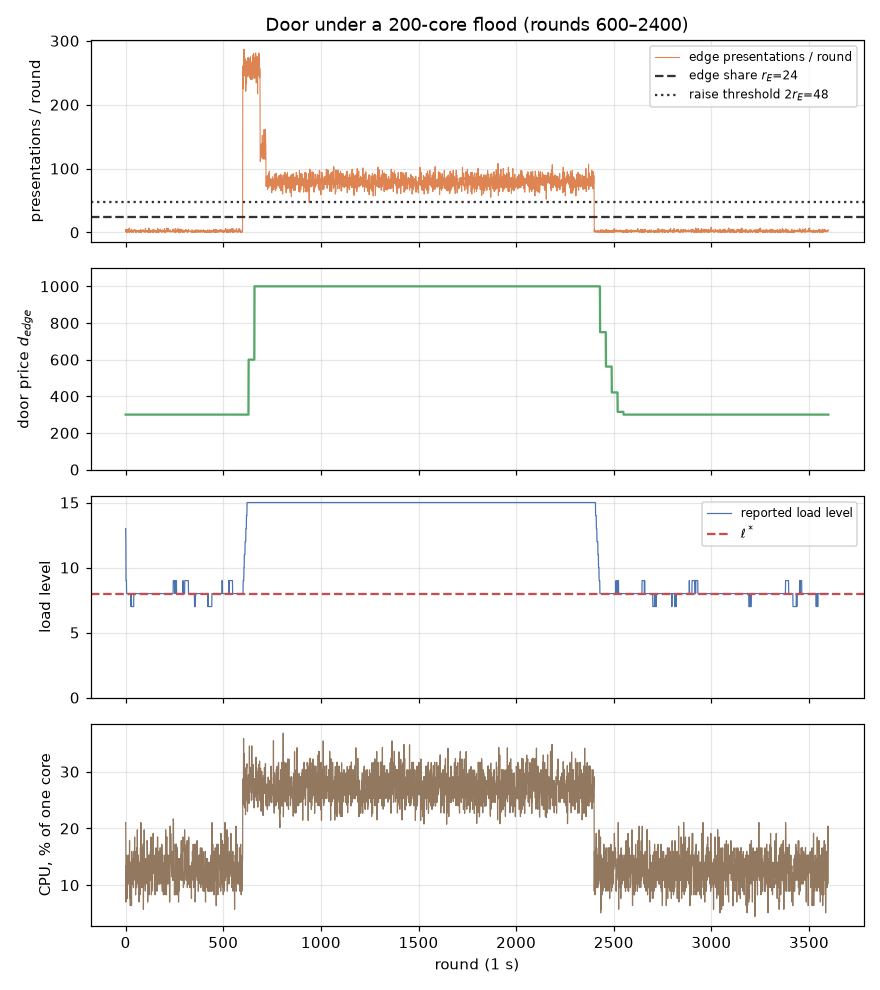
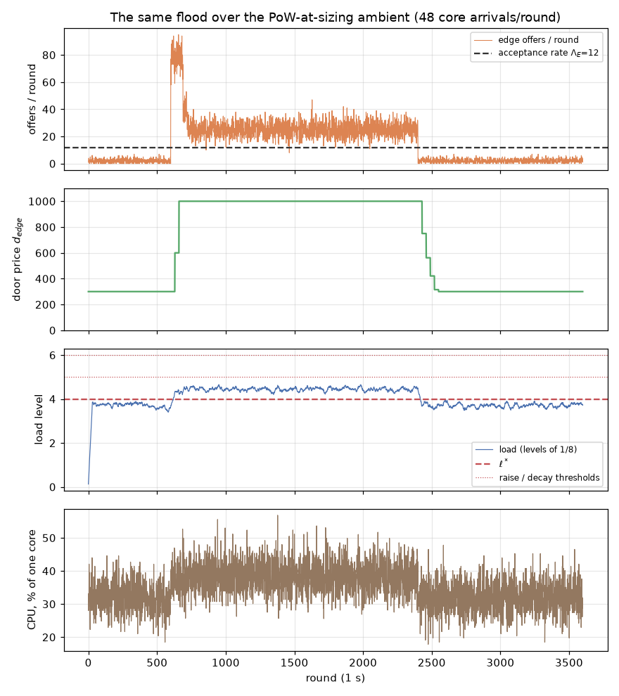
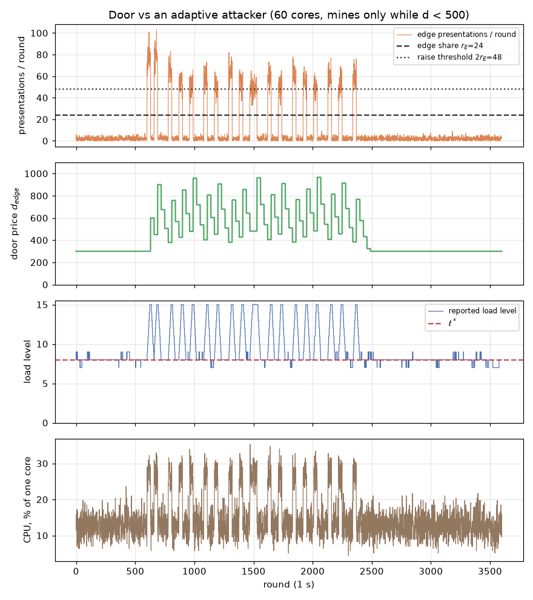
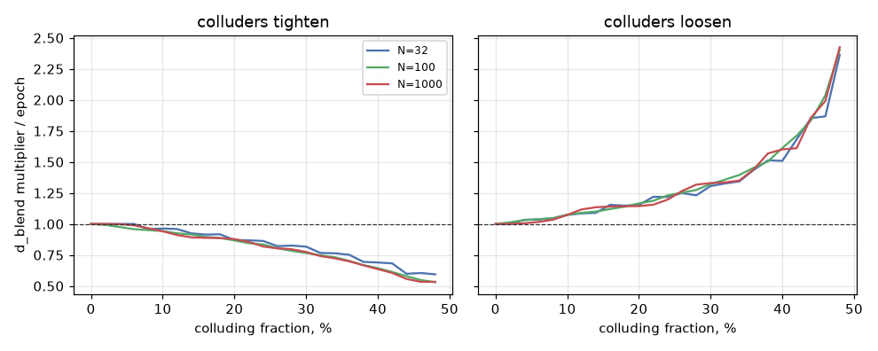

# Blend load-driven admission — the calibration studies

Simulations of the admission mechanisms specified in `blend-protocol.md` 1.7.0
(logos-lips branch `docs/blend-load-driven-admission`): the per-node edge door
(`Edge Difficulty`) and the consensus threshold (`Blend Difficulty`), run as
written — exact integer rules, real BN254 modulus — against the measured Equi-X
curves. Four studies, one per open calibration question in the specification's
PR. Regenerate with:

```bash
cd tools/benchmarks/Equi-X
PYTHONPATH=harness python3 -m equix_bench.blend_admission --out <dir>
PYTHONPATH=harness python3 -m pytest harness/tests/test_blend_admission.py
```

## Inputs, all measured

| Quantity | Value | Source |
| --- | --- | --- |
| Pi 5 whole-machine mint, tokens/s | 4.45 @ 100 · 1.40 @ 300 · 0.42 @ 1000 · 0.17 @ 3000 | `benchmark-results/RPi5-16GB/main/mining.csv`, pooled |
| Fastest attacker core (285HX, Rust-JIT), tokens/s | 3.55 @ 100 · 1.27 @ 300 · 0.39 @ 1000 · 0.11 @ 3000 | `benchmark-results/FedoraIntel285HX24C-256GB/main/mining.csv`, pooled ÷ 24 |
| Public header verification, Pi 5, one core | 157/s (6.4 ms) | `tools/benchmarks/blend-header-verification` |
| Equi-X verify, cold, Pi 5 | 54.7 µs | `benchmark-findings/findings.md` §3 |

Between measured efforts the curves interpolate log-log; outside, they
extrapolate as 1/E (the `difficulty_control` model).

## 1. The door under flood

A quiet node sits at load level ~1.3 (24 core-relay arrivals + 2 honest edge
offers against V = 157), so the door rests at the floor. The raise rule trips
when priced arrivals cross level `ℓ*+2` = 5 — **98/round, which an attacker at
the floor price needs ~57 fastest cores to generate** over a quiet network.
Below that, the price never moves, and the defense against door occupation is
the acceptance-rate cap plus redundancy: 32 fastest cores saturate one door's
`Λ_E` at the floor while the node feels nothing, but doing that to every door
of an `N`-node network costs `N` times ~9.5 cores, forever.

Above the trip point the controller does its job:



A 200-core flood escalates floor→600→ceiling in two retargets (60 rounds),
**holds the ceiling for the whole flood** — its offers keep the load above the
decay threshold — and decays home in five retargets (150 rounds) once the flood
stops. A 120-core flood instead settles at 750: the controller finds the price
that lands the attacker's load inside the deadband, and decays home the same
way. Peak CPU on the defending node: 35% of one Pi 5 core. During the 200-core
flood the attacker takes ~97% of the acceptance rate and 85% of honest offers
are refused per round (they retry; study 2 shows none are stranded).

### 1c. Decay at the network equilibrium

The door thresholds sit **above** the consensus set point (`raise > ℓ*+2`,
`decay < ℓ*+1`) precisely so that the load Blend Difficulty steers the network
to — level `ℓ*` — stays below the door's deadband:



With ambient at the sized operating point (`Φ_CC^Max·(F_1+F_W·β_max)` = 48
core arrivals/round, level ~2.6), the door still decays fully to the floor 150
rounds after a flood, and the trip point over this ambient is ~38 fastest cores
at the floor. Had the thresholds been the naive `ℓ*±1`, the equilibrium itself
would sit inside the deadband and every attack's price would freeze there —
the interaction the branch review caught (R2).

## 1b. The adaptive attacker does not sawtooth

The generic exponential-gain controller oscillated against an attacker that
pauses above a give-up price (`difficulty-control.md` run 4). The specified
integer rule does not:



With a give-up of 800 and 120 cores, the price climbs and **settles at 750 —
the one value just below the give-up — and holds**, because the attacker's own
presence keeps the load inside the deadband. The equilibrium is a stable,
priced occupation: 98% attack duty, ~97% of the acceptance rate, at a sustained
cost the attacker cannot lower — just-below-trip pressure is ~57 fastest cores
whatever price it settles at. At 200 cores — enough to trip the raise even one
step below the give-up — the price flutters 750↔1000 with period 2W: bounded to
one step, against the generic controller's multi-octave sawtooth. Either way
the mechanism cannot hand the door back; that is the acceptance-rate cap's job
and the PR's open question on door-occupation economics.

## 2. The grace window `G = 60` strands nobody who matters

Worst case — the price steps up the instant after the quote — an exponential
solve outlives the 60 s grace with probability:

| device | at the floor (300) | at the ceiling (1000) |
| --- | --- | --- |
| Pi 5, 4 cores | 4.5e-37 | 1e-11 |
| Pi 5, 1 core | 9e-10 | **0.17%** |

Replayed through the 200-core flood trace (price stepping ×2 twice), 0 of
3,510 four-core and 0 of 3,606 single-core solvers were stranded. The
constraint the specification states — `G` at least the p95 solve at the ceiling
on the slowest device — holds with a wide margin at (60, 1000); halving `G` to
the observation window `W = 30` would push the single-core worst case to ~4%,
which is why `G` is its own parameter.

## 3. The median moves one level below half collusion



With `N ∈ {32, 100, 1000}` reporters, honest loads lognormal around the set
point and quantized to sixteen levels, a colluding fraction reporting the
extreme moves the lower median by one level typically and two at most (at 30%:
mean per-epoch multiplier 0.77 tightening / 1.47 loosening at `N = 100`), and
the controller re-anchors to `BASE·ℓ*/median` each epoch — a shifted median is
a bounded bias, not a compounding drift. Influence is per declaration, so it is
priced by the SDP minimum stake.

Two findings feed back into the specification:

- **The zero-median branch was the one unbounded path.** Uncapped, a sustained
  median of 0 doubles the threshold each epoch and reaches free admission —
  every ticket satisfying it — in exactly **19 epochs** from `BASE`
  (`BASE = p/2¹⁹`; ~20 weeks). Reachable only past 50% collusion or on a
  genuinely idle network, but free admission is precisely wrong for an idle
  network. The rule now caps the loosening at the level-1 fixed point
  `ℓ*·BASE`, where a sustained zero median settles and stays; the cap also
  makes the old below-`p` cap unreachable.
- **Sixteen levels are a bucket list, not a ranking:** 89% of 100
  heterogeneous reporters share their level with another, so the on-chain load
  report ranks doors only coarsely — the targeting-oracle residual the PR
  records.

## 4. The edge leader pre-mines for 1.2% of a Pi 5

| price | pre-mine duty (3 tokens per 600 s rotation) | P(3 slot-time solves > 15 s) | > 30 s |
| --- | --- | --- | --- |
| 300 (floor) | 0.36% | ~2e-7 | ~3e-13 |
| 1000 (ceiling) | 1.18% | **4.8%** | 0.03% |

Solving at slot time is safe at the floor and marginal at the ceiling: 4.8% of
edge leaders would miss the 15-round traversal budget and fall back to a direct
broadcast, surrendering unlinkability. Pre-mining removes the risk for at most
1.2% of a Pi-class machine even at the ceiling — the number that makes the
specification's `d_edge^Max` constraint concrete.

## What went back into the specification

1. **Load counts only priced connections.** The first run of study 1 showed the
   raise rule fed by raw offers: a costless connect-flood (no valid token)
   could move a node's price and, through the reported median, tighten
   `d_blend` network-wide for free. The door now checks the token first and
   the rate cap last, and `A_n` counts an edge connection only when its token
   passed — a connection must cost work to move the load.
2. **The loosening is capped at `4·BASE`** (study 3's runaway).
3. **The adaptive-attacker residual is a stable occupation or a one-step
   flutter, not a wide sawtooth** (study 1b) — the PR's open question is
   rephrased accordingly.
4. **`ℓ*` is derived, and it is 3.** The branch review (R1) found `ℓ* = 4`
   inconsistent with the `F_W = 1` sizing: the sized traffic (60 arrivals per
   round) is level 3.06 on the reference hardware. The set point is now the
   level of the sized traffic, stated as a derivation at the definition, and
   the 124 MB cache floor is consistent with it.
5. **The door thresholds sit above the set point** (`raise > ℓ*+2`,
   `decay < ℓ*+1`, study 1c) — sharing the naive `ℓ*±1` deadband would freeze
   every door at the equilibrium the consensus controller steers to (R2).
6. **The edge node need not await the quote** — a serialized quote round trip
   would not fit `T_E`'s own derivation on a slow link (R3).

## Not covered here

- The header-verification figure (157/s) is current: the
  `blend-header-verification` benchmark vendors the three-branch circuit
  (`pow_nonce`, `pow_quota`, `pow_blend_difficulty` among its Groth16 inputs).
  It is also insensitive by structure — Groth16 verification is constant in
  circuit size, and the branch added two public inputs, ≤ ~10% of the 6.4 ms,
  against ≥ 24% margin at every consumer.
- Honest clients giving up under high prices, mixed device fleets beyond the
  two Pi profiles, and door-selection strategies smarter than uniform are not
  modeled.
