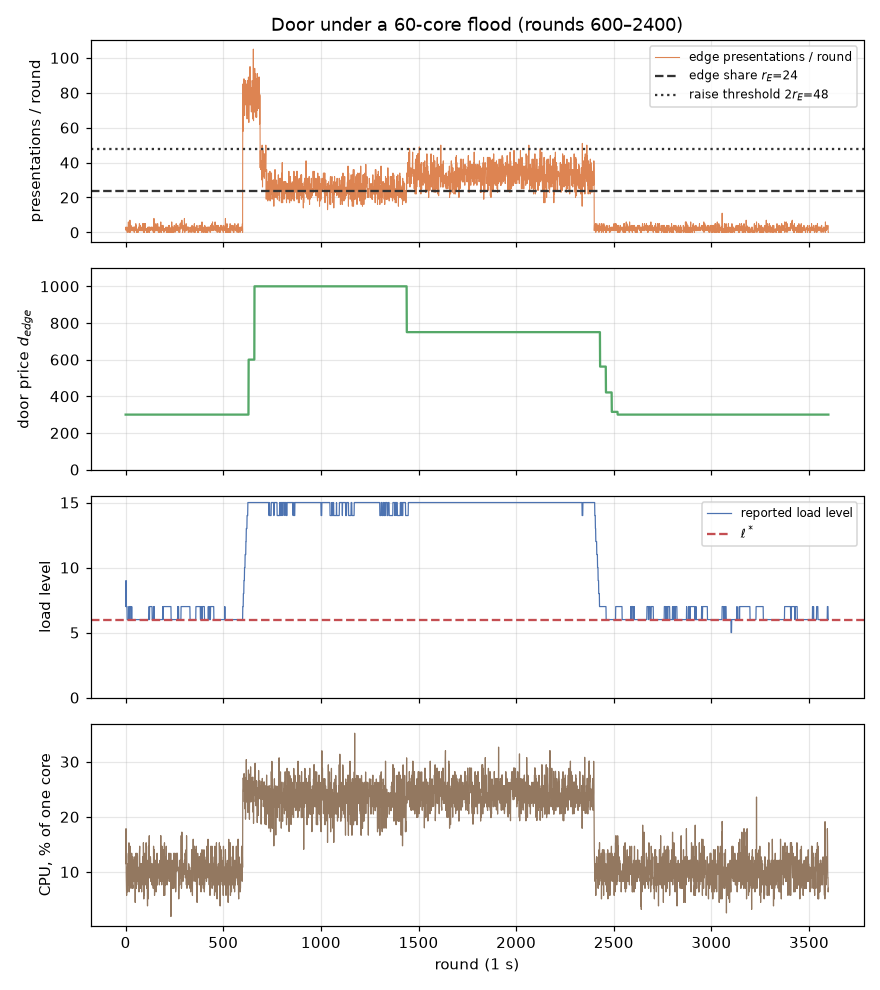
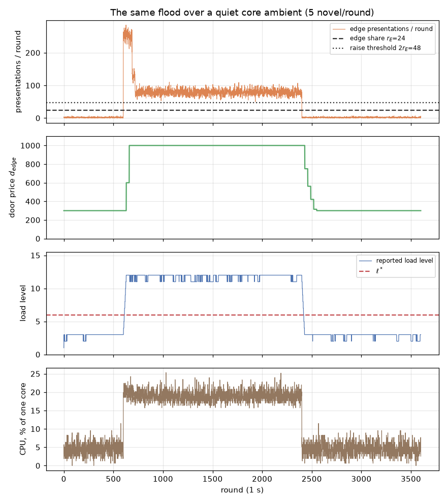

# Blend load-driven admission — the calibration studies

Simulations of the admission mechanisms specified in `blend-protocol.md` 1.7.0
(logos-lips branch `docs/blend-load-driven-admission`, on the per-connection
shares of #421): the per-node edge door (`Edge Difficulty`) and the consensus
threshold (`Blend Difficulty`), run as written — exact integer rules,
real BN254 modulus — against the measured Equi-X curves. Five studies.
Regenerate with:

```bash
cd tools/benchmarks/Equi-X
PYTHONPATH=harness python3 -m equix_bench.blend_admission --out <dir>
PYTHONPATH=harness python3 -m pytest harness/tests/test_blend_admission.py
```

**The rules as measured here.** A node reads at most `r_1 = 20` messages from
each of its `Φ_CC = 4` core connections in a round and serves at most `r_E = 24`
edge connections. Load is a node's **novel** arrivals per served round divided
by `r_1`, `ℓ_n = A_n/(r_1·S_n)`, quantized to sixteen levels rounded to nearest;
the sized traffic `F_1 = (max(F_C, 2·F_D) + F_T)·β_max = 16` novel a round
(`F_T = 130/30`) is level `ℓ* = 6`. `d_blend = BASE·ℓ*/max(L^Min, median)` with
`L^Min = ⌈ℓ*·φ⌉ = 2`, `φ = 1/4` the share of `F_T` sized for the proof of work
branch. The door retargets on the **distinct tokens presented** `P_n` — passing
checks 1–3, served or refused — raising above `2·r_E` per served round and
decaying below `r_E`.

## Inputs, all measured

| Quantity | Value | Source |
| --- | --- | --- |
| Pi 5 whole-machine mint, tokens/s | 4.45 @ 100 · 1.40 @ 300 · 0.42 @ 1000 · 0.17 @ 3000 | `benchmark-results/RPi5-16GB/main/mining.csv`, pooled; `RPi5-8GB` agrees within 0.5% on every point, and 16GB is the slower board |
| Fastest attacker core (285HX, Rust-JIT), tokens/s | 3.55 @ 100 · 1.27 @ 300 · 0.39 @ 1000 · 0.11 @ 3000 | `benchmark-results/FedoraIntel285HX24C-256GB/main/mining.csv`, pooled ÷ 24 |
| Public header verification, Pi 5, one core | 157/s (6.388 ms; 625/s on four threads, 3.99×) | `reports/blend/header-verification/console-RPi5.txt` — measured at `logos-blockchain 87138d2` (three-branch circuit), performance governor, 56.8 °C peak. Decomposition: signature 275.75 µs + proof of quota 6.116 ms |
| Equi-X verify, cold, Pi 5 | 54.7 µs | `benchmark-findings/findings.md` §3; primary: `results.csv` medians 54.9–55.2 µs (equix-c compiled, varied challenges, both Pi boards) |

Between measured efforts the curves interpolate log-log; outside, they
extrapolate as 1/E (the `difficulty_control` model).

## 1. The door under flood

The door's signal is edge presentations, so its trip point is fixed in tokens:
the raise fires above `2·r_E = 48` distinct tokens per round, **~38 of the
fastest measured cores** at the floor price; filling the edge share `r_E = 24`
takes ~19 of them, and holding the ceiling takes ~124. The figures hold only
because a token counts towards `P_n` once, which the specification states and
the model here assumes.


A 200-core flood escalates floor→ceiling in two retargets (60 rounds), **holds
the ceiling for the whole flood**, and decays home in five retargets (150
rounds). The attacker takes 98% of the edge share and 71% of honest offers are
refused per round (they retry; study 2 shows none are stranded). Peak CPU on the
defending node: 33% of one Pi 5 core, headers and token checks together.



A 60-core flood is priced rather than repelled. The price escalates to the
ceiling — minting is priced at the grace floor, which lags each move by up to
`G` rounds, so the first two retargets both see the floor-price rate — then
settles at 750 once the floor catches up: there the attacker presents ~31
tokens a round, inside the band `[r_E, 2·r_E]`, and holds 93% of the share with
19% of honest offers refused. The band is where a priced occupation sits; an
attacker between ~19 and ~38 cores at the floor fills the share without moving
the price at all. That is the cost of the 2× band the stability constraint
requires (a doubling halves a fixed solver's rate, so a narrower band would
oscillate).

### 1c. Core traffic is not the door's signal



Over a quiet core ambient (5 novel arrivals a round against the sized 20) the
price decays home 150 rounds after the flood, exactly as over the sized
ambient: core traffic never enters the door's signal. The **reported load** of
the flooded node is another matter: at the sized ambient the node reports level
6 (6–7 with Poisson noise over the 30-round window: `F_1 = 16` sits near the top
of level 6, `[13.75, 16.25)`), and a full edge share adds `r_E/r_1 = 1.2` core
shares — 9.6 levels — so a flooded door reports the top level, 15. A flood of
valid tokens against more than half the network's doors would therefore tighten
`d_blend` by `6/15`; at ~19 cores per door held, the lever is expensive and its
effect bounded.

### 1b. Adaptive attackers: a priced sawtooth


An attacker of 60 cores that mines only while the price is below 500 produces a
sawtooth: ×2 from wherever the decay re-admits it, ×3/4 steps down while it
waits — 57 distinct prices between 379 and 966 over the flood. It mines 28% of
the time and takes 80% of the served edge connections. Adapting buys no
discount: 2.6 core-seconds per served attacker message against 2.8 for the
constant 60-core flood, because the grace floor prices each token at the lowest
price the attacker waited for. No honest single-core solver is stranded by the
sawtooth (0 of 3,606). What the price cannot do is hand an occupied share back;
that is redundancy's job (`Φ_EC` doors per message, drawn from all `N`).

## 2. The grace window `G = 60` strands nobody who matters

Worst case — the price steps up the instant after the quote — an exponential
solve outlives the 60 s grace with probability:

| device | at the floor (300) | at the ceiling (1000) |
| --- | --- | --- |
| Pi 5, 4 cores | 4.5e-37 | 8.8e-12 |
| Pi 5, 1 core | 8.2e-10 | **0.17%** |

Replayed through the 200-core flood trace (price stepping ×2 twice), 0 of
3,510 four-core and 0 of 3,606 single-core solvers were stranded. The
constraint the specification states — `G` at least the p95 solve at the ceiling
on the slowest device — holds with a wide margin at (60, 1000); halving `G` to
the observation window `W = 30` would push the single-core worst case to ~4%,
which is why `G` is its own parameter.

## 3. The median moves two to three levels below half collusion


With `N ∈ {32, 100, 1000}` reporters, honest loads lognormal around the set
point (geometric σ 1.6) and quantized to sixteen levels of 2.5 novel arrivals a
round, a colluding fraction reporting the extreme moves the lower median by two
levels typically and three at most below 30% (at 30%: mean per-epoch
multiplier 0.77 tightening / 1.32 loosening at `N = 100`). The rule is a pure
re-anchor to `BASE·ℓ*/max(L^Min, median)` — a shifted median is a bounded bias
with **no memory**: it vanishes the epoch capture ends. Influence is per
declaration, so it is priced by the SDP minimum stake.

Two findings feed back into the specification:

- **The zero-median branch was the one unbounded path.** Under the original
  recursive rule, a sustained median of 0 doubled the threshold each epoch and
  reached free admission — every ticket satisfying it — in exactly **19
  epochs** from `BASE` (`BASE = p/2¹⁹`; ~20 weeks). The rule is now stateless
  and floors the median at `L^Min = 2`, so a zero median sits at `3·BASE`
  instantly and reversibly — the last level at which solvers of the sized
  capacity stay within `F_T`.
- **Sixteen levels are a bucket list, not a ranking:** 86% of 100
  heterogeneous reporters share their level with another, so the on-chain load
  report ranks doors only coarsely — the targeting-oracle residual the PR
  records.

## 4. The edge leader pre-mines for 1.2% of a Pi 5

| price | pre-mine duty (3 tokens per 600 s rotation) | P(3 slot-time solves > 15 s) | > 30 s |
| --- | --- | --- | --- |
| 300 (floor) | 0.36% | ~2e-7 | ~6e-16 |
| 1000 (ceiling) | 1.18% | **4.8%** | 0.03% |

Solving at slot time is safe at the floor and marginal at the ceiling: 4.8% of
edge leaders would miss the 15-round traversal budget and fall back to a direct
broadcast, surrendering unlinkability. Pre-mining removes the risk for at most
1.2% of a Pi-class machine even at the ceiling — the number that makes the
specification's `d_edge^Max` constraint concrete.

## 5. The control loop, closed

The loop `level → d_blend → F_W → novel arrivals → level` is iterated from all
sixteen starting levels over the staked transaction demand `F_tx` (none, half
the sized `3.25`, sized, all of `F_T = 4.33`) and the solvers' hashpower
relative to the sizing (`F_W = φ·F_T = 1.08` at `BASE`, proportional to the
threshold). Cover traffic is counted as `F_1` counts it: the larger of the
cover and proposal rates, plus the transaction messages.

| `F_tx` \ hashpower | ×0.5 | ×1 | ×2 | ×4 | ×8 |
| --- | --- | --- | --- | --- | --- |
| none | cycle {2,3} | cycle {3,4} | cycle {4,5} | fixed [6] | cycle {6,12}, cycle {7,10}, cycle {8,9} |
| half | fixed [4] | fixed [5] | fixed [6] | cycle {7,8} | cycle {9,10} |
| sized | fixed [6] | **fixed [6]** | fixed [7] | fixed [9] | fixed [11] |
| all of `F_T` | fixed [7] | cycle {7,8} | fixed [8] | fixed [10] | fixed [12] |

The design point is an **exact fixed point**: 16.0 novel arrivals a round
against `r_1 = 20`, level 6, `d = BASE`, `F_W = 1.08`. The loop gain there —
the derivative of the map at its fixed point — is 0.19, the share of the novel
traffic the proof of work branch carries (`φ·F_T·β_max/F_1 = 0.20`). Two
consequences, both stated rather than smoothed over:

- **With no staked demand the branch carries all but the cover traffic**, the
  gain is 0.65, and the quantized map flutters one step, `{3,4}`, at the
  sizing hashpower. The wide period-2 swing an earlier run found (between
  `BASE` and the floor) is gone: #421 now counts the cover traffic in `F_1`,
  and that inelastic component keeps the gain below 1. One-step flutters
  appear at other grid points too — a quantized proportional rule near a level
  boundary alternates between the two adjacent levels.
- **Hashpower beyond the range's span leaves the shares to bind**: ×8 the
  sizing settles at level 11, `d = BASE·6/11`, where the branch still exceeds
  `F_T` (`4.7` against `4.33`); inside a no-demand cycle at ×8 the loose phase
  admits `8.7`. The floor `L^Min` bounds `F_W` at `0.75·F_T` only at the sized
  hashpower.

Two candidate damping rules, **not specified**, run on the same grid (sqrt
re-anchor `d = BASE·√(ℓ*/max(L^Min, median))`, gain halved and span 2.7×
instead of 7.5× / mean of two consecutive epochs' medians, retention four
epochs):

| `F_tx` \ hashpower | ×0.5 | ×1 | ×2 | ×4 | ×8 |
| --- | --- | --- | --- | --- | --- |
| none | fixed [2] / cycle {2,3} | fixed [3] / cycle {3,4} | fixed [4] / cycle {4,5} | fixed [6] / fixed [6] | cycle {9,10} / cycle {8,9} |
| half | fixed [4] / fixed [4] | fixed [5] / fixed [5] | fixed [6] / fixed [6] | fixed [8] / cycle {7,8} | fixed [11] / cycle {9,10} |
| sized | fixed [6] / fixed [6] | fixed [6] / fixed [6] | cycle {7,8} / fixed [7] | fixed [9] / fixed [9] | fixed [12] / fixed [11] |
| all of `F_T` | fixed [7] / fixed [7] | fixed [8] / cycle {7,8} | fixed [9] / fixed [8] | fixed [10] / fixed [10] | fixed [13] / fixed [12] |

Neither removes the one-step flutters everywhere; the sqrt rule trades the
range's authority for fewer of them. With the wide swing gone, neither is
pressing. Left to the specification's thread.

## What went back into the specification

1. **Load counts only priced connections.** The first run of study 1 showed the
   raise rule fed by raw offers: a costless connect-flood (no valid token)
   could move a node's price and, through the reported median, tighten
   `d_blend` network-wide for free. The door checks the token first, and an
   edge connection enters the load only when served.
2. **The zero-median runaway is closed by flooring the median** (study 3):
   the loosening never passes the floor. *The floor became `L^Min = ⌈ℓ*·φ⌉ = 2`,
   where solvers of the sized capacity reach `F_T`.*
3. **The edge node need not await the quote** — a serialized quote round trip
   would not fit `T_E`'s own derivation on a slow link.
4. **The Blend difficulty became a pure function of one epoch's reports** — no
   step clamp, no hold-on-empty; a checkpoint-bootstrapped node computes it from
   carried ledger state alone.
5. **Load is measured against a protocol constant, not against self-measured
   hardware.** The earlier denominator was the operator's provisioning choice:
   the same traffic reported level 3 on a one-core node and level 0 on a
   four-core one, so `d_blend` pinned at its loosest value on any multi-core
   network. *The constant became a core connection's share `r_1` of #421's
   budget, and the numerator the novel arrivals, so the load is independent of
   the peering degree.*
6. **The door reads presentations, not load** — with load counting served
   connections only, a load-driven door would be inert against any flood.
7. **A token counts once towards the price it sets.** With `P_n` counting every
   presentation, a token refused at the budget check never enters the
   spent-token cache, so a stock mined once would hold a node's ceiling for the
   cost of the tokens served a round — about one fastest core rather than the
   ~38 study 1 prices. `P_n` counts distinct tokens.
8. **The quantizer rounds to nearest**, in integer arithmetic, so no
   implementation's rounding decides the reported byte.
9. **The loop gain is the branch's share of traffic** (study 5): 0.19 at the
   sizing, 0.65 with no staked demand once cover traffic is counted as #421
   counts it. Recorded with the candidate rules above; the specification is
   unchanged.
10. **The set point is the level of `F_1`**, `ℓ* = ⌊(16·F_1 + r_1)/(2·r_1)⌋ = 6`,
   after #421 sized `F_T` to drain a round's backlog within a hop (`F_1 = 16`
   against `r_1 = 20`). The `r_E` service count moved from accepting a
   connection to serving it, so a garbage token does not consume a slot of the
   share.

## Not covered here

- The header-verification provenance is closed: the run's console transcript
  is committed at `reports/blend/header-verification/console-RPi5.txt`, and
  the measured ref `logos-blockchain 87138d2` contains the third branch
  (`blend/proofs/src/quota/pow.rs`), so 157/s is the deployed circuit's
  figure. The board's `results.json`/`results.csv` remain worth committing for
  per-repeat detail.
- The door model serves edge connections up to `r_E` a round and reads each
  core connection up to its share; #421's send-side share and its `η`-round
  discard are not modeled.
- Honest clients giving up under high prices, mixed device fleets beyond the
  two Pi profiles, and door-selection strategies smarter than uniform are not
  modeled.
