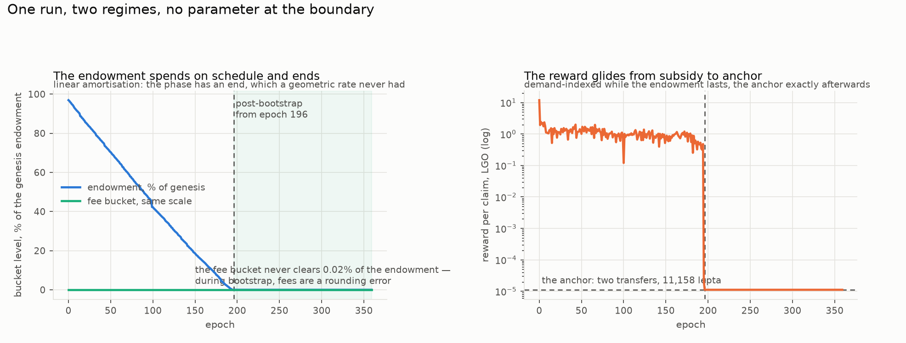
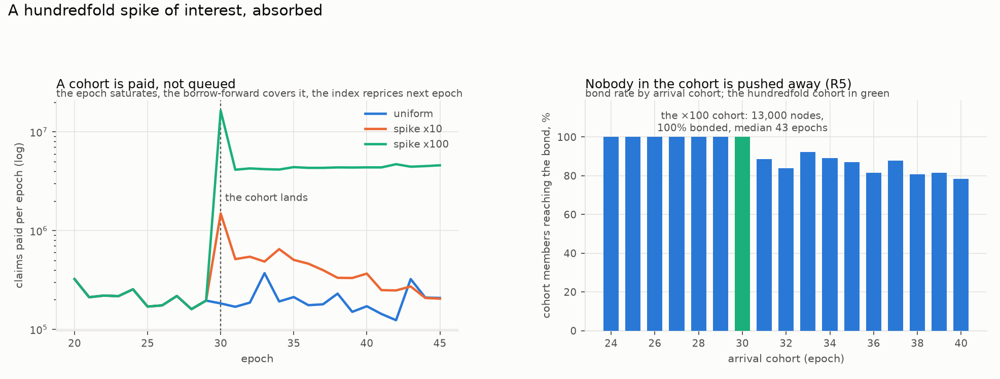
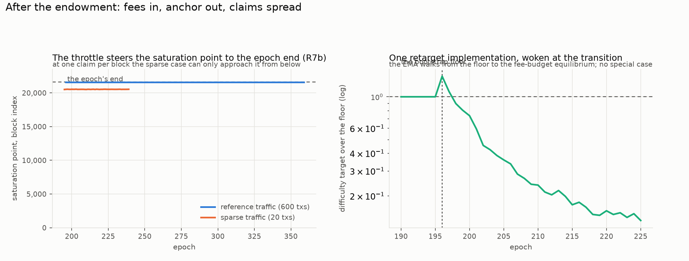
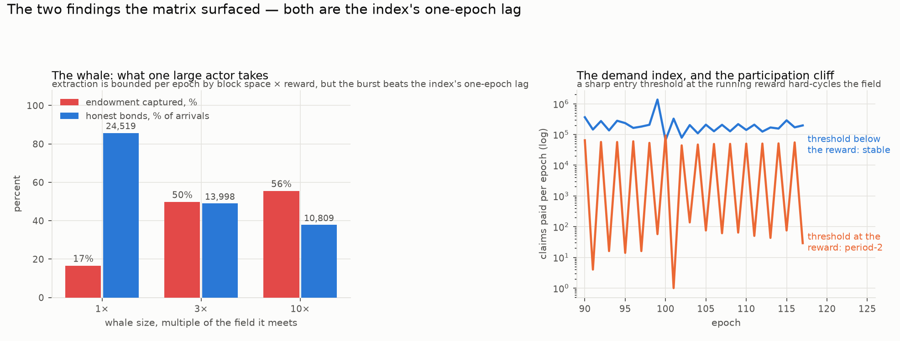

# EmPoWering from base principles — the model, and what the simulations say about it

## What this document is

A redesign of the EmPoWering mechanism from eight stated principles, simulated, and validated against those principles by number. It is not an amendment to the current specification: the design was derived from the principles first and mapped back onto the existing machinery afterwards (`MAPPING.md`), so that every part of the old mechanism had to re-justify itself or go. The model is specified normatively in `MODEL.md`; this report explains it, shows what the simulations measured, and puts the open decisions where they can be seen. A number-against-number comparison with the currently specified mechanism, including its arrivals-as-process study, is in `design-comparison.md` alongside — **whose §0 explains the choice between the two designs in plain language, and is the right place to start for a reader who does not want the arithmetic** — and both designs are attacked in `adversarial-analysis.md`.

Notation follows the house convention: prose and code spans carry self-describing names, so `epoch_budget` here is the same quantity as `epoch_budget` in the model document and the simulator.

Regenerate every figure with (from `tools/simulators/empowering-denovo`):

```
PYTHONPATH="src:../empowering/src" python3 -m empowering_denovo_sim.plots \
    --out ../../../reports/EmPoWering/denovo/figures
PYTHONPATH="src:../empowering/src" python3 -m empowering_denovo_sim.validate
```

## 1. The requirements

Stated by the design owner on 2026-08-18, and used as the report's checklist:

| # | requirement |
| --- | --- |
| R1 | as few parameters as possible; the design as simple as possible |
| R2 | two regimes — bootstrapping and post-bootstrapping — with distinct purposes |
| R3 | the bootstrap exists to onboard nodes into PoS: PoW mining → `min_stake` → service provision |
| R4 | the bootstrap is defined by three parameters: the pool (% of TGE), the expected nodes, the expected duration |
| R5 | spikes of interest are absorbed, not pushed away; arrivals are not assumed uniform |
| R6 | rewards are paid until the pool is exhausted — no money is created; fee refill accounted per epoch; the reward is fixed for each epoch; a saturated sub-pool keeps paying from further pool funds (the saturation point) |
| R7 | post-bootstrap: (a) rewards come from the previous epoch's fees; (b) claims spread evenly, with the saturation point near the epoch end |
| R8 | one reward pays for a transfer plus an inscription (transfer ≈ inscription); larger during bootstrap, subsidised from TGE |

## 2. The model, in plain language

The mechanism keeps two buckets of tokens. The **endowment** is the TGE allocation — it only ever goes down. The **fee bucket** holds the diverted share of transaction fees, accounted with a one-epoch delay. Which regime the chain is in is not a stored flag; it is a question about the endowment: while it holds anything, the chain is bootstrapping.

Each epoch opens by fixing two numbers. The **budget** is what this epoch intends to spend: during bootstrap, an equal share of the remaining endowment — `endowment / epochs_left` inside the expected window, capped at the nominal per-epoch rate in the Q7 tail beyond it — plus whatever fees arrived last epoch; afterwards, the fees alone. The **reward** is what one claim pays, fixed for the whole epoch so a wallet can build a self-funding claim before submitting. During bootstrap it is demand-indexed — the budget divided by how many claims came last epoch — and afterwards it is the **anchor**: the cost of a transfer plus an inscription, read off the fee markets, `anchor = 2 * tx_fee(transfer)` under the stated transfer ≈ inscription assumption. The bootstrap reward is floored at the anchor and capped at one block's budget share, so a quiet epoch cannot hand the whole sub-pool to a single claim.

| `epoch_budget = endowment // (bootstrap_epochs - e) + fee_bucket` — while `e < bootstrap_epochs` |
| --- |
| `epoch_budget = min(endowment, endowment_genesis // bootstrap_epochs) + fee_bucket` — the Q7 tail, past the deadline |
| `epoch_reward = max(anchor, epoch_budget // max(claims_prev, blocks_per_epoch))` — bootstrap |
| `epoch_reward = anchor` — post-bootstrap |

Claims are then paid at that reward until the money runs out. During bootstrap "the money" is the whole pool, not the budget: if a large cohort arrives and the epoch's budget is spent mid-epoch — the **saturation point** — payment continues, drawing the undivided endowment forward. The spike thins every later sub-pool through the schedule's recomputation, which is precisely what keeps the phase's end where it was. That is the R5 mechanism in one sentence: a cohort costs the schedule, never the cohort. Post-bootstrap there is nothing to borrow from, and stopping at the budget is the point.

The difficulty splits by regime. During bootstrap it is a constant floor — spam protection, nothing more, because admission control is economic and a cohort must not be met with a rising work price. After the transition the existing EMA retarget wakes with a derived target, `capacity / blocks_per_epoch` where `capacity = epoch_budget // epoch_reward`, and its job is R7b: spread the claims so the saturation point lands at the epoch's end.

The transition needs no parameter and no governance. The endowment is monotone, so `endowment == 0` fires once and never reverses. One subtlety earned its place in the model the hard way: payments draw the fee bucket first, so the endowment's last remainder is always smaller than one reward, and without a rule it would hold the regime open forever. The **dust fold** closes it — an endowment that cannot fund one claim at the epoch's own price folds into the fee bucket and the epoch runs as post-bootstrap. The simulator found both halves of this: the deadlock on its first full run, and, in the back-loaded scenario, that the threshold must be the epoch's reward rather than the anchor.

### 2.1 What became of the old parameters (R1)

| current design | here |
| --- | --- |
| `genesis_pool_fraction` | kept — the triple's pool term |
| `distribution_rate` (1/200) | **deleted** — the budget replaces the rate; the phase has an end |
| `target_claims_per_block` (10) | **deleted** as a constant — the claim count is a consequence, `capacity`, and only the post-phase throttle target is derived from it |
| smoothing `F/P`, genesis difficulty | kept — the retarget implementation is unchanged; the genesis value becomes the bootstrap floor |
| `pow_share` (10%) | kept — the one fee parameter |
| — | `expected_nodes`, `expected_years` — the two new parameters, both statements of intent |

The two deleted parameters are exactly the two nobody could defend without running a simulation. The two added ones are the two a designer can argue about in a sentence.

### 2.2 The consistency identity

The three R4 parameters carry an internal check, and the model applies it before anything runs:

| `implied_efficiency = expected_nodes * min_stake / endowment` |
| --- |

Every onboarded node costs one bond, so a triple silently asserts that this fraction of what the pool pays out actually reaches bonds. The prior branch's elevation study measured a band of **11.4%** to **51.9%** for *its* mechanism; this one has been re-measured in the redesign and is not one band but two regimes (§4.2): **15% when nobody retires, flat in the arrival rate**, and **25–74% when they do, rising with it**. The simulator checks a triple against both and reports which regime it needs. The reference triple used throughout — pool 0.5% of TGE, 25,000 nodes, 4 years — implies exactly 50%: comfortably satisfiable if miners retire, and **more than three times what persistence delivers** if they do not. That is a bet on behaviour, and §8 recommends re-striking it.

**Retirement is a regime, not a caveat, and every figure below is given in both.** The band's upper edge describes bonded miners retiring, and nothing pays them to: a bonded node can provide service *and* keep mining, and the marginal claim is profitable at any plausible token price (`adversarial-analysis.md` §2). Measuring this mechanism's own conversion — rather than importing the prior branch's — shows the two regimes are not one quantity at two values but two different shapes:

| arrivals an epoch | 65 | 130 | 260 |
| --- | --- | --- | --- |
| **persistent** (nobody retires) | 13.9% | 15.9% | 14.6% |
| **retiring** | 24.9% | 49.4% | 74.1% |

Under persistence the efficiency is **flat**: everyone keeps mining, so the field grows with the arrival rate and dilution cancels the gain. Under retirement it **rises with the rate**, because each departure frees claim share for the next cohort. So a triple's feasibility is a property of the triple alone in one regime and depends on adoption speed in the other.

The consequence for the reference triple is blunt. It implies 50%, which is reachable only if miners retire *and* arrive fast — a bet on two behaviours. The feasibility check now defaults to the persistent reading and reports the optimistic one beside it, so the bet is visible rather than assumed.

## 3. The reference run (R2, R4, R6)



Uniform arrivals, 130 miners an epoch, bonded miners retiring. The endowment spends on its linear schedule and hits zero at epoch **195 exactly** — the expected duration of the four-year triple, `195 = round(4.0 * 48.667)`. The regime flips once and never back. Every lepton is accounted: endowment in, fees in, payments out, buckets held — the conservation gate closes to zero. During bootstrap the fee bucket never clears 0.02% of the endowment, which settles empirically what the model asserted: fees are a rounding error during bootstrap, and the endowment is what onboarding spends.

The reward opens at **11.87 LGO** — the opening sub-pool of 256,410 LGO spread over one claim per block, because at genesis there is no previous epoch to index on — and glides down as participation grows, cliffing to the anchor at the transition. At the opening reward a bond costs 85 claims.

The run lands **24,707 bonds against the 25,000 intent** if bonded miners retire — within 1.2% of target, at the very edge of the band it presumes. **If they do not, the same triple delivers 7,963 — under a third.** Both are the same mechanism on the same parameters; the difference is entirely a behaviour nothing in the design pays for.

## 4. The spike, measured (R5)



This requirement is the reason the design exists, so it gets the sharpest test: a cohort of **13,000 nodes — a hundred times the background arrival rate — lands in one epoch**. The epoch saturates at block 259 of 21,600, and the borrow-forward pays **about a hundred times the epoch's budget** without ceremony — median 97×, ranging 58× to 125× across seven seeds as the Pareto tail falls differently among 13,000 hashrates — which is more than half the endowment still standing, brought forward for a cohort the schedule then re-spreads around: **the phase still ends when it was going to.** Measured across three seeds, uniform ends at 195/196/181 and the ×100 spike at 196/196/196 — seed noise dominates and no spike shortens anything. (The law is simply that a ×k spike borrows about k budgets: the ×10 cohort's median is 10×, ranging 6× to 13×.) The index reprices the next epoch.

**Block space does not stay comfortable, and this reopens §8.3.** The spike epoch averages **958 claims a block and fills the 1,024-transaction cap outright** — ordinary transactions *are* crowded out for as long as the cohort is working through. An earlier draft reported 190 average and a peak of 240 and called the question closed; those were measured with the field seated at one Pi 5 core, and on the settled whole-board basis the cap binds. The engine clips claims at `max_block_txs` alone, with no reservation for the ordinary traffic the fee flow assumes, so the model has no rule to appeal to here. **MODEL §8.3 needs a reservation rule — a cap on the share of a block that claims may take — and the redesign should not be adopted without one.** This is the one open defect this report leaves; it is gated (`the block-space cap DOES bind in a x100 spike epoch`) so it cannot quietly re-close.

The cohort itself: **100% bonded, median 43 epochs to the bond** — if bonded miners retire. **Under persistence only 24% of it reaches the bond**, at a median 69 epochs, and that distinction is worth being exact about. R5 asks that a cohort not be *pushed away*, and it is not: every one of those 13,000 nodes is admitted and paid, in both regimes, which is precisely what the current design's closed door denies them. But being admitted and reaching the bond are different things, and under the regime the incentives actually deliver, a big cohort competes forever against a field that never shrinks, so most of its members never cross. **R5 holds in both regimes; the onboarding it buys does not.** Its neighbour cohorts before the spike bond within an epoch; the ones after it land between 84% and 100% — diluted while the giant cohort works through, not excluded. Under the previous design's controller, which holds the claim count fixed against any load, this cohort would have thinned everyone's share a hundredfold and stretched every time-to-bond with it; here it costs the schedule nothing at all — the phase ends at 196 with the spike and 196 without it.

For contrast, and in both regimes — uniform, ×10 and ×100 arrivals all land in the same place:

| arrival shape | retiring | persistent |
| --- | --- | --- |
| uniform | 24,707 | 7,963 |
| ×10 spike | 26,020 | 8,027 |
| ×100 spike | 25,266 | 7,384 |
| front-loaded | 28,600 | 6,139 |
| back-loaded | 28,600 | 6,096 |

**Inside the arrival window, timing barely matters in either regime** — which is R5's claim, and it survives the regime question intact. What the regime changes is the level, uniformly: about a third, whatever the shape.

## 5. The window's edges (R4, and a question)


The two pathological shapes mark the design's honest edges.

**Front-loaded** — the whole field inside the first tenth of the window — converts **100% of arrivals** (28,600 bonds) using about two thirds of the endowment, and the remaining 36% then sits armed: the transition never fires, because money remains and nobody is left mining. This is correct behaviour under the principles — an endowment that remains is onboarding capacity that remains, available to whoever arrives next — but it means "the bootstrap phase" can outlive its expected duration indefinitely when interest came early and cheap.

**Back-loaded** — the whole field in the window's last tenth — exposed the design's one sharp corner, and settling it is this report's Q7. Under the schedule's naive form, the first epoch past the expected duration with claimants present received the *entire remaining endowment* as its sub-pool: 1,300 first-comers split 50M LGO at a 2,315-LGO reward, the epoch converted at 2.6%, and the 27,300 nodes arriving afterwards met the anchor — **1,293 bonds out of 28,600 arrivals**. The settled rule is the **nominal-rate tail**: past the deadline, each epoch's sub-pool caps at `endowment_genesis // bootstrap_epochs`, the planned per-epoch rate, until the money is gone. Zero new parameters, and late cohorts meet the same regime on-time cohorts did. Measured: the same back-loaded field now converts **76–100% across draws** (21,692–28,600 bonds), and the run ends either with the endowment still armed for later arrivals or spent and transitioned — which of the two is draw-dependent; the legality is not. The expected duration is thereby asymmetric, and deliberately so: **weak interest extends the phase at the planned pace, while a spike does not shorten it** — the borrow-forward pulls later sub-pools forward and the schedule re-spreads what remains, so the deadline holds (§4).

## 6. After the endowment (R7, R8)



The post-phase budget is the previous epoch's diverted fees, raw; the reward is the anchor exactly; and the capacity has a closed form worth framing: at the anchor of two transfers, `capacity = pow_share * txs_per_epoch / 2` — **half the diverted transaction count, independent of the fee level**, because the fee level cancels between the budget and the anchor. At the reference 600 transactions a block that is 648,000 claims an epoch, thirty a block, and the simulated claim count hits it exactly, every epoch.

The throttle wakes at the transition — the same EMA retarget the current specification ships, handed the derived target instead of a constant — and walks the difficulty from the bootstrap floor to the fee-budget equilibrium within two epochs, then tracks the live field with no special-case rule. One rule earned its place here the same way the dust fold did, by the simulator catching its absence: **the retarget updates only while the budget still admits claims.** A block past the saturation point carries no demand signal — admission is closed, not demand absent — and feeding its zero count to the controller eased the target to its 2²⁶ cap across every epoch's tail, so each next epoch opened at everyone-wins difficulty with a 1,024-claim burst before slamming back: a once-per-epoch limit cycle that quietly violated R7b at both epoch edges while every aggregate still looked right. With the rule in place, settled saturation points sit inside the epoch's **last half-percent** (worst observed: block 21,558 of 21,600) and no settled block carries more than about twice the 30-claim target. At sparse traffic — twenty transactions a block, capacity exactly one claim per block — the saturation point can only be approached from below and settles near block 20,530 — 95% of the epoch: the requirement degrades gracefully rather than failing, and the retarget-freeze rule is what lifted this case too (it sat near 16,600 while the tail-easing cycle ran).

R8 holds by construction in both regimes — the reward is floored at the anchor during bootstrap and equals it afterwards — but one derived fact deserves visibility: at the anchor, the claim's own fee (6,664 lepta against an 11,158-lepta reward) consumes **59.7%** of the payout. The post-phase pays for its stated bundle and not much more, which is R8's letter and its intent.

## 7. The two findings (MODEL §8, measured)



Both findings are the same mechanism seen from two sides: **the demand index reprices with a one-epoch lag, and the lag is a window.**

**The whale.** One actor bringing a multiple of the field it meets, at the bootstrap's floored difficulty: at 1× it captures 17% of the endowment, at 3× it captures 50%, at 10× it captures 56%. **It does not shorten the phase** — 196 / 196 / 197 against the uniform run's 196. (An earlier draft published 52% / 83% and a collapse to epoch 33; those were the one-core-basis figures, and the collapse never happened on any basis against a realistically-spread field. A *homogeneous* field of identical boards is the worst case, and there the whale takes 89% and the phase does collapse, to epoch 23 — that bound is reported in `adversarial-analysis.md` §3.3 and is the number to quote for a worst case.) The per-epoch extraction is bounded — block space times the reward is the ceiling on what any epoch can pay — and the index's response is real: the whale takes its haul in its arrival epoch, the next epoch's reward crashes by two orders of magnitude, and its ongoing rate dies. What the index cannot do is act inside the epoch. Everything a burst extracts, it extracts inside the lag.

**The participation cliff.** With participation inelastic near the operating reward, the index is stable — the live field self-regulates to about two cohorts (bonded miners retire; the claim flow equilibrates to the bond flow), and the only excursions are Pareto-tail hardware bursts, which cost everyone one epoch of ninefold-reduced reward and are gone. But a sharp participation threshold sitting exactly at the operating reward produces a hard period-2 cycle: everyone mines, the reward halves below the threshold, no one mines, the reward recovers, everyone mines. Claims alternate 0 / 70,930 / 30 / 80,091 — measured, reproducible.

**The whale is closable, and cheaply — `de novo*`.** Since Q8 was settled the exposure has been addressed by a variant, specified in `MODEL.md` §8.5 and measured in `adversarial-analysis.md` §3.4: bound what the endowment may give up in one epoch to a fraction of what remains, *beyond* the epoch's own scheduled share. At a 10% bound the whale's take falls from 55% to **9%**, and becomes flat in the whale's size — a 3× and a 100× actor take the same, because what binds is the cap and the repricing rather than the attacker's power. Onboarding does not move (24,782 against 24,707), the phase does not lengthen (197 against 196), the ×100 cohort still bonds completely, the result is neutral to the retirement regime, and it does not reintroduce sybil fragility. What it costs depends on the regime, and in the one that matters it costs nothing: under persistence a ×100 cohort bonds at 24% and a median 69 epochs **with or without the cap**. The 37% longer wait — 43 epochs to 59 — appears only in the retiring regime, where the cap slows a cohort that was converting quickly anyway. So the honest price of `de novo*` is one parameter with no natural value and a softening of R6's letter within an epoch; the deferral it was supposed to cost is a retiring-regime artefact. Everyone still gets in; they get in later. It is carried as an alternative rather than folded into the design, because Q8's decision stands and this is the design owner's to take.

Neither finding breaks a stated requirement, and both were put to the design owner as explicit decisions (Q8, Q9). **The settled position is the literal one: no cap, no damping.** R6 means what it says — the pool pays until exhausted, and a whale is a claimant like any other; the endowment is first-come by design. The index stays raw because its one-epoch crash *is* the burst response, and zero state is worth more than a softer landing. Both exposures therefore ship as documented, gated properties rather than mitigated ones: the capture curve above is the design's answer to "what can one actor take", and the cliff cycle is the design's answer to "what does a participation threshold at the operating reward do". The rejected mitigations are in §9's table with the measurements that priced them.

## 8. Open questions raised by the simulations

All three questions the simulations raised are settled, completing the design:

- **Q7 — the post-deadline remainder: the nominal-rate tail** (§5). Zero new parameters; back-loaded conversion went from 4.5% to 76–100%.
- **Q8 — the burst window: unbounded**, R6 read literally. The whale capture curve of §7 is a documented, gated property; the endowment is first-come. **Reopenable at low cost**: `de novo*` (MODEL §8.5) bounds it to 9% for one parameter and a deferral, and the decision now has a price attached where before it had only a concession.
- **Q9 — index damping: raw `claims_prev`.** The one-epoch crash is the burst response; the cliff cycle of §7 is a documented, gated hazard, real only when a sharp entry threshold sits exactly at the operating reward.

One residual corner is documented rather than decided, because it sits outside Q7's settled scope: *inside* the window, linear amortisation's endpoint still means the last scheduled epochs offer everything that remains, so a field completely silent until epoch 194 would meet the same whole-remainder dump Q7 removed from the tail. The trigger — total prior silence through 98% of the window — is strictly narrower than the back-loaded scenario, and the candidate one-line extension (cap the sub-pool at the nominal rate whenever `claims_prev == 0`) awaits the design owner if the corner is judged worth closing.

## 9. Alternatives considered and rejected

Recorded with their reasons, as instructed:

| decision | rejected alternative | why it lost |
| --- | --- | --- |
| Q1 bootstrap reward | fixed subsidy multiple `c × anchor` | one more parameter; a wrong `c` either exhausts the pool early or onboards too slowly; every cohort earning identically was its one virtue |
| Q1 bootstrap reward | time-to-bond anchor for a reference device | no free parameter and the strongest onboarding story, but it couples the reward to the difficulty and field size — the entanglement this redesign removes |
| Q2 saturation source | next epoch's sub-pool explicitly | a dim epoch after every bright one, and a wait-it-out oscillation incentive |
| Q2 saturation source | hard cap at the sub-pool | rationing; a large cohort hitting the cap is the push-away R5 forbids |
| Q3 post budget | EMA of diverted fees | one more state variable; the epoch-fixed reward already insulates claimants, and the throttle absorbs the swing |
| Q4 difficulty | one throttle in both phases | formalisation showed it composes badly with Q1: a throttle at `capacity / blocks` pins admissions at the previous epoch's level, the spike is never admitted, and R6's saturation semantics become dead code |
| Q4 difficulty | floor plus mild smoothing | the phase-switch discontinuity without the openness; worth revisiting only if the floor shows admission problems it has not shown |
| Q5 reward fixity | recompute at the saturation point | breaks the self-funding claim for exactly the cohort R5 protects |
| Q7 post-deadline tail | keep the whole-remainder dump | R6-literal but measured at 2.6% conversion: a 50M LGO windfall to a random first cohort, everyone later stranded at the anchor |
| Q7 post-deadline tail | fold the remainder to fees at the deadline | a hard end and a clean two-phase story, but the remainder then drains as anchor-sized claims and the onboarding purpose of that money is abandoned |
| Q8 burst window | cap the borrow at 3× (or 2×) the epoch budget | bounds a 10× whale's drain to ~65 (~100) epochs, but adds a constant against R1, softens R6's letter, and at 2× would already queue the measured honest ×100 cohort |
| Q9 index damping | EMA the demand index at β = 1/2 | kills the period-2 cliff cycle and softens burst punishment, but widens the whale's repricing window — affordable only with the Q8 cap that was itself rejected |
| Q6 transition | single bucket with a level test | fee noise near the boundary can flap regimes, demanding a hysteresis band — a parameter guarding a problem the two-bucket form cannot have |

## 10. Requirements, validated

| requirement | where | result |
| --- | --- | --- |
| R1 minimality | §2.1 | two rate parameters deleted, two intent parameters added, zero added elsewhere; every remaining constant inherited |
| R2 two regimes | §3, fig. 1 | automatic, parameter-free, one-way transition at epoch 195 exactly |
| R3 onboarding | §3 | 24,707 bonds against a 25,000 intent at the band-edge triple, **if miners retire**; 7,963 if they do not |
| R4 three parameters | §2.2, §5 | the triple defines the phase; its identity check rejects unsatisfiable triples before running |
| R5 spike tolerance | §4, fig. 2 | ×100 cohort **admitted and paid in both regimes**; it *bonds* completely only under retirement (median 43 epochs), against 24% under persistence (median 69). The phase is not shortened: 196 against uniform's 196 — measured, gated |
| R6 pool integrity | §3 | conservation to the lepton; endowment monotone; saturation semantics exercised at ~97× budget (a ×k spike borrows about k budgets) |
| R7a fees, one-epoch delay | §6 | post budget = previous epoch's diverted fees, raw |
| R7b even spread | §6, fig. 4 | saturation steered into the epoch's last 2% at reference traffic; graceful degradation quantified at sparse traffic |
| R8 reward anchor | §6 | floored at the anchor in bootstrap, equal to it after; fee-drag at the anchor stated (59.7%) |

### 10.1 How much to believe the mining field

Every claim-rate figure rests on an assumption about what one node commits, and that assumption deserves stating plainly because it was previously implicit — and wrong.

**The basis is now a whole four-core Raspberry Pi 5 board, 24,146 candidates a second**, measured. The de-novo engine previously seated nodes at one pinned core, 6,037, while `empowering_sim.elevation` — whose numbers this report compares itself against — had always used the board. A factor of four, between two simulators being read side by side. Corrected; and the correction moves bonds by less than 0.1% (25,191 against 25,179 on the uniform run) because the budget governs the payout, not the hashrate, which is itself the strongest evidence that these results do not rest on the field's size.

**The spread, though, is not measured.** Hashrates are drawn from `Pareto(1.16)` floored at a board, and 1.16 is the "80/20" index — a folk constant from *wealth* distributions applied to hardware. Wealth compounds; hardware is bought. Real mining populations are concentrated, but through pooling and capital access rather than the process a Pareto describes, and there is no Logos mining population to fit against because the network has not launched. **Treat the synthetic spread as one plausible shape rather than the expected one**, and treat anything that turns on its exact tail — the ×100 spike's borrow multiple, which ranges 58× to 125× across seeds — as indicative rather than precise.

The bounds that do not depend on the shape are in `power.py`: a minimal basis of one core, the board basis used here, and an adversarial basis of the best measured hardware at full duty. Section 7's attacks are run against the last of those.

## 11. Limitations

The simulator models the pool, the claims and the bonds; it does not model the leadership lottery, service income, or the emission side — those are the prior branch's machinery and nothing here changes them. Participation is exogenous except in the elasticity probe. The conversion-efficiency band is imported from the prior branch's elevation study rather than re-measured under the new reward dynamics; re-measuring it here, with the demand-indexed reward in place, is the natural next study, and if the band moves, the identity check's goalposts move with it. The whale analysis assumes one actor and honest blocks; a block-building whale that also orders transactions is outside scope. Fee prices are held at the resting level; the anchor tracks the fee market by construction, but no scenario here moves the market.
