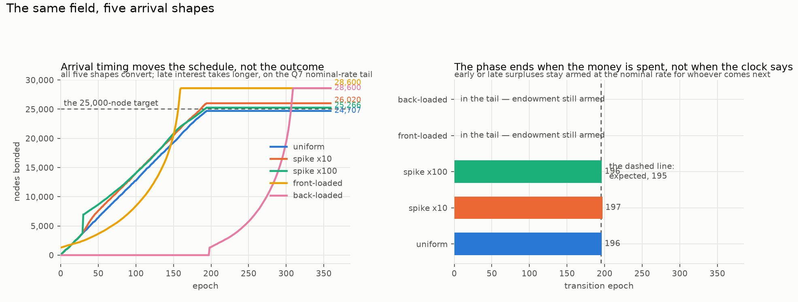

# Two designs for the same job — the current EmPoWering against the de-novo redesign

## What this document is

A side-by-side of the mechanism as currently specified — measured in the strategy report and its simulator on the `EmPoWering-simulator` branch, including its recent §7 arrivals-as-process study — against the de-novo redesign of this branch, measured in `denovo-report.md`. Both simulators share the fee model, the transaction sizes, the device data and the ledger arithmetic, so where the numbers differ it is the mechanisms differing, not the instruments. They now also share a **power basis** — one node is a whole four-core Raspberry Pi 5 board, 24,146 candidates a second — which they did not until this revision: the de-novo engine had been seating nodes at one core, a factor of four adrift from the elevation study whose figures appear beside it here. Corrected, and the correction moves the redesign's bonds by under 0.1%, because its payout is governed by the budget rather than by the field.

The one-sentence version: **the current design rations a fixed flow and therefore has a best adoption speed, a closing door and a point of no return; the redesign spends a budget wherever the crowd actually shows up, has none of those three, and pays for it with a first-come exposure the rationing never had.**

### How to read this

**§0 below is written for a reader who wants no arithmetic at all** — it explains the whole
choice in everyday language and is complete on its own. Everything after it is the evidence
behind §0, and each of those sections opens with a short *plain-words* paragraph, so you can
keep skimming at whatever depth suits you.

| if you want… | read |
| --- | --- |
| the choice explained from scratch, no numbers | **§0** — and you can stop there |
| what each design holds fixed and what it lets move | §1 |
| the strongest measured difference between them | §2 |
| the three-way table, including the mitigated variant | §4.1 |
| the scorecard against the original brief | §6 |

**Two terms carry the comparison.** A **claim** is one piece of mining work, submitted and
paid. The **bond** is the deposit that lets a node run a paid service — the finish line
newcomers are saving toward.

## 0. In plain words, for anyone

**What the mechanism is for.** Somebody who owns no tokens should be able to join the network by doing useful computation, be paid for it, and eventually save enough to put down the deposit that lets them run a paid service. That path — work, save, join — is the whole point. Both designs are attempts at it, and they differ in how the money for it is handed out.

**How the current design hands it out.** The protocol pays a fixed number of prizes per block, forever, and adjusts the puzzle's difficulty so that number never changes no matter how many people are competing. The prize itself starts small and shrinks steadily. So the pot is a slow, unchanging dribble, shared among however many people turn up.

That has an awkward consequence. **If a lot of people arrive at once, nobody gets turned away — but everybody's share gets thinner**, and the newcomers take proportionally longer to save up. The simulations show what that means in practice: there is a *best speed* for people to arrive (too few and the money goes unused, too many and nobody saves enough), and there is a point after which the queue of people waiting is bigger than every deposit the remaining money could ever fund. Past that point, arriving is pointless — and the date it happens can be worked out in advance from the size of the pot alone.

**How the redesign hands it out.** Instead of a dribble, it sets a **budget**: "we intend to bring in this many people, over this many years, using this much money." Divide the money by the years and you get what each period may spend. Pay whoever shows up out of that period's budget — and if an unexpected crowd arrives, **keep paying them out of the money set aside for later periods** rather than making everyone wait.

That removes all three problems above. There is no best speed, no closing door, and no point of no return, because the money follows the people rather than the people competing over a fixed trickle. The simulations bear it out: whether newcomers arrive steadily, or a hundred times over in a single week, or all at the end, roughly the same number get in.

**What it costs.** Money that follows the people can be followed by the wrong people. One very large operator arriving early can take a great deal of the fund quickly — more than half of it, measured — because the mechanism has no way to say "you have had enough". The current design's slow dribble prevents that by accident, simply by never handing out much at once. This was a deliberate choice rather than an oversight: the same rule that lets a genuine crowd in is the rule that lets a big player take a lot.

**And there is a third option that fixes it cheaply.** Put a limit on how much of the remaining fund any single period may hand out *beyond its own share* — say a tenth. A big operator is then metered: it takes a tenth, the mechanism notices the surge and cuts the price for everyone, and its later attempts buy far less. A genuine crowd is metered too, but a crowd is not in a hurry — everyone still gets in, they simply wait about 37% longer. Measured, that turns the big operator's haul from **more than half the fund into under a tenth**, and it costs nothing in the number of people onboarded or the length of the programme. It is written up as **de novo\*** and it is a decision, not a discovery: it adds one number to the design that nobody can derive, and it means the fund no longer simply pays out until it is empty.

**The catch that affects both, and it is the important one.** Both designs quote their headline numbers assuming that once somebody has saved enough and joined, they *stop* competing for the prizes and leave the rest for newcomers. Nothing pays anyone to do that, and joining does not switch their computer off.

The arithmetic is a textbook collective-action problem. For somebody who has already joined, the prize money is about **6% of what they now earn** — the service they can run pays far better — so carrying on is barely worth anything to them. But if everybody carries on, **four and a half times fewer people ever get in**, because the newcomers are competing against everyone who came before them and never left. A small private gain, a large public cost, and nothing in either design converts one into the other.

So the realistic expectation is that people carry on, and **both designs bring in roughly a third of the people their headline numbers promise.** That is not an attack; it is what ordinary self-interest produces. Both sets of figures in this document are given at both ends for that reason.

And it is no longer only an expectation: letting each joiner *re-decide every period* — weighing what the prizes pay against what the electricity costs, including the small bonus that crowding out a newcomer protects their service income — was measured in the redesign's simulator (`adversarial-analysis.md` §2.3). Everyone carries on for the whole programme, and everyone stops the moment it ends. One twist matters for planning: the prizes are paid in tokens and electricity in dollars, so **a more valuable token makes the problem worse** — the optimistic headline numbers require a token worth under a cent, and at any price that would count as success, the one-third figure is what happens.

**What actually has to be decided.** Whether the network wants a mechanism that treats everyone who turns up the same regardless of when they come (the redesign) or one that cannot be drained quickly by any single participant (the current design). The simulations can say what each one does; they cannot say which of those two properties matters more, and that is the decision in front of you. Either way, the numbers should be re-struck on the assumption that joiners keep mining, because that is what they will do.

## 1. What each design fixes, and what it lets move

*In plain words: every design has to hold something steady and let something else float. That single choice — what is nailed down and what is allowed to move — is where these two designs part company, and everything else follows from it.*

| | current | de novo |
| --- | --- | --- |
| fixed by the protocol | the claim count (10/block, held by the difficulty against a measured 380× load change) and the pool's outflow rate (`distribution_rate = 1/200`) | the budget schedule (`endowment / epochs_left`) and the reward's floor (the anchor) |
| left to demand | who gets the fixed flow | how fast the budget converts, and when the phase ends |
| parameters someone must defend | `distribution_rate`, `target_claims_per_block`, pool % | pool %, `expected_nodes`, `expected_years` — with the consistency identity checked before anything runs |
| the pool's end | never — geometric decay, 4.866% left after 12.3 years, exact to four figures across all arrival rates | epoch 196 on the reference triple, one past the 195-epoch schedule; **unmoved by spikes** — the borrow is re-spread over the epochs still left — and later at the nominal-rate tail under weak interest |

The current design's two rate constants are the ones its own report could only defend by simulation. The redesign's three are statements of intent, and the identity `implied_efficiency = nodes × min_stake / endowment` prices a triple against the conversion efficiency measured **in this mechanism** — about 15% if nobody retires, rising from 25% to 74% with the arrival rate if they do — at parameterisation time, which is a check the rate form cannot even express.

## 2. Arrivals: the strongest measured contrast

*In plain words: the sharpest difference between the two, and the reason to prefer one. What happens when people show up at different rates and at different times? The current design cares a great deal; the redesign barely notices.*

The strategy report's §7 replaces constant arrivals with a Poisson process and measures the consequences of rationing. Set those against the de-novo matrix directly:

| question | current (§7 of the strategy report) | de novo |
| --- | --- | --- |
| does adoption speed matter? | **a hump**: 951 elevated at 2/epoch, ~6,100 near 100/epoch, 5,001 at 500 — the worst rate elevates a sixth of the best | **no**: 24,707 / 26,020 / 25,266 bonds under uniform, ×10 and ×100 arrivals if miners retire; 7,963 / 8,027 / 7,384 if they do not — a third of the level either way, but flat across the shape in **both** regimes |
| is there a closing door? | **yes**: the last cohort with even odds of bonding arrives at epoch 286 (10/epoch), 40 (100/epoch), 3 (250/epoch) **under persistence**; 399 / 251 / 77 under retirement — the door is real in both regimes, and much earlier in the one the incentives deliver | **no**: the ×100 cohort — 13,000 nodes in one epoch — is admitted and paid in both regimes, and the phase still ends on schedule — the amortisation re-spreads the borrow rather than moving its own deadline. It *bonds* completely only under retirement (median 43 epochs); under persistence 24% of it does |
| a point of no return? | **yes, computable from the pool alone**: the waiting queue passes every bond the endowment can still fund at epoch **214** at 100/epoch under persistence (338 under retirement) — computed and gated; the strategy study's carried 212/119/72 sweep pointed at the same cliff | **none exists**: the queue cannot outgrow the budget because the budget is spent on whoever is present; under total silence the Q7 tail holds the offer at the nominal rate until claimed |
| does timing matter on a fixed population? | **1.64× between best and worst**; the early burst *loses* to flat and the late ramp loses 38% — the mechanism rewards arriving at a rate it can meter | **within noise inside the window** (retiring: 24.7k–28.6k; persistent: 6.1k–8.0k); late arrival costs time, not conversion |
| does the mechanism ever keep up? | at ≥ 25/epoch it is behind from the first epoch and never once catches up | keeping up is not the frame: saturation is routine, bounded, and repaid by the schedule |

This is the R5 requirement seen from both sides. The current controller holds the claim count flat, so a cohort's arrival only thins every share — §7's window, hump and no-return point are the three faces of that one fact. The redesign inverts it: the claim count is a consequence, the budget borrows forward, and a spike costs the schedule rather than the cohort.

Where the two agree is as instructive: the current §7's *retirement* column reaches 100% absorption up to 25/epoch and peaks at 28,023 elevated — and the de-novo reference triple presumes exactly that behaviour (implied efficiency 50%, at the retiring edge of the band). **Neither design pays for that behaviour.** Measured in the redesign, persistence is not merely a lower number but a different shape — flat at about 15% whatever the arrival rate, where retirement rises from 25% to 74% across the same range — and it costs roughly two thirds of onboarding. Both designs' headline figures are the optimistic end of a range, and this document gives both ends wherever it quotes one. **The current design achieves at its single best amplitude, with retirement, roughly what the redesign achieves at every arrival shape tried.** The redesign does not create conversion the old mechanism lacked; it removes the requirement that adoption arrive at the one speed the rationing can meter.

## 3. The reward: emergent against defined

*In plain words: how much does one piece of work pay? In the current design that figure is a consequence of other choices, and nobody set it deliberately. In the redesign it is pinned to something meaningful — what a transaction actually costs. This matters because a number nobody chose is a number nobody can defend.*

| | current | de novo |
| --- | --- | --- |
| opening reward | 1.157 LGO, decaying geometrically (half-life 138 epochs) | 11.87 LGO — ten times higher, because a four-year linear spend outpaces a 1/200 geometric one — demand-indexed downward from there |
| steady state | emergent: the refill spread over a fixed claim count, ≈ 3× the anchor at reference traffic | defined: the anchor exactly — a transfer plus an inscription, tracking the fee market by construction |
| claims to a bond at open | ≈ 865 | 85 |
| self-funding claim | preserved | preserved (Q5) |
| fee drag at steady state | ≈ 20% of the reward | 59.7% — the post-phase pays its stated bundle and little more, by design |

The current steady reward happens to cover a useful bundle with margin; the redesign's *is* the bundle. Which is preferable is R8's intent question, not a simulation's.

## 4. What each design concedes

*In plain words: the honest weaknesses of each, side by side. Neither is free; the question is which price you would rather pay.*

**The current design cannot be drained and cannot be rushed** — the controller fixes the outflow against any actor, whale included; a large miner captures a share of a fixed flow, never more flow. The price is everything in §2: doors, humps, queues.

**The redesign cannot turn anyone away and therefore can be drained.** The measured whale takes 17% / 50% / 56% of the endowment at 1× / 3× / 10× the field it meets, inside the index's one-epoch lag — accepted as documented, gated properties under Q8/Q9's R6-literal reading: the endowment is first-come. The rationing the old design uses as an accidental whale defence is exactly the behaviour R5 rejects, so this trade is not an oversight in either direction; it is the design choice, made explicitly.

Both designs are attacked concretely in `adversarial-analysis.md`. It finds the redesign's two novel surfaces closed by measurement (withholding and cliff-harvesting both lose money), the redesign markedly *more* sybil-resistant at moderate flooding (3.5% of honest bonds denied against 48.4%, at a doubled field), and — the finding that bears on both — that the retiring behaviour both designs' headline numbers assume is not incentivised, costing a third to two thirds of onboarding when it fails. Two exposures are shared and unchanged by the redesign, and honesty requires saying so. The service stream's flat split dilutes with success in both worlds — the strategy report measures 6,185 LGO per provider per epoch at two hundred providers and 166 at seven and a half thousand, and nothing in the redesign touches that arithmetic. And both mechanisms pay claims in proportion to hashrate within an epoch, so neither has any per-identity defence beyond the claim fee — accepted deliberately, since proof of work is sheer power and any remedy would make it something else.

### 4.1 Three designs, side by side

*In plain words: the full comparison table, including the mitigated variant. This is the densest thing in the document and the place to look if you want one view of everything.*

The whale is the redesign's one accepted weakness, and `adversarial-analysis.md` §3.4 shows it is closable. That makes three design points worth comparing rather than two:

| | current | de novo | **de novo\*** |
| --- | --- | --- | --- |
| onboarding, retiring / persistent | 27,125 / 5,465 | 24,707 / 7,963 | 24,782 / 7,963 |
| a ×100 cohort's fate, **retiring** | the door has already closed at this arrival rate | 100% bonded, median 43 epochs | 100% bonded, median **59 epochs** |
| a ×100 cohort's fate, **persistent** | the door has already closed | 24% bonded, median 69 epochs | 24% bonded, median 69 epochs — the bound costs it nothing |
| best adoption speed | **a hump** — worst rate elevates a sixth of the best | none — flat across arrival shape | none |
| a 10× whale at its best moment | cannot happen: the flow is fixed | **55% of the endowment** | **9%** |
| a 3× / 100× whale | cannot happen | 33% / 56% | 9% / 9% — flat |
| phase length | never ends | 196 epochs | 197 epochs |
| parameters someone must defend | 3 | 3 | **4** |
| pays out until exhausted (R6 literal) | n/a | yes | within an epoch, no |

*All three columns are measured at the same arrival rate and horizon — 130 arrivals an epoch over 360 epochs. The current design's often-quoted 25,934 / 5,682 is the same mechanism at 100/epoch over 400 epochs, which is what its own study used; quoting that pair beside the redesign's was comparing designs at different arrival rates.*

**`de novo*` buys the current design's whale-resistance without its rationing** — and the price is one parameter with no natural value, plus a 37% longer wait for exactly the crowds R5 exists to protect. Everyone still gets in; they get in later. **In the persistent regime that wait cost vanishes entirely** — a ×100 cohort bonds at 24% and a median 69 epochs with the cap or without it — so under the behaviour incentives actually deliver, the variant is one parameter for a sixfold reduction in whale exposure and nothing else.

Which of the three is right depends on a judgement the simulations cannot make: whether an early large operator taking half the onboarding fund is a tolerable cost of an open door, a reason to meter the door, or a reason to keep the slow dribble that never opened it wide in the first place.

## 5. What the comparison cannot settle

*In plain words: the limits of this exercise. Simulations can say what each design does; they cannot say which of two competing goods matters more to the people running the network. That part is a judgement, and it is stated here rather than smuggled into a recommendation.*

The conversion-efficiency band the redesign's identity check leans on was measured under the *current* reward dynamics; re-measuring it under the demand-indexed reward is the natural next study, and the de-novo report lists it as its first limitation. The current design's §7 numbers come from Poisson arrivals over a 600-epoch horizon; the de-novo matrix uses shaped arrivals over 220–420 epochs with equal totals — the qualitative contrasts of §2 are far outside either study's seed noise (the current report bounds its own at ~13%, the de-novo pins its headline counts exactly), but individual counts should not be read to the last digit across the two. And neither simulator models the leadership lottery or the emission side differently: everything downstream of the block reward is common ground.

## 6. The verdict, requirement by requirement

*In plain words: the scorecard. Both designs scored against the same original brief, line by line.*

| requirement (the de-novo brief) | current design | de novo |
| --- | --- | --- |
| R1 minimal parameters | two rate constants defensible only by simulation | three intent parameters plus an upfront feasibility check |
| R4 pool / nodes / years as the definition | inexpressible — nodes and years are outcomes discovered afterwards | the definition |
| R5 spikes absorbed | the door closes at epoch 40 at 100 arrivals/epoch under persistence (251 under retirement) | the ×100 cohort is admitted in both regimes; it bonds 100% (median 43 epochs) under retirement, 24% (median 69) under persistence |
| R6 saturation semantics | exhaustion excluded by construction, margin ~2,000 vs 1,024 | saturation routine and bounded; a ×k spike borrows about k budgets (×100 median 97×, 58–125 across seeds) |
| R7 fee-funded, even post-phase | no post-phase concept; the pool never ends | budget = last epoch's fees; saturation in the epoch's last half-percent |
| R8 reward = transfer + inscription | emergent, ≈ 3× the target bundle | the anchor, by definition |
| whale resistance | inherent, via the rationing R5 rejects | base: conceded and documented (Q8) — 55% at the worst moment. **`de novo*`: 9%, flat across whale size, for one parameter and a 37% longer wait** |

On its own brief the redesign wins every row except the last, and the last is the one it conceded deliberately. On the old design's implicit brief — hold the outflow invariant against everything — the current mechanism remains the correct answer. The two briefs cannot both be wanted at once, which is what made the de-novo exercise worth running.
