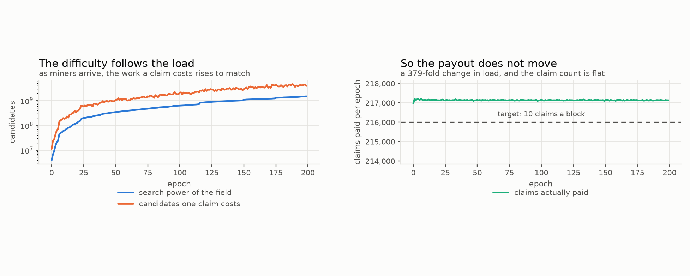
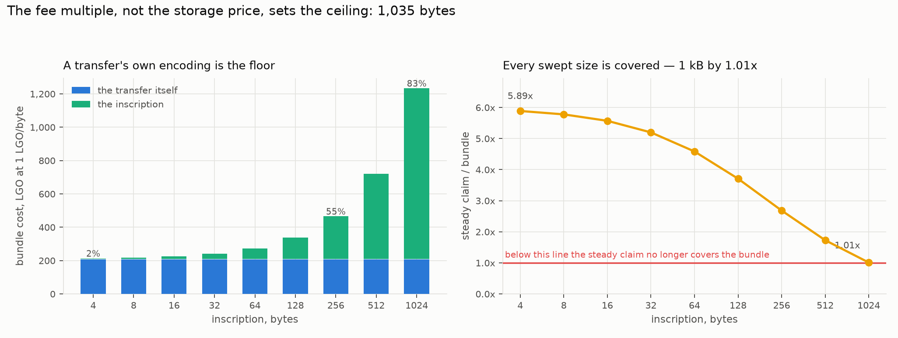
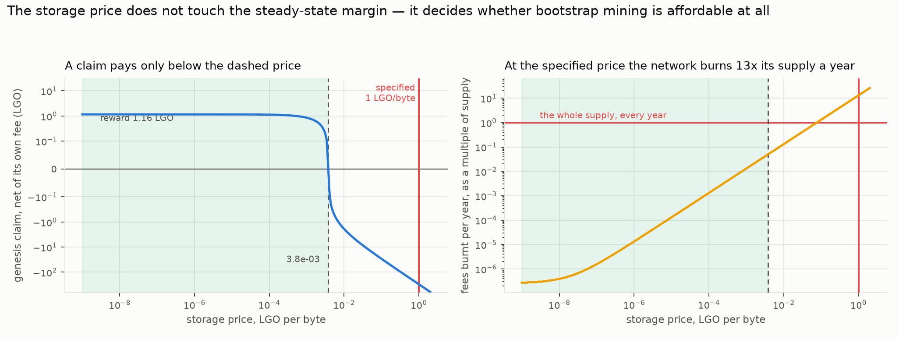

# Which strategy pays — five ways to participate in EmPoWering

## What this document is

A simulation of the EmPoWering mechanism from the point of view of the people using it. The specifications say how the chain pays; this asks what that adds up to for a node that has chosen a way to take part, and whether the mechanism does the job it was designed for — letting someone with no tokens work their way into the system.

Everything here runs on one honest chain. Every group is simulated at the same time, competing for the same rewards, because a strategy's return depends on who else is playing. Nothing models an attacker, a network delay or a failure: the question is what happens when the mechanism works.

Notation follows the tokenomics report's convention — prose and code spans carry self-describing names, so `reward_per_claim` here is the same quantity as `reward_per_claim` there and in the specification.

Regenerate every figure with:

```
python3 -m empowering_sim.plots_strategies --out figures/strategies --epochs 120 --nodes 100
```

---

## 1. The model

### 1.1 What the chain does

Time is divided into **blocks** of 30 seconds and **epochs** of `blocks_per_epoch = 21,600` blocks — 7.5 days. Each block has one leader, chosen by lottery, and each block carries transactions. That is the whole of the chain for our purposes: we do not model the network that moves blocks around, only the ledger's arithmetic.

### 1.2 The three ways to be paid, and the two places the money comes from

Keeping those two places straight is most of understanding the mechanism.

**Proof-of-work claims — paid from a pool of tokens that already exist.** Anyone can grind: hash candidate keys until one lands below a threshold, then submit a claim and be paid. Nothing gates this — no stake, no permission, no identity. The money comes from a **pool** seeded at genesis with `genesis_pool = 0.5%` of `launch_supply`, fifty million LGO. Each epoch the pool pays out a fixed fraction of itself, divided over a fixed number of claims:

| `reward_per_claim = distribution_rate * pool / (target_claims_per_block * blocks_per_epoch)` |
| --- |

At `distribution_rate = 1/200` and `target_claims_per_block = 10`, that is 216,000 claims an epoch sharing a two-hundredth of the pool. The pool is topped up by diverting a share of transaction fees before they are burnt, `epoch_refill = pow_share * blocks_per_epoch * txs_per_block * avg_tx_fee`, with `pow_share = 10%`. Claiming is not free: the claim transaction pays its own fee, so a miner keeps `reward_per_claim - claim_fee`.

**Leader rewards — paid from newly minted tokens.** Each block's leader is drawn by lottery, weighted by the stake it holds. There is **no minimum**: a note of any size can win, provided it has been held long enough to have *aged* into the stake snapshot — two epochs, fifteen days. Aging is the only gate, and it matters in §5.

**Service rewards — also newly minted, but divided a completely different way.** A node that locks `min_stake = 1,000 LGO` may declare itself a service provider, and the service pool is then split **equally among the providers**:

| `reward_per_provider = blend_pool / providers` |
| --- |

There is no stake term in that formula anywhere. A provider at the bare minimum earns exactly what a provider holding a million tokens earns. Stake is a door, not a dial. Two consequences run through this whole report: holding more than the bond is worth nothing to this stream, and each additional provider dilutes every other one. And it does not taper — below **32 providers** the specification says the reward is not calculated at all.

**What funds the last two.** Leader and service rewards come out of the block reward, which is newly minted tokens. How much is minted is not fixed; a controller steers it by watching how much stake the network has:

| `block_reward = emission_factor * max_minted_per_block + (1 - emission_factor) * burnt_fees` |
| --- |

The `emission_factor` runs from 1 to 0. At 1 the protocol mints at its ceiling of 95.13 LGO a block and ignores fees. At 0 it mints nothing new and simply re-mints whatever that block burned. What moves it is the gap between the stake the network has and the `stake_target` of 30% of supply: far below target it mints hard to attract stake, and at target it stops. Whatever is minted is split **60% to the Blend service and 40% to the leader**.

In one line: **mining is paid out of a finite pot of old tokens, while leading and providing are paid in new ones — and only while the network is short of stake.**

### 1.3 The difficulty controller, and why it decides more than it appears to

The mining threshold is not fixed. A controller adjusts it every block so the number of claims stays near target, whatever search power has turned up:

| `next_difficulty_target = target_claims_per_block * difficulty_target / ((1 - smoothing) * claims_in_block + smoothing * target_claims_per_block)` |
| --- |

This is a thermostat: claims arriving too fast tighten the threshold, too slow loosens it. The expected work for one claim is `candidates_per_claim = field_modulus / difficulty_target`.



The left panel is the thermostat working. Over 200 epochs miners arrive continuously and the field's search power grows **380-fold**; the work one claim costs climbs to match, across three orders of magnitude. The right panel is the consequence, and it is the most important structural fact in this report: **the number of claims paid does not move.** Flat at about 217,000 an epoch through a 380-fold change in load. The half-percent above the 216,000 target is the controller's known overshoot, not drift.

Follow that through. The pool pays a fixed amount per claim; the controller fixes the number of claims; therefore **the pool's outflow is fixed too** — it does not move with mining, adoption or hardware. That is why §6 finds the pool's behaviour completely independent of demand: the difficulty absorbs every bit of the load variation before it can reach the pool. What the outflow is *balanced against* is a separate question, answered by the fee level rather than by the controller, and §6 shows the two very nearly cancel.

### 1.4 What we do not model

No Blend network, no propagation delay, no forks, no churn, no adversary. Every node behaves honestly and stays for the whole run. Traffic and the fee level are inputs rather than outcomes. Where a simplification could move a number, §12 says so.

---

## 2. The five strategies

| # | strategy | mines | lottery | services |
| --- | --- | --- | --- | --- |
| 1 | miner | yes | no | no |
| 2 | miner and staker | yes | on what it mines | no |
| 3 | miner, staker and service provider | yes | yes | on reaching the bond |
| 4 | stakeholder | no | on initial stake | no |
| 5 | stakeholder and service provider | no | yes | yes |

Groups 4 and 5 are each endowed with 5% of launch supply, drawn once from a Pareto distribution and reused between them. Groups 1 to 3 start with nothing and get a Pareto hashrate distribution floored at a measured Raspberry Pi 5, likewise drawn once and shared. Reusing the draws is what makes this a comparison of strategies rather than of luck: group 1's fastest miner is the same machine as group 3's.

A word on why the comparison is not straightforward. Groups 1 to 3 arrive with hardware and no tokens; groups 4 and 5 arrive with five million LGO apiece. Simply totalling what everyone earns would answer "who was given more at genesis". So each table below carries the raw figure and the ratio against a plain stakeholder, which is the closest thing to a neutral baseline: capital doing nothing but the lottery.

---

## 3. The result


| strategy | median node, LGO | against a plain stakeholder |
| --- | --- | --- |
| miner | 49,957 | 0.30× |
| miner and staker | 52,067 | 0.31× |
| stakeholder | 167,743 | 1.00× |
| miner, staker and service provider | 801,673 | **4.78×** |
| stakeholder and service provider | 936,012 | **5.58×** |

**Service provision dominates by a factor of five and a half**, and structurally rather than because a parameter was set badly: its reward carries no stake term, so the whole Blend pool divides flat among however many providers exist — and that pool is 60% of everything the protocol mints.

**Staking on top of mining is worth four percent.** A miner who stakes everything it mines earns 52,067 against a pure miner's 49,957. What a miner accumulates in two and a half years is simply small against 5% of supply, so its slice of the lottery is small too.

**Mining is the weakest of the five.** A miner earns less than a third of what a stakeholder earns, and it is the only strategy that pays for its income in electricity.

---

## 4. Dispersion, and the strategy that erases it


Medians hide the more interesting result. These curves sort every node within its group, so a steep curve means members did very different things and a flat curve means they all did much the same.

| strategy | p10 | median | p90 | max ÷ min |
| --- | --- | --- | --- | --- |
| miner | 25,831 | 50,151 | 153,028 | 22.4× |
| miner and staker | 27,003 | 52,478 | 160,851 | 22.5× |
| stakeholder | 98,805 | 163,851 | 713,482 | **109.5×** |
| miner, staker and service | 766,820 | 807,612 | 928,856 | **1.7×** |
| stakeholder and service | 863,938 | 930,422 | 1,466,001 | 12.6× |

A plain stakeholder's reward spans a **hundred-and-tenfold** range, because leadership pays strictly in proportion to stake and the stake draw is Pareto — the richest tenth of that group holds 57.7% of it. The miner-staker-service curve spans **1.7×** across a hundred nodes whose hardware differs 22.4-fold.

**Service provision is the only stream on the chain that compresses inequality, and it compresses it almost completely.** Mining and leading both pay in proportion to what you brought, so they preserve whatever distribution walked in; a flat per-provider payment destroys it. That is exactly what one would want from an on-ramp, and it is also a standing invitation to split one large operator into many bonded identities, since the mechanism pays per identity rather than per unit of capital.

---

## 5. When nodes actually become providers


The bond is fixed at 1,000 LGO, and the two provider groups reach it by opposite routes. The endowed group holds far more than the bond from genesis, so it is a provider as soon as its declaration clears the two-epoch snapshot lag — bonded at epoch 2. The miners must earn theirs, which at this bond is about **865 claims**: they cross between epochs 2 and 5, roughly five weeks.

So the on-ramp into the largest reward stream on the chain takes about a month, and **note aging rather than the bond is what floors it** — a miner waits nearly as long for its notes to age as it does to earn them, so lowering the bond further would buy nothing.

With the bond fixed, the live question is not how high the threshold is but who turns up. The right panel drops the endowed cohort and asks whether miners can turn the service stream on by themselves.

| miner cohort, nobody already inside | outcome |
| --- | --- |
| 16 nodes | plateaus at 16 — **never reaches the floor, so the stream never pays** |
| 32 nodes | exactly at the floor; marginal |
| 64 nodes | clears it by epoch 4 |
| 100 nodes | clears it by epoch 4 |

**A cohort smaller than thirty-two never turns the stream on, however long it mines.** Every member can cross the bond inside a month and still earn nothing from it, because below that count the reward is not calculated at all. This is a real bootstrapping condition, and it is why the left panel looks so comfortable: both curves sit above the floor only because the endowed group alone is a hundred nodes, carrying the floor while the miners climb. **The on-ramp needs somebody already inside for it to be worth walking up** — or thirty-two people arriving together.

---

## 6. How many can be elevated, and what the pool spends doing it

A separate study with **dynamic arrivals**: new nodes are seated every epoch, so the field grows and each miner's share of a fixed claim flow shrinks. Two groups only — endowed providers who arrive above the bond, and mining providers who must earn it. Only the second is elevated by the mechanism.

A first guess at a ceiling comes from arithmetic. The endowment is the only source of a miner's first tokens *if the pool is never refilled*, and every elevation costs one bond, so `genesis_pool / min_stake` is **50,000**, and at genesis the pool can fund `distribution_rate * pool / min_stake` = 250 of them an epoch. Hold on to that number, because the simulation says it is the wrong kind of quantity: it is a milestone, not a limit.


### The pool does not drain — the fees very nearly replace what it pays

The three curves on the left are miner populations differing **fiftyfold**, and they lie on top of one another. This is §1.3 playing out: the controller fixes the claim count and the pool pays a fixed amount per claim, so the outflow is a property of the pool rather than of demand. No arrival rate, no hashrate and no adoption scenario moves that curve.

What the curve *does* is the surprise. The pool does not fall. It **drifts up**, to 106% of its genesis level after 400 epochs, because `epoch_refill` runs slightly ahead of `distribution_rate * pool`. The two are within 7% of exactly cancelling, and §9 shows this is not a coincidence but a property of the price storage is sold at: there is a storage price at which the endowment *is* the pool's fixed point, and the parameters sit almost on it.

This corrects a headline result. Earlier revisions of this study reported a pool half-life of 138 epochs and 90% depletion within a decade. That was an artefact of pricing permanent storage at the execution market's rate, which understated every fee — and therefore every refill — by nine orders of magnitude. **With the two markets priced separately, the proof-of-work pool is self-sustaining and there is no depletion horizon to plan around.**

### What the spend buys, over 400 epochs

| bonded miners | elevated in 400 epochs | against the 50,000 milestone | still climbing? |
| --- | --- | --- | --- |
| keep mining | 9,295 | 18.6% | yes |
| retire | 19,982 | 40.0% | yes |

Neither run is finished, and neither is bounded: with the pool holding its level, fees alone fund `epoch_refill / min_stake` = **268 bonds an epoch, indefinitely**. Elevation is limited by how long the network runs, not by how much the pool holds.

A bonded miner that keeps mining takes claims from miners still trying to cross, and it has no reason to — its service income is far larger than anything more mining will add. **Retiring bonded miners is worth just over twice as many elevations, for free**, and nothing in the protocol makes them stop. The rest becomes sub-bond balances: real tokens held by miners who mined for years without reaching the threshold that would have made them worth something.

---

## 7. What a mining reward actually looks like


Per block this is the arrival process at a fixed price: the reward per claim is frozen for the whole epoch, so the shape is just the Poisson count of claims, with a median of 8.4 LGO a block against a target of ten claims at the opening reward. Per epoch the picture also carries the reward's slow drift upward, which is why it is not the same distribution rescaled — the pool sits just under its fee-funded fixed point, so the per-claim price creeps up across the run rather than decaying. Neither distribution has a tail worth worrying about.

---

## 8. Electricity, and why it does not change the answer

Miners pay for their income and stakeholders do not. Netting it out at a Raspberry Pi 5's measured rate, whole-platform, at 20 cents a kilowatt-hour:

| strategy | median electricity, 120 epochs | break-even token price |
| --- | --- | --- |
| miner | $83.28 | $1.7 × 10⁻³ /LGO |
| miner and staker | $83.28 | $1.6 × 10⁻³ /LGO |
| miner, staker and service | $83.28 | $1.1 × 10⁻⁴ /LGO |

Mining stops paying only if a token is worth less than about a sixth of a cent; above that, electricity is a rounding error and the ordering in §3 is unchanged. It is worth being clear what that means: **mining is not weak because it is expensive, it is weak because it pays little.**

---

## 9. The full horizon — the mechanism switches itself off

Everything above is a 120-epoch run, which is the bootstrap era. Run it to 2,085 epochs — the whole life of the endowment, about 43 years — and a dynamic appears that a short run structurally cannot show. Minted rewards compound into their holders' stake, and that stake is the very quantity the emission controller steers on. So the rewards drive total stake toward its target, and on reaching it the controller does exactly what it was built to do: it stops minting.

| era | emission factor | block reward | service per provider | proof-of-work pool |
| --- | --- | --- | --- | --- |
| bootstrap, yr 0–10 | 1.00 | 95.13 LGO | 6,185 LGO/epoch | 18.1M LGO |
| transition, yr 10–25 | 0.64 | 60.44 LGO | 3,920 LGO/epoch | 1.1M LGO |
| equilibrium, yr 25–43 | **0.00** | **0.023 LGO** | **1 LGO/epoch** | 25.6k LGO |

Stake reaches 99% of target at about year 20, and by year 25 the block reward has fallen more than three orders of magnitude with every stream it funds. **Every reward figure in this report is therefore a bootstrap-era figure**, and the mechanism's generosity is a phase rather than a property.

### Does the equilibrium era pay anyone?

A transaction pays into **two** fee markets, and they are three orders of magnitude apart. Execution gas is charged per Operation and rests at 7 lepta. Permanent storage gas is charged on the encoded size of the whole signed transaction — one gas per byte — and is priced in whole LGO. Storage therefore dominates: a transfer's fee is, to three figures, its byte count times the storage price, and the 590 gas of execution beside it is a rounding error.

That changes the question from "can the fee ever get high enough" to "is the modelled traffic already enough", and it is:

| | |
| --- | --- |
| a transfer's fee at the operating storage price | **0.207 LGO** |
| a block's burn at 600 transactions | **112 LGO** |
| the minting ceiling it has to replace | 95.13 LGO |
| transactions a block needed to match the ceiling | **511** |

**So the equilibrium era is already funded at the traffic this report models**, with 17% to spare, and without the fee market having to move at all. This is a much stronger result than earlier revisions of this study reported, and for an unglamorous reason: those revisions priced permanent storage at the execution market's rate and so understated every fee by a factor of about a billion. What remains true is the shape of the risk — the mechanism never drives fees up on its own, it only tracks demand, so **the long-run incentive is still a bet on adoption**. What has changed is how big that bet has to be: roughly five hundred transactions a block rather than a fee level nobody has ever seen.

---

## 10. What should one claim be worth?

The design goal for the era after the endowment is spent is that a claim still buys something concrete: a transfer carrying a small inscription. That gives a target a number can be checked against, so this section prices the bundle and asks whether the mechanism can pay for it. The sizes swept are 4, 8, 16, 32, 64, 128, 256, 512 and 1024 bytes.

### The transfer's own encoding is most of the cost



Because storage is charged on the *whole signed transaction*, an inscription never pays only for itself: it rides on a transfer whose own 207 bytes are already on the meter. At 4 bytes the inscription is **1.9%** of what the bundle costs; the other 98% is the envelope. Only past 256 bytes does the message become the majority of its own transaction. Anyone reasoning about "the cost of inscribing N bytes" should start from a fixed cost of one transfer and treat N as the increment.

### The ceiling is 1,035 bytes, and the storage price has nothing to do with it

Ask what the fee-funded steady state can afford. The refill is a share of the fees the network pays; those fees are storage-priced, and so is the bundle. The price appears on both sides and cancels:

| `max_inscription_bytes = (pow_share * txs_per_block / target_claims_per_block - 1) * transfer_tx_bytes` |
| --- |

At the settled parameters that is `(0.1 * 600 / 10 - 1) * 207` = **1,035 bytes, whatever storage costs**. The intuition is worth keeping: a steady claim is worth six transfers' fees, one of which pays for its own transfer, leaving five transfers' worth of bytes to inscribe with.

Every swept size is therefore covered — by 5.89× at 4 bytes, falling to **1.01× at 1024**. The 1 kB target that earlier revisions assumed turns out to sit 1% inside a hard ceiling, which is far too little margin to build on: a 10% shortfall in traffic, or a claim target raised from 10 to 11, puts it under water. **A target of 256 bytes carries 2.68× and is the largest of the swept sizes with real headroom.**

### What the storage price does decide



Not the steady state — the bootstrap. During bootstrap the reward comes from the pool and does not move with the fee level, while the claim's own fee is almost entirely storage. So there is a price above which a claim costs more to submit than it pays:

| | |
| --- | --- |
| genesis `reward_per_claim` | 1.16 LGO |
| storage price at which a claim breaks even | **3.78e-3 LGO/byte** |
| storage price at which the pool is exactly self-funding | **9.32e-4 LGO/byte** |
| `P_STR(0)` as written in `storage-markets.md` | **1 LGO/byte** |

**The specified price is 264 times the affordable one.** At 1 LGO per byte a claim transaction costs 306 LGO against a reward of 1.16, so no miner can afford to mine, none ever reaches the bond, and the mechanism does not start. The same price would burn thirteen times the entire token supply in fees every year at the modelled traffic.

This is not read as a defect so much as an unset parameter. `storage-markets.md` states the requirement the price must satisfy — *"sufficiently low so as not to suppress early adoption"* — calls the precise value "not critical", notes the market converges to the clearing price from any start, and says genesis governance may adjust it. The stated value does not satisfy the stated requirement, so this study runs at **1e-3 LGO/byte**, which does: it keeps a claim clearing its own fee by 0.85 LGO, holds the annual fee burn near 1.3% of supply, and lands within 7% of the price that makes the endowment exactly the pool's fixed point. That last coincidence is what §6's flat pool curve is made of.

**The recommendation this section supports** is to set `P_STR(0)` near 1e-3 LGO per byte and take 256 bytes rather than 1024 as the self-sustaining inscription target.

---

## 11. Is the ordering robust?

Three sweeps, and only one thing overturns the answer.

**Horizon — the lead grows rather than decaying.** Accumulated reward is dominated by the bootstrap era, so a provider's advantage is locked in early and never given back: 5.58× at two and a half years, 7.04× at ten, 8.33× at twenty, 8.36× at forty-three.

**Stake concentration — changes the size of the lead, not its direction.** At a very concentrated Pareto draw the lead is 18.41×, at the default 6.71×, at a fairly even draw 3.52×. The more concentrated the stake, the more valuable a flat per-provider payment is against the median stakeholder's proportional income.

**Group size — the only inversion.** At ten nodes a group only twenty providers exist, the floor binds, and `staker+service` falls to 1.00×, identical to plain staking, because the stream does not exist. It overturns the result by removing the winning strategy from the chain rather than by beating it.

---

## 12. What would change these conclusions

**Who receives the emission — settled, by the EmPoWering PR itself.** `block-rewards.md` calibrates the maximum emission rate so that "the APY for validation is ~3.33%", which requires validators to receive the whole emission, while `overview-cryptoeconomics.md` gives leaders 0.4 with Blend taking 0.6. Both cannot hold, and the PR settles it in a sentence written for the purpose: *"The split between the Blend service and the leader is itself unchanged: they continue to divide the block reward 60/40."* The PR does not touch `block-rewards.md` at all, so its 3.33% figure is the stale side. The alternative is recorded only because of how much it would have moved: the two shares are complements of one split, so giving leaders everything sets the Blend share to zero — and service rewards *are* Blend rewards. Under that reading the dominant strategy of this report pays nothing and plain staking wins, 5.58× becoming 0.99×.

**Settled: a locked service bond carries leadership weight.** Not stated in the specification, so a decision rather than a reading. A provider therefore adds service income on top of its leader income rather than trading one for the other, and strategies 3 and 5 dominate outright rather than conditionally.

**The minimal-Hamming doubling is not modelled.** Providers at minimal distance earn twice the base share; here every provider earns the base share, so the service groups' dispersion is understated. The flatness in §4 is a floor on the flatness rather than the whole of it.

**The bond is fixed at 1,000 LGO and is not a study axis.** The specification names the threshold without valuing it; the static minimum stake analysis derives 1,000, under a supply a hundred times smaller than the one that governs. The figure stands as settled. What it leaves behind is that the binding constraint on the service stream is the thirty-two-provider count rather than the amount anyone must post.

**Whether bonded miners keep mining is unspecified, and worth four and a half times the elevation throughput.** If elevating nodes is a design goal, this is the cheapest lever available and it costs nothing: give bonded miners a reason to stop, or take them out of the claim lottery once they have crossed.
