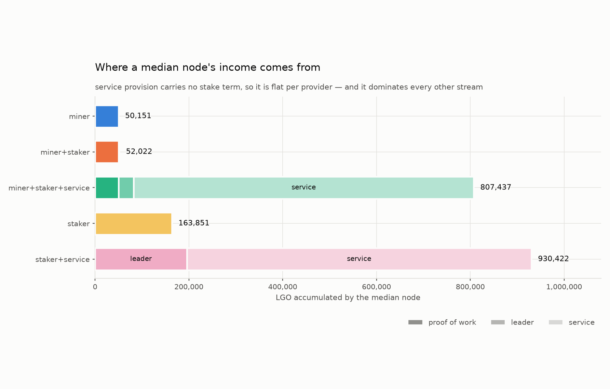
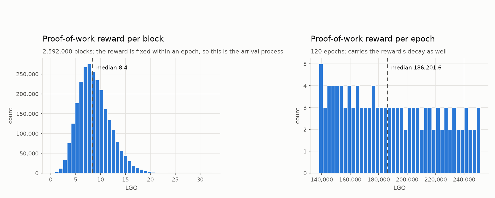
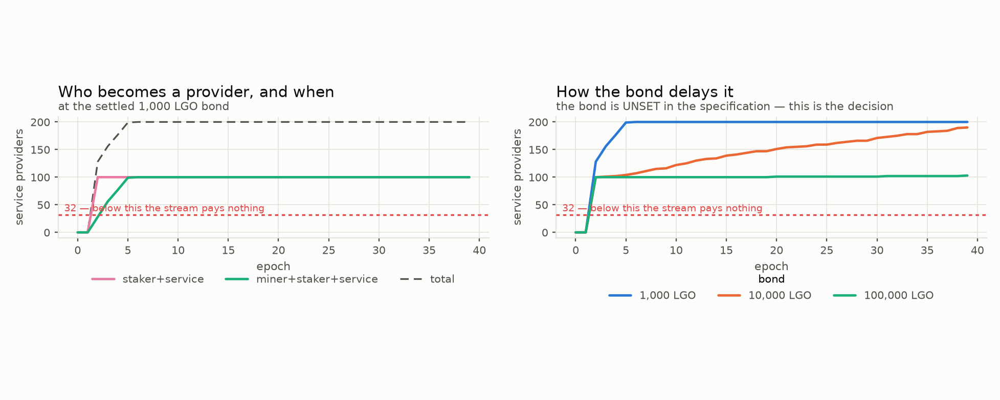

# Which strategy pays — five ways to participate in EmPoWering

Five participation strategies, simulated together on one honest chain for 120 epochs (about
two and a half years), competing for the same claim flow, the same leadership lottery and the
same service pool. A hundred nodes in each group. No Blend network, no propagation delay, no
adversary, no churn.

| # | strategy | mines | lottery | services |
| --- | --- | --- | --- | --- |
| 1 | miner | yes | no | no |
| 2 | miner and staker | yes | on what it mines | no |
| 3 | miner, staker and service provider | yes | yes | on reaching the bond |
| 4 | stakeholder | no | on initial stake | no |
| 5 | stakeholder and service provider | no | yes | yes |

Groups 4 and 5 are each endowed with 5% of launch supply, drawn once from a Pareto
distribution and reused between them. Groups 1 to 3 start with nothing and are given a Pareto
hashrate distribution floored at a measured Raspberry Pi 5, likewise drawn once and shared.
The paired draws are what make this a comparison of strategies rather than of luck.

Regenerate everything here with:

```
python3 -m empowering_sim.plots_strategies --out figures/strategies --epochs 120 --nodes 100
```

---

## 1. The result



| strategy | median node, LGO | against a plain stakeholder |
| --- | --- | --- |
| miner | 50,151 | 0.31× |
| miner and staker | 52,478 | 0.32× |
| stakeholder | 163,851 | 1.00× |
| miner, staker and service provider | 807,612 | **4.93×** |
| stakeholder and service provider | 930,422 | **5.68×** |

Three things fall out of that table, and only the first is obvious.

**Service provision dominates, by a factor of five and a half.** Adding a service declaration
to a plain stake multiplies a node's income more than fivefold. Nothing else on the chain comes close.

**Staking on top of mining is worth almost nothing — five percent.** A miner who stakes
everything it mines earns 52,478 against a pure miner's 50,151. The reason is arithmetic: what
a miner accumulates over two and a half years is small against 5% of supply, so its share of
the lottery is correspondingly small. The two curves are visually indistinguishable in §2.

**Mining is the weakest of the five.** A miner earns less than a third of what a stakeholder
earns, and it is the only strategy that pays for its income in electricity.

### Why service provision wins, and it is structural

The service reward carries **no stake term at all**. `blend-protocol.md` splits the service
income across providers holding a valid activity proof — `R = I / (B + P)` — and stake appears
nowhere in that formula. It is a binary admission gate and nothing more. So the stream is
**flat per provider**: a node at the bare minimum bond earns exactly what a whale earns.

That is not a parameter anyone chose badly. It is what the mechanism is: paying a service by
the provider rather than by the capital behind it. But it means the marginal value of holding
more than the bond is zero for the largest reward stream on the chain, and the marginal value
of *reaching* the bond is the entire per-provider share.

---

## 2. Dispersion — and the strategy that erases it


The rank curves say more than the medians do.

| strategy | p10 | median | p90 | max ÷ min |
| --- | --- | --- | --- | --- |
| miner | 25,831 | 50,151 | 153,028 | 22.4× |
| miner and staker | 27,003 | 52,478 | 160,851 | 22.5× |
| stakeholder | 98,805 | 163,851 | 713,482 | **109.5×** |
| miner, staker and service | 766,820 | 807,612 | 928,856 | **1.7×** |
| stakeholder and service | 863,938 | 930,422 | 1,466,001 | 12.6× |

**The two service curves are nearly flat and the stakeholder curve is not.** A plain
stakeholder's reward spans a hundred-and-tenfold range, because leadership income is
strictly proportional to stake and the stake draw is Pareto — the top tenth of that group
holds 57.7% of it. The miner-staker-service curve spans **1.7×** across a hundred nodes whose
hashrates differ by 22.4×.

So **service provision is the only stream on the chain that compresses inequality**, and it
compresses it almost completely. Every other stream — mining, leadership — pays in proportion
to what you brought, and therefore preserves whatever distribution you started with. A flat
per-provider payment does the opposite.

That is the most consequential property in this report, and it cuts both ways. It is exactly
what one would want from an on-ramp. It is also a standing invitation to split one large
operator into many bonded identities, which §5 returns to.

---

## 3. What the proof-of-work reward actually looks like



Per block the reward is the arrival process at a fixed price: the reward per claim is frozen
for the whole epoch, so the shape is the Poisson claim count and nothing else. Median 8.4 LGO
a block against a target of ten claims at the opening reward.

Per epoch the picture carries the reward's decay as well, which is why it is not the same
distribution rescaled: the spread runs from about 250,000 LGO down through 140,000 across the
run as the endowment drains.

Neither distribution has a tail worth worrying about. The per-block variance is what a
thermostat holding ten claims a block produces, and the retarget was independently gated to
hold that rate to within half a percent across a three-hundredfold change in the field.

---

## 4. Electricity, and why it does not change the answer

Miners pay for their income and stakeholders do not. Netting it out, at the Pi 5's measured
rate and a whole-platform basis at 20 cents a kilowatt-hour:

| strategy | median electricity, 120 epochs | break-even token price |
| --- | --- | --- |
| miner | $83.28 | $1.7 × 10⁻³ /LGO |
| miner and staker | $83.28 | $1.6 × 10⁻³ /LGO |
| miner, staker and service | $83.28 | $1.1 × 10⁻⁴ /LGO |

Mining stops paying only if a token is worth less than about a sixth of a cent. Above that,
electricity is a rounding error against the reward, and **the ordering in §1 is unchanged**.
This is the one place the study's answer is robust rather than delicate.

It is worth being clear what that means: mining is not weak because it is expensive. It is
weak because it pays little.

---

## 5. The floor that turns the largest stream off

The service stream does not taper. Below **32 unique providers** the specification says rewards
*"are not calculated"* at all and nodes must bypass the Blend network entirely.

| nodes per group | providers | outcome |
| --- | --- | --- |
| 10 | 20 | **no service reward at all** |
| 20 | 40 | pays, 30,828 LGO per provider |
| 40 | 80 | pays, 15,414 LGO per provider |
| 100 | 200 | pays, 6,166 LGO per provider |

At ten nodes a group the dominant strategy in this report simply does not exist, and strategies
3 and 5 collapse onto 2 and 4. A study run at small group sizes would conclude that staking
wins — correctly for that chain, and misleadingly for this one.

Note also the shape of the payoff: the per-provider reward is the pool divided by the provider
count, so **each additional provider dilutes every other one**. Between 20 and 100 nodes a
group, the per-provider reward falls fivefold. Service provision pays enormously *and* is
congestible, and the two facts are the same fact.

---

## 5b. When nodes actually become providers



The bond is **fixed at 1,000 LGO**. The two groups reach it by different routes. The endowed
group holds far more than the bond from genesis, so it is a provider as soon as its
declaration clears the two-epoch snapshot lag — bonded at epoch 2 and never later. The miners
must earn theirs, which at this bond is about **865 claims**: the group crosses from none to
all between epochs 2 and 5, roughly five weeks.

So the on-ramp into the largest reward stream on the chain takes about a month, and note
aging rather than the bond is what floors it — a miner waits nearly as long for its notes to
age as it does to earn them.

**With the bond fixed, the live question is not how high the threshold is but who turns up.**
The right panel drops the endowed cohort entirely and asks whether a network of miners can
turn the service stream on by itself:

| miner cohort, nobody already inside | outcome |
| --- | --- |
| 16 nodes | plateaus at 16 — **never reaches the floor, so the stream never pays** |
| 32 nodes | exactly at the floor; marginal |
| 64 nodes | clears it by epoch 4 |
| 100 nodes | clears it by epoch 4 |

**A cohort smaller than thirty-two never turns the stream on, however long it mines.** Its
members can each cross the bond in a month and still earn nothing from it, because the reward
is not calculated at all below that count.

That is a real bootstrapping condition, and it is the reason the left panel looks so
comfortable: both curves there sit above the floor throughout only because the endowed group
alone is a hundred nodes. It carries the floor while the miners ramp. **The on-ramp needs
somebody already inside for it to be worth walking up** — or it needs at least thirty-two
people to arrive together.

---

## 5c. How many nodes can the mechanism actually elevate — and what the pool spends doing it

A separate study, two strategies only: **endowed providers**, who arrive already above the
bond, and **mining providers**, who arrive with hardware and must earn it. New nodes are
seated every epoch, so the field grows and each miner's share of a fixed claim flow shrinks.
Only the second group is *elevated by the mechanism*.


### The pool drains on a clock nobody can change

The three curves on the left are miner populations differing **fiftyfold** — 1, 50 and 250
arrivals an epoch — and they lie on top of one another. After 400 epochs each has spent
**43,336,6xx LGO**, identical to six figures.

That is not a coincidence, it is the mechanism. The difficulty controller holds the claim
count at its target whatever the field size, so the pool pays `distribution_rate × pool` every
epoch regardless of how many miners exist or what they do. **Depletion is a property of the
pool, not of demand.** It follows a geometric decay with:

| | |
| --- | --- |
| half-life | 138 epochs — **2.8 years** |
| 90% depleted | 459 epochs — **9.4 years** |

No arrival rate, no hashrate, no adoption scenario moves that curve.

### What the spend buys is another matter entirely

| bonded miners | elevated | of the 50,000 ceiling | spend stranded below the bond |
| --- | --- | --- | --- |
| keep mining | 5,682 | **11.4%** | 87% |
| retire | 25,934 | **51.9%** | 40% |

Out of the *same* 43.3M LGO. A bonded miner that keeps mining takes claims from miners still
trying to cross, and it has no reason to: its service income is orders of magnitude larger
than anything more mining will add. **Retiring bonded miners is worth four and a half times as
many elevations, for free.** Nothing in the protocol makes them stop.

Without retirement the arrival rate barely matters — elevation sits near 5,000 whether 2,000
or 100,000 miners turn up. The pool's output is spread across everyone still mining, so more
arrivals means thinner slices and the same number of crossings.

### So the answer to "how many can we elevate"

**Between about 5,700 and 26,000**, against an arithmetic ceiling of 50,000 — and which end
depends on a behaviour the protocol does not specify. The rest of the pool ends up as
sub-bond balances: real tokens, held by miners who mined for years and never reached the
threshold that would have made them worth something.

---

## 6. The launch transient

The chain does not open in its steady state, and the reason is a decision recorded in
`docs/CONTRADICTIONS.md` rather than a modelling choice. The stake estimate is seeded at the
total distributed at genesis — 10¹⁰ LGO — against a target of 3×10⁹, so the deviation is
strongly negative and the emission factor clamps to **zero**. The chain opens on pure fee
recycling.

It corrects quickly. The lottery is calibrated against the estimate, so an estimate ten times
the truth makes the difficulty ten times too hard: the first epoch yields **2,160 blocks
instead of 21,600**, and that shortfall is precisely the signal the estimator corrects on. One
epoch, one order of magnitude, and the emission factor rises to one.

The consequence for this report is small but should be stated: the first two epochs pay
almost nothing from the block reward, and no service provider is bonded yet in any case. By
epoch 2 the mechanism is in the regime the rest of this report describes.

---

## 6b. The full horizon — the mechanism switches itself off

Everything above is a 120-epoch run, which is the bootstrap era. Run to 2,085 epochs — the
whole life of the endowment, about 43 years — and a dynamic appears that a short run
structurally cannot show.

Minted rewards compound into their holders' stake. That stake is the very KPI the emission
control function steers on. So the rewards drive total stake toward its 3×10⁹ target, and on
reaching it the control function does what it was built to do: it stops minting.

| era | emission factor | block reward | service per provider | proof-of-work pool |
| --- | --- | --- | --- | --- |
| bootstrap, yr 0–10 | 1.00 | 95.13 LGO | 6,185 LGO/epoch | 18.1M LGO |
| transition, yr 10–25 | 0.64 | 60.44 LGO | 3,920 LGO/epoch | 1.1M LGO |
| equilibrium, yr 25–43 | **0.00** | **0.023 LGO** | **1 LGO/epoch** | 25.6k LGO |

Stake reaches 99% of target at about **year 20**. By year 25 the block reward has fallen by
more than three orders of magnitude and every stream it funds has fallen with it. This is the
specification's own "Equilibrium Phase" — *"supply stabilises with issuance matching burned
fees"* — and it is designed behaviour, not a failure. But it means **every reward figure in
this report is a bootstrap-era figure**, and the mechanism's generosity is a phase rather
than a property.

## 6d. Does the equilibrium era pay anyone? — ask the markets

§6b leaves an obvious worry: if the block reward falls to 0.023 LGO by year 25, nothing pays
anyone to run a node. But that figure was computed at the **resting** fee price of 7, and the
resting price is the floor of an *idle* market rather than a forecast. The right question is
where the fee markets settle, and both update rules are specified.

The execution market is EIP-1559 with an exponential moving average, chosen to blunt base-fee
manipulation. Its consequence here is that **nothing bounds the base fee above**: at a full
block it multiplies by 9/8, at an empty one by 7/8, and it is stationary exactly at the target
of half capacity. Under sustained excess demand it compounds at 12.5% a block.

| | |
| --- | --- |
| price at which a full block's burn equals the minting ceiling | **129,513** |
| — as a multiple of the resting price | 18,502× |
| — what it costs one transaction | **0.103 LGO** |
| blocks of persistently full demand to reach it | **86** (43 minutes) |
| blocks at 75% full | 154 (1.3 hours) |
| demand at or below target | **never** — the price is stationary or falls |

Read the other way round:

| fee per transaction | full-block burn | against the minting ceiling |
| --- | --- | --- |
| 0.001 LGO | 0.92 LGO | 0.01× |
| 0.010 LGO | 9.22 LGO | 0.10× |
| **0.100 LGO** | **92.16 LGO** | **0.97×** |

**So the equilibrium era is fundable, and at an entirely ordinary fee.** A tenth of a token per
transaction replaces the whole of the minting ceiling. The 18,502× multiple sounds alarming
only because it is measured against a price that exists when nobody is transacting.

What it is *not* is guaranteed. The price is stationary at target, so the mechanism never
drives the fee up on its own — it only tracks demand. The equilibrium therefore pays well if
the network is busy enough to hold blocks above half full, and pays nothing if it is not.
**The design's long-run incentive is a bet on adoption, not a property of the mechanism** — and
that is a materially different concern from the one §6b appeared to raise.

---

## 6c. Is the ordering robust?

Three sweeps. The answer is that only one thing overturns it.

**Horizon — the lead grows rather than decays.** Even though the streams collapse after year
20, accumulated reward is dominated by the bootstrap era, so a service provider's advantage is
locked in early and never given back.

| horizon | stakeholder and service | miner, staker and service |
| --- | --- | --- |
| 2.5 years | 5.68× | 4.93× |
| 10 years | 7.04× | 6.23× |
| 20 years | 8.33× | 7.46× |
| 43 years | 8.36× | 7.49× |

**Group size — the only thing that inverts the answer.** Below the 32-provider floor the
service stream does not exist, and the two service strategies collapse onto the two without.

| nodes per group | providers | stakeholder and service |
| --- | --- | --- |
| 10 | 20 | **1.00× — no service reward at all** |
| 16 | 32 | 5.24× |
| 20 | 40 | 4.87× |
| 100 | 200 | 6.71× |

**Stake concentration — it changes the size of the lead, not its direction.** The more
concentrated the stake draw, the more valuable a flat per-provider payment is relative to the
median stakeholder's proportional income.

| Pareto tail index | stakeholder and service |
| --- | --- |
| 0.8 (very concentrated) | 18.41× |
| 1.16 (default) | 6.71× |
| 3.0 (fairly even) | 3.52× |

So the ordering holds across a seventeen-fold range of horizon and a range of concentration
that moves the lead between 3.5× and 18×. **The 32-provider floor is the only switch that
turns the result over**, and it does so by removing the winning strategy from the chain rather
than by beating it.

---

## 7. What would change these conclusions

Ranked by how much.

**Who receives the emission — SETTLED by the EmPoWering PR itself.** `block-rewards.md`
calibrates `I_max` so that "the APY for validation is ~3.33%", which requires validators to
receive the whole emission; `overview-cryptoeconomics.md` gives leaders 0.4 with Blend taking
0.6. Both cannot hold — but the EmPoWering PR settles it in a sentence written for exactly
this purpose: *"The split between the Blend service and the leader is itself unchanged: they
continue to divide the block reward 60/40, on whatever the block reward turns out to be."*
The PR does not touch `block-rewards.md` at all, so its 3.33% claim is inherited from master
and is the stale one. **0.4 is operative and this report's figures stand.**

The alternative is recorded because of how much it would have moved. The two shares are
**complements of one split**, so giving leaders the whole emission sets the Blend share to
zero — and service rewards *are* Blend rewards. Run both ways:

| strategy | leaders take 0.4 | leaders take all |
| --- | --- | --- |
| miner | 0.29× | 0.12× |
| miner and staker | 0.30× | 0.13× |
| stakeholder | 1.00× | 1.00× |
| miner, staker and service | 4.47× | 0.13× |
| stakeholder and service | **5.22×** | **0.99×** |

Under that reading the service stream would be unfunded, the dominant strategy of this report
would pay nothing, and plain staking would win. It is not the operative reading — but the gap
between 5.68× and 0.99× is the measure of how much a single contested sentence was worth.

**Settled: a locked service bond does carry leadership weight.** Not stated in the
specification, and decided rather than read. A service provider therefore adds service income
on top of its leader income rather than trading one for the other, and strategies 3 and 5
dominate 2 and 4 outright rather than conditionally. Gated directly: a node bonded at exactly
the minimum still carries its full stake into the lottery.

**The minimal-Hamming doubling is not modelled.** Providers at minimal distance earn twice the
base share. Every provider here earns the base share, so the service groups' dispersion is
understated — the flatness in §2 is the floor of the flatness, not the whole of it.

**The bond is fixed at 1,000 LGO and is not a study axis.** The specification names
`min_stake.stake_threshold` without valuing it, and the static minimum stake analysis derives
1,000 — under a supply a hundred times smaller than the one that governs, though the figure
stands as settled regardless. What it leaves behind is that the service on-ramp is a matter of
weeks, so **note aging rather than the bond is what floors it**, and the binding constraint on
the stream is the thirty-two-provider count rather than the amount anyone must post.

---

## 8. What this says about the mechanism

The mechanism's stated purpose is to let someone with no stake mine their way into the
stake-based system. On these numbers it does that, but not in the way the design describes.

**Mining is not the reward. Reaching the bond is.** A miner who never declares a service earns
a third of what a stakeholder earns. The same miner, having crossed a 1,000 LGO threshold —
about 865 claims, a matter of days at a percent of the field — earns four and a half times what
that stakeholder earns. The entire value of the on-ramp is on the far side of a threshold that
costs almost nothing to cross, and almost none of it is in the mining reward itself.

**And the on-ramp's value is capped by a queue, not by money.** The endowment can fund fifty
thousand bonds at this threshold, which is not the binding constraint. What binds is that each
provider dilutes the others: the stream is a fixed pool divided by however many show up.
