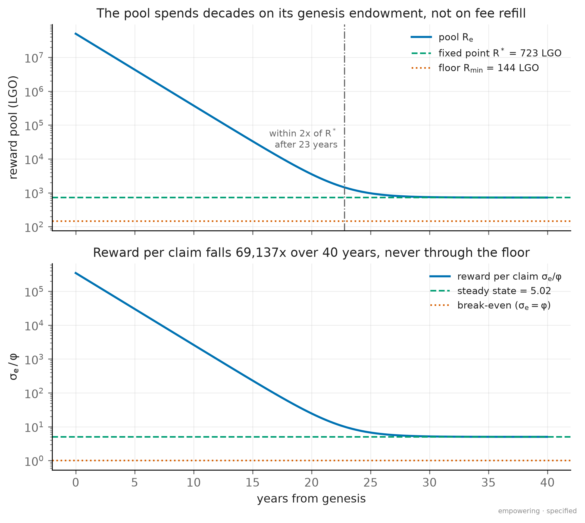
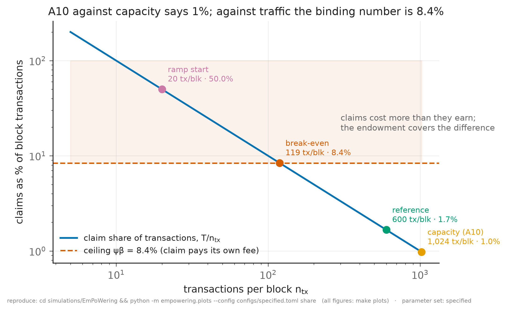
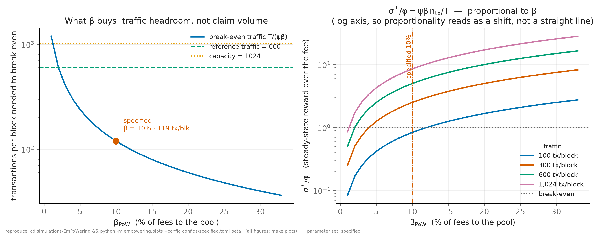
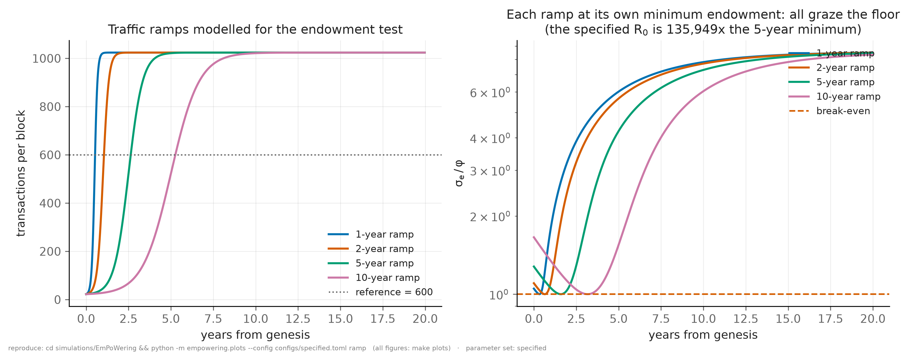
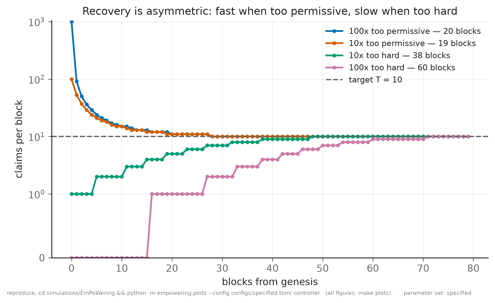
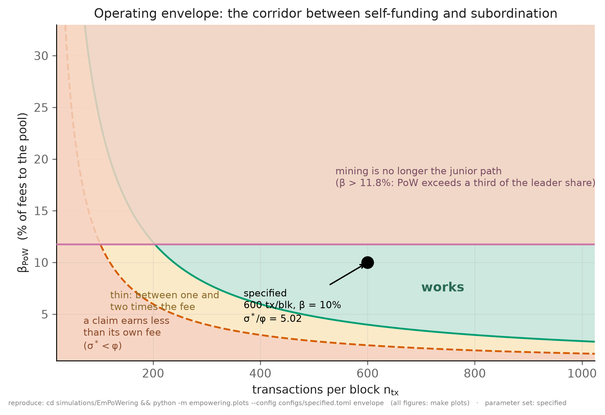
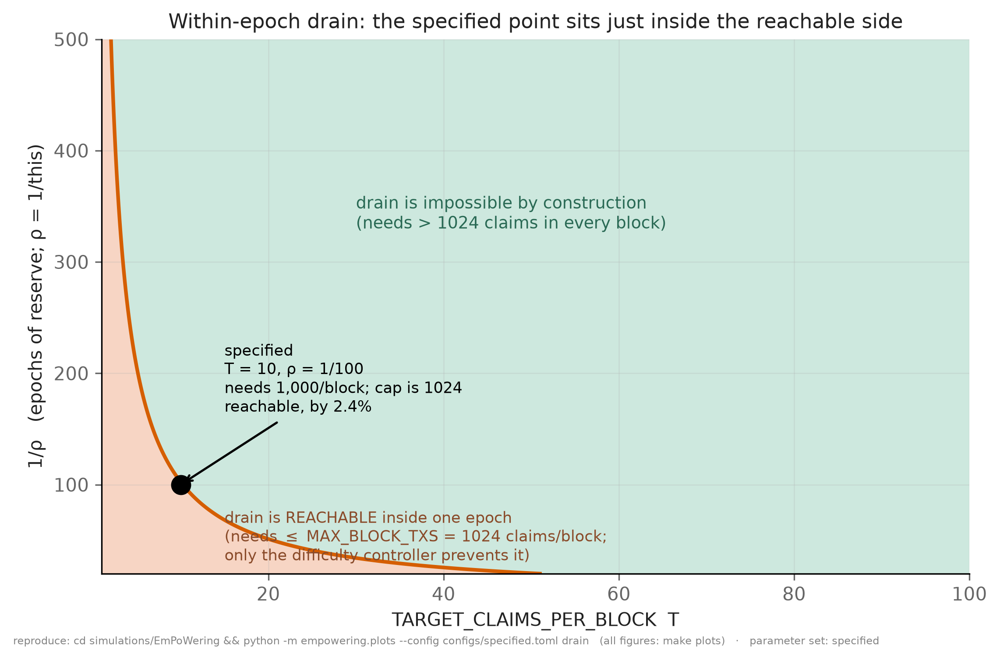
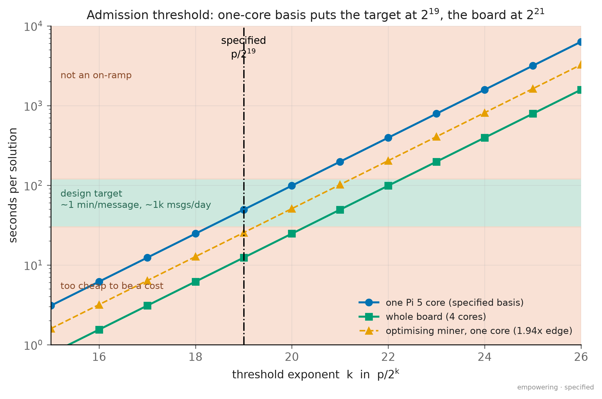

# EmPoWering — tokenomics model, closed-form results, and simulations

## What this document is

> **Location.** This report lives in `reports/EmPoWering/tokenomics/`; the simulations backing it live in `simulations/EmPoWering/` and regenerate every current number via `make all` (and `make verify`, `make check LIPS=…`). The report was authored alongside logos-lips PR #400 and moved here when that work closed.

## 0.0 Addendum — the nonce-based PoW branch, circuit v0.5.6 (2026-08-12, latest)

Implementation PR #3305 replaces the Blend puzzle's secret key and key derivation with a single private **`pow_nonce`**, and gives the ticket its own domain separation tag: `ticket = zkhash(BLEND_POW_V1, pol_epoch_nonce, pow_nonce)`. The specifications now match circuit v0.5.6. Consequences for this report:

- **The "no DST" caveat the body records is withdrawn** — the implementation added the tag, resolving the shared-hash-domain concern in the direction the body flagged.
- **The Blend candidate is one 3-input hash**: measured 14.9 μs naive / 8.2 μs with the constant `(dst, epoch_nonce)` prefix precomputed — an algorithmic edge of **1.81×** (was 1.40×), since the constant prefix is now half the naive work. Re-deriving `BLEND_DIFFICULTY_BASE` at the cheaper candidate **leaves `p/2²²` in place**: 62 s of one M4 core per message, ~1,400 messages a day, still 4–8× slower on the Pi 5 pending its measurement.
- **The reward candidate now costs more than the Blend candidate** (26.6 μs — the claim's ticket keeps its key, since the note must pay to a public key): the two paths' work costs have formally diverged, and §4.5/§4.6 figures split accordingly (`make blend` vs `make exhaustion`).
- **The Pi 5 measurement is in, and the threshold is calibrated on it.** Six runs on the target board (spreads ≤ 0.1 %, no throttling): a blend candidate costs 94.2 μs — 6.3× the desktop figure, inside the 4–8× band the model carried as an estimate. The reference basis is decided as **one core of the target**, and `BLEND_DIFFICULTY_BASE` moves `p/2²²` → **`p/2¹⁹`**: ~50 s and ~1,750 messages/day per core, 4× on the board, optimiser's edge 1.94×. §4.5's every remaining estimate is thereby replaced by measurement. The genesis reward target keeps `p/2²⁶` (a seed, not a price), now ~3 hours per solution and ~3,700 target-cores at the target rate.
- **Review round one** (logos-lips PR #400): the nullifier cache is written only after proof verification — deduplication reads it but never populates it, closing a poisoning race the review found. And `difficulty_blend` for epoch `N` is fixed at the same snapshot as epoch `N`'s nonce, during `N−1`, from the load of `N−2` — one further epoch of controller lag, absorbed by the clamp, in exchange for the precomputation window having every public input. Epochs 0–1 use the base value.
- `PowTarget` arithmetic is now normatively defined over **canonical integer representatives** — no field division or modular wraparound anywhere in the controllers — with both results capped below `p`.

## 0.1 Addendum — Units and Precision (2026-08-12, superseding §0.2 below)

The *Logos Token: Units and Precision* specification settles the unit system, and it settles it the other way from the interim position §0.2 records: **the indivisible unit is the lepton, with 1 LOGOS = 10⁹ lepta (`d = 9`), and the supply stays at the original 10¹⁰.** The precision is the unique value admitted by representability above (10¹⁹ lepta against `uint64`'s 1.84×10¹⁹) and price resolution below (a coarser unit prices permanent storage above a $5/GiB target inside the plausible token-price range; the derivation saturates at $4.66 per LOGOS).

What this undoes and what it restores:

- **The supply resize is withdrawn** — `block-rewards.md` is back at its published form. The resize's justification assumed one LGO was indivisible, which made the fee floor overwhelm the emission cap; with the floor at one *lepton* the original supply works, and the deflationary phase is reached through ordinary price discovery (a full block's burn matches the emission cap at ~116,562 lepta/gas, 16,652× the resting level and far under #393's `MAX_PRICE`).
- **§0.2's trajectory-inversion bullet is void with it.** `R₀` vs `R*` again depends on the discovered price level: at floor prices `R₀` vastly exceeds `R*` and the reward decays from a generous opening, which is the body's original qualitative picture.
- **The body's price-level framing is vindicated.** §4.4.4's correction — that the endowment turns on the *price level*, not the denomination — was right, and is now the operative frame: `φ` at the resting floor is 6,664 lepta ≈ 6.7×10⁻⁶ LGO, under 10⁻¹⁵ of supply, and the genesis fee ceiling of `1.157×10⁻¹⁰` of supply (unchanged, having been stated supply-relative) binds only if discovered prices rise about five orders of magnitude above the floor.
- **Every ratio stands, again**: ψ = 0.837, σ*/φ = 5.02 at reference traffic, the 1.124× builder edge, `T`↔β, the 1,000-claims drain margin, the 5.75×10⁻⁵-of-pool genesis-error cost. The whole calibration of §§4.4.1–4.4.3 is untouched.
- The open policy question sharpens into the Units doc's own terms: the storage floor exceeds $5/GiB once LOGOS trades above **$4.66**, and no admissible precision fixes that — the remedy lies in the Permanent Storage Gas unit, outside this proposal.

`make all` in `simulations/EmPoWering/` regenerates everything at `d = 9`, printing lepta as the primary unit, and `make lepta` confirms the mechanism at lepton granularity in exact integer arithmetic — conservation to the lepton, checked `uint64` throughout, the σ cliff at its exact boundary, and the canonical parse/format round-trip — something the float engine structurally cannot do. **Terminology**: where the body says "base units", read *lepta*; where it prices in LGO, the figures are pre-resize/pre-lepton absolutes superseded per §0.2 and this section.

## 0.2 Addendum — the TGE supply resize (2026-08-11, superseded by §0.1 above)

After this report reached its present form, the analysis it contains led to one further specification change that **supersedes every LGO-denominated figure in the body**: `S_tge` was raised from 10¹⁰ to **3×10¹⁴ LGO**, sized so that the emission model's deflationary phase begins exactly at the fee market's target utilisation (see `block-rewards.md`, *Sizing the TGE supply*). One LGO is the smallest representable amount — the divisibility question §4.4.4 carries is thereby resolved the other way, by scaling the supply rather than subdividing the token.

Consequences for reading this document:

- **Every ratio stands.** ψ = 0.837, σ*/φ = 5.02 at the reference traffic, the 1.124× builder edge, the `T`↔β trade, the fee-overhead identity, the stopping conditions, and every argument built on them are supply-free and unchanged.
- **The fee is now determined, not assumed.** The body treats φ = 0.952 LGO as a price-level assumption (§5.1). It is now `(306 + 646) × 7 = 6,664 LGO` at the resting price — a consequence of the fee schedule and the indivisible LGO, with no free parameter left.
- **Supply-relative figures scale by ×0.233** (φ/S fell from 9.52×10⁻¹¹ to 2.22×10⁻¹¹): `R_min` 0.206 % → **0.048 %**, `R*` 1.03 % → **0.241 %**, the 5-year ramp 0.34 % → **0.080 %**, the 10-year ramp 0.60 % → **0.140 %** of supply.
- **The specified `R₀ = 0.5 %` now opens at 10.4× the fee** (was 2.4×) and covers the 10-year ramp several times over. It is over-provisioned by about 4×; reducing it toward 0.2 % is an open token-allocation question, not a viability one.
- `make all` in `simulations/EmPoWering/` prints all of the above from `configs/specified.toml`.
- The resize also closes items the body leaves open: §4.4.4's denomination question is settled (one LGO is the smallest unit, workable at the sized supply), and §10's "launch fee level" ceiling is now met with a factor of five in hand rather than being a target for governance to hit. §10.2's standing-reserve question is now about a reserve of ~0.24 % of supply at the reference traffic, not ~1 %.
- **The trajectory direction in §3.7 and §4.2 is inverted at the current parameters.** Those sections describe the endowment sitting *below* the pool's fixed point, the reward climbing, and the builder edge shrinking — so the worst moment for self-dealing was the first epoch. After the resize, `R₀` (0.5 % of supply) sits *above* `R*` (0.241 % at the reference traffic): the reward **decays** from 10.4× the fee toward 5.0×, and the edge **grows** from 1.05× toward 1.12×. Both endpoints are comfortably inside the design margins, but the qualitative conclusion flips — the worst moment for self-dealing is the steady state again, at a still-benign 1.124×, and the open allocation question (trimming `R₀` toward `R*`) would flatten the trajectory rather than raise it.

The body below is retained as written, including its §4.4.4 treatment of the denomination as an open question, because the reasoning there is what produced the resolution.

---

EmPoWering lets someone earn their first Logos tokens by mining — running a computer to solve a puzzle — instead of buying them. This document works out the economics: how much a miner earns, how that changes over time, whether the scheme is stable, and whether an attacker could mine their way to dangerous influence over the network.

**Self-contained.** Background A–C describe the mechanism, its funding, and the vocabulary, so this can be read without the specification tree to hand.

**Measured, not assumed — but on the wrong machine.** `bench-poseidon2/` times the real Poseidon2 crate, so §4.5's Blend threshold rests on a measurement rather than an estimate. It was taken on an Apple M4 Pro; deployment targets a Raspberry Pi 5, several times slower per core, and the threshold should be re-derived once it has been run there.

**Sequencing.** This proposal merges *after* the in-flight fee-market change, so that change's findings are treated as the baseline here — in particular the resting price of 7 used throughout §4.3. The two touch no file in common.

**Sync is checked, not asserted.** `make check LIPS=<path-to-logos-lips>` in `simulations/EmPoWering/` reads the constants back out of the specification tree — and recomputes the derived margins the specifications state in prose — comparing both against the config the simulations run from; it exits non-zero on any drift. Run it after every specification change.

**In sync with PR #400** as of 2026-08-12, at commit `85ece929`. Where the specification has been decided since the proposal was written, this document follows the specification — the differences are listed in *What changed since the proposal* below.

**Headline results.** Of the eight economic questions the proposal's §2.3 says must be answered, **seven have answers**: items 1, 2, 5 and 6 in closed form (§3), items 3, 4 and 7 by simulation and derivation (§3.5, §4.1, §4.2). Item 8, difficulty decoupling, is settled by the specification's construction rather than by analysis and is not modelled here. §4.4 additionally sizes the genesis endowment, which the proposal leaves `TBD`.

**The condition self-funding turns on** is a transaction count, not a price. The pool is refilled from a share of the fees a block collects, and the fee a claim pays is set by the same prices, so those prices appear on both sides of the comparison and cancel: a claim pays for itself iff `n_tx > T / (ψ·β_PoW)`, where ψ ≈ 0.837 is the average transaction's fee over a claim's (§4.3). At the specified `T = 10` that needs about 120 transactions per block at a 10 % share, or 60 at 20 %, comfortably inside what a block can carry at every share worth considering. Before that point the genesis endowment carries the reward.

**The endowment reduces to one unknown, and it is not the one it looked like.** `R₀/S = m·(φ/S)·T·N_b/ρ` — everything but the claim fee as a fraction of supply is fixed by the specification. That fraction turns on the **price level the fee markets are initialised at**, not on the denomination, which §4.4.4 separates out after an earlier revision of this document conflated them. `R₀` is specified at **0.5 % of the launch supply**, and the constraint it hands to genesis governance is a ceiling on the launch fee of **`1.157×10⁻¹⁰` of supply — about 34,700 LGO at the sized supply** — for the opening reward to be twice it; the fee markets' resting prices meet it with a factor of five in hand.

**The claim target is overhead, not throughput.** Each claim pays a fee out of its own reward, so an epoch delivers `N_b·φ·(ψ·β_PoW·n_tx − T)` net — `T` enters with a minus sign. At the earlier `T = 50` half of everything the pool distributed was returned as fees on the claims themselves. `T = 10` cuts that to a tenth at the same share, and §4.4.1 works through why the intuition that a higher target onboards more people is backwards.

## What changed since the proposal

The specification has moved. This document models the specification, not the proposal text, and these are the differences that bear on economics:

| | Proposal | Specification (PR #400) |
| --- | --- | --- |
| Claim acceptance window | `WINDOW` slots, TBD | `W_b / f` — **10 blocks ≈ 300 slots**, derived from the block rate |
| Epoch nonce accepted | current **or previous** epoch | **current only** |
| Pool arithmetic | unstated | **checked** — must not saturate |
| Pool funding | **the proposal says both** — see below | **a share of the fees collected**, diverted from the burn |
| Genesis per-claim reward | separate constant | **derived** from the seeded pool |
| Blend quota | `pow_quota`, 20-bit, TBD | **`Q_W = β_max`** — one solution buys one message |
| Target claim rate | `T = 10` (code ships 100) | **`T = 10`** — agrees with the proposal; §4.4.1 gives the reasoning |

**The funding source is the one place the proposal contradicts itself**, and it is worth setting out because the specification had to pick a side.

Its prose section §1.5 describes fee funding: *"the pool is replenished from transaction fees. Fees are not burned, and rewards are not minted out of thin air. Instead, transaction fees are tracked in a separate accounting system outside the UTXO ledger and distributed across the network's reward pools — the Blend reward pool, the PoS reward pool, and the PoW reward pool. A fixed slice of that flow tops up the PoW pool each epoch."*

Its normative section §5.8 describes something else — a three-way split of the **block reward**, with `β_Blend + β_Leader + β_PoW = 1` and `distribute_block_reward(b)` taking `r = get_block_rewards(b)`, illustrated at 59/39/2 of 100.

These are not the same mechanism. A share of the block reward is bounded by the emission cap; a slice of the fee flow is not. §4.3 shows the difference decides whether a claim can ever pay its own fee. **The specification follows §1.5**, and §5.8's construction is not adopted.

Only the first four and the last touch this model. `Q_W` governs Blend admission, not minting, so it does not enter the reward economics; it is noted because it was an open item and is now closed.

The target claim rate remains an **absolute count per block**, as in both the proposal and the implementation. A transaction-relative alternative is analysed in §4.3 and carried in §9; it is not part of the base.

## Epistemic legend

Every parameter, equation and result carries one of these tags, because several headline results are exact consequences of assumptions that have never been tested. **§8 consolidates everything that is not `KNOWN`.**

| Tag | Meaning |
| --- | --- |
| **`KNOWN`** | Read from the specification or the merged code, with a citation. Not in dispute. |
| **`DERIVED`** | Mathematics applied to `KNOWN` facts and `ASSUMED` models. Check the algebra, not the world. |
| **`ASSUMED`** | A modelling choice made here, not stated by the specification. §2.6 explains each and what would falsify it. |
| **`SIMULATED`** | Established by a run in §4, conditional on the assumptions it declares. |
| **`UNKNOWN`** | A quantity nobody has determined. Not a disagreement; a hole. |
| **`OPEN`** | A decision the project must make. |

## Background A — the mechanism being modelled

EmPoWering adds proof of work in two roles. Only the second has economics.

**Blend admission (no economics).** Logos routes messages through a privacy layer that hides who sent what. To send, you attach a proof that you are entitled to. Before EmPoWering there were two ways to qualify: be an established node with locked stake, or be a block proposer. EmPoWering adds a third: show you did computational work. **No tokens are created on this path.** It appears here only because it competes for the same hardware.

**Token minting (the economics).** A new operation, `CLAIM_POW_REWARD`, pays a miner from a pool:

1. **A pool is created.** At launch, `POW_REWARD_POOL_GENESIS` tokens are set aside — *existing* tokens from the initial distribution, not newly printed. This is what keeps the scheme outside the inflation envelope (§3.4).
2. **A fixed price per win is set, once per epoch.** An epoch is 7.5 days. At its start the protocol computes σₑ, the amount every winner receives during that epoch. Holding it fixed is not a convenience — it is what lets a wallet compute the reward note's identifier *before* the transaction is mined, which is what makes step 5 possible.
3. **Miners grind.** A miner hashes candidate keys until one lands below the difficulty target. Guess-and-check, which is the point: it costs electricity.
4. **A winner submits a claim.** The credential goes on-chain carrying no signature and no proof — **the work is the authorisation**. The network checks the pool can cover it, the anchoring block is recent and canonical, the epoch nonce is current, the ticket clears the threshold, and nobody has claimed it before.
5. **The reward pays its own fee.** Every transaction costs a fee, so normally you need tokens before you can act — a chicken-and-egg problem for a new user. Here the transaction says, in effect: *mint me σₑ, and here is me spending some of it to pay for this transaction*. The user starts with nothing.
6. **The pool drains and refills.** Each payout shrinks it; each epoch boundary tops it up with a share of the fees the epoch's transactions paid — fees that would otherwise have been burnt — and recomputes σₑ.
7. **Difficulty retargets every block**, aiming for a steady claim count regardless of how many miners appear.

## Background B — where the money comes from

The refill `F` is the most important quantity here: §3.1 shows the long-run reward depends on it alone.

Every transaction pays two fees — one for the bytes it stores forever, one for the computation it costs — and both are normally burnt. EmPoWering diverts a fixed share `β_PoW` of that flow into the mining pool before it is burnt. So

$$
F = \beta_\text{PoW}\cdot N_b\cdot n_\text{tx}\cdot \bar{\varphi}
$$

for `N_b` blocks in an epoch, `n_tx` transactions in a block and `φ̄` the average fee one pays. **Nothing in that expression is the block reward**, and nothing in it involves the protocol's emission controller. That is the point of the choice, and it is worth spelling out why the alternative fails.

The block reward is capped: the protocol will not mint faster than `I_max` a year, which works out at `62500/657 ≈ 95.13` LGO per block. Fees are not capped — they rise with congestion, without limit. Had the pool been funded from a share of the block reward, the reward per claim would have sat near a fixed ceiling however busy the network became, while the fee a claim itself must pay kept climbing. Past some level of usage a claim would cost more than it pays, and the mechanism would switch itself off precisely when the network was most valuable to join. Funding from the fee flow puts the same quantity on both sides, so their ratio depends on the parameters rather than on how busy the day is.

**It also takes the emission controller out of the model entirely.** An earlier revision had to carry a dial `A_t` — the protocol's blend of freshly minted tokens and recycled fees — through every comparison, and could not close the endowment question because the dial's trajectory is exogenous. Under fee funding that dependence is gone; `A_t` appears nowhere below.

The cost is borne by the burn, not by issuance: the tokens the pool distributes were paid as fees and were on their way to destruction. Mining therefore slows the deflation rather than adding to inflation, which is why §3.4 comes out clean.

## Background C — glossary

| Term | Meaning |
| --- | --- |
| **slot** | One second. |
| **block** | Produced in ~1 slot in 30, so ~30 s apart. |
| **epoch** | 648,000 slots = **7.5 days** ≈ 21,600 blocks. |
| **note** | A coin: a value and an owner. Minting a reward creates one. |
| **claim** | One successful payout; mints exactly σₑ. |
| **ticket** | The puzzle output. You win if it comes out small enough. |
| **difficulty / target** | The threshold a ticket must fall below. **Smaller = harder.** Win chance is target ÷ number-space. |
| **pool** | The reserve claims are paid from. |
| **refill** | The top-up the pool gets each epoch boundary. |
| **base unit** | Smallest representable amount. Undefined tree-wide — see §5.1. |

## 0. A warning about the letter T

The proposal and `block-rewards.md` both use **`T`** for different things. Here: `T` is the target claims **per block**; `W` is the fee-average look-back window (120 blocks), which `block-rewards.md` calls `T`.

## 1. Parameters

**Fixed by existing specifications.** `KNOWN`

| Symbol | Value | Source |
| --- | --- | --- |
| `S_tge` | 10¹⁰ LGO | `block-rewards.md:160` |
| `I_max` | 1 %/yr | `block-rewards.md:167` |
| `Δ_b` | 30 s expected block time | `cryptarchia-v1-protocol.md:91-97` |
| `N_b` | **21,600** blocks/epoch | `blend-protocol.md:621` |
| epoch | 648,000 slots = **7.5 days** | `cryptarchia-v1-protocol.md:143` |
| epochs/yr | **48.667** | derived |
| `MAX_BLOCK_TXS` | **1024** transactions/block | `bedrock-v1.1-mantle-specification.md` |
| `p` | ≈ 2.1888×10⁷⁶ | `cryptarchia-proof-of-leadership.md:217-223` |
| `W_b` | **10 blocks** claim window | Mantle spec, *Window of Acceptance* |
| `β_max` | 3 blending ops per message | `blend-protocol.md` global parameters |

**Introduced by EmPoWering** — the dials calibration must set:

| Symbol | Code | Proposal | Tag |
| --- | --- | --- | --- |
| `ρ` | disabled | 1/100 per epoch | **`KNOWN`** — specification sets **1/100** (§4.4.3) |
| `T` | 100 | 10 | **`KNOWN`** — specification sets **10** (`TARGET_CLAIMS_PER_BLOCK`, Mantle spec) |
| `β_PoW` | 0 | 2 % example | **`KNOWN`** — specification sets **10 %** (§4.4.2) |
| `R₀` | placeholder | TBD | **`KNOWN`** — specification sets **0.5 % of launch supply** (§4.4.3) |
| `q` | 9/10 | 9/10 | **`KNOWN`** |
| `κ` | — | — | **`UNKNOWN`** cost per guess |
| `φ` | — | — | **`DERIVED`** — 952 price units (§4.3), absolute value blocked on the denomination |
| `ψ` | — | — | **`DERIVED`** — 0.837, average fee over claim fee (§4.3) |
| `n_tx` | — | — | **`UNKNOWN`** — transactions per block, an adoption question |
| base units/LGO | — | — | **`OPEN`** — deferred to its own PR; EmPoWering's constraints on it are in §4.4.4 |

**Every free parameter now has a value, `φ` is derived up to the denomination, and the feature ships switched off.** §3.7's numbers illustrate structure; §4.4's parameter set is an existence proof, not a recommendation.

## 2. How it works, precisely

Transcribed from merged code. All `KNOWN`.

**2.1 Price per win.** `σₑ = ⌊R·ρ_num / (ρ_den·T·N_b)⌋` — the fraction ρ of the pool this epoch may spend, divided by expected claims per epoch.

**2.2 Pool.** `R_{e+1} = R_e − c_e·σₑ + F`, where `F = β_PoW · Σ (fees collected)` over the epoch, credited at the boundary. All arithmetic **checked**, per the specification: the pool must not saturate.

**2.3 Enable guard.** `σₑ > 0 ∧ R ≥ σₑ`, evaluated **per claim, against the pool as it stands at that point in the block** — not once per block or once per epoch. The two clauses fail in different circumstances and §3.8 works both out. In brief: `σₑ > 0` fails by integer flooring once the pool has decayed across many epochs to `R < ρ_den·T·N_b`; `R ≥ σₑ` fails when the pool is drained *within* one epoch, because σₑ is frozen at the boundary while the pool it is paid from shrinks with every claim.

**An earlier revision of this section said the second clause "never binds".** That compared σₑ against the pool at the moment σₑ was computed, which is the wrong comparison for a pool that drains all epoch. §3.8 gives the right one.

**2.4 Difficulty.** `d_{n+1} = T·P·d_n / max(1, (P−F_ema)·c_n + F_ema·T)`, capped at `p−1`, with `P=10, F_ema=9`. **Memoryless** — it reconstructs demand from the current target rather than storing an average. This is *not* the controller in proposal §5.7.

**2.5 Arrivals.** `c_n = H·Δ_b·d_n/p` in expectation.

## 2.6 The ten assumptions

§§2.1–2.5 are transcriptions. Turning mechanics into economics needs models the protocol does not specify. **These are mine, not the proposal's.**

**A1 — Ticket outputs are evenly spread.** `ASSUMED` The hash behaves as a fair lottery. Reasonable: the protocol already relies on this for its leader lottery. **Risk: low** — bias would be absorbed by the difficulty controller.

**A2 — Wins arrive randomly and independently (Poisson).** `ASSUMED` Spread around the average is its square root, so relative noise is `1/√T`: **32 % at the specified `T = 10`**, against 14 % at `T = 50`. This is the whole quantitative case for a larger `T`, and §4.4.1 prices what that case costs. **The simulator uses the mean, not samples, so it understates variance.** **Risk: medium.**

**A3 — Competition drives the marginal miner's profit to zero.** `ASSUMED` If mining pays, more people mine; difficulty rises; profit erodes. The standard model for permissionless mining. **It fails during bootstrap** — when rewards are large and few people have heard of the scheme, profits are real. **Risk: high, in a known direction:** slower entry means lower hashrate, real early profits, and *worse* attacker numbers than modelled.

**A4 — All miners have the same costs.** `ASSUMED` Reality is a spectrum. The marginal miner sets equilibrium, so the model's hashrate is a **floor**. Safe for the on-ramp question, unsafe for the attacker question. **Risk: medium.**

**A5 — The refill is constant.** `ASSUMED` It is a share of the fees a block collects, so it moves with both traffic and the fee level, neither of which this model endogenises. Under the previous funding source this assumption also cut a feedback loop through the emission controller; that loop is gone, and what remains is simply that traffic is exogenous here. §4.4 relaxes it along one axis by ramping traffic explicitly. The long-run reward is *linear* in the refill. **Risk: medium**, and lower than under block-reward funding.

**A6 — The thermostat is settled.** `ASSUMED` It converges in ~10 blocks against 21,600 per epoch. **Fails at launch**, which is where §3.1 starts. **Risk: medium.**

**A7 — Exactly 21,600 blocks per epoch.** `ASSUMED` Varies by ~0.7 %, and partly cancels. **Negligible.**

**A8 — Attacker's win share equals hashrate share.** `ASSUMED` Falsified by being a block producer, which §4.2 examines directly. **Risk: high for security, quantified in §4.**

**A9 — The fee is fixed and exogenous.** `ASSUMED` It rises with congestion. Under fee funding the refill rises with congestion too, so the two now move together and the ratio in §4.3 is insensitive to the fee *level* — which is what removed the "the on-ramp closes when the network is busiest" failure mode that the earlier, block-reward-funded revision identified. What survives is that the fee's *absolute* value is unknown (§5.1), which blocks the endowment but not the ratio. **Risk: medium.**

**A10 — Claims always fit in a block.** `ASSUMED` Blocks hold 1024 and `T = 10`, so claims are 1.0 % of a full block. **Comfortable with room to spare**, and §4.2 shows it is what keeps self-dealing harmless.

**Not assumptions.** §3.1's recursion, §3.6's fixed-point analysis, §3.3's sum: `DERIVED` mathematics on the transcribed rules.

## 3. The results

### 3.1 Reward trajectory — item 1 ✅ `DERIVED`

**Intuition.** A bucket with a hole proportional to how full it is, plus a hose adding a fixed amount. It empties fast, then slower, and settles where the two balance.

**Step 1 — the payout is a fixed fraction.** At the target rate, `c_e·σₑ = T·N_b · Rρ/(T·N_b) = ρR`. The central identity: **`T` and `N_b` vanish from the pool dynamics entirely.**

**Step 2 — solve.** `R_{e+1} = (1−ρ)R_e + F`, an affine map with fixed point `R* = F/ρ`, giving

$$
\boxed{\ \sigma_e = \sigma^\ast + (\sigma_0 - \sigma^\ast)(1-\rho)^e,\qquad \sigma^\ast = \frac{F}{T N_b},\quad \sigma_0 = \frac{\rho R_0}{T N_b}\ }
$$

At ρ = 1 %: half-life **69 epochs ≈ 1.42 years**; annual decay **−38.7 %**. That is the rate at which any gap between the opening reward and the settled one closes — and under fee funding the endowment can be sized so there is no gap to close (§3.7), in which case the trajectory is flat and the half-life never comes into play.

**The counterintuitive part.** `σ*` contains no ρ. **The payout rate sets how fast you reach the destination, never the destination.** Drain 1 % and the pool settles at 100× the refill, paying out exactly the refill; drain 2 % and it settles at 50×, still paying the refill. In the long run the scheme distributes only what flows in. ρ does have one lasting effect, though it is not on the reward: it sets `R_min = φ·T·N_b/ρ`, the pool size below which claiming stops being worthwhile at all (§4.3), so a slower payout rate demands a proportionately larger pool to sustain the same per-claim reward.

### 3.2 Pool stability — item 2 ✅ `DERIVED`

Shrink-and-add: one fixed point, **monotone convergence, oscillation impossible**. The real failure is §2.3's cliff, reachable only if an epoch's refill `F = β_PoW · Σ (fees collected)` falls below `T·N_b` base units. **Mining survives long-run iff one epoch's refill exceeds `T·N_b`** — 216,000 base units at `T = 10`, which any fee revenue worth diverting clears by a wide margin. Under fee funding the binding constraint is not this cliff but §4.3's self-funding condition, which bites far earlier.

This is the *across-epochs* stopping condition. There is a second, *within-epoch* one — see §3.8.

### 3.3 Where the endowment ends up `DERIVED`

`Cum(E) = E·F + (R₀ − R*)(1 − (1−ρ)^E)`. Under block-reward funding, where `R₀ ≫ R*`, this read as "the endowment is fully distributed except `R* = F/ρ`, held forever". Under fee funding the first term dominates instead: **the pool distributes the fee inflow indefinitely**, and the endowment's contribution is the second term, positive or negative according to whether `R₀` was set above or below the fixed point. At the §3.7 parameter set `R₀ ≈ R*`, so the endowment contributes essentially nothing to what is distributed — its whole job is to be *present*, keeping the pool above `R_min` from the first epoch rather than waiting for the inflow to build it. §4.1 revisits what an unbounded distribution means for security.

### 3.4 Inflation — item 5 ✅ `DERIVED`, conditionally

Two sources, easily conflated. The **refill** is a slice of fees that would otherwise be burnt — tokens already in circulation, redirected rather than created. The **endowment** is carved from the initial distribution; those tokens already exist too.

**So mining adds no inflation — provided the endowment comes from existing supply rather than being printed.** That proviso does all the work; the specification states it. The emission cap is untouched in every regime.

What mining changes is either the *burn* or the *block reward*, depending on where the emission controller sits, and §4.4.2 works this out in full because it is what bounds `β_PoW`. In brief: the controller mints against the fees actually burnt, so diverting a share before the burn lowers that measurement. Early, when emission is minting-dominated, the burn does not feed back into the block reward, so the diversion shows up purely as a smaller burn and the supply ends up higher than it would have been — a reduction in deflationary pressure, not an increase in issuance. Later, when emission is recycling-dominated, the block reward *is* the burn, so the diversion lowers the block reward by the same share and the supply is untouched.

**The earlier version of this section said the pool "distributes tokens that were already on their way to being destroyed" without qualification. That is the first regime only.** In the second the tokens would have been destroyed *and reminted*, so what the pool takes comes out of Blend and leader rewards rather than out of the burn.

### 3.5 Miner entry — item 4 ✅ `DERIVED` from A3

**Protocol side:** the thermostat holds claims at `T` whatever hashrate appears: `H·Δ_b·d*/p = T`.
**Miner side:** expected cost per win is `(p/d)κ`; free entry drives margin to zero: `σₑ − φ = (p/d*)κ`.

Combining, the field order cancels:

$$
\boxed{\ H^\ast = \frac{T\,(\sigma_e - \phi)}{\Delta_b\,\kappa}\ }
$$

**Equilibrium hashrate does not depend on difficulty or field size** — those are the dial. It depends on money-per-block over cost-per-work.

`H* > 0` requires `σₑ > φ`. **The on-ramp survives long-run iff `F/(T·N_b) > φ`.**

Substituting the refill, `σ* > φ` becomes `ψ·β_PoW·n_tx/T > 1` — §4.3's condition, reached from the miner's side rather than the pool's. The on-ramp and the pool's solvency turn out to be the same inequality.

### 3.6 Controller stability — item 6 ✅ `DERIVED`

Substituting `x = H·Δ_b·d/p` gives `x_{n+1} = T·P·x/((P−F)x + F·T)`, independent of `H` and `p`. Fixed points solve `x(x−T)=0`. Derivatives: `g'(T) = F/P = 0.9` (**stable**, ~10-block time constant); `g'(0) = P/F = 1.11` (**repelling** — the no-claims state pushes away). The deadlock concern is unfounded.

### 3.7 Worked example

ρ=1 %, T=10, β_PoW=10 %, R₀=1.03×10⁸ LGO (1.03 % of supply), 600 tx/block, φ=0.952 LGO at 10³ base units per LGO — the specified parameter set, with `R₀` placed at the pool's fixed point.

**Refill** `0.10 × 21,600 × 600 × 0.837 × 0.952 = 1,032,684` LGO/epoch — note it contains no `T`. **Steady state** R* = 1.033×10⁸ LGO, likewise independent of `T`, so the endowment is sized almost exactly at the fixed point and σₑ is flat rather than decaying:

| epoch | years | σₑ | × fee |
| --- | --- | --- | --- |
| 0 | 0.00 | 4.7685 | 5.01× |
| 100 | 2.05 | 4.7755 | 5.02× |
| 299 | 6.14 | 4.7802 | 5.02× |
| ∞ | — | 4.7809 | 5.02× |

This is the qualitative change fee funding brings. Under block-reward funding the endowment vastly exceeded the fixed point, so the reward opened high and decayed for a decade. Here it can be sized *at* the fixed point, and the reward is stable from the first epoch — **no decay, no stranded residual worth remarking on, and a per-claim reward the same in year ten as in week one**, so long as traffic holds at the assumed level.

The flip side is that a stable `σ*/φ` pins the builder's self-dealing edge at a constant value forever (§4.2), instead of it starting negligible and growing. **The two properties are the same fact seen twice**: a reward that never decays is a margin that never widens. At the specified `σ*/φ = 5.02` that constant is **1.124×**; the earlier `T = 50` at the same share would have pinned it at 2.5×.

**Cost to the network.** The pool distributes `ρ·R* = 1.03` M LGO per epoch, which is 10 % of the fee revenue by construction. Of that, a fifth returns immediately as the claims' own transaction fees and four fifths reaches claimants — at `T = 50` the split would have been all and nothing (§4.4.1). It is a permanent transfer, not a taper, and §4.4.2 sets out who bears it: the supply early, Blend and the leaders once emission is recycling-dominated.

### 3.8 What stops claiming, and how it restarts `DERIVED`

Two distinct conditions stop claiming, on different timescales, and only one of them is permanent. The distinction was not drawn in earlier revisions of this document or of the specification, and both now state it.

**ρ is not a spending cap.** This is the point everything else follows from. `σₑ = ρR/(T·N_b)` divides the pool by the number of claims an epoch is *expected* to accept; it does not limit how many are accepted. Nothing caps claims per block, and nothing caps payout per epoch. Claims are paid one after another for as long as the pool covers the next one. The identity in §3.1 — that an epoch distributes exactly ρ of the pool — holds **only at the target rate**, which is an assumption about the controller, not a rule the protocol enforces.

**Condition 1 — within an epoch: `R < σₑ`.** σₑ is frozen at the epoch boundary while the pool drains with every claim, so after `k` claims the pool is `R₀ − k·σₑ` and the guard fails at

$$
k \;>\; \frac{R_0}{\sigma_e} - 1 \;=\; \frac{T\,N_b}{\rho} - 1
$$

which is `1/ρ` times the epoch's target claim count — **21,600,000 claims against a target of 216,000** at the specified values. Per block that is `T/ρ = 1000` claims, against `MAX_BLOCK_TXS = 1024`.

**That is 97.7 % of block capacity, not an impossibility.** Exhausting the pool inside one epoch requires essentially every transaction slot in every block to be a claim, continuously for 7.5 days — which means defeating the reward difficulty controller by two orders of magnitude and holding it there. The controller is what prevents it; the guard is what makes the failure safe rather than catastrophic. Worth noting the margin is thin and is a function of the parameters: `T/ρ < MAX_BLOCK_TXS` is what keeps it out of reach, so raising `T` or lowering ρ erodes it. At the earlier `T = 50` the figure was 5000 claims per block — five times block capacity, and therefore genuinely unreachable. **Lowering `T` moved this from impossible to merely very hard**, which is a cost of that change not noted at the time.

**Condition 2 — across epochs: `σₑ = 0`.** The pool decays over many epochs until `ρR/(T·N_b)` floors to zero, at `R < T·N_b/ρ` base units. This is §3.2's cliff, and it is the permanent one.

**Recovery.** Condition 1 is self-healing and condition 2 is not. If the pool is drained mid-epoch, claiming stops for the remainder of that epoch; at the next boundary the refill is credited and σₑ is recomputed from the refilled pool, so a drained pool yields a proportionately smaller reward and claiming resumes at that lower value. **The mechanism degrades to a smaller reward rather than stopping.** It stops for good only under condition 2, when the recomputed reward rounds down to zero — and because that is a floor rather than a taper, it stops abruptly.

**Where the interleaving comes in — and where it does not.** Interleaved validate-then-execute exists so that a note created by one Operation is spendable by a later one in the same transaction, which is what makes a claim self-funding (`bedrock-v1.1-mantle-specification.md`, *Validation*). That is its reason, and it is not the pool guard. But it has a real second effect here: a transaction carrying several claims has each checked against the pool *net of its predecessors*, rather than all of them checked against the pool as it stood before the transaction began. Under the previous batch ordering every such claim would have passed a check the pool could not satisfy, and the shortfall would have surfaced only as a failed subtraction during execution. Across transactions the pool is sequential anyway, so this matters only within one. It is a consequence of interleaving, not a motivation for it.

## 4. Simulation results

Run against `empowering_sim.py`, whose four self-checks pass (tracks §3.1 to 5.4×10⁻⁴; target is an exact fixed point; pool never negative; steady state matches).

### 4.1 Bootstrap security — item 3 ✅ `SIMULATED`

An adversary with hashrate share `h` captures `h` of claims (A8) and stakes them; honest miners stake a fraction. Mined coins age one epoch before counting (`cryptarchia-v1-protocol.md:157`). `D₀` is the honest stake already securing the chain.

Adversarial share of total stake **after 6.14 years** at the §3.7 parameters, over which the pool distributes 2.59 % of supply:

| `D₀` (% of supply) | h=0.10 | h=0.33 | h=0.50 |
| --- | --- | --- | --- |
| **0.5 %** | 8.4–13.5 % | 27.7–**38.4 %** | **41.9–53.0 %** |
| **5 %** | 3.4–4.0 % | 11.2–12.7 % | 17.0–18.6 % |
| **30 %** (the staking target) | 0.8 % | 2.6–2.7 % | 4.0 % |

(ranges span honest miners staking 100 % vs 50 % of winnings)

**Fee funding changes the shape of this result, and not for the better.** Under block-reward funding the pool held a fixed endowment, distributed it, and stopped: there was a genuine *peak*, and the answer was "risk is a function of the endowment relative to pre-existing stake". Under fee funding **the refill never stops**, so the amount distributed grows linearly with the horizon and the figures above are six-year numbers rather than lifetime ones. With `D₀` held fixed the adversary's share rises without bound toward

$$
\frac{h}{h + (1-h)\,s}
$$

where `s` is the fraction of winnings honest miners stake — **33 % at h=0.33 with full honest staking, 49.6 % if honest miners stake only half**. There is no horizon at which it turns around.

**That asymptote is an artefact worth naming, not a prediction.** It follows from holding `D₀` fixed forever while mining accumulates, and that double counts: the tokens the pool pays out were paid *as fees* by holders, so mining shifts ownership rather than creating stake. A model that let `D₀` decline by the fees paid and grow by ordinary staking would not produce it. But the model does not have that, so the honest statement is: **the six-year figures are sound, the asymptote is a modelling artefact, and the long-run security question is genuinely open under fee funding in a way it was not under block-reward funding.**

The near-term condition is unchanged: at `D₀ = 0.5 %` a one-third attacker **exceeds the safety threshold** within six years if honest miners stake only half their winnings; at the 30 % staking target the same attacker reaches 2.7 %. §4.4.2 shows this bound does not select `β_PoW` — the share sets how fast the limit is approached, not the limit.

### 4.2 Builder self-dealing — item 7 ✅ `SIMULATED`

Three candidate advantages:

**(a) Stealing another miner's claim — impossible by construction.** The reward pays `claim.public_key`, fixed in the payload, whose secret key the builder does not hold. Including someone else's claim pays *them*. Front-running is pointless.

**(b) Censoring rivals in its own blocks — worthless unless block space is contested.**

| `T` | claims as % of block | advantage (h=β=0.33) |
| --- | --- | --- |
| **10** (specified) | **1.0 %** | **1.00×** |
| 50 | 4.9 % | **1.00×** |
| 100 | 9.8 % | **1.00×** |
| 1024 | 100 % | 1.67× |

At `T = 10` claims occupy one percent of a block, so every valid solution is included somewhere and censorship yields nothing. **A10 is what makes this safe**, and it would stop being safe if `T` approached block capacity.

**(c) Recovering the tip on its own claims — real, and it grows as the reward decays.** Fees are burnt but tips go to the leader, so a builder including its own claim pays itself the tip.

| σₑ relative to fee | builder edge |
| --- | --- |
| 10× | 1.06× |
| **5.02× — the specified steady state** | **1.124×** |
| **2.43× — the specified launch value** | **1.349×** |
| 2× | 1.50× |
| 1.5× | 2.00× |
| 1.2× | 3.50× |

**Fee funding changes this result too.** Under block-reward funding the reward opened 200× the fee and decayed, so the edge started at 1.003× and grew to 1.178× — a slow-onset concern that arrived just as the on-ramp margin was thinning. Under fee funding the trajectory depends on where the endowment sits relative to the pool's fixed point, and at the specified parameters it sits below it, so the reward climbs and **the edge falls**: 1.349× at launch, 1.124× at steady state (§3.7).

**The worst moment is therefore the first epoch.** That is a considerably better shape than either predecessor — it is checkable directly against the launch parameters rather than extrapolated, and it improves rather than degrades as the network matures.

There is no bootstrap grace period any more. Whatever headroom is chosen is the headroom the network lives with, so the choice of `β_PoW` and `T` together is directly a choice about how much of an advantage block builders hold over other miners.

**Design implication, and where it landed.** `σ*/φ` at 2 gives a 1.5× edge; bringing it below 1.1× needs `σ*/φ ≳ 6`. At the earlier `T = 50` that would have required `β_PoW ≈ 60 %` — implausibly large — so a permanent 1.5× edge looked unavoidable and was recorded here as a cost of the high claim target. **Lowering `T` to 10 largely removes it**: at the specified 10 % share the headroom is 5× and the edge **1.124×**. The 1.1× aspiration is missed by a whisker, and §4.4.2 explains why it is not chased further — reaching it needs β ≥ 11.9 %, above the ceiling that keeping mining subordinate to staking imposes.

## 4.3 Calibration — the constraint set `DERIVED`

Two prices set every fee: `P_STR` per stored byte and `b_exec` per unit of execution gas. Both are controlled by markets that round their updates upward, which puts a hard floor of **one unit** under each (`storage-markets.md:224`, `execution-market.md:206`) — **but neither rests there.** An in-flight change to both market specifications documents that the downward step $`\lceil P \cdot 7/8 \rceil`$ has fixed points at every $`P \in \{1,\dots,7\}`$, so under sustained downward adjustment a price comes to rest at **7**, not 1. Figures below use the resting level. The unit itself is undefined tree-wide — see §5.1 — so everything is stated per unit of price, and converted only under an explicit assumption.

### What a claim actually costs `DERIVED`

Nothing in the specification tree states this, so `sim_fee.py` builds it from the payload definitions, the bincode wire format (`network-wire-format.md:82`) and the gas table (`analysis-gas-cost-determination.md:69-79`).

A claim transaction is **not** a bare `CLAIM_POW_REWARD`. A bare claim mints σₑ into the transaction balance, pays the fee out of it, and — by the Mantle rule that any leftover balance becomes an execution tip — hands the entire remainder to the block leader. To keep the reward, a miner must attach a `TRANSFER` that spends the reward note into one of their own. The gas analysis assumes exactly this composition.

| Component | Size | Gas |
| --- | --- | --- |
| `CLAIM_POW_REWARD` payload — nonce, block hash, public key | 96 B | 56 |
| `TRANSFER` payload — one input id, one output note | 74 B | 590 |
| `ZkSignature` on the transfer | 128 B | — |
| bincode framing — vector lengths, opcodes, enum tags | 8 B | — |
| **encoded `SignedMantleTx`** | **306 B** | **646** |

At the resting price that is `306 · 7 + 646 · 7 = 6,664` price units — or 952 at the bare floor, which the markets reach only transiently. An ordinary one-in one-out `TRANSFER` comes to 207 B and 590 gas, or 5,579 units at rest, so

$$
\psi \;=\; \frac{\bar\varphi}{\varphi_\text{claim}} \;\approx\; 0.837
$$

— a claim costs slightly **more** than the average transaction, because it carries a transfer plus its own payload and gas on top. **ψ is independent of the price level**, since both markets scale together, so the resting-level correction does not move it. It enters every ratio below and mildly tightens each one.

### The self-funding condition

The pool settles where the refill and the payout balance, and at that point the reward per claim is just the refill divided by the claims an epoch expects — `σ* = F/(T·N_b)`. Substituting the refill from Background B:

$$
\frac{\sigma^\ast}{\varphi} \;=\; \frac{\beta_\text{PoW}\, n_\text{tx}\, \psi}{T}
\qquad\Longrightarrow\qquad
\boxed{\ \text{self-funding} \iff n_\text{tx} \;>\; \frac{T}{\psi\,\beta_\text{PoW}}\ }
$$

**Both prices cancel**, and with them the denomination: the condition is a transaction count and nothing else. The distribution rate ρ cancels too — it governs how fast the pool converges, never where it converges to (§3.1).

At the specified `T = 10` (`sim_endowment.py`, §4):

| `β_PoW` | `n_tx` for `σ* = φ` | `n_tx` for `σ* = 2φ` |
| --- | --- | --- |
| 5 % | 239 | 478 |
| 10 % | 119 | 239 |
| 20 % | 60 | 119 |
| 33 % | 36 | 72 |
| 50 % | 24 | 48 |

Nothing here is out of reach: every share from 5 % up self-funds with 2× headroom on a block less than half full. **That was not true at the previous `T = 50`**, where the same table read 1,194 transactions at a 5 % share — beyond `MAX_BLOCK_TXS = 1024` and therefore unreachable at any traffic — and put a floor of 20 % under the share. The claim target, not the share, was what made the constraint bind. §4.4.1 works through the choice.

Read the other way, at the specified 10 % share and 600 transactions per block:

| `T` | claims as % of a full block | `σ*/φ` | noise, `1/√T` |
| --- | --- | --- | --- |
| 1 | 0.1 % | 50.2 | 100 % |
| **10** | **1.0 %** | **5.02** | **32 %** |
| 50 | 4.9 % | 1.00 | 14 % |
| 100 | 9.8 % | 0.50 | 10 % |
| 500 | 48.8 % | 0.10 | 4.5 % |

`T` buys precision in the claim count and pays for it in self-funding headroom, one for one.

### Why the endowment exists

The condition above is about the *steady state*. During bootstrap the network is quiet — twenty or a hundred transactions a block, not six hundred — so the fee inflow is small, `σ*` is far below the fee, and no one would claim. The endowment is what holds `σₑ` above the fee until traffic grows into the condition.

Its floor follows directly. Claiming is worth doing while `σₑ ≥ φ`, and `σₑ = ρR/(T·N_b)`, so

$$
R \;\ge\; R_\text{min} \;=\; \frac{\varphi\, T\, N_b}{\rho}
$$

At `T = 10`, `N_b = 21,600`, `ρ = 1 %` this is `2.16×10⁷ · φ`. **The pool must hold 21.6 million times a single claim's fee** for one claim to be worth submitting — because it pays out only 1 % of itself per epoch, spread over 216,000 claims. It scales linearly with `T`, so this floor was five times higher before.

## 4.4 Sizing the endowment `DERIVED` + `SIMULATED`

Not one of §2.3's eight numbered items — the proposal leaves `POW_REWARD_POOL_GENESIS` as `TBD` in Appendix A and folds its consequences into item 1. It is treated separately here because it turns out to be the parameter the whole calibration hinges on.

The opening reward is `σ₀ = ρR₀/(T·N_b)`, so an endowment opening at `m` times the fee is `R₀ = m·φ·T·N_b/ρ`. Everything on the right except φ is fixed by the specification, so as a fraction of supply

$$
\boxed{\ \frac{R_0}{S} \;=\; m\cdot\frac{\varphi}{S}\cdot\frac{T\,N_b}{\rho}\ }
$$

**and the whole question reduces to one number: the claim fee as a fraction of total supply.** That number is a *price-level* question rather than a *denomination* question — §4.4.4 corrects an earlier reading of this table that conflated the two. The table below slides the fee across nine orders of magnitude by holding both market prices pinned at their floor of one base unit and varying the denomination underneath, which is a legitimate scenario but not the only way the fee can move. At `T = 10`, `ρ = 1 %`, opening at twice the fee:

| base units per LGO | φ (LGO) | φ/S | `R₀/S` | verdict |
| --- | --- | --- | --- | --- |
| 1 | 952 | 9.5×10⁻⁸ | **411 %** | impossible |
| 10³ | 0.952 | 9.5×10⁻¹¹ | **0.41 %** | affordable |
| 10⁶ | 9.5×10⁻⁴ | 9.5×10⁻¹⁴ | 0.0004 % | negligible |
| 10⁹ | 9.5×10⁻⁷ | 9.5×10⁻¹⁷ | ~0 | negligible |

**Nine orders of magnitude in the fee, and therefore in the endowment.** What the table really shows is how sharply the sizing depends on the launch fee level, whatever sets it. Every entry scales linearly with `T`, so the move to `T = 10` divided this table by five without changing its shape, and the top row — a fee of 952 LGO — remains impossible at any endowment. §4.4.4 restates this as the constraint it actually is: a ceiling of about 1.157 LGO on the launch fee, for the specified endowment to open at twice it.

### Sized against an adoption ramp `SIMULATED`

The single-point view answers "what opens at *m* fees". The question the endowment exists to answer is different: **how large must the pool be so that claiming stays worthwhile for the whole time it takes the network to grow into self-funding?** `sim_endowment.py` ramps traffic logistically from 20 to 1024 transactions per block over a stated horizon and binary-searches the smallest `R₀` keeping `σₑ ≥ φ` throughout, at `T = 10`, `ρ = 1 %` and `10³` base units per LGO.

| `β_PoW` | 1-year ramp | 2-year | 5-year | 10-year |
| --- | --- | --- | --- | --- |
| 5 % | 0.24 % | 0.27 % | 0.42 % | 0.90 % |
| 10 % | 0.23 % | 0.25 % | 0.34 % | 0.60 % |
| 20 % | 0.22 % | 0.23 % | 0.27 % | 0.38 % |
| 33 % | 0.21 % | 0.21 % | 0.23 % | 0.26 % |
| 50 % | 0.21 % | 0.21 % | 0.21 % | 0.21 % |

(as a percentage of total supply)

Three things fall out.

**The floor is `R_min` = 0.21 % of supply**, shared by every column — the pool must hold that much for a claim to beat its own fee at all, whatever the traffic. Nothing below it is a viable endowment.

**Slower adoption costs more, and superlinearly.** Doubling the ramp from five years to ten roughly doubles the excess over the floor at a 5 % share, because the pool drains at ρ for the whole time the fee inflow is short. A larger `β_PoW` is not merely a bigger subsidy, it is insurance against adoption being slower than hoped.

**Every share now works.** The previous `T = 50` produced *never* across the whole 5 % row — no endowment of any size kept claiming alive — and required 1.14–7.88 % of supply elsewhere. At `T = 10` the entire table fits between 0.21 % and 0.90 %, and the choice of share is a preference about robustness to slow adoption rather than a viability constraint.

### 4.4.1 Choosing the target claim rate `DERIVED` + `SIMULATED`

`T` was 50 in an earlier revision of the specification, chosen as roughly one twentieth of a full block on the reasoning that a larger count is a less noisy count. That reasoning is sound but it prices only one side. `sim_target_rate.py` prices the other, and the specification now sets `T = 10`.

**The identity everything follows from.** §3.1 showed that an epoch running at the target rate distributes the fraction ρ of the pool *whatever `T` is* — `T` and `N_b` cancel out of the pool dynamics. So `T` does not decide how much is distributed. It decides how many parts it is divided into, and therefore how much of it survives being divided, because **each claim pays a fee out of its own reward**. Writing the epoch's refill as `F = β·N_b·n_tx·ψ·φ`, the amount actually delivered net of the claims' own fees is

$$
\text{net per epoch} \;=\; F - T\,N_b\,\varphi \;=\; N_b\,\varphi\,\bigl(\psi\,\beta\, n_\text{tx} - T\bigr)
$$

**`T` enters with a minus sign.** At a chosen share it is pure overhead: every unit of `T` subtracts `N_b·φ` from what reaches claimants. And the same expression gives the ceiling — at `T = ψ·β·n_tx` the reward equals the fee, delivery is zero, and claiming stops.

**Where `T = 50` sat.** At β = 20 % on 600-transaction blocks the ceiling with the 2× headroom §4.2 wants is exactly `ψ·β·n_tx/2 = 50`. `T = 50` was not near the ceiling; it *was* the ceiling, which is why §4.3's table found β = 20 % to be the minimum viable share. Half of everything the pool distributed was being returned as fees on the claims themselves.

**Holding the share fixed at 20 %, lowering `T`:**

| `T` | σ*/φ | eaten by fees | reaches miners | builder edge | noise | `R₀` (5-yr ramp) | nodes onboarded/epoch |
| --- | --- | --- | --- | --- | --- | --- | --- |
| 1 | 100.5 | 1 % | 99 % | 1.01× | 100 % | 0.02 % | 20.5 |
| 5 | 20.1 | 5 % | 95 % | 1.03× | 45 % | 0.11 % | 19.6 |
| **10** | **10.05** | **10 %** | **90 %** | **1.06×** | **32 %** | **0.27 %** | **18.6** |
| 25 | 4.02 | 25 % | 75 % | 1.17× | 20 % | 0.91 % | 15.5 |
| 50 | 2.01 | 50 % | 50 % | 1.50× | 14 % | 2.24 % | 10.4 |
| 100 | 1.00 | 100 % | 0 % | 109× | 10 % | 5.54 % | 0.1 |

The onboarding column is measured against the thing being onboarded *to*: the minimum stake for a Blend service node is `0.001 % · S_tge = 100,000` LGO (`analysis-static-minimum-stake-estimation-for-service-declaration-protocol.md:57-62`), and the column is the epoch's net delivery divided by it. **Claim count is a bad proxy for onboarding.** `T = 50` pays 1,080,000 claims an epoch, but at 0.96 LGO net each it takes 104,000 of them to reach minimum stake; `T = 10` pays a fifth as many claims and onboards nearly twice as many participants.

**A correction against an intermediate reading of this result.** Because §4.3 showed `T` and β locked together at fixed headroom — `β = 2T/(ψ·n_tx)` — it is tempting to read the move to `T = 10` as also licensing β = 4 %, cutting the fee diversion fivefold at no cost. **It does not.** Those are two different policies and they cannot be combined:

| policy | `T` | β | σ*/φ | fee overhead | nodes onboarded/epoch |
| --- | --- | --- | --- | --- | --- |
| the earlier base | 50 | 20 % | 2.01 | 50 % | 10.4 |
| **lower `T`, hold the share** | **10** | **20 %** | **10.05** | **10 %** | **18.6** |
| lower `T`, hold the headroom | 10 | 4 % | 2.00 | 50 % | 2.1 |
| lower `T`, hold the headroom | 5 | 2 % | 2.00 | 50 % | 1.0 |

Cutting β to 4 % shrinks the refill fivefold, and since the fee overhead stays at 50 % the delivered amount shrinks fivefold too. That row is not `T = 10` done more cheaply; it is a fifth-sized programme. **β is the budget and `T` is overhead against it.** Lowering `T` is a free efficiency gain at a fixed budget; it is not a way to reduce the budget while keeping the benefit.

**What lowering `T` costs.** Only variance, `1/√T` — 32 % at `T = 10` against 14 % at 50. Worth being precise about what that does and does not affect. The memoryless controller's step is scale-free: it moves the target by `+11 %` on a block with no claims and `−9 %` on a block with twice the target, at every `T`. What changes with `T` is how often a large *relative* deviation is sampled. The resulting jitter changes **which blocks carry claims and when a given miner wins**, not what a win is worth — σₑ is fixed for the whole epoch and is independent of any block's realised count. Nothing else degrades: claims fall from 4.9 % to 1.0 % of a full block, so §4.2's censorship result and assumption A10 both get *safer*, and §3.2's cliff threshold `T·N_b` falls with `T`.

**Robustness.** The `T`↔β relation and the fee-overhead expression are both ratios in which `P_STR` and `b_exec` cancel, so they are independent of the denomination (§5.1). The endowment column is not, and assumes 10³ base units per LGO.

### 4.4.2 Choosing the share `DERIVED` + `SIMULATED`

`β_PoW` was the last free parameter. `sim_beta.py` fixes it at **a tenth**, and the reasoning turns on a fact about incidence that this model had wrong until now.

#### Who actually pays — and it is not the burn, at least not forever

`block-rewards.md:206` defines `R_block` as *"the total amount of Execution base fees and Storage fees that are **burned** when the block is proposed"*, and the block reward is `r_b = A_t·(minting cap) + (1−A_t)·R_block`. Diverting β of the fees **before** the burn therefore lowers `R_block` to `(1−β)` of what it would have been. What that costs depends entirely on where `A_t` sits, and the two answers are opposite:

| regime | block reward | Blend and leaders | supply | **who pays** |
| --- | --- | --- | --- | --- |
| `A_t → 1` — bootstrap, staking far below target | minting-capped, unaffected by the burn | **unaffected** | higher than it would have been | **the supply** |
| `A_t → 0` — the design's stated long-run target | equals `R_block`, so falls by β | **fall by β**, in the 60/40 proportion | **unaffected** | **Blend and the leaders** |

The first row is `block-rewards.md:178` verbatim: *"The amount of tokens burned does not impact the block rewards in this situation."* The second follows from `α_a = 1`, documented as *"It must be one-to-one"* (`:162`), and from the design goal that *"in the long run, Logos Blockchain should mint only enough tokens to compensate for the burned transaction fees"* (`:367`).

**So β is not free money from the burn.** An earlier revision of §3.4 and of the specification said the pool "distributes tokens that were already on their way to being destroyed", which is true only in the first regime. In the mature network the pool is a **third claim on the same flow that funds the privacy layer and consensus** — which is what the proposal's own §5.8 assumed, reached by a different route. The difference that still matters is the *base*: a share of the **fees**, which are uncapped, rather than of the **block reward**, which is capped at `r_max`. That is what makes self-funding reachable at all (§4.3), and it is the whole reason for the funding-source change.

The incidence therefore **migrates over the network's life**, from the supply to Blend and the leaders, without β changing. Choosing β is choosing both. The specification now states this in [Who bears the cost of the diversion](../docs/blockchain/raw/overview-cryptoeconomics.md).

#### The constraint set

**From below — self-funding**, `β ≥ headroom·T/(ψ·n_tx)`:

| `n_tx` | break-even | 2× headroom | 6× (builder edge ≤ 1.1×) |
| --- | --- | --- | --- |
| 100 | 11.9 % | 23.9 % | 71.7 % |
| 300 | 4.0 % | 8.0 % | 23.9 % |
| **600** | **2.0 %** | **4.0 %** | **11.9 %** |
| 1024 | 1.2 % | 2.3 % | 7.0 % |

The endowment covers the low-traffic rows during bootstrap (§4.4), so the row to choose against is the traffic the network expects to *sustain*, not its first year.

**From above — PoS must remain the better path.** The proposal is explicit: EmPoWering *"is not a PoS replacement"* and *"PoS participation remains the most strongly incentivized path"* (§1.5). At `A_t = 0` that becomes checkable, because the mature fee flow splits three ways:

| `β_PoW` | PoW | Blend | leaders | PoW as % of the leader share |
| --- | --- | --- | --- | --- |
| 2 % | 2 % | 58.8 % | 39.2 % | 5 % |
| 5 % | 5 % | 57.0 % | 38.0 % | 13 % |
| **10 %** | **10 %** | **54.0 %** | **36.0 %** | **28 %** |
| 15 % | 15 % | 51.0 % | 34.0 % | 44 % |
| 20 % | 20 % | 48.0 % | 32.0 % | 62 % |
| 33 % | 33 % | 40.2 % | 26.8 % | 123 % |

Reading "clearly subordinate" as the mining share staying at or below a third of the leader share gives **β ≤ 11.8 %**; at or below half gives 16.7 %.

**The two bounds nearly touch.** At the reference traffic the builder-edge target wants β ≥ 11.9 % and subordination wants β ≤ 11.8 %. There is no value satisfying both, so one has to give, and it is the builder edge — it is a preference about margin, whereas subordination is a stated design goal of the proposal.

**Security does not select a β.** §4.1's construction gives an adversary with hashrate share `h` exactly `h` of whatever the pool paid out, so its share of total stake converges to `h/(h + (1−h)s)` **whatever β is**. β sets how fast that limit is approached, not the limit. At `h = 1/3` with honest miners staking their winnings the limit is 33 % and the threshold is never crossed at any β; it is crossed only when honest miners largely do not stake, and there β merely changes the date. This is a genuine finding and a slightly disappointing one: the parameter that looked like it should be bounded by security is not.

#### What each share buys, at 600 transactions per block

| `β_PoW` | σ*/φ | builder edge | reaching claimants | nodes onboarded/epoch | `R₀` (5-yr ramp) |
| --- | --- | --- | --- | --- | --- |
| 2 % | 1.00 | 109× | 0 % | 0.0 | 0.55 % |
| 5 % | 2.51 | 1.331× | 60 % | 3.1 | 0.42 % |
| **10 %** | **5.02** | **1.124×** | **80 %** | **8.3** | **0.34 %** |
| 20 % | 10.05 | 1.055× | 90 % | 18.6 | 0.27 % |
| 33 % | 16.58 | 1.032× | 94 % | 32.0 | 0.23 % |

Note the top row: **the proposal's illustrative 2 % lands exactly on break-even** at this traffic — the reward equals the fee, nothing reaches a claimant, and the builder edge diverges. Its 2 % was a share of the *block reward*, a different and much smaller base, so the figure does not transfer.

#### The choice

**`β_PoW = 10 %`**, as `POW_SHARE = 10` over `SHARE_DEN = 100`. It clears 2× headroom from 240 transactions per block, reaches 5× at the reference 600, holds the builder edge at 1.124× against a 1.1× aspiration, keeps mining at 28 % of the leader share, and needs an endowment of 0.34 % of supply to cover a five-year ramp. A denominator of 100 leaves one-percentage-point granularity for later adjustment.

Going to 20 % would halve the builder edge and double the onboarding rate, at the cost of taking mining to 62 % of the leader share — which is no longer "clearly subordinate", and is the reading of the proposal's §1.5 that decides this.

**What would change the answer.** A lower expected sustained traffic pushes the lower bound up quickly — at 300 transactions per block the 2× requirement is already 8 %, leaving almost no room under the subordination ceiling. If the network is expected to settle below about 250 transactions per block, `T` should come down further rather than β going up, because `T` and β trade one-for-one on this constraint (§4.4.1) and only β is bounded above.

### 4.4.3 Choosing the distribution rate and the genesis seed `DERIVED` + `SIMULATED`

The last two, from `sim_rho_genesis.py`. **`ρ = 1/100` and `R₀ = 0.5 %` of the launch supply.**

#### ρ sets the reserve, not the reward

§3.1's result is easy to misread: `σ* = F/(T·N_b)` contains **no ρ**. The distribution rate does not set what a claim pays. What it sets is the **size of the standing reserve**, because the pool settles at `R* = F/ρ` — that is, at `1/ρ` epochs' worth of distribution. Everything else follows from that one fact.

| `ρ` | reserve `R*` | epochs held | `R_min` | response lag | exhaustion, claims/block |
| --- | --- | --- | --- | --- | --- |
| 0.2 % | 5.16 % of supply | 500 | 1.03 % | 10.3 yr | 5,000 — unreachable |
| 0.5 % | 2.07 % | 200 | 0.41 % | 4.1 yr | 2,000 — unreachable |
| 0.75 % | 1.38 % | 133 | 0.27 % | 2.7 yr | 1,333 — unreachable |
| **1 %** | **1.03 %** | **100** | **0.21 %** | **2.1 yr** | **1,000 — just reachable** |
| 2 % | 0.52 % | 50 | 0.10 % | 1.0 yr | 500 — reachable at half-full blocks |
| 5 % | 0.21 % | 20 | 0.04 % | 0.4 yr | 200 — routinely reachable |

**Three considerations push ρ up, one pushes it down.** A larger ρ shrinks the reserve held permanently out of circulation, shrinks the endowment floor `R_min = φ·T·N_b/ρ`, and shortens the lag with which the reward follows fee revenue — all in the same proportion, since all three go as `1/ρ`. A smaller ρ widens the margin against §3.8's within-epoch drain, which needs `T/ρ` claims per block.

**That last one has a hard edge**, at `ρ < T/MAX_BLOCK_TXS = 0.977 %`. `ρ = 1 %` sits just the wrong side of it: 1,000 claims per block against a capacity of 1,024. Halving ρ to 0.5 % would put it out of reach outright — and would double the reserve (1.03 % → 2.07 % of supply), the endowment floor (0.21 % → 0.41 %) and the lag (2.1 → 4.1 years). That is a large, permanent price for a static margin against a scenario the difficulty controller already prevents and whose failure mode is graceful (§3.8). Doubling ρ instead brings the drain within reach of half-full blocks, which is not acceptable.

**So `ρ = 1/100`** — the proposal's value, and the only economic parameter the proposal actually fixes. It is where the two pressures meet, not an inherited default.

The one uncomfortable consequence worth naming: a **2.1-year response lag**. The pool tracks a moving `F` with a time constant of `1/ρ` epochs, so during a growth phase the reward reflects fee revenue from roughly two years earlier. This is smoothing rather than error — it makes the reward predictable and conservative while traffic is rising — but it means the model's steady-state figures describe where the mechanism is heading, not where it will be at any given moment during adoption.

#### The genesis seed

Two floors and one landmark:

| | as % of launch supply |
| --- | --- |
| `R_min` — below this a claim no longer beats its own fee | 0.21 % |
| covers a 1-year adoption ramp | 0.23 % |
| covers a 2-year ramp | 0.25 % |
| covers a 5-year ramp | 0.34 % |
| covers a 10-year ramp | 0.60 % |
| `R*` at the reference traffic | 1.03 % |

| `R₀` | in LGO | `σ₀` | × fee | epochs to `R_min` with **no traffic at all** |
| --- | --- | --- | --- | --- |
| 0.2 % | 2.0×10⁷ | 0.93 | 1.0× | 0 |
| **0.5 %** | **5.0×10⁷** | **2.31** | **2.4×** | **88 ≈ 1.8 yr** |
| 1.0 % | 1.0×10⁸ | 4.63 | 4.9× | 157 |
| 2.0 % | 2.0×10⁸ | 9.26 | 9.7× | 226 |

**`R₀ = 0.5 %`.** It covers a five-year adoption ramp with about half again in margin, opens at 2.4× the fee — above the 2× §4.2 asks for — and sustains claiming for close to two years even if the network never carries any traffic. Matching `R*` at 1.03 % was tempting for elegance, since the reward would then be flat from the first epoch, but `R*` is a function of traffic nobody knows, so matching it is false precision at twice the allocation.

For scale: the minimum-stake analysis sizes staking around 1,000 nodes at 0.001 % of supply each, i.e. 1 % of supply. A 0.5 % onboarding endowment is proportionate to that rather than large against it.

#### The denomination constraint this finally makes actionable

§4.4 found the endowment undeterminable without the denomination. Stating `R₀` as a *fraction of supply* inverts the problem into something useful. `σ₀ = ρ·R₀/(T·N_b)` depends only on denomination-free quantities; the fee `φ` is a fixed **952 base units**. So a chosen `R₀` implies a **floor under the denomination**:

| `R₀` | min base units per LGO for `σ₀ ≥ φ` | for `σ₀ ≥ 2φ` |
| --- | --- | --- |
| 0.2 % | 7,197 | 14,394 |
| **0.5 %** | **2,879** | **5,758** |
| 1.0 % | 1,439 | 2,879 |
| 2.0 % | 720 | 1,439 |

**At `R₀ = 0.5 %` the denomination must be at least ~5,758 base units to the token** for the opening reward to be twice the fee *when the markets are at rest*. Any of the plausible candidates — `10⁶`, `10⁸` — clears it by orders of magnitude, so this is a weak constraint in practice, but it is a real one and it is what makes an indivisible LGO impossible rather than merely awkward. The specifications state it in the price-level form, `φ ≤ 1.157×10⁻¹⁰` of supply, so that it holds whatever denomination is settled on.

### 4.4.4 The denomination — a constraint, not a decision for this proposal `DERIVED` + `OPEN`

**Scope.** An in-flight fee-market change carries an explicit note that *"the LGO atomic-unit / precision redefinition ... is deliberately excluded — it touches many documents and will land as its own PR to avoid confusion"*, and its change log records the deferral. That PR has not been opened. **The denomination therefore has an owner-designated vehicle, and EmPoWering is not it.** This section states what EmPoWering *requires* of it and what the evidence rules out, and stops short of setting the value. A suggestion for whoever takes it is recorded below.

The more useful output of working it through is that **§4.4 and §5.1 were wrong about what the denomination was blocking.**

#### The correction

Both sections said the endowment "turns entirely on one unknown: the claim fee as a fraction of total supply", and that this was undeterminable "because the denomination is undefined". The first clause is right. The second is not.

The fee is `φ = 306·P_STR + 646·b_exec` **base units**, where `P_STR` and `b_exec` are the two markets' prices. In LGO that is `φ = (306·P_STR + 646·b_exec)/u`. Only the **ratio** of price level to denomination matters economically, and the price level is a market outcome whose initial value genesis governance sets — `storage-markets.md:230` says so explicitly. So:

- the **denomination** fixes how finely a price can be expressed and how large a value can be represented;
- the **price level** fixes what a transaction costs.

Everything this document computes in LGO — `σ*`, `σ₀`, `R_min`, `R₀`, the ramp table, `R*` — is unaffected by `u`. What §4.4's nine-orders-of-magnitude table actually varied was the *fee level*, by holding both prices pinned at their floor of one base unit and sliding `u` underneath. That is a legitimate scenario (it is what a quiet market does) but it is not "the denomination decides the endowment". **Defining `u` does not unblock the endowment; initialising the prices does.**

The constraint is therefore restated: the specified `R₀` opens at twice the fee for as long as the **launch fee is at most `σ₀/2 = 1.157` LGO**, or `1.157×10⁻¹⁰` of the launch supply. That is a target for genesis governance to hit with `P_STR(0)` and `b_exec(0)`, and it is checkable on the day. It is now stated in both the Mantle and genesis specifications in that form.

#### What EmPoWering requires of it

With the fee question separated out, EmPoWering's requirements are narrow: a bound above, and the ruling-out of the degenerate case below. Both belong in the specification because the mechanism depends on them; the value between them does not.

**Above — representability.** `TokenValue` is `uint64`, so the largest representable amount is `2⁶⁴−1 ≈ 1.84×10¹⁹` base units. Against a launch supply of `10¹⁰` LGO:

| `u` | supply, base units | headroom before a `TokenValue` cannot hold the supply | at 1 %/yr growth |
| --- | --- | --- | --- |
| 10⁶ | 10¹⁶ | 1,845× | 752 years |
| **10⁸** | **10¹⁸** | **18.4×** | **291 years** |
| 10⁹ | 10¹⁹ | 1.84× | 61 years |
| 1.84×10⁹ | 1.84×10¹⁹ | 1.0× | 0 — at the limit today |

`10⁹` leaves under a factor of two, and therefore under a century at the maximum emission rate, for a quantity that cannot be changed after genesis.

**Below — granularity.** Both fee markets round price updates upwards, giving an effective floor of one base unit per unit of gas (`storage-markets.md:224`, `execution-market.md:206`), and rest a little above it. That floor exists to stop zero becoming an absorbing state; it should sit far enough below any discoverable price that it never binds, which argues for the denomination being generous. **A suggestion, not a decision made here:** `10⁸` — eight decimal places, Bitcoin's choice — leaves an eighteenfold margin below the `uint64` bound and puts the smallest expressible fee some five orders of magnitude below a fee level of order one LGO.

#### Is 1 LGO the smallest unit by design? — the evidence says it cannot be

This is worth settling explicitly, because the tree reads as though it might be. `storage-markets.md` states in three places that the price floor and the initial price are *"1 LGO/gas"*, *"1 LGO per Permanent Storage Gas"* and *"a cost of 1 LGO per permanently stored byte"*. Nothing anywhere states a subdivision. On the face of it, `TokenValue` counts whole LGO.

It cannot, and three independent arguments say so — the first of which has nothing to do with EmPoWering.

**1. The block reward is already fractional.** The maximum minted per block is derived in `block-rewards.md:463` as

$$
\frac{I_{\max}\, S_\text{tge}\, \Delta_t}{f} \;=\; \frac{10^{-2}\cdot 10^{10}}{365\cdot 2880} \;=\; \frac{62500}{657} \;=\; 95.129376\ldots\ \text{LGO}
$$

kept deliberately as an exact fraction, with `block_rewards()` returning a `float`. An indivisible LGO would force this to floor to 95, and no specification says it does. The emission model is already written in a unit finer than one LGO.

**2. One transaction would cost tens of times the entire maximum block reward.** At a floor of 1 LGO per byte and per gas, the claim transaction of §4.3 — 306 bytes, 646 gas — costs **952 LGO** against a maximum block reward of 95.13 LGO. A single transaction at the cheapest price either market can *ever* offer would burn ten blocks' worth of maximum issuance. And the markets do not sit at that floor: they rest at 7 (§4.3), making the everyday figure **6,664 LGO, or seventy times the maximum block reward**. For scale, a Blend node's entire 100,000 LGO minimum stake would buy fifteen transactions.

**3. EmPoWering could not work at all.** `R_min = φ·T·N_b/ρ` is **206 % of the total token supply** at the bare floor and **1,439 %** at the resting price. The pool would have to be many times the entire supply for a claim to beat its own fee. This is not "expensive"; it is impossible at any endowment.

**Conclusion.** The "1 LGO" language was written before the tree had a word for the base unit, and means one unit of the smallest representable amount. That is the ambiguity an undefined denomination allowed to persist, and defining it forces the correction — made in place in `storage-markets.md`, along with the initial-price row.

**If that reading is wrong** and an indivisible LGO is genuinely intended, the consequence is far larger than a parameter choice: EmPoWering cannot be made to work at any endowment, and the fee markets need rescaling against the emission model regardless. That would be a finding about the token design rather than about this proposal, and it should be raised as one.

### The constraints, symbolically

1. **Steady-state self-funding, with headroom.** `ψ·β_PoW·n_tx/T > 2`. At the specified `T = 10` and `β_PoW = 10 %` this holds from 240 transactions per block up, and the realised headroom at the reference 600 is 5× with a builder edge of 1.124×. The factor of two is §4.2's.
2. **Solvency across the ramp.** `R₀` at least the ramp table's entry for the adoption horizon being planned for — and never below `R_min = φ·T·N_b/ρ`.
3. **No cliff.** `F > T·N_b` base units, so `σₑ` never floors to zero (§3.2). Implied by constraint 2 whenever `φ ≥ 1` base unit.
4. **Bootstrap security.** `R₀` small relative to the honest stake securing the chain while it is distributed (§4.1).
5. **Denomination.** `R₀` is now fixed as a *fraction of supply*, which turns this from a blocker into a constraint running the other way: the chosen `R₀` puts a **floor of ~823 base units per LGO** under the denomination for the opening reward to be twice the fee (§4.4.3).
6. **Noise.** Relative variation in claims per block is `1/√T` (A2), which argues for larger `T` — directly against constraint 1.

The complete specified set, at `10³` base units per LGO: **`T = 10`, `β_PoW = 10 %`, `ρ = 1/100`, `R₀ = 0.5 %` of launch supply.** It opens at `σ₀ = 2.31` LGO against a `0.952` LGO fee — 2.4× — and settles at `σ* = 4.78` LGO, 5×, at 600 transactions per block, with a 1.124× builder edge throughout. Nothing in the mechanism is now unparameterised.

## 4.7 Validation figures `SIMULATED`

Eight figures from `make plots`, rendered from the same `Params` the tables use, so a config edit moves them with everything else. Four trace behaviour over time; three map where the parameter set works and where it stops working; one re-reads an assumption.

### 4.7.1 The pool spends decades on its endowment

`R₀` is 5×10⁷ LGO and `R*` is 723 LGO — five orders of magnitude apart — so the fixed point that §4.4.3 solves for is not a description of the near term. The gap closes at `(1−ρ)^e`, which puts the pool **within a factor of two of `R*` only after about 23 years**. For the whole of that descent the reward per claim is set by the decaying endowment, not by the fee refill, and it falls about 69,000× along the way. It never crosses the floor: `R*` (723) sits above `R_min` (144), so the steady state clears break-even by design and every point on the path to it clears it by more.

**This is the figure to read before treating `σ*/φ = 5.02` as the operating number.** It is the number the system converges to, not the one it launches with.

**The descent time is a property of the price level, not of the mechanism.** `σ*/φ` is price-independent — both fee markets scale together, so the ratio §4.3 derives is untouched — but `R₀` is a fraction of *supply* while `R*` scales with the *fee*, so the gap between them, and the time to close it, is not:

| price level | vs resting | `R*` (LGO) | `R₀/R*` | years to within 2× of `R*` |
| --- | --- | --- | --- | --- |
| 7 (resting) | 1× | 723 | 69,153 | **22.8** |
| 700 | 100× | 72,304 | 692 | 13.4 |
| 7,000 | 1,000× | 723,038 | 69 | 8.6 |
| 116,564 (deflation threshold, §3.4) | 16,652× | 12,040,035 | 4.2 | 2.3 |

So "decades on the endowment" is the *resting-price* case, which is the conservative one and the one the figure plots. At discovered prices a few orders of magnitude above the floor the system reaches its fee-funded regime within a few years. Both readings share the same `σ*/φ`, so nothing about the self-funding margin depends on which obtains — only the shape of the approach does.

### 4.7.2 The claim share of traffic, and its ceiling

Assumption A10 checks the claim load against `MAX_BLOCK_TXS` and finds 1.0 %, "comfortable with room to spare". That is the right test for whether claims *fit*, and it passes. It is not the test for whether they *pay*, because the reward per claim is funded by the fees actual traffic collects, not by the fees capacity could collect.

Against traffic the two quantities are one identity. With `v = T/n_tx` the claim share of a block's transactions,

> **`v · (σ*/φ) = ψ·β`**

so at break-even the claim share is exactly `ψβ`, and that is the **ceiling**: if claims are more than `ψβ = 8.37 %` of transactions, a claim earns less than the fee it pays. It depends on `β` and nothing else — `T` cancels, and so does the traffic level. At the specified set the network operates at `v = 1.67 %`, a **5.02× margin** below the ceiling, and the break-even traffic is 119 tx/block.

Both numbers are gated in `make verify`.

### 4.7.3 What `β_PoW` actually buys

**Raising `β` does not put more claims in a block.** The difficulty controller holds the claim count at `T` whatever `β` is, so the claim share of transaction volume is invariant in `β` — the identity above moves the *ceiling*, not the operating point. What `β` buys is traffic headroom: the floor below which mining stops funding itself is `T/(ψβ)`, which the specified tenth puts at 119 tx/block.

The sweep in §4.4.2 is worth re-reading against this. **At the proposal's original 2 % example the break-even traffic is 597 tx/block against a reference of 600** — `σ*/φ = 1.00`, no headroom at all. The move to a tenth is what converts the mechanism from marginal to funded.

### 4.7.4 The endowment against an adoption ramp

Each ramp is plotted at *its own* minimum endowment, where each just grazes the floor — which is what makes the test legible. At the specified `R₀` all four curves lie on top of one another, because the endowment is **209,043× the 5-year minimum** and the ramp shape disappears beneath it.

That ratio is itself a finding: `R₀ = 0.5 %` of supply is not sized by the σ ≥ φ constraint, which 2.4×10⁻⁸ of supply would satisfy. Whatever justifies half a percent, it is not this floor, and §10.2's standing-reserve question is really a question about `R₀` and its multi-decade decay rather than about `R*`.

### 4.7.5 The reward controller is asymmetric

A mis-set genesis target recovers in about 20 blocks when it is too permissive and in 38 to 60 when it is too hard, because a too-hard target produces blocks with **zero** claims, and a block with no claims carries no information beyond the fixed `P/F` loosening step. §4.6's asymmetry — "too permissive over-pays, bounded; too hard costs only time" — is right in direction, and the time is longer than the permissive side by a factor of two to three.

### 4.7.6 Where the parameter set works

Two independent walls bound `β` from opposite sides, and the specified point sits between them. Below, `σ*/φ < 1` and a claim earns less than its own fee. Above, `β > 11.8 %` and mining stops being subordinate to the leader path. At the reference traffic the admissible band is **`β ∈ [4.0 %, 11.8 %]`** for a 2× fee margin, and the specified tenth sits in it — nearer the subordination wall than the funding one.

Draining the pool inside one epoch needs `T/ρ` claims in every block for a whole epoch: 1,000 against a `MAX_BLOCK_TXS` of 1,024. **The specified point is on the reachable side of that boundary, by 2.4 %.** Nothing in the block format prevents the drain; what prevents it is the reward difficulty controller, which would have to be defeated by two orders of magnitude and held there for seven and a half days. The specification says as much, and the consequence of failure is graceful — claiming stops rather than the pool going negative. It is worth being explicit that this is a controller guarantee and not a structural one.

The design target — about a minute of one core per message, of order a thousand messages a day — is met at `p/2¹⁹` **on the one-core basis the specification adopts**. On the whole-board basis the same threshold costs 12.3 s and falls out of the band; matching the target there would need `p/2²¹`. §10.1's open question "one core or the whole board?" is exactly those two exponents, and the figure is the argument for settling it explicitly rather than by default.

## 5. Simulator

`empowering_sim.py` (module), plus `sim_fee.py` (the claim's fee, §4.3), `sim_endowment.py` (§4.4), `sim_claim_rate.py` (§4.3's second table), `sim_item3_bootstrap.py` (§4.1) and `sim_item7_selfdealing.py` (§4.2). Exact integer arithmetic where the protocol uses it; floats only for exogenous economics. Mirrors the merged code, not the proposal.

### 5.1 The denomination, and what it is not `OPEN`

Still undecided, and deliberately so: deferred to a dedicated PR that has not been opened (§4.4.4). `uint64` caps it at `1.84×10⁹` against a `10¹⁰` LGO supply. What EmPoWering needs from it is in §4.4.4 and in the specification: the bound above, and that one LGO cannot itself be the smallest unit.

**An earlier revision of this section, and of §4.4, called the undefined denomination "the single quantity standing between the model and a numeric recommendation". That was wrong**, and §4.4.4 sets out why. The denomination fixes representability and granularity; what a transaction *costs* is the price level the two fee markets are initialised at and then discover. Every figure this document states in LGO is unaffected by the denomination. The quantity that was actually missing is the **launch fee level**, which remains a genesis governance decision — now expressed as a target it must hit rather than an unknown blocking everything (§4.4.4).

The simulations use `φ = 0.952` LGO throughout. That is a **price-level assumption**, equivalent to both markets opening at `10⁵` base units per unit of gas. It is not a consequence of the denomination, and every ratio in §4.3 is independent of it.

### 5.2 Validation — run and passing

Re-run 2026-08-11 under fee-inflow funding, at the §3.7 parameter set.

| Check | Result |
| --- | --- |
| Tracks the §3.1 closed form | ✅ worst error **2.2×10⁻⁴** (win-count rounding, not currency flooring) |
| At target, difficulty unchanged | ✅ exact |
| Pool never negative | ✅ min 205,960,458 LGO over 300 epochs |
| Steady state matches the closed form | ✅ R\*=206,536,781 LGO, σ\*=1.9124 LGO |
| Self-funding holds | ✅ σ\*/φ = 2.009 |

## 6. What to sweep

| Axis | Values | Why |
| --- | --- | --- |
| base units per LGO | 1, 10³, 10⁶, 10⁹ | **§4.4 shows this dominates everything absolute** |
| `β_PoW` | 5 %, 10 %, 20 %, 33 %, 50 % | sets σ*/φ, hence self-funding, the endowment and the builder edge |
| `n_tx` ramp | 1, 2, 5, 10-year horizons | the endowment must cover the ramp, superlinearly (§4.4) |
| `R₀`/supply | 1 %, 2 %, 5 %, 10 % | generosity vs **§4.1's security bound** |
| `ρ` | 0.5 %, 1 %, 2 % | speed only, never destination — but it scales `R_min` inversely |
| `D₀` | 0.5 %, 5 %, 30 % | honest stake at launch — **§4.1 shows this dominates security** |

`T` is no longer a sweep axis: the specification sets it to 10. Its consequences are reported instead as the second table in §4.3.

**Report per cell:** σ*/φ; whether the ramp is covered and with what margin; peak attacker share and the §4.1 asymptote; builder edge at steady state (§4.2); blocks to reconverge after a 10× hashrate step (§3.6 predicts ~22); the fraction of fee revenue diverted from the burn (§3.4).

## 7. What this model does not capture

Traffic and the fee level are exogenous (A5, A9), so the model cannot say when adoption arrives — only what happens at each level of it, which is why §4.4 has to be read as a family of answers indexed by the ramp. Free entry with one cost (A3, A4) makes hashrate a floor. Randomness is replaced by its mean, understating variance. `D₀` is held fixed while mining accumulates, which is what produces §4.1's spurious asymptote. And **the feature ships switched off**, so every number is counterfactual.

## 8. Epistemic register

**Known.** The dynamics of §2, verified against `ledger/src/mantle/pow/` and `core/src/mantle/ops/pow.rs`; the fixed constants; that the feature is inert.

**Assumed.** Ten models (§2.6). Highest risk: A3 (fails in bootstrap), A5 (linear in the result), A8 (now quantified by §4.2). A9's risk dropped from high to medium when the funding source changed, because the fee now appears on both sides.

**Needs validating.** Stochastic controller behaviour (the simulator uses means); step response; the bincode framing behind §4.3's 306-byte figure, which was reasoned from the payload definitions rather than measured; that the transcription matches the running ledger — a test vector reproducing §3.7 would settle it.

**Unknown.** The launch fee level, i.e. what genesis governance initialises the two market prices to — this is what §4.4's table was really varying, and §4.4.4 restates it as a ceiling governance must hit rather than an open unknown. κ. The adoption rate, which §4.4 handles by parameterising rather than guessing.

**Open.** Whether a tenth of fee revenue is the intended scale of the programme, given that in the mature network it comes out of Blend and leader funding rather than out of the burn (§4.4.2) — a policy judgement the model can frame but not make. Whether a standing reserve of about 1 % of supply, held permanently out of circulation, is acceptable (§4.4.3). And the denomination, which `R₀` now constrains from below rather than merely depending on.

**Settled.** `T = 10`, `β_PoW = 10 %`, `ρ = 1/100`, `R₀ = 0.5 %` of launch supply (§4.4.1–§4.4.3); the four Blend controller constants and its genesis value (§4.5); the reward controller's smoothing and genesis target (§4.6). **Every parameter EmPoWering introduces now has a value.** What remains is listed in §10. §3.1, §3.2, §3.4, §3.6 in closed form; §4.1, §4.2 and §4.4 by simulation; φ up to the denomination (§4.3).

## 9. Candidate changes — NOT part of the base

Not used in §§1–8. Held above the line until the base is approved.

1. **Align the implementation's `T`.** The specification now says 50; the merged code ships 100 and the proposal said 10.
2. **The stranded reserve** `R* = F/ρ`, never distributed (§3.3). Much less pressing under fee funding, where the endowment can be sized *at* `R*` rather than far above it (§3.7), so nothing is stranded in the first place.
3. **The `σₑ = 0` cliff** — claiming stops dead rather than degrading (§2.3).
4. **Make "the endowment comes from existing supply" enforceable**; §3.4 depends on it entirely and it is currently only prose.
5. **A difficulty floor of 1** — closes the absorbing state at zero (§3.6). Unreachable in practice; free.
6. *(folded into item 11 below)*
7. **Endogenise traffic** (A5, A9) — the refill now moves with usage, so an adoption model would replace §4.4's family of ramps with a single answer.
8. **Make the target claim rate a fraction of transaction volume** rather than an absolute count. **Intended for a future revision** — deferred 2026-08-11 in favour of keeping the specification simple and aligned with the implementation, which uses an absolute count. `T = 10` is specified for now (§4.4.1).

   **For.** It scales throughput with usage and makes steady-state self-funding load-independent: with `T = ratio·n_tx`, the count cancels and `σ*/φ = ψ·β_PoW/ratio`, so the condition is simply `β_PoW > ratio/ψ` at every level of traffic. Under fee funding this is a stronger argument than it was: it also makes the *endowment* requirement independent of the adoption ramp, dissolving §4.4's superlinear penalty for slow adoption, because a quiet network mints proportionately fewer claims.

   **Against.** §3.1's clean drain result is lost, since the pool becomes sensitive to the *rate of change* of usage. A zero target is an absorbing state needing a floor. §3.6's fixed-point analysis assumes a fixed reference. And it couples issuance to congestion, since claims compete for the space that sets their own allowance.

   **If adopted**, the ratio and `β_PoW` are locked together by `σ*/φ = ψ·β_PoW/ratio`: a 5 % ratio needs `β_PoW ≈ 12 %` for the §4.2 headroom.
9. **Keep `σ*/φ` above ~2** (§4.2) — below that the builder edge grows sharply while the on-ramp margin thins. Under fee funding this is a permanent property rather than an end-state one, so it binds from launch.

10. *(resolved 2026-08-11 — `T` was moved from 50 to 10; the analysis is now §4.4.1 rather than a candidate change.)*

11. *(resolved 2026-08-11 — the denomination is specified at `10⁸`, and §4.4.4 shows it was not in fact the blocker this item claimed. What remains is the launch fee level, which is a genesis governance decision with a stated ceiling rather than an open question.)*

## 4.5 The Blend admission threshold `DERIVED` + `OPEN`

The four constants of the Blend difficulty controller, from `sim_blend_difficulty.py`. This governs admission to the privacy layer rather than minting, so nothing here touches §§3–4.4; it is the other half of what EmPoWering does.

$$
\text{target} \;=\; \frac{\texttt{BLEND\_DIFFICULTY\_BASE}}{\text{load}^{\alpha}},
\qquad \text{load} = \frac{\text{observed txs per block}}{\texttt{TARGET\_TXS\_PER\_BLOCK}}
$$

**Three of the four have anchors already in the tree.**

`TARGET_TXS_PER_BLOCK = 512`, half of `MAX_BLOCK_TXS`, mirroring the execution market's target of half its per-block gas limit. Defining the reference load any other way would leave the two markets disagreeing about what "busy" means.

`α = 1/2`, as `BLEND_DAMPING_NUM = 1` over `BLEND_DAMPING_DEN = 2`. The specification already argues for this: quadrupling the load only doubles the threshold, so each attacker-funded transaction buys less effect than the last at the same cost.

`BLEND_MAX_STEP = 2`. At `α = 1/2` a factor of two in the threshold is a factor of four in load, so the clamp does not bind on ordinary variation. A sustained hundredfold load change is tracked over four epochs — a month.

**The fourth has no anchor, and that is the finding.**

`BLEND_DIFFICULTY_BASE` fixes what a message *costs*, and nothing in the tree states that. The obvious approach is parity with the other two quotas — make a solution cost about what the stake or leadership path costs per message — and **it cannot be done today**: `Q_C = C(β_C + R_C β_C)/N` needs `F_C` and `N`, and `Q_L = β_D(1 + R_D)` needs `R_D`, none of which has a value anywhere. Parity is the right anchor in principle and unavailable in practice; it should be revisited when those land.

So it is derived instead from the work itself — **measured**, in `bench-poseidon2/`, against the real `logos-blockchain-poseidon2` crate.

**What the measurement changed.** A candidate is two `zkhash` calls, and an earlier revision of this section costed that as two Poseidon2 invocations at an assumed 2 μs. Both halves were wrong. `Digest::digest` absorbs every input *and* a padding element through a width-3 sponge, so a two-input hash is **three permutations, not one** — six per candidate. And one permutation measures **3,350 ns**, not 2,000. The estimate was between four and six times too fast.

| | measured | per second |
| --- | --- | --- |
| one permutation | 3,350 ns | 298,536 |
| `zkhash` of 2 inputs | 11,582 ns | 86,339 |
| **candidate, naive (6 perms)** | **23,346 ns** | **42,833** |
| candidate, prefixes precomputed (4 perms) | 16,481 ns | 60,677 |

(Apple M4 Pro performance core, release build with LTO.) The constant first input of each hash — the `KDF` tag, and the epoch nonce, fixed for the epoch — can be absorbed once and reused, which is the only algorithmic optimisation available and worth just **1.40×**.

Re-derived on those numbers:

| threshold | expected candidates | one core | msgs/day, 1 core | msgs/day, 10k cores |
| --- | --- | --- | --- | --- |
| `p/2²⁰` | 1,048,576 | 24.5 s | 3,529 | 35 M |
| **`p/2²²`** | **4,194,304** | **97.9 s** | **882** | **8.8 M** |
| `p/2²⁴` | 16,777,216 | 6.5 min | 221 | 2.2 M |
| `p/2²⁶` | 67,108,864 | 26.1 min | 55 | 0.55 M |

**`BLEND_DIFFICULTY_BASE = p / 2²².`** The design target was unchanged — about a minute of one core per message, of order a thousand messages a day — but measurement moves it two exponents down from where the estimate put it. Below about `2²⁰` the work stops being a meaningful cost; above about `2²⁶` a participant on one core manages a message every half hour, which is not an on-ramp.

#### The reference machine is not the target machine

**Measured on an Apple M4 Pro. Deployment targets a Raspberry Pi 5.** Those are not close: four Cortex-A76 cores at 2.4 GHz against an M4 Pro performance core at roughly 4.4 GHz with much higher IPC on the 64×64→128 multiply-and-carry sequences BN254 arithmetic consists of. Clock explains about 1.8× of the gap and microarchitecture the rest, putting the band at **four to eight times slower per core**. That is an estimate; it has not been measured.

| threshold | M4 Pro | Pi 5 @4× | Pi 5 @6× | Pi 5 @8× | msgs/day, 1 Pi 5 core @6× | all 4 cores |
| --- | --- | --- | --- | --- | --- | --- |
| `p/2¹⁹` | 12 s | 49 s | 73 s | 98 s | 1,176 | 4,706 |
| `p/2²⁰` | 24 s | 98 s | 2.4 min | 3.3 min | 588 | 2,353 |
| **`p/2²²`** (specified) | **98 s** | **6.5 min** | **9.8 min** | **13.1 min** | **147** | **588** |

**The specified `p/2²²` meets the design target on the machine it was measured on and overshoots it five- to eightfold on the machine it is for.** A message costs closer to ten minutes than to ninety seconds, and a participant with one Pi 5 core sends 147 messages a day rather than 882. Matching the intended cost on one Pi 5 core puts the threshold near `p/2¹⁹`; on all four cores, near `p/2²¹`.

**Two decisions follow, and neither is made here.** Whether the reference is one core or the whole board — a factor of four. And the threshold itself, which should be re-derived against a measurement on the target hardware rather than against the scaling estimate above. `bench-poseidon2/` runs on the Pi as it stands.

**What else remains unmeasured.** One implementation, no assembly and no batching. More importantly for §4.5.1, the 1.40× above bounds only the *algorithmic* headroom — implementation headroom from assembly field arithmetic, batching or GPU is not measured and could be considerably larger, which would widen an adversary's advantage over an honest participant beyond what that figure suggests. Note that this cuts the opposite way from the hardware gap: the honest participant is on the slowest plausible machine and the adversary on the fastest.

### 4.5.1 What the threshold cannot do

It sets a **price per message, not a ceiling on the rate**:

| | messages/second |
| --- | --- |
| one laptop core | 0.010 |
| one 64-core server | 0.65 |
| 10,000 cores | 102 |
| 1,000,000 cores | 10,212 |

Against an honest data-message rate of `F_D = 1/30` per round — **0.033 messages a second network-wide**, one per block.

So a resourced adversary exceeds the honest rate by four to six orders of magnitude, **at any threshold cheap enough to be an on-ramp**. Raising it to prevent that puts the on-ramp out of reach of the people it exists for and still does not bound an adversary willing to spend more. This is not a calibration failure; it is the structural property `blend-protocol.md:659` already states — *"The rate at which this branch admits messages cannot be bounded in the way the other two are."*

What bounds the damage sits elsewhere, and all three are in this PR: proof-of-quota verification **before** relaying rather than after, so an invalid message dies at the first hop; the nullifier cache sized against `d_blend` rather than a node count; and the flood costing energy continuously for as long as it runs. **The difficulty sets the price. It cannot set a ceiling, and the specification now says so rather than implying the controller is a flood defence.**

## 4.6 The reward controller's smoothing and genesis target `DERIVED` + `SIMULATED`

The last two unset constants, and both turn out to be low-stakes for the same reason: they seed a controller that re-derives its target every block.

**Smoothing: `F = 9`, `P = 10`.** The same ratio the execution market uses. §3.6 showed the response has slope `F/P` at the target — below one, hence stable, with a time constant of about ten blocks — and slope `P/F` at zero claims, above one, so the no-claims state repels rather than traps. **Both signs hold for any `F < P`**, so the pair chooses response *speed*, not stability. Nine in ten places the response an order of magnitude slower than the block rate: fast enough to track a hashrate change within minutes, slow enough that one unusual block barely moves the target. It also matches what the merged code ships, so this is transcription with a reason attached rather than a fresh choice.

**Genesis target: `p/2²⁶`.** What matters here is not the value but the **asymmetry of being wrong**, simulated against the actual controller:

| genesis target vs. correct | blocks to within 10 % | excess claims paid | cost |
| --- | --- | --- | --- |
| 100× too permissive | 20 | 1,243 | ~2,900 LGO |
| 10× too permissive | 19 | 267 | ~620 LGO |
| 10× too hard | 38 | 0 | nothing |
| 100× too hard | 60 | 0 | nothing |

Against a pool of `5×10⁷` LGO, even the worst row is **0.006 % of the endowment**. Being too permissive over-pays a little; being too hard costs only time, because with no claims arriving the target rises by `P/F = 1.11` each block and a hundredfold error corrects within an hour.

Since one direction costs tokens and the other costs minutes, **the genesis value is set on the hard side.** At `p/2²⁶` a solution is about twenty-five minutes of one core (§4.5's measurement), so hitting the target claim rate needs some **five hundred cores** of honest mining network-wide — deliberately more than a launch is likely to attract, so the controller's first move is to loosen. It is set independently of, and more conservatively than, the Blend threshold, because the two answer different questions: one is a price participants live with, the other only a seed the controller corrects within the hour.

## 10. What is still to be settled

Audited against the branch on 2026-08-11. The reward economics are complete; what remains is in four groups, and only the first two block the proposal.

### 10.1 Unset constants, in the specification `OPEN`

| Constant | Where | State |
| --- | --- | --- |
| `EMA_SMOOTHING_FACTOR` (F), `EMA_SMOOTHING_PRECISION` (P) | Mantle, *Reward Difficulty* | **Set** to 9 and 10, matching the execution market's EMA and the merged code. §3.6's signs hold for any `F < P`, so the pair sets response speed rather than stability |
| `difficulty_reward` genesis value | Mantle, *Reward Difficulty* | **Set** to `p/2²⁶`, deliberately on the hard side — see §4.6 |
| `BLEND_DIFFICULTY_BASE`, `TARGET_TXS_PER_BLOCK`, damping ratio α, `BLEND_MAX_STEP` | Mantle, *Blend Difficulty* | **Set** — §4.5. Three from anchors already in the tree, the fourth from the work cost, resting on an unmeasured hash rate |
| `difficulty_blend` genesis value | Genesis Block | **Set** to `BLEND_DIFFICULTY_BASE` |
| Poseidon2 throughput on the **target** hardware | `bench-poseidon2/` | **Measured on an M4 Pro, but deployment targets a Raspberry Pi 5** — estimated 4–8× slower per core. At the middle of that band the specified threshold overshoots its design target fivefold (§4.5). Re-run on the Pi and re-derive |
| Reference machine: one core or the whole board? | — | A factor of four in the threshold, undecided |

The first two rows are small and mechanical. The Blend group is now set but rests on the last row.

### 10.2 Decisions the model can frame but not make `OPEN`

**Is a tenth of fee revenue the intended scale?** §4.4.2 shows that in the mature network the diversion is borne by the Blend service and the leaders one for one, not by the burn. A tenth leaves mining at 28 % of the leader share. Whether that is the right size for a bootstrapping mechanism is a policy judgement.

**Is a standing reserve of about 1 % of supply acceptable?** §4.4.3: the pool settles at `1/ρ` epochs of distribution, roughly two years' worth, held permanently out of circulation.

**The launch fee level.** Genesis governance initialises both market prices. The constraint is `φ ≤ 1.157×10⁻¹⁰` of the launch supply for the specified endowment to open at twice the fee — comfortably satisfied at the denomination now set, but it should be checked against the prices actually chosen rather than assumed.

### 10.3 Deliberately out of scope for this revision

Recorded so they are not mistaken for oversights. **ASIC resistance and the Equi-X transition**, and **splitting the two proof of work designs** — both excluded by decision; the same construction is reused for admission and for minting for now. **Making the claim target a fraction of transaction volume** (§9 item 8) — analysed, deferred, and now a weaker case than it was, since `T = 10` removed most of what it would have bought.

### 10.4 Not settled by specification at all

**Implementation.** The feature ships inert: `PowInputs::unwired_placeholder()` returns zeros at every production call site, so the Blend proof of work branch is unprovable, and there is no `provers/pow`, no `d_blend` controller, no pre-relay verification, no transaction payload variant. The specification leads the code here throughout, and §9's list is the delta.

**A Phase 2 ceremony.** The Proof of Quota circuit changed, so the trusted setup must be re-run before deployment. Operational, with real lead time, and on nobody's critical path yet.

**Benchmarks.** No proof of work branch benchmark exists, and the two published figures are not like-for-like (different statistic, sample count and thread range). Since all three branches are evaluated for every proof, per-proof cost is not expected to differ by branch — but that has not been measured.
