# The Blend network — a Monte-Carlo study

*Network simulation of the Blend message cascade. Simulator: [`blend`](../../tools/simulators/blend). All delays in **milliseconds**; the free-running mix clock's maximum interval (`max_blend_delay`) is in **whole seconds**. Adversary and deanonymization metrics are exact at every network size; propagation is Monte-Carlo over random senders.*

This report measures the Blend network end to end: how fast a message propagates, how much of the network an adversary observes, how often a message is deanonymized and how quickly a node can be linked to one, how reliably messages are delivered when nodes go dark or whole regions fail, and what cover traffic buys. **Peering degree** is the first axis and the one that ties the others together, because it trades off several of these at once: the headline is a single tension: **raising the peering degree improves propagation speed, eclipse resistance, and churn resilience, but *worsens* observation and sender deanonymization.** The anonymity axis has its own, degree-independent control — the **blend-path length** — so the two knobs separate cleanly: set the degree for the transport goals, set the path length for the anonymity goal. Two further questions follow from the deanonymization rates: *how long* an adversary needs to link an emitter to its messages and to learn its stake — which scales inversely with the node's own stake — and how **messaging redundancy** (sending each message over several independent cascades) trades reliability against anonymity, amplifying both by the very same factor.

## Headline

A peering degree of **6–8** is the operating sweet spot across the sizes tested (10³–10⁵ for the detailed grids, with a 10⁶ run confirming the results carry; §5). Below 6, propagation is slow, eclipse is non-negligible at high adversary fractions, and — the sharpest failure — the responsive sub-network *shatters* under heavy churn: a degree-`d` network survives churn only up to `u_c = 1 − 1/(d − 1)`, which is 50 % at degree 3 but 80 % at degree 6 and 86 % at degree 8. Above ~8 the speed, eclipse, and churn gains flatten while observation and full-deanonymization exposure keep climbing, so there is no reason to go higher for transport alone. Anonymity is bought separately, with the number of blend hops: the whole-path capture rate is exactly `f_adv^blend_hops` and does not depend on degree.

| knob | recommended | why |
|---|---|---|
| peering degree | **6–8** | speed, eclipse resistance, and churn resilience saturate here; observation/deanon exposure rises past it (§3.1, §3.3, §3.5) |
| blend-path length | **set from the anonymity target**: `blend_hops ≥ ln ε / ln f_adv` to hold whole-path capture ≤ ε | the degree-independent anonymity lever; costs ~1.5–2.7 s latency (degree-dependent) and a `(1−u)` reliability factor per hop (§3.4, §3.2, §3.5) |
| operating churn | pick the degree from the churn to be survived: **`u_c = 1 − 1/(degree − 1)`** (degree 6 → 80 %, degree 8 → 86 %) | site percolation of the responsive sub-graph (§3.5) |
| messaging redundancy | **R = 1 unless reliability demands more** — each extra copy multiplies *both* delivery and capture by `1−(1−x)^R` | redundancy is reliability and exposure in one dial; it cuts time-to-link ≈ R× (§3.8) |
| cover-traffic rate | **buy the anonymity set with delay before bandwidth** — both enter linearly, but delay is paid once per hop | `blending = rate·(2M+1)/3`; the rate also sets the stake ceiling `s_max` (§3.10) |

A node's exposure is not only *whether* it is deanonymized but *how soon*: if each 30 s slot one node emits with probability equal to its stake, the time to link an emitter is `≈ 30 s · ln(1/(1−α)) / (stake · f_adv^blend_hops)` — **inversely proportional to its stake** — so high-stake nodes are identified in days and the smallest holders effectively never (§3.6). The same event stream lets an adversary *estimate* a node's stake, but pinning it below ~0.1 % takes over a decade and below ~0.01 % centuries (§3.7).

---

## 1. Executive summary

**The setting.** In the Blend network a node forwards a message along a short **blend path** of relay nodes — each a free-running timed-release mix — and the last relay floods it to the whole network. Every node keeps a fixed number of symmetric peers (its *peering degree*), and that single number is a design choice with consequences that pull in opposite directions. This study builds a seeded, exactly *d*-regular peer graph, drives many random-sender cascades across it, and places adversarial and unresponsive nodes on it, at network sizes from a thousand to a million.

**What the axes show**

1. **Propagation speed improves with degree, with strong diminishing returns.** The full delay of a 3-hop cascade at 100 000 nodes falls from 10.3 s at degree 3 to 5.0 s at degree 16, but most of the gain is spent by degree 6–8 (6.3 s → 5.8 s); the last doublings barely move it. The multi-second total is dominated by the blend path's *mixing* waits, not by the network flood: at degree 8 the final flood reaches 99 % of a 100 000-node network in 0.62 s, and the total delay grows only 18 % across a hundred-fold increase in network size (§3.1, §3.2).

2. **Observation rises with degree; eclipse falls with it.** With a fraction `f_adv` of adversarial peers placed at random, the share of honest nodes with at least one adversarial peer (**observed**) is `1 − (1 − f_adv)^degree` — it *increases* with degree (at `f_adv = 0.2`: 0.49 at degree 3, 0.83 at degree 8, 0.97 at degree 16). The share whose *every* peer is adversarial (**eclipsed**) is `f_adv^degree` — it *vanishes* with degree (at `f_adv = 0.5`: 0.125 at degree 3, 0.004 at degree 8, ~0 by degree 12). A worst-case (greedy-coverage) placement raises observation sharply above random — at degree 8 and `f_adv = 0.2` it takes it from 0.83 to **1.000**, meaning *every* honest node ends up with an adversarial peer (§3.3).

3. **Deanonymization is governed by path length, not degree.** A message is *deanonymized* when its whole blend path is adversarial; because relays are chosen blind to who is adversarial, this rate is the exact hypergeometric `≈ f_adv^blend_hops` — independent of peering degree, and driven down exponentially by lengthening the path. It is *fully* deanonymized when, in addition, the honest sender is directly peered with an adversary; that adds the `observed` factor, so full deanonymization — unlike whole-path capture — **rises with degree** and is amplified by a worst-case placement. But capturing a cascade identifies the *message*, not the *originator*: with `a` of the sender's `d` peers adversarial the confidence that it originated rather than relayed is only `d/(2d − a)`, so one peer buys 0.53 and 90 % confidence needs essentially every peer — the eclipse condition. **Confident attribution is therefore rarer than the headline `full_deanon` figure by up to five orders of magnitude** (§3.4).

4. **Reliability degrades with churn; degree buys back coverage.** With a fraction `u` of unresponsive nodes that relay nothing, a message survives its cascade only if every relay forwards, so the delivery rate is `≈ (1 − u)^blend_hops` — longer paths are far more fragile. Unresponsive nodes are routing holes that can strand pockets during the final flood; a higher degree supplies redundant paths that keep coverage near-total. The effect is a genuine percolation threshold with a closed form: the flood travels only over the responsive sub-graph, which is site percolation on a `d`-regular graph and keeps a giant component only up to `u_c = 1 − 1/(degree − 1)`. Degree 3 therefore dies at exactly 50 % churn, degree 6 survives to 80 % and degree 8 to 86 % — each measured collapse landing on its predicted threshold (§3.5).

5. **How fast an emitter is linked scales inversely with its stake.** Only a *linkable* node — one with ≥ 1 adversarial peer, a fraction `1 − (1 − f_adv)^degree` of nodes; the rest are structurally unlinkable — can be tied to a message, and it is, the first time one of its emissions travels a wholly-adversarial cascade (per-emission probability `q = f_adv^blend_hops`). Since a node emits at a rate equal to its stake, the time to link it with confidence α is `≈ 30 s · ln(1/(1−α)) / (stake · q)`. At `f_adv = 0.2`, 3 hops, degree 8, a 5 %-stake node is linked within ~2 days (α = 0.9), a 0.1 % node within ~100 days, and a 0.001 % node only after ~27 years (§3.6). Counting the same events *estimates* the node's stake, but pinning it to ±10 % below ~0.1 % stake takes over a decade and below ~0.01 % centuries — fine-grained stake is practically unlearnable (§3.7).

6. **Messaging redundancy is reliability and exposure in one dial.** Sending each message over `R` independent cascades delivers it if *any* cascade survives — `delivery = 1 − (1 − (1 − u)^blend_hops)^R` — but captures it if *any* cascade is adversarial — `deanon = 1 − (1 − f_adv^blend_hops)^R`. Both obey the same law, so redundancy recovers delivery *and* speeds linking by ≈ `R×` together; it cannot buy reliability without spending anonymity (§3.8).

7. **Correlated outages are the *milder* failure for the live network, not the harsher one.** When failures cluster by AS or region — and peering is regional enough that a failure domain is also a connectivity domain — whole neighbourhoods vanish and every surviving neighbourhood stays whole. Live coverage then holds at 1.000 through 80 % churn, at every degree tested, and the percolation threshold of finding 4 never appears; at degree 4 and 70 % churn, scattered failure annihilates the network (coverage 0.001, delivery 0.000) while the same number of clustered failures still delivers 30 % of messages. The cost is that dead domains become unreachable islands rather than offline nodes among live peers, so coverage *of all nodes* falls instead. The uncorrelated threshold of finding 4 is therefore the conservative case for the operating network (§3.9).

8. **Cover traffic buys uniform emission counts, and almost nothing else for free.** Every node emits equally often whether or not it produces blocks, which hides block production in the emission *count*. But per-relay **mixing never happens** — at one message per second a relay holds 0.0014 messages, and even 256× the rate only reaches 0.39 — so the anonymity set is entirely **blending**, the broadcasts a relay saw between releases, which is `rate·(2M+1)/3`. Delay is the cheap lever: an anonymity set of 100 costs 42.9 msg/s at a 3 s release delay but 4.9 msg/s at 30 s. And the guarantee has a hard edge: a node's proposals must fit its emission quota, capping stake at `α_max = ln(1−q)/ln(1−f)` of *inferred* stake — about 0.1 % at the baseline rate, so a 9.5 % holder overruns by ~65× and is distinguishable by emission count alone (§3.10).

**The tension, in one line.** Axes 1, 2-eclipse, and 4 all want *more* degree; axis 2-observation and axis 3-full-deanonymization want *less*. Because whole-path deanonymization (axis 3) depends only on the blend-path length, the resolution is to raise the degree to where speed, eclipse, and churn saturate (6–8) and to control anonymity independently through the number of blend hops. Messaging redundancy (finding 6) does not escape the trade — it moves reliability and anonymity together, never apart — and time itself is an axis: exposure is a rate, and a high-stake node accumulates it fastest (finding 5).

*Method note: the peer graph is a deterministic, exactly d-regular matching-union reconstructible from one seed; the adversary observation/eclipse counts and both deanonymization rates are computed in closed form, so they carry no sampling error at any N; propagation delays are Monte-Carlo over random senders (1 000 rounds × 8 topologies = 8 000 rounds per cell; see §5 for the resulting error bars). Delays fold a geographic link base (15–200 ms), an exponential transport jitter, and a per-node processing lag ({10, 50, 100} ms); mixing is the residual wait to a relay's next free-running release on a Uniform{0…3}-second clock.*

---

## 2. Model

**Peer graph.** A seeded random **d-regular** graph over a globally known node list: every node has exactly `degree` symmetric peers, and the whole graph is reconstructed identically by everyone from one global seed. It is realized as a vectorized union of `degree` random perfect matchings (simple, low-diameter, scalable to 10⁶). The graph is a pure function of the topology seed and is identical across every adversary and propagation setting measured on it.

**Blend cascade (propagation).** Each round, a sender routes a message along a path of `blend_hops` relays — each a free-running timed-release mix — and the last relay floods it to the whole network. A transport leg between two nodes is the **directed shortest path** with edge weight `base(u,v) + Exp(jitter) + processing(u)`: a geographic base latency (metro 15 → antipodal 200 ms), an exponential transport jitter (mean 5 ms), and the relaying node's fixed processing lag (drawn once per node from {10, 50, 100} ms at {0.5, 0.4, 0.1}). At each relay the message waits the **residual** to that relay's next release on a free-running clock whose intervals are Uniform{0…`max_blend_delay`} seconds; the final flood is plain transport. The **full delay** is the sum of the transport legs, the per-hop mixing waits, and the broadcast to the last node.

**Unresponsive nodes.** A random fraction `unresponsive_frac` of the population relays nothing — their outgoing edges are removed, so nothing routes *through* them, though they can still *receive* as a leaf. Relays are drawn from the whole node list **blind to responsiveness** (a sender cannot know who is up), so a message dies if any relay on its path is unresponsive. This axis affects propagation only.

**Messaging redundancy.** A sender may emit `redundancy = R` copies of a message over `R` *independent* blend cascades, each drawing its own relays. A node receives whichever copy reaches it first, so the round's arrival times are the element-wise minimum over the cascades that survived: the message is delivered if **any** cascade completes, its coverage is the union of their reached sets, and its full delay is the last node's *earliest* arrival. `R = 1` is the plain single-cascade model, to which this reduces exactly.

**Cover traffic.** Each node schedules emissions on uniformly-chosen slots at rate `cover_rate_mult / N` per second, so the default rate puts one emission per second on the whole network. Winning the block lottery consumes the next scheduled cover, keeping every node's emission count identical whether or not it produces blocks. Cover and block messages travel the same cascade over independently drawn paths and both end in a broadcast, so they are indistinguishable in transit. Each node's release clock is shared by every message passing through it, which is what lets messages meet at a relay (§3.10).

**Emission cadence and linking.** For the time-based results of §3.6–§3.7, traffic is modelled as: every 30 s slot exactly one node network-wide emits, chosen with probability proportional to its stake — so a node holding stake fraction `s` emits with probability `s` per slot. A node is **linked** the first time one of its emissions is *fully deanonymized*, which requires that node to be linkable at all (to have ≥ 1 adversarial peer; the rest are structurally beyond this attack). Counting the linked emissions over time additionally *estimates* the node's stake, since they arrive at a rate proportional to it.

**Adversary.** A fraction `f_adv` of nodes are adversarial, placed either at random (average case) or by a greedy worst-case strategy (the security *envelope*, characterized at N ≤ 10⁵). An honest node is **observed** if it has ≥ 1 adversarial peer and **eclipsed** if *all* its peers are adversarial; both are counted exactly by one sparse reduction over the graph.

**Deanonymization.** Tying propagation to the adversary. Relays are chosen blind to who is adversarial, so the probability that a message's *whole* blend path is adversarial — **deanonymization**, the adversary owning the cascade end-to-end — is the exact hypergeometric `C(n_adv, blend_hops) / C(N−1, blend_hops) ≈ f_adv^blend_hops`, depending only on the adversary *count*, not the placement or the degree. Multiplying by the fraction of honest nodes with ≥ 1 adversarial peer (`observed_frac`) gives **full deanonymization** — the honest sender is additionally exposed, tying the message to its originator. Both are exact at every N.

---

## 3. Findings

Unless noted, propagation figures are at N = 100 000 with `max_blend_delay = 3` s and no churn; adversary and deanonymization figures span N up to 10⁵ with the worst-case envelope.

### 3.1 Propagation speed vs peering degree

Full cascade delay falls steeply from low degree and then flattens. At N = 100 000, `max_blend_delay = 3` s:

| blend_hops | d = 3 | 4 | 6 | 8 | 12 | 16 |
|---|---|---|---|---|---|---|
| 1 | 4.8 s | 3.5 | 2.7 | 2.4 | 2.1 | 1.9 |
| 2 | 7.5 | 5.6 | 4.5 | 4.0 | 3.7 | 3.5 |
| 3 | 10.3 | 7.8 | 6.3 | 5.8 | 5.2 | 5.0 |
| 5 | 15.7 | 12.0 | 9.9 | 9.1 | 8.4 | 8.0 |

Going from degree 3 to 6 removes ~40 % of the 3-hop delay; from 8 to 16 removes ~13 %. Degree 6–8 captures nearly all of the achievable speed-up (**Fig 1**). Delay grows close to linearly in the number of blend hops, and the per-hop cost is remarkably constant *within* a degree while falling *across* degrees — 2.7 s at degree 3, 2.1 s at 4, 1.8 s at 6, 1.7 s at 8, and 1.5 s at 12–16, each holding to within 0.1 s over every hop added (**Fig 2**). About 1.2 s of that is the mixing wait — the mean residual to the next release of a Uniform{0…3}-second free-running clock, which is the same at every degree — and the remainder is one more transport leg, which is exactly what a higher degree shortens. The floor is therefore the mixing, not the network: even at infinite degree a hop could not cost less than ~1.2 s.

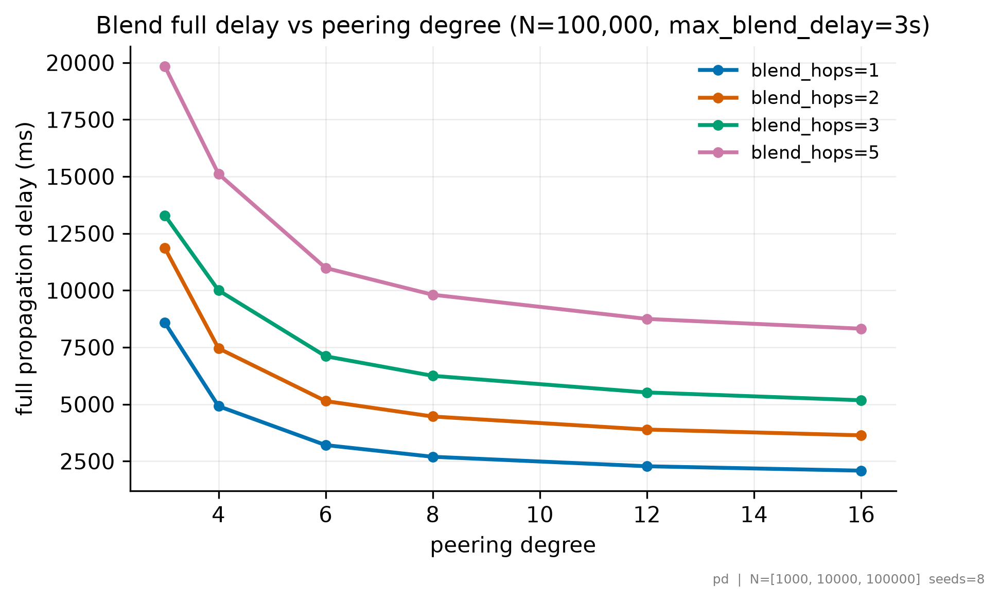
*Fig 1 — Blend full delay vs peering degree, one line per blend-path length (N = 100 000, `max_blend_delay = 3` s). The curve is convex: most of the gain is realised by degree 6–8.*

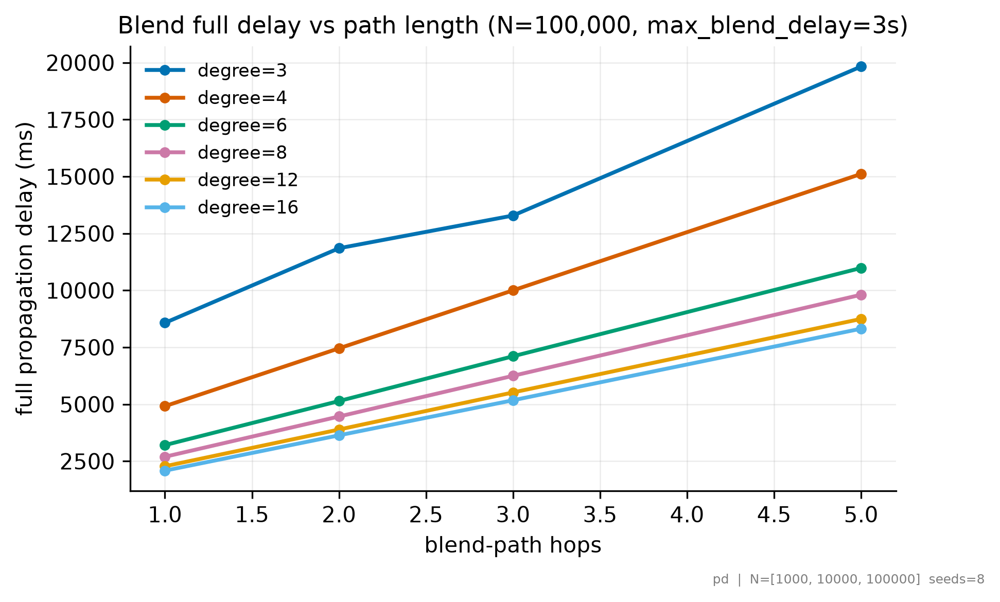
*Fig 2 — The same data read the other way: full delay vs blend-path length, one line per degree. Straight lines — each hop adds a near-constant cost, and the degree sets the slope.*

### 3.2 Delay composition and network-size scaling

The multi-second total is spent in the blend path, not the flood. At degree 8, 3 hops, N = 100 000: the path (transport legs + mixing) is 5.05 s while the final flood to the whole network is only 0.70 s — seven eighths of the delay is the cascade, one eighth is reaching everybody. The flood reaches 50 / 90 / 99 % of nodes in 0.52 / 0.58 / 0.62 s, so the last percent of the network costs only ~100 ms more than the first half. The flood is also what a higher degree accelerates most — 99 %-coverage time falls from 1.90 s at degree 3 to 0.41 s at degree 16. And the total is nearly flat in network size: at degree 8, 3 hops it is 4.87 s at 1 000 nodes, 5.27 s at 10 000, and 5.75 s at 100 000 — an 18 % rise for a hundred-fold size increase, because the flood grows only logarithmically in N while the fixed mixing waits dominate (**Fig 3**).

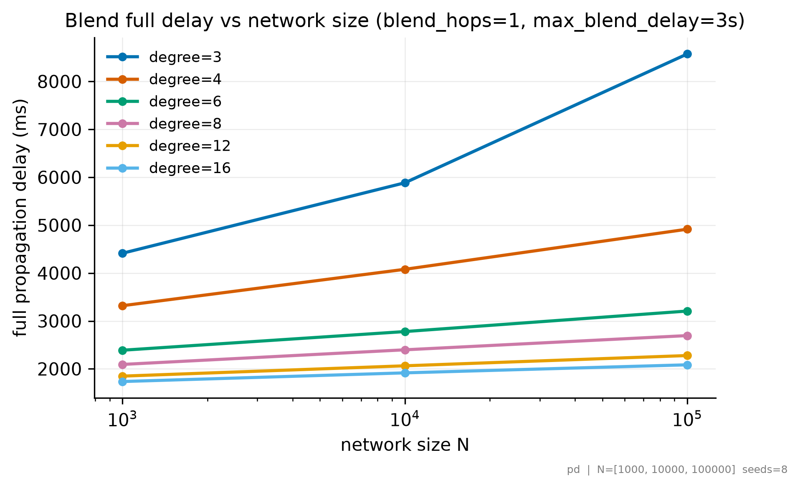
*Fig 3 — Blend full delay vs network size N (log-x, degree lines; 3 hops, `max_blend_delay = 3` s). Near-flat scaling: the seconds-scale mixing waits dominate and the flood grows only ~log N.*

### 3.3 Adversary observation and eclipse

With random placement the two structural metrics follow their closed forms exactly. **Observed** — an honest node with ≥ 1 adversarial peer — is `1 − (1 − f_adv)^degree` and rises with degree, in both directions of the grid (**Fig 8**; N = 100 000):

| f_adv | d = 3 | 4 | 6 | 8 | 12 | 16 |
|---|---|---|---|---|---|---|
| 0.05 | 0.14 | 0.19 | 0.27 | 0.34 | 0.46 | 0.56 |
| 0.10 | 0.27 | 0.34 | 0.47 | 0.57 | 0.72 | 0.82 |
| 0.20 | 0.49 | 0.59 | 0.74 | 0.83 | 0.93 | 0.97 |
| 0.33 | 0.70 | 0.80 | 0.91 | 0.96 | 0.99 | 1.00 |

**Eclipse** — every peer adversarial — is `f_adv^degree` and *falls* with degree, negligible beyond low degree: at `f_adv = 0.5` it is 0.125 at degree 3, 0.004 at degree 8, and ~0 by degree 12; at `f_adv = 0.33` it is already 0.036 at degree 3 and ~0 by degree 8. **A degree of 6–8 makes eclipse practically impossible even against a large adversary** (**Fig 7**). A worst-case greedy-coverage placement pushes observation far above random, and at a useful degree it saturates. At degree 8: `f_adv = 0.1` takes 0.570 → 0.766, and `f_adv = 0.2` takes 0.832 → **1.000** — one adversarial node in five, placed well, observes *every* honest node. At degree 4 the same placement gives 0.590 → 0.840 at `f_adv = 0.2` and reaches 1.000 by `f_adv = 0.33`. So observation must be planned against the worst-case envelope, where it is effectively total for any adversary worth worrying about, while eclipse can be planned against the (already tiny) random rate. This is also why full deanonymization equals the whole-path rate under a worst-case placement (§3.4): the `observed_frac` factor is simply 1.

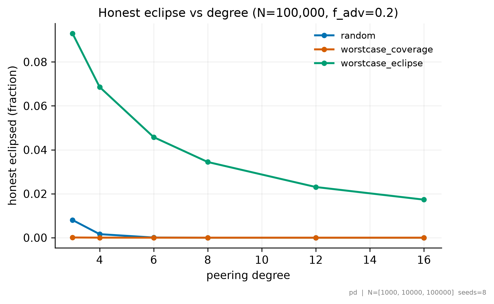
*Fig 7 — Honest eclipse fraction vs peering degree (random placement, N = 100 000). Eclipse collapses with degree; by degree 6–8 it is negligible even at `f_adv = 0.5`.*

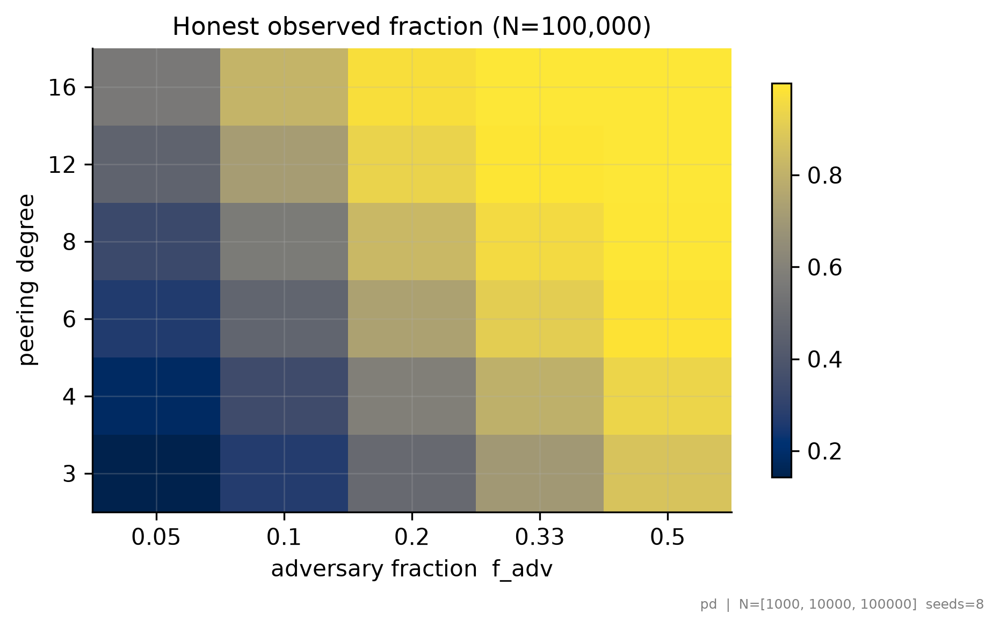
*Fig 8 — Observed fraction over degree × adversary fraction. Observation grows in **both** directions — the cost of a higher degree.*

### 3.4 Deanonymization

Because relays are drawn blind to who is adversarial, the whole-path-adversarial rate is exactly `f_adv^blend_hops` — degree- and placement-independent — and drops by a factor of `f_adv` per hop:

| f_adv | 1 hop | 2 | 3 | 5 |
|---|---|---|---|---|
| 0.10 | 0.100 | 0.010 | 0.0010 | 0.00001 |
| 0.20 | 0.200 | 0.040 | 0.0080 | 0.00032 |
| 0.33 | 0.330 | 0.109 | 0.0359 | 0.0039 |
| 0.50 | 0.500 | 0.250 | 0.125 | 0.031 |

So the blend-path length is the anonymity lever, and the number of hops needed to hold whole-path capture below a target ε is `blend_hops ≥ ln ε / ln f_adv`: to reach ε = 0.01 takes 3 hops at `f_adv = 0.2`, 5 hops at `f_adv = 0.33`, and 7 hops at `f_adv = 0.5` (**Fig 12**). Each hop, though, costs 1.5–2.7 s of latency depending on the degree (§3.1) and a `(1 − u)` reliability factor (§3.5) — the price of anonymity.

**Full** deanonymization as measured here adds the requirement that the honest sender is itself peered with an adversary, i.e. multiplies by `observed_frac`. **That treats one adversarial peer as proof of origination, and it is not** — see the confidence analysis below, which is the more honest reading of the same event. Unlike whole-path capture, this **rises with degree** (2 hops, random placement): at `f_adv = 0.33` it climbs from 0.076 at degree 3 to 0.109 at degree 16 (approaching the whole-path ceiling of `0.33² = 0.109` as the sender becomes almost surely observed); at `f_adv = 0.5` it climbs from 0.219 to 0.250. A worst-case-coverage placement drives the `observed` factor up toward 1, pushing full deanonymization to the whole-path ceiling (**Fig 14**, **Fig 15**). This is the sharp form of the tension: a higher degree that speeds propagation and defeats eclipse *also* makes the sender almost certainly exposed whenever the path is captured.

**How confident is the adversary, really?** Capturing the cascade tells the adversary *which* message it is following, not *who started it*. Seeing an honest node `X` transmit is consistent with two stories: `X` originated the message, or `X` received it from a peer and passed it on. The adversary separates them by not having seen the message arrive at `X` — certain if `X` originated it, but of probability `1 − a/d` if `X` merely relayed, since the delivering peer may have been one it cannot watch. With equal priors:

**`confidence = 1 / (2 − a/d) = d / (2d − a)`** for `a` adversarial peers out of degree `d`.

The path length does not appear: the conditioning event already fixes the relays as adversarial, so an honest `X` cannot be one of them for this message. What the formula says is that **one adversarial peer is worth very little** — 0.53 at degree 8, barely above the 0.5 prior — and confidence climbs only as the adversary comes to watch nearly all of the sender's links:

| adversarial peers (of 8) | 1 | 2 | 4 | 6 | 7 | 8 |
|---|---|---|---|---|---|---|
| confidence | 0.53 | 0.57 | 0.67 | 0.80 | 0.89 | **1.00** |

At degree 8, reaching 90 % confidence requires `a ≥ 8` — *every* peer adversarial. **That is the eclipse condition, not the observation condition**, and the measurement confirms it exactly: the fraction of honest nodes attributable at ≥ 0.9 equals `eclipsed_frac` to the last digit. The two differ enormously:

| `f_adv` | observed | attributable at ≥ 0.9 | ratio |
|---|---|---|---|
| 0.10 | 0.569 | ~10⁻⁸ | 5.7 × 10⁷ |
| 0.20 | 0.832 | 2.6 × 10⁻⁶ | 3.3 × 10⁵ |
| 0.33 | 0.959 | 1.4 × 10⁻⁴ | 6.8 × 10³ |

So **the `full_deanon` figures above overstate confident origination by up to five orders of magnitude**: they count an adversary that has glimpsed one of the sender's eight links as having identified the sender. Mean confidence over honest nodes is 0.47 at `f_adv = 0.2` — nearer a coin flip than an identification. The honest statement is that whole-path capture is common and *confident attribution of the originator is rare*, and that the second requires eclipsing the sender, which §3.3 shows a degree of 6–8 already makes negligible.

Two caveats keep this from swinging too far the other way. This estimator uses **only the sender's own links**, so it is a *lower bound* on the adversary's capability: an honest peer that itself has adversarial peers leaks the message upstream too, and `observed_frac` is already 0.83 at `f_adv = 0.2` — most honest relays are themselves watched. The true value is bracketed by these two readings, and closing that gap is the open question flagged in §5. And confidence is a *threshold* choice: an adversary content with 0.53 attributes far more nodes than one demanding 0.9.

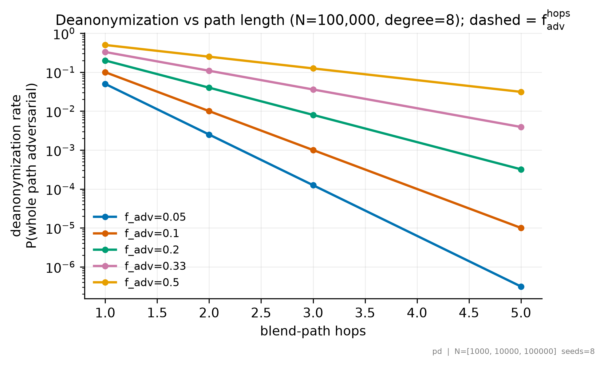
*Fig 12 — Whole-path deanonymization rate vs blend-path length, one line per `f_adv` (log-y). Solid = simulated, dashed = the analytic `f_adv^blend_hops`; path length drives it down exponentially, independent of degree.*

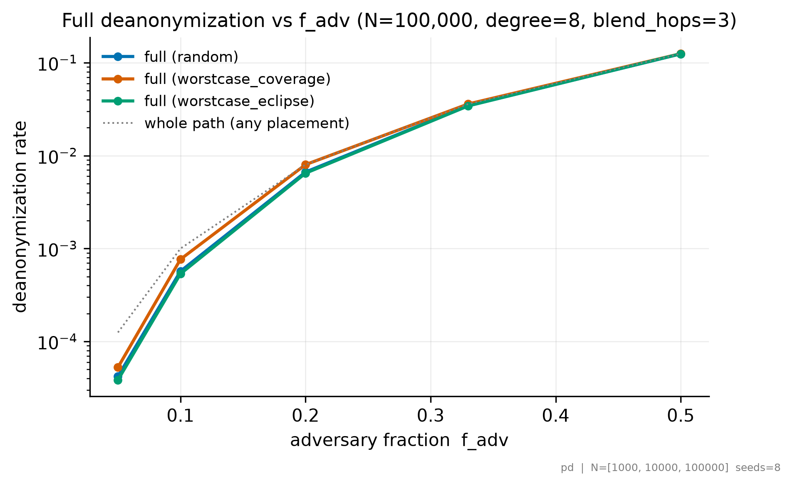
*Fig 14 — Full deanonymization vs `f_adv`, random against worst-case placement (log-y). The grey dotted ceiling is the whole-path rate, which no placement can exceed; the worst case rides up to it.*

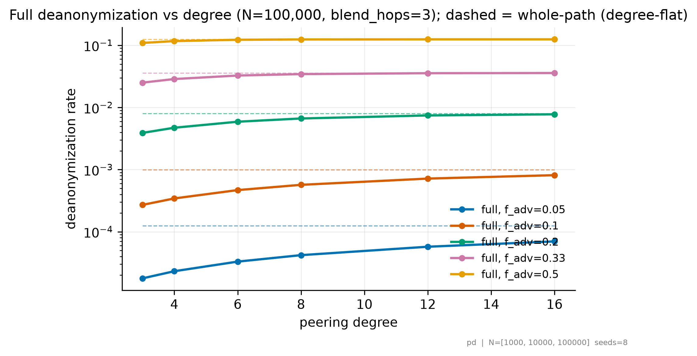
*Fig 15 — Full deanonymization rate vs peering degree, per `f_adv` (2 hops, log-y). Full deanonymization **rises** with degree (dashed = the degree-flat whole-path rate): more peers make the sender almost surely touch the adversary.*

### 3.5 Reliability under churn

With a fraction `u` of unresponsive nodes, a message survives only if every relay on its (responsiveness-blind) path forwards, so the delivery rate tracks `(1 − u)^blend_hops` — and longer paths are much more fragile (N = 100 000, degree 8):

| blend_hops | u = 0.05 | 0.10 | 0.20 | 0.30 | 0.50 |
|---|---|---|---|---|---|
| 1 | 0.947 | 0.895 | 0.798 | 0.701 | 0.494 |
| 2 | 0.895 | 0.815 | 0.642 | 0.488 | 0.245 |
| 3 | 0.862 | 0.729 | 0.510 | 0.339 | 0.121 |
| 5 | 0.774 | 0.591 | 0.331 | 0.166 | 0.030 |

Every entry sits within 0.007 of `(1 − u)^blend_hops` (SEM ≤ 0.009), so the law is exact to measurement precision in this regime. This compounds with the anonymity lever of §3.4: a 5-hop path that holds deanonymization to a few per mille also loses 41 % of messages at 10 % churn and 97 % at 50 % churn (**Fig 10**). The two are directly opposed — every hop bought for anonymity is paid for in delivery — which caps how long a usable path can be at a given churn level.

The second churn effect is on **coverage**: unresponsive nodes still receive but do not relay, so they are routing holes that can strand pockets during the final flood. Coverage here — and everywhere in this section — is the fraction of **all** nodes reached, counting the unresponsive ones, which under uniform churn still receive because they sit among live peers. (§3.9 introduces a second notion, coverage of the *live* network only, because correlated failure separates the two. Under the uniform churn of this section they agree to within 0.001, so nothing below depends on which is meant.) Here a higher degree is decisive, and not gradually — **the collapse has a threshold, and it is exactly predictable.** Because unresponsive nodes relay nothing, the network that actually carries a flood is the sub-graph induced on the responsive nodes, and that is textbook *site percolation* on a random `d`-regular graph, whose giant component survives only while the responsive fraction exceeds `1/(degree − 1)`. The network therefore tolerates churn up to

**`u_c = 1 − 1/(degree − 1)`**

and shatters above it. Walking the churn to 90 % (N = 100 000, single hop, 6 400 rounds per cell) the measured flood coverage collapses at exactly that point for every degree:

| degree | `u_c` | u = 0.3 | 0.5 | 0.6 | 0.7 | 0.8 | 0.9 |
|---|---|---|---|---|---|---|---|
| 3 | **0.50** | 0.92 | **0.01** | 0.00 | 0.00 | 0.00 | 0.00 |
| 4 | **0.67** | 0.99 | 0.85 | 0.54 | **0.00** | 0.00 | 0.00 |
| 6 | **0.80** | 1.00 | 0.98 | 0.93 | 0.75 | **0.03** | 0.00 |
| 8 | **0.86** | 1.00 | 1.00 | 0.98 | 0.92 | 0.62 | **0.00** |
| 12 | **0.91** | 1.00 | 1.00 | 1.00 | 0.99 | 0.90 | **0.20** |
| 16 | **0.93** | 1.00 | 1.00 | 1.00 | 1.00 | 0.97 | **0.64** |

Every degree holds essentially total coverage until its own threshold and then falls off a cliff at it (bold; **Fig 20**) — the last grid point below `u_c` still delivers to most of the network, the first point at or above it delivers to almost none. The collapse is sharp, not gradual, so a network does not degrade gracefully into heavy churn: it works, and then it does not. (This study is an independent run from the one behind the delivery table above; where the two overlap they agree to ≤ 0.01 — degree 4 at `u = 0.5` gives 0.85 in both — which is a useful cross-check on the whole propagation path.)

This also explains the one badly-behaved cell in the study. Degree 3 at `u = 0.5` sits *exactly on its critical point*, where the giant component is famously bimodal — across eight topologies, five delivered to no one at all and three to 0.3–8.6 % of the network. No amount of extra sampling converges that mean, because it is a critical point rather than a noisy measurement (§5). Hence the design rule is stated as a threshold, not a coverage number: **degree 3 dies at 50 % churn, degree 6 survives to 80 %, degree 8 to 86 %.**

The threshold also bounds the delivery law of the previous table. `(1 − u)^blend_hops` assumes the legs are routable, which holds while `u` is comfortably below `u_c`: at degree 8 measured single-hop delivery is 0.494 against a predicted 0.5 at `u = 0.5`, but only 0.078 against 0.2 at `u = 0.8` as the threshold approaches, and 0 beyond it. **Below the percolation threshold the delivery law holds; above it, delivery does not merely decay — it stops.**

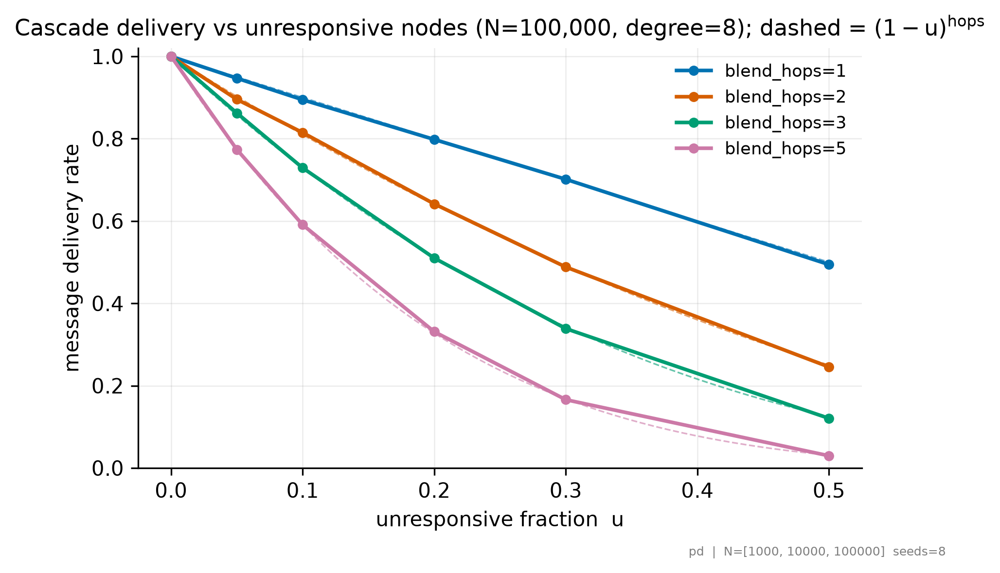
*Fig 10 — Message delivery rate vs unresponsive fraction, one line per blend-path length (N = 100 000, degree 8); dashed = `(1 − u)^blend_hops`. Longer paths are much more fragile to churn.*

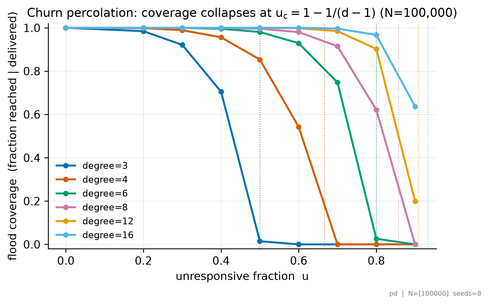
*Fig 20 — Coverage across the percolation threshold, churn walked to 90 % (N = 100 000, single hop). Each degree's dotted vertical is its predicted `u_c = 1 − 1/(degree − 1)`; every curve falls off its own mark.*

### 3.6 Time to link — how fast an emitter is deanonymized

Exposure is a *rate*, not a one-off. Model traffic as: every 30 s one node network-wide emits a message, chosen with probability proportional to its stake, so a node of stake fraction `s` emits with probability `s` per slot. Only a node with at least one adversarial peer — the **linkable set**, a fraction `observed_frac = 1 − (1 − f_adv)^degree` of the network (0.83 at `f_adv = 0.2`, degree 8) — can ever be tied to a message this way; a node with no adversarial peer is structurally unlinkable. A linkable node is *linked* the first time one of its emissions traverses a wholly-adversarial cascade, which happens per emission with probability `q = f_adv^blend_hops` (the whole-path rate of §3.4; the sender-peered condition is already met for a linkable node). Attributable observations therefore arrive as a Bernoulli(`s·q`)-per-slot process, and the time to have linked the node with probability α is

`T_link(α) = 30 s · ⌈ln(1−α) / ln(1 − s·q)⌉ ≈ 30 s · ln(1/(1−α)) / (s·q)` — **inversely proportional to the node's stake.**

At `f_adv = 0.2`, `blend_hops = 3`, degree 8 (`q = 0.2³ = 0.008`):

| stake `s` | α = 0.5 | α = 0.9 | α = 0.99 |
|---|---|---|---|
| 5 % | 0.6 d | 2.0 d | 4.0 d |
| 1 % | 3.0 d | 10.0 d | 20.0 d |
| 0.5 % | 6.0 d | 20.0 d | 40.0 d |
| 0.1 % | 30.1 d | 99.9 d | 199.9 d |
| 0.05 % | 60.2 d | 199.9 d | 399.8 d |
| 0.01 % | 300.8 d | 999 d (2.7 yr) | 1 999 d (5.5 yr) |
| 0.005 % | 602 d (1.6 yr) | 1 999 d (5.5 yr) | 3 998 d (11.0 yr) |
| 0.001 % | 3 008 d (8.2 yr) | 9 994 d (27.4 yr) | 19 988 d (54.8 yr) |

Every 10× drop in stake multiplies the time by 10, and raising the confidence from α = 0.5 to 0.99 costs a fixed factor `ln(1/0.01)/ln 2 ≈ 6.6` at any stake.

**Two corrections from §3.10, both of which matter here.** First, with cover traffic running, catching an emission is *not* the same as catching a block: only about one emission in `block_interval × cover_rate` is a proposal, so linking a node to a message identifies the **node**, not the fact that it produced a block. The times above are therefore times to link an *identity*; attributing a *proposal* takes correspondingly longer. Second, the large stakers this table is most interested in cannot be emission-uniform at all — the quota ceiling at the baseline rate is ~0.1 % of stake (§3.10), so the 5 % and 1 % rows sit one to two orders of magnitude above it. Such a node is distinguishable by how often it emits, without any path being captured. **For the head of the stake distribution, the binding exposure is the emission quota, not the cascade.** A large staker is deanonymized within days; the smallest holders are, for practical purposes, never linked — and lengthening the blend path multiplies `q` down by `f_adv` per hop, stretching every entry in the table by `1/f_adv` (25× per two hops at `f_adv = 0.2`). This is the anonymity value of both a small stake and a long path, expressed as time (**Fig 16**).

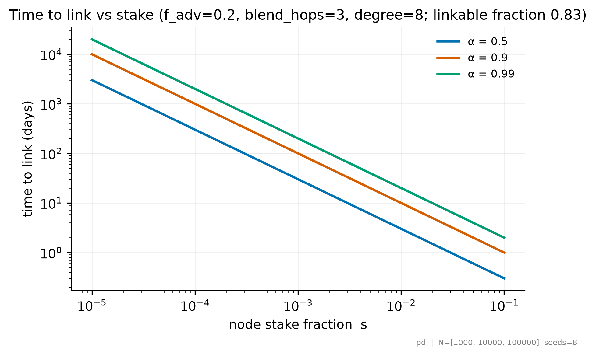
*Fig 16 — Time to link an emitter vs its stake fraction, one line per confidence α (log-log; `f_adv = 0.2`, `blend_hops = 3`, degree 8; linkable fraction 0.83). The parallel lines are the `T ∝ 1/stake` law; only the 83 % of nodes with an adversarial peer are on it at all.*

### 3.7 Learning a node's stake

The same attributable-observation stream measures *how much* stake a node holds: its events arrive at rate `s·q`, so counting them estimates `s`. After `N` attributable observations the stake estimate has relative precision `≈ 1/√N` (a count of `N` has standard error `√N`), and the expected time for a node sitting at a threshold `θ` to accumulate them is `T = 30 s · N / (θ·q)`. Identity linking (§3.6) is the `N = 1` case; certifying a node holds *at least* `θ` to ±10 % needs `N = 100`, to ±5 % needs `N = 400`. At `f_adv = 0.2`, 3 hops, degree 8 (`q = 0.008`), in **days**:

| threshold `θ` | identity (N=1) | stake ±10 % (N=100) | stake ±5 % (N=400) |
|---|---|---|---|
| 5 % | 0.9 d | 86.8 d | 347 d |
| 1 % | 4.3 d | 434 d (1.2 yr) | 1 736 d (4.8 yr) |
| 0.5 % | 8.7 d | 868 d (2.4 yr) | 3 472 d (9.5 yr) |
| 0.1 % | 43.4 d | 4 340 d (11.9 yr) | 17 361 d (47.6 yr) |
| 0.05 % | 86.8 d | 8 681 d (23.8 yr) | 34 722 d (95.1 yr) |
| 0.01 % | 434 d (1.2 yr) | 43 403 d (118.9 yr) | 173 611 d (475.6 yr) |
| 0.005 % | 868 d (2.4 yr) | 86 806 d (237.8 yr) | 347 222 d (951.3 yr) |
| 0.001 % | 4 340 d (11.9 yr) | 1 189 yr | 4 756 yr |

So an adversary can tell within a year *whether* a node is a large staker (≥ ~1 %), but resolving stake below ~0.1 % to a useful precision takes more than a decade and below ~0.01 % runs to centuries — a hard floor on stake inference set by the deanonymization rate and the emission cadence (**Fig 18**). Note the two columns answer different questions: the `N = 1` column is just §3.6's linking time re-expressed (it identifies the node without sizing it), while the ±10 %/±5 % columns are what it costs to *measure* the stake. Sizing is 100× to 400× more expensive than identifying, so on any realistic horizon an adversary learns *who* a node is long before it learns *how much* it holds.

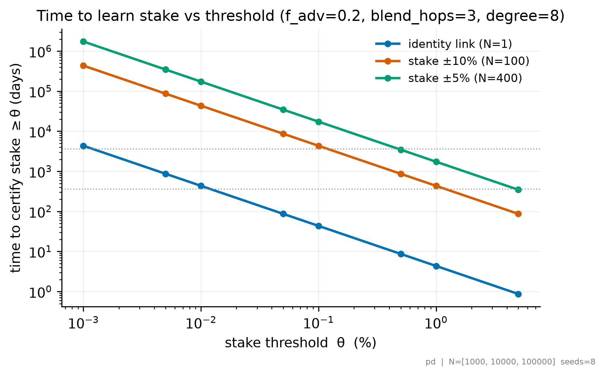
*Fig 18 — Time to certify a node holds at least a stake threshold θ, vs θ, for identity (N=1) and stake estimates to ±10 % / ±5 % (dotted lines mark 1 and 10 years). Sub-0.1 % stake is effectively unlearnable.*

### 3.8 Messaging redundancy — reliability against anonymity

Sending each message over `R` **independent** blend cascades means it succeeds if *any* cascade delivers, and is captured if *any* cascade is adversarial — the same "at least one of R" structure, so both quantities follow `1 − (1 − x)^R`. Redundancy is thus a single dial that moves reliability and exposure **in the same direction**. Delivery (measured; degree 8, 3 hops, `p₁ = (1−u)^3`) and whole-path/full deanonymization (exact; `f_adv = 0.2`) as `R` rises:

| R | delivery `u=0.1` | delivery `u=0.3` | delivery `u=0.5` | deanon | full deanon |
|---|---|---|---|---|---|
| 1 | 0.735 | 0.342 | 0.117 | 0.0080 | 0.0067 |
| 2 | 0.930 | 0.581 | 0.228 | 0.0159 | 0.0133 |
| 3 | 0.980 | 0.713 | 0.319 | 0.0238 | 0.0198 |
| 4 | 0.995 | 0.810 | 0.406 | 0.0316 | 0.0263 |

(Delivery is measured over 9 600 rounds per cell, SEM ≤ 0.006; the deanonymization columns are closed-form. Every delivery figure sits within 0.015 of its `1 − (1 − p₁)^R` prediction — e.g. 0.810 measured against 0.813 predicted at `u = 0.3, R = 4`.)

`R = 3` turns a one-in-three delivery at 30 % churn into better than seven-in-ten, but simultaneously triples the per-emission capture probability (0.008 → 0.024). Because the capture rate rises ≈ `R×`, so does the linking rate — `q_R ≈ R·q₁` — and every time in §3.6–§3.7 shrinks by ≈ `R`:

| stake | R = 1 | R = 2 | R = 3 | R = 4 |
|---|---|---|---|---|
| 5 % | 2.0 d | 1.0 d | 0.7 d | 0.5 d |
| 1 % | 10.0 d | 5.0 d | 3.4 d | 2.5 d |
| 0.1 % | 99.9 d | 50.2 d | 33.6 d | 25.3 d |

*Time to link at α = 0.9, `f_adv = 0.2`, 3 hops (**Fig 17**).* So four copies of every message buy back delivery from 0.34 to 0.81 at 30 % churn and, in exchange, cut a 1 %-staker's anonymity lifetime from ten days to two and a half.

Expressing the cost as *time* rather than as a per-emission probability is what makes the trade legible, because the two sides then carry the same units of consequence — messages that arrive versus days of anonymity remaining. **Fig 21** puts them on one plot: the delivery curve rises through `R` while every stake's time-to-link falls through it, and the two cross. The probability view (**Fig 19**) says redundancy multiplies capture by `R`; the time view says the same thing in the currency an operator actually cares about — a 5 %-staker linked in 2.0 days at `R = 1` is linked in 0.5 days at `R = 4`, and no choice of `R` improves both axes at once.

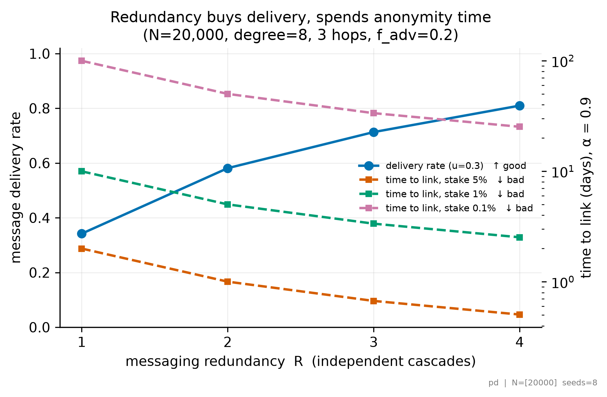
*Fig 21 — The redundancy trade in both units: measured delivery rate (left axis, solid, ↑ good) against time to link (right axis, log days, dashed, ↓ bad) for three stakes, at `u = 0.3`, `f_adv = 0.2`, 3 hops. Buying delivery with copies spends anonymity time in proportion.*

**The trade gets worse, not better, near the churn threshold.** The `1 − (1 − p₁)^R` law assumes the `R` cascades fail *independently*, which holds while relay responsiveness is the binding constraint. Close to the percolation threshold of §3.5 the binding constraint becomes the *shared* responsive graph — if the sender sits in a poorly-connected pocket, every cascade fails together — so redundancy under-delivers against the independent prediction: at degree 3, single hop, `u = 0.3`, `R = 4` measures 0.902 where independence predicts 0.970, and at degree 3 with `u = 0.5` four copies still deliver only 1.4 % of messages. Redundancy cannot repair a network that is falling apart structurally; correlated failure defeats it exactly where reliability is most wanted.

**Redundancy buys delivery only — never coverage.** It is tempting to expect a second benefit, that independent cascades flooding from different final relays would between them reach pockets a single flood strands. They do not, and the reason is structural: a cascade is *delivered* only if the sender can route the message to its relay in the first place, so every delivered cascade's final relay already lies in the sender's own reachable component and floods (a subset of) the very same set. The union over `R` cascades therefore cannot exceed what one delivered cascade already reaches — measured directly, in the fragmented regime the union was identical to the best single flood in every round where two or more cascades delivered, and coverage is flat in `R` to four decimal places at every degree and churn level tested (degree 8, `u = 0.5`: 0.9959 at every `R`). At the critical point it even drifts slightly *down* with `R` (degree 3, `u = 0.5`: 0.053 → 0.045), because extra copies mostly add deliveries out of small pockets, which lowers the average coverage of a delivered message. Redundancy is a pure reliability-for-anonymity trade with no coverage dividend; the way to protect coverage is peering degree (§3.5), not repetition.

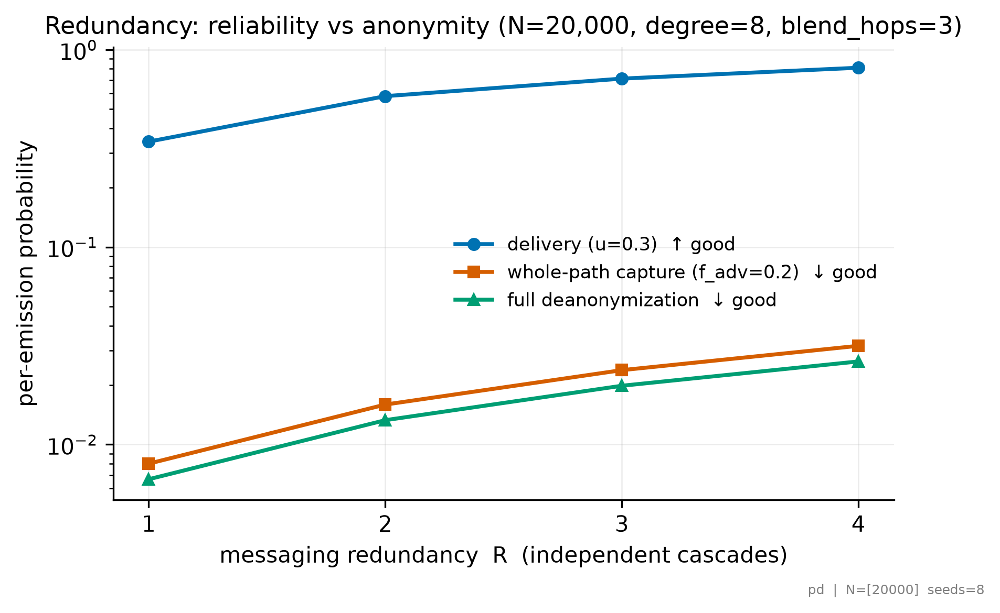
*Fig 19 — Reliability gain vs anonymity cost of redundancy R (log-y, N = 20 000, degree 8, 3 hops). Delivery (↑ good) and whole-path / full deanonymization (↓ good) all climb as `1 − (1 − x)^R`: the same dial.*

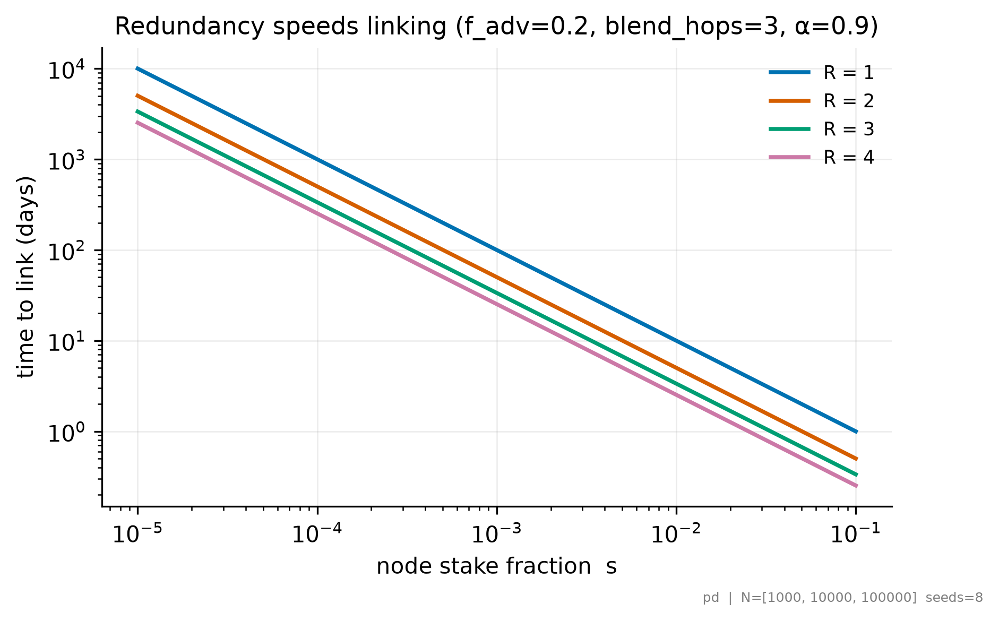
*Fig 17 — Time to link vs stake, one line per redundancy R (α = 0.9). Each extra cascade multiplies the capture rate by ≈ R, cutting the time to link proportionally.*

### 3.9 Correlated outages — when whole regions go dark

§3.5 removes nodes independently. Real outages do not work that way: a datacentre, an AS or a region fails as a unit. To model that, the network is partitioned into equal-sized **failure domains** and a `regional` churn mode takes domains down whole, until exactly the same number of nodes are dead as under uniform churn — so the two are compared at identical churn on identical topologies.

One modelling point decides whether this is interesting at all. If peering ignores regions, then dropping whole regions still removes a *uniformly random* set of nodes, and correlated churn is statistically indistinguishable from uniform churn — the clustering exists in the operator's world but not in the graph's. Correlation only matters when a failure domain is also a **connectivity** domain, so these runs place 75 % of every node's peers inside its own region (40 domains, N = 20 000, 6 400 rounds/cell).

A region here is a **failure domain and a peering domain, but not a latency domain**: link delays are still drawn from the same geographic mixture regardless of whether a link is intra- or inter-region. Real co-located nodes would also talk to each other faster, which would make intra-region flooding quicker than modelled — so the delay figures in this section are, if anything, pessimistic for the clustered case. Nothing in the coverage or delivery results depends on it, since those turn on reachability rather than speed.

The result runs opposite to the intuition that correlated failure is the harsher case:

| degree | u | live coverage (uniform → regional) | all-node coverage | delivery |
|---|---|---|---|---|
| 4 | 0.5 | 0.853 → **1.000** | 0.854 → 0.751 | 0.370 → 0.489 |
| 4 | 0.6 | 0.532 → **1.000** | 0.533 → 0.641 | 0.113 → 0.403 |
| 4 | 0.7 | 0.001 → **1.000** | 0.001 → 0.511 | 0.000 → 0.297 |
| 8 | 0.6 | 0.980 → **1.000** | 0.980 → 0.787 | 0.384 → 0.407 |
| 8 | 0.8 | 0.608 → **1.000** | 0.609 → 0.491 | 0.072 → 0.197 |

**Clustered failure does not fragment the network; scattered failure does.** Under regional churn the live coverage is **1.000 at every degree and every churn level tested, up to 80 % of the network dead** — the percolation threshold of §3.5 simply does not appear. The reason is structural: removing a domain removes an entire neighbourhood and leaves every surviving neighbourhood whole, so a survivor keeps all its local peers, while uniform churn of the same size damages *every* neighbourhood at once. Degree 4 at 70 % churn is the extreme case: scattered failure has annihilated the network (live coverage 0.001, delivery 0.000) while the same number of clustered failures leaves the survivors perfectly connected and still delivering 30 % of messages (**Fig 22**).

The price is paid on the other side of the ledger. Dead domains become unreachable islands — under uniform churn an offline node is surrounded by live peers and still *receives* the flood, but a whole dead region has no live interior, so all-node coverage falls (degree 8: 0.993 at `u = 0.2` down to 0.491 at `u = 0.8`, against ~1.0 → 0.609 for uniform). Which figure matters depends on the question: for keeping the *operating* network in consensus, correlated churn is the milder failure; for delivering to nodes that will come back, it is the harsher one.

Two consequences for the rest of the report. First, **§3.5's `u_c = 1 − 1/(degree − 1)` is the uncorrelated case, and it is the conservative one** for the live network — a real deployment whose outages cluster by AS or region will hold together past that threshold, not fall short of it. Second, delivery is never worse under correlated churn and is dramatically better past the uniform threshold, because delivery needs the relay to be *routable*, and clustered failure is what preserves routability.

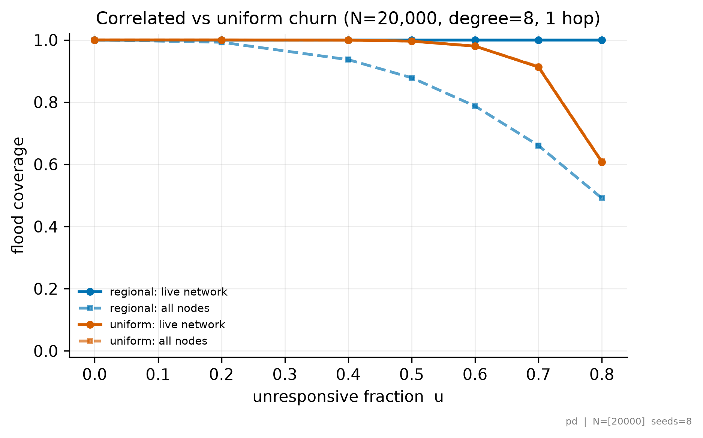
*Fig 22 — Correlated (AS/region) outages against uniform churn at matched churn (N = 20 000, degree 8, 1 hop, 40 domains, 75 % locality). Solid = coverage of the live network, dashed = coverage of all nodes. Regional churn holds the live network at 1.000 throughout while stranding the dead domains; uniform churn keeps the dead reachable but takes the whole network down with it.*

### 3.10 Cover traffic — what it buys, and what it costs

Everything above treats a message as a lone event. A deployed Blend network also emits **cover traffic**: every node picks emission slots uniformly at random at rate `cover_rate_mult / N` per slot, so the default rate puts one emission per second on the whole network. Winning the block lottery consumes the next scheduled cover, so **every node emits the same number of times per epoch whether or not it produces blocks** — the emission *count* carries no signal. That uniformity is the property cover traffic exists to buy, and it turns out to be both narrower and more expensive than it looks.

Two quantities have to be kept apart, because they behave completely differently.

**Mixing** is how many messages a relay holds at once. **Blending** is how many broadcasts it has *seen* between two consecutive releases. Since every broadcast reaches every node, an observer watching a relay release cannot tell which of the messages it had seen was the one forwarded — so blending, not mixing, is the anonymity set. Measured at N = 20 000, degree 8, 3 hops:

| `max_blend_delay` | blending | mixing (mean / max) | mean hold |
|---|---|---|---|
| 3 s | 2.4 | **0.0014** / 1 | 1.18 s |
| 10 s | 7.1 | 0.0041 / 1.8 | 3.49 s |
| 30 s | 19.8 | 0.0120 / 2 | 10.14 s |

**At the specified rate there is no mixing at all.** A relay holds 0.0014 messages on average and never more than two — one message per second spread over twenty thousand nodes simply never collides. Anything the design gains here it gains through blending. And this is not a low-rate artefact: pushing the rate up by **256×** only lifts mean occupancy to 0.39 (max 9), exactly as Little's law requires (`256 × 3 × 10.17 / 20 000`). **Per-relay mixing is unreachable at any rate a real network would pay for**, so the anonymity set is entirely the traffic a relay has watched go by.

Blending itself follows a clean law. Intervals sampled *at a release* are size-biased — a longer gap is likelier to have caught an arrival — so the set is

**`blending = rate × (2·max_blend_delay + 1) / 3`**

which is exactly twice the mean hold, not `rate × M/2` as a naive reading gives. Measured across three decades of rate and three delays it holds to ~1 % over most of the range and ~7 % at the extreme (**Fig 23**):

| rate (msg/s) | M = 3 | M = 10 | M = 30 |
|---|---|---|---|
| 1 | 2.4 | 7.1 | 19.8 |
| 16 | 37.2 | 110.9 | 316.2 |
| 256 | 593 | 1 744 | 4 832 |

The practical consequence is that **delay is a far cheaper lever than bandwidth**. Both enter linearly, but bandwidth is paid by every node on every link while delay is paid once per hop. An anonymity set of 100 costs 42.9 msg/s at `M = 3` but only 4.9 msg/s at `M = 30` — a ninefold traffic saving for a hop that takes ~10 s instead of ~1.2 s (§3.1 prices that latency). Cover traffic between block proposals is `rate × block_interval` — about 30 messages at the baseline, one of which is cancelled by the block itself.

**The quota bounds stake concentration.** The uniform-emission guarantee holds only while a node's proposals fit inside its budget. A node's lottery weight is its stake relative to the **inferred** total `D̂` — that is the denominator the threshold is derived from — so with quota `q = cover_rate_mult/N` per slot the bind is exact:

**`α_max = ln(1 − q) / ln(1 − f)`**, and in true stake **`s_max = (D̂/D) · α_max`**

The familiar `q/f` is a small-`q` approximation that runs 1.7 % high and therefore *overstates* the tolerable stake. Measured over a full epoch against heavy-tailed stake, the ceiling scales with the cover rate and the measured breakpoint tracks the prediction:

| rate | quota/epoch | `s_max` predicted | 99 %-safe | measured breakpoint |
|---|---|---|---|---|
| 1 | 32.4 | 0.147 % | 0.096 % | 0.122 – 0.168 % |
| 16 | 518 | 2.36 % | 2.13 % | 2.03 – 2.58 % |
| 64 | 2 074 | 9.45 % | 8.98 % | 5.96 – 9.54 % |
| 256 | 8 294 | 38.0 % | 37.0 % | nobody overran |

At the baseline rate that ceiling is **0.147 % of inferred stake — about 0.1 % once Poisson fluctuation is allowed for** (a node sitting on the mean bind overruns in half of all epochs). With realistic stake concentration 99.7 % of nodes comply, but the head does not: **a 9.5 % holder wins some 65× its allowance** and cannot hide inside a uniform emission count at any delay. This reaches back into §3.6–§3.7, whose 5 % and 1 % stakers sit one to two orders of magnitude above the ceiling — *those* nodes are distinguishable by emission count alone, before any path is captured. Raising the cover rate is the only remedy, and it buys headroom linearly: 64× the traffic to admit a 9.5 % staker (**Fig 24**).

Because `s_max` is expressed against `D̂`, an estimator that runs low tightens the true-stake ceiling in exact proportion — `D̂/D` is an input here, taken from the consensus-side study rather than assumed, and deflating it to 0.64 measurably pushes more nodes over their quota. **The two systems are coupled: stake-inference accuracy propagates directly into who can remain emission-uniform.**

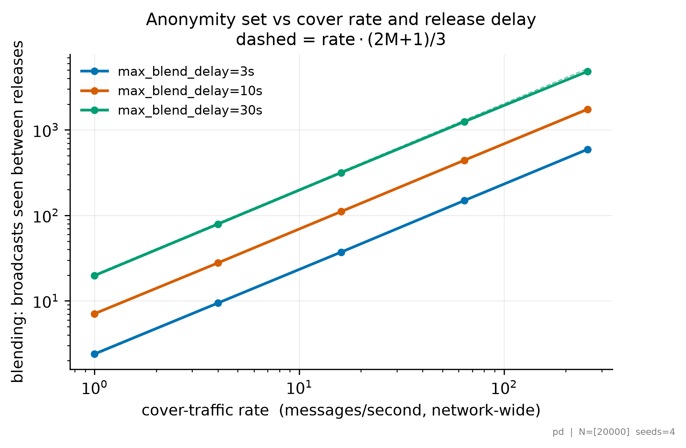
*Fig 23 — Blending against cover rate, one line per release delay (log-log, N = 20 000). Dashed = `rate·(2M+1)/3`. Both knobs enter linearly, but delay is bought once per hop while rate is paid on every link.*

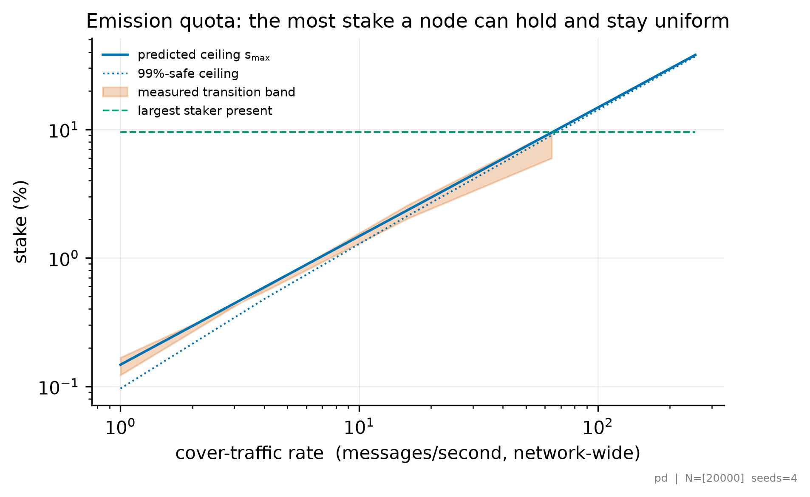
*Fig 24 — The most stake a node can hold and still emit like everyone else, against cover rate: predicted ceiling, the 99 %-safe ceiling, the measured transition band, and the largest staker actually present.*

---

## 4. Design guidance

**Choose the peering degree for transport, and set it at 6–8.** Speed (§3.1), eclipse resistance (§3.3), and churn resilience (§3.5) all improve with degree and all saturate by 6–8; the percolation threshold of §3.5 is the binding constraint, ruling out degree 3–4 for any deployment expecting substantial churn. That constraint inverts into a sizing rule: to keep the network connected through a churn fraction `u`, the degree must satisfy **`degree > 1 + 1/(1 − u)`** — degree 4 to survive 50 % churn, 6 to approach 80 %, 8 for 86 %, with a margin above the threshold rather than at it (the critical point itself is where behaviour becomes erratic). Going above ~8 buys little transport and steadily worsens observation and full deanonymization (§3.3, §3.4), so a higher degree is justified only where worst-case eclipse at very low degree, or churn beyond ~86 %, would otherwise be a concern. Size the degree against the *uncorrelated* threshold: it is the conservative one, since outages that cluster by AS or region leave the surviving network connected well past it (§3.9).

**Choose the blend-path length for anonymity, independently.** Whole-path deanonymization is `f_adv^blend_hops` and does not depend on degree, so the number of hops is a free anonymity control: `blend_hops ≥ ln ε / ln f_adv` for a whole-path-capture target ε against an assumed adversary fraction `f_adv` (§3.4). The cost is paid in latency (1.5–2.7 s/hop by degree, §3.1) and reliability (a `(1 − u)` factor per hop, §3.5), and those costs — not the anonymity benefit — are what bound the usable path length at a given churn level.

**Plan the adversary against the right case.** Observation and full deanonymization should be planned against the *worst-case* placement envelope, where at a useful degree they simply saturate: greedy coverage takes observation to 1.000 at degree 8 with only `f_adv = 0.2` (§3.3), which drives full deanonymization to its whole-path ceiling. In other words, assume a competent adversary sees every honest node and plan anonymity entirely on path length. Eclipse can be planned against the random rate, since it is already negligible at degree ≥ 6–8 even in the worst case examined.

**Judge anonymity in time, and weigh it by stake.** A per-emission rate that looks small is not safety for an active, high-stake node: exposure accumulates at `stake · f_adv^blend_hops` per slot, so a large staker is linked in days while a small one is effectively never (§3.6). If high-stake participants must stay unlinkable over a long horizon, the lever is the blend-path length — each hop multiplies the time-to-link by `1/f_adv` — since their stake (hence emission rate) is fixed. The corresponding protection against *stake* inference is automatic below ~0.1 % but weak for large stakers, who are both linked and sized quickly (§3.7).

**Add messaging redundancy only for reliability, and price the anonymity it costs.** Redundancy `R` multiplies delivery and capture by the same `1−(1−x)^R`, so it should be raised only when churn makes single-cascade delivery inadequate (e.g. `R = 3` lifts delivery from 0.342 to 0.713 at 30 % churn), accepting that it shortens every time-to-link by ≈ `R` (§3.8). It is strictly the wrong tool for *coverage*: redundancy cannot reach nodes a single delivered cascade misses, because every cascade floods the sender's own component — coverage is bought with peering degree, not repetition. Note also that path length and redundancy pull against each other: each hop divides the capture rate by `f_adv` but multiplies the loss rate, while each extra copy restores delivery at a proportional anonymity cost. The efficient combination is the *shortest* path that still meets the anonymity target at `R = 1`, raising `R` only if the resulting delivery rate is unacceptable.

---

## 5. Validity and caveats

- **Attribution confidence is bracketed, not settled.** §3.4 gives two readings of the same event: `full_deanon` (any adversarial peer counts as identification) and the confidence-weighted rate (only the sender's own links count as evidence). The first is an upper bound on adversary capability, the second a lower bound, and at `f_adv = 0.2`, degree 8 they differ by five orders of magnitude. The truth lies between, because an adversary also learns from the sender's *neighbourhood* — an honest peer with adversarial peers of its own leaks the message upstream, and with `observed_frac` at 0.83 most honest relays are themselves watched. Resolving that needs a k-hop observability model rather than the 1-hop one used here; until it exists, design against the upper bound and read the lower bound as the floor.
- **Structural adversary; timing correlation is the next study, and is blocked on cover traffic.** The adversary is modelled as controlling *nodes* and their peerings: it observes messages traversing relays it owns (deanonymization) and honest nodes it peers (observation). It does **not** perform timing or traffic-analysis correlation across honest relays. That is not an oversight but a sequencing constraint — a timing adversary is only meaningful against a network that emits **cover traffic**. With §3.10 that prerequisite is now in place, so the timing study is unblocked and is the next piece of work rather than a deferred one. It has a specific target: distinguishing a *relayed* message from a *blended* one by when it leaves a relay, and deciding between adding random jitter to the release and holding messages to a clock tick so they leave alongside blended traffic. §3.10 already supplies the reason to expect that comparison to be sharp — a relay holds 0.0014 messages on average, so a release almost never coincides with another, and timing carries essentially no cover of its own. An adversary that adaptively targets the transport path of a *specific* known sender is likewise outside the current model.
- **Churn is modelled both ways; adversarial churn is not.** §3.5 removes nodes independently and §3.9 removes whole AS/region failure domains, at matched churn — and the correlated case turns out to be *gentler* on the live network, so the uncorrelated threshold is the conservative one. What remains outside the model is **adversarially placed** churn: an attacker who chooses which nodes to silence (a cut set rather than a random or clustered set) would be worse than either, and the worst-case placement machinery used for the adversary in §3.3 has no counterpart here. Regional churn also assumes equal-sized domains; real AS sizes are heavy-tailed, so a single dominant provider failing would remove a larger, less uniform slice than modelled.
- **Exactly d-regular topology — by design, not by simplification.** Every node has exactly the same number of peers because the protocol requires it: the peer graph is derived by every node from one global seed, so the degree is a protocol constant rather than an emergent property. This is the topology the deployed network will have, so the results are not an idealisation of some heavier-tailed reality — a degree *distribution* would be a different protocol, not a more realistic model of this one.
- **Sampled propagation, exact structure — and what each is worth.** Only the propagation quantities are sampled: they are Monte-Carlo over **1 000 rounds × 8 independent topologies = 8 000 rounds per cell**, which puts the standard error at **≤ 0.009 on every delivery rate**, **≤ 0.001 on every coverage figure** (bar the critical cell below), and **≤ 0.04 s on every full-delay mean** (the redundancy study uses 1 200 × 8 = 9 600 rounds per cell, SEM ≤ 0.006, and the churn-threshold study 800 × 8 = 6 400). That is a digit finer than the tables quote, so the reported two-decimal rates and 0.1-second delays are resolved rather than sampling noise; error bars were computed across topologies, which captures graph-to-graph variation as well as round-to-round. Everything else — the graph invariants, the observation and eclipse counts, both deanonymization rates, and therefore all of §3.6–§3.8's derived times — is closed-form and carries **no sampling error at all** at any N. The worst-case adversary placement is a greedy envelope characterized at N ≤ 10⁵.
- **One cell is intrinsically unstable, by physics rather than sampling.** Coverage at degree 3 with `u = 0.5` sits exactly on that degree's percolation threshold, where the giant component is bimodal: five of eight topologies delivered to no one, three to 0.3–8.6 % of the network. Five times the rounds moved its mean only from 0.019 to 0.024 and left the spread untouched (SEM 0.009), because the variation is across *topologies*, not rounds — it is the critical point. §3.5 therefore states the threshold law rather than a mean there.
- **The tables are 10⁵; 10⁶ is a separate, lighter check.** Every table and figure in §3.1–§3.9 comes from runs at N ≤ 100 000, where the sampling is heavy. A dedicated 10⁶ run (`make sweep-fullscale`) confirms the results carry: the adversary closed forms are reproduced to within 1.6×10⁻⁴ at a million nodes, coverage under churn is indistinguishable from 10⁵ (degree 8 at `u = 0.5`: 0.9958 against 0.9959), delivery still tracks `(1 − u)^hops`, and the full delay rises only 5.8 % from 10⁵ to 10⁶ (degree 8, 3 hops: 5.86 s → 6.20 s). That run samples 192 rounds per cell rather than 8 000, so it is a **scaling check with ±0.04 error bars, not a source of headline numbers** — which is why the tables above are not restated from it.
- **Single mixing setting in the headline sweep.** The multi-second totals assume a Uniform{0…3}-second free-running mix clock; the per-hop mixing cost scales with `max_blend_delay`, but the *shape* of every finding (degree convexity, `f_adv^hops` deanonymization, `(1 − u)^hops` delivery, the coverage percolation) is independent of it.
- **Idealised emission and linking model (§3.6–§3.8).** The time-to-link and stake-inference results assume one emission per 30 s slot with the emitter drawn exactly proportional to stake, independent emissions, and that a single wholly-adversarial cascade is a definitive, permanent link. A real adversary doing statistical disclosure could link *faster* by correlating partial observations; conversely, cover traffic, non-stake-proportional sending, or key rotation would slow it. The redundancy cascades are treated as independent given the responsive mask (a shared-relay correlation trims delivery by < 1.5 %, §6); attribution uses the whole-path capture rate, not once-linked cheaper observation, so these times are conservative upper bounds within the structural model.

---

## 6. Reproducibility

The simulator, configs, and analytic checks live in [`tools/simulators/blend`](../../tools/simulators/blend). From that directory: `make install`, then `make sweep` runs the main grid (`configs/default.yaml`: N up to 10⁵, degree 3–16, 1–5 blend hops, `f_adv` up to 0.5, unresponsive fractions to 0.5, all three placement modes, 8 topology seeds) into `runs/<timestamp>_default/`, writing three tables — `propagation.parquet`, `adversary.parquet`, and `deanon.parquet` — and rendering the figures. `make sweep-fullscale` extends the exact metrics to 10⁶ nodes. The messaging-redundancy study (§3.8) and the linkability figures come from `configs/redundancy.yaml` (`python -m blend.sweep --config configs/redundancy.yaml`), which sweeps `redundancy` ∈ {1, 2, 3, 4} alongside the churn and adversary grids; the churn-threshold study (§3.5, Fig 20) comes from `configs/percolation.yaml`, which walks the unresponsive fraction to 0.9 so each degree's collapse can be located against `u_c = 1 − 1/(degree − 1)`; and the correlated-outage study (§3.9, Fig 22) from `configs/correlated-churn.yaml` (`make correlated-churn`), which partitions the network into failure domains and runs both churn modes on the same topologies. `make sweep-fullscale` produces the 10⁶ scaling check described in §5; and the cover-traffic study (§3.10, Figs 23–24) comes from `configs/cover-traffic.yaml`, which sweeps the emission rate over three decades against three release delays and pairs each timeline with the epoch-scale emission budget. Round counts in all three configs are set for statistical resolution, not speed — see the sampling-error note in §5. `make verify` runs the analytic anchors (d-regularity; `observed ≈ 1 − (1 − f)^degree`; `eclipsed ≈ f^degree`; delivery `≈ (1 − u)^blend_hops`; both deanonymization rates against a direct Monte-Carlo of the same draw; and — check 6 — `deanon_R` / `delivery_R = 1 − (1 − x)^R` for R independent cascades and the time-to-link geometric law), and `make test` the unit suite (`test_linkability.py` covers the time-to-link and stake formulae). The time-to-link and stake-inference curves are computed by `blend.linkability` from these exact rates.

The figures of record for this report are the copies checked in under [`report-figures/`](report-figures); the simulator does not commit its own generated figures. To regenerate: run the sweeps above, then copy `runs/<…>/figures/*.png` into `report-figures/`.

The **evidence** is checked in too: [`data/`](data) holds the sweep outputs behind every table and figure, one directory per study, with [`data/report_numbers.py`](data/report_numbers.py) regenerating every quoted value together with its standard error directly from them. Any number in this report can therefore be checked against its source without re-running the sweeps — see [`data/README.md`](data/README.md) for what each run is and how it was sampled.

## Figures

All twenty-four rendered figures are versioned in [`report-figures/`](report-figures): `01`–`03` propagation delay (vs degree, vs path length, vs N); `04`–`09` adversary observation and eclipse (vs `f_adv`, vs degree, and heatmaps); `10`–`11` reliability under churn (delivery and coverage); `12`–`15` deanonymization (whole-path and full, vs path length, `f_adv`, and degree); `16`–`18` linkability over time (time to link vs stake, with redundancy, and time to learn stake vs threshold); `19` the redundancy reliability-vs-anonymity trade-off in probability and `21` the same trade in delivery-vs-time-to-link; `20` the churn-percolation threshold; `22` correlated versus uniform outages; `23`–`24` cover traffic (the anonymity set against rate and delay, and the emission-quota stake ceiling). Eighteen of the twenty-four are embedded above; the other six (`04`–`06`, `09`, `11`, `13`) are alternative cuts of data already shown — for instance 11 and 20 both plot coverage against churn, and 20 supersedes 11 by walking the churn past every degree's threshold.
