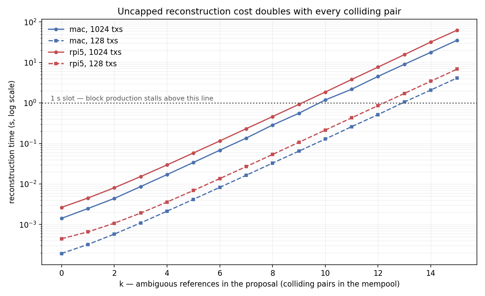

# Choosing `REFERENCE_PREFIX_LENGTH` from measurement

**Subject:** the reference prefix length for the compressed block proposal, [logos-lips#389].
**Question:** is 16 bytes too conservative, and what does the measured data say the parameter should be?
**Answer in one line:** the data rules out 8, 10 and 12 outright; **14 is defensible but thin, 16 is comfortable, and the difference costs 2 KB** — so 16 is recommended as insurance, not because 14 is broken.

> **Where this is a measurement and where it is a judgement.** That 8, 10 and 12
> fail is not a judgement call: at those lengths a *day* of sustained disruption
> costs between $0.07 and $4,554. The choice between **14 and 16 is a
> judgement**, and the report says so rather than dressing it up — see
> [§8](#8-recommendation). The reviewer's instinct that 16 looks conservative is
> not wrong; the argument for 16 is about margin over the parameter's lifetime,
> not about 14 being exploitable today.

Everything below is measured against the real `logos-blockchain` code at commit
[`40e76c8`], not a model of it. The benchmark suite is in
[`tools/benchmarks/reference-prefix`](../../tools/benchmarks/reference-prefix/),
and every number in this report can be re-derived by running it.

> **Status of the RPi5 columns.** macOS (Apple M3) is the development baseline
> and is complete. The Raspberry Pi 5 is the target validator class and its
> numbers are what the recommendation must ultimately rest on; those cells are
> marked **_(pending)_** and are filled by running the identical suite on the
> Pi. The conclusion below is stated in a form that the RPi5 data can only
> **strengthen**, because the Pi is slower than the M3 on the defending side —
> see [what the RPi5 data will change](#what-the-rpi5-data-will-change).

---

## 0. What the review asked for, and where it is answered

| Review point | Where | Status |
|---|---|---|
| "Set a threat model and start the analysis from there" | [§1](#1-threat-model) | Done — stated before any measurement, with generation and propagation priced separately |
| Hansie's mempool flood reached ~0.3 tx/s | [§1b](#1b-propagation-and-why-hansies-03-txs-does-not-bound-this) | Addressed directly: the attack needs **20 transactions**, not volume, so 0.3 tx/s is ~67 seconds of injection, not a bound |
| "How many valid transactions we can generate locally per second on a single core" | [§4](#4-candidate-generation-rate-r_gen) | Measured: **6.19 × 10⁶ /s** on one M3 core, via the real encode + Blake2b path |
| "How many cores (or GPUs) one needs to make the reconstruction fail" | [§7](#how-much-hardware-in-the-units-the-question-was-asked-in) | Table in cores and GPUs, against a 1-hour and 1-day deadline |
| "Show how reconstruction time grows on a single machine with the number of colliding transactions" | [§6](#6-reconstruction-latency--the-defenders-side) | Measured curve + plot, k = 0…15, at two block sizes |
| "Hard stop when we define the max number of permutations" | [§6](#the-two-policies-differ-in-failure-mode-not-in-whether-they-fail) | Both policies measured; the merged cap refuses at **k = 6** |
| "…or the reconstruction time exceeds the block production time on a single machine (RPi5)" | [§6](#6-reconstruction-latency--the-defenders-side) | Slot = 1 s; M3 crosses at **k = 10**. **RPi5 run outstanding** |
| "The decision is too cautious" | [§8](#8-recommendation) | Partly conceded: L ≤ 12 is ruled out by measurement, but 14-vs-16 is a judgement about margin, not a demonstration that 14 is broken |

---

## 1. Threat model

Two costs set this parameter and they must be priced separately, because they
differ by many orders of magnitude and only one of them is a real bound.

### 1a. Generation — the cost that sets the prefix length

An adversary grinds candidate transactions locally and computes
`prefix(mantle_txhash(tx), L)` for each. This is **offline** and needs no
signature, proof, network, or stake, because of a specific property of the hash:

```rust
// core/src/mantle/transactions/mantle_tx.rs
impl Hashable for RawMantleTx {
    const HASHER: hashable::Hasher<Self> = |tx| {
        let bytes: [u8; 32] = Hasher::digest(tx.as_signing()).into();
        TxHash::from(bytes)
    };
    fn as_signing(&self) -> Vec<u8> {
        let mut buffer = MANTLE_TX_HASH_V1_BYTES.to_vec();  // b"MANTLE_TXHASH_V1"
        buffer.extend(self.encode());                        // the MantleTx only
        buffer
    }
}
```

`mantle_txhash` covers the `MantleTx` and **not** the `op_proofs`. So the cost
of one candidate is *encode + Blake2b-256* — no cryptography beyond a hash.
Measured below at **6.19 × 10⁶ candidates/s on a single M3 core**, which is
within 3% of the machine's raw Blake2b rate. Grinding candidates *is* hashing.

The relevant event is a **birthday self-collision**: any two of the adversary's
own candidates sharing a prefix. They need no fixed target, so this costs
≈ 2^(b/2), not the ≈ 2^b of a targeted match. This is the quantity that governs
`L`, and [§3](#3-the-birthday-model-is-measured-not-assumed) measures that the
model is correct rather than assuming it.

### 1b. Propagation, and why Hansie's 0.3 tx/s does not bound this

Hansie's mempool-flood experiment reached **~0.3 tx/s**, and it is reasonable to
ask whether that already caps the attack. It does not, and the reason is the
single most important structural point in this report.

**The attack does not need volume. It needs 20 specific transactions.**

Grinding is offline. To manufacture k = 10 colliding pairs at L = 16 the
adversary hashes ~10¹⁹ candidates — but they never transmit them. They discard
every candidate except the ones that collide, and what has to reach a mempool is
just **2 transactions per pair, 20 in total**. The 10¹⁹ figure is a *local
compute* cost; the propagation requirement is 20 transactions of ~76 bytes.

Put the two rates side by side and the mismatch is the point:

| quantity | rate | what it applies to |
|---|---|---|
| candidate generation | 6.19 × 10⁶ /s (one core) | ~10¹⁹ candidates, never transmitted |
| mempool ingest (Hansie) | ~0.3 tx/s | **20** transactions |

At 0.3 tx/s, injecting those 20 transactions from a **single** node takes
**~67 seconds**. That is not a barrier — it is comfortably inside any mempool
retention window, and it has to happen once per stalled slot, not once per
candidate.

For a *sustained* stall the arithmetic is barely worse. Holding a stall open
needs k = 10 pairs per 1-second slot, i.e. 20 tx/s of injection. At 0.3 tx/s per
node that is **~67 nodes** — a trivial number of rented VMs, and an adversary
who can afford the grinding cost in [§5](#5-the-cost-of-manufacturing-a-collision)
can certainly afford 67 VMs.

So 0.3 tx/s is a real measurement of one node under one set of conditions, but
it composes into nothing: it is a *per-node* figure against an adversary who
parallelises across nodes, applied to a payload of 20 transactions rather than
to the grinding. **Generation is the binding constraint, and this report prices
it on its own.** Propagation only ever makes the attack easier than generation
alone implies.

### 1c. Success condition

Cause reconstruction ambiguity on an **honest** proposal: place two
transactions sharing a referenced prefix into a validator's mempool, so one
reference resolves to two candidates. Then scale it until the validator either

* exceeds the block-production interval (the slot) while searching, or
* trips a cap and drops the honest proposal outright.

Both are liveness failures. Neither is a safety failure: `header.block_root`
commits to the **full** 32-byte hashes, so a wrong resolution cannot be accepted
as a valid block — it can only waste time or fail.

### 1d. A colliding pair is spent after one slot

This mechanic matters more than anything else in the cost model, and it is easy
to miss.

A self-collision gives the adversary two transactions, A and B, sharing a
prefix. Both go into mempools. The reference only becomes ambiguous once an
honest proposer includes **one of them** in a block — a reference is just a
prefix, so ambiguity requires that prefix to be *referenced*. Say the proposer
includes A. The reference now matches both A and B, and reconstruction has two
candidates to try.

But once that block is applied, **A is removed from the mempool**. B is left
alone, and every later reference to B resolves to exactly one transaction. The
pair is consumed.

So `k` colliding pairs buy **one stalled slot**, not a stalled chain. Holding a
stall open across `N` slots needs `k · N` pairs. Cost still grows only as the
square root of the total — bulk collisions are discounted — but at a 1-second
slot the discount does not keep up, and this is what separates "annoying" from
"unaffordable" at the lengths in question ([§7](#7-decision-table)).

The adversary must also get those transactions *selected* by the proposer,
paying fees and competing for block space. That is a further linear overhead,
and it is deliberately left unpriced so the generation bound stands unaided.

---

## 2. What the code actually does

Four facts from the implementation shape everything that follows.

**The hash is Blake2b-256** (`core/src/crypto.rs`: `pub type Hasher = blake2::Blake2b<U32>`).

**The merged implementation is at 8 bytes, not 16.**

```rust
// core/src/mantle/transactions/hash.rs
const REFERENCE_PREFIX_BYTES: usize = 8;
```

The specification PR argues for 16; the code on `master` is at 8. That gap is
the single most urgent finding here, because [§5](#5-the-cost-of-manufacturing-a-collision)
prices an 8-byte prefix at **under a second of GPU time** per colliding pair.

**Reconstruction is a cartesian-product search.** From
`services/chain/chain-network/src/lib.rs`:

```rust
candidates
    .into_iter()
    .multi_cartesian_product()
    .find_map(try_rebuild_with_txs)
    .ok_or(Error::NoMatchingReconstruction)
```

with two caps applied before the search starts:

```rust
// core/src/block/mod.rs
pub const MAX_CANDIDATES_PER_REFERENCE: usize = 8;
pub const MAX_RECONSTRUCTION_COMBINATIONS: usize = 32;
```

Note that #389 v3 argues these can be **deleted**, on the grounds that at 16
bytes ambiguity cannot be manufactured at all. Both policies are measured
separately in [§6](#6-reconstruction-latency-the-defenders-side).

**Each combination re-hashes the whole block.** `Block::reconstruct` validates
the size of every transaction and then recomputes the Merkle root, and
`calculate_block_root` hashes every transaction from scratch on every call:

```rust
// core/src/utils/merkle.rs
let mut leaves: Vec<_> = transactions.iter().map(Hashable::hash).collect();
```

So per-combination cost is O(n) in the block's transaction count, not O(1).
This is why the defender's curve is so much steeper than the attacker's.

**The slot is 1 second** (`DEFAULT_SLOT_TIME_IN_SECS = 1`, matching
`slot_duration: '1.000000000'` in the standalone deployment config). That is
the deadline reconstruction must fit inside.

---

## 3. The birthday model is measured, not assumed

The whole parameter choice rests on the claim that *any* two colliding
candidates cost ≈ 2^(b/2). Rather than assert it, the harness grinds real
`mantle_txhash` output at prefix lengths short enough to collide in seconds and
compares the observed count against the prediction
sqrt(π/2) · 2^(b/2) ≈ 1.2533 · 2^(b/2).

**mac** — 24 trials per row:

| prefix | b (bits) | predicted N | measured N | ratio ± SE |
|---|---|---|---|---|
| 2 B | 16 | 321 | 349 | 1.088 ± 0.092 |
| 3 B | 24 | 5,134 | 4,948 | 0.964 ± 0.100 |
| 4 B | 32 | 82,137 | 84,013 | 1.023 ± 0.104 |
| 5 B | 40 | 1,314,195 | 1,104,775 | 0.841 ± 0.107 |

Every ratio is consistent with 1.0 within ~1.5 standard errors, across 24 bits
of doubling. The first-collision distribution is strongly right-skewed, so this
spread is expected; the standard error is what matters, and it is reported
rather than hidden. **The 2^(b/2) model holds on real transaction hashes**, so
extrapolating to b = 64 and b = 128 needs only the grinding rate.

_(RPi5 rows: **_(pending)_** — the model is hardware-independent, so these are a
cross-check, not an input to the decision.)_

---

## 4. Candidate-generation rate (R_gen)

Three rates, because the difference between them is itself the point.

| machine | node path | attacker (patched) | raw Blake2b | aggregate (all cores) |
|---|---|---|---|---|
| **mac** (Apple M3, 4P+4E) | 2.42 × 10⁶ /s | **6.19 × 10⁶ /s** | 5.89 × 10⁶ /s | **3.34 × 10⁷ /s** (8 threads, 5.39×) |
| **rpi5** | _(pending)_ | _(pending)_ | _(pending)_ | _(pending)_ |

Sample transaction: the smallest valid `MantleTx` — a single `Transfer`, one
input, one output — **76 bytes encoded, 92 bytes hashed** including the
16-byte domain prefix. Larger transactions hash slightly slower, so this is the
adversary-favourable choice; at 92 bytes the preimage still fits in a single
Blake2b compression, so a 2× larger transaction would cost roughly 2×.

* **node path** builds the operation structure and reallocates per candidate —
  what a node does per transaction.
* **attacker (patched)** encodes once and overwrites only the varying bytes.
  This is the rate the security margin is computed from, because no adversary
  would do more work than this. `cargo test` asserts byte-for-byte that it
  produces the same hashes as the real path.
* **raw Blake2b** is the bare hash over a buffer of the same size, with no
  transaction work at all. The attacker path and the bare hash are within 3% of
  each other — indistinguishable at this measurement's precision. That is the
  substantive result: **grinding candidates is pure hashing**, the transaction
  machinery contributes nothing measurable once the encoding is hoisted out of
  the loop, and there is no software headroom left for a defender to rely on.

Aggregate scaling is **measured, not multiplied**: 8 threads on the M3 give
**5.39×**, not 8×, because four of those cores are efficiency cores. Assuming
linear scaling would have understated the time an adversary needs by about 48%
— in the direction that flatters the defender, which is the wrong way to be
wrong.

---

## 5. The cost of manufacturing a collision

Candidates needed for one colliding pair, and the wall-clock at each rate.
GPU column assumes an **RTX 4090 at 10¹⁰ H/s** — the figure #389 argues from,
and roughly 2× above published hashcat Blake2b throughput for a single 4090, so
deliberately generous to the attacker. Parallel collision search
(van Oorschot–Wiener) is memoryless and embarrassingly parallel, so aggregate
hash rate is the honest cost basis and a 100-GPU farm really is 100× faster.

| L (bytes) | b (bits) | candidates N | 1 core (mac) | 1 machine (mac) | 1 GPU (RTX 4090) | 100 GPUs |
|---|---|---|---|---|---|---|
| **8** | 64 | 5.38 × 10⁹ | 14.5 min | 2.9 min | **0.54 s** | 5 ms |
| **10** | 80 | 1.38 × 10¹² | 3 days | 12.5 h | 2.3 min | 1.4 s |
| **12** | 96 | 3.53 × 10¹⁴ | 659 days | 133 days | 9.8 h | 5.9 min |
| **14** | 112 | 9.03 × 10¹⁶ | 462 years | 93 years | 105 days | 25.1 h |
| **16** | 128 | 2.31 × 10¹⁹ | 118,000 years | 23,800 years | **73 years** | 268 days |

_(RPi5 columns are omitted deliberately: an adversary is not going to grind on a
Pi. Pricing the generating side with strong hardware is the conservative
direction, and the RPi5's role in this report is as the **defender**.)_

### Consistency with #389

#389 states 16 bytes gives "about 58 years on one GPU at 10¹⁰ H/s, ~214 days
against a 100× adversary". Those are 2^64 / rate exactly. This report gets
**73 years** and **268 days** because it includes the sqrt(π/2) ≈ 1.2533 factor
in the expected first-collision count — validated empirically in §3.

**This is a refinement in the safe direction, not a contradiction**: #389's
figures are ~22% *lower* than the corrected ones, i.e. #389 slightly
understates the attacker's cost. No revision to #389's conclusion is needed, but
if those two numbers are quoted anywhere normative they should become 73 years
and 268 days.

---

## 6. Reconstruction latency — the defender's side

This is where the asymmetry lives. Manufacturing `k` colliding pairs costs the
attacker only ~sqrt(k) times one pair, because collisions accumulate as N²/2^(b+1)
as the search runs. An **uncapped** validator must walk ∏|Cᵢ| = 2^k combinations,
each of which re-encodes and re-hashes every transaction in the block.



**mac** (Apple M3), full block of 1024 transactions, uncapped policy:

| k | combinations | median | vs. 1 s slot |
|---|---|---|---|
| 0 | 1 | 1.4 ms | within |
| 4 | 16 | 17 ms | within |
| 6 | 64 | 68 ms | within |
| 8 | 256 | 286 ms | within |
| 9 | 512 | 559 ms | within |
| **10** | **1,024** | **1.19 s** | **over slot** |
| 12 | 4,096 | 4.5 s | over slot |
| 15 | 32,768 | 35.5 s | over slot |

Per-combination cost ≈ **1.2 ms** at n = 1024 and ≈ **190 µs** at n = 128,
scaling with block size as the O(n) re-hash predicts. A 128-transaction block
crosses the slot at k = 13 instead of k = 10. Note what the k = 0 row means in
isolation: with no ambiguity at all, reconstruction costs 1.4 ms against a
1,000 ms budget, so normal operation has roughly **700× of headroom**. The
entire risk is in how fast that headroom is consumed — one doubling per
colliding pair.

**rpi5**: **_(pending)_** — paste the `results/rpi5/reconstruction.csv` rows here.
Expect the crossover at a **lower** k, since the per-combination cost is higher.

### The two policies differ in failure mode, not in whether they fail

| | uncapped (#389 v3) | capped (merged today) |
|---|---|---|
| k ≤ 5 | searches, ≤ 34 ms | identical — searches |
| k ≥ 6 | searches, cost doubles per k | **refuses instantly**, drops the proposal |
| failure at scale | slot overrun → block production stalls | honest proposal discarded → block lost |

The caps bound CPU cost but do not remove the liveness failure — they convert a
slow reconstruction into a dropped honest block, and they do so at **k = 6**,
which is *cheaper for the attacker* than the k = 10 needed to stall the M3.
So the caps do not soften the requirement on `L`; if anything they tighten it.

Either way the conclusion is the same: **`L` must be large enough that
manufacturing ~6–10 collisions is infeasible.** That requirement is robust to
which policy ships, which is what makes it a sound basis for the parameter.

---

## 7. Decision table

Cost to manufacture enough colliding pairs to break one validator, at
$0.50/GPU-hour on the RTX 4090 assumption above. `k` is taken from the measured
crossover in §6; the sqrt(k) scaling means the choice of `k` moves these numbers
far less than the choice of `L` does.

| L (bytes) | proposal max | vs. master | GPU-hours, 1 pair | $ for 1 pair | $ to stall **mac** (k=10) | $ to stall **rpi5** | pairs $10k buys |
|---|---|---|---|---|---|---|---|
| **8** | 8,555 B | 3.87× | ~0 | <$0.01 | **<$0.01** | _(pending)_ | 1.8 × 10¹⁶ |
| **10** | 10,603 B | 3.12× | 0.04 | $0.02 | **$0.06** | _(pending)_ | 2.7 × 10¹¹ |
| **12** | 12,651 B | 2.62× | 9.8 | $4.90 | **$15.49** | _(pending)_ | 4.2 × 10⁶ |
| **14** | 14,699 B | 2.25× | 2,509 | $1,254 | **$3,966** | _(pending)_ | **64** |
| **16** | 16,747 B | 1.98× | 642,210 | $321,105 | **$1.0M** | _(pending)_ | **0.001 — not even one** |

The last column is the clearest statement of the single-event margin: how many
colliding pairs a $10,000 adversary can afford, against the **10** they need.
L = 16 is the first row where a serious budget cannot buy even a single
collision; L = 14 is the last row where it buys six times more than one stalled
slot requires.

### How much hardware, in the units the question was asked in

Cost in dollars is one way to read the margin; "how many machines do I need to
point at this" is the other, and it is the one the review asked for. To
manufacture the k = 10 pairs that stall one slot, within a fixed deadline:

| L (bytes) | GPUs in 1 hour | GPUs in 1 day | cores in 1 hour | cores in 1 day |
|---|---|---|---|---|
| **8** | <1 | <1 | <1 | <1 |
| **10** | <1 | <1 | 195 | 8 |
| **12** | 31 | **1** | 50,040 | 2,085 |
| **14** | 7,933 | **331** | 1.3 × 10⁷ | 533,758 |
| **16** | 2.0 × 10⁶ | **84,619** | 3.3 × 10⁹ | 1.4 × 10⁸ |

Read the "GPUs in 1 day" column as the headline. At L = 12 **one** GPU does it
overnight. At L = 14 it takes a **331-GPU** farm — large, but a real datacentre
rents that. At L = 16 it takes **84,619 GPUs**, which is not a rental, it is a
hyperscaler.

Core counts assume the measured 6.19 × 10⁶ candidates/s per M3 core; they are
included because the review asked in cores, though no serious adversary would
grind Blake2b on CPUs when GPUs are ~1,600× more cost-effective per hash here.

### Sustaining the stall is the number that decides it

Because a pair is spent after one slot ([§1d](#1d-a-colliding-pair-is-spent-after-one-slot)),
the honest question is not "what does one missed slot cost" but "what does
holding the chain down cost". At k = 10 pairs per slot and 1-second slots:

| L (bytes) | one slot | one hour | one day |
|---|---|---|---|
| **8** | <$0.01 | $0.01 | **$0.07** |
| **10** | $0.06 | $3.63 | **$17.79** |
| **12** | $15.49 | $929.65 | **$4,554** |
| **14** | $3,966 | $237,990 | **$1.2M** |
| **16** | $1.0M | $60.9M | **$298.5M** |

This table is what makes 8, 10 and 12 indefensible and it is not a close call:
**a full day of stalled block production costs seven cents at L = 8** and under
$5,000 at L = 12. It is also the table that makes L = 14 arguable — $1.2M/day is
a genuine deterrent, and anyone claiming 14 is broken has to explain away that
figure.

What L = 14 does *not* survive well is the one-off case: $3,966 to burn a slot
network-wide is cheap enough for intermittent griefing, and unlike the sustained
case it does not benefit the defender that pairs are consumed.

Two independent checks that the size column is right: at L = 8 it reproduces
**8,555 bytes**, the value pinned in the implementation's own
`maximum_proposal_matches_the_specified_size` test; at L = 16 it reproduces
**16,747 bytes**, the figure in #389. The compression ratio is against master's
33,129-byte fixed proposal.

### What the RPi5 data will change

The pending cells move the argument in one direction only. The RPi5's
per-combination cost is higher than the M3's, so its slot crossover `k` is
**lower**, so the `$ to stall rpi5` column will be **lower** than the mac
column at every `L` — the attack gets *cheaper*, never dearer. The RPi5 data can
therefore strengthen the case for a longer prefix but cannot weaken it. The
recommendation below is safe to act on now and should be re-checked, not
re-derived, once the Pi numbers land.

---

## 8. Recommendation

**Recommended: `REFERENCE_PREFIX_LENGTH = 16`. Required regardless: raise the
implementation off 8.** These are two different strengths of claim and should
not be conflated.

**What the data proves.** L ≤ 12 is indefensible, and not marginally so. A full
day of stalled block production costs **$0.07 at L = 8** — the value merged
today — **$17.79 at L = 10, and $4,554 at L = 12**. No assumption in this report
has to hold very tightly for those to be disqualifying; they would survive a GPU
rate ten times slower and a price ten times higher.

**What the data leaves open.** The choice between 14 and 16 is a judgement, and
the measurements do not settle it:

* At **L = 14** a one-off network-wide missed slot costs ~$4k, but *sustaining*
  the stall costs **$1.2M/day**. That is a real deterrent. Anyone arguing 14 is
  broken has to get past that number, and it cannot be done with this data.
* At **L = 16** even a single missed slot costs ~$1M, and one colliding pair is
  73 GPU-years.

So the case for 16 rests on three things that are about *margin*, not
exploitability:

1. **Assumption risk.** The whole table pivots on one unmeasured input, the GPU
   hash rate. At 14 the one-off cost is a few thousand dollars, so a factor of a
   few in that assumption moves it across the line that matters. At 16 a factor
   of a few changes nothing.
2. **Lifetime.** This is a consensus constant that will outlive several hardware
   generations. Every 4× in hash rate divides the attacker's cost by four; L = 14
   spends its margin against hardware that does not exist yet, L = 16 does not.
3. **Asymmetric cost of being wrong.** Shortening `L` later is a clean parameter
   change. Lengthening it after mainnet is a breaking wire-format change made
   under adversarial pressure.

**And the price of that margin is small:** 16,747 bytes versus 14,699 — **2 KB
on the maximum proposal**, still a 1.98× reduction against master's 33,129. Two
kilobytes is cheap insurance against re-litigating this every time GPUs get
faster.

### On "16 is too conservative"

The reviewer is right that the *targeted* 2^128 framing overstates the threat,
and right that 14 is not absurd — this report should not be read as saying
otherwise. Where the disagreement actually lands is on how much margin a
consensus constant deserves when the margin costs 2 KB and the downside is a
breaking change under pressure.

If the team prefers 14, that is a defensible position and this data supports it
against a *sustained* adversary. It should then be adopted deliberately, with
the one-off griefing cost (~$4k per burned slot) and the hardware-lifetime
exposure written down as accepted risks, rather than arrived at by treating 16
as merely over-cautious.

### Action items

1. **Raise `REFERENCE_PREFIX_BYTES` from 8 to 16** in
   `core/src/mantle/transactions/hash.rs`. The merged implementation is
   currently at the one value this analysis rules out outright. This is the
   highest-priority item in this report.
2. **Correct the two figures in #389** from 58 years / 214 days to **73 years /
   268 days** (§5). Same conclusion, arithmetic that survives review.
3. **Decide the cap question explicitly.** #389 v3 deletes
   `MAX_RECONSTRUCTION_COMBINATIONS` and `MAX_CANDIDATES_PER_REFERENCE`; they are
   still in the merged code. At L = 16 either is defensible, but the spec and the
   implementation should not disagree about which. Note that keeping the caps
   means a `k = 6` collision set drops honest proposals, which is *cheaper* to
   provoke than the `k = 10` stall — so if they stay, they should be documented
   as a liveness trade rather than a DoS defence.
4. **Re-run on the RPi5** and fill the pending columns before this is treated as
   final.

---

## Appendix — reproducing this

```bash
cd tools/benchmarks/reference-prefix
./scripts/run_all.sh mac      # or: rpi5
python3 scripts/analyse.py    # regenerates every table and the figure above
```

Assumptions, all changeable at the top of `scripts/analyse.py`: GPU model and
hash rate (`RTX 4090`, 10¹⁰ H/s), GPU price ($0.50/hour), and the proposal
layout constants. Hardware and toolchain for each run are recorded in
`results/<machine>/machine.txt` and `toolchain.txt`.

Measured on: Apple M3, 8 cores (4P + 4E), 16 GB, macOS 25.3.0, rustc 1.97.1.

[logos-lips#389]: https://github.com/logos-co/logos-lips/pull/389
[`40e76c8`]: https://github.com/logos-blockchain/logos-blockchain/commit/40e76c8e32934f14c3370621db9bda9f14d50dc7
