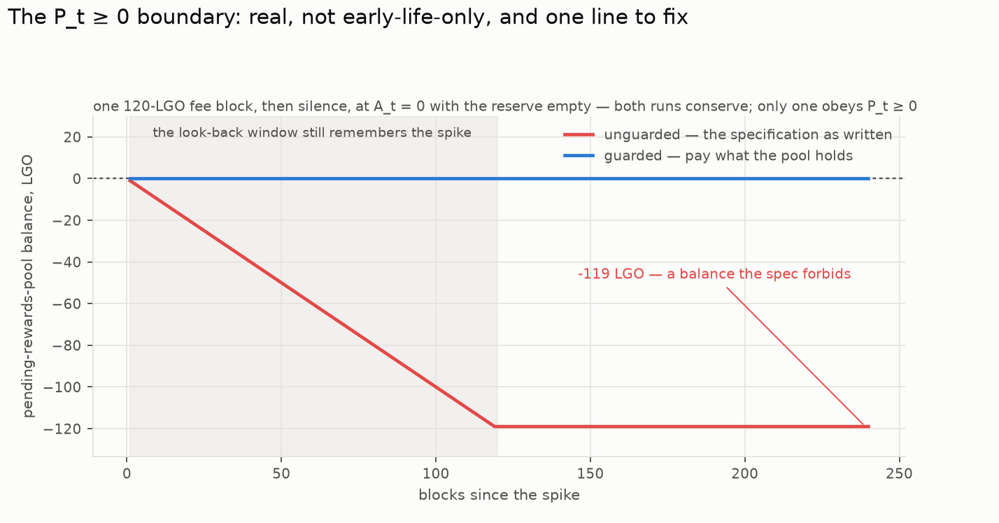

# Outstanding items owed upstream — prepared, awaiting a go

Things this workstream has an answer for that belong in somebody else's document.
Each entry is written so it can be posted without redoing the work: the question, the answer,
the evidence, and where the code is. Items are marked **SENT** with their link once posted;
posting is outward-facing and happens only on the design owner's explicit go (items 1–3 were
authorised and posted 2026-08-31).

*Last verified 2026-08-31 against **merged master** (`6aaa6db`, PR 375 merged 2026-08-26) and the EmPoWering RFC branch (PR 400, unchanged). PR 375's merge retargets items 1, 2 and 3: they are now findings against master, for a follow-up issue or PR rather than PR-375 review.*

---

## 1. The `P_t ≥ 0` boundary — asked in PR 375's review, merged unanswered

> **SENT 2026-08-31**: https://github.com/logos-co/logos-lips/issues/432

**Status 2026-08-31: PR 375 merged with the constraint exactly as it was** — merged master's
Pool Accounting still says only "The pool is redistributable, subject to `P_t ≥ 0`", with no
mechanism delivering it. The open question below is now a gap in the *merged* specification,
and the answer belongs in a follow-up issue or PR against master.

### What they asked

PR 375's own "Risks and open questions" leaves one item for reviewers:

> the pool balance constraint `P_t ≥ 0` is stated but the early-life regime where `R̄_t`
> exceeds cumulative inflows deserves an explicit boundary treatment during review.

### The short answer

**The regime is real rather than hypothetical, it is not confined to early life, and one line
fixes it: clip the distribution to what the pool actually holds.**

### Why it happens

The recycled term distributes `(1 − A_t) · R̄_t`, where `R̄_t` is the average pooled fee over
the look-back window `T`. The average is over the *window*, but the pool only ever received
the *actual* fees. So after any burst of fees followed by quiet, the window still remembers the
burst and keeps paying against it while nothing is coming in. The pool pays out history it
never banked.

Nothing about this is specific to genesis. It needs only a fee spike, then quiet, with `A_t`
low enough that the recycled term is carrying the reward — which is exactly the mature,
at-target regime the design aims for. Early life is where it is *most likely*, not where it is
*confined*.

### Measured

*Regenerate: `cd tools/simulators/empowering/strategies && PYTHONPATH=src python3 -m empowering_sim.plots_emission --out ../../../../reports/empowering/figures`*

One 120-LGO block, then 240 quiet ones, at `A_t = 0`, reserve empty:

| | worst pool balance | final | conserves? |
| --- | --- | --- | --- |
| unguarded (the spec as written) | **−119.00 LGO** | −119.00 | yes |
| guarded (the proposal below) | **0.00 LGO** | 0.00 | yes |

The guard binds for **119 blocks** — one block short of the window — and then releases on its
own as the spike rolls out of the look-back. It is self-clearing; no operator action, no state.

### The proposed treatment

| `distribution_t = min( (1 − A_t) · R̄_t ,  P_{t−1} + R_block,t )` |
| --- |

Pay what the pool holds, never more. Three properties, all measured:

- **`P_t ≥ 0` holds by construction**, which is what the specification already asserts and
  currently has no mechanism to deliver.
- **Conservation is untouched.** `ΔS + ΔP + ΔB = 0` still closes exactly, because the clip
  moves a payment rather than destroying one.
- **Nothing is lost, only deferred.** The tokens stay in the pool and are distributed once the
  window reflects reality again.

### The point worth making in the review

**Conservation and `P_t ≥ 0` are independent claims, and the RFC's conservation argument does
not imply the constraint.** The unguarded run above conserves perfectly while sitting at
−119 LGO — a state the specification forbids. Anyone checking the conservation algebra and
concluding the pool is safe has checked the wrong thing. That is worth saying explicitly,
because the conservation argument is the part of PR 375 reviewers were asked to scrutinise.

### Provenance

`empowering_sim.emission.Stocks` implements both readings behind `guard_pool`. The gates are
in `empowering_sim.validate`, `gate_emission`:

- `unguarded, the early-life pool balance goes NEGATIVE after a spike`
- `guarded, the distribution clips to the pool and the balance floors at zero`

Reproduce with `cd tools/simulators/empowering/strategies && PYTHONPATH=src python3 -m empowering_sim.validate`.

*(Note for whoever posts this: it is the same move the de-novo engine's room cap already makes
— admit while the pool can pay, stop when it cannot. Worth mentioning only if the reviewer
wants precedent; it is not an argument on its own.)*

---

## 2. The `POW_SHARE` carve-out, acknowledged as a pool outflow

> **SENT 2026-08-31** as a PR 400 review comment:
> https://github.com/logos-co/logos-lips/pull/400#issuecomment-5478663427

### What is needed

**Status 2026-08-31: unchanged by the merge** — merged master's `storage-markets.md` still
routes each fee "in full" (its Fee Routing subsection, verified at line 99) and the
`R_block` decomposition still has no proof-of-work term, so the contradiction now sits
between two *merged* documents once the EmPoWering RFC lands.

One sentence, now against master. `storage-markets.md`'s Fee Routing subsection and
`execution-market.md`'s closing derivation both say fees route into the pending rewards pool
**"in full"**, and the decomposition `R_block = R̂_STR + R̂_pooled` has no proof-of-work term.
EmPoWering diverts `POW_SHARE` (10%). As written, the two specifications contradict each other
the day the EmPoWering RFC joins the already-merged routing text.

### What was decided here

**2026-08-24, design owner: the pool's routing stands and EmPoWering carves its share out of
the pooled flow** — the pool's *first outflow*, not an interception ahead of it. So "in full"
stays literally true and nothing in PR 375's arithmetic changes; what it needs is an
acknowledgement that the pool has an outflow the decomposition does not currently name.

Recorded with its accounting consequences as contradiction 4.13
(`tools/simulators/empowering/strategies/docs/CONTRADICTIONS.md`). Implemented in
`emission.pooled_inflow_lgo`, gated, and costed: identical at `A_t = 1` where every published
figure sits, 0.0005% near target, and exactly `1/(1 − pow_share)` only in the genesis-seed
transient.

---

## 3. The integer reference's "Rederivation required" flag was removed without the rederivation

> **SENT 2026-08-31**: https://github.com/logos-co/logos-lips/issues/433

### What happened

At the head this workstream pinned (`2b3b698`), PR 375's integer section carried an honest
callout: the derivation and reference implementation were written for the old single-block
recycled term, and rederivation against the windowed rule was required. A pre-merge commit on
2026-08-25 — *"removing 'rederivation required'"* — deleted the callout, rewrote the block
around `int64`, renamed the window to `pooled_fees_window`… and **left `last_pooled_fee` in
the recycled term**. PR 375 then merged (2026-08-26, `6aaa6db`).

### The consequence

Merged master now contains two reference implementations of the block reward that disagree —
equation (1) and its Python reference distribute the windowed average `R̄_t`; the
consensus-level integer reference distributes the latest block's fee — **with no flag between
them**. Before the merge this was a known gap with a warning attached; after it, an
implementer reading only the integer section ships the single-block rule believing it final.

### Measured

The two rules differ wherever fees vary within the look-back hour and `A_t < 1`. The
strategy simulator implements both and pins the divergence with a parity gate: a lone 12-LGO
block in an otherwise quiet window distributes **0.1 LGO** under the windowed rule against
**12 LGO** under the integer reference's — a factor of 120, the full window length. (At flat
fees the rules coincide, which is why no figure in these studies moves either way.)

### The ask

Apply the rederivation the removed callout prescribed: replace the recycled term's
`last_pooled_fee` with the window sum over `T` (already accumulated for the pooling-rate KPI)
divided by `T`, and update the worked integer example. Until then, restore the callout — a
known divergence with a warning is a defect; the same divergence unflagged is a trap.

### Provenance

`empowering_sim.emission` carries both forms (`block_reward_lgo`, windowed, and
`block_reward_lgo_single_block`, the integer reference's) with the parity gate in
`empowering_sim.validate`. Recorded as contradiction 4.12.

---

## 4. The reward retarget has an absorbing zero — for PR 400 review

### What it is

`compute_new_reward_difficulty`'s integer form clamps its output above (at `p − 1`) but has
**no floor**. From a target of 1 under a full block of claims the map returns 0 — and 0 maps
to 0 under any load, forever. At target 0 the win probability is `target/p = 0`: no claim can
ever land again, and no claim landing is exactly the condition that keeps the target at 0.
The claim flow is dead permanently, with no recovery path inside the mechanism.

### Measured

| input | output |
| --- | --- |
| `next(target=1, claims=1024)` | **0** |
| `next(target=0, claims=0)` | 0 |
| `next(target=0, claims=1024)` | 0 — absorbing |

**Reachability, stated honestly.** No attacker walks this down from a healthy chain. Each
maximum-load block divides the threshold by ~11.14 — but filling the *next* block at the new,
~11× harder threshold demands ~11× more hashrate, so the ~65-step walk from a realistic
threshold to 1 needs roughly 11⁶⁵-fold power escalation. Physics forbids that path. The risk
is different in kind: **the map has a cliff with no fence**, so any road to a tiny threshold —
a mis-seeded genesis value, a small deployment whose equilibrium sits low, an integer bug
writing the target once — ends in permanent, unrecoverable death of the claim flow. The
matching clamp already exists at the top (`min(…, p − 1)`); only the bottom is open.

**The near-miss behaviour is also asymmetric**, measured with the integer map itself: one
full block moves the threshold down ÷11.14, while recovery under silence eases at only ×10/9
per block — **23 quiet blocks to undo one overloaded one**. Not fatal, but the same missing
floor's gentler cousin, and worth a sentence in the same fix.

### The ask

One character's worth of specification: floor the update at 1 — `max(1, …)` — so the target
can always recover. The simulator mirrors the spec faithfully rather than hardening away from
it, and pins the absorbing state with a gate (`empowering_sim.validate`,
`gate_controller_fixed_point`) so the fix landing upstream moves a gate here.

### Where it belongs

The retarget lives in the EmPoWering RFC's mantle section (PR 400, still open) — this is a
review comment there, not a master issue.

---

## 5. The leader-incentive concern, if wanted

A reviewer on PR 375 (`block-rewards.md:262`) raised that pool retention when `A_t → 1` leaves
leaders uninterested in tips during the adoption phase. **Not answered — we have the machinery
to quantify it in the strategy simulator, and have not been asked to.** Listed so the question
is not mistaken for one nobody noticed.
