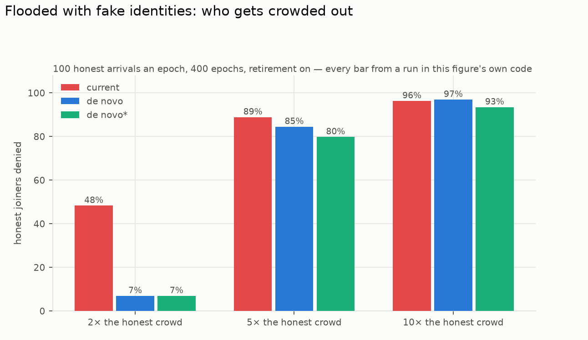
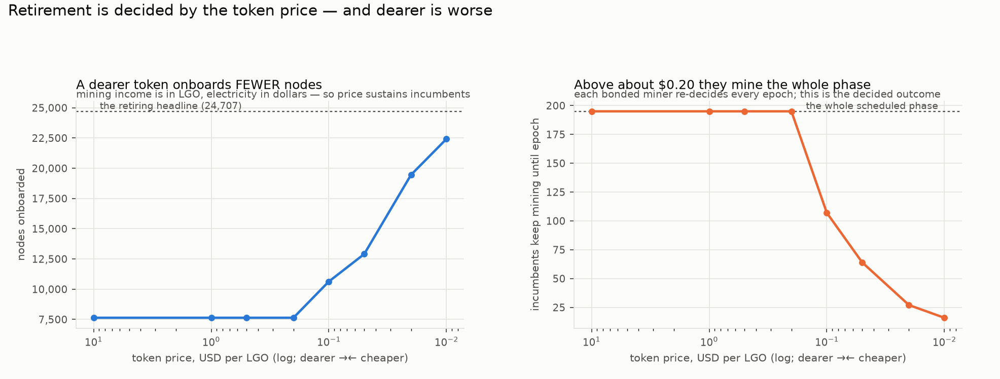

# EmPoWering — where the design stands, and what to do

**Read this first.** It states what the mechanism is for, what the three candidate designs do, what the simulations found, and what I would do. Everything here is measured; the supporting documents carry the workings.

### How to read this

Written to be read straight through in about ten minutes, with no background assumed. Every section opens with a short *plain-words* paragraph, so you can skim only those and still get the argument. Jargon is defined the first time it appears, and there is none you have to already know.

| if you have… | read |
| --- | --- |
| two minutes | §1 (what this is for) and §4 (what to do) |
| ten minutes | the whole of this document, in order |
| no appetite for arithmetic at all | `design-comparison.md` §0, which explains the choice in everyday terms |
| an implementation to write | `MODEL.md`, the exact rules |

**Three terms carry the whole document.** A **claim** is one piece of mining work, submitted and paid. The **bond** is the 1,000-token deposit that lets a node run a paid service — the finish line. An **epoch** is the accounting period, about five and a half days. Everything else is explained in place.

---

## 1. The job, in one paragraph

*In plain words: what problem is this solving at all?*

Somebody who owns no tokens should be able to join the network by doing computation, be paid for it, save enough to post the deposit that lets them run a paid service, and so become part of the system that secures it. Work, save, join. Proof of work is the on-ramp; proof of stake is the destination. The design question is how the tokens set aside for that on-ramp should be handed out.

## 2. The three designs

*In plain words: there are three candidates on the table, and they differ in one thing — how the money for the on-ramp is handed out. One pays a fixed number of prizes forever. One sets a budget per period and spends it on whoever shows up. The third is that second one with a safety catch added. This table is the whole comparison in six lines; everything after it is evidence.*

| | **current** | **de novo** | **de novo\*** |
| --- | --- | --- | --- |
| how the money is handed out | a fixed number of prizes per block, forever, at a price that decays geometrically | a per-epoch budget, spent on whoever turns up; a crowd is paid by borrowing against later epochs | the same, with a bound on how much the endowment may give up in one epoch |
| what is fixed | the claim rate and the outflow | the budget schedule and the reward's floor | the same, plus the borrow ceiling |
| parameters to defend | 3 | 3 | 4 |
| status | specified today | this branch's proposal | the proposal plus one mitigation |

The redesign's three parameters are the ones you can hold an opinion about — **how much money, how many nodes, over how long** — and a consistency identity checks the triple before anything runs. The current design's two rate constants (`distribution_rate`, `target_claims_per_block`) are the two nobody could defend without a simulation.

## 3. What the simulations found

*In plain words: the results. Each subsection takes one question — how many people get in, what the old design does badly, what the new one does badly, what happens under attack, and what happens after the money runs out — and answers it with measured numbers rather than argument. If you read one subsection, read §3.5: it is the finding that changes what you should expect from all three designs.*

Everything below is at the reference parameters (0.5% of TGE, 25,000 nodes, four years), a field of whole Raspberry Pi 5 boards, and both retirement regimes.

### 3.1 Onboarding

*In plain words: the headline question — how many newcomers actually make it in? The surprise is that all three designs land in roughly the same place, so this is **not** where the choice between them is made.*

| | current | de novo | de novo\* |
| --- | --- | --- | --- |
| nodes onboarded, **retiring** | 27,125 | 24,707 | 24,782 |
| nodes onboarded, **persistent** | 5,465 | 7,963 | 7,963 |
| a ×100 cohort's fate, retiring | door already shut | 100% bonded | 100% bonded |
| a ×100 cohort's fate, persistent | door already shut | 24% bonded | 24% bonded |
| bootstrap ends | never | epoch 196 | epoch 196 |

*All three columns at 130 arrivals an epoch over 360 epochs. The current design's familiar 25,934 / 5,682 is the same mechanism at 100/epoch over 400 — its own study's configuration — and quoting that pair here compared designs at different arrival rates.*

**All three onboard about the same number of nodes.** The redesign's advantage is not volume — it is that the number does not depend on *when* people arrive.

### 3.2 The three properties the current design has and the redesigns do not

*In plain words: three ways the current design punishes people for arriving at the wrong moment. They are all the same underlying fact seen from different angles — if the number of prizes is fixed, a bigger crowd just means a thinner slice each. This is the case against the current design.*

Measured in the strategy report's arrivals study, and absent from both redesigns:

- **A best adoption speed.** The number who get in is a hump — too few arrivals and the money goes unused, too many and nobody saves enough. The strategy report's §7 arrivals study (Poisson arrivals, 600 epochs, persistent regime, gated by that report's own number-gate) measures **951 / 6,145 / 5,001** elevated at 2 / 100 / 500 arrivals an epoch — the worst rate onboards about a sixth of the best. The comparison page's constant-arrival companion at 400 epochs reads 707 / 5,682 / 4,646 under persistence and 800 / 25,934 / 14,398 under retirement: same hump, two protocols, both gated. *(A 2026-08-31 revision wrongly called the §7 triple "carried, reproducible from no committed code" — the arrivals module had merged in from the simulator branch and reproduces it exactly; corrected same day. What was true then and remains true: the triple had been quoted regime-free, and it is the persistent regime's.)*
- **A closing door.** The last cohort with even odds of ever bonding arrives, in the §7 Poisson study, at **epoch 34 at a hundred arrivals an epoch** (479 at two, and at five hundred the door is shut from the start). The constant-arrival companion reads 286 / 40 / 3 at 10 / 100 / 250 under persistence and 399 / 251 / 77 under retirement. The door is real in both regimes and both protocols; it shuts early in the regime the incentives actually deliver, and the original quote gave only the persistent end.
- **A point of no return.** The waiting queue passes every bond the remaining money could ever fund — even in a perfect world. The §7 Poisson study reads **epoch 212** at a hundred arrivals an epoch (72 at five hundred); the constant-arrival companion reads 214 under persistence and 338 under retirement. Past it, most of the queue can never get in no matter what happens. The two protocols land two epochs apart at the reference rate, which is the agreement one wants between independent implementations of the same cliff.

All three are the same fact seen three ways: a fixed claim flow means a bigger crowd is a thinner slice each. Neither redesign has any of them, because the budget follows the people.

### 3.3 The whale — the redesigns' cost, and its remedy

*In plain words: the case **against** the redesign. Money that follows the crowd can be followed by the wrong person: one large, well-timed operator can take a great deal of the fund quickly. The old design prevents this by accident, simply by never handing out much at once. This section measures the damage and shows a cheap fix.*

| a 10× actor at its best moment (epoch 20) | current | de novo | de novo\* |
| --- | --- | --- | --- |
| endowment captured, realistic field | cannot be drained | **55%** | **9%** |
| against a homogeneous field (the bound) | cannot be drained | 89%, phase collapses to epoch 23 | — |
| capture at 3× / 100× | — | 33% / 56% | 9% / 9%, flat |

The current design cannot be drained by anyone, because its outflow is fixed — a genuine advantage, bought with precisely the rationing that gives it the closing door. `de novo*` recovers most of that protection by bounding what the endowment may give up per epoch *beyond* the scheduled amount, which converts instant extraction into extraction the demand index has time to reprice.

**A flat cap in budgets cannot work** and this is worth knowing: an honest ×100 cohort borrows about 97 budgets, which is already half the endowment, so any cap loose enough to admit the crowd R5 protects admits the whale too. The workable form is a fraction of what remains.

**What `de novo*` costs:** one parameter with no natural value, a softening of "pays until exhausted" within an epoch, and — *only in the retiring regime* — a 37% longer wait for spike cohorts (43 epochs to 59). **Under the persistent regime it costs nothing measurable at all.**

### 3.4 Attacks, all three designs

*In plain words: what happens when someone actively tries to break or game each design, rather than just arriving at an awkward time. The good news is that the redesign's most obvious new weakness turns out not to work.*

| | current | de novo | de novo\* |
| --- | --- | --- | --- |
| withholding to inflate the reward | impossible — the reward ignores demand | **loses money below half the field**: 0.64× at 10%, 0.96× at 50% under the strongest simple pattern. A supermajority reaches only **parity** (1.02×) once the window covers the phase | same |
| harvesting a participation cycle | no cycle exists | unprofitable (0.02–0.86×), but the cycle is real and easy to trigger | same |
| flooded with fake identities, 2× the honest crowd | **48.4% of honest joiners denied** | **4.3%** | 4.8% |
| the same flood, 10× | 96.3% | 94.5% | 93.4% |

Two things stand out. The redesigns' one new weakness — setting the price from last period's demand invites someone to fake that demand — **closes by measurement**, and the defence is an accident: the reward cap written so that genesis could not hand one claim the whole sub-pool also bounds what a shrunk denominator can buy. And against a moderate flood of fake identities the redesigns are an **order of magnitude** more resistant, because a fixed flow halves every share while a budget just converts faster.

### 3.5 The finding that applies to all three, and matters most

*In plain words: the most important result here, and it is bad news for every design equally. All three quote their headline numbers assuming that once someone has joined, they stop competing for the prizes and leave room for newcomers. Nothing pays anyone to do that, and joining does not switch their computer off. So the realistic expectation is about a third of the advertised number — for all three.*

**Nothing pays a bonded miner to stop mining.** Both designs quote their headline numbers assuming they do. A bonded node can run its service *and* keep mining on the same hardware, and the marginal claim is profitable unless a token is worth less than $0.0001.

Measured in this mechanism, retirement is not one number at two values but two different shapes:

| arrivals an epoch | 65 | 130 | 260 |
| --- | --- | --- | --- |
| **persistent** (nobody retires) | 13.9% | 15.9% | 14.6% — flat |
| **retiring** | 24.9% | 49.4% | 74.1% — rises with the rate |

And the arithmetic of why nobody retires: **it costs the individual 6.2% of their income and buys the network 4.5× more onboarding.** A collective-action problem in textbook form.

**This is no longer an assumption.** Retirement was two flags the modeller set; it is now a decision each bonded miner re-makes every epoch, comparing what the epoch pays against what the grinding costs — including the dividend from suppressing the on-ramp, since the endowment is finite and every 1,000 LGO mined is one newcomer bond that never happens. Measured: **100% keep mining through every epoch of the scheduled bootstrap, and 100% stop the epoch it ends.** The decided outcome is 7,963 nodes — the persistent regime exactly. The retiring 24,707 is not a behaviour anyone would choose.

**And the token price moves it, in the direction nobody expects.** Income is in LGO, electricity is in dollars, so a *dearer* token sustains incumbent mining longer and onboards *fewer* people:

| token price | $1.00+ | $0.10 | $0.05 | $0.01 |
| --- | --- | --- | --- | --- |
| nodes onboarded | **7,963** | 9,863 | 13,420 | 22,054 |

**The headline 24,707 requires a token worth under a cent.** At any price at which this would be judged a success, onboarding is a third of the target — which is the strongest reason to re-strike the triple (§4).

### 3.6 What proof of work becomes afterwards

*In plain words: the launch fund does not last forever. This is what mining looks like once it is gone — and the honest answer is: very small. That is the design working as specified, not a fault, but it does mean nothing here should be relied on to secure the network later.*

Once the endowment is spent, the reward is one transfer plus one inscription, which nets 4.494 × 10⁻⁶ LGO against $0.00136 of electricity per claim. Mining stops paying and the field shrinks to fit: **0.1, 9 and 918 Pi 5 boards at $0.01, $1 and $100 a token.** (Published earlier as 0.4 / 37 / 3,677 — the same figures counted in single cores, on the superseded basis.) Proof of work becomes vestigial — which is the brief working as written ("pay out, but at a very minimal amount"), not a defect. It does mean the post-phase funds no security and should not be relied on for any.

## 4. Recommendation

*In plain words: what I would actually do, and why — including one thing that must be fixed first.*

**Adopt `de novo*`, with the reference triple re-struck against the persistent regime — and with a block-space reservation rule added first.**

> **One blocking defect, found on review.** In a ×100 spike epoch the redesign **fills the block outright** — 958 claims a block on average against a 1,024-transaction cap — so ordinary transactions are crowded out while a large cohort works through. The mechanism has no reservation for ordinary traffic: it clips claims at the block cap alone. An earlier draft measured a peak of 240 and called the question closed; that was the superseded one-core basis. **MODEL §8.3 needs a rule capping the share of a block that claims may take, and the redesign should not ship without one.** It is a bounded, local fix — the redesign already meters *value* per epoch, and this meters *space* per block — but it is not optional, and it is now gated so it cannot quietly re-close.

The reasoning, in order of weight:

1. **The current design's three pathologies are real, measured, and structural.** A best adoption speed, a door that closes inside the first year at plausible adoption, and a computable point of no return are not tuning problems — they follow from rationing a fixed flow, and no parameter choice removes them. For a mechanism whose entire purpose is onboarding, a door that shuts at epoch 34 is disqualifying.

2. **The redesign's cost was the whale, and `de novo*` closes it** for one parameter and a deferral that vanishes in the regime that will actually obtain. 55% to 9%, flat in the attacker's size. Paying one parameter against R1 to remove the design's only serious concession is a good trade, and R1 was always a preference rather than a constraint.

3. **The redesign's novel risks did not survive contact with simulation.** Withholding loses money at every minority share and reaches only parity for a supermajority once measured over the whole phase; the cycle is unprofitable; and sybil resistance is an order of magnitude better than the incumbent's at moderate flooding. The things I expected to sink it did not — the block-space defect above is the one that did surface, and it is fixable rather than structural.

4. **Re-strike the triple — and stop treating the pool size as the only lever.** At the persistent efficiency (~15%) the reference triple's implied 50% is a bet on retirement. The identity puts 25,000 nodes at **1.67% of TGE** (implied efficiency 14.97%). But simulating it shows money is not sufficient, because **the arrival rate binds independently**. At the reference 130 arrivals an epoch, under persistence:

   | pool | 0.5% | 1.67% | 2% | 3% | 4% |
   | --- | --- | --- | --- | --- | --- |
   | bonds delivered | 7,963 | 16,566 | 17,701 | 19,897 | 21,130 |

   Quadrupling the budget past the identity's answer buys under a third more nodes; at 200 arrivals an epoch the same 1.67% and 2% deliver 20,298 and 22,325. **A 25,000-node ambition therefore needs roughly 2% of TGE *and* an adoption rate near 200 an epoch** — neither alone reaches it. If 0.5% is kept, state **about 8,000** as its honest expectation. (An earlier draft quoted 20,300 and 22,300 beside "about 8,000" without noting that the first two were measured at 200 arrivals an epoch and the third at 130.) And there is a third variable, established in §3.5: at any token price above about $0.20 incumbents mine throughout the phase and the persistent column is what you get. **Money, arrival rate and token price must all cooperate to reach 25,000, and the third one cooperates only if the token stays nearly worthless.** Planning against the optimistic edge of all three at once is the single most likely way for this design to disappoint in production.

**What I would not do:** add a sybil defence. The design owner's position — proof of work is sheer power, and buying more of it entitles you to more reward however many identities you wear — is coherent, and every remedy would make the mechanism something other than proof of work. The flood is a property to size, and it is sized.

**What remains genuinely unknown**, and is worth closing before launch: the token-price paths behind the profitability view are stylised, not fitted, so any conclusion that turns on price level rather than price *shape* should be re-checked against a real assumption.

The GPU question is now *estimated* rather than open, and the answer is more comfortable than expected. Poseidon2 over BN254 costs ~3,400 field multiplications per candidate, and published GPU throughput for BN254 is below 1 Gops/s — a hundredfold worse than small fields, because a 254-bit non-special modulus suits GPU ALUs badly. A card manages ~294,000 candidates a second, twelve times a Pi 5 board, but spends about **four times more energy per candidate**. So a GPU rig is much faster and no cheaper: the cost-bounded attacks in the analysis are not understated, while the share-bounded ones are. **The mechanism inherits meaningful GPU resistance from the curve choice**, which is worth knowing deliberately rather than by luck. It is still an estimate and should be benchmarked.

### 4.1 The substrate changed under this design, and it fits better than before

*In plain words: while this work was underway, a separate proposal changed how the whole network handles fees and rewards — from destroying fees and creating new tokens, to moving tokens between pots. We checked what that does to everything above. The answer is: no number moves, and the redesign actually fits the new arrangement better than the old one.*

Lips PR 375 (`block-rewards.md` 1.1.0) replaces the chain's burn/mint tokenomics with
pooling/distributing/releasing: fees route into a pending rewards pool, rewards distribute
from it topped up by a metered release from a finite genesis reserve, and the whole system
conserves. **Measured: no number in this document moves** — the reward level this design
reads is the release cap, numerically unchanged, and the settled blend pool is identical to
the LGO (now pinned by a gate at its source). Two things do change. The `pow_share` fee
diversion is re-founded as a **carve-out from the pending rewards pool** — its first outflow,
decided 2026-08-24, closing a genuine cross-spec contradiction (the RFC routes fees "in
full"; contradiction 4.13). And the adoption argument strengthens: the redesign turns out to
be an instance of the RFC's own pattern — the endowment a genesis-minted sub-reserve, the
schedule a metered release, the dust fold its depletion fallback, our conservation gate its
conservation identity (`MAPPING.md` §1.1) — so adopting it under the new substrate adds no
new *kind* of thing to the system.

## 5. Where the workings are

*In plain words: which document to open next, depending on what you want.*

| document | what it carries |
| --- | --- |
| `design-comparison.md` | the three designs side by side; **§0 is the plain-language explanation** |
| `denovo-report.md` | the redesign in full, validated requirement by requirement |
| `adversarial-analysis.md` | every attack, run in the simulators, both designs |
| `MODEL.md` | the normative specification, including `de novo*` at §8.5 |
| `MAPPING.md` | what each design changes in the specification tree |
| `PLAN.md` | all nine design decisions with their reasoning and audit trail |
| `web/` | three browser pages: the bootstrap calculator, the design comparison, and mining profitability |
| `../UPSTREAM-PENDING.md` | answers prepared for the upstream specification PRs, awaiting a go — nothing sent |

Every number in these documents is pinned by the validation suite (`make validate`), so a change that moves one fails a gate rather than drifting quietly.
