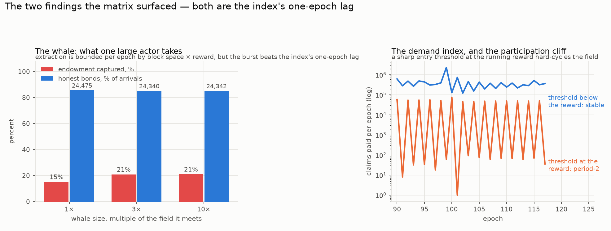

# Attacking both designs — an adversarial analysis by simulation

## What this document is

Concrete attacks, run in the simulators, against both the currently specified EmPoWering mechanism and the de-novo redesign. Every number comes from a run with a hostile actor in it, measured against the honest baseline of the same configuration — not from reasoning about what an attacker might achieve. The de-novo attacks use `empowering_denovo_sim.adversary`, which reuses the engine's admission rules exactly, so an attack the model resists it resists for the model's reasons rather than a simplification's. **That fidelity is now itself gated**: the harness is checked against the engine's post-phase steady state, because until 2026-08-21 it diverged there — it computed expected claims once per epoch, leaving the post-phase throttle open-loop within the epoch, and a run past the transition collapsed to zero claims and never recovered. No figure in this document moved when that was fixed, because every attack here is measured wholly inside the bootstrap phase, where the difficulty is pinned to its floor and the two are identical; but the harness could not have been trusted over a longer horizon, and nothing tested past the transition to say so. The current-design attacks drive `empowering_sim.elevation` unmodified.

Costs are priced from the standalone estimator at a Raspberry Pi 5's measured Poseidon2 rate, whole-platform, 20 cents a kilowatt-hour.

**The power assumption, stated because it decides the answers.** An attacker is assumed to commit **100% of its hardware to mining** — every core, full duty — on the best class with a *measured* Poseidon2 rate: an M4 Pro's ten performance cores at 26.6 µs a candidate, **15.6× a Pi 5 board**. (An earlier revision derived this bracket by applying the Apple class's *cost* advantage of 3.45× to a rate, which is an energy ratio in a rate's place; it understated the attacker 4.5-fold. The measured rate was available in `powcost/rates.py` all along and is now used directly.) The honest field is a whole four-core board per node, 24,146 candidates a second, which is also what the strategy study has always used; the *minimal* commitment a participant can make and still be mining is one pinned core, a quarter of that. All three bases are in `power.py`, and results are given across the bracket wherever it changes them.

**What a GPU would add, now estimated rather than left open.** The classes with *measured* rates are a Raspberry Pi 5 and an Apple M-series part; a GPU rig has never been benchmarked. The estimator now carries a derived figure for it (`powcost/rates.py`, flagged `measured=False`), and the derivation changes the caveat rather than confirming it.

Poseidon2 at the specified parameters costs about 488 BN254 multiplications per permutation, so about 3,400 per reward candidate. Published GPU throughput for BN254 is the input that matters and it is poor — client GPUs fall **below 1 G BN254-ops/s**, against more than 100 Gops/s for small fields like M31, because a 254-bit non-special-form modulus maps badly onto GPU ALUs. That gives roughly 294,000 candidates a second per card, **twelve times a Raspberry Pi 5 board**, and about 73× for a six-card rig.

But the number that bounds an attacker is energy, not speed, and there the answer inverts: at 450 W a card spends **1.54 × 10⁻³ J per candidate against a Pi 5 board's measured 3.65 × 10⁻⁴** — roughly **four times worse**, and it only draws level under an implausible 6 Gops/s. **A GPU rig is much faster in absolute terms and no cheaper per unit of work.**

So the earlier blanket caveat — that every adversarial figure here is a lower bound on a well-equipped attacker — was too pessimistic, and needs splitting:

* **Cost-bounded attacks are not understated.** The sybil flood of §4 is priced per candidate, and GPUs do not make candidates cheaper. Those figures stand.
* **Share-bounded attacks are understated.** The whale of §3.3 needs hashrate *share*, and a six-card rig brings 73 boards' worth. An attacker willing to spend on hardware reaches a given share far faster than a Pi-5 field suggests.

This is a property the mechanism inherits from the curve rather than one it earns: **choosing Poseidon2 over BN254 rather than over a small field is itself a GPU-resistance decision**, and it is worth knowing that it is doing that work. The estimate should still be replaced by a benchmark before anything rests on it.

**The most important finding is not an attack at all.** Both designs' onboarding targets assume that miners stop mining once they have bonded, and that assumption is not incentivised — continuing to mine is individually rational, and bonding does not stop the hardware. The behaviour both designs need in order to hit their numbers is the behaviour neither pays for. Everything else below is secondary to that.

*Revision notes.* (1) A first version compared the two designs' sybil-flood resistance at different honest baselines and over different windows and concluded they were comparably vulnerable; normalised, they are not, and §4 carries the corrected measurement. (2) Every figure here was recomputed after the power basis was corrected from one Raspberry Pi 5 core to a whole four-core board — the basis the strategy study had always used. Where a figure differs from an earlier draft, the earlier draft was measuring a field four times weaker than a committed miner actually fields. (3) A 2026-08-20 review found that correction had been **incomplete**: the gate suite's own reference draw was still seated on one core, so the cliff table, the whale curve, the block-space finding and the post-phase field all still carried one-core figures. Those are corrected here and the gates now run on the board basis. (4) The same review found the supermajority pump figure was an artefact of a 40-epoch measurement window; §3.1 carries the corrected reading and the horizon is now gated.

## How to read this

*Every section opens with a short plain-words paragraph saying what the attack is, in everyday
terms, before any numbers. Skimming only those gives you the whole picture.*

**What an "attack" means here.** Nobody is breaking cryptography or forging anything. Every
attack below is somebody following the rules while behaving selfishly — arriving at a clever
moment, sitting out to make the price rise, pretending to be a thousand people, or simply not
switching their computer off when they were expected to. That last one turns out to be the
worst of them, and it is not even malicious.

| section | the attack, in a phrase |
| --- | --- |
| §2 | nobody stops mining when they are supposed to — **the big one** |
| §3.1 | sit out to make the price rise, then flood back in |
| §3.2 | mine only when the price is high, sit out when it is low |
| §3.3 | show up huge and early, take the fund before it can reprice |
| §3.4 | the fix for §3.3, and what it costs |
| §4 | pretend to be many people at once |
| §5 | what mining is worth once the launch fund is gone |

**Three terms recur.** A **claim** is one piece of mining work, submitted and paid. The
**bond** is the 1,000-token deposit that lets a node earn from running a service — the finish
line newcomers are saving toward. An **epoch** is the accounting period, about five and a half
days.

## 1. The threat model

*In plain words: who we are assuming the attacker is, and what they can and cannot do. Being explicit about this matters, because "is it secure?" has no answer until you say secure against whom.*

An attacker with hashrate and the ability to create identities freely, who may withhold or time its participation, and who is content to spend money to deny others as well as to profit. It cannot break the puzzle, forge a claim, or violate consensus. Both mechanisms pay claims in proportion to hashrate within an epoch and gate service provision on a locked bond, so the attack surface is economic throughout.

## 2. The assumption underneath both designs

*In plain words: **read this section if you read nothing else.** Both designs promise a certain number of newcomers, and both promises quietly depend on people stopping mining once they have made it in — leaving room for the next arrivals. Nothing pays anyone to stop, and being in does not switch their computer off. This section works out what happens when they carry on, which is that everyone gets about a third of what was advertised.*

### 2.1 Nothing pays anyone to retire

*In plain words: why an established participant keeps mining. The short version: mining costs them a little electricity and earns them more than that, so stopping is simply throwing money away. No malice required.*

Both designs quote two onboarding numbers, one assuming bonded miners keep mining and one assuming they retire, and both lean on the retiring figure. The strategy report measures 11.4% against 51.9% of the elevation ceiling; the de-novo consistency identity originally imported that band, and its reference triple implies exactly 50%. Re-measured in the redesign itself the two regimes are 15% flat against 25–74% rising, and the triple sits above the persistent figure either way.

The justification on record is that a bonded node's service income dwarfs what more mining would add. That is true and beside the point. A node decides whether to keep mining by comparing the *marginal* revenue of another claim against its *marginal* cost, and having a larger income elsewhere does not enter that comparison. Nor is there any capacity conflict to force a choice: **a bonded node can provide service and go on mining with the same hardware.**

Priced at the de-novo bootstrap reward:

| | net revenue per claim | electricity per claim (Pi 5) | keeps mining while a token is worth more than |
| --- | --- | --- | --- |
| bootstrap, opening reward | 11.87 LGO | $0.00136 | **$0.000114** |
| post-phase, at the anchor | 4.494 × 10⁻⁶ LGO | $0.00136 | $302 |

**During bootstrap, continuing to mine is rational at any plausible token price.** The retiring assumption is therefore an assumption about altruism or inattention, not about incentives — and it is the assumption both designs' headline numbers rest on. (Post-phase the sign flips and mining stops paying, which is §5.)

### 2.2 What it costs when the assumption fails

*In plain words: the price of that, measured — with a quarter of participants carrying on, then half, then everyone.*

Modelled in the de-novo engine as a coalition that bonds and keeps mining anyway:

| coalition refusing to retire | total bonds | against the honest baseline | cost to the coalition |
| --- | --- | --- | --- |
| none | 24,707 | 1.00× | — |
| 10% | 20,150 | 0.82× | none — they keep earning |
| 25% | 15,562 | **0.63×** | none — they keep earning |
| 50% | 11,555 | 0.47× | none — they keep earning |
| everyone | 8,140 | **0.33×** | none — they keep earning |

A quarter of the field behaving this way costs the mechanism 37% of its onboarding; the whole field behaving this way costs two thirds. **This is the cheapest and most damaging attack in either design, it requires no coordination, and an attacker cannot be distinguished from a participant who simply never turned its miner off.** The same arithmetic applies to the current design, where the identical behaviour is what separates its 11.4% and 51.9% figures.

### 2.3 Letting the miners decide it

*In plain words: rather than assuming whether people stop, we let each simulated participant work it out for themselves each period — weighing what they earn against what the electricity costs, plus the quiet benefit of crowding newcomers out. Then we watched what they chose. They all carried on, every period, until the fund ran dry. One twist is worth the read: a **more** valuable token makes this worse, not better.*


Everything above treats retirement as a *regime* — a flag the modeller sets. That is the weakest assumption in the study, so `retirement.py` removes it: each bonded miner re-decides every epoch, comparing what the epoch pays it against what the grinding costs it, and the outcome is measured rather than chosen.

The decision includes a term the break-even of §2.1 cannot see. The endowment is finite and fully spent, so **every 1,000 LGO an incumbent mines is exactly one newcomer bond that never happens** — and fewer providers means a larger share of a service pot that is split flat and does not grow with adoption. Suppressing the on-ramp pays the incumbent a dividend, worth `blend_pool / providers²` per epoch for as long as the network runs. Mining is not merely income; it is income that buys exclusion.

**The result is unambiguous, and it settles the question:**

| | measured |
| --- | --- |
| bonded miners still mining, each epoch of the scheduled bootstrap | **100%** |
| still mining once the schedule ends | **0%** |
| nodes onboarded, decided | **7,963** — the persistent regime exactly |

Nobody retires while it matters, and everybody retires the moment the budget collapses to the fee bucket. **The retiring figure of 24,707 is not a behaviour anyone would choose**, and should stop being quoted as an expectation.

The exclusion dividend turns out to be **real but never decisive**: at no price does it change the *regime*, and at the reference price removing it changes literally nothing — gated as exact equality. Its entire observable effect lives in the narrow band around the break-even price, where it shifts the phase of the bang-bang oscillation described below and moves final bonds by a few per cent at most (largest measured: +763 of 21,291 at $0.01). It is large early — at 200 providers a single displaced newcomer repays its 1,000 LGO in eight months — but it can only perturb a decision that is already marginal, and during bootstrap mining already pays outright. Post-phase it has collapsed with `1/providers²` and cannot rescue an unprofitable epoch. It would take a service pot roughly **a thousand times** the measured one to make it decision-relevant. So the incumbent-mines-at-a-loss scenario is coherent, correctly reasoned, and does not arise here — the two conditions it needs are disjoint in this mechanism.

**What does move the answer is the token price, in the direction nobody expects.** Mining income is denominated in LGO and its electricity in dollars, so a *dearer* token keeps incumbents mining longer and onboards *fewer* people:

| token price | incumbents persist until | nodes onboarded |
| --- | --- | --- |
| $1.00 and above | epoch 195 — all of it | **7,963** |
| $0.10 | epoch 112 | 9,863 |
| $0.05 | epoch 66 | 13,420 |
| $0.01 | epoch 16 | 22,054 |

**The reference triple's headline number requires a token worth under a cent.** At any price at which the project would be considered a success, incumbents mine throughout and onboarding is a third of the target. That is the sharpest argument in this document for re-striking the triple.

*One tax checked and found not to bite here:* expired acceptance-window claims burn electricity without paying (see the report's §4), so the decision's cost side inflates by offered/included. Closing that loop through the decision (`window.congested_price_curve`) moves **no threshold at any tested price** — persists-until 195/112/66/16 at $1/$0.10/$0.05/$0.01, identical with and without the tax — because congestion only develops in the late persistent endgame (peak ×1.41 at $1), where the decision is nowhere near marginal, while at the prices where retirement is decided early the field never grows enough to congest. The regimes where the window taxes and where decisions flip do not overlap; gated.

*One limitation, because it shapes the output.* Income and cost both scale with hashrate, so the comparison is hashrate-independent and every miner decides identically — the model returns 0% or 100%, never a fraction, and near the break-even it oscillates period-2 for the same reason Q9's participation cliff does. A real population varies in electricity price, efficiency and horizon, and would settle at a fraction still mining. Read the flip epoch as the point where the marginal operator leaves, not as a claim that the field empties at once.

### 2.4 What would actually fix it

*In plain words: what a real remedy would have to look like, and why none of the obvious ones work.*

The remedy is not in either mechanism as specified. Making retirement rational needs something that prices continued mining after bonding — a declining per-identity reward, a bond that competes with hashrate, or an explicit exit incentive — and all of those are new mechanism. **What both designs can do immediately is stop quoting the retiring figure as the expected case.** Under the persistent regime the de-novo reference triple implies an efficiency of 50% against an achievable **15%** — measured in this mechanism rather than imported — which its own feasibility check now flags as a bet on retirement rather than passing silently.

## 3. The redesign's novel surfaces — both close by measurement

*In plain words: the redesign sets its price based on how busy last period was. That invites an obvious trick — make last period look quiet, so this period pays more. This section tests that trick and a related one, and both turn out to lose money. The third item is the redesign's one genuine weakness, and the fourth is a cheap fix for it.*

### 3.1 The pump — withhold to inflate the reward, then flood. **Defeated below half the field.**

The de-novo bootstrap reward is `budget / claims_prev`, which invites the obvious manipulation: mine nothing this epoch so the denominator collapses, then claim everything next epoch at the inflated price. The modelled attacker plays the strongest simple version: it **mines the opening epoch** — the one payout withholding cannot inflate, since genesis already prices at the cap — and only then alternates withhold-and-flood, against the same actor mining honestly throughout:

| attacker's share of the field | balance, mining honestly | balance, pumping | advantage |
| --- | --- | --- | --- |
| 10% | 1,228,962 LGO | 792,387 LGO | **0.64×** |
| 25% | 3,066,177 | 2,226,428 | **0.73×** |
| 50% | 6,133,475 | 5,911,977 | **0.96×** |
| 75% | 9,188,985 | 14,537,341 | 1.58× |
| 90% | 11,025,370 | 30,996,273 | **2.81×** |

*A 2026-08-31 review found the earlier table quoted a strictly weaker attacker — one that withheld the opening epoch too, forfeiting the bonanza for nothing — reading 0.44 / 0.54 / 0.80 at the minority shares. The conclusion is unchanged, but the margin at the 50% boundary is **4%, not 20%**: quoting the gentler attack overstated the defence fivefold exactly where it is thinnest.*

**Withholding loses money for any minority** — under the strongest simple pattern, at every share below half the field, and (measured below) at every horizon. The robustness sweeps across field sizes and power brackets were taken under the weaker pattern and are retained as such: 0.54×, 0.54× and 0.12× at a quarter of the field over 100, 1,000 and 10,000 boards; 0.64× at the minimal basis, 0.54× at the board, 0.05× at the worst measured. They bracket the shape, not the headline — the headline table above is the strong-pattern measurement.

The defence is the reward's own cap. `epoch_reward = max(anchor, budget // max(claims_prev, blocks_per_epoch))` floors the divisor at the block count, so however far a minority shrinks `claims_prev`, the reward cannot rise past one block's budget share — measured, it oscillates 8.76 / 4.40 / 8.77 / 4.36 LGO, a factor of two, against forfeiting an entire epoch's claims.

That cap was written for a different problem: at genesis `claims_prev` is zero and something must stop one claim taking the whole sub-pool. It is the manipulation defence as well, which is the happiest accident in the design — and it is now gated, so it cannot be removed as dead weight.

Past half the field the pump appears to pay — 1.48× at three quarters and 2.80× at nine tenths — but **that reading is an artefact of the measurement window, and it does not survive.** `pump_advantage` is a ratio of *cumulative* balances, so over a window shorter than the phase it reports how much faster the pump drained a fixed pool, not how much more it earned. Widening the window at 90% of the field:

| window | 40 epochs | 80 | 150 | 190 |
| --- | --- | --- | --- | --- |
| pump advantage | 2.81× | 2.11× | 1.27× | **1.02×** |

Once the window covers the 196-epoch phase, a supermajority pump earns **parity** with honest mining. The earlier claim that "a supermajority nearly triples its take" was 40 epochs of a race to empty the same pool, and is withdrawn. **The minority result survives the same widening** — 0.64× at 40 epochs becomes 0.58× at 190, still a loss — which is why it, and not the supermajority number, is the conclusion this section carries. Both readings are now gated so the window cannot quietly narrow again.

### 3.2 The manufactured cliff — harvest the period-2 cycle. **Unprofitable.**

*In plain words: mine only when the reward is high, sit out when it is low, and skim the good periods. It does create a real oscillation — everyone in, everyone out, repeat — but the sitting-out costs more than the skimming earns.*

Q9 accepts a documented hazard: a sharp participation threshold at the operating reward drives a period-2 cycle. The attack is to *be* that threshold — mine only above a bar, harvesting the high epochs:

| attacker's entry threshold | against always-on | near-zero epochs in a 16-epoch window |
| --- | --- | --- |
| 0.5 LGO — below the operating reward | 0.86× | 1 |
| 1.0 LGO — at it | 0.86× | **8** |
| 2.0 LGO — above it | **0.02×** | **8** |
| 4.5 LGO — far above | 0.02× | **8** |

**Being picky costs more than it harvests, at every threshold**, for the same reason the pump fails: skipped epochs forfeit more than elevated rewards return. But the *cycle itself is real and easy to trigger* — any threshold at or above the operating reward produces the period-2 alternation, eight near-zero epochs out of sixteen. It needs a growing field to appear; against a static one the index is stable and no threshold induces it. So Q9's cycle is a user-experience hazard — a badly-chosen wallet default could make a *population* oscillate to everyone's detriment — but not an exploit anyone profits from.

### 3.3 The whale — conceded in the base design, and addressed in **de novo\*** (§3.4)

*In plain words: the redesign's real weakness. Because the price only adjusts once per period, someone arriving with enormous computing power gets a whole period at the old, generous price before anything reacts. This measures how much of the fund such an actor can take, and when they would strike.*



Q8 keeps the borrow-forward unbounded, so a large actor can draw the endowment through the demand index's one-epoch lag. When it should arrive:

Against a realistically-spread field (Pareto, floored at a whole board):

| whale arrives at epoch | endowment captured (10× the field it meets) | phase ends |
| --- | --- | --- |
| 2 | 21% | 196 |
| **20** | **55%** | 197 |
| 50 | 44% | 196 |
| 100 | 5% | 196 |
| 150 | 19% | 153 |

And against a *homogeneous* field of identical boards — no distributional assumption, which is the bounded worst case rather than the expected one:

| the field's power basis | endowment captured | phase ends |
| --- | --- | --- |
| minimal (one core) | 37% | 197 |
| board (four cores) | **89%** | 23 |
| worst measured (3.45× a board) | 88% | 24 |

**The two fields answer different questions and the difference is instructive.** Against a Pareto field the whale takes 55% at its best moment, because a heavy-tailed honest population contains fast miners that compete with it. Against a homogeneous field of identical boards it takes 89% and collapses the phase from 195 epochs to 23, because nobody present can keep up. The realistic figure is the former; the latter is the bound. Both are reported because a design should be sized against the bound and expected to experience the mean.

**And the exposure saturates**: once the attacker has board-class hardware, more does not help it, because block space rather than search power is what limits an epoch's extraction. That is a genuine bound — the unmeasured GPU gap above does not widen this particular attack, though it widens the others.

**The danger window is early but not immediate.** At genesis the whale takes only 20%, because `claims_prev = 0` caps the reward at one block's share. By epoch 20 the honest field has established a `claims_prev` large enough to price the epoch generously while the endowment is still 90% intact — 88% capture, and the bootstrap collapses from 195 epochs to 23. By epoch 100 the endowment is half spent and the exposure falls back.

This sharpens the accepted risk rather than changing it — and §3.4 now addresses it, because the obvious mitigation turned out not to be the workable one.

### 3.4 **de novo\*** — bounding the draw, and what it costs

*In plain words: the fix. Put a limit on how much of the remaining fund any single period can give away beyond its own share. The large actor is then metered — takes a slice, the mechanism notices, the price drops for everyone — while an honest crowd, which is not in a hurry, simply waits a little longer. This measures both the protection and the price of it.*

The whale is the base design's one accepted weakness, so it is worth asking what closing it takes. The answer is one parameter and a deferral, and the route to it is not the obvious one.

**The obvious cap does not work.** Bound the borrow itself — no epoch may spend more than `m` budgets. One budget is about `1/195` of the endowment, and the honest ×100 cohort borrows about **97** of them, so a cap loose enough to admit the very cohort R5 exists to protect already permits half the endowment to leave in one epoch. Honest crowd and hostile whale are the same shape to the mechanism, and a flat cap cannot tell them apart. *(An earlier draft of this document recommended `m ≈ 3` on the strength of a mis-measured 2.6× figure for that cohort; at the true ~97 that cap would have rationed it savagely. The recommendation is withdrawn.)*

**What works is bounding the endowment draw as a fraction of what remains**, and only the part *beyond* the epoch's own scheduled sub-pool:

| `drawable = sub_pool + draw_cap_fraction × endowment_at_epoch_start` |
| --- |

The point is not the ceiling but what it converts. Past the cap the epoch stops admitting — but the claimants have not left, and they claim again next epoch, by which time `claims_prev` has exploded and the reward has fallen. **The cap turns instant extraction into metered extraction, which is exactly the interval the demand index needs to reprice.** Bounding the *whole* draw instead also throttles the ordinary spend-down, and the endowment then never empties — measured, the transition simply stopped firing at every cap tested.

Measured, at a 10% cap:

| | base | de novo\* (10%) |
| --- | --- | --- |
| whale capture, 10× at epoch 20 | **55%** | **9%** |
| whale capture, 3× / 30× / 100× at epoch 20 | 33% / 56% / 56% | 9% / 9% / 9% |
| ×100 honest cohort bonded, retiring | 100% | 100% |
| its median time to bond, retiring | 43 epochs | **59 epochs** |
| ×100 cohort bonded, persistent | 24% | 24% |
| its median time to bond, persistent | 69 epochs | **69 epochs — unchanged** |
| uniform onboarding | 24,707 | 24,782 |
| phase ends | 196 | 197 |

Across the cap sweep the whale falls 55% → 18% → 9% → 5% → 2% at caps of 20%, 10%, 5% and 2%, while onboarding drifts *up* slightly and the phase length does not move. **The variant converts a size-dependent exposure into a flat ceiling**: under the base design a whale's take rises with its hashrate, and under the cap a 3× and a 100× whale take the same 9%, because what binds is the cap and the repricing rather than the attacker's power.

**What it costs, honestly.** One parameter, against R1 — and it is a parameter with no natural value, since 20%/10%/5%/2% are all defensible. It softens R6's letter: the pool no longer pays purely until exhausted *within an epoch*, though nothing is refused permanently and no money is destroyed. And in the *retiring* regime it defers the very cohorts R5 protects by about 40% in time-to-bond, 43 epochs to 59. **Under persistence — the regime incentives actually produce — it costs nothing at all**: 24% bonded at a median 69 epochs with the cap and without it. The deferral is a cost the variant only incurs where the mechanism was already converting quickly.

**What it does not cost** is the thing worth noting: not onboarding, not the phase length, and not R5's guarantee. This is the cheapest of the mitigations considered anywhere in this analysis, and the only one that closes an accepted exposure without opening another.

Q8 was settled as unbounded, so this is recorded as an **alternative design** rather than a correction — the decision is the design owner's, and §6 states it as such.

## 4. The sybil flood — and the correction

*In plain words: neither design can tell one person with a thousand machines from a thousand people with one each. So the strongest denial attack is simply to show up as a crowd and take a proportional share of the on-ramp. This measures what that costs honest newcomers in each design — and the redesign does markedly better at realistic scales.*


Neither mechanism has any defence against one actor presenting as many, so the strongest denial attack on both is to flood the field with identities and take a share of the on-ramp proportional to what you can afford. Measured at the **same honest arrival rate and the same window** for both designs — 100 honest arrivals an epoch, 400 epochs, retirement on:

| flood, × the honest rate | honest elevations denied, current | honest bonds denied, de novo | de novo\* |
| --- | --- | --- | --- |
| 1× (baseline) | — | — | — |
| 2× | **48.4%** | **4.3%** | 4.8% |
| 5× | 88.9% | 79.2% | 79.3% |
| 10× | 96.3% | 94.5% | 93.4% |

*Baselines: 25,934 honest elevations in the current design, 19,075 honest bonds in the redesign, 19,164 with the bound. Measured by `adversary.sybil_denial` and gated. An earlier draft quoted 3.5 / 76.2 / 92.8 from a hand-run that had drifted from the engine and existed in no committed code.*

**At moderate flooding the redesign is an order of magnitude more resistant** — doubling the field costs honest joiners 4.3% of their bonds against 48.4%. The bound changes nothing either way, because a cap defers rather than denies. The reason is structural: the current design's claim flow is fixed, so twice the field is half the share each, while the redesign's budget converts whoever is present, so a doubled field simply converts faster. At extreme flooding both collapse, because there the binding constraint is the same in both — the payout strands below the bond faster than anyone crosses it.

A first version of this document measured the two designs at different honest rates and over different windows, and concluded they were comparably vulnerable. That was an artefact of the mismatch; the corrected comparison above is the one to use.

What the extreme case costs the attacker, at flood rates achieving ~95% denial: on the order of a quarter-million devices in both designs — $20M or more of hardware capital before any electricity, which is the real barrier — with electricity of $12.8M (current, 600 epochs) against $4.5M (de novo, 220 epochs). The redesign is cheaper to besiege in absolute terms only because its bootstrap is shorter, which is the same property that makes it converge faster.

One asymmetry favours the redesign throughout. **An arrival flood cannot accelerate its drain**: the transition holds at epoch 195–197 at every flood rate tested, because the budget schedule governs what an epoch may spend. Nor can an arrival spike: measured across seeds, uniform and ×100 both end at 195–196. Nor, against a realistically-spread field, does a *hashrate* whale: it takes 55% of the endowment at its best moment and the phase still ends at 197 against uniform's 196 (§3.3). **Only against a homogeneous field — the worst case, where every node is an identical board — does the phase actually collapse, to epoch 23.** So the redesign separates two attacks the current design conflates: many small identities dilute the on-ramp but cannot shorten it, while one large actor drains it and, in the worst case, ends it early — and is visible in a way many small ones are not.

## 5. What the redesign converges to, and whether it matters

*In plain words: after the launch fund is spent, what is mining actually worth? The answer is: almost nothing, on purpose. That is worth stating plainly because it means the mechanism should not be counted on to protect the network later.*

Post-phase, the anchor nets 4.494 × 10⁻⁶ LGO per claim after the claim's own fee, against $0.00136 of electricity. Mining therefore stops paying, and the field shrinks until it does — the self-correcting equilibrium:

| token price | equilibrium mining field |
| --- | --- |
| $0.01 | 0.1 Pi 5 boards |
| $1.00 | 9 |
| $100 | 918 |

*These were published as 0.4 / 37 / 3,677 "Pi 5-equivalents", which are the same figures counted in single **cores** — the superseded basis. One node is a whole four-core board throughout, so the device counts are a quarter of that.*

**Proof of work becomes vestigial once the endowment is spent**, supporting a field of single-digit boards at plausible token prices. That is R8 working as specified rather than a defect — the brief asked that the post-phase pay "a very minimal amount", and a reward defined as exactly one transfer plus one inscription delivers exactly that. It is worth stating plainly because it means the post-phase provides no security and should not be relied on for any: whatever the chain needs proof of work *for* after bootstrap, this reward will not fund it.

## 6. What follows

*In plain words: the conclusions, separated into what should change a decision and what is merely worth knowing.*

**For both designs, and first.** The retiring assumption is not incentivised, costs a third to two thirds of onboarding when it fails, and is indistinguishable from ordinary inattention. Either stop quoting the retiring figure as the expected case — which makes the de-novo reference triple infeasible by its own check and should move the triple — or add a mechanism that prices continued mining after bonding. This is the one finding here that should change a decision.

**For the redesign.** Both of its novel surfaces are closed by measurement rather than argument, and gated. The whale exposure is real, accepted, concentrated in the first quarter of the phase — **and now shown to be closable**: §3.4's `de novo*` bounds it from 55% to 9%, flat across whale size, for one parameter and a 37% deferral of spike cohorts' time-to-bond, with no cost to onboarding, phase length or R5. Whether to buy that is a decision rather than a finding, and it is the one open item this analysis leaves. Its sybil resistance at moderate flooding is markedly better than the current design's, which is a point in its favour that the first version of this analysis missed.

**For the current design.** Its immunity to reward manipulation is structural — a pool-determined reward cannot be pumped — and worth counting as the redesign's opportunity cost. Its flow cap makes it undrainable by any actor.

**For the protocol — decided, not open.** The sybil flood is cheap relative to what it denies and neither design addresses it, because neither has a notion of identity beyond a keypair and a claim fee. The design owner's position, taken 2026-08-20, is that **this is accepted and not to be mitigated: proof of work is sheer power, and a participant who buys more of it is entitled to more of the reward, whether they present as one identity or a thousand.** Every candidate remedy — a bond to mine, proof of personhood, a per-identity rate limit — would make the mechanism something other than proof of work, so none is pursued.

That makes the flood a property to size rather than a hole to plug, and the sizing is in §4: a quarter-million devices and $20M of hardware before electricity, which is the same barrier that stands in front of any attack on any proof-of-work chain. It is worth noting only that the *denial* is cheaper than the *capture* — an attacker who merely wants to keep others out spends the same and needs no strategy at all.

## 7. Reproducing this

*In plain words: the exact commands, so anyone can re-run every number above rather than taking it on trust.*

```
cd tools/simulators/empowering/denovo
make validate                     # the adversarial findings are gated
PYTHONPATH="src:../empowering/src" python3 -m empowering_denovo_sim.adversary
```

The pump, the cliff and the two-population engine are in `adversary.py`; the retirement-denial run uses `engine.run(..., refuse_fraction=)`; the whale timing sweep uses `scenarios.whale_run`; the current-design runs drive `empowering_sim.elevation` with no modifications.
