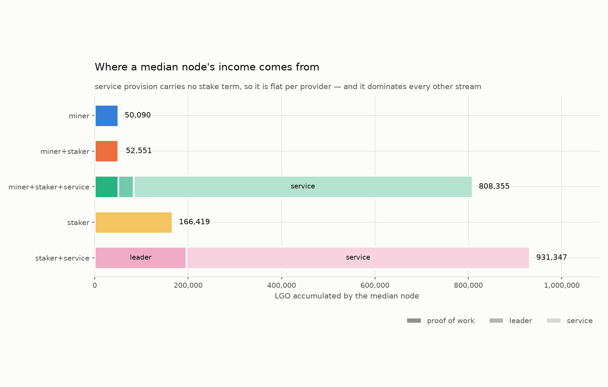
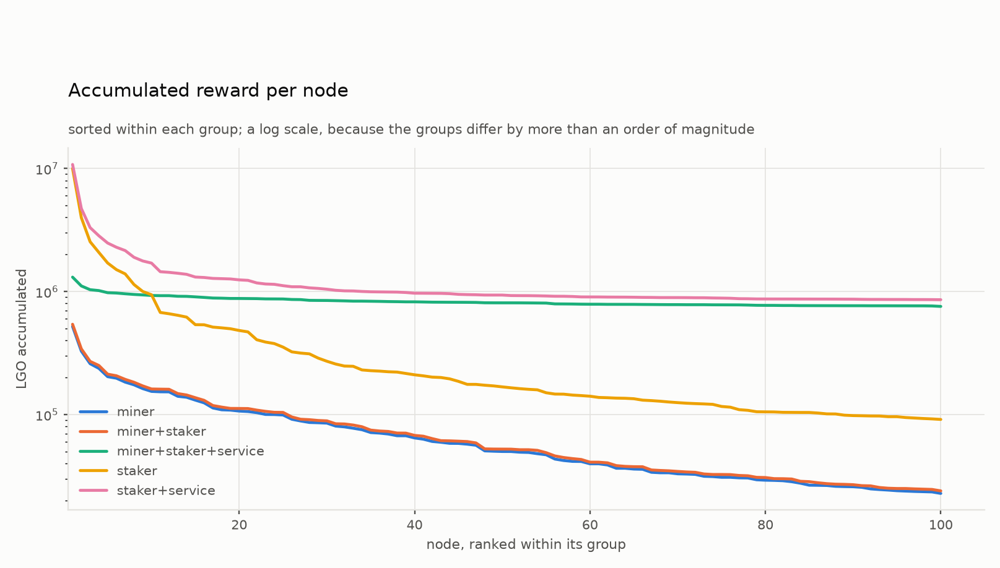
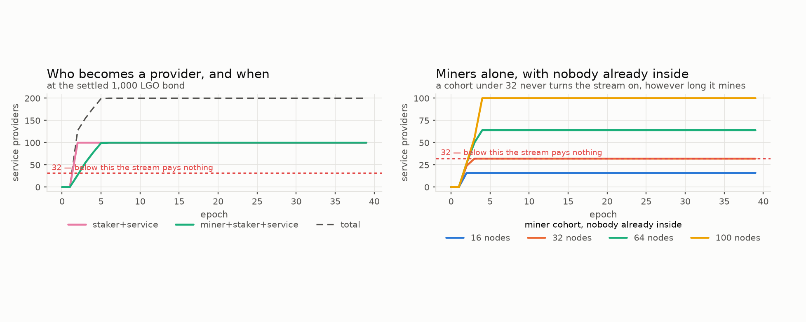
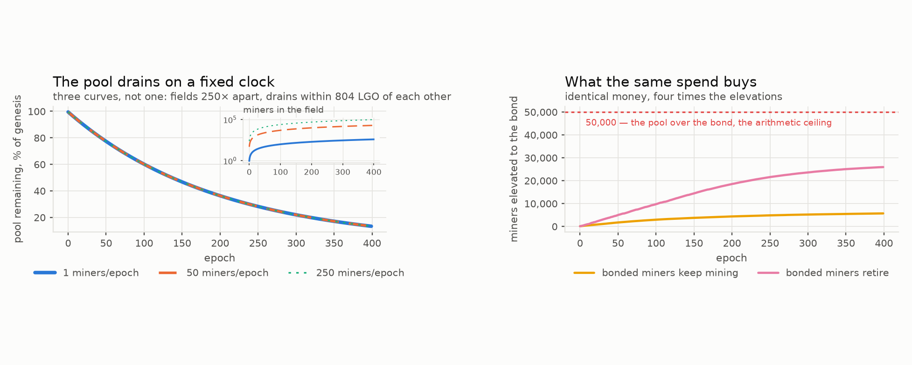
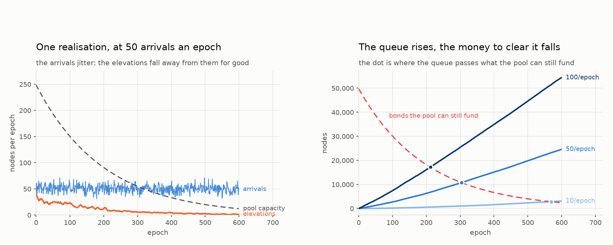
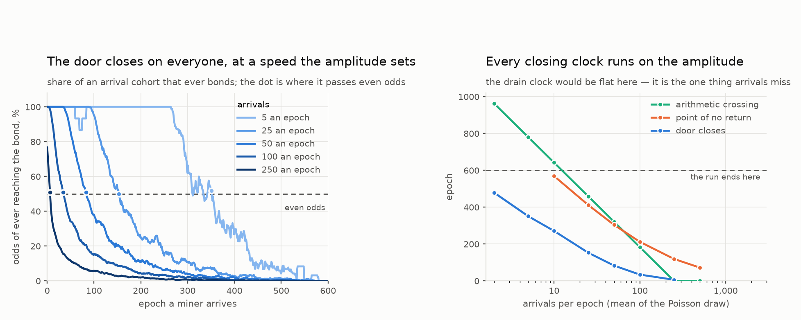
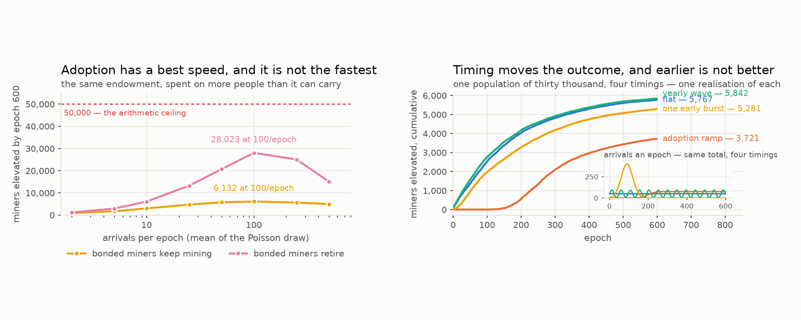
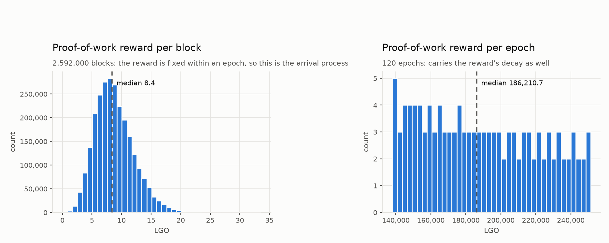
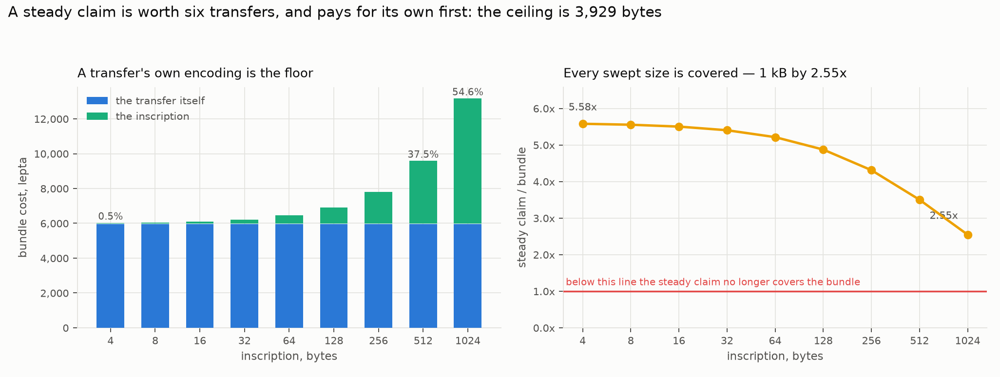
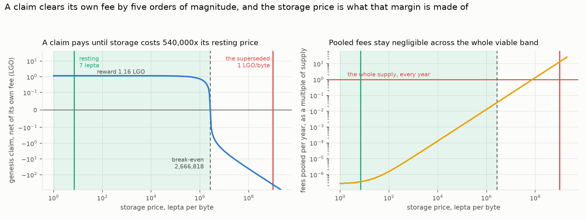

# Which strategy pays — five ways to participate in EmPoWering

## What this document is

A simulation of the EmPoWering mechanism from the point of view of the people using it. The specifications say how the chain pays; this asks what that adds up to for a node that has chosen a way to take part, and whether the mechanism does the job it was designed for — letting someone with no tokens work their way into the system.

Everything here runs on one honest chain. Every group is simulated at the same time, competing for the same rewards, because a strategy's return depends on who else is playing. Nothing models an attacker, a network delay or a failure: the question is what happens when the mechanism works.

Notation follows the tokenomics report's convention — prose and code spans carry self-describing names, so `reward_per_claim` here is the same quantity as `reward_per_claim` there and in the specification.

Regenerate every figure with (from `tools/simulators/empowering/strategies`):

```
PYTHONPATH=src python3 -m empowering_sim.plots_strategies \
    --out ../../../../reports/empowering/strategies/figures --epochs 120 --nodes 100
PYTHONPATH=src python3 -m empowering_sim.plots_inscription \
    --out ../../../../reports/empowering/strategies/figures
PYTHONPATH=src python3 -m empowering_sim.plots_arrivals \
    --out ../../../../reports/empowering/strategies/figures
```

The third command is separate because it is slow: §7 sweeps an arrival rate across a 600-epoch horizon and both retirement rules, where the other two take a couple of minutes.

---

## How to read this

*In plain words: this document answers one question — if you joined this network, what is the
best way to make money from it? There are five ways to participate, they can be combined, and
they pay very differently. We simulated all five competing on the same chain and measured what
each earned.*

**The answer up front, so the rest is evidence rather than suspense: running a service pays
several times better than anything else, and it is not close.** The interesting part is *why*,
because the reason is structural rather than a matter of tuning — and it means the ordering
would be hard to change even deliberately.

Every section opens with a short *plain-words* paragraph. Skim only those for the argument.

| if you want… | read |
| --- | --- |
| the answer and the size of the gap | §3 |
| how a newcomer actually gets in, and how long it takes | §5, §7 |
| whether electricity costs change the answer (they do not) | §9 |
| what happens over the network's whole life | §10 |
| what would have to be true for these conclusions to be wrong | §13 |

**The three income streams**, referred to throughout: **mining** pays for computational work;
the **leader lottery** pays whoever is randomly chosen to propose a block, weighted by how
many tokens they hold; and the **service reward** pays nodes that run the privacy service —
split *equally* among them, with no weighting by holdings at all. That last detail drives most
of what follows.

## 1. The model

*In plain words: what was simulated and what was deliberately left out. Worth a skim even if you skip the detail, because the omissions bound what the conclusions can claim.*

### 1.1 What the chain does

Time is divided into **blocks** of 30 seconds and **epochs** of `blocks_per_epoch = 21,600` blocks — 7.5 days. Each block has one leader, chosen by lottery, and each block carries transactions. That is the whole of the chain for our purposes: we do not model the network that moves blocks around, only the ledger's arithmetic.

### 1.2 The three ways to be paid, and the two places the money comes from

Keeping those two places straight is most of understanding the mechanism.

**Proof-of-work claims — paid from a pool of tokens that already exist.** Anyone can grind: hash candidate keys until one lands below a threshold, then submit a claim and be paid. Nothing gates this — no stake, no permission, no identity. The money comes from a **pool** seeded at genesis with `genesis_pool = 0.5%` of `launch_supply`, fifty million LGO. Each epoch the pool pays out a fixed fraction of itself, divided over a fixed number of claims:

| `reward_per_claim = distribution_rate * pool / (target_claims_per_block * blocks_per_epoch)` |
| --- |

At `distribution_rate = 1/200` and `target_claims_per_block = 10`, that is 216,000 claims an epoch sharing a two-hundredth of the pool. The pool is topped up from the fee flow — under lips PR 375's pooling substrate, a carve-out of the fees that would otherwise reach the pending rewards pool (decided here 2026-08-24 as the pool's first outflow; the 2026-09 spec revision states it as a diversion *before* the pool, which is per-block identical) — `epoch_refill = pow_share * blocks_per_epoch * txs_per_block * avg_tx_fee`, with `pow_share = 10%`. Claiming is not free: the claim transaction pays its own fee, so a miner keeps `reward_per_claim - claim_fee`.

**Leader rewards — paid from the block-reward release.** Each block's leader is drawn by lottery, weighted by the stake it holds. There is **no minimum**: a note of any size can win, provided it has been held long enough to have *aged* into the stake snapshot — two epochs, fifteen days. Aging is the only gate, and it matters in §5.

**Service rewards — from the same release, but divided a completely different way.** A node that locks `min_stake = 1,000 LGO` may declare itself a service provider, and the service pool is then split **equally among the providers**:

| `reward_per_provider = blend_pool / providers` |
| --- |

There is no stake term in that formula anywhere. A provider at the bare minimum earns exactly what a provider holding a million tokens earns. Stake is a door, not a dial. Two consequences run through this whole report: holding more than the bond is worth nothing to this stream, and each additional provider dilutes every other one. And it does not taper — below **32 providers** the specification says the reward is not calculated at all.

**What funds the last two.** Leader and service rewards come out of the block reward — under PR 375, a metered release from a finite genesis reserve (10⁹ LGO) plus recycled pooled fees, not minting. How much is released is not fixed; a controller steers it by watching how much stake the network has:

| `block_reward = emission_factor * max_release_per_block + (1 - emission_factor) * pooled_fees_avg` |
| --- |

The `emission_factor` runs from 1 to 0. At 1 the protocol releases at its ceiling of 95.13 LGO a block and ignores fees. At 0 it releases nothing and simply distributes back the hour's average of pooled fees (PR 375 replaced the single block's fee with the 120-block window; invisible at flat fees, gated). What moves it is the gap between the stake the network has and the `stake_target` of 30% of the cap: far below target it releases hard to attract stake, and at target it stops. Whatever is paid is split **60% to the Blend service and 40% to the leader**.

In one line: **mining is paid out of a finite pot of old tokens, while leading and providing are paid in new ones — and only while the network is short of stake.**

### 1.3 The difficulty controller, and why it decides more than it appears to

The mining threshold is not fixed. A controller adjusts it every block so the number of claims stays near target, whatever search power has turned up:

| `next_difficulty_target = target_claims_per_block * difficulty_target / ((1 - smoothing) * claims_in_block + smoothing * target_claims_per_block)` |
| --- |

This is a thermostat: claims arriving too fast tighten the threshold, too slow loosens it. The expected work for one claim is `candidates_per_claim = field_modulus / difficulty_target`.


The left panel is the thermostat working. Over 200 epochs miners arrive continuously and the field's search power grows **380-fold**; the work one claim costs climbs to match, across three orders of magnitude. The right panel is the consequence, and it is the most important structural fact in this report: **the number of claims paid does not move.** Flat at about 217,000 an epoch through a 380-fold change in load. The half-percent above the 216,000 target is the controller's known overshoot, not drift.

Follow that through. The pool pays a fixed amount per claim; the controller fixes the number of claims; therefore **the pool's outflow is fixed too.** It drains on a clock that no amount of mining, adoption or hardware can change. That is why §6 finds pool depletion completely independent of demand, and why §7 still finds it so once the arrivals are made random — the difficulty absorbs every bit of the load variation before it can reach the pool.

### 1.4 What we do not model

No Blend network, no propagation delay, no forks, no churn, no adversary. Every node behaves honestly and stays for the whole run. Traffic, the fee level and the arrival of new nodes are inputs rather than outcomes: nobody joins because mining is paying well, and nobody leaves because it is not. Where a simplification could move a number, §13 says so.

---

## 2. The five strategies

*In plain words: the five ways to play, from "just mine" to "mine, hold, and run a service". They are cumulative rather than exclusive — each adds an income stream to the one before.*

| # | strategy | mines | lottery | services |
| --- | --- | --- | --- | --- |
| 1 | miner | yes | no | no |
| 2 | miner and staker | yes | on what it mines | no |
| 3 | miner, staker and service provider | yes | yes | on reaching the bond |
| 4 | stakeholder | no | on initial stake | no |
| 5 | stakeholder and service provider | no | yes | yes |

Groups 4 and 5 are each endowed with 5% of launch supply, drawn once from a Pareto distribution and reused between them. Groups 1 to 3 start with nothing and get a Pareto hashrate distribution floored at a measured Raspberry Pi 5, likewise drawn once and shared. Reusing the draws is what makes this a comparison of strategies rather than of luck: group 1's fastest miner is the same machine as group 3's.

**Which retirement flavour this is.** Groups 1 to 3 mine for the whole run, including group 3 after it has bonded — the *persistent* flavour. That is not an oversight but the incentive-compatible reading, and §6 measures the alternative. The choice matters far less here than it does there, and §3.1 says by how much.

A word on why the comparison is not straightforward. Groups 1 to 3 arrive with hardware and no tokens; groups 4 and 5 arrive with five million LGO apiece. Simply totalling what everyone earns would answer "who was given more at genesis". So each table below carries the raw figure and the ratio against a plain stakeholder, which is the closest thing to a neutral baseline: capital doing nothing but the lottery.

---

## 3. The result

*In plain words: the headline. Who earned what, after everyone competed on the same chain for the same rewards. One strategy wins by a wide margin.*



| strategy | median node, LGO | against a plain stakeholder |
| --- | --- | --- |
| miner | 50,090 | 0.30× |
| miner and staker | 52,367 | 0.31× |
| stakeholder | 166,419 | 1.00× |
| miner, staker and service provider | 808,883 | **4.86×** |
| stakeholder and service provider | 931,347 | **5.60×** |

**Service provision dominates by a factor of five and a half**, and structurally rather than because a parameter was set badly: its reward carries no stake term, so the whole Blend pool divides flat among however many providers exist — and that pool is 60% of everything the protocol distributes.

**Staking on top of mining is worth four and a half percent.** A miner who stakes everything it mines earns 52,367 against a pure miner's 50,090. What a miner accumulates in two and a half years is simply small against 5% of supply, so its slice of the lottery is small too.

**Mining is the weakest of the five.** A miner earns less than a third of what a stakeholder earns, and it is the only strategy that pays for its income in electricity.

### 3.1 What retiring would cost, and why nobody will

Every table above is the persistent flavour. Retiring changes one number in it, because proof of work is a rounding error in the income of a node that has bonded:

| strategy | median total | of which proof of work | share |
| --- | --- | --- | --- |
| miner | 50,090 | 50,090 | 100% |
| miner and staker | 52,367 | 50,115 | 96% |
| **miner, staker and service** | **808,883** | **49,988** | **6.2%** |
| stakeholder | 166,419 | — | — |
| stakeholder and service | 931,347 | — | — |

A group-3 node that stopped mining on the day it bonded would give up **6.2% of its income**, moving it from 4.86× a plain stakeholder to about 4.56×. The ordering does not change and no conclusion in this section moves.

**But §6 measures the same behaviour as a 4.5-fold difference in how many nodes ever get in at all** — 5,690 against 25,935. Both numbers are right, and together they are the finding: **retiring costs the individual 6.2% and buys the network four and a half times more onboarding.** That is a collective-action problem in its exact classical form, and it explains why the optimistic figure should not be planned around. Nothing in the mechanism converts the collective gain into a private one, so the rational choice is to keep mining, and the persistent flavour is the one to expect.

---

## 4. Dispersion, and the strategy that erases it

*In plain words: averages hide things. Two strategies can pay the same on average while one is a lottery and the other a salary. This looks at the spread — and finds that running a service does something unusual: it pays everyone the same regardless of size.*



Medians hide the more interesting result. These curves sort every node within its group, so a steep curve means members did very different things and a flat curve means they all did much the same.

| strategy | p10 | median | p90 | max ÷ min |
| --- | --- | --- | --- | --- |
| miner | 25,831 | 50,151 | 153,028 | 22.4× |
| miner and staker | 27,003 | 52,478 | 160,851 | 22.5× |
| stakeholder | 98,805 | 163,851 | 713,482 | **109.5×** |
| miner, staker and service | 766,820 | 807,612 | 928,856 | **1.7×** |
| stakeholder and service | 863,938 | 930,422 | 1,466,001 | 12.6× |

A plain stakeholder's reward spans a **hundred-and-tenfold** range, because leadership pays strictly in proportion to stake and the stake draw is Pareto — the richest tenth of that group holds 57.7% of it. The miner-staker-service curve spans **1.7×** across a hundred nodes whose hardware differs 22.4-fold.

**Service provision is the only stream on the chain that compresses inequality, and it compresses it almost completely.** Mining and leading both pay in proportion to what you brought, so they preserve whatever distribution walked in; a flat per-provider payment destroys it. That is exactly what one would want from an on-ramp, and it is also a standing invitation to split one large operator into many bonded identities, since the mechanism pays per identity rather than per unit of capital.

---

## 5. When nodes actually become providers

*In plain words: the on-ramp in practice. How long does a newcomer with no tokens have to mine before they can afford the deposit that unlocks the best-paying stream?*



The bond is fixed at 1,000 LGO, and the two provider groups reach it by opposite routes. The endowed group holds far more than the bond from genesis, so it is a provider as soon as its declaration clears the two-epoch snapshot lag — bonded at epoch 2. The miners must earn theirs, which at this bond is about **865 claims**: they cross between epochs 2 and 5, roughly five weeks.

So the on-ramp into the largest reward stream on the chain takes about a month, and **note aging rather than the bond is what floors it** — a miner waits nearly as long for its notes to age as it does to earn them, so lowering the bond further would buy nothing.

With the bond fixed, the live question is not how high the threshold is but who turns up. The right panel drops the endowed cohort and asks whether miners can turn the service stream on by themselves.

| miner cohort, nobody already inside | outcome |
| --- | --- |
| 16 nodes | plateaus at 16 — **never reaches the floor, so the stream never pays** |
| 32 nodes | exactly at the floor; marginal |
| 64 nodes | clears it by epoch 4 |
| 100 nodes | clears it by epoch 4 |

**A cohort smaller than thirty-two never turns the stream on, however long it mines.** Every member can cross the bond inside a month and still earn nothing from it, because below that count the reward is not calculated at all. This is a real bootstrapping condition, and it is why the left panel looks so comfortable: both curves sit above the floor only because the endowed group alone is a hundred nodes, carrying the floor while the miners climb. **The on-ramp needs somebody already inside for it to be worth walking up** — or thirty-two people arriving together.

---

## 6. How many can be elevated, and what the pool spends doing it

*In plain words: the capacity question. The launch fund is finite, so how many newcomers can it actually carry across the line — and how much of it leaks away rather than reaching anyone?*

A separate study, and the first in which **the field grows**: new nodes are seated every epoch, so each miner's share of a fixed claim flow shrinks as the run goes on. Two groups only — endowed providers who arrive above the bond, and mining providers who must earn it. Only the second is elevated by the mechanism.

The arrivals here are a *budget* rather than a process — the same number of nodes every epoch, no variance, no adoption curve. That is all this section's question needs, and it is why the three runs below can be drawn on one path. It is not enough to say how *fast* anyone is absorbed, which is what §7 is for.

Before simulating anything the arithmetic sets a ceiling. The pool is the only source of a miner's first tokens and every elevation costs one bond, so `elevation_ceiling = genesis_pool / min_stake` is **50,000**, and at genesis the pool can fund `distribution_rate * pool / min_stake` = 250 of them an epoch.



### The pool drains on a clock nobody can change

**The left panel is three runs drawn on top of one another, not one run.** They carry three dash patterns for exactly that reason, and the inset carries the populations behind them: 1, 50 and 250 new miners an epoch, which is a field of 400 against a field of 100,000 by the end — **two hundred and fiftyfold apart**. Their drain curves never separate by more than 823 LGO at any epoch, and after 400 epochs each has spent 43,336,6xx LGO, identical to six figures.

That coincidence is the finding rather than a failure to tell the two quantities apart. It is §1.3 playing out — the controller fixes the claim count and the pool pays a fixed amount per claim, so the outflow is a property of the pool rather than of demand. Its half-life is **138 epochs, two years and ten months**, and it is 90% depleted after **459 epochs, nine and a half years**. No arrival rate, no hashrate and no adoption scenario moves that curve.

**So drainage and joining are independent, and only one of them is anybody's decision.** How much the mechanism spends is set by the protocol. What the arrival rate changes is not the spending but where it lands — which is the right panel, and the whole of §7.

### What the spend buys is another matter

| bonded miners | elevated | of the 50,000 ceiling | spend stranded below the bond |
| --- | --- | --- | --- |
| keep mining | 5,690 | **11.4%** | 87% |
| retire | 25,935 | **51.9%** | 40% |

Out of the *same* 43.3M LGO. A bonded miner that keeps mining takes claims from miners still trying to cross. **Retiring bonded miners is worth four and a half times as many elevations**, and nothing in the protocol makes them stop.

The earlier reading of this — that a bonded miner "has no reason to" keep mining, because its service income dwarfs what more mining adds — does not survive §3.1. Having a larger income elsewhere is not a reason to decline a smaller one, the two are not in conflict (a bonded node can serve *and* mine on the same hardware), and the marginal claim comfortably covers its own electricity. The honest statement is that retiring costs the individual 6.2% and buys the network 4.5×: **not free, and not individually rational.** The 51.9% figure is therefore the optimistic bound, and 11.4% is the one to plan against unless the mechanism gains something that pays for exit.

Without retirement the arrival rate barely matters over a wide band: elevation holds between **4,213 and 5,682** from twenty-five joiners an epoch up to two hundred and fifty — ten thousand miners against a hundred thousand — because the pool's output spreads over everyone still mining and more arrivals only mean thinner slices. Outside the band it falls away in both directions, to 1,473 at five an epoch, where there are simply not enough joiners to spend the endowment on, and to 4,646 at five hundred, where the slices are too thin ever to reach the bond. **So there is a best arrival rate rather than a plateau**, and §7 measures its shape.

**So the mechanism can elevate between about 5,700 and 26,000 nodes**, against a ceiling of 50,000, and which end depends on a behaviour the specification does not address. The rest becomes sub-bond balances: real tokens held by miners who mined for years and never reached the threshold that would have made them worth something.

---

## 7. Arrivals as a process, and the window that closes

§6's arrivals are a **budget**: the same number of nodes every epoch, forever, with no variance and no adoption curve. That is enough to answer what the pool spends — and the answer turned out not to depend on arrivals at all, which is why three runs there could be drawn as one curve. It is not enough to answer anything about *speed*, because a rate that never moves gives nothing to measure a speed against, and it cannot tell one cohort from another, because under a constant rate every cohort is the same cohort.

This section replaces the budget with a process. The miners seated in an epoch are **Poisson**, around a mean the study shapes over the horizon:

| `arrivals(epoch) ~ Poisson(amplitude * profile(epoch))` |
| --- |

**Amplitude** is the knob: the mean number of new miners an epoch, and the only thing about adoption a designer can plausibly hold an opinion on. **Profile** is the adoption story's shape — flat, a yearly wave, a logistic ramp, a single early burst — normalised so that every shape delivers the same population over the horizon and differs only in *when* it turns up.

Poisson is the right law here rather than a convenient one. Joiners decide independently of one another and each one's chance of deciding in any particular epoch is small, which is exactly the limit a Poisson count describes; it is also the law the claim process already obeys one level down.

The horizon is **600 epochs, twelve and a third years**, and §6's clock is the reason: the pool is 90% spent by epoch 459, so a shorter run would confuse "the door closed" with "the run ended". For the same reason, cohorts arriving in the last 120 epochs are not asked whether they were absorbed. They have not had the chance.

### The drain still does not listen — and now the claim has an exact boundary

Making the arrivals random does not move the drain curve. Across amplitudes from 5 to 500 an epoch — populations from 2,952 to 301,351 over the run — every drain curve ends at **4.866% of the genesis pool**, agreeing to four significant figures, and it ends there for every seed as well. Only the two-an-epoch run is different, at 4.915%, and the reason it is different is the whole of the boundary.

The widest separation between any two curves at any epoch is **1.00 points of the pool**, and all of it belongs to that smallest amplitude: at two arrivals an epoch the Poisson draw seats nobody at all in the first two epochs, so nothing is claimed and nothing is paid, and the pool skips two epochs of payout and stays one percent fuller for the rest of the run. Drop that one amplitude and the remaining seven agree to **0.0017 points** over six hundred epochs.

So §6's invariance survives being made stochastic, and it acquires its exact boundary: **the pool's outflow is independent of arrivals except when there are none.** A chain with one miner drains at exactly the rate of a chain with three hundred thousand. Only an empty chain pauses, and only for as long as it is empty.

### Two clocks, and only one of them answers to anyone



The left panel is one realisation at fifty arrivals an epoch. The arrivals jitter around fifty for the whole run; the elevation rate starts at forty in the first epoch, is under half the arrival rate before six months are out, and is at two an epoch by the end. The dashed line above both is the pool's own capacity — the bonds an epoch's payout could fund if every lepton of it landed on a miner at the threshold — falling from 250 an epoch to 12.

Notice what that rules out. Gross capacity does not fall through the arrival rate until epoch 321, but the elevation rate is already below it in the first epoch and below half of it by epoch 25. **The binding constraint is not the size of the pool, it is the size of the field the pool has to spread itself over** — which is precisely the effect §6's arithmetic ceiling cannot see.

The right panel is this section's central picture, and the two quantities are drawn in the same units on purpose. The queue of miners waiting below the bond **rises** with every arrival. The bonds the remaining pool could ever fund — its whole remaining value over the bond — **falls** on the drain clock. They cross:

| arrivals an epoch | the queue passes every bond the pool can still fund |
| --- | --- |
| 10 | epoch 569 — 11.7 years |
| 50 | epoch 304 — 6.2 years |
| 100 | epoch 212 — 4.4 years |
| 250 | epoch 119 — 2.4 years |
| 500 | epoch 72 — 1.5 years |

That crossing carries no behavioural assumption at all — no conversion rate, no retirement rule, no view about how anyone mines. Past it, the miners already waiting outnumber every bond the endowment could ever pay for. **At a hundred joiners an epoch the mechanism becomes arithmetically unable to clear its own queue after four and a third years**, and nothing after that epoch can change it.

### How long the door stays open



Ask the question a prospective joiner would ask — *if I turn up now, do I ever reach the bond?* — and the answer is a window rather than a number. Every amplitude starts at certainty, because the first cohorts all get in, and every amplitude ends at nothing. The amplitude decides how long the first part lasts.

| arrivals an epoch | seated | elevated | absorbed, cohorts with runway | door closes | no return | median wait |
| --- | --- | --- | --- | --- | --- | --- |
| 2 | 1,205 | 949 | 94% | epoch 479 | — | 10 |
| 5 | 2,952 | 1,747 | 74% | epoch 351 | — | 16 |
| 10 | 6,118 | 3,015 | 60% | epoch 271 | 569 | 31 |
| 25 | 15,240 | 4,732 | 38% | epoch 153 | 412 | 39 |
| 50 | 30,330 | 5,767 | 24% | epoch 83 | 304 | 42 |
| 100 | 60,480 | 6,132 | 13% | epoch 34 | 212 | 44 |
| 250 | 150,904 | 5,632 | 5% | epoch 6 | 119 | 51 |
| 500 | 301,351 | 4,997 | 2% | **never** | 72 | 54 |

*Door closes* is the last arrival epoch whose cohort is more likely than not to reach the bond eventually. *Absorbed* is measured only over cohorts seated before epoch 480, which is why it is not `elevated / seated` — the last 120 cohorts are excluded rather than counted as failures. A dash under *no return* means it did not happen inside the horizon. *Median wait* is in epochs, over the miners that made it.

Above about twenty-five an epoch, **doubling the arrival rate roughly halves the window.** At ten an epoch it is five and a half years, at fifty twenty months, at a hundred eight months, and at two hundred and fifty it is six epochs. At five hundred an epoch no cohort has better than even odds at all — including the one that arrives at genesis.

There is a blunter version of the same fact. Ask not whether a cohort eventually gets in but whether the mechanism ever keeps up — whether an epoch's elevations match that epoch's arrivals — and it does so until epoch 493 at two arrivals an epoch, until 223 at five, until 153 at ten, and **never at twenty-five and above**. From twenty-five joiners an epoch onward the mechanism is behind from the chain's first epoch and never once catches up.

The median wait is the number that does *not* move: ten epochs at the slowest arrival rate against fifty-four at the fastest, a factor of five across a population ratio of two hundred and fifty. That is because it is measured over the miners who made it. **The queue does not get slower as it fills, it gets shorter** — the wait among the successful barely changes, and what collapses is how many are successful.

### Adoption has a best speed, and it is not the fastest



Elevation against the arrival rate is not monotone. It rises from 949 at two arrivals an epoch to about six thousand near a hundred, then falls back to 4,997 at five hundred — a hump, not a plateau and not a curve that keeps climbing. Below the hump there is nobody to elevate; above it the same fixed payout spreads across a field growing faster than it can serve, and most of it strands in balances that never reach the bond.

So §6's "the arrival rate barely matters" holds over a band and fails outside it. Between twenty-five and two hundred and fifty an epoch — a tenfold range, and a population from 15,000 to 151,000 — the count stays between 4,732 and 6,132. Outside that band it falls away in both directions, and across the whole sweep **the worst arrival rate elevates a sixth of what the best one does.**

Retirement changes the size of the hump, and changes what it means:

| arrivals an epoch | elevated, bonded miners keep mining | elevated, bonded miners retire | of arrivals absorbed, retiring |
| --- | --- | --- | --- |
| 2 | 949 | 1,205 | **100%** |
| 5 | 1,747 | 2,950 | **100%** |
| 10 | 3,015 | 6,089 | **100%** |
| 25 | 4,732 | 13,275 | **100%** |
| 50 | 5,767 | 20,679 | 84% |
| 100 | 6,132 | 28,023 | 58% |
| 250 | 5,632 | 25,049 | 21% |
| 500 | 4,997 | 15,083 | 6% |

The peak becomes **28,023 at a hundred an epoch**, 56% of the 50,000 ceiling, against 15,083 at five hundred. But the column that matters is the last one. **If bonded miners stop mining, the mechanism absorbs every arrival up to twenty-five an epoch** — not most of them, all of them, across twelve years and fifteen thousand joiners. §6 measured retirement as a 4.5× multiplier on a count. Under a process it is the difference between an on-ramp that turns most people away and one that turns nobody away until adoption passes twenty-five joiners an epoch.

The right panel holds the population fixed at thirty thousand and moves only the timing. Because timing differences are small enough to be confused with the seed, the table below is the mean of three seeds rather than the single realisation the figure draws:

| arrival timing | elevated, mean of three seeds | against flat |
| --- | --- | --- |
| yearly wave | 6,359 | 1.01× |
| flat | 6,277 | 1.00× |
| one early burst | 5,794 | 0.92× |
| adoption ramp | 3,894 | **0.62×** |

Timing is worth **1.63× between the best and the worst** on the same population, which makes it a first-order term rather than a detail. It does not, though, run in the direction the pool's decaying price would suggest, and that is the section's one genuinely counter-intuitive result. **The early burst is not better than flat arrivals — it is slightly worse**, in all three seeds. Thirty thousand miners arriving inside a sixty-epoch window all compete for that window's payout, and the pool can fund about a hundred and sixty bonds an epoch there whatever the demand, so the crowd simply divides one epoch's money more ways. What loses decisively is arriving *late*: the adoption ramp seats most of its thirty thousand after epoch 200, by which point 63% of the pool is already gone, and it elevates **38% fewer** of them, consistently across seeds.

So what the mechanism rewards is not arriving early but **arriving at a rate the pool can still meter**. A hype spike wastes the endowment by oversubscribing it in one moment, exactly as a late ramp wastes it by arriving once the endowment is gone.

### How much of this is the seed?

One run is one realisation, and the table above is a single seed. Repeating it at fifty arrivals an epoch across three seeds:

| measure | seed 40001 | 40002 | 40003 | spread |
| --- | --- | --- | --- | --- |
| elevated | 5,767 | 6,522 | 6,543 | 12% of the mean |
| door closes | epoch 83 | epoch 103 | epoch 97 | 20 epochs |
| point of no return | epoch 304 | epoch 317 | epoch 313 | 13 epochs |
| pool remaining | 4.8663% | 4.8663% | 4.8663% | none measurable |

Which is the right amount of scepticism to carry into everything above. **The drain has no run-to-run spread at all**, so every invariance claim above is exact rather than approximate. The point of no return moves by 4%, because it is set by the pool and the arrival count rather than by the claim lottery. The elevated count moves by an eighth and the door by a fifth, so any single number quoted here is good to about that — which leaves the ordering across amplitudes (a factor of six) and the ordering across timings (1.63×, and consistent in every paired seed) comfortably outside the noise, and leaves **the exact location of the hump's peak unresolved**. Fifty, a hundred and two hundred and fifty an epoch are within a seed's difference of one another; only the hump itself is established.

### The elevated dilute the thing they were elevated into

Absorption means elevation into service provision, and the service stream is split **equally** among providers out of a pot that does not depend on how many there are. At the emission ceiling Blend's 60% of the block reward comes to `0.6 * 95.13 * 21,600` = **1,232,877 LGO an epoch**, and every run in this section sits within a tenth of a percent of it — the gap is the stake estimator lagging a stake that is still growing, not the provider count. Absorbing more people therefore does not produce more income. It divides one fixed income further.

| arrivals an epoch | providers at epoch 600 | service income per provider, LGO/epoch |
| --- | --- | --- |
| 2 | 2,244 | 550 |
| 10 | 4,311 | 286 |
| 50 | 7,061 | 175 |
| 100 | 7,422 | 166 |
| 500 | 6,290 | 196 |

The strategy study runs two hundred providers, which §10's bootstrap row prices at 6,185 LGO an epoch each. A chain that has absorbed everyone it can pays each of them **166**, thirty-seven times less, for the same reason a bond buys the same share whether it is one of two hundred or one of seven thousand. §1.2 stated that as arithmetic; this is the arithmetic arriving. **The on-ramp's prize shrinks in proportion to the on-ramp's success**, and no arrival rate escapes it, because the numerator is a protocol constant.

### What this changes about §6

§6's ceiling, its clock and its retirement finding all stand. What the process adds is everything a constant rate could not show:

- **The invariance is exact, and its boundary is an empty field** rather than merely "insensitive to demand".
- **Absorption is a window, not a capacity.** The mechanism does not elevate a fixed fraction of whoever turns up; it elevates nearly everyone for a while and then nearly nobody, and the amplitude sets when that transition happens rather than whether it does.
- **The arrival rate has an optimum** somewhere near a hundred an epoch, and the mechanism is worse at both faster and slower adoption.
- **Timing is a first-order term**, and the best timing is a metered one rather than an early one.
- **There is a point of no return**, computable from the pool alone, past which the waiting queue exceeds every bond the endowment could ever fund.

---

## 8. What a mining reward actually looks like

*In plain words: the size of a single payout, and how it changes over time. Small, and shrinking.*



Per block this is the arrival process at a fixed price: the reward per claim is frozen for the whole epoch, so the shape is just the Poisson count of claims, with a median of 8.4 LGO a block over the whole run — ten claims at the mid-run price. At the opening price a target block pays 11.6 LGO; the pooled median sits below it because the reward decays across the run. Per epoch the picture also carries the reward's decay, which is why it is not the same distribution rescaled — the spread runs from about 250,000 LGO down through 140,000 across the run as the pool drains. Neither distribution has a tail worth worrying about.

---

## 9. Electricity, and why it does not change the answer

*In plain words: mining costs real money to run, so the obvious objection is that the figures above ignore the power bill. This prices it — and the bill turns out to be far too small to matter at any plausible token price.*

Miners pay for their income and stakeholders do not. Netting it out at a Raspberry Pi 5's measured rate, whole-platform, at 20 cents a kilowatt-hour:

| strategy | median electricity, 120 epochs | break-even token price |
| --- | --- | --- |
| miner | $83.28 | $1.7 × 10⁻³ /LGO |
| miner and staker | $83.28 | $1.6 × 10⁻³ /LGO |
| miner, staker and service | $83.28 | $1.1 × 10⁻⁴ /LGO |

Mining stops paying only if a token is worth less than about a sixth of a cent; above that, electricity is a rounding error and the ordering in §3 is unchanged. It is worth being clear what that means: **mining is not weak because it is expensive, it is weak because it pays little.**

---

## 10. The full horizon — the mechanism switches itself off

*In plain words: what happens over decades rather than months. The controller that funds these rewards is designed to stop once the network holds enough stake — so it does, and this is when.*

Everything above is a 120-epoch run, which is the bootstrap era. Run it to 2,085 epochs — the whole life of the endowment, about 43 years — and a dynamic appears that a short run structurally cannot show. Distributed rewards compound into their holders' stake, and that stake is the very quantity the emission controller steers on. So the rewards drive total stake toward its target, and on reaching it the controller does exactly what it was built to do: it stops releasing.

| era | emission factor | block reward | service per provider | proof-of-work pool |
| --- | --- | --- | --- | --- |
| bootstrap, yr 0–10 | 1.00 | 95.13 LGO | 6,185 LGO/epoch | 18.1M LGO |
| transition, yr 10–25 | 0.64 | 60.44 LGO | 3,920 LGO/epoch | 1.1M LGO |
| equilibrium, yr 25–43 | **0.00** | **0.023 LGO** | **1 LGO/epoch** | 25.6k LGO |

Stake reaches 99% of target at about year 20, and by year 25 the block reward has fallen more than three orders of magnitude with every stream it funds. **Every reward figure in this report is therefore a bootstrap-era figure**, and the mechanism's generosity is a phase rather than a property.

### Does the equilibrium era pay anyone?

That table is computed at the **resting** fee price of 7, and the resting price is the floor of an idle market rather than a forecast. Asked properly, the question is where the fee markets settle — and both update rules are specified. The execution market is EIP-1559 with a smoothed average: nothing bounds the base fee above, it multiplies by 9/8 at a full block and 7/8 at an empty one, and it is stationary exactly at half capacity.

| | |
| --- | --- |
| price at which a full block's pooled fees equal the release ceiling | 129,513 |
| — what that costs one transaction | **0.103 LGO** |
| blocks of persistently full demand to reach it | **86** (43 minutes) |
| demand at or below target | **never** — the price is stationary or falls |

**So the equilibrium era is fundable at an entirely ordinary fee**: a tenth of a token per transaction replaces the whole release ceiling. The eighteen-thousandfold multiple sounds alarming only because it is measured against a price that exists when nobody is transacting. What it is not is guaranteed — the mechanism never drives the fee up on its own, it only tracks demand. **The long-run incentive is a bet on adoption rather than a property of the mechanism.**

---

## 11. What should one claim be worth?

*In plain words: the design question underneath everything above. The reward per piece of work was never chosen deliberately; it fell out of other decisions. This asks what it ought to be and what the current value implies.*

The design goal for the era after the endowment is spent is that a claim still buys something concrete: a transfer carrying a small inscription. That gives a target a number can be checked against. The sizes swept are 4, 8, 16, 32, 64, 128, 256, 512 and 1024 bytes.

### A transaction pays into two markets, not one

Execution gas is charged **per Operation**; permanent storage gas is charged on the **encoded size of the whole signed transaction**, one gas per byte. They discover their prices independently. Both floor at one lepton and an idle market settles at 7, which is how the pre-2026-09 Mantle text stated a claim's fee as 6,664 lepta — `(306 + 646) * 7`. Since 2026-09-04 the claim carries a ZkSignature (128 bytes, Groth16) and 590 execution gas, so the same arithmetic gives `(434 + 1,180) * 7 = 11,298` lepta; the 6,664 figure survives only in the PR 400 description, stale against the PR's own change.

The prices being equal is a fact about where the markets rest, not about how they are charged, and the two come apart as soon as either market sees load. The model prices them separately for that reason.



### The transfer's own encoding is most of the cost

An inscription never pays only for itself: it rides on a transfer whose own 207 bytes and 590 gas are already on the meter. At 4 bytes the inscription is **0.5%** of what the bundle costs. Only past 512 bytes does the message reach even half of its own transaction. Anyone reasoning about "the cost of inscribing N bytes" should start from the fixed cost of one transfer and treat N as the increment.

### The ceiling is 3,929 bytes

Ask what the fee-funded steady state can afford. A steady claim is worth `pow_share * txs_per_block / target_claims_per_block` = **six** ordinary transactions' fees. It must pay for its own transfer out of those six before it can inscribe anything, which is where most of the bound comes from:

| `max_inscription_bytes = (fee_multiple * avg_tx_fee - transfer_tx_bytes * storage_price - (transfer_tx_gas + inscribe_gas) * price_resting) / storage_price` |
| --- |

At the resting prices that is **3,929 bytes**. Every swept size is therefore covered, from 5.58× at 4 bytes down to **2.55× at 1024** — so a 1 kB target is comfortable rather than marginal, with more than twice the margin it needs.

### Affordability is not close



A claim's own fee is 11,298 lepta against an opening reward of 1.157 LGO, so the reward exceeds the fee by a factor of **102,444**. The bound this has to satisfy — the reward covers the fee while the fee stays at or below `1.157e-10` of the maximum supply, which is 1.157 LGO — now lives in the PR 400 description (the 2026-09 revision moved the rationale out of the Mantle text), and the claim fee sits at ten millionths of that ceiling.

**This is the question the storage price decides, and it is worth stating what would change it.** The affordability margin is proportional to the storage price: it would take a **381,000-fold** rise in `P_STR`, to 2,666,818 lepta a byte, before a claim stopped covering its own fee at the opening reward. The `1 LGO per permanently stored byte` written in `storage-markets.md:124-126` is such a rise — 10⁹ over the floor — and at that price a claim costs 434 LGO against a 1.157 LGO reward, no miner ever reaches the bond, and the mechanism does not start. That figure is superseded rather than operative: it predates the denomination being fixed, and *Logos Token: Units and Precision*, which `mantle:2119` defers to by name, prices permanent storage in lepta per gas unit with a one-lepton floor and puts a gigabyte of permanent storage at 1.0737 LOGOS. It is recorded here because the margin, though enormous, is not unconditional.

---

## 12. Is the ordering robust?

*In plain words: would the answer change under different assumptions? This varies the ones that could plausibly move it, and reports which ones do.*

Three sweeps, and only one thing overturns the answer.

**Horizon — the lead grows rather than decaying.** Accumulated reward is dominated by the bootstrap era, so a provider's advantage is locked in early and never given back: 5.68× at two and a half years, 7.04× at ten, 8.33× at twenty, 8.36× at forty-three.

**Stake concentration — changes the size of the lead, not its direction.** At a very concentrated Pareto draw the lead is 18.41×, at the default 6.71×, at a fairly even draw 3.52×. The more concentrated the stake, the more valuable a flat per-provider payment is against the median stakeholder's proportional income.

**Group size — the only inversion.** At ten nodes a group only twenty providers exist, the floor binds, and `staker+service` falls to 1.00×, identical to plain staking, because the stream does not exist. It overturns the result by removing the winning strategy from the chain rather than by beating it.

---

## 13. What would change these conclusions

*In plain words: the honest list of what this study assumes and what would have to be false for its answers to be wrong.*

**The stake estimator's real-world bias — not modelled, and in which direction it errs.** The specification's estimator converges to about 0.847 of true stake on a real network, because missed slots and forks depress the block density it reads. This chain is ideal (§1.4), so the simulated estimator converges to true stake and every emission figure here is the intended-emission reading. On the real network the persistent underestimate keeps the release on longer: §10's switch-off would land later and the late eras would pay somewhat more than shown, in every stream the block reward funds.

**Who receives the emission — settled, by the EmPoWering PR itself.** `block-rewards.md` calibrates the maximum emission rate so that "the APY for validation is ~3.33%", which requires validators to receive the whole emission, while `overview-cryptoeconomics.md` gives leaders 0.4 with Blend taking 0.6. Both cannot hold, and the PR settles it in a sentence written for the purpose: *"The split between the Blend service and the leader is itself unchanged: they continue to divide the block reward 60/40."* The PR does not touch `block-rewards.md` at all, so its 3.33% figure is the stale side. The alternative is recorded only because of how much it would have moved: the two shares are complements of one split, so giving leaders everything sets the Blend share to zero — and service rewards *are* Blend rewards. Under that reading the dominant strategy of this report pays nothing and plain staking wins, 5.68× becoming 0.99×.

**Settled: a locked service bond carries leadership weight.** Not stated in the specification, so a decision rather than a reading. A provider therefore adds service income on top of its leader income rather than trading one for the other, and strategies 3 and 5 dominate outright rather than conditionally.

**The minimal-Hamming doubling is not modelled.** Providers at minimal distance earn twice the base share; here every provider earns the base share, so the service groups' dispersion is understated. The flatness in §4 is a floor on the flatness rather than the whole of it.

**The bond is fixed at 1,000 LGO and is not a study axis.** The specification names the threshold without valuing it; the static minimum stake analysis derives 1,000, under a supply a hundred times smaller than the one that governs. The figure stands as settled. What it leaves behind is that the binding constraint on the service stream is the thirty-two-provider count rather than the amount anyone must post.

**Arrivals are exogenous, and a real on-ramp would close itself.** §7 measures what happens to a given adoption story: the amplitude is an input and nobody joins because mining is paying, nor leaves because it is not. A real network's arrivals would respond to the very window §7 measures — as the odds of reaching the bond fall, the joiners whose arrival was closing the window stop turning up, which flattens the amplitude toward whatever rate the mechanism can still serve. Closing that loop needs a joining rule the specification does not have, and it would move the results in a known direction: the door would close later and more gently than §7's fixed-amplitude runs show, and the interior optimum would be approached rather than overshot. **What §7 bounds is the outcome of an adoption story, not which adoption story happens.**

**Whether bonded miners keep mining is unspecified, and worth four and a half times the elevation throughput.** If elevating nodes is a design goal, this is the cheapest lever available and it costs nothing: give bonded miners a reason to stop, or take them out of the claim lottery once they have crossed. §7 raises the stakes on it: under a Poisson arrival process, retiring bonded miners is the difference between absorbing a quarter of the joiners at fifty an epoch and absorbing **every one of them** at twenty-five an epoch and below.
