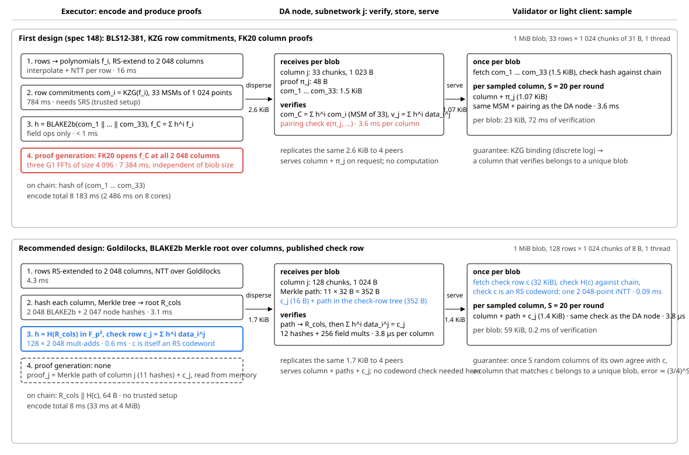

# Post-quantum, statistically secure Data Availability for Logos

Status: draft, 2026-09-25. Part 1 of 2; the statistical analysis follows.

## The first design, in one paragraph

The first Logos DA design arranges a blob as an $\ell \times k$ matrix of 31-byte chunks, commits each row with a KZG commitment, Reed–Solomon-extends the rows at rate $1/2$ to $n = 2k = 2048$ columns, and sends column $j$ to subnetwork $j$. A challenge $h$ is derived from the row commitments, and one KZG proof per column opens the combined polynomial $f_C = \sum_i h^{i-1} f_i$ at that column, so a DA node or a sampler verifies a column with $\ell$ scalar multiplications and one pairing (2–4 ms measured for a 1 MiB blob). Any $k = 1024$ verified columns reconstruct the blob. The sampling analysis (a hypothesis test over $S$ sampled columns with threshold $\tau$, grey zone $\Delta$, attacks A and B, replication $R$) was written against this layout and does not depend on the commitment scheme. What KZG gives that layout is one thing worth naming: the degree bound of the trusted setup makes "the committed rows are codewords" a computational fact, so a verifier never has to learn it from samples. KZG is not post-quantum (its binding reduces to a discrete-log-type assumption in BLS12-381) and needs a trusted setup; both go away in every option below.

## Possible post-quantum options

Every practical post-quantum option is hash-based: the only computational assumption left is the collision resistance of a hash function, and the rest of the argument is a probability over a random challenge or over the sampler's own choices. There is no post-quantum polynomial commitment that competes with a hash tree on verifier cost for this use.

**Check row over the column layout** (the Ligero proximity test; Hall-Andersen–Simkin–Wagner §9.1; ZODA in one dimension). Keep the matrix and the row-wise extension. Commit the $n$ columns under a Merkle root, derive a random challenge from the root, and publish the random linear combination of the rows as a *check row*, one field element per column. A verifier checks once per blob that the check row is a Reed–Solomon codeword, and per column that its column agrees with the check row. This is a drop-in for the existing layout: the column stays the unit of dispersal, storage and sampling, a DA node verifies a column on its own, and the per-blob object is the check row, 32 KiB.

**Full ZODA** (tensor code). Encode columns as well as rows and scale the matrix by a random diagonal derived from the row commitment; a sampled row or column then proves its own encoding, there is no separate check object, and the network overhead is the best known (about $4\times$ the original data at rate $1/2$ in both directions). The price is structural: samplers need rows *and* columns, and a row does not live in one subnetwork. This is the design to take if the service is ever rebuilt around a two-dimensional layout; Celestia's Fibre is the production data point.

**FRIDA** (FRI as an erasure-code commitment). The strongest formal treatment, including the list-decoding regime, but each sample carries $O(\log^2 n)$ Merkle paths through the FRI layers and every node verifies a FRI proof once. ZODA's comparison puts its network overhead at several hundred times the data. A reference for soundness statements, not a design for a service whose nodes are ordinary machines.

**STARK proof of encoding** (Ethereum's LeanDA direction). Hash trees over the encoded matrix plus a zkVM proof that the encoding is valid. Measured builder throughput is about 1 MiB/s on 32 cores and the proofs are hundreds of KiB, so it fails the many-blobs-per-block requirement by a wide margin. Worth watching, since Ethereum will fund the engineering.

**Lattice polynomial commitments** (Greyhound, Akita). Transparent and post-quantum, with KZG-like opening proofs, but the proofs are tens of KiB per column and verification takes milliseconds of lattice arithmetic. Strictly worse than the check row, which needs no opening proofs at all.

| Option | Fits the column layout | Per-blob object | Verdict |
| --- | --- | --- | --- |
| Check row | yes, drop-in | 32 KiB | recommended |
| Full ZODA | no | none | if rebuilt in 2-D |
| FRIDA | partly | FRI proof | reference only |
| STARK of encoding | yes | hundreds of KiB | too slow to build |
| Lattice PCS | yes | tens of KiB per column | dominated by the check row |

## Recommended design: one-dimensional ZODA (check row)

Keep the layout exactly: $k = 1024$, $n = 2048$ subnetworks, one column each, any $1024$ columns reconstruct. Replace the KZG objects as follows.

1. Chunks are elements of the Goldilocks field, $p = 2^{64} - 2^{32} + 1$; rows are RS-extended by an NTT. Call the extended $\ell \times n$ matrix $X$.
2. Merkle tree over the $n$ columns, root $R_{\text{cols}}$ (32 B).
3. Challenge coefficients $r_1, \dots, r_\ell$ derived from $R_{\text{cols}}$ in the quadratic extension $\mathbb{F}_{p^2}$ (128-bit).
4. Check row $c = r^{\top} X$, i.e. $c_j = \sum_i r_i X_{ij}$, one extension-field element per column (32 KiB per blob), with its own Merkle root $R_c$.
5. On chain: $R_{\text{cols}} \,\|\, R_c$, 64 B. Sampling starts only after this is on chain.

*Figure 1. The same three roles in the first design and in the recommended one: what disappears is the FK20 proof generation and the pairing per column (red); what appears is the check row (blue). Figure 2 (interactive): [da-animation.html](https://logos-blockchain.github.io/research/pq-da/da-animation.html) plays the same comparison stage by stage.*

A DA node verifies its column with two Merkle paths and one linear combination. A sampler downloads the check row once per blob, checks that it is a codeword (one inverse NTT, 0.09 ms), and then verifies sampled columns exactly as a DA node does.

Measured on the same machine, 1 MiB blob, single thread: encoder 8 ms against 8.2 s for the first design (the KZG encoder is dominated by the FK20 column proofs); column verification 3.8 µs against 3.6 ms; no trusted setup. Bandwidth per validator rises from about 23 KiB to about 59 KiB per blob at $S = 20$, entirely because of the check row; dispersal and DA-node traffic go down.

Soundness is the Ligero / ZODA argument in one dimension. Let $A^{*} = \{\, j : (r^{\top}X)_j = c_j \,\}$ be the set of columns that agree with the check row. If a sampler's $S$ columns all agree, then

1. most columns agree: $|A^{*}| \ge \tfrac{3}{4} n$, except with probability $(3/4)^S$;
2. the true combined row $r^{\top}X$ is therefore within distance $n/4$ of the codeword $c$;
3. by the proximity-gap theorem for Reed–Solomon codes, the whole matrix $X$ agrees on at least $\tfrac{3}{4} n$ columns with a unique codeword matrix $\tilde{X}$, except with probability about $n/|\mathbb{F}|$;
4. every column that agrees with $c$ is a column of $\tilde{X}$, except with probability about $n/|\mathbb{F}|$; steps 3 and 4 together give about $2n/|\mathbb{F}| \approx 2^{-116}$.

Position binding is the hash. Everything except the hash is an explicit probability, over the sampler's randomness in step 1 and over the challenge in steps 3 and 4.

## Why the statistics differ from KZG, and what has to be worked out

With KZG, consistency ("any $1024$ verifying columns decode the same blob") holds for every committed blob whatever fraction of its columns is withheld; the only threshold the sampling analysis had to care about was recoverability, $n/2$ of the columns. With an erasure-code commitment, consistency is *learned from samples*, and the theorem that delivers it (step 3 above) is proven only when at least $\tfrac{3}{4} n$ of the columns agree with the check row at rate $1/2$; under the Johnson bound $1 - \sqrt{1/2} \approx 0.293$ the requirement is $0.707\,n$ with larger error terms, and nothing is proven between there and $n/2$.

Where $1/4$ and $3/4$ come from: at rate $1/2$ the code has minimum distance $d \approx n/2$, so within distance $d/2 = n/4$ of any vector there is at most one codeword. The proximity-gap theorem (step 3) is proven with a negligible error term only up to that radius, and the uniqueness step (step 4) needs it too: $c$ and $r^{\top}\tilde{X}$ are both codewords within $n/4$ of the same vector, so they are equal. Hence the proximity parameter $\delta^{*} = 1/4$ turns into the threshold "at least $(1 - \delta^{*})\,n = \tfrac{3}{4}n$ columns agree", and $(3/4)^S$ is the probability that $S$ samples all miss a disagreeing set of size $n/4$. Two-dimensional ZODA has the same threshold in each dimension; it only makes samples cheaper. At rate $1/4$ the radius is $3/8$ and the Johnson bound reaches $1/2$.

That opens a region, between $n/2$ and $\tfrac{3}{4} n$ columns agreeing, where the withholding rule inherited from the sampling study accepts a blob as recoverable and no theorem says the agreeing columns are consistent. A cheating encoder that commits an inconsistent matrix and withholds the disagreeing columns looks, to every sampler, like an honest blob with those columns withheld. Nothing distinguishes the two without the theorem. For a blob with $74\%$ of its columns agreeing, just under the threshold, at the adversary calculator's defaults ($S = 20$, $\tau = 13$) a validator accepts with probability $0.88$; with $\tau = S = 20$ it is $2^{-8.7}$, with $\tau = S = 32$ about $2^{-14}$. Validators do not exchange opinions or fraud proofs, so each has to obtain the guarantee from its own samples.

Consequences for the statistical study:

- The hypothesis test has to be re-run with the reconstruction threshold at the consistency threshold, $K' = \tfrac{3}{4} n = 1536$, not $K = 1024$. Everything else in the calculators (Type I / Type II model, grey zone, network bounds, attacks A and B, the role of $R$ and $t$) carries over.
- A new curve, $(3/4)^S$, enters next to $\alpha(\tau)$ and $\beta(\tau, \Delta)$; a failed consistency check is conclusive, so $\tau$ never applies to it.
- The field constants of the proximity-gap theorem, and the Fiat–Shamir grinding they allow (about $1/\varepsilon$ attempts classically, $1/\sqrt{\varepsilon}$ with Grover), become additive constants in the Type I error; the exact constants for RS at rate $1/2$ over $\mathbb{F}_{p^2}$ have to be written out, and the Johnson-radius version decided.
- Whether the target of $10^{-4}$ per validator is meant to hold against a misencoding encoder, or only against withholding, decides $S$: with $\tau = S$ the former needs $S \ge 32$; with a grey zone it needs $S$ in the hundreds.

This is the part that needs work before a spec can be written, and it is where the study continues next week: the accept rule and sample size at $K' = 1536$, the proximity-gap constants, and the block-level check row (one check row per block instead of per blob) as the variant that removes most of the sampling overhead while keeping the 2048-subnetwork layout.

## References

- Hall-Andersen, Simkin, Wagner. Foundations of Data Availability Sampling. ePrint 2023/1079 (erasure-code commitments; §9.1 is the check-row construction).
- Evans, Mohnblatt, Angeris. ZODA: Zero-Overhead Data Availability. ePrint 2025/034.
- Ben-Sasson, Carmon, Kopparty, Saraf. Proximity gaps for Reed–Solomon codes. FOCS 2020, ePrint 2020/654.
- Ames, Hazay, Ishai, Venkitasubramaniam. Ligero. CCS 2017.
- Hall-Andersen, Simkin, Wagner. FRIDA: Data Availability Sampling from FRI. CRYPTO 2024, ePrint 2024/248; Mohnblatt et al., Extending FRIDA Beyond Unique Decoding for Free, ePrint 2026/1055.
- Meng, Wagner, Kadianakis, Risitano. PQ-DAS from LeanVM: design and benchmark. ethresear.ch, 2026-08.
- Celestia. Introducing Fibre. blog.celestia.org, 2026-01.
- Logos DA specifications of the first design (slugs 148, 136, 149) and the DA sampling calculators.
