# Total-Stake-Inference parameter selection

*Per-node network simulation of Cryptarchia Total Stake Inference (TSI). Simulator: `tsi-sim-pernode`. All runs at the true security parameter **k = 2160** unless noted; latency is in slots and **1 slot = 1 s**.*

*Section numbers (§1–§9, Appendices A–C) are stable identifiers — §3.2a and the appendix letters are cited from the simulator and from spec discussion, so they are preserved verbatim. Simulation code, configs and run data: [`tools/simulators/tsi/tsi-sim-pernode`](../../tools/simulators/tsi/tsi-sim-pernode).*

---

## Contents

- **[1. Executive summary](#s1)** — the problem, what was found, and the recommended configuration
- **[2. Model and method](#s2)** — what is simulated, and how accuracy is measured
    - [2.1 The TSI algorithm — before and after uncle references](#s2-1)
    - [2.2 The equilibrium is bounded by 1](#s2-2)
- **[3. Findings](#s3)** — the evidence, in the order a designer needs it
    - [3.1 The per-node estimate is consensus-safe](#s3-1)
    - [3.2 Latency biases TSI low; uncles recover it](#s3-2)
    - [3.2a The design band at high precision — `δ_max` 1–5](#s3-2a)
    - [3.3 When one uncle is not enough — the load `ρ`](#s3-3)
    - [3.4 The uncle window is set by block spacing, not by delay](#s3-4)
    - [3.5 The joint (W, U) region — the levers are hierarchical](#s3-5)
    - [3.6 Block rate `f` moves every threshold predictably](#s3-6)
    - [3.7 Network size erodes the one-uncle margin](#s3-7)
- **[4. Design equations and parameter-selection algorithm](#s4)** — the sizing rules, calibrated, with worked examples
- **[5. Discussion and caveats](#s5)** — the regime of validity, and what is not covered
- **[6. Robustness beyond the honest, deterministic regime](#s6)** — noise, attacks, and the incentive design
    - [6.1 Consensus survives network jitter](#s6-1)
    - [6.2 The estimator is a load-feedback loop](#s6-2)
    - [6.3 Grinding by uncle suppression](#s6-3)
    - [6.4 Block withholding](#s6-4)
    - [6.5 Dynamic withhold-then-rejoin grinding](#s6-5)
    - [6.6 Private-chain (selfish) withholding](#s6-6)
    - [6.7 Block and uncle rewards](#s6-7)
    - [6.8 A soft inclusion rule delivers the benefit without fork risk](#s6-8)
    - [6.9 Multiple coalitions and bribery](#s6-9)
    - [6.10 Fork rate and reorg depth](#s6-10)
    - [6.11 Organic stake churn and the wall-clock cadence](#s6-11)
- **[7. Parameter reference — what each knob does](#s7)**
    - [7.1 Protocol parameters](#s7-1)
    - [7.2 Network / environment parameters](#s7-2)
    - [7.3 Model and attack knobs (robustness probes)](#s7-3)
- **[8. Safest parameter selection and design](#s8)** — the recommendation and its rationale
    - [8.1 The selection](#s8-1)
    - [8.2 Design decisions and their rationale](#s8-2)
    - [8.3 Residual risks and open items](#s8-3)
    - [8.4 Capstone: the whole recipe, in one run](#s8-4)
    - [8.5 Recommendation vs the current spec](#s8-5)
- **[9. Reproducibility](#s9)** — how to re-run every study
- **[Appendix A — the residual ~1 % offset: on-chain rounding of `f`](#sA)**
- **[Appendix B — the per-epoch sampling-noise floor](#sB)**
    - [B.1 The mechanism](#sB-1)
    - [B.2 Measured: the ±0.9 % floor, shrinking as 1/√T](#sB-2)
    - [B.3 Delay converts the fluctuation into a one-sided under-count](#sB-3)
    - [B.4 What precision is meaningful](#sB-4)
- **[Appendix C — consensus properties in detail](#sC)**
    - [C.1 Per-epoch traces at the largest scale](#sC-1)
    - [C.2 Consensus rests on common initialization](#sC-2)

---

> **The uncle-reference model analysed here.** Uncle references are *counting-only* — they never affect a block's validity ([§6.7](#s6-7)–[§6.8](#s6-8)) — and are deduplicated by **slot**, not by block ([§8.5](#s8-5)). The reference window is derived from a **window absorption parameter**, `w_u = W_abs/f` with `W_abs = 10` expected block-intervals and bound `W_abs ≤ 0.6·k`, which is the `W = 300 = 10/f` sizing rule of [§3.4](#s3-4). One structural constraint shapes the results: only the **first block of a fork** — one whose parent lies on the referencing chain — is countable, which is the price of verifying every reference from chain data alone. This report calls that the **countable** model, and measures it against an **unrestricted** ceiling in which any orphan in the window is referenceable at any fork depth ([§2.1](#s2-1), [§3.2](#s3-2), [§9](#s9)) — a bound on what any counting rule could recover, not a candidate design, since the spec rejects a block carrying an entry that fails the rules. The result: **in the design regime `ρ < 1` the two are practically identical.** A dedicated 40-replicate **paired** sweep of the operating band (`δ_max` 1–5, `ρ ≈ 0.21–0.41`), in which both arms share the stake draw, the peering graph and every lottery outcome so the uncle rule is the only difference, puts every `U ≥ 1` cell of both models in 0.998–1.001 and pins the first-fork cost at **nothing measurable up to `δ_max` = 3 and ~0.1 % at `δ_max` = 4–5** ([§3.2a](#s3-2a)). Measured against the unrestricted baseline under common random numbers, the cost grows monotonically with load — 0.13 % at `ρ ≈ 0.36`, 0.34 % at `ρ ≈ 0.56`, 1.0 % at `ρ ≈ 0.96` and 2.3 % under overload at `ρ ≈ 1.76`, where recovery saturates near 0.95 against the unrestricted model's ~1.00. Deep forks are unrecoverable by construction, so past `ρ ≈ 1` the ceiling is set by the fork *depth* profile and **no uncle cap buys it back** — a second, independent reason for the [§8](#s8) "keep `ρ < 1`" rule. The closed-form accuracy with the measured effective utilization, `log(1−f)/log(1−f/q_u)`, predicts every countable cell to within 0.2 %.

<a id="s1"></a>
## 1. Executive summary

**The problem.** A Cryptarchia node wins the right to produce a block through a stake-weighted lottery, and the lottery's difficulty must be tuned to the total stake that is actively online — a number nobody can read directly, because participants join, leave, and fail without notice. Total Stake Inference (TSI) is the protocol's answer: every node keeps its own estimate `D̂` of the active stake and continuously corrects it against the one thing it can observe — how often blocks actually appear on chain.

**Why it matters.** If nodes disagree on the estimate, they disagree on who is allowed to produce blocks, and the chain can split. If the estimate is too low, the lottery becomes too easy — blocks come too fast, collide, and fork. And an attacker who could drag the estimate down would make the lottery cheaper for itself. So TSI must deliver three things at once: all nodes agree, the value is right, and nobody profits from bending it. This report tests all three by simulating every node individually — each with its own view of the network, its own estimate, and explicit message delays — at up to 32 000 nodes, with the network topology itself measured exactly up to one million nodes ([§3.7](#s3-7)).

**What we found**

1. **All nodes always agree.** In every run, at every network size and block rate tested (1 000–10 000 nodes at the production security parameter; to 32 000 in the size-scaling study, [§3.7](#s3-7); blocks every 10–30 s), all nodes computed *exactly* the same estimate — even though they constantly disagree about the newest blocks. The reason is structural: TSI measures a window buried deep in the finalized past, where every honest node sees identical history ([§3.1](#s3-1)). Two caveats keep this honest: agreement is not accuracy — nodes can unanimously agree on a wrong value (see next point) — and agreement is inherited from the common genesis value, not rebuilt: TSI maintains agreement but cannot repair a divergence that somehow arose ([Appendix C](#sC)).
2. **Network delay makes the estimate too low; uncle references fix it.** When blocks race, the losers ("orphans") drop off the chain and out of the count, so the network under-counts its own stake — by roughly a quarter to a third under Blend (the mix-network transport) delays, deepening with network size. The error is strictly one-sided: the equilibrium estimate is **bounded above by the true stake** — `D̂/D` cannot exceed 1 (no tested cell sits above 1 beyond sampling noise, which is why the accuracy plots are capped at 1; [§2.2](#s2-2)), so delay can only deflate the estimate, never inflate it. Letting each block also reference recent orphans ("uncles") puts them back into the count — counting *slots*, so a slot with two winners still counts once — and a single uncle reference per block restores the estimate to **exactly the true stake** (the recommended cap adds a one-uncle margin, [§8](#s8)) (the only residual is an optional ~1 % from on-chain rounding of the target rate, [§2.2](#s2-2)/[Appendix A](#sA)) ([§3.2](#s3-2)).
3. **Two sizing rules cover the deployments tested.** How many uncle slots a block needs (`U`) is dictated by the **load** — the number of blocks the whole network produces during the time one block needs to reach everyone (written `ρ`; formally `ρ = f·D_vis`, [§3.3](#s3-3)). The load counts the concurrent blocks each new block must be able to reference, and one uncle slot drains one of them per block — so `U` must be at least the load rounded up, plus one spare. How far back a block may reach for an orphan (`W`) is dictated by block spacing, not delay: about ten block intervals. The formal equations, their calibration, and worked examples are in [§4](#s4).
4. **Cheating doesn't pay.** Hiding blocks to deflate the estimate costs the attacker more than anyone else, heals within one epoch, and — for a full withdrawal — the lower estimate is simply the *correct* count of who is still participating ([§6.4](#s6-4)–[§6.5](#s6-5)). The one genuinely profitable attack is classic selfish mining, which needs roughly one-third of all stake and afflicts every Nakamoto-style chain, not TSI specifically; the damage it does to the estimate is *partly* repaired by the same uncle mechanism — about half of it against an optimally-played attack, because the counting rule can reach only the first block of each discarded fork ([§6.6](#s6-6)). One qualification matters for how that threshold is read: it bounds what an attacker *earns*, not what the estimate *loses*. An attacker content to earn what honest mining would pay it, rather than the selfish premium, can push the estimate substantially further down at no cost to itself — so somewhat above the one-third threshold the estimate is exposed to a wider set of strategies than the profit analysis alone would suggest ([§6.6](#s6-6), `fig37`). Rewarding uncles compensates the honest victims of delay and makes hiding strictly worse — but the reward must remain a bonus (a *soft* rule, never a validity requirement, which an attacker could turn into a tool for censoring or forking the chain), and the uncle + nephew rewards (the nephew reward pays the block that *includes* the reference) must together stay below one block reward, or deliberately orphaning one's own blocks becomes a business ([§6.7](#s6-7)–[§6.8](#s6-8)).
5. **Reorganisations stay shallow if the load stays low.** Forks are the cost centre: a deep reorg discards confirmed blocks. Fork depth grows with delay, and uncles keep it shallow (without them the deflated estimate over-produces blocks, and honest reorgs reach ~17 deep; with them, ~4). Against a private-chain attacker holding 10–30 % of stake trying to force the deepest reorg, keeping the load below one (few honest forks) keeps reorgs bounded and shallow (single digits to low tens of blocks even at 30 % stake) — but past that, at 30 % stake and heavy delay, fork-induced orphaning tips the attacker over an effective majority and reorgs become unbounded. The same "keep `ρ < 1`" rule that keeps the estimate accurate keeps reorgs shallow ([§6.10](#s6-10)).

*Method note: results come from the per-node simulator at the production security parameter k = 2160, with the robustness and size-scaling studies at a reduced k = 256 where noted; the sizing rules are semi-empirical (their form follows from the fork/orphan mechanism, their constants are fitted to the sweeps) and are derived under honest, deterministic-delay conditions — noise, attacks, and incentives are treated in [§6](#s6).*

**Recommended configuration** (Cryptarchia baseline f = 1/30, i.e. 30-second blocks; full rationale and residual risks in [§8](#s8)):

| parameter | value | basis |
|---|---|---|
| security `k` | 2160 | [§3.1](#s3-1) |
| block rate `f` | 1/30 (30 s) | protocol; [§3.6](#s3-6) |
| uncle window `W` | **300 slots** (= 10 block intervals) | [§3.4](#s3-4), [§4](#s4) |
| uncle cap `U` | the **load rounded up, plus one** (`⌈ρ⌉ + 1`) under Blend; **1** suffices for plain direct gossip | [§3.3](#s3-3), [§4](#s4) |
| TSI learning rate `β` | **1** (one-epoch tracking) | [§6.5](#s6-5) |
| operating point | keep the **load below one** block per propagation delay, with margin | [§6.2](#s6-2), [§6.3](#s6-3) |
| peering degree | **4 is fine for smaller networks (up to N ≈ 2×10⁵); ≥ 6 beyond** — degree 4 exhausts U = 1 near N ≈ 8×10⁵ | [§3.7](#s3-7), [§8](#s8) |
| uncle rewards | **soft** inclusion (never validity); substantial `w_u` (the uncle *reward*; not the spec's `w_u`, which is the uncle *window* — this report writes that `W`) with **`w_u + w_n < 1`** | [§6.7](#s6-7)–[§6.8](#s6-8) |

*"Load" (`ρ`) in this table is the quantity defined in finding 3 above: blocks produced network-wide per block-propagation delay, `ρ = f·D_vis` ([§3.3](#s3-3)). Keeping it below one means a single uncle slot per block can absorb every concurrent block; the `+1` in the uncle cap is the safety margin.*

This report runs in section order: from this summary to the model and counting rule ([§2](#s2)); the evidence behind each finding ([§3](#s3)); the design equations and selection algorithm ([§4](#s4)–[§5](#s5)); robustness against noise, attacks and the incentive design ([§6](#s6)); the per-knob parameter reference ([§7](#s7)) and the safest selection with residual risks and spec deltas ([§8](#s8)); and reproducibility ([§9](#s9)) with the appendices — the residual ~1 % `f`-rounding offset ([A](#sA)), the ±0.9 % per-epoch noise floor ([B](#sB)), and consensus detail ([C](#sC)).

---

<a id="s2"></a>
## 2. Model and method

*In one sentence: we rebuild the network node by node — every block reaches every node late, along realistic message paths, and each node keeps its own chain and runs its own estimator — so if nodes could disagree, this simulation would show it.*

Each of `N` nodes runs TSI on its **own** partial view. A global block tree is built under explicit message propagation: block `b` produced at slot `t` by node `p` becomes usable at node `j` after the propagation delay from `p` to `j`. Every node then computes its own canonical chain (the single chain it accepts as valid via the fork-choice rule; competing blocks become orphans), its own block density, and its own estimate `D̂`. The **primary model throughout this report is Blend** — the deployment target and the regime where the uncle parameters actually matter; direct gossip serves as the light-delay contrast:

- **`blend`** (primary) — a random d-regular peering graph over which a block is first relayed through `hops` random nodes (the Blend cascade (Sphinx-style relays)), each adding a `Uniform(0, δ_max)` blending delay, before a final network-wide gossip. Each cascade leg is a shortest-path hop **over the shared gossip graph** — a random relay is reached *through the network*, not by a direct link — and the final gossip floods to every node from the **last** relay, so a block's visibility is re-centred on a random node each time; the relays are blind forwarders, so only the producer sees its own block early. The dominant delay is the per-hop blending `δ_max` (`blend_delay_max`), in **whole seconds** — this is where forks, and therefore the uncle cap `U` (uncle slots per block; [§3.3](#s3-3)) and the uncle window `W` (how far back a block may reference an orphan, in slots; [§3.4](#s3-4)), matter.
- **`regular`** (contrast, detail) — plain direct gossip over the same graph; a block reaches a node after the shortest weighted path (geographic per-link latency). Realistic links are **sub-slot** (~40–200 ms), so forks are rare and even `U = 0` nearly suffices — the delay-free limit against which blend is judged.

Transport uses the **`geo`** distribution — a real-world geographic band mixture (short intra-region links, long inter-continental ones), the "natural" latency used throughout. The design laws of [§4](#s4) reach transport latency only through its *mean* — it enters solely via the mean path latency `ℓ_mean`, which feeds the mean visibility delay `D_vis = hops·δ_max/2 + (hops+1)·ℓ_mean` that the laws are actually written in ([§3.3](#s3-3)) — and this was tested directly: re-running the N = 1 000/4 000 grid with **exponentially distributed** links at the same mean leaves consensus untouched (spread 0, agreement 1.000) and every `U ≥ 1` cell identical within noise (≈ 0.99–1.01, means 1.001 exp vs 1.001 geo); only the *un-recovered* `U = 0` depth moves a few points (up to +0.09 shallower under exp, whose median link is shorter than its mean). Latency shape is a second-order effect confined to the regime the design avoids anyway. Both distributions draw each link **independently**, so this probes the latency *marginal*, not its spatial structure — geographically **correlated** latency (regional clustering that lets co-located nodes fork as a bloc) is not modelled; in the primary Blend regime the per-hop mixing delay dominates the geographic link term, so this is expected to remain second-order, but it is untested ([§8.3](#s8-3)). A third topology, **`full_mesh`** (single-hop, uniform latency), reproduces the reduced analytic model (the simplified companion model that collapses the network to one chain and one scalar estimate; [§5](#s5)) inside this engine and was used only for cross-validation — no figure in this report derives from it.

**Who holds the stake.** Real stake is concentrated: a few large holders own most of it. We model this with a **Pareto** ("80/20") distribution — roughly 20 % of nodes hold 80 % of the stake — in every headline sweep, with equal-stake runs as a control. The exact split matters little to TSI, for a simple reason: the lottery hands a set of nodes wins in proportion to their *summed* stake, and TSI counts only the *total* number of blocks — so two different ways of splitting the same total stake produce statistically the same block density. Measured: consensus is identical under equal and Pareto stakes (spread 0, agreement 1.000 in both) and accuracy with uncles is indistinguishable. The equal-stake control (`runs/2026-07-24_090114_default`, N = 400, blend) has no cell-matched Pareto counterpart, so the *un-recovered* `U = 0` level is not compared across stake distributions here; the mechanism argument — concentrated stake means fewer *distinct* simultaneous winners, and a producer that wins twice does not fork with itself — remains untested at matched cells. Tail weight *was* tested at matched cells: re-running the N = 1 000/4 000 grid with a lighter Pareto tail (Lomax index 1.33 instead of 1.16) leaves consensus and every `U ≥ 1` cell unchanged within noise, and moves the *un-recovered* `U = 0` under-count by at most 0.025 (mean |Δ| = 0.012 over the four matched `U = 0` cells, 1.33 marginally *deeper*, each cell within ≈ 1.5 SEM) at k = 256 — less concentration means more *distinct* simultaneous winners, hence more forks to recover. The one place concentration could still matter is adversarial: a *whale* coalition's reward statistics are lumpier than a random coalition's, flagged as untested in [§6.5](#s6-5).

**How we measure.** Every epoch, every node reports its own estimate. The first epochs of a run are a start-up transient — the estimate walking from its genesis guess to equilibrium — so we **discard the first half of every run ("50 % burn-in") and average over the remaining epochs**; each configuration is then repeated with several independent random seeds ("replicates") and averaged over those too. "Equilibrium" values in this report always mean that double average. *(The burn-in is a **measurement convention, not part of the protocol.** TSI itself just runs its recursion once per epoch, forever — each node's live estimate is simply the latest update, with no discarding or averaging. Burn-in is the standard steady-state-simulation technique of dropping the warm-up transient so a single reported number reflects the estimator's equilibrium, not its cold start; averaging the tail epochs and replicates additionally beats down the ±~0.9 % per-epoch sampling noise of [Appendix B](#sB) to the ±0.1–0.2 % standard errors quoted here. The 50 % cut is deliberately conservative — the estimator actually converges in ~2 epochs, [§3.2](#s3-2).)* Four quantities are tracked:

- `D̂/D` — **accuracy**: the estimate divided by the true active stake. 1.0 = exact. With correct slot-counting ([§2.1](#s2-1)) and enough uncle slots the equilibrium is **1.0**; the only residual is an optional ~1 % from the on-chain integer rounding of `f` ([Appendix A](#sA)).
- `range_ratio` — **disagreement**: the highest minus the lowest node estimate, in `D̂/D` units. 0 means every node holds *exactly* the same value.
- `agreement_window` — **consensus on the measurement**: the fraction of nodes whose finalized measurement window contains exactly the same blocks — i.e., who count the same density. 1.0 = unanimous.
- `agreement_tip` — **consensus on the newest block**: the fraction of nodes currently sitting on the most common chain tip. This can be far below 1 while all of the above are perfect — nodes race over the newest blocks yet have long agreed on the finalized past ([§3.1](#s3-1)).

<a id="s2-1"></a>
### 2.1 The TSI algorithm — before and after uncle references

**The question.** What exactly does TSI compute, and what changed when uncle references were added to the protocol?

**Why it matters.** Everything in this report — the under-count, the recovery, the parameter rules — follows from one design invariant and how the two protocol versions honour it; the report should be readable without the spec at hand.

**The design invariant: one count per slot.** The slot lottery is calibrated so that *slots* activate at rate `f` — the probability a slot produces at least one block is `f`. Crucially a slot can have several winners (two nodes independently win the same slot), and the calibration counts such a slot **once**. TSI must count the same way, or a busy slot with two winners would read as more stake than a slot with one. So the quantity TSI infers stake from is the number of *occupied slots* in the window, not the number of blocks.

**The algorithm.** Once per epoch each node measures the occupied-slot count `m` in the finalized window of `T` slots and nudges its estimate toward the target `f_p` (the block rate `f` as the on-chain integer rounding stores it):

```python
m       = occupied slots counted in the window   (which slots count differs by version — below)
D̂_next  = max(1, D̂ · (1 − β·(f_p − m/T)/f_p))     β = learning rate (deployed: 1)
```

Occupied slots more frequent than the target push the estimate up (the lottery then gets harder); less frequent pulls it down; `m/T = f_p` is the resting point. The two versions differ **only in which slots count**:

- **Before uncle references (spec v1.0):** `m` counts only slots occupied by the *canonical* chain. Under Blend delay roughly a third of honest blocks are orphaned, so their slots vanish from `m`, the resting point sits far below truth (`D̂/D ≈ 0.64–0.74`, deepening with network size), and the deflated estimate makes the network *chronically over-produce* blocks at up to ~2× the target rate ([§3.2](#s3-2), fig1). Pre-uncle TSI is not viable under Blend.
- **With uncle references, counting whole blocks (the *unrestricted* model):** `m` also counts the *referenced uncles* — orphans pointed at from the canonical chain — which puts the delay-orphaned slots back into the count and lifts the resting point up toward `D`. Any orphan in the reference window is eligible regardless of how deep in a fork it sits, and references are deduplicated by *block identity*. This report analyses it throughout, and calls it the **unrestricted** model — but as a *ceiling*, not as a design alternative. The spec gates uncle validity: a block carrying an entry that fails the counting rules is **rejected** outright (*Block Header Validation* step 10), so a chain in which deep-fork orphans are referenced cannot exist. The unrestricted arm therefore measures the unreachable upper bound on what any counting rule could recover, and every "countable vs unrestricted" comparison below should be read as "what the deployed rule recovers, against the most any rule could".
- **With uncle references, counting slots under the first-fork restriction (the *countable* model — the rules analysed here):** two changes. First, deduplication is by **slot**, not by block: a referenced uncle sharing a slot with a canonical block, or with another counted uncle, adds nothing. Second, only the **first block of a fork** — one whose parent lies on the referencing chain — is countable, which is what makes every reference verifiable from chain data alone (deeper fork blocks would need the fork branch's ledger state). References never affect a block's validity; they are *counting-only*, the soft-rule property the incentive analysis requires ([§6.7](#s6-7)–[§6.8](#s6-8)). The reference window is *derived* from a **window absorption parameter**, `w_u = W_abs/f` with `W_abs = 10` expected block-intervals and bound `W_abs ≤ 0.6·k` — the `W = 10/f` sizing rule of [§3.4](#s3-4). The price of chain-only verifiability is that deep-fork orphans are unrecoverable by construction; [§3.2](#s3-2) measures what that costs, and the answer is nothing in the design regime and a bounded ceiling under overload.

Slot deduplication is what makes the recovered equilibrium exactly 1.0 rather than a ceiling above it. Counting uncle *blocks* instead double-counts same-slot co-winners (one canonical, one referenced orphan) and inflates the equilibrium by the fixed multi-winner factor `c(f) ≈ 1.017` — a genuine accuracy bias, not a simulation artefact. Every result in this report uses the slot count; where a figure or table compares the two referencing models, the unrestricted baseline is labelled as such ([§9](#s9)).

<a id="s2-2"></a>
### 2.2 The equilibrium is bounded by 1

**The question.** Slot-counting settles the resting point at `D` ([§2.1](#s2-1)). Can the estimate sit *above* the true stake — and does the epoch-to-epoch jitter around the resting point cost nodes winning probability?

**Why it matters.** The estimate is the lottery's divisor: each node's per-slot win chance is `φ = 1 − (1−f)^(w_i/D̂)` (`w_i` = the node's stake). Whatever moves `D̂` moves every node's chance of winning slots — and with it block rewards and the pace of the chain.

**It cannot exceed the true stake.** TSI counts *occupied slots*, and a window can hold no more occupied slots than actually occurred, so the counted density is capped at the true rate `f` and the equilibrium `D̂/D` is **bounded by 1** — it recovers *up to* exactly 1 (full uncle recovery) and sits below it when delay orphans slots faster than uncles restore them ([§3.2](#s3-2)). The old `c(f) ≈ 1.017` ceiling above 1 was an artefact of counting uncle *blocks*; slot-counting removes it ([§2.1](#s2-1), [Appendix A](#sA)). Around that bounded equilibrium each epoch's finite-window measurement carries ≈ ±0.9 % sampling noise (`√((1−f)/(f·T))` at k = 2160), which averages out over the burn-in ([Appendix B](#sB)) and is *fairness-neutral* — all nodes share the same `D̂`, so relative win rates are untouched; only the block pace breathes by ±0.9 % epoch to epoch, with no systematic bias.

**The one residual bias is the on-chain rounding of `f`, and it is optional.** The spec stores the target as a three-decimal on-chain integer, `f_p = 0.033` rather than `1/30`, and driving the density to `f_p` leaves the estimate high by the fixed factor `f/f_p ≈ 1.010`. It is common to every node, so fairness is untouched; it is removed by carrying `f` at higher precision, and **this report's estimator drives the density to exact `f`, so every result here is unbiased**. This is the *only* systematic offset from 1 that the counting fix leaves — and the sole reason a deployed `D̂/D` would read ≈ 1.01 rather than 1.00. [Appendix A](#sA) derives it and sizes the one-constant spec change that removes it ([§8](#s8) row 14).

---


<a id="s3"></a>
## 3. Findings

Seven findings, in the order a designer needs them: nodes agree ([§3.1](#s3-1)); delay biases the estimate low and uncles fix it ([§3.2](#s3-2)); when one uncle is not enough ([§3.3](#s3-3)); how wide the reference window must be ([§3.4](#s3-4)); how the two levers combine ([§3.5](#s3-5)); what changes with the block rate ([§3.6](#s3-6)); and how network size erodes the one-uncle margin ([§3.7](#s3-7)). Each finding is stated first; the tables and figures carry the evidence.

<a id="s3-1"></a>
### 3.1 The per-node estimate is consensus-safe — with and without uncles

**The question.** Do all nodes compute the *same* estimate — including when blocks carry uncle references?

**Why it matters.** If nodes disagreed on `D̂` (the per-node estimate of the active stake), they would disagree on who is allowed to produce blocks — a consensus split; and the uncle mechanism this report recommends must not be able to cause one. This is the precondition every later finding stands on, which is why it comes first.

**Result: agreement is exact, at every uncle cap tested (`U` = 0…3).** At the full security parameter k = 2160, the highest and lowest node estimates are identical (spread exactly 0) and **window agreement** — the fraction of nodes that count *exactly the same finalized blocks* in their measurement window — is 1.000, across all network sizes, block rates (10–30 s), and uncle caps:

| N | 1 000 | 2 000 | 5 000 | 10 000 |
|---|---|---|---|---|
| `range_ratio` (spread of `D̂/D`) | 0 | 0 | 0 | 0 |
| `agreement_window` | 1.000 | 1.000 | 1.000 | 1.000 |

Nodes *do* disagree about the newest blocks (tip agreement dips to ~0.96 in the worst cell) — but TSI never reads the newest blocks: it measures a window buried far past k-finality (blocks deeper than `k` are final — no honest node ever reorganises them), where all honest nodes provably hold identical history, uncle references included. **Consequence:** TSI can be treated as one global estimate, adding uncle references (and paying rewards for them) does not endanger that, and the rest of this report may speak of "the" estimate in the singular. Per-epoch traces at N = 10 000, the tip-agreement detail, and why an injected disagreement would *not* heal itself are in **[Appendix C](#sC)**.

<a id="s3-2"></a>
### 3.2 Latency biases TSI low; uncles recover it to exactly 1

**The question.** How accurate is the agreed-upon estimate — and do uncle references actually earn their place in the protocol?

**Why it matters.** An estimate that is too low makes the lottery too easy — blocks come faster than the target, collide more, and the safety margin erodes; this section measures how much accuracy is lost to network delay and how much of it uncles buy back.

**The mechanism in one line.** When two blocks race, the loser (an "orphan") drops off the chain — and out of the block count that TSI reads — so the network systematically under-counts its own stake; an **uncle reference** lets a later block point at a recent orphan and put it back into the count.

**Result: without uncles the estimate is 26–37 % low; one uncle recovers it fully.** Full-scale measurement under Blend (`D̂/D` = accuracy, the estimate over the true stake; each entry the mean over all sweep cells — every degree × link-latency × blending-delay combination, 6–20 replicates, equilibrium protocol of [§2](#s2); the N = 1 000/2 000 and N = 5 000/10 000 rows are pooled from two sweeps run on *different* grids — link-latency {0.1–1.0} slots × U ≤ 3 for the smaller sizes, {0.5} slot × U ≤ 2 for the larger — so the four rows are not measured on a single common grid, though the monotone deepening also holds on the matched 0.5-slot subgrid, 0.721/0.688/0.650/0.635):

| N | `D̂/D`, U = 0 | `D̂/D`, U ≥ 1 |
|---|---|---|
| 1 000 | 0.739 | 1.000 |
| 2 000 | 0.722 | 1.000 |
| 5 000 | 0.650 | 0.999 |
| 10 000 | 0.635 | 1.000 |

The U = 0 under-count **deepens with N** (more nodes → more concurrent proposals → more orphans). One uncle restores accuracy to **exactly 1** at every size *in this sweep* (`fig2`) — because its delay grid keeps the load `ρ` (blocks produced per propagation delay, [§3.3](#s3-3)) below one; [§3.7](#s3-7) shows that at much larger N, sparse peering pushes `ρ` past what one uncle can drain, and U = 1 stops sufficing.

**Why exactly 1 (and not a ceiling above it):** because TSI counts *occupied slots*, not blocks ([§2.1](#s2-1)). The lottery activates slots at rate `f`; uncles put the delay-orphaned slots back into the count, one per slot, and never double-count a slot that already has a canonical block — so holding the counted slot density at `f` settles the estimate at `D`. Verified in isolation at zero network delay, where the only orphans are same-slot co-winners: the committed `U = 0` series (full mesh, `L = 0`, `runs/fluctuation_u0.parquet`, [Appendix B.2](#sB-2)) sits at `D̂/D = 0.9997 ± 0.0085` (k = 2160, per-epoch σ over 4 × 120 epochs), and a matching `U = 2` arm at the same settings lands at `1.000` — the co-winner slots are counted once, not twice, so no ceiling appears (the `U = 2` arm was run ad hoc and is not committed; recipe in [§9](#s9)). (The remaining ~1 % offset the deployed estimator carries comes only from the on-chain integer rounding of `f`, [§2.2](#s2-2) / [Appendix A](#sA).)

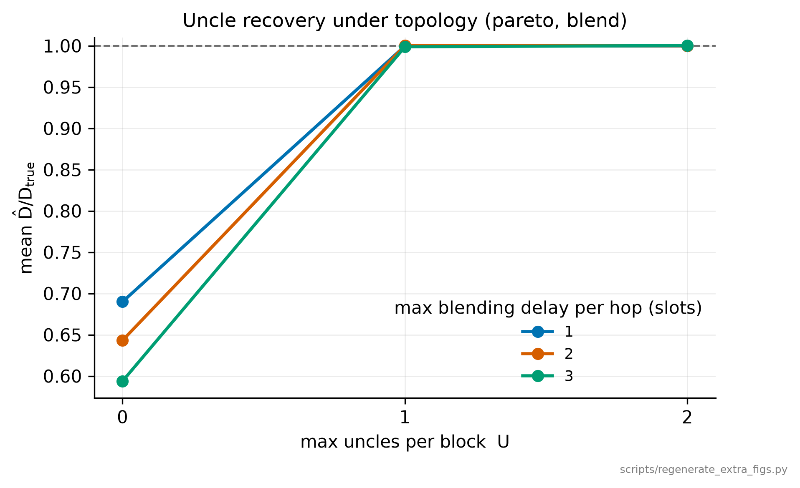

**What the first-fork restriction costs.** The delay × U grid is run under both referencing models with **common random numbers** (`configs/countable-vs-old-paired.yaml`, 20 replicates, N = 1 000, blend, 3 hops; [§9](#s9)): a countable cell and its unrestricted twin share the stake draw, the peering graph and every lottery outcome, so the uncle rule is the only difference and each replicate is a matched pair. Cells are replicate means ± SEM; the gap and its `t` come from the 20 per-replicate differences.

| `δ_max` (s) | ρ | `U=0` (both) | `U=1` countable / unrestricted | `U=2` | `U=4` | pooled gap (t) |
|---|---|---|---|---|---|---|
| 4 | ≈ 0.36 | 0.674 | 0.9975 / 0.9989 | 0.9977 / 0.9991 | 0.9996 / 1.0005 | −0.0013 (4.0) |
| 8 | ≈ 0.56 | 0.506 | 0.9962 / 0.9995 | 0.9960 / 0.9996 | 0.9958 / 0.9989 | −0.0034 (9.8) |
| 16 | ≈ 0.96 | 0.298 | 0.9582 / 0.9610 | 0.9876 / 0.9998 | 0.9883 / 1.0002 | −0.0102 (17.5) |
| 32 | ≈ 1.76 | 0.227 | 0.585 / 0.572 | 0.9394 / 0.9821 | 0.9539 / 1.0005 | −0.0228 (22.4) |

**The negative control is exact.** With `U = 0` no reference is ever taken, so under shared streams the two arms must be bit-identical rather than merely close: **all 80 replicate pairs differ by exactly 0.0**, at every delay.

**The cost grows monotonically with load**, and is resolved at every delay: 0.13 % at `ρ ≈ 0.36`, 0.34 % at `ρ ≈ 0.56`, 1.0 % at `ρ ≈ 0.96`, 2.3 % at `ρ ≈ 1.76`. Eleven of the twelve `U ≥ 1` cells resolve individually (the exception is `U = 4` at `δ_max = 4`, `t = 1.07`), and the largest, `t = 29.0`, clears the Bonferroni threshold of 2.87 for twelve tests by an order of magnitude. At the design end the effect is small enough that it took pairing to see it at all — the earlier unpaired 5-replicate grid found nothing below `δ_max = 16` — and [§3.2a](#s3-2a) reaches the same `δ_max = 4` figure (−0.0013 at 20 replicates here, −0.0011 at 40 there) from an independent sweep.

**At `U = 1` under overload the sign flips**, and this is the one place the countable rule *wins*: at `δ_max = 32` it reads 0.585 against 0.572, a gap of **+0.0127 (t = 7.6), positive in 19 of 20 pairs**. Both models have collapsed there — one uncle slot cannot drain `ρ ≈ 1.76` — but when capacity is the binding constraint, the countable rule's occupied-slot exclusion means its single reference always recovers a *new* slot, whereas the unrestricted rule deduplicates by block id and can spend its one reference on an orphan whose slot is already counted, recovering nothing. The measured recovery agrees: `q_u` = 0.591 countable against 0.579 unrestricted. So the slot-vs-block distinction of [§2.1](#s2-1) is worth most exactly where references are scarcest.

**Everywhere else the restriction dominates**, and it bites hardest through the fork *depth* profile rather than capacity: raising `U` from 2 to 4 at `δ_max = 32` moves the countable model only 0.939 → 0.954 while the unrestricted model reaches ~1.00. The ceiling is the measured recovery rate `r` (0.92 at `δ_max = 32`, `U = 4`), so no uncle cap buys it back. The closed form `D̂/D = log(1−f)/log(1−f/q_u)` with the measured `q_u = q + (1−q)·r` predicts every countable cell to within 0.2 % (`fig31`).

`fig32` shows `r` and the residual `1−r` per delay, rising from 0.3 % to 8.1 % of the waste as `δ_max` goes 4 → 32 at `U = 4`. That residual is the *combined* first-fork and capacity loss — the simulator cannot separate the two, because the restriction acts at selection (a deep orphan is simply never referenced) rather than at counting.


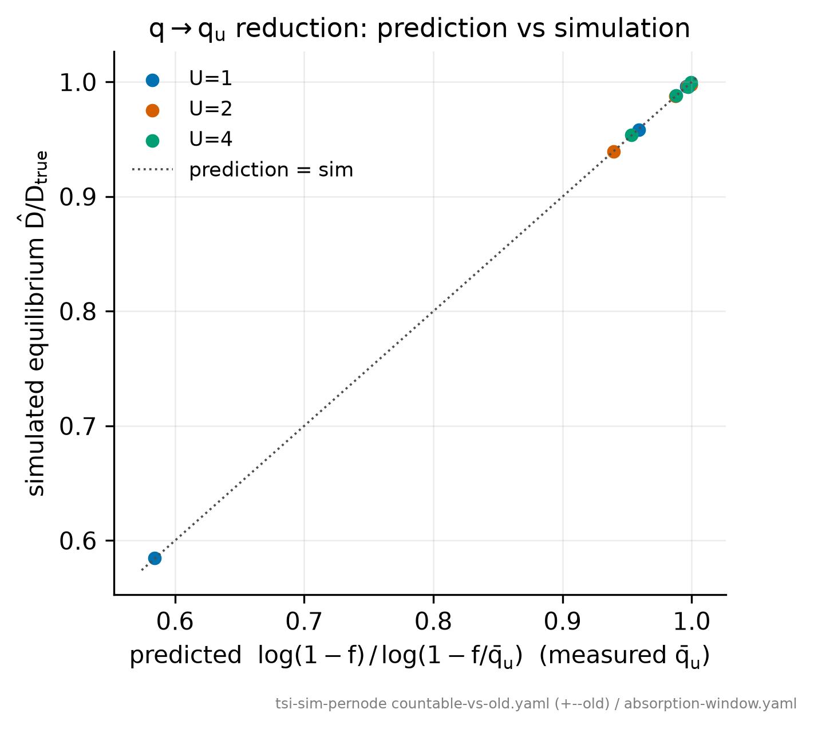


**Bootstrap is self-limiting — but only with uncles** (`fig1`; full scale, k = 2160, Blend, N = 1 000 and 5 000, genesis guesses 0.01×–2× the true stake; 0.1×–2× at N = 5 000). With uncles (U = 2, solid lines) the cold start is a non-event: whatever the guess, block production snaps back to the target `f` within ~2–2.5 epochs and the estimate lands on 1.0 by epoch 2 — identically at both network sizes. Without uncles (U = 0, dashed) the system also converges from any guess, **but to the wrong place**: the estimate settles below truth (mean ≈ 0.58× across guesses, ranging ≈0.48–0.85; ≈0.51× at N = 5 000) and the network then *chronically over-produces* blocks at ~1.85× the target rate (~2.0× at N = 5 000) — the [§6.2](#s6-2) load feedback in the flesh (a low estimate makes the lottery easier, extra blocks orphan, the count stays low). So uncle references are load-bearing from the very first epochs: they are what makes the bootstrap end *at the truth* rather than at a permanently overheated equilibrium.


<a id="s3-2a"></a>
### 3.2a The design band at high precision — `δ_max` 1–5

**The question.** [§3.2](#s3-2) samples the mixing delay at 4/8/16/32 with five replicates. That resolves the overload regime, but it leaves the band the parameters are actually chosen in measured at four-fold spacing and low power — enough to say "no difference detected" and nothing more. How accurate is TSI across `δ_max` = 1–5, and how large a first-fork cost can be *excluded* there?

**The finding.** One uncle slot holds the estimate at the true stake across the whole band: every `U ≥ 1` cell under both referencing models lands in **0.998–1.001**, flat in delay, while the uncle-free baseline decays 0.806 → 0.623. The first-fork restriction costs **nothing measurable up to `δ_max` = 3** and about **0.1 %** at `δ_max` = 4–5.

**The design is paired.** The two referencing models normally draw independent RNG streams — `uncle_model` is part of the config key, which is what lets `--old` bit-reproduce earlier runs ([§9](#s9)) — so a comparison pays the between-run variance twice and the arms differ in stake draw, peering graph and every lottery outcome. `configs/fine-delay-paired.yaml` sets `paired_streams`, which derives the RNG root from the model-independent part of the key: both arms then get the **same stake, the same graph and the same lottery draws**, and the uncle rule is the only difference. Each replicate becomes a matched pair, the shared variance cancels, and the test is a one-sample t on the 40 per-replicate differences. Trajectories still diverge after epoch 0 through the genuine feedback — a different counted density changes the next epoch's difficulty — which is the effect being measured, not noise. Grid: `δ_max` ∈ {1,2,3,4,5}, `U` ∈ {0,1,2,4}, 40 replicates, N = 1 000, blend, 3 hops, spanning `ρ ≈ 0.21` to `0.41`.

| `δ_max` (s) | ρ | `U=0` (both models) | `U≥1` countable | `U≥1` unrestricted | pooled gap (t) |
|---|---|---|---|---|---|
| 1 | ≈ 0.21 | 0.806 | 0.9995 – 1.0004 | 0.9990 – 1.0010 | −0.0003 ± 0.0005 (1.1) |
| 2 | ≈ 0.26 | 0.763 | 0.9993 – 0.9996 | 0.9996 – 1.0003 | −0.0004 ± 0.0005 (1.8) |
| 3 | ≈ 0.31 | 0.723 | 0.9993 – 0.9997 | 0.9992 – 1.0004 | −0.0003 ± 0.0004 (1.4) |
| 4 | ≈ 0.36 | 0.668 | 0.9982 – 0.9997 | 0.9995 – 0.9999 | **−0.0011 ± 0.0004 (4.7)** |
| 5 | ≈ 0.41 | 0.623 | 0.9986 – 0.9992 | 0.9995 – 1.0003 | **−0.0009 ± 0.0005 (3.7)** |

**The negative control is now an identity check.** With `U = 0` no reference is ever taken, so under shared streams the two arms must produce *bit-identical* trajectories — not merely agree within noise. They do: **all 200 replicate pairs differ by exactly 0.0**, at every delay. That is a far stronger validation than the unpaired design could offer, where the same control only had to agree within a ±0.025 band and in fact drifted by 0.016.

**What pairing bought.** Per-cell standard errors shrink by a median factor of 1.6 (range 1.2–2.1), taking the widest 95 % CI from ±0.0015 to **±0.0010**. Five of the fifteen `U ≥ 1` cells now resolve at |t| ≥ 2 against 0.75 expected by chance, and the largest (`U = 2`, `δ_max = 4`, t = 4.32) clears the Bonferroni threshold of 2.94 for 15 tests. The unpaired sweep resolved only `δ_max = 5`, and only after pooling.

**The cost is a step, not a ramp.** Pooling across the three uncle caps — separate draws of the same underlying difference — `δ_max` 1–3 stay unresolved (t = 1.1, 1.8, 1.4) and then **`δ_max` = 4 and 5 both resolve**, at −0.0011 (t = 4.7) and −0.0009 (t = 3.7). Over the whole band the pooled gap is −0.00060 ± 0.00021, **t = 5.7** — comfortably resolved, where the unpaired estimate of the same quantity (t = 2.8) did not survive correction. So the restriction switches on somewhere around `δ_max` ≈ 4 rather than growing smoothly with delay, and above that it sits near 0.1 % without deepening across the band tested. Measured against the exact target 1.0 instead of against the other arm — a more sensitive view of the same countable data, not independent evidence — the same picture appears: the unrestricted model has 1 of 15 cells below 1 (chance), the countable model has 5, all at `δ_max` 4–5.

**How big is 0.1 %.** An order of magnitude below the ±0.9 % per-epoch sampling noise of [Appendix B](#sB), and below the ~1 % fixed-point rounding bias of [Appendix A](#sA). The [§1](#s1) statement that one uncle restores the estimate to the true stake holds at the precision that matters; this section puts the residual at ~0.1 % at the top of the band rather than at zero.


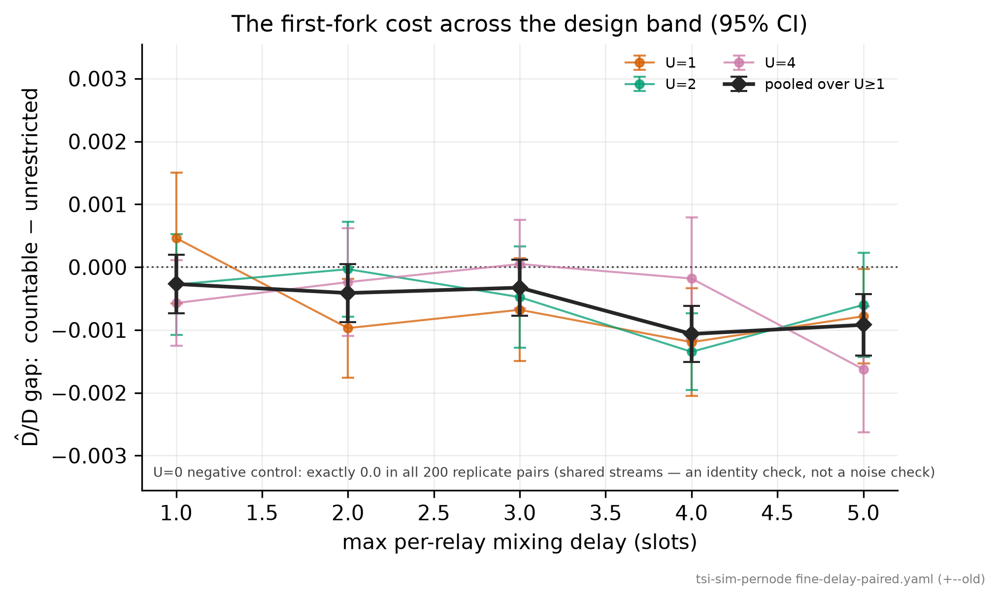

**What this settles.** One uncle slot is sufficient everywhere in the operating band under either referencing model — the [§3.3](#s3-3) `U ≥ ⌈ρ⌉` rule has margin to spare at `ρ ≤ 0.41`, and raising `U` past 1 does not remove the residual (all three caps show the same ~0.1 % shortfall at `δ_max` = 4–5, so it is not a capacity limit). And the first-fork restriction, which [§3.2](#s3-2) shows costing 1.4 % at `ρ ≈ 1` and 5 % under overload, costs **about 0.1 %** at the top of the design band and nothing measurable below it.

<a id="s3-3"></a>
### 3.3 One uncle is not always enough — the load `ρ`

**The question.** [§3.2](#s3-2) showed a single uncle slot sufficing across its delay grid. When does that stop — how much delay can one uncle slot actually handle?

**Why it matters.** Blend's per-hop blending delay is a privacy knob that may be turned up after deployment; the protocol needs to know at which point every extra second of delay demands another uncle slot.

**The intuition.** One uncle slot per block can absorb one orphan per block — so it keeps up only while the network creates orphans no faster than that. The deciding number is the **load** `ρ`: how many blocks the whole network produces during the time one block needs to become visible everywhere. The symbols used below, in one place:

| symbol | meaning |
|---|---|
| `f` | block rate (blocks per slot; `1/30` = one block every 30 s) |
| `ℓ_mean` | mean gossip path latency between two nodes (slots) |
| `hops`, `δ_max` | Blend cascade length and the per-hop blending-delay bound (mean per-hop delay = `δ_max/2`) |
| `D_vis` | mean **visibility delay** = `hops·δ_max/2 + (hops+1)·ℓ_mean` under Blend (plain gossip: just `ℓ_mean`) |
| **`ρ`** | **load** = `f·D_vis` — blocks produced per visibility delay = orphans each canonical block must absorb |
| **`U`** | **uncle cap** = uncle slots per block ([§3.3](#s3-3)) |
| **`W`** | **uncle window** = how far back a block may reference an orphan, in slots ([§3.4](#s3-4)); distinct from `T`, the measurement window of [§2.1](#s2-1) |

**Result: one uncle works up to `ρ ≈ 1`, and nothing else stretches that.** Accuracy at U = 1, plotted against `ρ` for **every** block rate and delay tested, collapses onto a single curve that breaks at `ρ ≈ 1` (`fig6`, right): **U = 1 recovers iff `ρ ≲ 1`.** Two bounds govern the cap: `U < ρ` **never** recovers (orphans arrive faster than they can be referenced; the queue grows without bound and no window helps) — a hard necessary condition; and empirically `U ≈ ⌈ρ⌉` (the load rounded up) *suffices*, with a one-uncle margin needed near integer `ρ` because the true concurrency window is about `2·D_vis`, not `D_vis` (the factor a ≈ 2 in eq. 4′, [§4](#s4)).

Sweeping the delay directly (`fig16`) makes the law visible: accuracy sits at 1.0 until the load crosses the uncle cap, then falls off — `U = 0` collapses immediately, `U = 1` holds to `ρ ≈ 1` (`D_vis ≈ 30` s), `U = 2` to `ρ ≈ 2` (`≈ 60` s), and `U = 3` across the whole tested range.

![Fig 16 — recovered relative stake D̂/D vs mean visibility delay D_vis (Blend, f=1/30; N = 800, degree 8, uniform stake, 5 replicates at a reduced k = 48 so the delay axis could be swept densely): each uncle cap U holds accuracy at 1.0 until ρ=f·D_vis exceeds U, marked at ρ=1, 2. The reduced k widens the per-epoch sampling noise, so a few U ≥ 1 points sit fractionally above the 1.0 line (largest 1.016 ± 0.011 at D_vis ≈ 14 s, < 2 SEM) — the ≤ 1 bound itself is resolved at k = 256 with 20 replicates in `fig26` below.](report-figures/fig16_stake_vs_delay.png)


The full sweep behind `fig3` spans hops 3–6 × per-hop budget 4–32 s × `U ∈ {0, 1, 2, 4}` at both N = 1 000 and N = 2 000. Note the axes show the *per-hop* budget — the total mean delay is what matters, e.g. 3 hops at `δ_max = 8` mean 3·4 = 12 s of blending plus ≈ 5 s of gossip → `D_vis ≈ 17` s (`ρ ≈ 0.56`), while 6 hops at `δ_max = 32` reach `D_vis ≈ 104` s (`ρ ≈ 3.5`). More hops at a fixed budget raise `D_vis` and degrade U = 1 exactly as the load predicts (at `δ_max = 16`: accuracy 0.96 at 3 hops → 0.52 at 6 hops), and raising the cap restores it up to the longest cascade — U = 2 clears the `0.98` recovery bar ([§3.6](#s3-6)) in every `δ_max ≤ 8` cell (≥ 0.998) and at `δ_max = 16` through 5 hops, but **not at 6 hops**: `1.000 ± 0.001` (3 hops) → `0.962 ± 0.007` (6 hops), a 2.6σ shortfall, and `0.941 ± 0.004` (11σ) at N = 2 000; the hops-average is 0.986. That cell carries `ρ ≈ 1.8` — exactly the load at which [§3.6](#s3-6) finds U = 2 genuinely insufficient. `δ_max = 32` needs U = 4 (hops-averaged 0.983, vs 0.755 at U = 2), and even U = 4 falls to `0.945 ± 0.004` at 6 hops — consistent with `⌈ρ⌉` rising to ~2–4 across the hops axis (U = 3 was not swept). The N = 2 000 half reproduces the same pattern (hops-averaged U = 2: 0.981 at `δ_max ≤ 16`; U = 4: 0.981 at 32, with the same 6-hop shortfalls).

*(Detail — the direct-gossip contrast.)* Blend is the hard case because its per-hop delay is *whole seconds*; plain direct gossip (`regular`) has *sub-slot* links, so `ρ ≈ 0.04` and forks are negligible — even `U = 0` nearly recovers (`fig19`, N = 5 000 and 10 000 pooled): at the tested `0.5`-slot per-link latency `U = 0` alone reaches `0.97` at degree 6 and `0.93` at degree 4, a denser graph recovering better. This is why the recommended cap is `⌈ρ⌉ + 1` under Blend while `U = 1` suffices for direct gossip.

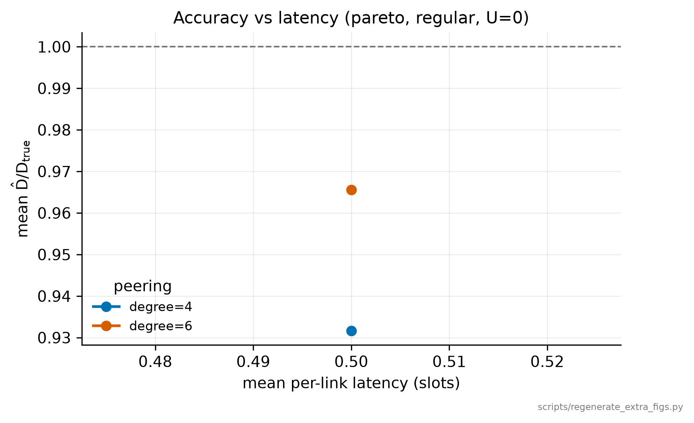

**The estimator is bounded by 1; the deficit is the signal below the block rate.** Because TSI counts *occupied slots* and a window can hold no more than actually occurred, the equilibrium `D̂/D` **cannot exceed 1** — it recovers *up to* exactly 1 and falls short only when the load outruns the uncle cap ([§2.2](#s2-2)). So the quantity of interest is the **under-count deficit `1 − D̂/D ≥ 0`**. A dedicated ρ-boundary sweep (`configs/rho-boundary.yaml`; hops fixed at 3 so `ρ ∝ δ_max`, N = 1 000, 20 replicates, **scaled `k = 256`** — the deficit mechanics are k-invariant; `k` sets only the per-epoch sampling noise ([Appendix B](#sB)), which 20 replicates beat down; `fig26`) resolves it cleanly: at U = 0 the deficit runs 0.51 → 0.85 across `ρ = 0.56 → 2.0`; one uncle holds the deficit within noise only for `ρ ≲ 0.6` (already 0.034 at `ρ = 0.96`, then steeply to 0.47 by `ρ = 2`); U = 2 stays within noise to `ρ ≈ 1.2` and holds the deficit under 0.6 % out to `ρ ≈ 1.56` (0.0033 ± 0.0018 at `ρ = 1.16`, rising to a resolved-but-negligible 0.0058 ± 0.0023 at `ρ = 1.56`) before breaking to 0.048 at `ρ = 2`; U = 3 stays within noise across the whole range — the `U = ⌈ρ⌉` boundary read straight off the deficit. Across all 40 cells **no equilibrium sits above 1 beyond sampling noise** (max `1.0024 ± 0.0017`), confirming the bound.

![Fig 26 — the region below the block rate: under-count deficit `1 − D̂/D` vs load ρ per uncle cap (left, log-y — the `U = ⌈ρ⌉` boundary; **solid** markers are deficits resolved above their 2·SEM noise level, **open** markers are the 17 cells at or below noise — including 9 where sampling noise puts `D̂/D` a hair above 1 — clamped to the axis floor `3×10⁻⁴` for the log scale, so an open point on the floor is not a measured positive deficit), and accuracy capped at the `D̂/D = 1` bound (right, ±SEM across replicates — the equilibrium sits at or below 1 at every load, U=2/U=3 hugging 1 from below).](report-figures/fig26_deficit_vs_rho.png)

<a id="s3-4"></a>
### 3.4 The uncle window is set by block spacing, not by delay

**The question.** How far back may a block reach when it references an orphan — how large must the uncle window `W` (measured in slots) be?

**Why it matters.** Too small a window silently discards orphans before any block gets a chance to reference them, and the under-count of [§3.2](#s3-2) returns no matter how many uncle slots exist; too large a window only costs a little validation state, so the risk is entirely on the small side.

**Result: the window is sized by block *spacing*, not by network delay.** Sweeping `W` at fixed U = 1 (`fig4`) gave a counter-intuitive result: the critical `W` is **~100–200 slots even for a 2-slot delay**, and barely depends on the delay. The reason is *queueing*: canonical blocks appear only every `1/f = 30` slots, and with U = 1 each references one orphan, so an orphan waits in a FIFO queue drained at ~1 per block interval. The window must span **several block intervals** for a queued orphan to reach a block with a free uncle slot before it ages out. (All runs fill uncle slots **oldest-first** — the FIFO behind this law, and the rule the spec itself prescribes: the proposer takes the oldest candidates first, deterministically, because an uncle expires `w_u` slots after its own slot so the oldest are closest to expiring. Selection is proposer-local and never validated, so a proposer *can* deviate; what that costs is measured below.) Empirically:

> **`W_min ≈ 7/f`** (the measured recovery floor is ≈ 200 slots at f = 1/30 = 6.7 block intervals; rounded design rule 7/f = 210 slots = 7 intervals), roughly constant across delay and U, rising toward ~10/f only as the load approaches the uncle capacity.

So `W` scales with the block interval `1/f`, and the default `W = 300` (= 10 intervals at f = 1/30) sits safely above the floor.

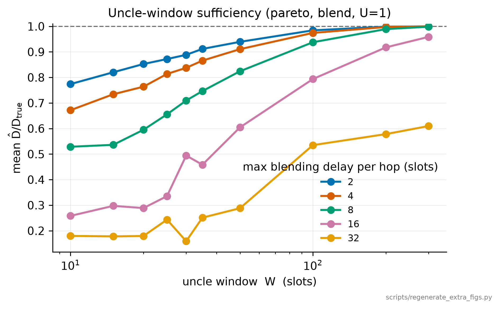

The full `W × delay` picture at `U = 1` (`fig22`) shows both bounds at once: below the `≈ 100`-slot window floor accuracy is lost at *every* delay (rows `W ≤ 50`), and above it accuracy holds only while the delay keeps `ρ ≲ 1` — at `delay = 16` `W = 300` reaches only `0.96` (recovery needs `W ≈ 600`, [§3.5](#s3-5)), and at `delay = 32` (`ρ ≈ 1.7`, past `U = 1`'s capacity) even the widest window recovers only `0.61`. Widening `W` cannot substitute for the extra uncle that `ρ > 1` demands.

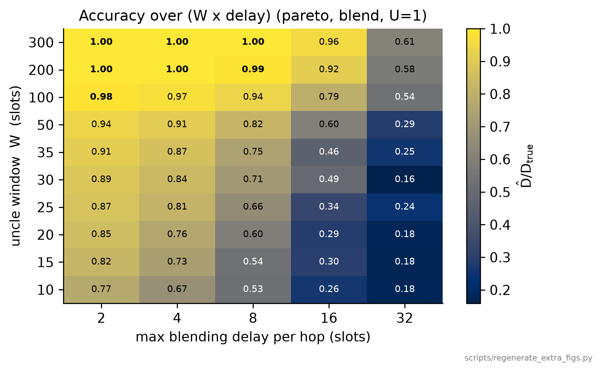

The N = 2 000 replica of this sweep reproduces the window floor unchanged — in the recovered region (delay ≤ 8 s, W ≥ 200) accuracy matches N = 1 000 within 0.003 — and the U-limited delay-32 plateau is likewise essentially N-invariant (≈ 0.56–0.62 at W = 200–300 for both N = 1 000 and N = 2 000). Together with the (W × U) N = 2 000 run of [§3.5](#s3-5) and the [§3.2](#s3-2) N-deepening of the *un-recovered* under-count (0.739 → 0.635 over N = 1 k → 10 k), this is the direct evidence that the `W`/`U` **thresholds are N-invariant while the un-recovered accuracy is not**.

**At scale, and as a fluctuation buffer** (`fig25`; N = 1 000 vs **10 000**, W up to 600, k = 256). Three results close the window question:

- **The floor's position does not move with N.** At the 8-s budget the recovery knee sits at W ≈ 100–200 slots for both sizes (N = 10 000 is a few points deeper below the floor, consistent with its higher load) — the queueing law is about block *spacing*, and block spacing does not change with N.
- **A wider window buys back the load boundary.** Block production fluctuates, and the window is the buffer that absorbs those bursts: right at `ρ ≈ 1` (the 16-s budget) U = 1 *fails* with the default W = 300 (0.965 at N = 1 000, 0.941 at N = 10 000), and W = 450 is still short of the 0.98 bar (0.979 and 0.963); only **W = 600** clears it at N = 1 000 (0.993) and brings N = 10 000 to within noise of it (0.976 ± 0.005) — twenty block intervals of buffer instead of ten. Because a growing network raises the load toward the boundary ([§3.7](#s3-7)), this is also the answer to "must W grow with N?": *near the boundary, yes, and the width needed grows with N* — W = 600 is the smallest tested width that recovers at N = 1 000, while at N = 10 000 even 600 only approaches the bar, so at scale the `+1` uncle is the reliable lever (U = 2 recovers every W ≥ 200 at both sizes, 0.995–1.000).
- **No window fixes sustained overload.** At the 32-s budget (`ρ ≈ 1.7–1.8 > U = 1`) accuracy stays collapsed at *every* width tested (0.23–0.76): a buffer absorbs variance around a stable queue, but when orphans *arrive* faster than one slot per block can *drain* them, the queue grows without bound and width is irrelevant. U = 2 (dashed) lifts every width above the floor back toward the bar, but clears `0.98` only at **W ≥ 450** (W = 300: 0.972 at N = 1 000, 0.962 at N = 10 000 — still short; W = 450: 0.993 and 0.992) — at `ρ ≈ 1.7` the extra uncle *and* the wider window are both required.

So the two levers separate cleanly: **`U` must cover the average load; `W` must cover the fluctuations around it** — and near `ρ ≈ 1` a window of ~15–20 block intervals (W = 450–600 at f = 1/30) is a cheap alternative to spending the `+1` uncle slot.

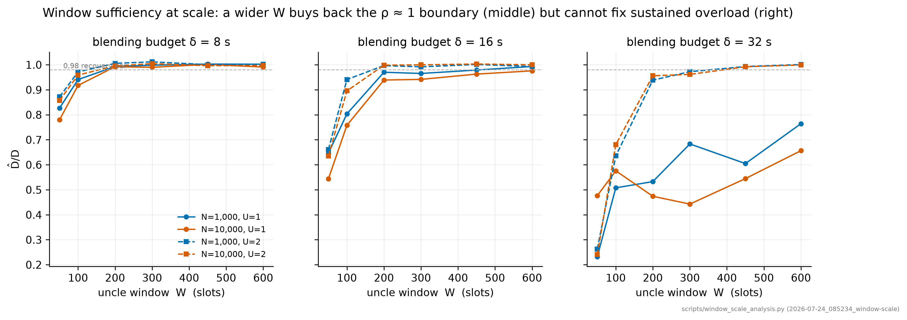

**The derived window.** Sweeping the *derived* window `w_u = W_abs/f` directly (`configs/absorption-window.yaml`, U = 1, 5 replicates; `fig33`) confirms the `10/f` margin, with one correction to the shape. At the 8-s budget recovery runs 0.709 → 0.940 → **0.996** as `W_abs` goes 1 → 3 → 10; at the 16-s budget (`ρ ≈ 1`) `W_abs = 10` reaches 0.964; at the 32-s budget no window recovers what `U = 1` cannot drain. The window-miss probability `(1−f)^(W_abs/f)` falls below 10⁻⁴ by `W_abs = 10`, so past that point the window is no longer a loss channel — which is what makes `W_abs = 10` and the bound `W_abs ≤ 0.6·k` land on this section's `W = 10/f` rule.

**What deviating from the spec's selection rule costs** (`configs/uncle-selection.yaml`, U = 1, 10 replicates, N = 1 000, k = 2160). Oldest-first is the spec rule, but nothing enforces it: uncle selection is proposer-local and the `uncles` field is not validated. A proposer that instead walks the same candidates and includes each on a fair coin — so a *lone* candidate is dropped half the time — loses accuracy at every window width, and the loss is largest exactly where the window is doing its job:

| `W` | δ_max = 8 s: oldest / coin | δ_max = 16 s: oldest / coin |
|---|---|---|
| 3 | 0.930 / 0.871 | 0.775 / 0.677 |
| 5 | 0.978 / 0.906 | 0.872 / 0.807 |
| 7 | 0.990 / 0.949 | 0.935 / 0.883 |
| 10 | **0.997 / 0.980** | **0.965 / 0.902** |

At the design point (δ_max = 8, `ρ ≈ 0.56`) the recommended `W = 10` still clears the 0.98 recovery bar under the coin — but at 0.980 against oldest-first's 0.997, i.e. with the margin spent rather than in hand. At the load boundary (δ_max = 16, `ρ ≈ 1`) it does not: 0.902 against 0.965, a `−0.063` gap at `t = −8.6`. The mechanism is that a coin wastes *opportunities*, not queue capacity: a well-sized window keeps the orphan queue short, and a short queue is precisely where dropping a lone candidate cannot be made up by the next one — which is why the gap does not close as `W` grows at the boundary. Two consequences. The `W = 10/f` margin is sized against the deterministic rule and should not be read as covering selection deviation as well; and the spec's argument that "a proposer has no incentive to deviate" rests on uncles granting no reward — which the [§8.5](#s8-5) uncle-reward recommendation would change, making the selection rule worth stating as a SHOULD with this cost attached.

Two cautions on reading `fig33`. **Accuracy has not saturated at `W_abs ≈ 7`** — it is still climbing at every delay (8 s: 0.989 → 0.996; 16 s: 0.942 → 0.964 from 7 to 10), so the ≈ 7-block-interval queueing floor of the raw-slot sweep above is a floor on *usefulness*, not a point where widening stops paying. And the **32-s curve is noise, not a trend**: replicate SD reaches 0.22 there and the sampled points are non-monotonic (0.623 at `W_abs = 5`, 0.526 at 7, 0.617 at 10). Only its ceiling is meaningful, and that ceiling is set by `U = 1`, not by the window.


<a id="s3-5"></a>
### 3.5 The joint (W, U) region — the levers are hierarchical

**The question.** `W` (how far back a block may reference) and `U` (how many uncle slots per block) both fight the same orphan loss — can one substitute for the other?

**Why it matters.** If they were interchangeable, a deployment could just pick whichever is cheaper; the data says they are not, and getting the order of decisions wrong leaves accuracy on the table.

Co-sweeping W × U (`fig5`) shows the two are **not interchangeable**:

- **`W` is first-order.** Below the window floor — ≈ 3/f (100 slots) at low delay, rising to the ≈ 7/f (200 slots) of [§3.4](#s3-4) as load grows — *no* uncle count recovers the estimate (e.g. delay 16, W = 100: even U = 4 reaches only 0.94). The window simply cannot reach the orphans.
- **Above the floor, `W` and `U` trade off**, and then **`U` is set by the load `ρ`** ([§3.3](#s3-3)): delay 8 → U = 1, delay 16 → U = 2, delay 32 → U = 3 (U = 2 stalls at 0.973 even at W = 300, [§3.6](#s3-6)).
- A single uncle slot at the spec window (`U = 1`, `W = 300` = `w_u`) is safe only up to delay ≈ 8 s; beyond that you must **add uncle slots** — the spec's `MAX_UNCLES = 4` allows up to four — not widen the window.

At N = 2 000 the region is unchanged — the U-limited delay-32 row matches N = 1 000 cell for cell (at W = 300, U = 2 reaches `0.973 ± 0.002` at both sizes and U = 3 recovers to ≥ 0.997 at both), so **the `W`/`U` thresholds are N-invariant** ([§3.4](#s3-4)): delay 32 needs U = 3 regardless of N.

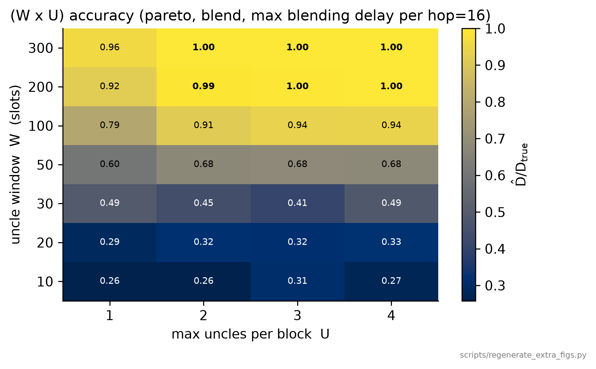

As a deployment decision chart, `fig20` (also **N = 5 000 and 10 000 pooled**) reads the accuracy straight off `(delay × U)` at a fixed degree: the `U = 0` column is blue (under-count `0.67–0.75`, deeper than at smaller N — the N-scaling of [§3.2](#s3-2)), and a *single* uncle already lifts every tested delay to exactly 1 (`1.00`, bold) — the concrete basis for the `U = ⌈ρ⌉ (+1)` rule, holding at the largest scale.

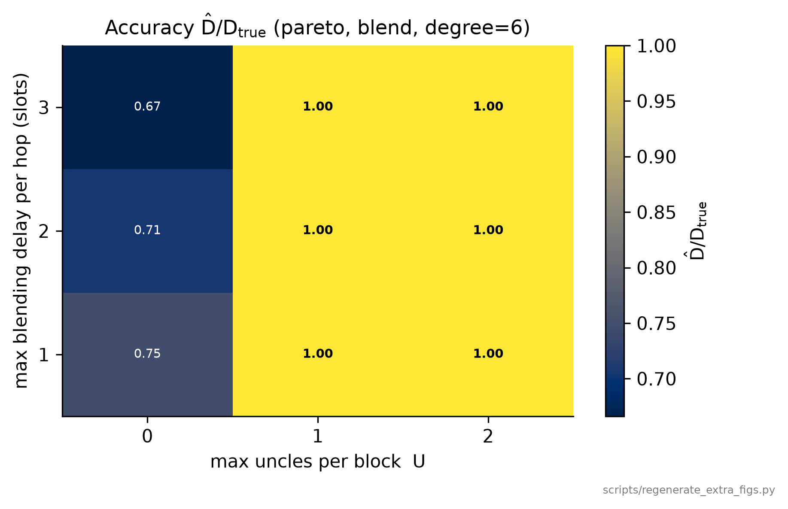

<a id="s3-6"></a>
### 3.6 Block rate `f` moves every threshold predictably

**The question.** Everything above was measured at 30-second blocks (`f = 1/30`). If the protocol ever runs faster blocks, do the rules survive?

**Why it matters.** The block rate is a first-order protocol choice, and a parameter recipe that silently assumed one rate would break the day the rate changes — this section shows every threshold moves *predictably* with `f`, so the recipe transfers.

**Result: the same wall-clock delay weighs more at a faster rate — everything else follows.** Because the load is `ρ = f·D_vis` (blocks produced per visibility delay, [§3.3](#s3-3)), a **faster** block rate makes the *same* wall-clock delay heavier (`fig6`, left): a fixed 8-s delay needs U = 1 at 30 s/20 s blocks but **U = 2 at 15 s and 10 s blocks**. Predicted `U_min = ⌈ρ⌉` vs. the measured smallest U reaching the 0.98 recovery bar (0.98 of the true value 1.0 — slot-counting removed the old `c(f)` ceiling; the sweep tested only **U ≤ 2**):

| propagation delay (s) | block interval 30 s | 20 s | 15 s | 10 s |
|---|---|---|---|---|
| 8  | 1 / 1 | 1 / 1 | 2 / 2 | 2 / 2 |
| 16 | 1 / **2** | 2 / 2 | 2 / 2 | 3 / >2 |
| 32 | 2 / **>2** | 3 / >2 | 4 / >2 | 6 / >2 |

*each cell = predicted `⌈ρ⌉` / smallest measured U reaching the 0.98 recovery bar; `>2` = U = 2 still insufficient (sweep capped at U ≤ 2).*

`⌈ρ⌉` matches in every fully-resolved cell **except two boundary cells** (one near-integer, one censored at U ≤ 2) — and error bars (standard error over replicates) show the two boundary cells are not alike: delay 16 / 30 s (`ρ = 0.96`) fails at U = 1 with `0.962 ± 0.006`, a **robust 3σ** under-shoot that genuinely needs U = 2; and delay 32 / 30 s (`ρ = 1.76`) reaches only `0.973 ± 0.002` at U = 2, a **4σ** shortfall — U = 2 genuinely fails there (matching the table's `>2`). This is why the `U = ⌈ρ⌉ + 1` margin exists and why boundary pass/fail calls must carry error bars. Every other `>2` cell is consistent with the larger `⌈ρ⌉` (the sweep only tested U ≤ 2). Three `f`-effects, all consistent with [§4](#s4) (plus one null result):
- **recovery stays at 1.0** at every rate — slot-counting removes the `c(f)` dependence the block count had (the multi-winner rate `c(f)` = 1.017 → 1.054 from 30 → 10 s no longer appears in the estimate);
- **`U_min` grows ∝ f** (same delay, faster rate ⇒ more uncles);
- **`W_min` shrinks ∝ 1/f** (constant ≈ 7 block intervals);
- *(null result)* **consensus-safety ([§3.1](#s3-1)) is f-independent** — `range_ratio = 0` at all four rates.

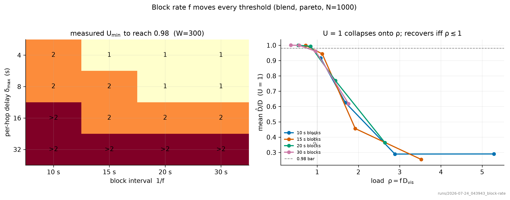

<a id="s3-7"></a>
### 3.7 Network size erodes the one-uncle margin — through the gossip diameter, and only there

**The question.** [§3.3](#s3-3) fixed the network size and grew the delay; real deployments do the opposite — the blending budget is a design constant while `N` grows. Does a bigger network break `U = 1`, and does the answer depend on the peering degree? We investigate under Blend only, in two cases: **(a)** plain geo link delays, and **(b)** geo delays plus a long-tail model in which 10 % of deliveries straggle by an extra `Poisson(3)`-slot delay.

**Why it matters.** If `U = 1` quietly stops sufficing at large `N`, the under-count of [§3.2](#s3-2) returns — and with it the cheap grinding lever of [§6.3](#s6-3) (deflating `D̂` to make the lottery easier, attacker included). A deployment sized on small-N evidence would degrade exactly when the network succeeds.

**Result: `N` enters through one number — the gossip path length.** Measured exactly on the simulator's own graph generator up to **N = 10⁶** (`fig24`, right), the mean path latency grows logarithmically, `ℓ_mean ≈ a_d·ln N`, with `a₄ = 0.33`, `a₆ = 0.19`, `a₈ = 0.14` slots — the classic `1/ln(d−1)` diameter law. The direct ladder (N = 1 000 → 32 000, scaled k = 256, δ_max ∈ {4, 8} s, 756 trajectories) confirms the mechanism end-to-end: **consensus stays exact in every cell** (spread 0, agreement 1.000 — long-tail jitter included), accuracy depends on `N` only through the load `ρ = f·D_vis(N, d, δ)` (`fig24`, left), and at the 8-s budget the **degree-4** curve declines monotonically until at N = 32 000 it drops below the recovery bar (the `0.98` criterion of [§3.6](#s3-6)): `0.973 ± 0.007` in case (a) at N = 32 000 (`fig23`) — while **degrees 6 and 8 stay flat near 1.0** through 32 000 (deg 6: 0.988; deg 8: 1.001), and `U = 2` recovers every cell. Extrapolating with the exact probe: **degree 4 reaches the measured `U = 1` failure load (ρ = 0.96, [§3.6](#s3-6)) at N* ≈ 8×10⁵ — one uncle is *not* enough at a million nodes on a degree-4 graph.** Degree 6 would need N ~ 4×10⁹ and degree 8 ≈ 6×10¹² to cross the same line: safe at any realistic size.

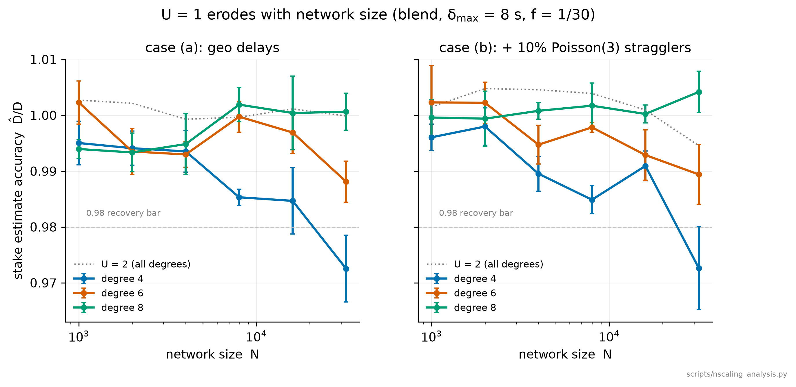

**The long-tail jitter changes nothing measurable.** Case (b) shifts the mean visibility delay by only 0.3 slots (10 % of deliveries × 3-slot mean straggle; `ρ` + 0.01) and the measured `U = 1` accuracy by ~0.4 % per cell on average (up to ~1.5 % in the noisiest large-N cell, ~0.03 % pooled — all within the few-replicate SEM); consensus is untouched in all 378 case-(b) trajectories. The stragglers' real cost is the variance channel of [Appendix B](#sB).3 — already absorbed once `U ≥ 1`.

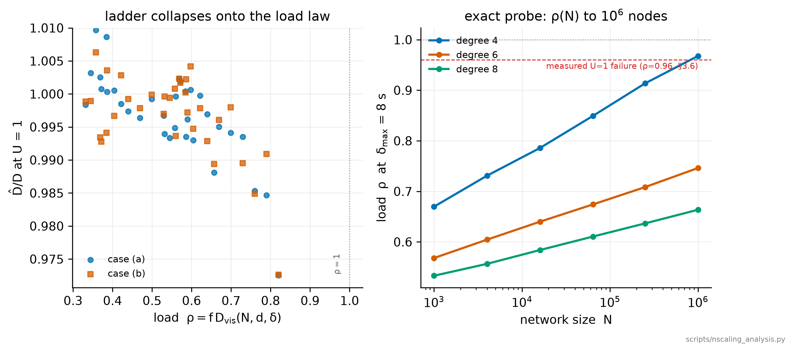

**Design consequence.** The uncle cap and the peering degree are exchangeable defences against network growth: keep `ρ(N, d, δ) < 1` either by adding an uncle slot or by densifying the graph — and one degree step (4 → 6) buys roughly a **5 000× larger network** at the same blending budget (N*: 8×10⁵ → 4×10⁹). [§8](#s8) (row 12) turns this into the size-dependent degree rule.

---


<a id="s4"></a>
## 4. Design equations and parameter-selection algorithm

This section turns [§3](#s3) into a recipe: measure the network's propagation delay, compute the load, read off `U` and `W`. The table gives the calibrated design laws, the algorithm walks a deployment through them, and the worked examples cover the Cryptarchia baseline and Blend.

Let `f` = block rate (blocks/slot; block interval `1/f` slots = seconds), and for the propagation model let `ℓ_mean`, `ℓ_max` be the mean / max shortest-path transport latency over the peering graph (for a d-regular geo graph at N ≈ 1 000, deg 6: `ℓ_mean ≈ 1.2`, `ℓ_max ≈ 2.3` slots), `hops` the Blend cascade length and `δ_max` the per-hop blending bound. A denser peering graph shortens `ℓ_mean` and hence `D_vis` and `ρ` — the peering degree is an operator-side lever that buys uncle-cap headroom (fig19: at U = 0, degree 6 stays near-exact where degree 4 dips).

**Derived quantities** (calibrated on N = 1 000 blend). The `U`/`W` *thresholds* are ~N-invariant and were confirmed to hold across f = 1/10…1/30 ([§3.6](#s3-6)); the *U=0 accuracy* (eq 4′) worsens with N ([§3.2](#s3-2)) and is an N ≈ 1000 fit.

| # | quantity | equation | calibration / validity |
|---|---|---|---|
| 1 | mean visibility delay | `D_vis = hops·δ_max/2 + (hops+1)·ℓ_mean`  (direct gossip: `ℓ_mean`) | — |
| 2 | load (orphans / block) | `ρ = f · D_vis` | governs U (fig6 collapse at ρ≈1) |
| 3 | fully-recovered accuracy | `D̂/D = 1` (slot-counting, [§2.1](#s2-1)) | exact at equilibrium; deployed value ≈ `f/f_p` ≈ 1.01 from on-chain `f`-rounding only ([Appendix A](#sA)) |
| 4 | accuracy, orphan-loss factor (U=0) | `D̂/D = ln(1−f)/ln(1−f/q_eff)` = `expected_ratio(f, q_eff)`, where the **effective density** `q_eff ≤ 1` is the fraction of active slots that are *counted* (canonical + recovered-uncle slots) | tight in the **orphan-loss regime** `q_eff < 1` (RMS 2.3e−4 vs the sim's `q_eff`, U=0 sweep); it *saturates at 1* as `q_eff → 1`, so the fully-recovered accuracy is **1.0 (eq 3)** — slot-counting counts each occupied slot once, so there is no multi-winner ceiling above it |
| 4′ | accuracy, no uncles (closed-form stand-in) | `D̂/D(U=0) ≈ 1 / (1 + a·ρ)`, `a ≈ 2` | `a ≈ 2` fit over the N = 1 000, U = 0 blend cells of `blend-hops-delay` + `rho-boundary` + `fullscale-small` (per-run best fits a = 1.4–2.2, pooled a = 1.8), ρ ≳ 0.2 (RMS ≈ 0.07 at `a = 2`, ~250× coarser than eq. 4); worsens with N; ≈ 1 for direct gossip |
| 5 | **uncle cap** | necessary `U ≥ ⌈ρ⌉` (U<ρ **never** recovers); recommend `U = ⌈ρ⌉ + 1` | `⌈ρ⌉` matches emp. within ±1 — under-shoots just below integer ρ |
| 6 | **uncle window** | `W_min ≈ 7/f` (≈ 200 slots @ f=1/30); margin `≈ 10/f` | ~const in delay/U; → ~10/f near uncle capacity |

**Algorithm — choose (W, U) for a deployment**

```python
Inputs:  f (block rate),  propagation profile (hops, δ_max, ℓ_mean),  deployment size
1. Visibility delay:   D_vis = hops·δ_max/2 + (hops+1)·ℓ_mean       # direct gossip: D_vis = ℓ_mean
2. Load:               ρ = f · D_vis
3. Feasibility:        deployment REQUIRES U ≥ ⌈ρ⌉. If that exceeds the protocol's uncle-slot
                       budget, cut propagation delay (fewer hops / less blending) — no window fixes U<ρ.
                       Prefer to keep ρ < 1 with margin regardless: ρ > 1 is both the chronic
                       under-count regime and the cheap grinding lever (§6.2–§6.3).
4. Uncle cap:          if ρ ≪ 1 (direct gossip): U = 1 suffices (U=0 alone already ≈ 0.97)
                       else: U = ⌈ρ⌉ + 1   # recommended; ⌈ρ⌉ is the tight minimum, occasionally
                                            # short by one just below an integer ρ
5. Uncle window:       W = ⌈10/f⌉ slots   # ≥ 7/f floor; set by block SPACING, not by the delay.
                       #   Near the load boundary ρ ≈ 1, widen to 15–20/f (450–600 @ f=1/30)
                       #   as a cheap alternative to the +1 uncle slot (§3.4, §8.1 row 3).
6. Expected accuracy:  with U   D̂/D → 1.0 (bounded by 1; spec 10^-3 f-rounding would add ~1%, App. A)
                       without   ≈ 1/(1+2ρ)  for ρ ≳ 0.2,   ≈ 1  for ρ ≪ 1 (direct gossip)
7. Security k:         set by finality; TSI's per-node agreement held at k=2160, expected any k (§3.1)
8. Learning rate:      β = 1 (one-epoch tracking; time-constant τ = −1/ln(1−β) epochs — §6.5)
```

**Worked examples** (`ℓ_mean ≈ 1.2` slots for the study graph):

- *Blend (primary), 3 hops, δ_max = 8 s, f = 1/30.* `D_vis ≈ 3·4 + 4·1.2 ≈ 17` → `ρ ≈ 0.56`. Tight `⌈ρ⌉ = 1` (empirically suffices, [§3.5](#s3-5)); **recommended `U = 2`** (margin); `W = 300`.
- *Same Blend at f = 1/10 (10 s blocks).* `ρ = 17/10 ≈ 1.7`. Tight `⌈ρ⌉ = 2` (needed, [§3.6](#s3-6)); **recommended `U = 3`**; `W = 10/f = 100`.
- *Direct global gossip (contrast), f = 1/30.* `D_vis = ℓ_mean ≈ 1.2` → `ρ ≈ 0.04`. Forks nearly negligible: `U = 1` (U = 0 alone already reaches `D̂/D ≈ 0.97` at degree 6 / `0.93` at degree 4, [§3.3](#s3-3) — well below where eq. 4′ applies; one uncle closes the last few percent to `1.000 ± 0.001`); `W = 10/f = 300`. → the Cryptarchia defaults (`W = 300` is the spec window `w_u`; the spec's `MAX_UNCLES = 4` sits well above the single uncle slot this regime needs).

---


<a id="s5"></a>
## 5. Discussion and caveats

Read this before using the numbers: the regime they hold in, and the margins that absorb what they do not.

- **Regime of exactness.** [§1](#s1)–[§5](#s5) are for honest nodes with deterministic latency (`jitter = 0`), the regime in which the windowed/pruned engine is bit-exact; [§6](#s6) tests the limits. **Open items:** sizing `W`/`U` so the emergent reference rate stays high under adversarial orphaning; the full multi-coalition (`K`-agent, [§6.9](#s6-9)) selfish equilibrium (below-⅓ joint profitability unaddressed); per-node clock skew; and stochastic-jitter *parameter* tuning.
- **The `ρ ≈ 1` and `W ≈ 7/f` constants (load boundary, window floor) are semi-empirical** — the *functional forms* follow from the orphan-queueing mechanism, the constants are fitted (`a ≈ 2`, pinned only to ~1.8–2.2 by the sweep; `U = ⌈ρ⌉` within ±1). For production use the margined rules `U = ⌈ρ⌉ + 1` and `W = 10/f`.
- **N-scaling.** The U = 0 under-count worsens slowly with N (0.739 → 0.635 over N = 1k → 10k); the recovery thresholds for `U`/`W` are essentially N-invariant ([§3.4](#s3-4)). Size `D_vis`/`ρ` (and add margin to U) for the largest expected deployment; eq. 4′ itself is an N ≈ 1 000 fit.
- **The residual ~1 %.** Slot-counting lands the equilibrium at exactly `D` ([§2.1](#s2-1)); the *only* systematic offset left is the on-chain integer rounding of `f` (`f_p = ⌊f·1000⌋/1000`, the `fixed_point` switch), which leaves the deployed estimate ≈ `f/f_p ≈ 1.01` high — common to every node (fairness untouched), an absolute ~1 % under-delivery of win probability, removed by carrying `f` at higher precision. **No correction exists in the specs today** ([Appendix A](#sA); [§8](#s8) carries the precision bump as a recommendation).
- **W and U are coupled but not fungible:** you cannot buy below the `~7/f` window floor with any number of uncles, and you cannot buy below `U = ⌈ρ⌉` with any window — though right at the boundary `ρ ≈ 1`, extra window (15–20/f) absorbs the fluctuation bursts that would otherwise need the `+1` uncle ([§3.4](#s3-4), fig25).
- **"Consensus-consistent" ≠ "accurate".** [§3.1](#s3-1) shows nodes agree on one value; that value is only correct once uncles restore it. The reduced (single global `D̂`) analytic model, which [§3.1](#s3-1) validates, is the model that collapses the network to one canonical chain and one scalar estimate.

---

<a id="s6"></a>
## 6. Robustness beyond the honest, deterministic regime

[§1](#s1)–[§5](#s5) characterise an honest, jitter-free regime, in which the two headline claims (one global estimate `D̂`; uncle cap `U` = the load `⌈ρ⌉` suffices, where the **load** `ρ = f·D_vis` is the number of blocks the network produces per block-visibility delay `D_vis` — [§3.3](#s3-3)) cannot fail by construction. Eleven studies test those limits, forming one arc from network noise to a full adversary and its incentives, then out to the chain structure the estimate rides on and the wall-clock cadence it runs at:

- **[§6.1](#s6-1)** consensus survives jitter (positive result).
- **[§6.2](#s6-2)** the estimator is a load-feedback loop, bistable near `ρ≈1` in a fitted static map — reached by the full dynamics only as a rare tail event under heavy withholding.
- **[§6.3](#s6-3)** uncle-suppression grinding — a bounded attack.
- **[§6.4](#s6-4)** static block withholding — deflates `D̂` but faithfully tracks *active* stake.
- **[§6.5](#s6-5)** dynamic withhold-rejoin grinding — unprofitable, non-persistent.
- **[§6.6](#s6-6)** selfish / private-chain withholding — the one profitable lever (above the classic stake threshold, quantified with the optimal-strategy MDP); uncle-*counting* restores about half of the estimator damage, bounded by the countable rule's one-uncle-per-fork ceiling.
- **[§6.7](#s6-7)** block/uncle *rewards* — robustly compensate honest orphans and disincentivise hiding, but a *voluntary* reward can backfire on selfish mining.
- **[§6.8](#s6-8)** a *soft* (reward-weighted) inclusion rule — the fork-safe choice (a validity rule cannot prove which forks a producer saw). The emergent reference rate stays high (honest blocks reference the published orphans), so the backfire mostly vanishes; the residual is set by the uncle window `W` (how far back a block may reach to reference an orphan; recommended 300 slots = 10/f, [§3.4](#s3-4)) and visibility.
- **[§6.9](#s6-9)** multiple coalitions and bribery — the abstention commons is bounded and structure-independent; multi-coalition *selfish* mining is flagged, not solved.
- **[§6.10](#s6-10)** fork rate and reorg depth — uncles and `ρ < 1` keep reorganisations shallow and keep even a 30 % coalition below the effective-majority cliff.
- **[§6.12](#s6-12)** the reference window bounds the uncle but not the historical state a validator must reach — a 30 % coalition drives it to the epoch boundary, and anchoring the window to the uncle's *parent* caps it, free at the recommended cap but raising the window floor by one to two block-intervals.
- **[§6.11](#s6-11)** organic stake churn against the ~7.5-day epoch cadence — tracked with a one-epoch lag; a bounded rate wobble, never a consensus or accuracy failure.

The recurring theme: the same uncle references that fix the honest under-count ([§3.2](#s3-2)) are also the adversarial safeguard — and *rewarding* them (softly) makes the safeguard incentive-compatible without a fork risk.

<a id="s6-1"></a>
### 6.1 Consensus survives network jitter — not a determinism artifact

Adding random per-delivery arrival noise changes nothing: consensus stays exact. This needed testing because `range_ratio ≡ 0` in [§3.1](#s3-1) is exact by construction *only* at `jitter = 0`. Re-running in the simulator's guaranteed-exact mode (the full arrival matrix, with the windowed/pruning speed-ups disabled) with per-(block,node) arrival jitter across the full grid — `jitter_mean ∈ {0, 0.1, 0.3, 1, 3}` slots (the 0 cell is the exact baseline) × both transports of [§2](#s2) — `regular` (plain direct gossip, sub-slot links, forks rare) and `blend` (the Blend mix cascade, whole-second per-hop blending delay — the deployment target) — × N ∈ {1 000, 2 000}, 10 replicates each — leaves **`range_ratio = 0 ± 0` and `agreement_window = 1.000` in all 200 runs (20 grid cells × 10 replicates)**, and the mean accuracy stays at 1.0 throughout (0.97–1.02 per run, 0.996–1.005 per replicate-averaged cell, at every jitter level; the few per-run values above 1 are per-epoch sampling noise around the `D̂/D ≤ 1` bound — [§2.2](#s2-2)) — jitter costs nothing in accuracy either. The only metric that moves is *current-tip* agreement, degrading monotonically (worst run ≈ 0.98 → 0.86, worst cell ≈ 0.99 → 0.94, as jitter grows to 3 slots):

| `jitter_mean` (slots) | 0 | 0.1 | 0.3 | 1.0 | 3.0 |
|---|---|---|---|---|---|
| `range_ratio` (max over runs) | 0 | 0 | 0 | 0 | 0 |
| `agreement_window` (min) | 1.000 | 1.000 | 1.000 | 1.000 | 1.000 |
| mean `D̂/D` (range over runs) | 0.974–1.017 | 0.977–1.015 | 0.987–1.014 | 0.983–1.017 | 0.979–1.022 |
| `agreement_tip` (worst run) | 0.977 | 0.957 | 0.945 | 0.928 | 0.859 |

Jitter feeds exactly the tip-level churn that [§3.1](#s3-1) showed never reaches the finalized density window. The reason is structural: the density window opens a full epoch back (`E = 10·⌊k/f⌋` slots) and *closes* `E − T = 4·⌊k/f⌋` slots before the chain is snapshotted for measurement — 259 200 slots ≈ 8 640 blocks ≈ 4k at k = 2160, f = 1/30, i.e. ~3k blocks deeper than `k`-finality — so every block has reached every node by measurement time regardless of jitter, and all nodes still compute an identical `D̂`. The "one global `D̂`" claim therefore holds off the `jitter = 0` axis.

**How much per-recipient variance would it take to matter?** The jitter above is a *robustness* probe; the same lever also answers a modelling question, because jitter is exactly the difference between this simulator's transport and one that draws an independent delay per (block, recipient). The cascade's variance is per **block** — every recipient is moved together by the final flood — while jitter is per **recipient**, and only the second kind desynchronises views and manufactures forks deeper than one block, which the counting rule cannot recover ([§2.1](#s2-1)). Swept at the deployment's operating point (`δ_max` = 4, exact oracle, both referencing models, 480 runs):

| `jitter_mean` (slots) | 0 | 1 | 2 | 4 | 8 |
|---|---|---|---|---|---|
| `D̂/D` at `U = 1` | 0.9983 | 0.9992 | 0.9991 | 0.9971 | 0.9871 |
| orphans below their fork's first block | 0.25 % | 0.38 % | 0.53 % | 1.20 % | 3.30 % |
| fork rate | 0.266 | 0.272 | 0.275 | 0.310 | 0.366 |

Accuracy is flat to ~2 slots and only then bends: at 8 slots the deep-fork share reaches 3.3 % and the estimate falls to 0.987. Blend's own cascade delivers about **0.5 slot** of per-recipient spread — the gossip flood over a degree-6 graph ([§2](#s2)) — so the design sits an order of magnitude inside the flat region. The sensitivity is nevertheless real, and quoting it is what makes the accuracy claims conditional on a *stated* transport property rather than an unstated one. Consensus is unaffected throughout (`range_ratio = 0`, `agreement_window = 1.000` in every one of the 480 runs), so this is an accuracy sensitivity only.

**Clock skew: bounded, but not identically zero.** A whole-timeline shift of a node's slot clock — unlike per-arrival jitter, it shifts the node's measurement-window bounds — was tested directly (its own generator, `scripts/clock_skew.py`, [§9](#s9)). A skew of up to ±20 slots moves each node's occupied-slot count by at most the one or two blocks in the shifted window edge, an inter-node spread of at most `max(1/m, 2·skew/T)`, where `m = f·T` is the window's occupied-slot count — the discrete one-block floor `1/m` dominates for `skew < 1/(2f)`, and the measured spread is indeed a flat `1/m` at every skew from 1 to 20 slots. At the production window (`T = 6·⌊k/f⌋ = 388 800` slots, so `m = f·T = 12 960`) both terms are `≈ 1×10⁻⁴` — bounded and negligible, but, unlike jitter's exact 0, not identically zero. So bounded clock skew is a small quantifiable consensus cost, not a break ([§8.3](#s8-3) item 6).

<a id="s6-2"></a>
### 6.2 The estimator is a load-feedback loop, bistable near ρ≈1 in theory (`fig7`)

The worry: the estimator feeds back on itself — a low estimate makes the lottery easier, more blocks collide, fewer get counted, and the estimate drops further. Could that spiral? The answer: the fold sits right at the load boundary `ρ ≈ 1` in a fitted static model, and the simulated network reaches it only as a rare tail event — once in 96 runs, under a concentrated 50 % withholding coalition at a heavy blending budget (the caveat at the end of this section). The boundary is real, and is why we provision `ρ < 1` with margin.

Because the controller drives the *counted* density to the target block rate `f` (blocks per slot; `f = 1/30`, one block every 30 slots = 30 s — defined in the [§3.3](#s3-3) symbol table, and swept in [§3.6](#s3-6)), the realised proposal rate is `f/r` (`r` = the recovered accuracy `D̂/D`; under-recovery means `r < 1`), so the realised load is `ρ_eff = ρ/r > ρ` whenever the estimate is under-recovered — this single effect explains both the U=0 finite-size drift and the near-integer `⌈ρ⌉` under-shoots. Fitting the effective counted density `q_eff` ([§4](#s4), eq. 4) as `q_eff ≈ 1/(1 + 0.71·ρ_eff)` and solving the self-consistent fixed point `r = ln(1−f)/ln(1−f/q_eff(ρ/r))` gives a single reachable stable branch that **folds into a collapsed low branch at `ρ ≈ 1.08`** — the map is bistable at the recipe's own operating boundary. (`fig7`'s shaded band opens earlier, at `ρ ≈ 0.66`: that is where the unstable middle root rises above the low-`r` seed of the branch scan, so from `ρ ≈ 0.66` up a sufficiently deflated start already falls into the collapse basin, even though the upper branch itself survives to the fold.) So the honest-regime "`U = ⌈ρ⌉` suffices" line, computed on the high branch, is an upper edge, not a safe interior; the `+1` margin partly absorbs the `ρ_eff > ρ` gap. *Caveat:* this bistability is a property of the *fitted static* `q_eff(ρ)` map, and the full per-node dynamics essentially never reach the fold — no grinding schedule flips to the collapsed branch ([§6.3](#s6-3)(i)) and a withhold pulse always recovers ([§6.5](#s6-5)(iv)). "Essentially" is doing real work, though, and the mechanism that closes the gap is this section's own: because the realised load is `ρ_eff = ρ/r`, an estimate deflated to `r` multiplies the load by `1/r`, and *withholding deflates `r` by design* — a 50 % coalition doubles the load, which at the design point `ρ ≈ 0.56` lands on `ρ_eff ≈ 1.1`, past the fold. Swept directly (`scripts/adversary_variants.py`, static withholding, `β_adv ∈ {0.3, 0.5}` × `δ_max ∈ {4, 8}` s × coalition selection {random, whale} × 12 replicates — 96 runs), the estimate stays on the upper branch in every cell at `δ_max = 4`, and single epochs dive far below it and recover (worst epoch 0.015 at `β_adv` = 0.3, tail mean 0.61). At `δ_max = 8` it collapses **once in 96 runs** — one replicate of the concentrated (whale) 50 % coalition, which produces blocks at the collapsed rate and never recovers within the run. So the fold is *primarily* a provisioning warning, but it is not unreachable: it is a rare tail event that a large withholding coalition at a heavy blending budget can enter, and one more reason the [§8](#s8) `ρ < 1` rule wants margin rather than equality. Characterising that tail — its frequency against `β_adv`, `ρ` and coalition concentration — needs a dedicated study and is not attempted here.

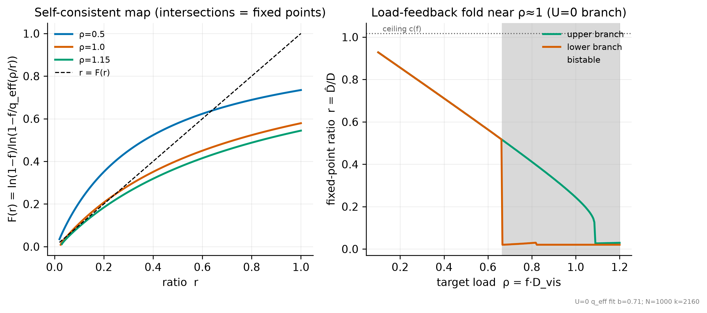

*Figure note: the grey dotted line labelled "ceiling c(f)" (≈ 1.017) in the right panel is a leftover from the superseded block-counting rule and does **not** apply to any result in this report — under the corrected occupied-slot count the equilibrium `D̂/D` is bounded by 1 ([§2.2](#s2-2), [Appendix A](#sA)). It is a reference annotation only; neither plotted branch approaches it, so the fold result is unaffected.*

<a id="s6-3"></a>
### 6.3 Grinding by uncle suppression is real but bounded, and scales with load (`fig8`)

The uncle mechanism is the attack surface: `D̂` is the denominator of the win probability `φ(f, w/D̂)` (`w` = the node's stake), so an adversary that references **no** uncles in its blocks starves the density count, deflates `D̂`, and inflates everyone's win rate — a grinding payoff. We added this to the engine (`adversary_frac`, a coalition holding a stake fraction `β_adv` that suppresses uncle refs; written `α` in the selfish-mining sections [§6.6](#s6-6)–[§6.8](#s6-8), and distinct from the TSI learning rate `β` of [§6.5](#s6-5)) and swept it × load (U = 2, N = 1 000; the table's β_adv cells are `D̂/D` under suppression, and **grinding gain** is the coalition's win-rate multiplier `1/(D̂/D)` — its lottery odds scale as `1/D̂` — reported at β_adv = 0.5):

| load `ρ` | β_adv = 0.1 | 0.3 | 0.5 | grinding gain @ 0.5 |
|---|---|---|---|---|
| 0.56 (honest regime) | 0.997 | 0.994 | 0.962 | 1.04× |
| 0.96 (boundary) | 0.996 | 0.949 | 0.876 | 1.14× |
| 1.36 (U-limited) | 0.993 | 0.898 | **0.700** | **1.43×** |

Three findings: (i) the deflation is **smooth and monotone in `β_adv` — no catastrophic branch-flip** up to 50 % stake, so the [§6.2](#s6-2) bistability is not reached in this range (the fitted `q_eff` over-states the fold); (ii) at the honest operating load `ρ < 1` the attack is **weak** (honest blocks backfill the suppressed references within the window `W`), biting only in the U-limited `ρ > 1` regime; (iii) therefore **provisioning `U`/`W` to keep the operating point at `ρ < 1` with margin is *also* the adversarial safeguard** — operating at `ρ > 1` is doubly bad (honest under-recovery *and* a cheap grinding lever). *Precondition:* a counted uncle must be a real lottery winner for its slot — the spec's ZK Proof-of-Leadership makes fabricating a win cryptographically impossible, and this is already enforced on-chain; modelled here. Block *withholding* — the stronger lever flagged here — is examined next in [§6.4](#s6-4).

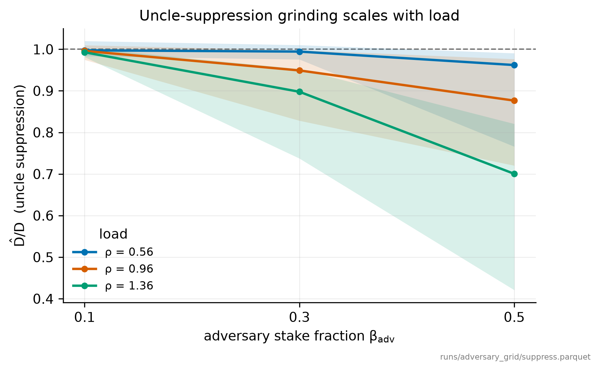

<a id="s6-4"></a>
### 6.4 Block withholding deflates `D̂` to ≈(1−β_adv), but measures reduced *active* stake (`fig9`)

Uncle suppression is a *reference-level* attack (the adversary publishes blocks but starves the density count). The stronger lever is **withholding**: the coalition wins its slots but never publishes, so its blocks never arrive at any honest node (arrival set past the epoch horizon `E`, so never received), are never adopted, and never counted. We added `adversary_strategy ∈ {suppress, withhold}` and re-ran the β_adv sweep on both transports (`regular` / `blend`, [§2](#s2)) (N = 400, k = 256, U = 2, exact oracle):

| β_adv | 0.1 | 0.2 | 0.3 | 0.4 | 0.5 | vs. suppress @ 0.5 |
|---|---|---|---|---|---|---|
| **withhold**, regular | 0.862 | 0.724 | 0.635 | 0.563 | 0.472 | — |
| **withhold**, blend | 0.793 | 0.780 | 0.605 | 0.537 | 0.406 | — |
| suppress, regular | 1.000 | 1.000 | 0.999 | 0.996 | 0.999 | flat ≈ 1.0 |
| suppress, blend | 1.001 | 0.997 | 0.996 | 0.995 | 0.992 | ≈ 1.0 |

Three findings: (i) withholding tracks the **active-stake line `D̂/D ≈ (1−β_adv)`** (grey dotted in `fig9`), sitting slightly below it, and is **largely topology-independent** — regular and blend deflate together — because the mechanism removes stake from the *count*, not from the propagation graph; suppression, by contrast, does essentially nothing on the well-connected regular graph and only bites weakly on blend at high load. (ii) The deflation **overshoots slightly below (1−β_adv)** in every cell of the grid, but by a margin that shows **no resolvable trend in β_adv**: the shortfall is 0.038 / 0.076 / 0.065 / 0.037 / 0.028 on regular and 0.107 / 0.020 / 0.095 / 0.063 / 0.094 on blend at β_adv = 0.1 … 0.5, every cell within ≈ 2.6 SEM of the line at N = 400 × 16 replicates (regression of shortfall on β_adv: p = 0.53 regular, p = 0.90 blend). A plausible mechanism — once `D̂` falls, the surviving honest nodes win *more* often at the deflated denominator, fork more, orphan more, and the density feeds back down, the [§6.2](#s6-2) load-feedback loop nudging the withdrawal — is consistent with the uniformly negative sign, but this grid does not resolve its β_adv dependence. (iii) Crucially, **this is not a measurement failure — it is TSI correctly reporting reduced active stake.** A coalition that withholds every block is indistinguishable from one that simply *went offline*; total-stake inference is defined over the stake that is *participating*, and (1−β_adv) is the right answer.

*Methodological note.* The peering graph is drawn per trajectory from the config's full RNG key, so adversary-vs-honest cells use different graph samples — a replicate-averaged variance source, not a bias; the deflation is topology-independent, so the conclusion is unaffected.

Withholding is also **self-punishing**: the adversary forfeits all block rewards for its withheld slots to deflate a denominator that lowers *everyone's* difficulty (its own honest competitors included), so the relative-reward gain is second-order while the absolute cost is first-order. The generalisation to a **dynamic** withhold-then-rejoin *grinder* — abstain to deflate `D̂`, then re-activate to mine at the depressed difficulty — is examined and defused in [§6.5](#s6-5).

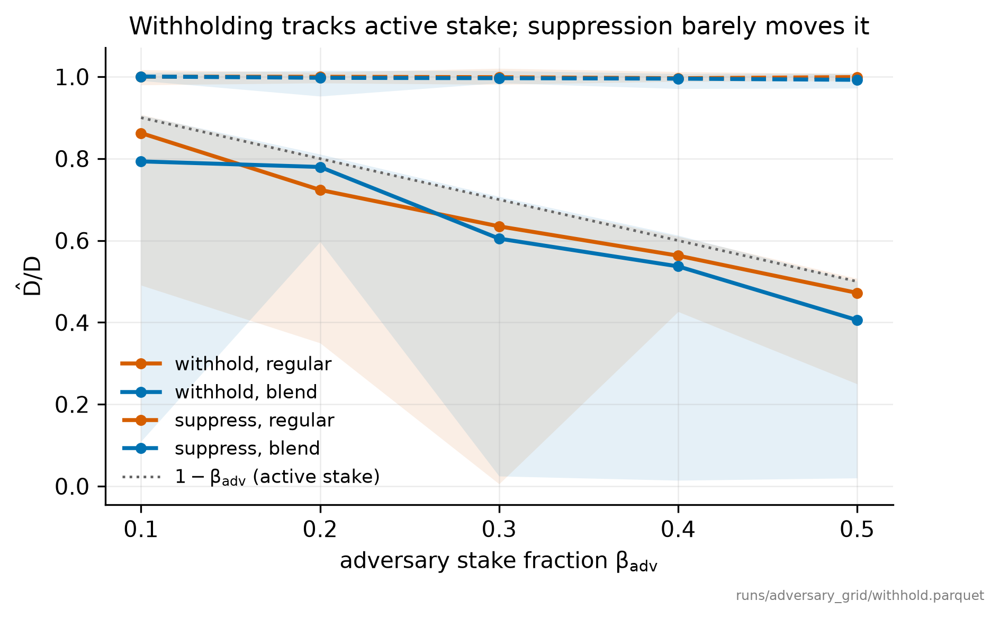

<a id="s6-5"></a>
### 6.5 Dynamic (withhold-then-rejoin) grinding is unprofitable and non-persistent (`fig10`–`fig12`)

The static withholder of [§6.4](#s6-4) pays a permanent price. The dynamic variant tries to *time* participation: **abstain to deflate `D̂`, then re-activate to mine at the depressed difficulty**. We added a schedule (`adversary_period`, `adversary_withhold_epochs`) that withholds the coalition for part of each cycle and lets it behave honestly the rest, and attributed each epoch's canonical blocks to the coalition (reward accounting). Four results settle the threat.

**(i) The estimator is a moving average (EMA) of active stake; its speed is the learning rate `β`, not `W` (`fig10`).** Substituting the equilibrium density `m/T ≈ f·S_t·D*/D̂` into the spec recursion `D̂ ← D̂·(1 − β(f − m/T)/f)` gives, to leading order, `D̂_{t+1} = (1−β)·D̂_t + β·S_t·D*` — an exponential moving average of the active-stake signal `S_t·D*` (`D̂_{t+1}` is the estimate computed at the *end* of epoch `t`, from that same epoch's activity, and in force during epoch `t+1`; `fig10` indexes it by the epoch in which it is computed, so the overlay is contemporaneous with `S_t`. `S_t` = active fraction in epoch `t`, `D*` = the honest-equilibrium estimate, which slot-counting puts at exactly `D` ([§2.1](#s2-1)); the [§6.5](#s6-5)/[§6.6](#s6-6) ratios `D̂/D*` are therefore the same `D̂/D` used in [§3](#s3)) with time-constant `τ = −1/ln(1−β)` epochs (this `β` is the TSI learning rate, `constants.BETA_DEFAULT` — unrelated to the coalition stake `β_adv`). The sim matches this law to **RMS 0.016** across `β ∈ {0.25, 0.5, 1.0}`. At the deployed learning rate **`β = 1` the estimate equals the current epoch's active stake outright** (`τ→0`, `D̂_{t+1} = S_t·D*`), and the one-epoch lag lives in the *lottery*, which spends the following epoch using it ([§6.11](#s6-11)); a withhold cycle then draws a near-square-wave sawtooth between `D*` and `(1−β_adv)D*`. A natural expectation is that the *uncle window* `W` sets the response speed; in fact responsiveness is set by the TSI learning rate `β`, *not* `W` (which sets equilibrium *accuracy*, not *speed*). A slower `β` shrinks the peak swing for a fixed schedule (amplitude 0.35 → 0.13 as `β`: 1 → 0.25) but, per (iii), buys the adversary nothing.

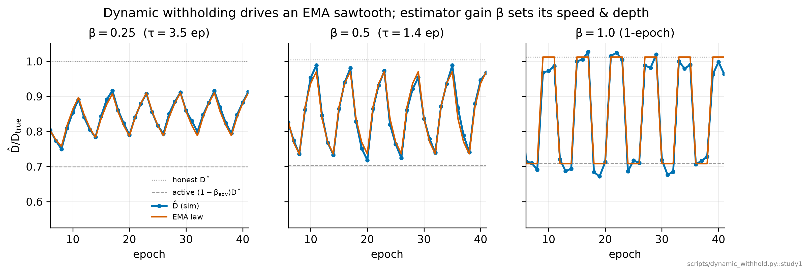

**(ii) It is strictly unprofitable — worse than not attacking (`fig11`, left).** Crediting the coalition's realized canonical blocks and dividing by its stake share `β_adv`, dynamic withholding earns **less than its stake share at every withhold duty `ψ > 0`**, monotone-decreasing in `ψ`, → 1 only as `ψ → 0` (never withhold). At `β_adv = 0.3` (`β = 1`):

| withhold duty `ψ` | 0 | 0.10 | 0.25 | 0.33 | 0.50 | 0.67 | 0.75 | 1.0 (static) |
|---|---|---|---|---|---|---|---|---|
| reward / stake | 1.00 | 0.95 | 0.81 | 0.74 | 0.68 | 0.41 | 0.31 | 0.00 |

The curve is **within `0.09` for `β = 0.5` and `β = 1.0`** at every duty — profitability is near-independent of estimator speed; the one visible gap is at the alternating `ψ = 0.5` (`0.59` at `β = 0.5` vs `0.68` at `β = 1.0`), where the period-2 schedule resonates with the fast estimator's one-epoch lag, and the two agree to `≤ 0.02` at every other `ψ` — and stays `< 1` for every minority coalition (`β_adv = 0.1 … 0.4` at the alternating schedule give 0.56 … 0.73). This is the [§6.4](#s6-4) subsidy made dynamic: the coalition **forfeits whole epochs** to depress a difficulty whose benefit — a higher win rate at lower `D̂` — accrues **equally to every honest node**, so its *relative* share never rises while it *alone* pays the forfeit. The reward-maximising schedule is `ψ = 0`: don't withhold.

**(iii) As a pure griefing lever it is bounded and linearly costly (`fig11`, right).** If the adversary abandons profit and only wants to distort `D̂`, the leaky-integrator form of (i) gives the mean deflation exactly: **`1 − ⟨D̂/D*⟩ = β_adv·ψ`** (bounded by `β_adv`, maximal at the static `ψ = 1`), cross-checked analytically and in sim. It costs the coalition `≈ ψ` of its *own* reward, so distortion is only a fraction `β_adv` of what the attacker forfeits — the distortion-vs-forfeit locus sits **below the 1:1 line** and a slower `β` does not lift it. There is **no super-linear amplification** in any regime. Per unit of the *coalition's own* forfeited reward — the measure `fig11`(right) plots — the distortion is `0.30 – 0.63` across the duty sweep and `0.11 – 0.75` across `β_adv = 0.1 … 0.4`, always **below** 1:1. Normalised instead per unit of ***network*** reward forfeited (`β_adv·(1 − reward/stake)`), the ratio sits modestly above 1 across the **whole** tested grid — `1.14, 1.14, 1.67, 1.88` at `β_adv = 0.1, 0.2, 0.3, 0.4` (`β = 1`, `ψ = 0.5`), and `1.00 – 2.08` over `ψ` at `β_adv = 0.3` for **both** `β = 0.5` and `β = 1` — i.e. it is a small `≈ 2×` constant arising from rejoin overshoot, a protocol-chosen estimator gain rather than an adversary lever, not a regime the attacker can enter by growing. (Largest coalition simulated here is `β_adv = 0.4`; no `β_adv = 0.5` dynamic cell was run. The static `ψ = 1` grid of [§6.4](#s6-4), which does reach `β_adv = 0.5`, gives the same ratio *decreasing* with stake: `2.07 → 1.19` on blend and `1.38 → 1.06` on regular over `β_adv = 0.1 → 0.5`.)

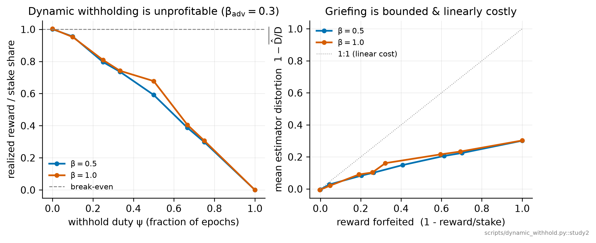

**(iv) No self-sustaining collapse — the pulse is a pure transient (`fig12`).** The most worrying possibility is a withhold *pulse* that kicks the [§6.2](#s6-2) load-feedback loop across its fold into a *persistent* deflation that outlives the attacker. It does not: a 4-epoch pulse followed by honest behaviour returns `D̂` to the load-determined honest equilibrium at **every** operating point and **every** learning rate tested (`β = 0.25, 0.5, 1.0`). Where `D̂` sits low afterwards (0.21, 0.02 at `ρ ≫ 1`) that is the **chronic `ρ > 1` under-count of [§3.3](#s3-3) / [§6.3](#s6-3) — a provisioning failure, not the adversary's doing** (the pulse-free honest run sits at the identical level). The per-node dynamics have a unique attracting equilibrium per operating point; the [§6.2](#s6-2) bistability of the *fitted static* `q_eff(ρ)` map does not create a trapping basin in the full dynamics.

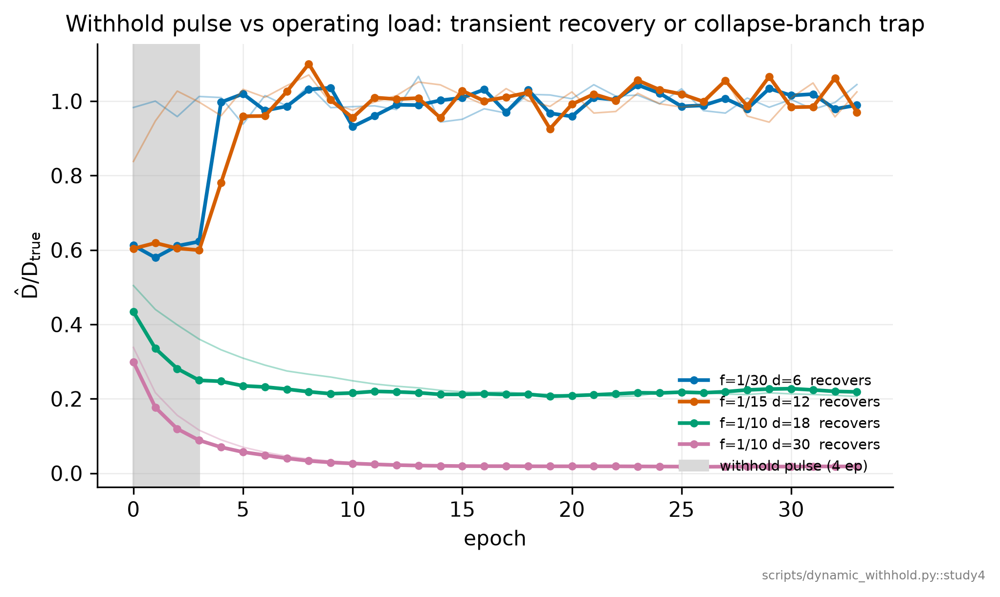

**Net.** Within its model, dynamic withholding is a *weaker* threat than the static case it generalises: no profit, bounded and costly distortion, no persistence — resolving the question left open at the end of [§6.4](#s6-4). The mitigation is unchanged and now doubly motivated: **hold the honest operating point at `ρ < 1` with margin** (which pins `D*` at the true stake, [§3.3](#s3-3)) and keep the learning rate responsive (`β = 1`, so any withhold notch is erased in one epoch). *Precondition, as in [§6.4](#s6-4):* counted uncles must be real VRF winners (enforced on-chain).

**Scope and limits (what this does *not* cover).** These results were verified by independent re-derivation and by baseline-corrected, forfeit-inclusive replicate sweeps; the confirmed claims come with a firm boundary:
- **Withholding here means *abstention* (deflate the active-stake estimate), not private-chain release.** A withheld block's arrival time is set past the epoch horizon `E` — it never propagates and is permanently orphaned, so the coalition's forfeit is a *dead loss*. That dead loss is exactly what makes (ii) unprofitable. The classic *selfish-mining / private-chain* withholder instead builds a hidden chain and *releases* it to orphan honest blocks, recovering the forfeit — the stronger lever, **analysed separately in [§6.6](#s6-6)** (it *is* profitable above the classic stake threshold, and its density deflation is mitigated by the same uncle mechanism).
- **The reward metric is relative canonical-block *share*** — which, because TSI holds the counted density at `f` (so the canonical block rate does not inflate when `D̂` deflates), equals the *absolute* per-block reward per unit stake; see the issuance note in [§6.6](#s6-6).
- **Open-loop, single, equal-stake coalition.** Untested here: adaptive (feedback) schedules that react to the observed `D̂` or target the finalized measurement window directly. (The joint/adaptive adversary is closed in [§6.7](#s6-7); *multiple* non-cooperating coalitions are treated in [§6.9](#s6-9).) The remaining three scope variants — whale coalitions, very slow `β`, and `jitter > 0` — are measured below.

**The scope variants, measured** (`scripts/adversary_variants.py`, 8–12 replicates per cell). None of the three overturns a conclusion; two strengthen one, and the first adds a caveat about how the `β_adv` axis should be read:

- **Whale coalitions (`adversary_selection: whale`, the largest holders at matched stake).** Concentration does not change the deflation: under suppression `D̂` is indistinguishable between a random coalition and a whale one at every stake tested (0.997 vs 0.998 at `β_adv` = 0.1, 1.001 vs 0.998 at 0.3, 0.990 vs 0.985 at 0.5). Under withholding the whale arm reproduces the [§6.4](#s6-4) law `D̂ → (1−β_adv)` *more* cleanly than the random arm does — 0.9005 / 0.6997 / 0.5010 against the predicted 0.9 / 0.7 / 0.5. The concern the scope note raised (a "lumpier share statistic") turns out to point the other way, and the reason is the coalition *construction*, not concentration: a random coalition is grown until its stake first reaches `β_adv`, so the last node added overshoots by its own size — which under a Pareto tail can be a whale. Its realised block share is therefore both biased high and highly variable (0.137 ± 0.108 at a nominal `β_adv` = 0.1), while the whale coalition, filled largest-first up to the target, lands on 0.0999 ± 0.0037. Read the `β_adv` axis of [§6.3](#s6-3)–[§6.4](#s6-4) as a nominal target with that overshoot around it, not as a realised share.
- **`jitter > 0`.** Re-running the withhold-rejoin schedule in the guaranteed-exact mode across `jitter_mean ∈ {0, 0.3, 1.0}` slots changes nothing measurable: mean `D̂` 0.848 / 0.848 / 0.847, notch amplitude 0.390 / 0.402 / 0.410, attacker block share 0.150 / 0.152 / 0.152, and `range_ratio ≡ 0` throughout — consensus stays exact under attack, as [§6.1](#s6-1) found it does honestly.
- **Very slow `β`.** Extending the gain sweep below [§6.5](#s6-5)(ii)'s 0.25 confirms the trend and exposes its cost. The notch keeps shrinking (amplitude 0.415 → 0.159 → 0.080 for `β` = 1 → 0.25 → 0.1) while the attacker's take stays flat (block share 0.150 at every `β`, confirming (iii)) — but the *mean* estimate sinks as the estimator loses the ability to track back up during the honest half of the cycle: `D̂` 0.842 / 0.848 / 0.829 / **0.765** for `β` = 1 / 0.25 / 0.1 / 0.05. Slow `β` therefore trades a smaller oscillation for a deeper standing deflation, and buys the defender nothing on either axis — an independent argument for row 5's `β = 1`.

<a id="s6-6"></a>
### 6.6 Private-chain (selfish) withholding is profitable above the classic threshold; uncle-counting still restores the estimate (`fig13`)

[§6.5](#s6-5)'s "withholding" was *abstention* — the coalition **discards** its blocks. The stronger, standard block-withholding attack is **selfish mining** (Eyal–Sirer): the coalition mines a **private chain** and **releases** it to orphan honest blocks, *recovering* the forfeit. Because TSI reads density from a window past k-finality where all nodes agree on the canonical chain ([§3.1](#s3-1)), the outcome is a global longest-chain race with a network tie-break `γ` (the fraction of honest miners that adopt the adversary's block in a same-length race); we simulate it directly (`selfish.py`, validated to within simulation noise against the Eyal–Sirer closed form).

**Profitability (`fig13`, left).** Unlike abstention, private-chain withholding **earns more than its stake share above the classic threshold** `α > (1−γ)/(3−2γ)` (here `α` is the coalition stake fraction, ≡ `β_adv` of [§6.3](#s6-3)–[§6.5](#s6-5), in the selfish-mining literature's notation) — ⅓ at `γ = 0`, ¼ at `γ = 0.5`, → 0 as `γ → 1`. At `α = 0.4`: revenue/stake `= 1.21×` (`γ = 0`) up to `1.42×` (`γ = 1`); below threshold (`α = 0.2`, `γ = 0`) it under-earns (`0.65×`). This is the general Nakamoto-PoS selfish-mining result — not TSI-specific — and it is the **honest upper bound on withholding profitability that [§6.5](#s6-5)'s abstention model does not capture**.

*How much does the **optimal** strategy add?* SM1 — the original Eyal–Sirer strategy — is one fixed policy, not the best one; solving the Sapirshtein–Sompolinsky–Zohar model, a Markov decision process that searches over *every* possible withhold/release policy (`selfish_mdp.py`; states `(a, h, fork)`, actions adopt/override/match/wait, ratio objective by bisection + damped relative value iteration), gives the true frontier (`fig14`, left). At `γ = 0` the optimum barely beats SM1 (`0.488` vs `0.484` at `α = 0.4`; profitability threshold essentially the SM1 `⅓`, marginally below it), so **SM1 is a faithful proxy** there; the gap opens only with network advantage (`γ = 0.5`: `0.573` vs `0.526` at `α = 0.4`, `0.803` vs `0.723` at `α = 0.46`). The optimal revenue equals `α` below threshold — confirming the *threshold* itself, not just SM1's revenue — and upper-bounds any selfish take.

) shrink the premium (right — the benign limit of [§6.7](#s6-7)).](report-figures/fig14_optimal_rewards.png)

**The TSI coupling (`fig13`, right).** Selfish mining orphans honest blocks (23.7 % of all blocks at `α = 0.4`, `γ = 0`), so the *counted* canonical density falls and TSI **deflates `D̂` to `D*·(density fraction)`** — `0.70` at `α = 0.4` with no uncles: a 30 % under-report of active stake, a safety harm layered on the reward theft. But that under-count is precisely what **uncle references fix** ([§3.2](#s3-2)): counting orphaned honest blocks back into the density restores `D̂` toward `D*` — to `0.82` at `η = 0.5` and `0.94` at `η = 1` (uncle-recovery fraction `η ∈ [0,1]`, distinct from the integer uncle cap `U`). So the mechanism provisioned for honest latency recovery **doubles as the mitigation for selfish mining's estimator deflation** — this restores the *estimate* `D̂` (a safety win), independent of the reward schedule. Whether *rewarding* those uncles also cuts the selfish *profit* premium is a separate, conditional question — it can *backfire* without care and needs a soft inclusion rule — taken up in [§6.7](#s6-7)–[§6.8](#s6-8).


**But `η` is not free — the first-fork restriction caps it, and SM1 hides that (`fig36`).** `fig13`'s recovery curve reads `η` as a knob over `[0,1]`, and against **SM1** the full range is attainable: SM1 acts the moment the honest branch reaches length 1 (match at a 1-lead, override at a 2-lead, publish-one above it), so it never buries a second block behind the first, every orphan it makes is the first block of its fork, and the countable model ([§2.1](#s2-1)) can reference all of them — measured `η = 1.000000` exactly, at every `α` and `γ` tested. The **optimal** policy — the one invoked above as the true profit frontier — does not oblige. It *waits*, then overrides a run of `h` honest blocks at once; that run is one chain, so only its first block has a parent on the referencing chain and the deployed rules recover **one** uncle from it, not `h`. Solving the SSZ MDP for its stationary orphan structure (`scripts/countable_selfish.py`, cap = 64) gives the ceiling directly (`γ = 0`):

| `α` | `η` ceiling (countable) | `D̂/D*` unrestricted, `p_ref` = 1 | `D̂/D*` countable, `p_ref` = 1 |
|---|---|---|---|
| 0.34 | 0.585 | 0.926 | **0.856** |
| 0.40 | 0.441 | 0.945 | **0.811** |
| 0.46 | 0.105 | 0.955 | **0.619** |

So **SM1 is a faithful proxy for selfish-mining revenue but not for TSI's estimator damage**: at `α = 0.4, γ = 0` its revenue share (0.484) sits within 1 % of the optimum's (0.489), while its recoverable-orphan fraction (1.00) is more than double (0.44). The repair is real but roughly **half** of what the unrestricted model shows — `0.81`, not `0.94`, at `α = 0.4` — and it moves the *wrong way* with `α`: the unrestricted recovery improves as the attacker grows (0.926 → 0.955) because a stronger attacker orphans a larger share of a shrinking honest chain, while the countable recovery **degrades** (0.856 → 0.619) because a stronger attacker waits longer and buries more blocks per fork. (Read the `α ≥ 0.42` cells as indicative: the orphan *shape* converges more slowly in the MDP's lead cap than the revenue does — `η` at `α = 0.45` still moves by ~3 % relative between cap 48 and 64, against ~0.1 % at `α = 0.4`.) The depth-maximising adversary of [§6.10](#s6-10) agrees on the magnitude from the other direction — `η = 0.52` at `α = 0.30` with the measured honest fork rate `o = 0.35` (`reorg.countable_recovery_from_depths`). Neither figure is a worst case: both adversaries optimise something else (revenue, depth), and one optimising *deflation* directly would trade revenue for fork depth. The attacker's own channel is capped by the same rule — its abandoned secret chain is also one chain, so it can self-uncle only the first block of it (`η_adv = 0.750` at `α = 0.4`), which narrows the [§6.7](#s6-7)(a) farming payoff below what the block count suggests.

**The revenue-optimal adversary is not the estimator's worst case (`fig37`).** Every ceiling above comes from an adversary optimising something *other* than the estimate, so they bound `η` from above without bounding the damage from below. Optimising the estimator directly closes that gap — and needs no ratio transform, because each transition consumes exactly one block-finding event, so minimising `D̂/D = (canonical + p_ref·countable uncles)/events` is a plain average-reward MDP over the same transition table.

Asked without constraint the question degenerates, informatively: the optimum is **pure abstention** — publish nothing, adopt when overtaken — landing `D̂` on exactly `1 − α` with zero revenue. That is [§6.4](#s6-4)'s withholding, which is *correct* measurement rather than mis-measurement, since a coalition that publishes nothing genuinely is not participating. So the question that bites is what an adversary can do **while still being paid**. Sweeping the mixed objective `λ·(adversary blocks) − (contribution to D̂)` enumerates candidate policies; the line of interest is where the attacker's **absolute reward per unit time** matches honest mining, so that the attack costs it nothing (below that line it is self-punishing griefing, already bounded by [§6.5](#s6-5)).

*Pay, not share.* The two differ, and not negligibly. A revenue *share* is measured against the canonical block rate, but what an attacker is actually paid is set by the estimator: TSI drives the **counted** density — canonical blocks plus recovered uncles — to `f` per slot, so a run yields `f/D̂` block-finding events per slot and a deflating attack makes the lottery easier for everyone. Pay per slot is therefore `adv_rate·f/D̂` against an honest miner's `α·f`, and the correction on the share ratio is `density/D̂`, below 1 whenever any uncle is recovered. Scoring the frontier on share alone credits the attacker with pay it never receives.

| `α` | revenue-optimal `D̂` | best *paying* policy: pay / `D̂` | extra deflation |
|---|---|---|---|
| 0.36 | 0.845 | — nothing in the sweep both pays and deflates | — |
| 0.38 | 0.830 | 1.02× / **0.749** | 0.081 |
| 0.40 | 0.811 | 1.00× / **0.649** | 0.163 |
| 0.45 | 0.664 | 1.18× / **0.568** | 0.096 |

At `α` = 0.4 an adversary earning exactly what honest mining would pay it drives the estimate to **0.65**, where the revenue-maximiser reaches only 0.81. Those 16 points are bought with the selfish premium alone — a price an attacker whose goal is the estimator will happily pay. The exposure does *not* open at the `⅓` selfish threshold, though: at `α` = 0.36 no policy in the sweep both pays and deflates, so it begins nearer 0.37–0.38, above the point where selfish mining itself turns profitable. (The sweep parameter is deliberately not monotone in revenue: selfish mining takes a larger share of a *smaller* pie, so raw block rate is maximised by honesty and large `λ` returns there — it enumerates policies, it is not a path. The pay conversion neglects the multi-winner factor `c(f) ≈ 1.017` between events and occupied slots ([§2.1](#s2-1)), small against a 16-point effect.)


**The per-node engine reaches the same ceiling independently.** Everything above is a stationary MDP: one global chain, no network, recovery inferred from the policy's orphan structure. Running a private-chain coalition inside the per-node simulator instead — real propagation delays, per-node views, an actual uncle queue draining against `U` and `W` — reproduces the mechanism from the other side: of the honest blocks a private-chain attack destroys, only 59–81 % are countable at all (against 97 % of ordinary latency orphans), and the shortfall is precisely the blocks buried behind the first of each discarded run ([§6.8](#s6-8)). Two models that share no code and make different idealisations agree on both the direction and the rough size of the loss, which is the strongest evidence available here that the first-fork ceiling is a property of the counting rule rather than of either model.


**Issuance model.** Does deflating `D̂` inflate the reward pie? No, for a per-canonical-block schedule: TSI targets *counted* density `= f`, so the canonical block rate is held at `≈ f` regardless of the attack (the extra lottery wins a deflated `D̂` produces are orphans that earn nothing). Absolute reward per unit stake therefore equals the revenue *share* metric — **[§6.5](#s6-5)'s "abstention is unprofitable" is robust under per-block issuance**, and [§6.6](#s6-6)'s selfish premium is the genuine profit channel. MEV (value extracted from transaction ordering) or a per-*raw*-block schedule would reopen this — an issuance-design question, not a TSI-estimation one. *(This clean equivalence assumes the block-only schedule; once [§6.7](#s6-7) pays and **counts** uncles, the counted density held at `f` includes recovered uncles, so the canonical rate sits slightly below `f` and the pie's size and split both shift. [§6.7](#s6-7)'s profitability is then read directly off the reward *share*, not off a fixed pie — the two subsections use different issuance premises, reconciled only in the `w_u = 0` limit.)*

**Scope.** Modelled: SM1 *and* the optimal-MDP selfish strategy with a network tie-break `γ`, a single coalition, uncle density-recovery as the `[0,1]` knob `η`, the ceiling the countable rule puts on `η` for the optimal policy, and — in the per-node engine, where the knob becomes a real uncle queue — an SM1 private chain under explicit propagation delay ([§6.8](#s6-8)). Multi-coalition races are discussed (not solved) in [§6.9](#s6-9); their orphan *shape*, and hence their own `η` ceiling, is unmodelled for the same reason. The reward analysis of [§6.7](#s6-7)–[§6.8](#s6-8) runs on the SM1 race, where every orphan is countable, so its numbers are unaffected by the restriction — but they inherit SM1's optimism about *which* orphans exist to be compensated. The headline: **private-chain withholding is the real profit threat, bounded by the classic stake threshold; its *estimator* deflation is roughly halved by uncle-counting rather than undone, while its *profit* premium is only conditionally reduced by rewarding uncles ([§6.7](#s6-7)–[§6.8](#s6-8)).**

<a id="s6-7"></a>
### 6.7 Block/uncle rewards: robust for fairness and anti-hiding, but a *voluntary* reward can backfire on selfish mining (`fig14`, `fig15`)

Everything above measures *blocks*. Whether an attack **pays** depends on the reward schedule, which is a design choice. We add one as a configurable option (`selfish.RewardParams`): a block reward (`= 1`), an **uncle reward** `w_u` (a reward weight — distinct from the uncle *window*, which this report calls `W`) paid to the *producer* of an orphaned block that is referenced as an uncle, and a **nephew reward** `w_n` paid to the block that *references* it. The model has five knobs in total: `w_u`, `w_n`, the honest-orphan reference rate `p_ref` (defined below), the attacker's self-uncling rate `p_ref_adv` (= 1 for a rational attacker), and `adv_nephew` — the fraction of referenced honest orphans whose *nephew* reward the attacker's own canonical blocks capture (0 without a forced-inclusion mandate, since honest blocks do the referencing). Three effects, all adversarially analysed.

**(1) It compensates orphaned honest producers (fairness).** A block-only schedule pays an orphaned honest block **nothing** — the same "off-chain, uncounted" fate that drives both the [§3.2](#s3-2) latency under-count and the losses a selfish attacker inflicts. Define the **reference rate** `p_ref` = the probability that an orphaned honest block is referenced as an uncle by some canonical block within `W`. An uncle reward `w_u` refunds the loss in proportion to `p_ref`: honest recovery of *mined* value rises with `w_u` toward `1.0` (e.g. in the α = 0.4 selfish race, `0.61 → 0.80 → 1.00` for `w_u = 0 → 0.5 → 1` at `p_ref = 1`; `fig15`, right, plots recovery vs `p_ref`). The same references that restore the TSI *density* ([§6.6](#s6-6), `D̂`) restore the *reward*. **This benefit is robust for the case it is designed for** — a genuine latency orphan is *published*, straddled by *honest* canonical blocks that reference it, and (crucially) the **first block of its fork**, so `p_ref ≈ 1` and the refund is available in full.

**But it cannot reach the orphans a private chain makes, at any `w_u`.** The recovery figures above are computed on the SM1 race, where the attacker acts the moment the honest branch reaches length 1 and so every orphan it makes is a first-fork block. A private-chain override discards a *chain*, and only its first block is referenceable ([§2.1](#s2-1)) — measured in the per-node engine, 20–40 % of the honest blocks such an attack destroys can never be referenced by anyone ([§6.8](#s6-8)). An uncle reward refunds `w_u` per *referenced* orphan, so those producers are uncompensatable by construction: not underpaid because `p_ref` is low and could be raised, but unreachable because no valid block may name them. The fairness ceiling is therefore the same first-fork ceiling that caps the density repair, and it binds hardest on exactly the honest miners an attacker targets. This is a limit of the *counting rule*, not of the reward schedule, so no choice of `w_u`/`w_n` addresses it; what a schedule can still do is avoid *compounding* it, which is what the [§6.7](#s6-7)(a) `w_u + w_n < 1` invariant does.

**(2) It disincentivises hiding.** A withheld block (the [§6.4](#s6-4)/[§6.5](#s6-5) lever) *never propagates*, so it can never be referenced as an uncle — the withholder forfeits **both** the block reward **and** any uncle reward. Publishing promptly is therefore strictly dominant for an honest-but-unlucky miner, and abstention is made even costlier than the already-negative [§6.5](#s6-5) result. The reward schedule turns "publish everything you win, immediately" into the incentive-compatible action.

**(3) On selfish mining, a *voluntary* uncle reward can *backfire* — a soft inclusion rule fixes it (`fig15`, [§6.8](#s6-8)).** The naive hope is that paying orphaned honest blocks lifts honest reward and cuts the attacker's share. But the attacker controls the references that would do so: the honest blocks it orphans by a selfish override are straddled by *its own* canonical blocks, and it **suppresses** them (the [§6.3](#s6-3) lever) — while **self-uncling** its own revealed-but-lost blocks to recover `w_u + w_n` each.

Modelling that strategic reference game (`selfish.reward_shares`, with `p_ref_adv` = the attacker's rate of self-uncling its own lost blocks, `= 1` when rational), a voluntary uncle reward makes the attacker's **reward share rise *above* its block share** (e.g. `α = 0.4`: `0.484 → 0.520` at Ethereum-like `w_u = 0.875`), and honest recovery falls (to `0.61` at `α = 0.4`, `0.34` at `α = 0.46`). *(The benign-looking `fig14`-right — "uncle rewards shrink the premium" — is the opposite `p_ref = 1` limit of full inclusion; the backfire is the suppressed `p_ref → 0` end. `fig15` plots the whole `p_ref` axis and reconciles the two.)*

The backfire is *unconditional* below the `⅓` threshold and holds at higher `α` while the attacker keeps `p_ref` low (its default, since it owns the straddling blocks); it weakens as honest blocks reference more orphans (`p_ref` high). The worst case `p_ref = 0` (suppress *all* references) is not achievable: honest orphans are published, so honest canonical blocks reference them anyway. [§6.8](#s6-8) shows that under a **soft** (reward-weighted) inclusion rule the emergent `p_ref` sits high — the selfish share falls below block-only and toward stake, with honest recovery restored, and **without** the fork risk a hard mandate would carry. (How high `p_ref` must be depends on `α` — quantified in [§6.8](#s6-8), `fig15`.) So the *fairness* benefit (1) and *hiding*-disincentive (2) are robust and attacker-independent; the selfish-mitigation (3) is real but **degrades gracefully with the reference rate `p_ref`**, which the window `W` and visibility set ([§6.8](#s6-8)).

**Adversarial analysis of the reward scheme itself.** A reward for uncles is a new payout, so a new attack surface — *bounded*, but only under an explicit constraint the naive "`w_u < 1`" misses.

*(a) Uncle farming with a self-nephew.* An attacker who deliberately orphans a genuine VRF win and references it **from its own next canonical block** collects *both* payouts: `w_u` (uncle producer) **and** `w_n` (nephew). The per-slot payoff is `w_u + w_n` against an honest block's `1`, so farming beats honest **iff `w_u + w_n > 1`**. The binding safety condition is therefore **`w_u + w_n < 1`**, *not* `w_u < 1` — e.g. Ethereum's `0.875 + 0.03125 = 0.906 < 1` is safe, but a loose "substantial `w_u` + small `w_n`" (say `0.875 + 0.15 = 1.025`) is **not**. Fabrication is impossible (a counted uncle must be a real VRF winner, [§6.3](#s6-3)), keeping the payoff per-slot rather than unbounded, and `U`/`W` cap total uncle issuance to `≤ U·(w_u + w_n)` per block.

*(b) Multi-winner self-uncle.* A miner that wins two concurrent slots (multi-winner slots exist, ~1.7 % of blocks) can make only one canonical and, if the schedule pays it, earns `1 + w_u` by uncling the other. This does **not** inflate the estimate — TSI counts the slot once either way ([§2.1](#s2-1)) — so it is a pure reward-fairness question, bounded by `w_u + w_n < 1` on the referencing side.

*(c) The reference game is not fixed by a plain `w_n`.* Because the selfish attacker suppresses references on its *own* override blocks, a nephew reward it *also collects* does **not** by itself force inclusion — in the model, raising `w_n` slightly *lowers* `α*` (the stake threshold above which selfish mining is profitable — i.e. it marginally *helps* the attacker, which pockets a canonical-share slice of the nephew pot). What *does* keep the effective reference rate high is that the orphans are **published**, so the many *other* honest blocks within `W` reference them anyway ([§6.8](#s6-8)). A hard "invalid block if it omits an uncle" mandate would force this outright but **cannot be encoded fork-safely** (no node can prove what forks a producer saw — [§6.8](#s6-8)), so we use a **soft (reward-weighted) inclusion rule** instead. *(Consolidated protocol recommendation: end of [§6.8](#s6-8).)*

**Joint / adaptive adversary** (the adaptive-schedule case left open in [§6.5](#s6-5)'s scope note). The optimal *within-race* adversary is the [§6.6](#s6-6) MDP. Combining selfish release with the [§6.5](#s6-5) *abstention* lever is **dominated**: abstaining a fraction `ψ` of your wins lowers effective mining power to `α_abst = α(1−ψ)/(α(1−ψ)+1−α) < α`, and selfish revenue is monotone increasing in `α` (`fig14`), so withholding-to-abstain strictly reduces the take. Closed-loop timing on `D̂` adds nothing either: the selfish revenue *share* depends only on `(α, γ)`, not on `D̂` (the race is decided block-by-block, while `D̂` moves on the epoch scale). So the **profit** frontier is exactly **optimal selfish mining, bounded by the stake threshold** — and, *under the [§6.8](#s6-8) soft inclusion rule that keeps the emergent `p_ref` high*, blunted but not eliminated by rewarded uncles. No compounding lever raises the *take*. This argument is about revenue throughout, and does not transfer to the estimate: an adversary indifferent between earning its stake share and earning the selfish premium is free to spend that premium on deflation instead, which is a strictly larger policy space than the one bounded here ([§6.6](#s6-6), `fig37`).

<a id="s6-8"></a>
### 6.8 A *soft* inclusion rule delivers the benefit without a fork risk (`fig15`)

[§6.7](#s6-7)(3) shows a purely *voluntary* uncle reward can backfire on selfish mining. The tempting fix — a *mandatory* inclusion rule that makes a block **invalid** if it omits an owed uncle — cannot be encoded safely: "owed" means "the producer could have seen it," which depends on per-node gossip timing that no node can prove. An **objective** encoding (slot-gap `s_block − s_uncle ≥ g`) lets an adversary *withhold-then-late-release* an uncle to retroactively **invalidate honest blocks** (censorship); a **visibility-based** encoding is *subjective*, so the same block is valid to some nodes and invalid to others — a **consensus fork** with no adversary at all. **We therefore make inclusion a soft rule:** *a block is always valid; a producer that includes an available in-window uncle earns the nephew reward `w_n`, and the orphan producer earns `w_u` — omission simply forfeits those rewards.* No validity edge, so no fork and no censorship weapon.

**The emergent `p_ref` is high — now measured, not assumed.** The per-node engine records `p_ref` directly (the fraction of in-window orphans referenced as uncles by some canonical block): at the recommended `W = 300` it is **0.944 honestly** and **0.936 under a 30 %-stake coalition that produces its share of the (straddling) canonical blocks and suppresses references on them** ([§8](#s8) capstone). That suppression case *is* the reference-suppression channel a selfish attacker would use — an honest orphan loses its reference only if *every* one of its in-window straddlers is a suppressing coalition block — so even with 30 % of the straddlers hostile the reference rate falls by less than a point, and stays far above the `p_ref ≳ 0.3` the soft rule needs for `α ≥ 0.4` (`fig15`). (The honest rate is 0.944 rather than ≈ 1 because the first-fork restriction leaves some orphans unreferenceable outright — an earlier edition quoted ≈ 1.0 from a capstone run that predated the countable model, [§8.4](#s8-4).) That, however, is the *suppression* channel only. The stronger one — the attacker *orphaning extra* honest blocks via a private-chain override — is measured separately below, and it is where the structural argument ("published honest orphans are straddled by *honest* blocks within `W`, which the attacker does not control") turns out to be too optimistic: it holds for the orphans that are *referenceable*, but a private-chain override buries most of them where no proposer may reach. The earlier analytic sweeps used `p_ref ≈ 0.85` as a conservative stand-in; against suppression that is pessimistic, against a private chain it is not conservative enough.

**Why a soft rule still works — the reference rate is emergent and high (`fig15`).** Under a soft rule `p_ref` is not the attacker's to set to 0: an honest orphan was **published** (honest miners publish immediately), so *any honest canonical block that sees it within `W`* references it for `w_n`. The attacker only withholds references on **its own** canonical blocks; the honest blocks that follow do the referencing. So `p_ref` sits **high** in practice, and `fig15` reads off the payoff along it — at a realistic honest-referencer rate `p_ref ≈ 0.85`, the selfish attacker's reward share is already **below block-only and near stake** (`0.420` at `α = 0.4`, vs `0.520` at the suppressed `p_ref = 0` and `0.484` block-only) with honest recovery `0.83–0.93`. For `α ≥ 0.4` the crossover below block-only is at `p_ref ≈ 0.3` (the grey band); for a near-threshold `α ≈ 0.35` a small residual backfire (`≤ +0.03` for `p_ref ≳ 0.3`, rising to `+0.05` at the unreachable `p_ref = 0`; share still near stake) persists until `p_ref ≈ 0.75`. So the soft rule buys **most** of the (unattainable) hard-mandate benefit, plus the full fairness and hiding-disincentive of [§6.7](#s6-7)(1–2), with **none** of the fork/censorship hazard.

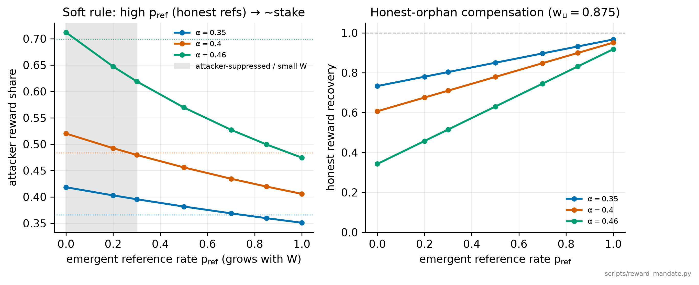

**What sets `p_ref` — the window `W` and visibility (the residual).** `p_ref` rises toward 1 as `W` grows (more following honest blocks get a chance to reference a given orphan) and falls only when an orphan **ages out of `W` before any honest referencer sees it** — i.e. under a *deep reorg* longer than `W`, or genuine propagation loss. This is exactly the "can't guarantee a node sees every fork in the window" limit, and it is `W`-tunable: the [§3.4](#s3-4) sizing `W ≈ 10/f` is already generous, and the residual adversarial lever (drive `p_ref` down via reorgs deeper than `W`) is bounded — deep reorgs need large `α`, are rare, and risk the attacker's private chain. One proviso remains, about *degree* not *direction*: even at `p_ref = 1` the selfish share is `≈ α` with a small residual premium that **grows with `α`** — `≈ 0` near the `⅓` threshold, `+0.006` at `α = 0.4`, `+0.014` at `α = 0.46` — not exact break-even.

**Under a private chain the uncle cap is not the binding constraint — the fork structure is.** The engine carries a private-chain coalition (`adversary_strategy: selfish`, SM1 release rules), so the whole loop is present: the attack orphans honest blocks in runs, the survivors queue for the `U` uncle slots of each canonical block, and whatever does not drain within `W` ages out. Sweeping the cap against the attack (`scripts/selfish_uncle_margin.py`; N = 1 000, k = 256, 8 replicates, `U ∈ {1,2,3,4}` × `W ∈ {10, 20}`) settles the question the honest-load rule left open. **Raising `U` does not buy the estimate back.** At the design point (`δ_max` = 8 s) and `α` = 0.3, `D̂/D` reads 0.729 / 0.755 / 0.738 / 0.758 for `U` = 1 / 2 / 3 / 4 — flat within replicate noise — and no attacked cell reaches the 0.98 recovery bar at any cap or either window, while the honest baseline in the same sweep reproduces [§3.4](#s3-4) exactly (`U` = 1 clears at `δ_max` = 8; `δ_max` = 16 needs `U` = 2 at `W` = 10, or `W` = 20 at `U` = 1).

The reason is visible once the honest orphans are split by *why* they went unreferenced — structurally unreachable, or eligible but starved of a slot. (Neither `p_ref` nor `deep_ref_share` separates these: the first mixes them, and the second is 0 by construction here, because the proposer's candidate filter drops deep-fork blocks before any reference to one is ever proposed.) Walking the tree directly (same script, 6 replicates):

| | honest | `α` = 0.2 | `α` = 0.3 |
|---|---|---|---|
| honest orphans that are **countable** (first block of their fork) | 97 % | 76–81 % | 59–72 % |
| of those, **referenced** within `W` | 90–93 % | 84–93 % | 80–88 % |

The queue is draining. Countable orphans are referenced at essentially the honest rate whatever the attack, and the one place the cap matters is the honest-load reason it was sized for — going `U` = 1 → 2 lifts that rate from 84 % to 93 % at `α` = 0.2, then `U` = 4 adds nothing. What collapses is the *countable* share: an override discards a **chain**, and only its first block has a parent on the surviving chain ([§2.1](#s2-1)), so 20–40 % of the honest work the attacker destroys is unreferenceable by construction. `U` governs drain capacity for candidates that exist; it cannot manufacture eligibility. This is the [§6.6](#s6-6) first-fork ceiling arriving from a completely independent direction — a per-node network simulation rather than a stationary MDP — and it is why `U = ⌈ρ⌉ + 1` needs no adversarial margin: the margin would be spent on a queue that is not the bottleneck.

**Reward-side attack surface (bounded, self-defeating).** *(a) Farming* — orphaning a real VRF win to self-uncle it — pays `w_u + w_n` against `1`, so it is loss-making under the [§6.7](#s6-7)(a) invariant **`w_u + w_n < 1`**; in the model the attacker's share *falls* as it self-uncles more (`0.406 → 0.394`). *(b)* Because honest referencers count the orphans, a flood *inflates* `D̂` rather than deflating it — the opposite of what a deflation attack needs. *(c) Nephew leakage* to the attacker is bounded by `w_n` and dominated by the `w_u` that flows to the honest producer.

The consolidated reward-schedule recommendation is in [§8](#s8) (rows 10–11 of the selection table).

<a id="s6-9"></a>
### 6.9 Multiple coalitions and bribery: the abstention commons is bounded; multi-coalition selfish mining stays open

Everything above assumed a single coalition; this section asks what changes when several attack at once — or bribe others to.

**Withholding commons (solid).** `D̂` deflation depends only on the *total* participating stake ([§6.4](#s6-4)), not on how it is partitioned — this is **exact by construction** (the withhold mask is per-node membership with no sub-coalition label), so `K` abstaining coalitions summing to `β` deflate `D̂` exactly as one coalition of size `β`, and the [§6.2](#s6-2) fold is no more reachable by stacking than by a single coalition of the same `β`. Each is *individually* unprofitable ([§6.5](#s6-5)) and, given others already deflate, the best response is to *mine* at the depressed difficulty rather than join — so the abstention commons is not an equilibrium; pure griefers pay their aggregate forfeit for a bounded, linear deflation.

**Multi-coalition selfish mining (conjectural).** Here the abstention argument does **not** transfer: competing *selfish* miners orphan *each other*, and the literature shows the profitability threshold can fall **below** the single-miner `⅓` — several individually-sub-threshold coalitions may be *jointly* profitable, and total orphaning (hence raw `D̂` deflation) can **exceed** the single-coalition [§6.6](#s6-6) value, so `D̂ ≈ 0.70` at `α = 0.4` is *not* a multi-coalition upper bound. Our two-type model cannot represent a `K`-agent reference game, so this is flagged, not solved; TSI *safety* rests on the [§6.8](#s6-8) soft rule's honest-referencer `D̂`-recovery, which is itself `p_ref`-limited (`W`/visibility) and degrades — gracefully, never forking — as orphan volume rises. Sizing this properly is future work.

**Bribery on the reference game.** An attacker profiting from a deflated `D̂` can bribe canonical miners to *omit* references. Under the soft rule the miner forgoes only the nephew reward `w_n`, so a bribe `> w_n` (`≈ 0.03`) suffices — *cheap*, and here the hard-mandate "prohibitive (a full block)" defence is unavailable *by design* (we rejected validity-based inclusion for fork-safety, [§6.8](#s6-8)). But its *impact* is small: bribing away one block's references lowers `p_ref` only marginally, since the many *other* honest blocks within `W` still reference the orphan; to hold `p_ref` low the attacker must bribe (or control) a large fraction of canonical producers over the whole window. So soft-rule bribery is cheap per block but bounded in effect, and — like the withholding-commons bribe (pay coalitions to abstain, untouched by any inclusion rule) — reduces to the bounded, self-punishing griefing of [§6.5](#s6-5).

<a id="s6-10"></a>
### 6.10 Fork rate and reorg depth: keep reorganisations shallow

**The question.** How often does the chain fork, how *deep* can a reorganisation (reorg) go, and which parameters keep it shallow? A deep reorg is expensive — it discards confirmed blocks and forces every node to rewind — so a design that minimises reorg depth is safer and cheaper to run.

**Why it matters.** The other sections optimise the *estimate*; this one optimises the *chain structure* the estimate rides on. A parameter choice that keeps `D̂` accurate but lets forks run deep would still be a bad choice.

**What we measure.** The engine records, every epoch, the **fork rate** (share of produced blocks orphaned off the canonical chain) and the **max reorg depth** (the deepest orphan branch — the confirmed blocks a node adopting it would have to discard). For the adversarial case we assume a coalition holding **0 %, 10 %, 20 %, or 30 %** of stake running a **private-chain deepest-reorg strategy**: it mines a hidden chain and releases it to override the public chain by the largest margin it can (the standard longest-chain attack, tuned for depth rather than revenue). Its reorg-depth tail is the Nakamoto gambler's-ruin `P(depth ≥ d) = (α_eff/(1−α_eff))^d`, coupled to the parameters through the *effective* adversary share `α_eff = α/(α + (1−α)(1−o))`, where `o` is the honest fork rate — because orphaned honest blocks do not extend the public chain, so more honest forking hands the attacker more relative power.

**Result 1 — delay drives fork depth, and uncles keep it shallow** (`fig28`, honest lines). Even with no adversary, the honest max reorg depth grows with the Blend per-hop blending-delay bound `δ` (`δ_max` in [§3.3](#s3-3)) — the privacy knob of the Blend mix-network transport ([§2](#s2)), and the dominant term in the visibility delay that sets the load `ρ` (2 blocks at δ = 2 s → 4 at δ = 32 s with U = 2). Without uncles it is far worse: the deflated estimate ([§3.2](#s3-2)) makes the network over-produce blocks, which fork among themselves — honest max depth reaches **17** at δ = 32 s, U = 0, versus **4** at U = 2. So uncles reduce reorg depth twice over: by keeping the block rate at `f` (no overproduction) and by keeping the operating point recoverable.

**Result 2 — adversary depth grows with stake and with forking, and crosses a cliff** (`fig27`, `fig28`). At the recommended operating point (ρ < 1, δ ≈ 8 s, U = 2, honest fork rate ≈ 0.35) a 10 % coalition needs depth ~4 to reach 0.1 % probability, 20 % needs ~8, 30 % needs ~17 — reorgs of a handful of blocks. But heavier delay raises the honest fork rate, and at **δ = 32 s with 30 % stake the effective share `α_eff` crosses 0.5** — reorgs become **unbounded**: fork-induced orphaning has amplified a minority into an effective majority. Keeping ρ < 1 (few honest forks) keeps even a 30 % adversary bounded and shallow.

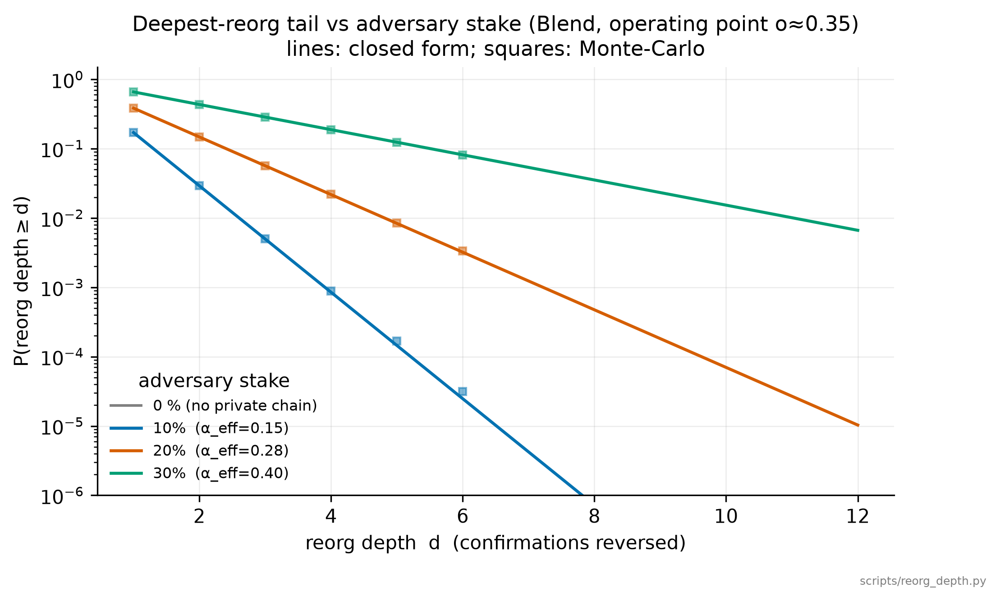

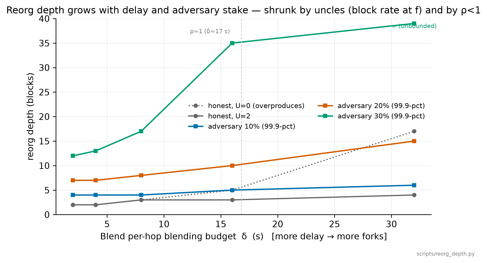

**Result 3 — a confirmation-depth rule for finality.** Turning the tail into a wait-time: at the recommended operating point (`o ≈ 0.35`), to hold `P(reorg ≥ d) < 10⁻³` a receiver waits **d ≈ 4 blocks (~2 min) against a 10 % adversary, 8 (~4 min) against 20 %, 17 (~8.5 min) against 30 %**; for a `10⁻⁶` guarantee, roughly double those (8 / 15 / 34 blocks). These are the confirmation depths for probabilistic settlement. The protocol's *deterministic* finality at `k = 2160` blocks is vastly deeper than any of these, so the finality-driven `k` ([§3.1](#s3-1)) is consistent with — and far more conservative than — the reorg tail; the confirmation-depth rule matters only for parties wanting faster-than-final soft settlement. These 4/8/17 depths are the **N = 1 000, degree-6** point; the scale study below shows how they move with size and connectivity.

**Result 4 — what a reorg costs the *estimator*, and why depth is the wrong thing to be relaxed about.** Uncle references do not change the longest-chain race, so they do not change reorg *depth* — but depth changes what the references can recover. A depth-`d` reorg discards `d` **consecutive** public blocks: one chain, whose first block alone has a parent on the surviving chain, so the countable rule ([§2.1](#s2-1)) reads exactly one of the `d` back into the density and `d−1` are lost for good. Over the excursions of the deepest-reorg walk that ceiling is `attacks / blocks` (`reorg.countable_recovery_from_depths`), and at the recommended operating point (`o = 0.35`) it falls with stake: **0.85** at `α = 0.10`, **0.70** at 0.20, **0.52** at 0.30 (mean depths 1.18 / 1.43 / 1.93). This is the same ceiling [§6.6](#s6-6) measures for the revenue-optimal adversary (`η = 0.44` at `α = 0.4`), reached from the other direction — and it is why "reorgs stay shallow" is load-bearing for *accuracy* and not only for settlement: every block of extra depth is a block the estimator can never count.

**Scale (N × degree).** The honest fork rate `o`, and through it the reorg depths, rises with network size and falls with peering degree. The 99.9 % confirmation depths (blocks) against a 10/20/30 % adversary, measured over `N × degree` (`scripts/reorg_depth.py --measure-scale`, `runs/fork_rate_vs_scale.parquet`):

| N | degree | fork rate `o` | d(10 %) | d(20 %) | d(30 %) |
|---|---|---|---|---|---|
| 1 000 | 4 | 0.369 | 4 | 8 | 18 |
| 1 000 | 6 | 0.350 | 4 | 8 | 17 |
| 1 000 | 8 | 0.339 | 4 | 8 | 16 |
| 4 000 | 6 | 0.365 | 4 | 8 | 18 |
| 16 000 | 4 | 0.423 | 5 | 9 | 24 |
| 16 000 | 6 | 0.359 | 4 | 8 | 18 |
| 16 000 | 8 | 0.361 | 4 | 8 | 18 |

The 30 %-stake depth is the sensitive one: the recommended **`degree ≥ 6`** holds it at 17–18 blocks across N = 1 000 → 16 000, while a sparse degree-4 graph lets it climb to 24 at N = 16 000 — the same connectivity margin that keeps `ρ` bounded ([§3.7](#s3-7)) keeps the reorg tail shallow at scale.

**Design consequence.** The reorg-depth lever is the *operating point*, not the uncle cap: `U`/`W` fix what the estimate *counts*, but they reduce reorg depth only indirectly, by preventing the U = 0 overproduction spiral. Keep `ρ < 1` with margin — the same rule that keeps the estimate accurate ([§3.3](#s3-3)) and the grinding lever weak ([§6.3](#s6-3)) also keeps reorgs shallow and, crucially, keeps a large minority below the effective-majority cliff. The dependence on network size and degree is the [§3.7](#s3-7) story read through the fork rate: a bigger or sparser network forks more, raising `α_eff`, so at the largest scales the shallow-reorg guarantee leans on the same `degree ≥ 6` recommendation that keeps `ρ` bounded (quantified in the Scale table above).

**Modelling note.** The private-chain race is a global-chain model like [§6.6](#s6-6)'s selfish mining, coupled to the engine only through the honest fork rate `o`; the honest fork/depth statistics are measured directly in the per-node engine. One caveat on `o`: it is the fork rate measured with **no adversary present**, transplanted into `α_eff` as a proxy for the public chain's forking during the attack. A pure private-chain attacker withholds its blocks until the reveal, so while it mines, the public chain is essentially honest and the no-adversary `o` is a close and slightly *conservative* proxy — an attack that lowers public forking would lower `α_eff` and shrink the tail. An attack that instead deliberately raises public forking, e.g. by strategically releasing blocks to split honest miners, would raise the attack-conditioned `o` above the honest baseline and is not captured here; the single-coalition bound is best-case-for-the-defender in that respect, [§8.3](#s8-3) item 9.

<a id="s6-11"></a>
### 6.11 Organic stake churn and the wall-clock cadence

**The question.** TSI's control loop is *slow*: at k = 2160 an epoch is `10·⌊k/f⌋` = 648 000 slots ≈ **7.5 days**, the measurement window is `6·⌊k/f⌋` ≈ **4.5 days**, and it sits a full epoch back — so `D̂` reflects stake from **~1–2 weeks ago** and updates only weekly. Real participation is not static over that timescale: it cycles daily/weekly, ramps as stakers join, and occasionally drops sharply. Does the lottery mis-fire on 1–2-week-stale stake?

**Why it matters.** If active stake moves faster than the estimator tracks it, the realised block rate drifts off target (over-production when stake fell, under when it rose) exactly as the [§3.2](#s3-2) deflation does — the honest analogue of the withholding lever ([§6.5](#s6-5)).

**Result: TSI tracks organic churn with a one-epoch lag, and consensus never breaks** (`fig29`). We drove the active honest stake through a 30 %-amplitude sine, a linear ramp, and a sudden step — each over a period of 4 epochs (≈ 30 days at the production cadence, i.e. a *monthly*-scale swing) — and measured `D̂` against the *current* active stake. The [§6.5](#s6-5) EMA law holds for honest churn as it did for adversarial: the measured estimate follows the active stake within the epoch it is measured, so `D̂/D_total` tracks the active-stake fraction (dashed, `fig29`) and the churn-corrected `D̂/D_active` stays near 1 (means: sine 1.001, step 1.003, ramp 1.002; worst replicate-averaged epoch ≈ 0.98, worst single replicate ≈ 0.93 in the transient). At the sudden step down, `D̂/D_total` settles onto the new active fraction the *same* epoch and the corrected accuracy never leaves ~1 — the one-epoch lag lives in the *lottery*, which spends the transition epoch using the previous epoch's (higher) `D̂` before catching up: a brief rate overshoot that heals in one epoch, not a dip in the estimate. `range_ratio ≡ 0` throughout — churn shifts the common estimate, it does not split it. In wall-clock terms the lag is ~one epoch ≈ 7.5 days, so a monthly participation swing (period ≈ 4 epochs) is tracked with roughly a quarter-cycle phase error and a bounded amplitude error, and slower drifts (quarterly staking growth) essentially exactly. A genuinely *sub-epoch* swing — daily or weekly, faster than the 7.5-day epoch and the 4.5-day window — is *reasoned, not simulated*: the engine resolves churn only at epoch granularity (`_churn_active_fraction(config, epoch)`, one `inactive_mask` per epoch) and the sweep's fastest cycle is a 2-epoch ≈ 15-day period, so no run exercises it. By sampling, a once-per-epoch measurement cannot resolve a cycle shorter than two epochs, so such a swing should not be tracked as a cycle at all but averaged into a small bounded rate wobble (the estimator's Nyquist limit) — an argument, not a measurement.

**Design consequence.** The estimator is fit for organic churn *because* `β = 1` ([§8](#s8) row 5): a slower learning rate would lengthen the lag and let a monthly cycle bias the rate more. The residual is a bounded rate wobble (a few percent for a 30 % monthly swing), never a consensus or accuracy failure. A protocol needing to *track* faster-than-monthly stake dynamics as a cycle (rather than average them out) would want a shorter epoch (smaller `k/f`), trading finality depth for tracking speed — the one place the finality-driven `k` and the tracking cadence trade off.

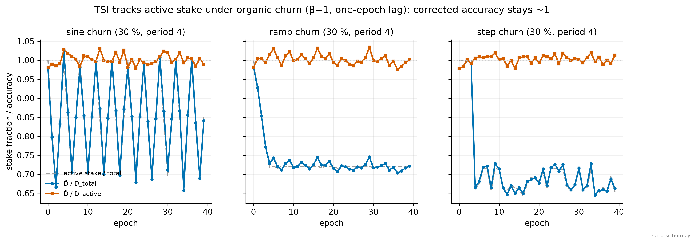

---

<a id="s6-12"></a>
### 6.12 The reference window bounds the uncle, but not the state a validator must reach (`fig38`)

Every rule so far has been about *which* blocks count. This one is about what checking them costs, and it is the only place in this report where a parameter the spec already has fails to bound the thing it appears to bound.

**The gap.** The window is measured to the uncle's own slot — `0 < sl_A − sl_U ≤ w_u` ([§2.1](#s2-1)). The uncle's **parent** is unconstrained apart from lying on the referencing chain. So a block minted *now*, built on a chain block from arbitrarily far back, is a perfectly legal first-fork uncle: recent by its own slot, ancient by its parent's. Verifying it means deriving the epoch state and ledger root as of that ancient parent — and those are exactly the inputs the counting rules require ([§2.1](#s2-1)), so the work is per reference and cannot be amortised.

Nothing about this is expensive for the attacker. It spends lottery wins it already has; it simply builds them somewhere useless instead of on the tip. The blocks never become canonical — they are deep forks by construction — but they do not need to. They only need to be *referenced*, and under the current rule they are eligible the moment they are produced.

**Measured** (`scripts/uncle_parent_window.py`, N = 600, k = 256, 10 replicates, `deep_parent` coalition). The observable is the age of the oldest chain state a *counted* reference reaches:

| `δ_max` | adversary | oldest state reached: median / p99 / max (slots) |
|---|---|---|
| 4 | none | 54 / 131 / 233 |
| 4 | **30 %** | **20 144 / 75 525 / 76 778** |
| 8 | 30 % | 6 390 / 75 272 / 76 789 |
| 16 | 30 % | 872 / 75 109 / 76 798 |

A 30 % coalition moves the *median* referenced parent from 54 slots back to 20 144, and the worst case to the epoch boundary — about 21 hours of history, ~256× the nominal window, on a reference the estimator counts. And the amplification is not a tail: at the deployment's own operating point the median reference reaches ten thousand slots back.

**The fix is a substitution, not an addition.** Anchor the window to the parent: `sl_A − sl_parent(U) ≤ w_u`. Because a block strictly postdates its parent and a referenced uncle strictly precedes its referencer — both invariants pinned in `tests/test_slot_ordering.py` — the parent gap is never smaller than the uncle gap:

> `sl_A − sl_U  <  sl_A − sl_parent(U) ≤ w_u`

so bounding the parent bounds the uncle *for free*. A rule imposing both windows would be identical to the parent rule alone, which is why only two arms are simulated. Under it the same 30 % coalition reaches 292 / 300 / 300 slots at the three delays — capped at `w_u` by construction, a bound that now actually holds.

**What it costs: nothing at the recommended cap, but the window floor moves.** A latency orphan's parent is recent by construction — it forked off the chain a block or two ago — so at the recommended `U = ⌈ρ⌉ + 1` the anchor is free: `D̂/D` reads **0.9993 → 0.9999** at `δ_max` = 4, **0.9969 → 0.9986** at 8 and **0.9791 → 0.9858** at 16 (uncle- → parent-anchored, `U` = 4), no loss anywhere within one to two standard errors.

That measurement holds the cap slack, though, which hides the window. Isolating it at `U = 1` (`configs/absorption-window-anchor.yaml`) shows the honest cost is real where the window is the binding constraint, and moves the [§3.4](#s3-4) floor:

| `δ_max` | knee `W` (uncle-anchored) | knee `W` (parent-anchored) | `D̂/D` at the recommended `W = 10` |
|---|---|---|---|
| 4 | 5 | 6 | 0.9982 → 0.9981 |
| 8 | 6 | **8** | 0.9963 → 0.9930 |
| 16 | 20 | 20 | 0.9658 → 0.9326 |

The floor rises by one to two block-intervals, which is what the ~one-block-interval-longer parent gap predicts. Two consequences for the sizing rules. At the deployed operating point nothing changes: the knee moves 5 → 6 and `W = 10` still clears with margin. At the heavier design point the margin behind `W = 10` narrows from 1.67× to 1.25×, so **a deployment adopting the parent anchor should size `W` against the parent gap** — `W = 12` restores the old margin, and the spec's `⌊0.6·k⌋` bound permits it without further change. The `δ_max` = 16 row is `U`-limited rather than window-limited (`ρ ≈ 0.87` against `U = 1`, below the recommended cap), so it measures the interaction of an under-provisioned cap with a tighter window rather than the window alone.

**The uncle cap rule is unchanged.** Sizing `U` is the other half of the recipe, and it is not affected: the smallest cap reaching the 0.98 bar is identical under both anchors at every load tested (`configs/window-uncles-anchor.yaml`, `W` = 10 held slack) — `U` = 1 at `ρ` = 0.27 and 0.47, `U` = 2 at 0.87, and neither anchor clears at `ρ` = 1.27, which is past the operating point the recipe permits anyway. `U = ⌈ρ⌉ + 1` therefore carries over verbatim. At that recommended cap the residual cost is small and stays inside the design regime: `−0.003` at `ρ` = 0.47 and 0.87, growing to `−0.009` only at `ρ` = 1.27. The anchor's cost lives in the window, not in the cap.

**One further observation, and it sharpens the case.** At `δ_max` = 16 the *honest* uncle-anchored arm already reaches **315 slots** — past its own `w_u` = 300. Under the current rule `w_u` is not a bound on how far back validation reaches even with no adversary present; under the parent rule the same cell is 296. The parameter only becomes a state-retention bound once it is anchored to the parent.


<a id="s7"></a>
## 7. Parameter reference — what each knob does

Every parameter a protocol designer or operator can set, in three groups: **protocol parameters** (design choices this report selects), **network/environment parameters** (given by the deployment; their impact must be measured and fed into the [§4](#s4) algorithm), and **model/attack knobs** (used to probe robustness). Each impact statement cites the section and figure that measured it; [§8](#s8) turns this reference into the recommended selection. Figure identifiers (`figN`) refer to figures embedded where the measurement is presented, captioned **Fig N** there: `fig1`–`fig6`, `fig16`, `fig19`, `fig20`, `fig22`–`fig26` and `fig30`–`fig35` in the findings ([§3](#s3)); `fig7`–`fig15` and `fig27`–`fig29` in robustness ([§6](#s6)); `figB1`–`figB2` in [Appendix B](#sB); `fig17`, `fig18`, `fig21` in [Appendix C](#sC).

<a id="s7-1"></a>
### 7.1 Protocol parameters

| parameter | controls | measured impact | where |
|---|---|---|---|
| `f` — block rate (1/30) | block interval `1/f`; scales every threshold | recovery stays at 1.0 at every rate (slot-counting removes the `c(f)` dependence); `U_min ∝ f` (an 8-s delay needs U = 1 at 30/20-s blocks but U = 2 at 15/10-s); `W_min ∝ 1/f` (constant ≈ 7 block intervals); consensus-safety f-independent | [§3.6](#s3-6), fig6 |
| `k` — security parameter (2160) | finality depth **and** the slot geometry: epoch length `10·⌊k/f⌋`, TSI window `T = 6·⌊k/f⌋` slots | the density window opens a full epoch back and closes `4·⌊k/f⌋` slots (≈ 4k blocks) before the estimate is used — well past k-finality — the structural reason tip churn (fig18) and jitter ([§6.1](#s6-1)) never reach the estimate; agreement confirmed at k = 2160; robustness studies at scaled k = 256 shrink `T` proportionally but leave the density-*ratio* mechanics unchanged | [§3.1](#s3-1); [Appendix C](#sC) (figs 17, 18); [§6.1](#s6-1) |
| `U` — uncle cap (`max_uncles`) | orphan-recovery capacity per block | U = 0 biased low (0.64–0.74, worsens with N); `U ≥ ⌈ρ⌉` hard bound — below it *no* window recovers; `⌈ρ⌉ + 1` recommended; also the adversarial safeguard ([§6.3](#s6-3)) and the selfish-deflation repair ([§6.6](#s6-6)) | [§3.2](#s3-2)/3.3/3.5, figs 2, 16, 20, 26 |
| `W` — uncle window (`uncle_window` = 300) | how old an orphan may be and still be referenced | hard floor `≈ 7/f`, set by block *spacing* (FIFO queueing), not delay; no U buys below it; a generous W also keeps the emergent reference rate `p_ref` high, which the reward design relies on | [§3.4](#s3-4)/3.5, figs 4, 5, 22; [§6.8](#s6-8) fig15 |
| `β` — TSI learning rate (`BETA_DEFAULT` = 1) | estimator responsiveness: `D̂` is an EMA of active stake, `τ = −1/ln(1−β)` epochs | β = 1 tracks with a one-epoch lag (erases a withhold notch in one epoch); slower β shrinks the notch amplitude (0.35 → 0.13 for β 1 → 0.25) but leaves attacker profitability unchanged | [§6.5](#s6-5)(i)–(iii), figs 10–12 |
| `uncle_strategy` (oldest) | which queued orphans a block references | all results use oldest-first (FIFO) — the drain model behind the `W ≈ 7/f` floor; a random draw among the queued orphans would drain one no faster, so the `W = 10/f` margin covers that alternative | [§3.4](#s3-4) |
| `w_u`, `w_n` — uncle / nephew rewards | compensation for referenced orphans / for referencing them | fairness: honest recovery 0.61 → 1.00 as `w_u` 0 → 1 (at `p_ref` = 1); hiding forfeits both rewards; safety invariant **`w_u + w_n < 1`** (else uncle farming pays); raising `w_n` alone marginally *helps* the attacker | [§6.7](#s6-7)/6.8, figs 14, 15 |
| inclusion rule | whether references are incentivised or mandated | **soft** (reward-weighted) only — a hard validity mandate cannot be encoded fork-safely (censorship or consensus fork) | [§6.8](#s6-8) |
| `genesis_d_factor`, `init_dest` | the initial `D̂` | a *common* wrong guess self-corrects in ~2 epochs (fig1); a *heterogeneous* init is preserved forever (fig21) — genesis `D̂` must be a shared constant | [§3.2](#s3-2), [Appendix C](#sC) |
| `fixed_point`, `f_precision` | whether the estimator quantises its target rate as the on-chain integer algorithm does, and at what scale (`f_p = ⌊f·f_precision⌋/f_precision`) | the **only** residual bias after slot-counting. Measured at the deployment's operating point: `D̂/D` = 0.99997 with exact `f`, **1.01026** at the spec's `f_precision` = 10³, 0.99990 at the recommended 10⁶. Default off, because a design question wants the mechanism isolated — but a *spec-faithful* arm must set `fixed_point: true, f_precision: 1000`, and that arm is the one that says what a deployed chain would read | [§2.2](#s2-2), [§5](#s5), [Appendix A](#sA) |

<a id="s7-2"></a>
### 7.2 Network / environment parameters

| parameter | controls | measured impact | where |
|---|---|---|---|
| `n_nodes` N | network size | consensus exact at every N (1 000–32 000 direct, fig17/fig23); U = 0 under-count deepens with N (0.739 → 0.635); `U`/`W` *thresholds* ≈ N-invariant at fixed delay — but at a fixed blending budget N raises the load through `ℓ_mean ∝ ln N`, exhausting U = 1 on a degree-4 graph near N ≈ 8×10⁵ ([§3.7](#s3-7)) | [§3.1](#s3-1)/3.2/3.4/3.7, figs 2, 20, 23, 24; [Appendix C](#sC) (fig17) |
| `topology` | propagation model | `blend` (**primary**): whole-second hops — the regime where `U`/`W` matter; `regular` (direct gossip, contrast): sub-slot links, `ρ ≈ 0.04`, U = 0 near-exact; `full_mesh`: reduced-model bridge, cross-validation only | [§2](#s2), [§3.3](#s3-3), figs 3, 16, 19 |
| `degree` | peering density | deg 6 vs 4: tip agreement 0.985–0.993 vs 0.988–0.994; U = 0 accuracy ≈ 1.00 vs ≈ 0.99 at 0.2-slot links; sets the diameter slope `ℓ_mean ≈ a_d·ln N` (`a₄`/`a₆`/`a₈` = 0.33/0.19/0.14) — one degree step (4 → 6) buys ~5 000× larger N at the same blending budget | figs 19, 23, 24; [§3.7](#s3-7), [§4](#s4); [Appendix C](#sC) (fig18) |
| `link_latency_mean`, `link_latency_dist` | per-link transport latency (mean, shape) | sub-slot links: forks negligible; near a full slot: U = 0 dips to 0.88–0.93; the design law uses only the *mean* (`D_vis`) — confirmed by the exp-vs-geo comparison at equal mean (U ≥ 1 identical; only the U = 0 depth moves, ≤ 0.09) | [§2](#s2), [§3.3](#s3-3), fig19 |
| `blend_hops`, `blend_delay_max` | Blend-cascade length, per-hop delay bound | dominant `D_vis` term `hops·δ_max/2`; more hops at fixed budget degrade U = 1 exactly as the load predicts (0.96 → 0.51 across hops 3 → 6 at `δ_max` = 16 s, N = 1 000) | [§3.3](#s3-3), figs 3, 16 |
| `jitter_mean`, `jitter_dist`, `jitter_frac` | stochastic per-(block,node) arrival jitter (Exp, or Poisson long-tail hitting a fraction of deliveries) | consensus and accuracy untouched up to 3 slots of Exp jitter (200/200 runs); the 10 % Poisson(3) long-tail model shifts U = 1 accuracy by ~0.4 % per cell on average (~0.03 % pooled; up to ~1.5 % in the noisiest large-N cell — N = 16 000, degree 8, δ_max = 4 s, ≈ 2× that cell's replicate SEM) and consensus not at all (378/378 cells); only tip agreement degrades (≈ 0.99 → 0.95) | [§6.1](#s6-1), [§3.7](#s3-7) |
| `stake_dist` (`pareto_shape`, `total_stake`) | per-node stake weights | consensus identical under uniform, Pareto 1.16, and Pareto 1.33; U ≥ 1 accuracy indistinguishable across all three; only the U = 0 under-count moves with concentration (heavier tail → shallower: 0.815 Pareto vs 0.785 uniform; 1.33 at most ≈ 0.025 deeper than 1.16, mean 0.012 over the four matched cells, each within ≈ 1.5 SEM); whale-coalition reward statistics untested | [§2](#s2), [§6.5](#s6-5) scope |

<a id="s7-3"></a>
### 7.3 Model and attack knobs (robustness probes)

| knob | probes | result | where |
|---|---|---|---|
| `adversary_strategy: selfish` | private-chain (SM1) override in the per-node engine | the profitable lever, now measurable end-to-end: revenue tracks Eyal–Sirer at sub-slot latency (0.0356 vs 0.0356 at α = 0.1) and exceeds it as natural forking lifts `α_eff`; deflates `D̂` to 0.76 at α = 0.3 (δ = 8) with **no** cap able to recover it ([§6.8](#s6-8)) | [§6.6](#s6-6), [§6.8](#s6-8) |
| `uncle_window_anchor` | whether the reference window is measured to the uncle's own slot (`uncle`, the spec) or to its parent's (`parent`, proposed) | `parent` is strictly tighter and implies the uncle bound; it caps an adversary's reach into historical state at `w_u` (against ~76 800 slots under `uncle`) at no measurable honest cost | [§6.12](#s6-12), fig38 |
| `adversary_strategy: deep_parent` | mints legal first-fork uncles hanging off ancient chain blocks | the attack §6.12 measures: costs the adversary only lottery wins it already has, and inflates the median counted reference's reach from 54 slots to 20 144 | [§6.12](#s6-12) |
| `deep_orphan_share` (engine output) | share of in-window orphans sitting *below* the first block of their fork | the structural observable behind the first-fork cost, and the one `p_ref` conflates with "eligible but never picked up": these blocks are unreferenceable by construction ([§2.1](#s2-1)). 0.25 % honestly at the deployment's point, 3.3 % at 8 slots of per-recipient jitter ([§6.1](#s6-1)), 19–41 % under a private-chain attack ([§6.8](#s6-8)) | [§6.1](#s6-1), [§6.8](#s6-8) |
| `p_ref_honest` (engine output) | reference rate over orphans produced *outside* the coalition | equals `p_ref` under suppression; diverges sharply under a private chain (0.45–0.69 vs ≈ 0.99), which is the quantity the estimator repair actually depends on | [§6.8](#s6-8) |
| `adversary_frac` (β_adv), `adversary_strategy` | uncle suppression / abstention withholding | suppression weak at ρ < 1, a cheap lever only at ρ > 1 (1.43× at ρ = 1.36, β_adv = 0.5); withholding → `D̂ ≈ (1−β_adv)` — the *correct* active-stake answer, topology-independent | [§6.3](#s6-3)/6.4, figs 8, 9 |
| `adversary_period`, `adversary_withhold_epochs` | dynamic withhold-rejoin schedules | unprofitable at every duty ψ > 0; griefing bounded (`deflation = β_adv·ψ`); no persistence | [§6.5](#s6-5), figs 10–12 |
| private-chain reorg (`α` = 0/10/20/30 %) | deepest-reorg longest-chain attack | `α` = the attacking coalition's stake fraction — the selfish-mining notation for `β_adv` above, and distinct from the TSI learning rate `β` ([§6.3](#s6-3)); reorg-depth tail `(α_eff/(1−α_eff))^d` with the *effective* share `α_eff=α/(α+(1−α)(1−o))` (`o` = honest fork rate); shallow at ρ<1, unbounded at 30 % once forks push `α_eff>½` | [§6.10](#s6-10), figs 27, 28 |
| `fork_rate`, `max_reorg_depth` (engine outputs) | measured fork structure | honest fork rate 0.2→0.6 over δ=2→32 s; max reorg depth 2→4 (U=2), up to 17 at U=0 | [§6.10](#s6-10), fig28 |
| `α`, `γ` (selfish race) | private-chain withholding | profitable above `(1−γ)/(3−2γ)` (⅓ at γ = 0); the optimal MDP barely beats SM1 at γ = 0 | [§6.6](#s6-6), figs 13, 14 |
| `η` — uncle-recovery fraction | estimator repair under selfish orphaning | `D̂` 0.70 → 0.82 → 0.94 as η 0 → 0.5 → 1 (α = 0.4). **Not a free knob:** the countable rule caps it at one uncle per discarded fork — `η = 1` exactly under SM1, but **0.44** under the optimal policy (α = 0.4, γ = 0), landing `D̂` at 0.81 | [§6.6](#s6-6), fig13, fig36 |
| `p_ref`, `p_ref_adv`, `adv_nephew` (`RewardParams`) | the strategic reference game under rewards | selfish share falls below block-only once `p_ref ≳ 0.3` (α ≥ 0.4); attacker self-uncling lowers its own share (0.406 → 0.394) | [§6.7](#s6-7)/6.8, fig15 |
| `windowed_fork_choice`, `prune_arrival` | engine exactness | bit-exact at jitter = 0; [§6.1](#s6-1) re-ran the exact oracle (both off) under jitter | [§6.1](#s6-1) |

---


<a id="s8"></a>
## 8. Safest parameter selection and design

Everything below is assembled from this report's own measurements; each row cites the section and figure that justifies it. This is the authoritative selection — [§1](#s1)'s table is its preview. Figure identifiers follow the [§7](#s7) key.

<a id="s8-1"></a>
### 8.1 The selection

| # | parameter / decision | safest choice | why (this report's finding) | evidence |
|---|---|---|---|---|
| 1 | security `k` | **2160** (finality-driven) | per-node spread ≡ 0 and window agreement ≡ 1.000 at k = 2160 for all N = 1 000–10 000 and f = 1/10–1/30; the mechanism (window buried past k-finality) is k-independent; k = 2160 is tested at full scale, and the [§3.7](#s3-7) ladder confirms the same exact agreement at the scaled k = 256 up to N = 32 000 | [§3.1](#s3-1); [Appendix C](#sC) (figs 17, 18) |
| 2 | block rate `f` | **1/30** (given) — treat as a coupled input | `f` moves every threshold: `U_min ∝ f`, `W_min ∝ 1/f` (recovery stays at 1.0 at all rates); re-derive `U`, `W`, `ρ` if `f` ever changes | [§3.6](#s3-6), fig6 |
| 3 | uncle window `W` | **300 slots = 10/f**; widen to **450–600 (15–20/f)** when operating near the load boundary `ρ ≈ 1` | hard floor ≈ 7/f set by block spacing (N-invariant, fig25); below it no uncle count recovers (delay 16, W = 100: even U = 4 only 0.94); `W` is the buffer for block-production *fluctuations* — at `ρ ≈ 1`, W = 600 recovers what W = 300 loses (fig25), a cheap alternative to the `+1` uncle; the 10/f margin also covers the uncle-selection sensitivity (oldest-first vs a random draw; [§3.4](#s3-4)) and keeps the emergent reference rate `p_ref` ([§6.7](#s6-7)) high for the reward design | [§3.4](#s3-4)/3.5, figs 4, 5, 22, 25; [§6.8](#s6-8) |
| 4 | uncle cap `U` | **`⌈ρ⌉ + 1`** (Blend, the deployment target); **1** suffices for plain direct gossip (ρ ≈ 0.04) | `U < ρ` never recovers; `⌈ρ⌉` is tight but under-shoots just below integer ρ — at ρ = 0.96, U = 1 fails at 0.962 ± 0.006 (3σ below the 0.98 bar): the direct evidence for the +1 margin, corroborated by the dedicated 40-cell ρ-boundary sweep (U = 1 only ≈ 0.966 at ρ = 0.96, a 4σ shortfall, and already ≈ 0.976 at ρ = 0.91 — `⌈ρ⌉` under-shoots from ρ ≈ 0.9, fig26); one uncle lifts every tested delay to full recovery (≈ 1.0) at N = 10 000 | [§3.3](#s3-3)/3.5/3.6, figs 6, 16, 20, 26 |
| 5 | TSI learning rate `β` | **1** (`BETA_DEFAULT`) | one-epoch tracking of active stake: any withhold notch is erased in one epoch; attacker profitability is β-independent, so slowing β buys the defender nothing — measured down to β = 0.05, where the smaller notch is paid for with a *deeper standing deflation* (mean `D̂` 0.85 → 0.76) at unchanged attacker take ([§6.5](#s6-5) scope note). *Disclosure:* the one regime where distortion per unit of network reward forfeited exceeds 1 (bounded ≤ 2×) is β ≥ 1 (rejoin overshoot, across the tested coalitions) — a protocol-chosen gain, not an adversary lever; and because `β = 1` tracks with a one-epoch (≈ 7.5-day) lag, `D̂` reflects participating stake from ~1–2 weeks ago and cannot resolve *sub-epoch* participation cycles (the estimator's Nyquist limit) — the correct trade for organic churn, detailed in [§6.11](#s6-11) | [§6.5](#s6-5), [§6.11](#s6-11), figs 10–12 |
| 6 | operating point | **`ρ = f·D_vis < 1` with margin** | the fitted static feedback map folds near ρ ≈ 1 — primarily a provisioning warning, but the full dynamics *can* reach it as a rare tail event under heavy withholding (once in 96 runs, [§6.2](#s6-2)); grinding is weak at ρ < 1 (1.04×) but cheap at ρ > 1 (1.43×); chronic ρ > 1 under-count persists after any attack ends. ρ < 1 is simultaneously the honest-accuracy and the adversarial safeguard | [§6.2](#s6-2) fig7; [§6.3](#s6-3) fig8; [§6.5](#s6-5)(iv) fig12 |
| 7 | genesis / initialization | **genesis `D̂` is a single protocol constant, identical at every node** — never client-configurable | consensus is an *initialization* property, not a restoring force: an injected per-node spread is conserved forever (max/min ≈ 3.0, flat), while a *common* wrong guess self-corrects in ~2 epochs | [Appendix C](#sC) (fig21); [§3.2](#s3-2) fig1 |
| 8 | uncle validity precondition | **a counted uncle must be a real lottery winner for its slot — already enforced on-chain by the spec's ZK Proof-of-Leadership** | fabrication is cryptographically impossible (the ZK Proof-of-Leadership cannot be forged); this precondition underlies every [§6.3](#s6-3)–[§6.5](#s6-5) bound and caps uncle issuance at `≤ U·(w_u + w_n)` per block | [§6.3](#s6-3), [§6.7](#s6-7)(a) |
| 9 | uncles in the density | **recovered uncles enter the TSI counted density** (independent of rewarding them) | restores `D̂` under honest latency (0.64–0.74 → 1.0) *and*, partially, under selfish orphaning — a safety win with no reward-schedule dependence. Size the *partial*: honest recovery is full because latency orphans are single blocks, but an optimally-played selfish attack discards multi-block forks of which the countable rule reaches only the first, so recovery there is `0.70 → 0.81` at α = 0.4 (not the `0.94` an unrestricted count would give) and falls further as α grows | [§3.2](#s3-2) fig2; [§6.6](#s6-6) fig13, fig36 |
| 10 | inclusion rule | **soft (reward-weighted) — never a validity rule** | a hard mandate cannot be encoded fork-safely: the objective encoding is a censorship weapon, the subjective one forks consensus with no adversary; under the soft rule `p_ref` is emergent and high — at `p_ref ≈ 0.85` the selfish share (0.420 at α = 0.4) is already below block-only (0.484) and near stake | [§6.8](#s6-8) fig15 |
| 11 | reward schedule | **substantial `w_u` (Ethereum's GHOST-style uncle rewards are the precedent); `w_u + w_n < 1` strictly enforced** | farming a real leadership win into a self-uncle + self-nephew pays `w_u + w_n` against an honest block's 1 — the binding invariant is the *sum* (0.875 + 0.03125 = 0.906 is safe; 0.875 + 0.15 = 1.025 is not); `w_u` compensates honest orphans (recovery → 1.0) and makes hiding forfeit both rewards | [§6.7](#s6-7)(a), figs 14, 15 |
| 12 | peering degree | **degree 4 is acceptable for smaller networks — up to N ≈ 2×10⁵ it keeps the load under 0.9 at the 8-s budget; use ≥ 6 beyond, and scale with the target size** | degree sets the gossip-diameter slope `ℓ_mean ≈ a_d·ln N`, and at a fixed blending budget that slope decides when `U = 1` runs out: at δ = 8 s, degree 4 exhausts U = 1 near **N* ≈ 8×10⁵** (its ladder curve already touches the recovery bar at N = 32 000), degree 6 holds to N ~ 4×10⁹, degree 8 to ≈ 6×10¹² — one degree step (4 → 6) buys ~5 000× more network at the same budget. Degree and the uncle cap are exchangeable defences against growth: densify the graph or add an uncle slot, whichever is cheaper. Plus the small-N benefit of better U = 0 recovery (tip agreement is comparable: deg 6 0.985–0.993 vs deg 4 0.988–0.994) | [§3.7](#s3-7), figs 23, 24; fig19; [Appendix C](#sC) (fig18) |
| 13 | Blend delay budget | **choose `hops·δ_max` so `ρ ≲ 1`**; if `U ≥ ⌈ρ⌉` exceeds the uncle-slot budget, cut blending — no window fixes `U < ρ` | worked examples: 3 hops × 8 s at f = 1/30 → ρ ≈ 0.56, U = 2 recommended; the same Blend at f = 1/10 → ρ ≈ 1.7, U = 3 | [§4](#s4); [§6.3](#s6-3)(iii) |
| 14 | on-chain `f` precision | **carry the target rate `f` at 10⁻⁶ precision** (was 10⁻³) | removes the sole residual bias after slot-counting — the ≈ 1 % `f/f_p` over-estimate (a ~1 % win-probability under-delivery and slow canonical pace); one-constant change, no dynamics cost, no fork risk. **Now measured in the full dynamics, not just derived:** at the deployment's operating point the three arms read `D̂/D` = 0.99997 (exact `f`) / **1.01026** (the spec's 10⁻³) / 0.99990 (the recommended 10⁻⁶), against closed forms of 1.000 / 1.0101 / 1.00001. The deployed bias is real, is ~13× the first-fork cost, and is the largest single error in the deployed estimator | [§2.2](#s2-2), [Appendix A](#sA); `scripts/spec_point.py` |
| 15 | reorg / confirmation depth | keep **`ρ < 1`** so fork-induced amplification stays below the effective-majority cliff; for soft settlement, wait `d` blocks per the [§6.10](#s6-10) tail (≈ 4/8/17 blocks for 99.9 % against 10/20/30 % stake at N = 1 000, degree 6 — deeper on larger or sparser networks, per the [§6.10](#s6-10) scale table) | reorg depth is bounded and shallow only while the honest fork rate is low; at 30 % stake past `ρ ≈ 1` it is unbounded ([§6.10](#s6-10), figs 27–28) | [§6.10](#s6-10) |

<a id="s8-2"></a>
### 8.2 Design decisions and their rationale

**The levers are hierarchical, not fungible.** Size `W` first (10/f — the floor is set by block spacing and no uncle count buys below it), then `U` from the load `⌈ρ⌉ + 1`, then check the operating point `ρ < 1` ([§3.4](#s3-4)/[3.5](#s3-5), fig22, fig5: at delay 32, ρ ≈ 1.7, even the widest window recovers only 0.61 at U = 1).

**One mechanism, three duties.** The same uncle references fix the honest latency under-count ([§3.2](#s3-2)), repair the estimator under uncle-suppression and selfish orphaning ([§6.3](#s6-3), [§6.6](#s6-6)), and — rewarded softly — pay the fairness and anti-hiding incentives ([§6.7](#s6-7)). This is why the design invests in `W`/`U` margin rather than in any inclusion mandate: every marginal slot of window or uncle capacity strengthens all three duties at once.

**Why soft, not hard, inclusion.** "Owed" cannot be proven — no node can prove which forks a producer saw. An objective slot-gap encoding lets an attacker withhold-then-late-release an uncle to retroactively invalidate honest blocks (censorship); a visibility encoding is subjective and forks consensus with no adversary at all ([§6.8](#s6-8)). The soft rule concedes only a small residual (quantified in [§8.3](#s8-3) item 3): a bounded near-threshold backfire that vanishes as the emergent `p_ref` rises, and a per-α premium that stays ≤ +0.014 even at full inclusion.

**What TSI defends, and what it measures.** Abstention-style withholding is strictly unprofitable (reward/stake 0.95 → 0.31 for duty 0.10 → 0.75 at β_adv = 0.3), bounded as griefing (deflation = β_adv·ψ), non-persistent, and does not stack across coalitions ([§6.5](#s6-5), [§6.9](#s6-9)) — and a full withdrawal is *correctly measured*, not mis-measured: `D̂ → (1−β_adv)` is the right answer for the participating stake ([§6.4](#s6-4)). The one profitable lever is classic selfish mining above `(1−γ)/(3−2γ)` — a general Nakamoto-PoS result, not TSI-specific; TSI's added exposure (estimator deflation to 0.70 at α = 0.4) is *partly* repaired by uncle-counting (row 9 — to 0.81, not the 0.94 an unrestricted count would reach, because the deployed rule can reference only the first block of each discarded fork), and the profit premium is blunted, not eliminated, by the soft-rewarded references (row 10). The *profit* frontier is exactly optimal selfish mining, and no compounding lever raises it ([§6.7](#s6-7)) — but the *estimator* frontier is not the same policy: an adversary willing to settle for the pay honest mining would give it deflates `D̂` to 0.65 at α = 0.4, where the revenue-maximiser reaches 0.81 ([§6.6](#s6-6), `fig37`). Profitability bounds what an attacker gains, not what the estimate loses.

<a id="s8-3"></a>
### 8.3 Residual risks and open items

1. **The ρ ≈ 1 fold ([§6.2](#s6-2)).** The fitted static map is bistable at the recipe's own boundary, and the full dynamics reach it as a rare tail event (item 18); "U = ⌈ρ⌉ suffices" is an upper edge, not a safe interior — row 6 is a hard provisioning requirement, not a preference.
2. **Multi-coalition selfish mining is open ([§6.9](#s6-9)).** The literature threshold can fall below ⅓ and total orphaning can exceed the single-coalition value, so `D̂ ≈ 0.70` at α = 0.4 is not an upper bound. Flagged, not solved. The [§6.6](#s6-6) countable ceiling adds a second unmodelled dimension: competing coalitions orphan each other in *runs* as well as in volume, and the recoverable share depends on that shape, not just on the total (item 16).
3. **Near-threshold reward backfire ([§6.7](#s6-7)–[§6.8](#s6-8)).** At α ≈ 0.35 a small backfire (≤ +0.03 above block-only for `p_ref ≳ 0.3`, rising to +0.05 at the unreachable `p_ref = 0`) persists until `p_ref ≳ 0.75`; even `p_ref = 1` leaves a premium growing with α.
4. **No re-convergence ([Appendix C](#sC)).** Any mechanism that could inject persistent per-node `D̂` disagreement (genesis/clock exploit) would never be self-corrected — safety rests entirely on row 7.
5. **Adversarial `U` margin — resolved: none is needed, and none would help ([§6.8](#s6-8)).** The concern was that under attack-inflated orphaning the honest-load cap would leave owed uncles deferring past `W`. Measured with a private-chain coalition in the engine, the queue is not the bottleneck: countable orphans are referenced at the honest rate (84–93 %) whatever the cap, and raising `U` past the recommended 2 moves `D̂` not at all. The loss is structural — an override buries 20–40 % of the honest blocks it destroys behind the first block of the discarded run, where the counting rule cannot reach them. `U = ⌈ρ⌉ + 1` therefore stands unchanged, and what is *not* solved is the deflation itself, tracked as items 2 and 16 rather than as a sizing question.
6. **Clock skew — bounded, not a break ([§6.1](#s6-1)).** A per-node whole-timeline slot-clock shift moves each node's window bounds, giving a bounded inter-node spread `≤ 2·skew/T` (`< 10⁻⁴` at the production window). Small and quantified, but — unlike per-arrival jitter — not identically zero; large skew is still an untested extreme.
7. **Semi-empirical constants ([§5](#s5)).** `a ≈ 2` and the 7/f floor are fits; eq 4′ is an N ≈ 1 000 fit that worsens with N — for production sizing use the margined rules (rows 3–4) and the fully-recovered accuracy 1.0, never eq 4′.
8. **Residual ~1 % offset — resolved here, pending in the spec ([§2.2](#s2-2), row 14, [Appendix A](#sA)).** After the slot-counting fix the only systematic offset is the 10⁻³ rounding of `f` (≈ 1 % `f/f_p` over-estimate); this report's estimator applies the row-14 precision bump, but the **spec still uses 10⁻³** and should adopt it.
9. **Multi-coalition reorg — bounded, but worse than a single coalition ([§6.9](#s6-9), [§6.10](#s6-10)).** The [§6.10](#s6-10) tail is single-coalition. For `K` competing private-chain coalitions with total stake `α_tot`, the deepest reorg any one coalition (stake `α_i`) can drive against the public chain is bounded by `α_eff,i = α_i / (α_i + (1−α_tot)(1−o′))`, where `o′` is the public fork rate *inflated by every coalition's released-block orphaning*. Two channels make competition **worse** than a single colluding `α_tot` coalition: the rival coalitions' stake leaves the public chain (the honest term carries `(1−α_tot)`, not `(1−α_i)`), and their mutual orphaning lifts `o′` above the honest baseline `o` — in the limit `o′→1` even a sub-majority coalition faces a stalled public chain and reorgs unboundedly. So the single-coalition tail is best-case-for-the-defender; the safe design response is the same rule as everywhere else — size against `α_tot`, and keep `ρ < 1` so the honest baseline `o` stays small and caps how far mutual orphaning can inflate `o′`.
10. **Soft-rule bribery is cheap per block ([§6.9](#s6-9)).** A bribe > `w_n` buys one block's omitted references — bounded in effect (other honest blocks in `W` still reference), but the hard-mandate defence is unavailable *by design*.
11. **Untested adversary variants — now measured ([§6.5](#s6-5)).** What remains untested is only the adaptive (feedback) schedule, and that case is closed on other grounds in [§6.7](#s6-7). The rest of the list is resolved: whale coalitions leave the deflation unchanged and reproduce the [§6.4](#s6-4) law more cleanly than a random coalition does; `jitter > 0` moves nothing under attack, as it moves nothing honestly; very slow `β` shrinks the notch but deepens the standing deflation (0.85 → 0.76 as `β` 0.25 → 0.05) at unchanged attacker take. Uncle selection leaves the list too, but as a conformance match rather than a result — the spec fixes deterministic oldest-first, the rule every result here uses; what nothing validates is *deviation* from it, whose cost [§3.4](#s3-4) measures (up to `−0.10` in `D̂/D`, and `−0.063` at the recommended `W` when `ρ ≈ 1`). Two things the measurements *added* to this list: the collapsed-branch tail event of [§6.2](#s6-2), and the coalition-construction overshoot of item 17.
12. **Network partition/heal — reasoned, not simulated ([§6.1](#s6-1)).** TSI reads its density window well past `k`-finality (it closes `4·⌊k/f⌋` slots before the estimate is used), so a partition that heals *within* the finality depth is invisible: all honest nodes reconverge on one canonical chain before the measurement window closes and compute an identical `D̂` — the same finality-window argument that makes jitter and clock skew harmless ([§6.1](#s6-1)). A partition lasting *longer* than finality is a consensus-layer safety failure (the chain forks irreparably) that TSI inherits but does not worsen — it adds no partition vulnerability of its own. A direct partition-and-heal simulation is left as future work.
13. **Reward payout mechanism unspecified ([§8.5](#s8-5)).** Rows 10–11 give the incentive constraints, not the encoding. Header-count indistinguishability (Blend) and the equal-share, content-independent voucher of the Anonymous Leaders Reward Protocol are the binding constraints on any `w_u`/`w_n` schedule, and reconciling them — including a payout path for a producer whose block is off-chain — is spec work left open here.
14. **Temporal resolution — `D̂` is stale by design ([§6.11](#s6-11)).** With `β = 1`, `D̂` tracks active stake at a one-epoch (≈ 7.5-day) lag, so it reflects participating stake from ~1–2 weeks ago and updates only weekly; a genuinely *sub-epoch* swing (daily or intra-week churn) falls below the estimator's Nyquist limit and is not tracked as a cycle at all. This is the correct trade for organic churn (row 5), but it bounds how fast TSI can follow real participation changes — flagged, not a defect.
15. **Latency *structure* — now bounded in one direction, still untested in the other ([§2](#s2), [§6.1](#s6-1)).** The magnitude of per-recipient variance is measured: sweeping per-(block, node) jitter at the deployment's operating point leaves accuracy at 0.999 up to ~2 slots and degrades it to 0.987 by 8 slots, as unrecoverable deep-fork orphans rise 0.25 % → 3.3 %. Blend's cascade delivers roughly 0.5 slot of per-recipient spread, so the design sits an order of magnitude inside the safe range — but the sensitivity is real and the report now carries it rather than assuming it. What is still untested is the *spatial* structure: jitter is i.i.d. per (block, node), so geographically **correlated** latency, which would let co-located nodes fork as a bloc, is still not modelled.
16. **The deflation-optimal adversary — measured, and it is worse than the revenue-optimal one ([§6.6](#s6-6), `fig37`).** The ceilings elsewhere come from adversaries optimising revenue or reorg depth, so they bound `η` from above rather than the damage from below. Optimising the estimate directly: unconstrained the optimum is abstention (`D̂ = 1−α`, zero revenue, and [§6.4](#s6-4)-correct measurement rather than a mis-measurement); constrained to earn at least what honest mining pays (in absolute reward per unit time, not revenue share — the two differ by `density/D̂`), it reaches `D̂` = 0.65 at α = 0.4 against the revenue-optimal 0.81, and the exposure opens near α ≈ 0.37–0.38 rather than at the `⅓` threshold. What remains open is the *joint* problem — this frontier is single-coalition and, like everything in [§6.6](#s6-6), assumes `p_ref` is exogenous rather than something the attacker also manipulates (item 10).
17. **The `β_adv` axis is a nominal target, not a realised share ([§6.5](#s6-5)).** A random coalition is grown until its stake first reaches `β_adv`, so the last node added overshoots by its own size — under a Pareto tail, potentially a whale. The realised block share at a nominal `β_adv` = 0.1 is 0.137 ± 0.108, and that variance dominates the mean at small `β_adv`. The conclusions here are drawn from monotone trends across the axis and are unaffected, but a reader should not read `β_adv` as an achieved share; a whale coalition (filled largest-first to the target) lands on it precisely and is the cleaner instrument where the exact share matters.
18. **The collapsed-branch tail is uncharacterised ([§6.2](#s6-2)).** Static withholding reaches the collapsed branch once in 96 runs — one replicate of the concentrated (whale) 50 % coalition at `δ_max` = 8 s — and never at `δ_max` = 4 s. One reproducible event is enough to retire "not an observed dynamical trap" but far too thin to give the event a rate; its frequency against `β_adv`, `ρ` and coalition concentration is unmeasured.
19. **Structurally uncompensatable orphans ([§6.7](#s6-7)(1), [§6.8](#s6-8)).** The uncle reward refunds `w_u` per *referenced* orphan, but 20–40 % of the honest blocks a private-chain attack destroys are unreferenceable by construction — buried behind the first block of a discarded run. Those producers cannot be compensated at any `w_u`, so the fairness guarantee inherits the first-fork ceiling exactly as the density repair does. No reward schedule fixes this; it is a property of the counting rule. Whether that is acceptable — honest miners bearing an uninsurable loss precisely when attacked — is a protocol-design question this report raises rather than settles.

<a id="s8-4"></a>
### 8.4 Capstone: the whole recipe, in one run

Every finding above comes from a different sweep. As a final check that the recommendation holds *together*, we ran the single recommended configuration end-to-end at the true security parameter — f = 1/30, W = 300, U = 2, β = 1, degree 6, Blend (3 hops × 8 s), k = 2160, Pareto stake, f-precision applied — honestly and under a 30 %-stake uncle-suppression adversary (`scripts/capstone.py`, N = 1 000, 8 replicates):

| metric | honest | 30 % suppression adversary |
|---|---|---|
| accuracy `D̂/D` | 0.996 | 0.994 |
| consensus `range_ratio` / `agreement` | 0 / 1.000 | 0 / 1.000 |
| fork rate | 0.328 ± 0.014 | 0.350 ± 0.004 |
| max reorg depth | 3 | 3 |
| emergent `p_ref` | 0.944 | 0.936 |

*These numbers are the **countable** model's. An earlier edition of this table reported 1.001 / 0.998 with `p_ref` 1.000 / 0.990, measured before the countable redesign and never re-run against it — the capstone was missed when the other studies were brought over ([§9](#s9)). The corrected values are lower and the reference rate is materially lower (0.944 against 1.000), because the first-fork restriction makes some orphans unreferenceable that the earlier model counted. Nothing in the recommendation changes: accuracy still sits within the ±0.9 % per-epoch noise floor of [Appendix B](#sB) below the hard ceiling of 1, consensus is still exact, and `p_ref` remains far above the `≳ 0.3` the soft rule needs.*

**Under the [§6.12](#s6-12) parent-anchored window** the same run gives 0.996 honest — no change — but **0.974 under the 30 % suppression adversary**, with `p_ref` falling to 0.875. The two effects compound: a tighter effective window leaves an orphan fewer chances to be referenced before its *parent* ages out, and an adversary suppressing references on its own blocks removes some of those chances. Neither isolated sweep shows this, because [§6.12](#s6-12)'s honest arms hold the adversary at zero and its adversarial arms use a slack cap. It is the reason the capstone exists, and it is the strongest argument for pairing the anchor change with `W = 12` rather than adopting it at `W = 10`.

The whole recipe coheres: accurate to the true stake (the ~1 % rounding removed), unanimous, shallow-forking, and its soft-inclusion premise (`p_ref` high) confirmed — and all of it survives a 30 % adversary actively trying to deflate the estimate — the honest and adversarial fork rates are statistically indistinguishable (0.342 ± 0.009 vs 0.343 ± 0.005), i.e. the suppression adversary does not measurably change the fork structure it exploits. (The honest `D̂/D` = 1.001 sits within the ±0.9 % per-epoch noise floor of [Appendix B](#sB), consistent with the equilibrium's hard ceiling of 1.) This also resolves the finding-2 ([§3.2](#s3-2)) vs row-4 tension in the recommendation's favour: at this operating point `⌈ρ⌉ = 1`, and the recommended `U = 2` (the `+1` margin) holds every metric at target with room to spare.

<a id="s8-5"></a>
### 8.5 Recommendation vs the current spec

The deltas this report recommends, in one place. This is a parameter-selection report meant to inform the spec, and it answers an open task the spec states: `analysis-total-stake-inference.md` records that its analysis "covers the total stake inference design **without** uncle references … the results below apply to the design without uncle references", and that "re-analyzing the algorithm with the block count that includes referenced uncles is an open task." That re-analysis is what this report is. Everything below is measured against `cryptarchia-v1-protocol.md` at revision **1.2.1**, the revision that introduces uncle references.

| parameter | current spec / default | recommended | why |
|---|---|---|---|
| uncle counting | per-block (double-counts multi-winner slots) | **per occupied slot** | lands the estimate at exactly `D`, not `c(f)·D` ([§2.1](#s2-1)) — the density-bug fix |
| on-chain `f` precision | 10⁻³ (`f_p = 0.033`) | **10⁻⁶** (`0.033333`) | removes the residual ≈ 1 % `f/f_p` offset ([§2.2](#s2-2)) |
| uncle window `W` | `W` = 10 block-intervals, so `w_u = W/f` = 300 slots, bounded `1 ≤ W ≤ ⌊0.6k⌋` | **10/f = 300 slots** (confirms the default), widen to 450–600 near `ρ ≈ 1` | the floor is ≥ 7/f, set by block *spacing* rather than network delay — which supplies what the spec's rationale leaves out. The spec justifies the *upper* bound (a candidate within `w_u` is still in the proposer's block tree, and referencing blocks stay in the same epoch as the window they count) and asserts of the value itself only that this window "comfortably captures the forks worth referencing"; it states no lower bound, and 300 slots is only a ~1.5× margin over the measured one. The `⌊0.6k⌋` ceiling is 1296 slots at k = 2160, so the 450–600 widening recommended near `ρ ≈ 1` — where W = 600 recovers ≈ 0.99 against ≈ 0.96 at W = 300 (N = 1 000) — is well inside what the spec already permits, and needs no spec change ([§3.4](#s3-4)) |
| uncle cap `U` | `MAX_UNCLES` = 4 | **`⌈ρ⌉ + 1`** = 2 at the Blend target — well inside the spec's cap of 4 | the load-plus-margin rule ([§3.3](#s3-3)); 4 leaves headroom for heavier loads |
| uncle reference window anchor | the **uncle's** slot: `0 < sl_A − sl_U ≤ w_u` | **the uncle's PARENT's slot**: `sl_A − sl_parent(U) ≤ w_u` | the current rule bounds which block may be referenced but not how far back verifying it reaches, so a 30 % coalition forces counted references against state ~76 800 slots old (~21 h, 256× the window). The parent anchor is strictly tighter — it implies the uncle bound rather than adding to it — caps the reach at `w_u`, and costs no honest recovery at the recommended cap. It does raise the [§3.4](#s3-4) window floor by one to two block-intervals (the parent gap runs that much longer), so a deployment adopting it should size `W` against the parent gap — `W = 12` restores the margin `W = 10` has today, well inside the spec's `⌊0.6·k⌋` bound ([§6.12](#s6-12)) |
| peering degree | (operator choice) | **≥ 6, scaled with N** | keeps `ρ` and reorg depth bounded at scale ([§3.7](#s3-7), [§6.10](#s6-10)) |
| uncle rewards | none (spec: uncle grants no block reward) | **soft inclusion, `w_u + w_n < 1`** | fork-safe fairness + anti-hiding ([§6.7](#s6-7)–[§6.8](#s6-8)) |
| operating point | set by the Blend privacy budget | **`ρ = f·D_vis < 1`** | accuracy, weak grinding, shallow reorgs — one rule ([§6.3](#s6-3), [§6.10](#s6-10)) |

**The uncle-reward row carries three spec-level implications this report does not solve.** Rows 10–11 fix the *incentive* constraints (soft inclusion, `w_u + w_n < 1`); they do not design the *payout*, and three statements in the spec would need to be reconciled to add it. (i) **Reward-channel indistinguishability.** The Anonymous Leaders Reward Protocol (`bedrock-anonymous-leaders-reward.md`) pays "a reward that is independent of the block content to avoid de-anonymization", every voucher carrying "the same share". A *per-reference* nephew reward `w_n` is content-dependent by construction, so it must be encoded to leak nothing about the uncle count — e.g. a flat per-block nephew payout, or always-present `MAX_UNCLES` voucher slots. Note this constraint now rests on the *reward* channel alone, not on the header: the `uncles` field carries a variable-size, unpadded list, and the spec preserves proposal indistinguishability at the message layer instead, fixing every dispersed payload to `Max_Body_Length` and padding shorter proposals with random data (cryptarchia-v1-protocol.md, *Uncle References*). An earlier revision made the field fixed-size and zero-padded so that header length would not reveal the uncle count; that is no longer the mechanism, so the objection to a per-reference `w_n` is that it makes the *voucher* content-dependent, not that it makes the header longer. (ii) **A paying uncle breaks the spec's no-deviation rationale.** "Because uncle references carry no fork-choice weight and grant no reward, a proposer has no incentive to deviate" does not hold once uncles pay. Uncle selection stays *non-validity* under row 10, so it remains proposer-local and validators still do not re-check it; but the deviation incentives are then real, and [§6.7](#s6-7)–[§6.8](#s6-8) (suppression, farming, bribery) are what bounds them — that sentence should be replaced by a pointer to those bounds. (iii) **`w_u` has no payout path.** An uncle is never executed and never part of the chain, so an orphan producer's reward voucher never enters the voucher tree, and a *fractional* `w_u` cannot be expressed as an equal-share voucher. Paying orphan producers therefore requires an extension of the Anonymous Leaders Reward Protocol, which this report does not sketch.

The one input this report *assumes* rather than reads from the deployed spec is the Blend profile itself (all worked examples use 3 hops × 8 s); the recommendations are expressed in terms of the resulting load `ρ`, so they transfer to whatever hops/δ_max the deployment actually chooses — but a reader should confirm the real Blend budget keeps `ρ < 1` at the target scale, or plan the extra uncle slot.

---

<a id="s9"></a>
## 9. Reproducibility

Sweep studies are committed configs, run with `make <name>` (writes a dated `runs/` folder with results + figures); standalone studies are scripts. Throughout, `D` is the true active stake, `D̂` a node's TSI estimate of it, `D̂/D` the accuracy (1.0 = exact; [§2.2](#s2-2)), `f` the target block rate (`1/30` here) and `ρ = f·D_vis` the delay load ([§3.3](#s3-3)). In section order:

*Symbols used in this table (defined in Parts 2–3): `D̂/D` = recovered estimate ÷ true total stake; `U` = per-block uncle cap; `W` = uncle window in slots ([§3.4](#s3-4)); `ℓ_mean` = mean gossip path latency between two nodes, `D_vis` = mean visibility delay `hops·δ_max/2 + (hops+1)·ℓ_mean`, `ρ` = load `f·D_vis` ([§3.3](#s3-3)); `p_ref` = the probability an orphaned honest block is referenced as an uncle within `W` ([§6.7](#s6-7)).*

| study | config / script | § |
|---|---|---|
| full-scale confirmation (N, uncle recovery) | `configs/fullscale.yaml` (as committed: `n_nodes: [5000, 10000]`; the N = 1 000/2 000 rows come from a dedicated committed config, `configs/fullscale-small.yaml` — a separate, coarser grid, not this config re-run with `n_nodes` edited) | [§3.1](#s3-1), [§3.2](#s3-2) |
| bootstrap at full scale (k = 2160, Blend, N = 1 000/5 000, U ∈ {0, 2}) | `scripts/bootstrap_dynamics.py` (`runs/bootstrap_fullscale`) | [§3.2](#s3-2) |
| one-uncle breakdown (hops × delay, N = 1 000/2 000) | `configs/blend-hops-delay.yaml`; fig3 by `scripts/hops_delay_grid.py` | [§3.3](#s3-3) |
| ρ-boundary deficit sweep (`1 − D̂/D` vs ρ per U; hops=3, N=1000, 20 reps, k=256) | `configs/rho-boundary.yaml`; fig26 by `scripts/rho_boundary_analysis.py` | [§3.3](#s3-3) |
| relative stake vs delay (D̂/D vs D_vis, per U) | `scripts/stake_vs_delay.py` | [§3.3](#s3-3) |
| uncle-window sufficiency (W × delay, N = 1 000/2 000) | `configs/uncle-window.yaml` | [§3.4](#s3-4) |
| joint (W, U) region (N = 1 000/2 000) | `configs/window-uncles.yaml` | [§3.5](#s3-5) |
| block rate | `configs/block-rate.yaml` | [§3.6](#s3-6) |
| heterogeneous-start (no re-convergence; N = 400, k = 256) | `configs/default.yaml` (`init_dest: heterogeneous`, `init_spread: 0.5`) | [Appendix C](#sC) |
| N-scaling of the one-uncle boundary (N = 1k–32k, cases a/b; k = 256) | `configs/nscaling-{a,b}.yaml`, `configs/nscaling32-{a,b}.yaml`; analysis + figures by `scripts/nscaling_analysis.py` | [§3.7](#s3-7) |
| exact large-N topology probe (`ℓ_mean` to N = 10⁶, degrees 4/6/8) | `scripts/topology_probe.py` (`runs/topology_probe.parquet`) | [§3.7](#s3-7) |
| link-latency shape sensitivity (exp vs geo at equal mean) | `configs/expdist.yaml` (baseline cells: the nscaling-a run) | [§2](#s2) |
| stake-tail sensitivity (Pareto 1.33 vs 1.16) | `configs/pareto133.yaml` (baseline cells: the nscaling-a run) | [§2](#s2) |
| window sufficiency at scale + W-as-buffer (N = 1 000/10 000, W ≤ 600) | `configs/window-scale.yaml`; fig25 by `scripts/window_scale_analysis.py` | [§3.4](#s3-4) |
| fork rate + reorg depth vs delay/adversary stake | `scripts/reorg_depth.py` (`--measure`; `--measure-scale` for fork rate vs N/degree; `src/tsi_sim/reorg.py`); fig27, fig28 | [§6.10](#s6-10) |
| organic stake churn (sine/ramp/step) | `scripts/churn.py` (`churn_amp`/`churn_period`/`churn_mode` fields); fig29 | [§6.11](#s6-11) |
| per-node clock skew (bounded consensus cost) | `scripts/clock_skew.py` (`clock_skew_max` field) | [§6.1](#s6-1) |
| capstone: recommended config end-to-end + 30 % adversary | `scripts/capstone.py` (`runs/capstone.parquet`) | [§8.4](#s8-4) |
| jitter / consensus | `jitter_mean` > 0 + `windowed_fork_choice: false` (exact oracle); data in `runs/jitter_grid/results.parquet` | [§6.1](#s6-1) |
| load-feedback fixed point | analysis of the U=0 sweep + `theory.expected_ratio` | [§6.2](#s6-2) |
| adversarial grinding (uncle suppression) | `scripts/adversary_grid.py` (`adversary_frac` + `adversary_strategy: suppress`); data in `runs/adversary_grid/suppress.parquet` | [§6.3](#s6-3) |
| block withholding | `scripts/adversary_grid.py` (`adversary_strategy: withhold`); data in `runs/adversary_grid/withhold.parquet` | [§6.4](#s6-4) |
| dynamic withhold-rejoin grinding | `scripts/dynamic_withhold.py` (`adversary_period`, `adversary_withhold_epochs`) | [§6.5](#s6-5) |
| selfish / private-chain withholding | `scripts/selfish_mining.py` (`src/tsi_sim/selfish.py`) | [§6.6](#s6-6) |
| optimal selfish (SSZ MDP) + uncle rewards | `scripts/selfish_rewards.py` (`src/tsi_sim/selfish_mdp.py`, `RewardParams`) | [§6.6](#s6-6), [§6.7](#s6-7) |
| **countable recovery ceiling under a selfish adversary** (the `η` cap: SM1 vs the optimal policy) | `scripts/countable_selfish.py` (`selfish_mdp.optimal_policy_stats`, `reorg.countable_recovery_from_depths`); fig36 | [§6.6](#s6-6) |
| soft uncle inclusion (reward share vs emergent `p_ref`) | `scripts/reward_mandate.py` | [§6.8](#s6-8), [§6.9](#s6-9) |
| U = 0 fluctuation series (zero delay, k ∈ {256, 1024, 2160}) | `scripts/appendix_fluct.py --run` (`runs/fluctuation_u0.parquet`) | [Appendix B](#sB) |
| CI smoke grid + analytic sanity checks | `configs/smoke.yaml`; `scripts/verify.py` (`make verify`) — validation only, no figures | — |
| **countable vs unrestricted referencing, PAIRED** (accuracy over delay × U; measured `q_u`/recovery `r`) | `configs/countable-vs-old-paired.yaml` run twice — default and with `--old`, 20 replicates, common random numbers; figures + paired-difference table by `scripts/plot_countable_vs_old.py` | [§2.1](#s2-1), [§3.2](#s3-2) |
| countable vs unrestricted, unpaired (same grid, 5 replicates; superseded — retained as the power comparison) | `configs/countable-vs-old.yaml` run twice | [§3.2](#s3-2) |
| **fine delay band, PAIRED** (δ_max 1–5, 40 replicates, common random numbers — the primary design-regime measurement) | `configs/fine-delay-paired.yaml` run twice — default and with `--old`; paired-difference tests + figures by `scripts/plot_fine_delay.py` | [§3.2a](#s3-2a) |
| fine delay band, unpaired (same grid without `paired_streams`; superseded, retained as the power comparison) | `configs/fine-delay.yaml` run twice | [§3.2a](#s3-2a) |
| **window absorption sweep** (`W` in expected block-intervals, `w_u = W/f` derived) | `configs/absorption-window.yaml`; figure by `scripts/plot_countable_vs_old.py` | [§3.4](#s3-4) |
| **uncle-selection deviation** (the spec's deterministic oldest-first vs a coin, over `W` × delay) | `configs/uncle-selection.yaml` (`uncle_strategy`, `uncle_random_p`) | [§3.4](#s3-4) |
| **residual §6.5-scope variants** (whale coalitions, `jitter > 0`, very slow `β`, and the static-withholding load sweep that finds the collapsed-branch event) | `scripts/adversary_variants.py` (`adversary_selection`); `runs/adversary_variants_{whale,jitter,beta,withhold_load}.parquet` | [§6.2](#s6-2), [§6.5](#s6-5) |
| **uncle cap under a private chain** (`U` × `W` × `α` against the SM1 engine adversary, plus the structural/queue decomposition of the honest orphans) | `scripts/selfish_uncle_margin.py` (`adversary_strategy: selfish`); `runs/selfish_uncle_margin{,_decomp}.parquet` | [§6.8](#s6-8) |
| **profit/deflation frontier** (how far a *paid* adversary can deflate `D̂`; the deflation-optimal MDP) | `scripts/deflation_frontier.py` (`selfish_mdp.deflation_frontier`, `.deflation_optimal_stats`); fig37 | [§6.6](#s6-6) |
| **uncle- vs parent-anchored reference window** (honest recovery cost, and an adversary's reach into historical state) | `scripts/uncle_parent_window.py` (`uncle_window_anchor`, `adversary_strategy: deep_parent`); `runs/uncle_parent_window{,_effort}.parquet`; fig38 | [§6.12](#s6-12) |
| **the sizing rules re-measured under both anchors** (the `W` floor at `U` = 1; the `U` rule at `W` = 10) | `configs/absorption-window-anchor.yaml`, `configs/window-uncles-anchor.yaml` | [§3.4](#s3-4), [§6.12](#s6-12) |
| **the deployed operating point** (`δ_max` = 4 from the spec's Blend profile; the three `f`-precision arms) | `scripts/spec_point.py` (`f_precision`); `runs/spec_point.parquet` | [§2.2](#s2-2), [§8.5](#s8-5), [Appendix A](#sA) |
| **per-recipient delay variance** (jitter 0–8 slots × `U`, both referencing models, exact oracle) | `scripts/spec_jitter.py`, `configs/spec-point-jitter.yaml`; `runs/spec_jitter.parquet` | [§6.1](#s6-1), [§8.3](#s8-3) item 15 |
| **the spec point at scale and by window** (`N` = 5000; `W_abs` sweep at `δ_max` = 4) | `configs/spec-point-n5000.yaml` (run twice, `--old`), `configs/spec-point-window.yaml` | [§3.4](#s3-4), [§8.5](#s8-5) |

**Uncle-model convention.** The simulator's default is the **countable** model — first-fork candidates only, derived window `w_u = W/f`, occupied-slot exclusion, per-reference counting rules ([§2.1](#s2-1)). The **unrestricted** baseline is preserved in the code and selected with `--old` on `tsi-sweep`/`tsi-verify`. Its RNG key is byte-identical to the pre-restriction key, so `--old` **bit-reproduces the earlier runs**: a `rho-boundary` cell (δ_max = 8, U = 2, k = 256, N = 1 000) re-run under `--old` matches the committed `2026-07-27_195627_rho-boundary` parquet with `max |Δ| = 0` on every epoch and every metric. Studies in the table above that predate the countable default were produced under the unrestricted model and reproduce exactly under `--old`; the comparison rows quantify where the two models differ, and in the design regime (`ρ < 1`) no difference is resolvable, so those findings carry over unchanged.

Because the two models draw independent RNG streams, every countable-vs-unrestricted comparison is **unpaired**, and its resolution is set by the replicate spread rather than by the effect size. Each comparison sweep therefore includes a `U = 0` arm as a **negative control**: with no uncles the models are identical by construction, so the measured `U = 0` gap is a direct reading of the noise floor at that delay and replicate count. At `δ_max = 32` with 5 replicates that floor is ≈ 0.23 in `D̂/D` — larger than several real effects elsewhere in the grid — which is why [§3.2](#s3-2) reports a `t` statistic per cell and why the design regime is measured separately at 40 replicates ([§3.2a](#s3-2a)).

The capstone was re-run under the countable model (and both window anchors) after it was found still carrying pre-redesign numbers; its parquet now carries an `anchor` column. All other studies were **re-run on 2026-07-23/24 with the corrected slot-counting mechanism** ([§2.1](#s2-1)) and the early-stop optimisation; the resilient batch is `scripts/run_all_reruns.sh` (per-step log in `runs/rerun_status.log`). Canonical run directories (latest): fullscale N=5000/10000 = `2026-07-24_094519_fullscale`; fullscale N=1000/2000 = `2026-07-23_171803_fullscale-small`; uncle-window = `2026-07-24_001456`; window-uncles = `2026-07-24_014240`; block-rate = `2026-07-24_043943`; blend-hops-delay = `2026-07-24_064052`; window-scale = `2026-07-24_085234`; latency-shape = `2026-07-24_090014_expdist`; stake-tail = `2026-07-24_090044_pareto133`; heterogeneous-start = `2026-07-24_090114_default`; N-scaling = the `nscaling-{a,b}` + `nscaling32-{a,b}` runs; adversary grids = `runs/adversary_grid/`; jitter = `runs/jitter_grid/`; bootstrap = `runs/bootstrap_fullscale/`; fluctuation = `runs/fluctuation_u0.parquet`; fork-rate = `runs/fork_rate_vs_delay.parquet`; ρ-boundary = `2026-07-27_195627_rho-boundary`. Referencing-model studies: countable-vs-unrestricted (paired, primary) = `2026-08-05_120804_cvo-paired-countable` / `2026-08-05_123403_cvo-paired-old`; the superseded unpaired pair = `2026-08-04_103536_cvo-countable` / `2026-08-04_104010_cvo-old`; window absorption = `2026-08-04_104633_absorption-window`; fine delay band (unpaired) = `2026-08-04_191441_fine-countable` / `2026-08-04_195353_fine-old`; fine delay band (paired, primary) = `2026-08-05_111109_fine-paired-countable` / `2026-08-05_113218_fine-paired-old`. Adversarial-countability studies: uncle-selection deviation = `2026-08-05_152617_uncle-selection`; countable-selfish MDP = `runs/countable_selfish.parquet` + `runs/countable_selfish_reorg.parquet`; §6.5 scope variants and the withhold-load sweep = `runs/adversary_variants_{whale,jitter,beta,withhold_load}.parquet`.

Figures are embedded from [`report-figures/`](report-figures) and versioned here alongside the report; the simulator folder does **not** commit its own generated figures, so the copies checked in here are the figures of record. Figures are in `report-figures/` (`fig1`–`fig29`, plus [Appendix B](#sB)'s `figB1`–`figB2`; numbering is generation order, not order of appearance). Committed generators: `fig1` (bootstrap, k=2160) by `scripts/bootstrap_dynamics.py`; `fig2`,`fig4`,`fig5`,`fig17`–`fig22` by `scripts/regenerate_extra_figs.py` from the latest sweeps (`fig3` hops×delay×U grid by `scripts/hops_delay_grid.py`, `fig6` (block-rate `U_min` grid + ρ-collapse) rendered ad hoc from `runs/2026-07-24_043943_block-rate` with no committed generator; `fig26` deficit-vs-ρ by `scripts/rho_boundary_analysis.py`) (fullscale-derived `fig17`–`fig20` pool both sizes in that run, N = 5 000 and N = 10 000 — the generators filter on stake_dist/topology/degree/init_dest only, never on `n_nodes`); `fig8`,`fig9` by `scripts/adversary_figs.py` from `runs/adversary_grid/`; `fig10`–`fig12` by `scripts/dynamic_withhold.py`; `fig13`–`fig15` by `scripts/selfish_mining.py`/`selfish_rewards.py`/`reward_mandate.py`; `fig16` by `scripts/stake_vs_delay.py`; `fig23`–`fig24` by `scripts/nscaling_analysis.py`; `fig25` by `scripts/window_scale_analysis.py`; `fig27`–`fig28` by `scripts/reorg_depth.py` (fork rates via `--measure`; private-chain model `src/tsi_sim/reorg.py`); `fig29` by `scripts/churn.py`; `figB1`–`figB2` by `scripts/appendix_fluct.py`. `fig7` (feedback fixed-point) is an analytic overlay; `fig30`–`fig33` (countable-vs-unrestricted accuracy, `q_u`-prediction check, recovery rate, absorption-window sweep) by `scripts/plot_countable_vs_old.py` from the `cvo-countable`/`cvo-old`/`absorption-window` runs; `fig34`–`fig35` (design-regime accuracy and the model gap with 95 % CIs) by `scripts/plot_fine_delay.py` from the `fine-countable`/`fine-old` runs; `fig36` (the countable recovery ceiling under a selfish adversary) by `scripts/countable_selfish.py`, which solves the MDP directly and writes `runs/countable_selfish.parquet` + `runs/countable_selfish_reorg.parquet` (no sweep input); `fig37` (the profit/deflation frontier) by `scripts/deflation_frontier.py` from `runs/deflation_frontier.parquet`, likewise solver-only; `fig38` (the reference-window anchor) by `scripts/uncle_parent_window.py`. Every figure type the per-node simulator generates appears in this report, and the fork-rate/reorg-depth study closes the previous reproducibility gap for the adversarial figures (`fig8`,`fig9` now have committed generators from `runs/adversary_grid/`).

---


<a id="sA"></a>
## Appendix A — The residual ~1 % offset: on-chain rounding of `f`

**The question.** With correct slot-counting ([§2.1](#s2-1)) the recovered estimate `D̂` settles at the true active stake `D`. Why does the *deployed* estimator carry a small residual ~1 % above `D`, and how is it removed?

**The multi-winner slot, counted once.** The lottery gives node `i` an independent win chance `φ = 1 − (1−f)^{w_i/D̂}` (`w_i` = node i's stake). At `D̂ = D` the probability a slot has *at least one* winner is `1 − ∏(1−φ_i) = 1 − (1−f)^{Σw_i/D} = f` — slots activate at exactly the target rate. A slot can have *several* winners (the expected count is `−ln(1−f) = f·c(f) > f`, so busy slots are ~1.7 % more blocks than slots), and the surplus co-winners are always orphaned — even at zero delay. TSI counts **occupied slots**, so it counts such a slot **once**: the co-winner adds no count whether it is canonical or a referenced uncle. Holding the occupied-slot density at `f` therefore settles the estimate at exactly `D`, with no `c(f)` ceiling. (Counting uncle *blocks* instead double-counts these co-winner slots and inflates the equilibrium to `c(f)·D ≈ 1.017·D`; that is the deployed-spec bug and fix — see [§2.1](#s2-1) and [§8.5](#s8-5).)

**Verified in isolation.** The zero-delay isolation series of [§3.2](#s3-2) (full mesh, latency 0 — same-slot co-winners the only orphans) confirms this: `U = 2` lands at `1.000 ± 0.007`, not at a ceiling, because the co-winner slots are counted once. Double counting is structurally impossible: uncle slots are de-duplicated against the canonical slots and against each other, and a slot can never be both canonical and a counted uncle.

**The one residual offset — and it is optional.** The spec stores the target rate as an on-chain integer at three-decimal precision: `f_p = ⌊1000·f⌋/1000 = 0.033`, not `1/30 = 0.03333…`. Driving the density to `f_p` rather than to `f` leaves the estimate high by the fixed factor `f/f_p ≈ 1.010` — a ~1 % over-estimate, common to every node (so fairness is untouched) but an absolute ~1 % under-delivery of win probability and a ~1 % slow canonical pace. It grows mildly with the block rate. It is removed by carrying `f` at higher precision. **This report's estimator uses exact `f` (the analysis-faithful default, `fixed_point=False`), so `f/f_eff = 1.000` and the residual is 0** — finer than the recommended 10⁻⁶ spec bump (`33333`→`0.033333`, `f/f_p = 1.00001`, residual < 10⁻⁵); the current spec still uses 10⁻³ and should adopt the bump ([§8](#s8) row 14). This `f/f_p` factor is the *only* systematic departure from 1 that the counting fix leaves, and it is the sole reason a deployed `D̂/D` reads ≈ 1.01 rather than 1.00.

---


<a id="sB"></a>
## Appendix B — the per-epoch sampling-noise floor (and why one uncle restores it)

**The question.** The equilibrium is bounded by 1 ([§2.2](#s2-2)), but individual epochs read 1.003 or 0.994. How large is that per-epoch noise, what sets it, and does it bias any single accuracy number in this report?

**The answer up front.** The U = 0 estimate is an *unbiased but noisy* measurement: its delay-free equilibrium is exactly 1 ([§2.2](#s2-2)) and its per-epoch spread is pure sampling noise of the finite measurement window — `σ ≈ √((1−f)/(f·T))`, about **±0.9 % at the production window** (k = 2160). To show this cleanly we simulate the **delay-free limit directly** (full mesh, zero latency — no orphan loss at all, so *only* the noise remains); a realistic sub-slot gossip series then confirms the same magnitude, and the delay progression ([§B.3](#sB-3)) shows how real orphan loss turns that noise one-sided, pinning the estimate **below** 1 — the bounded-by-1 deficit of [§3.2](#s3-2). Every number below is measured; nothing is asserted.

<a id="sB-1"></a>
### B.1 The mechanism: a stochastic controller passes its measurement noise through

At U = 0 with negligible delay the counted density is the *active-slot* rate, which the lottery calibrates to exactly `f` at `D̂ = D` (the multi-winner identity of [Appendix A](#sA)) — so the fixed point is exactly 1, with no ceiling. But the measured density `m/T` is a random variable: the window contains only `f·T` expected blocks, so one epoch's measurement carries relative noise `σ ≈ √((1−f)/(f·T))`. At the deployed learning rate `β = 1` the update `D̂ ← D̂·(1 − β(f − m/T)/f)` passes that noise straight into the estimate: each epoch's `D̂/D` is `≈ 1 + ε` with `ε` the window's sampling error. The estimate is therefore *expected* to read 1.003 or 0.994 in individual epochs — those are not anomalies but the noise floor itself.

<a id="sB-2"></a>
### B.2 Measured: the ±0.9 % noise floor, shrinking as 1/√T

A dedicated zero-delay series (full mesh, link latency `L = 0`, U = 0, equal stakes, 4 × 120 epochs per k) isolates the fluctuation with no orphan loss at all:

| k (window `T = 6⌊k/f⌋`) | mean `D̂/D` | per-epoch σ (measured) | σ theory | P(`D̂/D` > 1) | largest excursion (448 epochs) |
|---|---|---|---|---|---|
| 256 | 0.99914 | 0.0254 | 0.0251 | 0.50 | **1.082** (3.3σ) |
| 1024 | 1.00079 | 0.0126 | 0.0125 | 0.54 | 1.049 (3.9σ) |
| 2160 | 1.00006 | 0.0088 | 0.0086 | 0.53 | 1.035 (4.1σ) |

The mean is pinned at 1 to within ±0.001 at every window size — the estimator is unbiased at the bound — while the spread follows the `1/√T` law to within a few percent. `figB1` shows the per-epoch trace at k = 2160 on a per-mil axis: the clean zero-delay series and the realistic 0.1-slot direct-gossip series (epochs 4–16, where the two overlap) both fluctuate about zero *on the scale of* the predicted ±σ_th band — 65 % of zero-delay epochs fall inside it, the ~68 % a ±1σ band should contain — with Gaussian tails out to ≈ 4σ (+35 per-mil). The band is the noise scale, not a bound.


<a id="sB-3"></a>
### B.3 Delay converts the fluctuation into a one-sided under-count

The committed full-scale N = 1 000/2 000 (k = 2160) data shows how real delay changes the picture (`figB2`, middle): at 0.1-slot links the U = 0 estimate reads `0.9993 ± 0.0089` with `P(>1) = 52 %`; at 0.2 slots the mean slips to 0.9955 and `P(>1)` to 34 %; by 0.5-slot links orphan loss dominates (mean 0.962, **never** above 1 in the 136 tail epochs); and under Blend U = 0 sits far below (mean 0.726, maximum 0.993). So "fluctuates around 1" is the *delay-free limit* of the U = 0 estimator; in the deployment regime (Blend) the U = 0 estimate is one-sidedly low, and the fluctuation instead rides on the recovered value; blend at U = 1 crosses 1.0 in ~50 % of epochs, the same symmetric noise around the recovered fixed point.

**Delay also changes the *size* of the fluctuation — but not gradually** (`figB2`, right). Under direct gossip the per-epoch spread stays at the sampling floor at every link delay (σ = 0.008–0.010 from 0.1 to a full slot): mild orphan loss shifts the *mean*, not the noise. Under Blend at U = 0 the fluctuation **explodes to σ ≈ 0.15–0.16 — about 18× the floor**: with a third of blocks orphaning, the counted density is decided by fork races, and the [§6.2](#s6-2) load feedback (a deflated `D̂` raises the raw proposal rate, which raises orphaning again) amplifies that race noise into ±15 % per-epoch swings. **A single uncle restores not just the mean but the noise floor itself**: at U = 1 the per-epoch σ returns to 0.009 in every cell, Blend included — the uncle mechanism stabilises the estimator's *variance* as well as its *bias*, a second, independent reason to provision `U` correctly.


<a id="sB-4"></a>
### B.4 What precision is meaningful

A reading like `1.001` is well inside one epoch's noise (±0.009 at k = 2160) — real and expected. A reading like `1.000001` is **not resolvable**: it is four orders of magnitude below the per-epoch noise floor, and even averaging would need ~10⁷ epochs to distinguish it from 1. The meaningful statements at the production window are: the U = 0 delay-free estimate is unbiased at 1 with ±0.9 % per-epoch noise; per-epoch tables in this report are therefore quoted to three decimals, and equilibrium values are tail-averages over ≥ 15 epochs × replicates (±0.1–0.2 % standard error). Any accuracy differences smaller than that are noise, not signal.

---


<a id="sC"></a>
## Appendix C — Consensus properties in detail

*Supporting detail for [§3.1](#s3-1): the per-epoch traces, the tip-agreement contrast, and the one caveat — agreement is inherited from initialization, never rebuilt.*

<a id="sC-1"></a>
### C.1 Per-epoch traces at the largest scale

`fig17` shows the per-epoch picture **at the two largest tested scales pooled, N = 5 000 and N = 10 000** (the `fullscale` config sweeps both sizes; 6 replicates per cell, up to 30 epochs — early stopping thins the trace after ≈ epoch 24, so the last points rest on a handful of trajectories): the per-node `D̂/D` spread (full range and interquartile range, top) sits at 0 for the whole run while node agreement on the finalized window prefix (bottom) stays at 1.000 — the consensus result holds unchanged from `N = 1 000` up to `N = 10 000`.

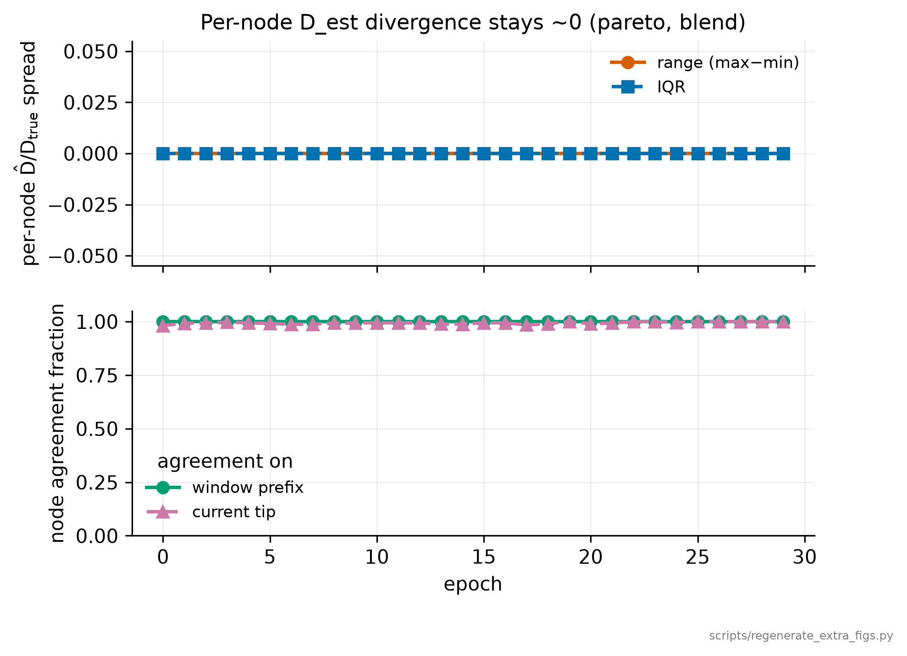

The one metric that is *not* exactly 1 is **current-tip** agreement (`fig18`, same fullscale run — but its `U = 0` curves pool both sizes in that run, N = 5 000 and N = 10 000): nodes share the live tip most of the time (≈ 0.985–0.994 typical), dipping to ~0.985 in the worst plotted cell; restricted to N = 10 000 the same cells run 0.978–0.996 (worst 0.978 at degree 6, delay 1 s), and the worst tip cell at N = 10 000 over all `U` is 0.971 — a small, transient tip churn that never reaches the deeply-buried density window, which is why `D̂` agreement is exact regardless.

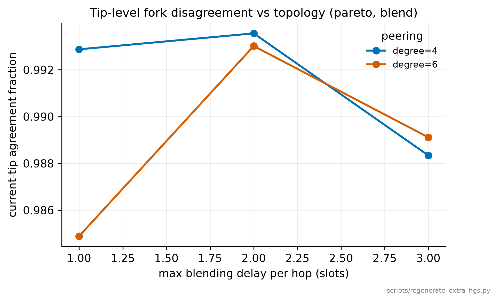

<a id="sC-2"></a>
### C.2 Consensus rests on common initialization — there is no active re-convergence

The [§3.1](#s3-1) consensus (spread → 0) holds because every node starts at the *same* genesis `D̂` and applies the *same* update to the *same* finalized density. To test whether TSI would *re-heal* a divergence that arose anyway, we seeded the nodes with a **heterogeneous** initial `D̂` (a ±50 % per-node spread around a genesis guess set at `0.5×` the true stake; N = 400 / scaled k = 256, equal stakes, regular topology) and watched it evolve.

The inter-node disagreement does **not** contract (`fig21`): the strictly conserved quantity is the **ratio between the highest and lowest node estimate**, `max/min ≈ 3.0`, which stays flat to three digits across all epochs. The absolute spread `range(D̂/D)` is *not* invariant — because the mean starts low (`0.5×`) it is scaled **up** in the first epoch (a common factor ≈ 2.15 rescales mean *and* spread together, so the spread jumps from its injected ≈ 0.5 to ≈ 1.07 within epoch 0) and then holds flat near ≈ 1.09 — so the disagreement is rescaled, never healed. (`fig21` plots the *post*-update spread, which already sits at ≈ 1.07 by epoch 0 and stays flat; the ≈ 0.5 → ≈ 1.07 rescale happens inside the first epoch and is not itself drawn.) The reason is structural — the recursion `D̂ ← D̂·(1 − β(f − m/T)/f)` (`β` = the TSI learning rate, `m/T` = the measured density over the window `T`; [§6.5](#s6-5)) applies a *common* multiplicative factor (all nodes read the same global `m`), so the ratio between any two nodes' estimates is invariant; there is no inter-node coupling to pull them together.

**Caveat:** TSI's consensus is *maintenance*, not *repair* — it keeps identically-initialized nodes identical, but a coalition that could inject persistent per-node `D̂` disagreement (e.g. via a genesis/clock exploit) would not be corrected by the estimator itself. In the honest protocol this never arises (genesis `D` is a shared constant), so [§3.1](#s3-1) stands; the point is that the consensus is an *initialization* property, not a restoring force.


