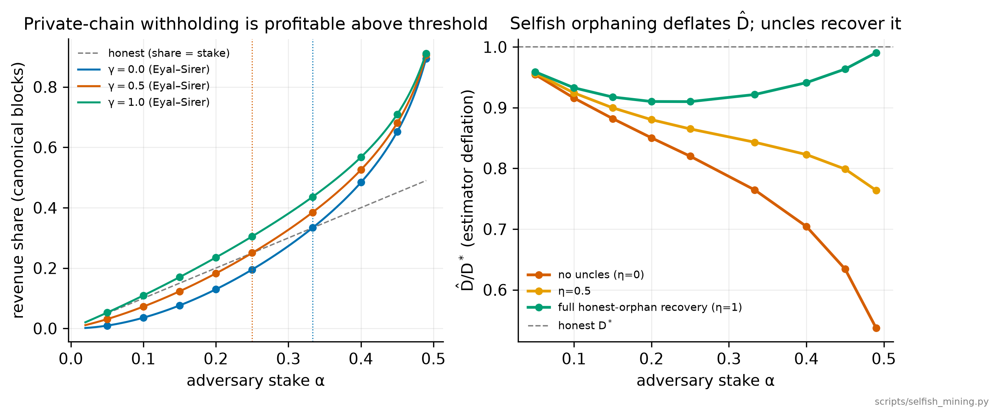

# Total-Stake-Inference parameter selection — Robustness and incentives

*Per-node network simulation of Cryptarchia Total Stake Inference (TSI). Simulator: `tsi-sim-pernode`. All runs at the true security parameter **k = 2160** and block rate **`f` = 1/30** (one block per 30 slots; [§3.3](tsi-report-2-accuracy-and-design.md#s3-3)) unless noted; latency is in slots and **1 slot = 1 s**.*

*[Part 1 — Overview & recommendations](tsi-report-1-overview-and-recommendations.md) · [Part 2 — Accuracy & design](tsi-report-2-accuracy-and-design.md) · [Part 3 — Robustness & incentives](tsi-report-3-robustness-and-incentives.md) · [Part 4 — Reproducibility & appendices](tsi-report-4-reproducibility-and-appendices.md) · [Index](README.md)*

*Sections live across the set: [§1](tsi-report-1-overview-and-recommendations.md#s1)/[§7](tsi-report-1-overview-and-recommendations.md#s7)/[§8](tsi-report-1-overview-and-recommendations.md#s8) in Part 1, [§2](tsi-report-2-accuracy-and-design.md#s2)–[§5](tsi-report-2-accuracy-and-design.md#s5) in Part 2, [§6](#s6) in Part 3, [§9](tsi-report-4-reproducibility-and-appendices.md#s9) and Appendices A–C in Part 4.*

---

## 6. Robustness beyond the honest, deterministic regime

[§1](tsi-report-1-overview-and-recommendations.md#s1)–[§5](tsi-report-2-accuracy-and-design.md#s5) characterise an honest, jitter-free regime, in which the two headline claims (one global estimate `D̂`; uncle cap `U` = the load `⌈ρ⌉` suffices, where the **load** `ρ = f·D_vis` is the number of blocks the network produces per block-visibility delay `D_vis` — [§3.3](tsi-report-2-accuracy-and-design.md#s3-3)) cannot fail by construction. Eleven studies test those limits, forming one arc from network noise to a full adversary and its incentives, then out to the chain structure the estimate rides on and the wall-clock cadence it runs at:

- **[§6.1](#s6-1)** consensus survives jitter (positive result).
- **[§6.2](#s6-2)** the estimator is a load-feedback loop, bistable near `ρ≈1` in a fitted static map — a caveat, not reached in the full dynamics.
- **[§6.3](#s6-3)** uncle-suppression grinding — a bounded attack.
- **[§6.4](#s6-4)** static block withholding — deflates `D̂` but faithfully tracks *active* stake.
- **[§6.5](#s6-5)** dynamic withhold-rejoin grinding — unprofitable, non-persistent.
- **[§6.6](#s6-6)** selfish / private-chain withholding — the one profitable lever (above the classic stake threshold, quantified with the optimal-strategy MDP); uncle-*counting* still restores the estimate.
- **[§6.7](#s6-7)** block/uncle *rewards* — robustly compensate honest orphans and disincentivise hiding, but a *voluntary* reward can backfire on selfish mining.
- **[§6.8](#s6-8)** a *soft* (reward-weighted) inclusion rule — the fork-safe choice (a validity rule cannot prove which forks a producer saw). The emergent reference rate stays high (honest blocks reference the published orphans), so the backfire mostly vanishes; the residual is set by the uncle window `W` (how far back a block may reach to reference an orphan; recommended 300 slots = 10/f, [§3.4](tsi-report-2-accuracy-and-design.md#s3-4)) and visibility.
- **[§6.9](#s6-9)** multiple coalitions and bribery — the abstention commons is bounded and structure-independent; multi-coalition *selfish* mining is flagged, not solved.
- **[§6.10](#s6-10)** fork rate and reorg depth — uncles and `ρ < 1` keep reorganisations shallow and keep even a 30 % coalition below the effective-majority cliff.
- **[§6.11](#s6-11)** organic stake churn against the ~7.5-day epoch cadence — tracked with a one-epoch lag; a bounded rate wobble, never a consensus or accuracy failure.

The recurring theme: the same uncle references that fix the honest under-count ([§3.2](tsi-report-2-accuracy-and-design.md#s3-2)) are also the adversarial safeguard — and *rewarding* them (softly) makes the safeguard incentive-compatible without a fork risk.

### 6.1 Consensus survives network jitter — not a determinism artifact

Adding random per-delivery arrival noise changes nothing: consensus stays exact. This needed testing because `range_ratio ≡ 0` in [§3.1](tsi-report-2-accuracy-and-design.md#s3-1) is exact by construction *only* at `jitter = 0`. Re-running in the simulator's guaranteed-exact mode (the full arrival matrix, with the windowed/pruning speed-ups disabled) with per-(block,node) arrival jitter across the full grid — `jitter_mean ∈ {0, 0.1, 0.3, 1, 3}` slots (the 0 cell is the exact baseline) × both transports of [§2](tsi-report-2-accuracy-and-design.md#s2) — `regular` (plain direct gossip, sub-slot links, forks rare) and `blend` (the Blend mix cascade, whole-second per-hop blending delay — the deployment target) — × N ∈ {1 000, 2 000}, 10 replicates each — leaves **`range_ratio = 0 ± 0` and `agreement_window = 1.000` in all 200 runs (20 grid cells × 10 replicates)**, and the mean accuracy stays at 1.0 throughout (0.97–1.02 per run, 0.996–1.005 per replicate-averaged cell, at every jitter level; the few per-run values above 1 are per-epoch sampling noise around the `D̂/D ≤ 1` bound — [§2.2](tsi-report-2-accuracy-and-design.md#s2-2)) — jitter costs nothing in accuracy either. The only metric that moves is *current-tip* agreement, degrading monotonically (worst run ≈ 0.98 → 0.86, worst cell ≈ 0.99 → 0.94, as jitter grows to 3 slots):

| `jitter_mean` (slots) | 0 | 0.1 | 0.3 | 1.0 | 3.0 |
|---|---|---|---|---|---|
| `range_ratio` (max over runs) | 0 | 0 | 0 | 0 | 0 |
| `agreement_window` (min) | 1.000 | 1.000 | 1.000 | 1.000 | 1.000 |
| mean `D̂/D` (range over runs) | 0.974–1.017 | 0.977–1.015 | 0.987–1.014 | 0.983–1.017 | 0.979–1.022 |
| `agreement_tip` (worst run) | 0.977 | 0.957 | 0.945 | 0.928 | 0.859 |

Jitter feeds exactly the tip-level churn that [§3.1](tsi-report-2-accuracy-and-design.md#s3-1) showed never reaches the finalized density window. The reason is structural: the density window opens a full epoch back (`E = 10·⌊k/f⌋` slots) and *closes* `E − T = 4·⌊k/f⌋` slots before the chain is snapshotted for measurement — 259 200 slots ≈ 8 640 blocks ≈ 4k at k = 2160, f = 1/30, i.e. ~3k blocks deeper than `k`-finality — so every block has reached every node by measurement time regardless of jitter, and all nodes still compute an identical `D̂`. The "one global `D̂`" claim therefore holds off the `jitter = 0` axis.

**Clock skew: bounded, but not identically zero.** A whole-timeline shift of a node's slot clock — unlike per-arrival jitter, it shifts the node's measurement-window bounds — was tested directly (its own generator, `scripts/clock_skew.py`, [§9](tsi-report-4-reproducibility-and-appendices.md#s9)). A skew of up to ±20 slots moves each node's occupied-slot count by at most the one or two blocks in the shifted window edge, an inter-node spread of at most `max(1/m, 2·skew/T)`, where `m = f·T` is the window's occupied-slot count — the discrete one-block floor `1/m` dominates for `skew < 1/(2f)`, and the measured spread is indeed a flat `1/m` at every skew from 1 to 20 slots. At the production window (`T = 6·⌊k/f⌋ = 388 800` slots, so `m = f·T = 12 960`) both terms are `≈ 1×10⁻⁴` — bounded and negligible, but, unlike jitter's exact 0, not identically zero. So bounded clock skew is a small quantifiable consensus cost, not a break ([§8.3](tsi-report-1-overview-and-recommendations.md#s8-3) item 6).

### 6.2 The estimator is a load-feedback loop, bistable near ρ≈1 in theory (`fig7`)

The worry: the estimator feeds back on itself — a low estimate makes the lottery easier, more blocks collide, fewer get counted, and the estimate drops further. Could that spiral? The answer: only in a fitted static model, right at the load boundary `ρ ≈ 1`; the simulated network never reaches the spiral, but the boundary is real and is why we provision `ρ < 1` with margin.

Because the controller drives the *counted* density to the target block rate `f` (blocks per slot; `f = 1/30`, one block every 30 slots = 30 s — defined in the [§3.3](tsi-report-2-accuracy-and-design.md#s3-3) symbol table, and swept in [§3.6](tsi-report-2-accuracy-and-design.md#s3-6)), the realised proposal rate is `f/r` (`r` = the recovered accuracy `D̂/D`; under-recovery means `r < 1`), so the realised load is `ρ_eff = ρ/r > ρ` whenever the estimate is under-recovered — this single effect explains both the U=0 finite-size drift and the near-integer `⌈ρ⌉` under-shoots. Fitting the effective counted density `q_eff` ([§4](tsi-report-2-accuracy-and-design.md#s4), eq. 4) as `q_eff ≈ 1/(1 + 0.71·ρ_eff)` and solving the self-consistent fixed point `r = ln(1−f)/ln(1−f/q_eff(ρ/r))` gives a single reachable stable branch that **folds into a collapsed low branch at `ρ ≈ 1.08`** — the map is bistable at the recipe's own operating boundary. (`fig7`'s shaded band opens earlier, at `ρ ≈ 0.66`: that is where the unstable middle root rises above the low-`r` seed of the branch scan, so from `ρ ≈ 0.66` up a sufficiently deflated start already falls into the collapse basin, even though the upper branch itself survives to the fold.) So the honest-regime "`U = ⌈ρ⌉` suffices" line, computed on the high branch, is an upper edge, not a safe interior; the `+1` margin partly absorbs the `ρ_eff > ρ` gap. *Caveat:* this bistability is a property of the *fitted static* `q_eff(ρ)` map; the full per-node dynamics do **not** reach the fold — no simulated schedule flips to the collapsed branch ([§6.3](#s6-3)(i)) and a withhold pulse always recovers ([§6.5](#s6-5)(iv)). So the fold is a warning about *provisioning* margin, not an observed dynamical trap.

*Figure note: the grey dotted line labelled "ceiling c(f)" (≈ 1.017) in the right panel is a leftover from the superseded block-counting rule and does **not** apply to any result in this report — under the corrected occupied-slot count the equilibrium `D̂/D` is bounded by 1 ([§2.2](tsi-report-2-accuracy-and-design.md#s2-2), [Appendix A](tsi-report-4-reproducibility-and-appendices.md#sA)). It is a reference annotation only; neither plotted branch approaches it, so the fold result is unaffected.*

### 6.3 Grinding by uncle suppression is real but bounded, and scales with load (`fig8`)

The uncle mechanism is the attack surface: `D̂` is the denominator of the win probability `φ(f, w/D̂)` (`w` = the node's stake), so an adversary that references **no** uncles in its blocks starves the density count, deflates `D̂`, and inflates everyone's win rate — a grinding payoff. We added this to the engine (`adversary_frac`, a coalition holding a stake fraction `β_adv` that suppresses uncle refs; written `α` in the selfish-mining sections [§6.6](#s6-6)–[§6.8](#s6-8), and distinct from the TSI learning rate `β` of [§6.5](#s6-5)) and swept it × load (U = 2, N = 1 000; the table's β_adv cells are `D̂/D` under suppression, and **grinding gain** is the coalition's win-rate multiplier `1/(D̂/D)` — its lottery odds scale as `1/D̂` — reported at β_adv = 0.5):

| load `ρ` | β_adv = 0.1 | 0.3 | 0.5 | grinding gain @ 0.5 |
|---|---|---|---|---|
| 0.56 (honest regime) | 0.997 | 0.994 | 0.962 | 1.04× |
| 0.96 (boundary) | 0.996 | 0.949 | 0.876 | 1.14× |
| 1.36 (U-limited) | 0.993 | 0.898 | **0.700** | **1.43×** |

Three findings: (i) the deflation is **smooth and monotone in `β_adv` — no catastrophic branch-flip** up to 50 % stake, so the [§6.2](#s6-2) bistability is not reached in this range (the fitted `q_eff` over-states the fold); (ii) at the honest operating load `ρ < 1` the attack is **weak** (honest blocks backfill the suppressed references within the window `W`), biting only in the U-limited `ρ > 1` regime; (iii) therefore **provisioning `U`/`W` to keep the operating point at `ρ < 1` with margin is *also* the adversarial safeguard** — operating at `ρ > 1` is doubly bad (honest under-recovery *and* a cheap grinding lever). *Precondition:* a counted uncle must be a real lottery winner for its slot — the spec's ZK Proof-of-Leadership makes fabricating a win cryptographically impossible, and this is already enforced on-chain; modelled here. Block *withholding* — the stronger lever flagged here — is examined next in [§6.4](#s6-4).

### 6.4 Block withholding deflates `D̂` to ≈(1−β_adv), but measures reduced *active* stake (`fig9`)

Uncle suppression is a *reference-level* attack (the adversary publishes blocks but starves the density count). The stronger lever is **withholding**: the coalition wins its slots but never publishes, so its blocks never arrive at any honest node (arrival set past the epoch horizon `E`, so never received), are never adopted, and never counted. We added `adversary_strategy ∈ {suppress, withhold}` and re-ran the β_adv sweep on both transports (`regular` / `blend`, [§2](tsi-report-2-accuracy-and-design.md#s2)) (N = 400, k = 256, U = 2, exact oracle):

| β_adv | 0.1 | 0.2 | 0.3 | 0.4 | 0.5 | vs. suppress @ 0.5 |
|---|---|---|---|---|---|---|
| **withhold**, regular | 0.862 | 0.724 | 0.635 | 0.563 | 0.472 | — |
| **withhold**, blend | 0.793 | 0.780 | 0.605 | 0.537 | 0.406 | — |
| suppress, regular | 1.000 | 1.000 | 0.999 | 0.996 | 0.999 | flat ≈ 1.0 |
| suppress, blend | 1.001 | 0.997 | 0.996 | 0.995 | 0.992 | ≈ 1.0 |

Three findings: (i) withholding tracks the **active-stake line `D̂/D ≈ (1−β_adv)`** (grey dotted in `fig9`), sitting slightly below it, and is **largely topology-independent** — regular and blend deflate together — because the mechanism removes stake from the *count*, not from the propagation graph; suppression, by contrast, does essentially nothing on the well-connected regular graph and only bites weakly on blend at high load. (ii) The deflation **overshoots slightly below (1−β_adv)** in every cell of the grid, but by a margin that shows **no resolvable trend in β_adv**: the shortfall is 0.038 / 0.076 / 0.065 / 0.037 / 0.028 on regular and 0.107 / 0.020 / 0.095 / 0.063 / 0.094 on blend at β_adv = 0.1 … 0.5, every cell within ≈ 2.6 SEM of the line at N = 400 × 16 replicates (regression of shortfall on β_adv: p = 0.53 regular, p = 0.90 blend). A plausible mechanism — once `D̂` falls, the surviving honest nodes win *more* often at the deflated denominator, fork more, orphan more, and the density feeds back down, the [§6.2](#s6-2) load-feedback loop nudging the withdrawal — is consistent with the uniformly negative sign, but this grid does not resolve its β_adv dependence. (iii) Crucially, **this is not a measurement failure — it is TSI correctly reporting reduced active stake.** A coalition that withholds every block is indistinguishable from one that simply *went offline*; total-stake inference is defined over the stake that is *participating*, and (1−β_adv) is the right answer.

*Methodological note.* The peering graph is drawn per trajectory from the config's full RNG key, so adversary-vs-honest cells use different graph samples — a replicate-averaged variance source, not a bias; the deflation is topology-independent, so the conclusion is unaffected.

Withholding is also **self-punishing**: the adversary forfeits all block rewards for its withheld slots to deflate a denominator that lowers *everyone's* difficulty (its own honest competitors included), so the relative-reward gain is second-order while the absolute cost is first-order. The generalisation to a **dynamic** withhold-then-rejoin *grinder* — abstain to deflate `D̂`, then re-activate to mine at the depressed difficulty — is examined and defused in [§6.5](#s6-5).

### 6.5 Dynamic (withhold-then-rejoin) grinding is unprofitable and non-persistent (`fig10`–`fig12`)

The static withholder of [§6.4](#s6-4) pays a permanent price. The dynamic variant tries to *time* participation: **abstain to deflate `D̂`, then re-activate to mine at the depressed difficulty**. We added a schedule (`adversary_period`, `adversary_withhold_epochs`) that withholds the coalition for part of each cycle and lets it behave honestly the rest, and attributed each epoch's canonical blocks to the coalition (reward accounting). Four results settle the threat.

**(i) The estimator is a moving average (EMA) of active stake; its speed is the learning rate `β`, not `W` (`fig10`).** Substituting the equilibrium density `m/T ≈ f·S_t·D*/D̂` into the spec recursion `D̂ ← D̂·(1 − β(f − m/T)/f)` gives, to leading order, `D̂_{t+1} = (1−β)·D̂_t + β·S_t·D*` — an exponential moving average of the active-stake signal `S_t·D*` (`D̂_{t+1}` is the estimate computed at the *end* of epoch `t`, from that same epoch's activity, and in force during epoch `t+1`; `fig10` indexes it by the epoch in which it is computed, so the overlay is contemporaneous with `S_t`. `S_t` = active fraction in epoch `t`, `D*` = the honest-equilibrium estimate, which slot-counting puts at exactly `D` ([§2.1](tsi-report-2-accuracy-and-design.md#s2-1)); the [§6.5](#s6-5)/[§6.6](#s6-6) ratios `D̂/D*` are therefore the same `D̂/D` used in [§3](tsi-report-2-accuracy-and-design.md#s3)) with time-constant `τ = −1/ln(1−β)` epochs (this `β` is the TSI learning rate, `constants.BETA_DEFAULT` — unrelated to the coalition stake `β_adv`). The sim matches this law to **RMS 0.016** across `β ∈ {0.25, 0.5, 1.0}`. At the deployed learning rate **`β = 1` the estimate equals the current epoch's active stake outright** (`τ→0`, `D̂_{t+1} = S_t·D*`), and the one-epoch lag lives in the *lottery*, which spends the following epoch using it ([§6.11](#s6-11)); a withhold cycle then draws a near-square-wave sawtooth between `D*` and `(1−β_adv)D*`. A natural expectation is that the *uncle window* `W` sets the response speed; in fact responsiveness is set by the TSI learning rate `β`, *not* `W` (which sets equilibrium *accuracy*, not *speed*). A slower `β` shrinks the peak swing for a fixed schedule (amplitude 0.35 → 0.13 as `β`: 1 → 0.25) but, per (iii), buys the adversary nothing.

**(ii) It is strictly unprofitable — worse than not attacking (`fig11`, left).** Crediting the coalition's realized canonical blocks and dividing by its stake share `β_adv`, dynamic withholding earns **less than its stake share at every withhold duty `ψ > 0`**, monotone-decreasing in `ψ`, → 1 only as `ψ → 0` (never withhold). At `β_adv = 0.3` (`β = 1`):

| withhold duty `ψ` | 0 | 0.10 | 0.25 | 0.33 | 0.50 | 0.67 | 0.75 | 1.0 (static) |
|---|---|---|---|---|---|---|---|---|
| reward / stake | 1.00 | 0.95 | 0.81 | 0.74 | 0.68 | 0.41 | 0.31 | 0.00 |

The curve is **within `0.09` for `β = 0.5` and `β = 1.0`** at every duty — profitability is near-independent of estimator speed; the one visible gap is at the alternating `ψ = 0.5` (`0.59` at `β = 0.5` vs `0.68` at `β = 1.0`), where the period-2 schedule resonates with the fast estimator's one-epoch lag, and the two agree to `≤ 0.02` at every other `ψ` — and stays `< 1` for every minority coalition (`β_adv = 0.1 … 0.4` at the alternating schedule give 0.56 … 0.73). This is the [§6.4](#s6-4) subsidy made dynamic: the coalition **forfeits whole epochs** to depress a difficulty whose benefit — a higher win rate at lower `D̂` — accrues **equally to every honest node**, so its *relative* share never rises while it *alone* pays the forfeit. The reward-maximising schedule is `ψ = 0`: don't withhold.

**(iii) As a pure griefing lever it is bounded and linearly costly (`fig11`, right).** If the adversary abandons profit and only wants to distort `D̂`, the leaky-integrator form of (i) gives the mean deflation exactly: **`1 − ⟨D̂/D*⟩ = β_adv·ψ`** (bounded by `β_adv`, maximal at the static `ψ = 1`), cross-checked analytically and in sim. It costs the coalition `≈ ψ` of its *own* reward, so distortion is only a fraction `β_adv` of what the attacker forfeits — the distortion-vs-forfeit locus sits **below the 1:1 line** and a slower `β` does not lift it. There is **no super-linear amplification** in any regime. Per unit of the *coalition's own* forfeited reward — the measure `fig11`(right) plots — the distortion is `0.30 – 0.63` across the duty sweep and `0.11 – 0.75` across `β_adv = 0.1 … 0.4`, always **below** 1:1. Normalised instead per unit of ***network*** reward forfeited (`β_adv·(1 − reward/stake)`), the ratio sits modestly above 1 across the **whole** tested grid — `1.14, 1.14, 1.67, 1.88` at `β_adv = 0.1, 0.2, 0.3, 0.4` (`β = 1`, `ψ = 0.5`), and `1.00 – 2.08` over `ψ` at `β_adv = 0.3` for **both** `β = 0.5` and `β = 1` — i.e. it is a small `≈ 2×` constant arising from rejoin overshoot, a protocol-chosen estimator gain rather than an adversary lever, not a regime the attacker can enter by growing. (Largest coalition simulated here is `β_adv = 0.4`; no `β_adv = 0.5` dynamic cell was run. The static `ψ = 1` grid of [§6.4](#s6-4), which does reach `β_adv = 0.5`, gives the same ratio *decreasing* with stake: `2.07 → 1.19` on blend and `1.38 → 1.06` on regular over `β_adv = 0.1 → 0.5`.)

**(iv) No self-sustaining collapse — the pulse is a pure transient (`fig12`).** The most worrying possibility is a withhold *pulse* that kicks the [§6.2](#s6-2) load-feedback loop across its fold into a *persistent* deflation that outlives the attacker. It does not: a 4-epoch pulse followed by honest behaviour returns `D̂` to the load-determined honest equilibrium at **every** operating point and **every** learning rate tested (`β = 0.25, 0.5, 1.0`). Where `D̂` sits low afterwards (0.21, 0.02 at `ρ ≫ 1`) that is the **chronic `ρ > 1` under-count of [§3.3](tsi-report-2-accuracy-and-design.md#s3-3) / [§6.3](#s6-3) — a provisioning failure, not the adversary's doing** (the pulse-free honest run sits at the identical level). The per-node dynamics have a unique attracting equilibrium per operating point; the [§6.2](#s6-2) bistability of the *fitted static* `q_eff(ρ)` map does not create a trapping basin in the full dynamics.

**Net.** Within its model, dynamic withholding is a *weaker* threat than the static case it generalises: no profit, bounded and costly distortion, no persistence — resolving the question left open at the end of [§6.4](#s6-4). The mitigation is unchanged and now doubly motivated: **hold the honest operating point at `ρ < 1` with margin** (which pins `D*` at the true stake, [§3.3](tsi-report-2-accuracy-and-design.md#s3-3)) and keep the learning rate responsive (`β = 1`, so any withhold notch is erased in one epoch). *Precondition, as in [§6.4](#s6-4):* counted uncles must be real VRF winners (enforced on-chain).

**Scope and limits (what this does *not* cover).** These results were verified by independent re-derivation and by baseline-corrected, forfeit-inclusive replicate sweeps; the confirmed claims come with a firm boundary:
- **Withholding here means *abstention* (deflate the active-stake estimate), not private-chain release.** A withheld block's arrival time is set past the epoch horizon `E` — it never propagates and is permanently orphaned, so the coalition's forfeit is a *dead loss*. That dead loss is exactly what makes (ii) unprofitable. The classic *selfish-mining / private-chain* withholder instead builds a hidden chain and *releases* it to orphan honest blocks, recovering the forfeit — the stronger lever, **analysed separately in [§6.6](#s6-6)** (it *is* profitable above the classic stake threshold, and its density deflation is mitigated by the same uncle mechanism).
- **The reward metric is relative canonical-block *share*** — which, because TSI holds the counted density at `f` (so the canonical block rate does not inflate when `D̂` deflates), equals the *absolute* per-block reward per unit stake; see the issuance note in [§6.6](#s6-6).
- **Open-loop, single, equal-stake coalition.** Untested here: adaptive (feedback) schedules that react to the observed `D̂` or target the finalized measurement window directly; Pareto *whale* coalitions (lumpier share statistic); very slow `β` (where a notch persists many epochs in wall-clock); and `jitter > 0`. (The joint/adaptive adversary is closed in [§6.7](#s6-7); *multiple* non-cooperating coalitions are treated in [§6.9](#s6-9).) The reported bounds are best-case-for-the-defender.

### 6.6 Private-chain (selfish) withholding is profitable above the classic threshold; uncle-counting still restores the estimate (`fig13`)

[§6.5](#s6-5)'s "withholding" was *abstention* — the coalition **discards** its blocks. The stronger, standard block-withholding attack is **selfish mining** (Eyal–Sirer): the coalition mines a **private chain** and **releases** it to orphan honest blocks, *recovering* the forfeit. Because TSI reads density from a window past k-finality where all nodes agree on the canonical chain ([§3.1](tsi-report-2-accuracy-and-design.md#s3-1)), the outcome is a global longest-chain race with a network tie-break `γ` (the fraction of honest miners that adopt the adversary's block in a same-length race); we simulate it directly (`selfish.py`, validated to within simulation noise against the Eyal–Sirer closed form).

**Profitability (`fig13`, left).** Unlike abstention, private-chain withholding **earns more than its stake share above the classic threshold** `α > (1−γ)/(3−2γ)` (here `α` is the coalition stake fraction, ≡ `β_adv` of [§6.3](#s6-3)–[§6.5](#s6-5), in the selfish-mining literature's notation) — ⅓ at `γ = 0`, ¼ at `γ = 0.5`, → 0 as `γ → 1`. At `α = 0.4`: revenue/stake `= 1.21×` (`γ = 0`) up to `1.42×` (`γ = 1`); below threshold (`α = 0.2`, `γ = 0`) it under-earns (`0.65×`). This is the general Nakamoto-PoS selfish-mining result — not TSI-specific — and it is the **honest upper bound on withholding profitability that [§6.5](#s6-5)'s abstention model does not capture**.

*How much does the **optimal** strategy add?* SM1 — the original Eyal–Sirer strategy — is one fixed policy, not the best one; solving the Sapirshtein–Sompolinsky–Zohar model, a Markov decision process that searches over *every* possible withhold/release policy (`selfish_mdp.py`; states `(a, h, fork)`, actions adopt/override/match/wait, ratio objective by bisection + damped relative value iteration), gives the true frontier (`fig14`, left). At `γ = 0` the optimum barely beats SM1 (`0.488` vs `0.484` at `α = 0.4`; profitability threshold essentially the SM1 `⅓`, marginally below it), so **SM1 is a faithful proxy** there; the gap opens only with network advantage (`γ = 0.5`: `0.573` vs `0.526` at `α = 0.4`, `0.803` vs `0.723` at `α = 0.46`). The optimal revenue equals `α` below threshold — confirming the *threshold* itself, not just SM1's revenue — and upper-bounds any selfish take.

) shrink the premium (right — the benign limit of [§6.7](#s6-7)).](report-figures/fig14_optimal_rewards.png)

**The TSI coupling (`fig13`, right).** Selfish mining orphans honest blocks (23.7 % of all blocks at `α = 0.4`, `γ = 0`), so the *counted* canonical density falls and TSI **deflates `D̂` to `D*·(density fraction)`** — `0.70` at `α = 0.4` with no uncles: a 30 % under-report of active stake, a safety harm layered on the reward theft. But that under-count is precisely what **uncle references fix** ([§3.2](tsi-report-2-accuracy-and-design.md#s3-2)): counting orphaned honest blocks back into the density restores `D̂` toward `D*` — to `0.82` at `η = 0.5` and `0.94` at `η = 1` (uncle-recovery fraction `η ∈ [0,1]`, distinct from the integer uncle cap `U`). So the mechanism provisioned for honest latency recovery **doubles as the mitigation for selfish mining's estimator deflation** — this restores the *estimate* `D̂` (a safety win), independent of the reward schedule. Whether *rewarding* those uncles also cuts the selfish *profit* premium is a separate, conditional question — it can *backfire* without care and needs a soft inclusion rule — taken up in [§6.7](#s6-7)–[§6.8](#s6-8).

**Issuance model.** Does deflating `D̂` inflate the reward pie? No, for a per-canonical-block schedule: TSI targets *counted* density `= f`, so the canonical block rate is held at `≈ f` regardless of the attack (the extra lottery wins a deflated `D̂` produces are orphans that earn nothing). Absolute reward per unit stake therefore equals the revenue *share* metric — **[§6.5](#s6-5)'s "abstention is unprofitable" is robust under per-block issuance**, and [§6.6](#s6-6)'s selfish premium is the genuine profit channel. MEV (value extracted from transaction ordering) or a per-*raw*-block schedule would reopen this — an issuance-design question, not a TSI-estimation one. *(This clean equivalence assumes the block-only schedule; once [§6.7](#s6-7) pays and **counts** uncles, the counted density held at `f` includes recovered uncles, so the canonical rate sits slightly below `f` and the pie's size and split both shift. [§6.7](#s6-7)'s profitability is then read directly off the reward *share*, not off a fixed pie — the two subsections use different issuance premises, reconciled only in the `w_u = 0` limit.)*

**Scope.** Modelled: SM1 *and* the optimal-MDP selfish strategy with a network tie-break `γ`, a single coalition, and uncle density-recovery as the `[0,1]` knob `η`. Multi-coalition races are discussed (not solved) in [§6.9](#s6-9). The headline: **private-chain withholding is the real profit threat, bounded by the classic stake threshold; its *estimator* deflation is undone by uncle-counting, while its *profit* premium is only conditionally reduced by rewarding uncles ([§6.7](#s6-7)–[§6.8](#s6-8)).**

### 6.7 Block/uncle rewards: robust for fairness and anti-hiding, but a *voluntary* reward can backfire on selfish mining (`fig14`, `fig15`)

Everything above measures *blocks*. Whether an attack **pays** depends on the reward schedule, which is a design choice. We add one as a configurable option (`selfish.RewardParams`): a block reward (`= 1`), an **uncle reward** `w_u` (a reward weight — distinct from the uncle *window*, which this report calls `W`) paid to the *producer* of an orphaned block that is referenced as an uncle, and a **nephew reward** `w_n` paid to the block that *references* it. The model has five knobs in total: `w_u`, `w_n`, the honest-orphan reference rate `p_ref` (defined below), the attacker's self-uncling rate `p_ref_adv` (= 1 for a rational attacker), and `adv_nephew` — the fraction of referenced honest orphans whose *nephew* reward the attacker's own canonical blocks capture (0 without a forced-inclusion mandate, since honest blocks do the referencing). Three effects, all adversarially analysed.

**(1) It compensates orphaned honest producers (fairness).** A block-only schedule pays an orphaned honest block **nothing** — the same "off-chain, uncounted" fate that drives both the [§3.2](tsi-report-2-accuracy-and-design.md#s3-2) latency under-count and the losses a selfish attacker inflicts. Define the **reference rate** `p_ref` = the probability that an orphaned honest block is referenced as an uncle by some canonical block within `W`. An uncle reward `w_u` refunds the loss in proportion to `p_ref`: honest recovery of *mined* value rises with `w_u` toward `1.0` (e.g. in the α = 0.4 selfish race, `0.61 → 0.80 → 1.00` for `w_u = 0 → 0.5 → 1` at `p_ref = 1`; `fig15`, right, plots recovery vs `p_ref`). The same references that restore the TSI *density* ([§6.6](#s6-6), `D̂`) restore the *reward*. **This benefit is robust** because a genuine latency orphan is *published* and straddled by *honest* canonical blocks that reference it, so `p_ref ≈ 1` here — unlike the selfish case in (3), where the attacker owns the straddling blocks.

**(2) It disincentivises hiding.** A withheld block (the [§6.4](#s6-4)/[§6.5](#s6-5) lever) *never propagates*, so it can never be referenced as an uncle — the withholder forfeits **both** the block reward **and** any uncle reward. Publishing promptly is therefore strictly dominant for an honest-but-unlucky miner, and abstention is made even costlier than the already-negative [§6.5](#s6-5) result. The reward schedule turns "publish everything you win, immediately" into the incentive-compatible action.

**(3) On selfish mining, a *voluntary* uncle reward can *backfire* — a soft inclusion rule fixes it (`fig15`, [§6.8](#s6-8)).** The naive hope is that paying orphaned honest blocks lifts honest reward and cuts the attacker's share. But the attacker controls the references that would do so: the honest blocks it orphans by a selfish override are straddled by *its own* canonical blocks, and it **suppresses** them (the [§6.3](#s6-3) lever) — while **self-uncling** its own revealed-but-lost blocks to recover `w_u + w_n` each.

Modelling that strategic reference game (`selfish.reward_shares`, with `p_ref_adv` = the attacker's rate of self-uncling its own lost blocks, `= 1` when rational), a voluntary uncle reward makes the attacker's **reward share rise *above* its block share** (e.g. `α = 0.4`: `0.484 → 0.520` at Ethereum-like `w_u = 0.875`), and honest recovery falls (to `0.61` at `α = 0.4`, `0.34` at `α = 0.46`). *(The benign-looking `fig14`-right — "uncle rewards shrink the premium" — is the opposite `p_ref = 1` limit of full inclusion; the backfire is the suppressed `p_ref → 0` end. `fig15` plots the whole `p_ref` axis and reconciles the two.)*

The backfire is *unconditional* below the `⅓` threshold and holds at higher `α` while the attacker keeps `p_ref` low (its default, since it owns the straddling blocks); it weakens as honest blocks reference more orphans (`p_ref` high). The worst case `p_ref = 0` (suppress *all* references) is not achievable: honest orphans are published, so honest canonical blocks reference them anyway. [§6.8](#s6-8) shows that under a **soft** (reward-weighted) inclusion rule the emergent `p_ref` sits high — the selfish share falls below block-only and toward stake, with honest recovery restored, and **without** the fork risk a hard mandate would carry. (How high `p_ref` must be depends on `α` — quantified in [§6.8](#s6-8), `fig15`.) So the *fairness* benefit (1) and *hiding*-disincentive (2) are robust and attacker-independent; the selfish-mitigation (3) is real but **degrades gracefully with the reference rate `p_ref`**, which the window `W` and visibility set ([§6.8](#s6-8)).

**Adversarial analysis of the reward scheme itself.** A reward for uncles is a new payout, so a new attack surface — *bounded*, but only under an explicit constraint the naive "`w_u < 1`" misses.

*(a) Uncle farming with a self-nephew.* An attacker who deliberately orphans a genuine VRF win and references it **from its own next canonical block** collects *both* payouts: `w_u` (uncle producer) **and** `w_n` (nephew). The per-slot payoff is `w_u + w_n` against an honest block's `1`, so farming beats honest **iff `w_u + w_n > 1`**. The binding safety condition is therefore **`w_u + w_n < 1`**, *not* `w_u < 1` — e.g. Ethereum's `0.875 + 0.03125 = 0.906 < 1` is safe, but a loose "substantial `w_u` + small `w_n`" (say `0.875 + 0.15 = 1.025`) is **not**. Fabrication is impossible (a counted uncle must be a real VRF winner, [§6.3](#s6-3)), keeping the payoff per-slot rather than unbounded, and `U`/`W` cap total uncle issuance to `≤ U·(w_u + w_n)` per block.

*(b) Multi-winner self-uncle.* A miner that wins two concurrent slots (multi-winner slots exist, ~1.7 % of blocks) can make only one canonical and, if the schedule pays it, earns `1 + w_u` by uncling the other. This does **not** inflate the estimate — TSI counts the slot once either way ([§2.1](tsi-report-2-accuracy-and-design.md#s2-1)) — so it is a pure reward-fairness question, bounded by `w_u + w_n < 1` on the referencing side.

*(c) The reference game is not fixed by a plain `w_n`.* Because the selfish attacker suppresses references on its *own* override blocks, a nephew reward it *also collects* does **not** by itself force inclusion — in the model, raising `w_n` slightly *lowers* `α*` (the stake threshold above which selfish mining is profitable — i.e. it marginally *helps* the attacker, which pockets a canonical-share slice of the nephew pot). What *does* keep the effective reference rate high is that the orphans are **published**, so the many *other* honest blocks within `W` reference them anyway ([§6.8](#s6-8)). A hard "invalid block if it omits an uncle" mandate would force this outright but **cannot be encoded fork-safely** (no node can prove what forks a producer saw — [§6.8](#s6-8)), so we use a **soft (reward-weighted) inclusion rule** instead. *(Consolidated protocol recommendation: end of [§6.8](#s6-8).)*

**Joint / adaptive adversary** (the adaptive-schedule case left open in [§6.5](#s6-5)'s scope note). The optimal *within-race* adversary is the [§6.6](#s6-6) MDP. Combining selfish release with the [§6.5](#s6-5) *abstention* lever is **dominated**: abstaining a fraction `ψ` of your wins lowers effective mining power to `α_abst = α(1−ψ)/(α(1−ψ)+1−α) < α`, and selfish revenue is monotone increasing in `α` (`fig14`), so withholding-to-abstain strictly reduces the take. Closed-loop timing on `D̂` adds nothing either: the selfish revenue *share* depends only on `(α, γ)`, not on `D̂` (the race is decided block-by-block, while `D̂` moves on the epoch scale). So the adversary frontier is exactly **optimal selfish mining, bounded by the stake threshold** — and, *under the [§6.8](#s6-8) soft inclusion rule that keeps the emergent `p_ref` high*, blunted but not eliminated by rewarded uncles. No compounding lever remains.

### 6.8 A *soft* inclusion rule delivers the benefit without a fork risk (`fig15`)

[§6.7](#s6-7)(3) shows a purely *voluntary* uncle reward can backfire on selfish mining. The tempting fix — a *mandatory* inclusion rule that makes a block **invalid** if it omits an owed uncle — cannot be encoded safely: "owed" means "the producer could have seen it," which depends on per-node gossip timing that no node can prove. An **objective** encoding (slot-gap `s_block − s_uncle ≥ g`) lets an adversary *withhold-then-late-release* an uncle to retroactively **invalidate honest blocks** (censorship); a **visibility-based** encoding is *subjective*, so the same block is valid to some nodes and invalid to others — a **consensus fork** with no adversary at all. **We therefore make inclusion a soft rule:** *a block is always valid; a producer that includes an available in-window uncle earns the nephew reward `w_n`, and the orphan producer earns `w_u` — omission simply forfeits those rewards.* No validity edge, so no fork and no censorship weapon.

**The emergent `p_ref` is high — now measured, not assumed.** The per-node engine records `p_ref` directly (the fraction of in-window orphans referenced as uncles by some canonical block): at the recommended `W = 300` it is **≈ 1.0 honestly** and **0.989 under a 30 %-stake coalition that produces its share of the (straddling) canonical blocks and suppresses references on them** ([§8](tsi-report-1-overview-and-recommendations.md#s8) capstone). That suppression case *is* the reference-suppression channel a selfish attacker would use — an honest orphan loses its reference only if *every* one of its in-window straddlers is a suppressing coalition block — so even with 30 % of the straddlers hostile, barely 1 % of honest orphans go unreferenced, comfortably above the `p_ref ≳ 0.3` the soft rule needs for `α ≥ 0.4` (`fig15`). The one selfish channel this measurement does *not* exercise is the attacker *orphaning extra* honest blocks via a private-chain override (the per-node engine has no private-chain strategy): there we rely on the structural argument below — published honest orphans are straddled by *honest* blocks within `W`, which the attacker does not control — and read the payoff off the `fig15` `p_ref` sweep rather than a single measured point. The earlier analytic sweeps used `p_ref ≈ 0.85` as a conservative stand-in; the suppression measurement confirms it is, if anything, pessimistic.

**Why a soft rule still works — the reference rate is emergent and high (`fig15`).** Under a soft rule `p_ref` is not the attacker's to set to 0: an honest orphan was **published** (honest miners publish immediately), so *any honest canonical block that sees it within `W`* references it for `w_n`. The attacker only withholds references on **its own** canonical blocks; the honest blocks that follow do the referencing. So `p_ref` sits **high** in practice, and `fig15` reads off the payoff along it — at a realistic honest-referencer rate `p_ref ≈ 0.85`, the selfish attacker's reward share is already **below block-only and near stake** (`0.420` at `α = 0.4`, vs `0.520` at the suppressed `p_ref = 0` and `0.484` block-only) with honest recovery `0.83–0.93`. For `α ≥ 0.4` the crossover below block-only is at `p_ref ≈ 0.3` (the grey band); for a near-threshold `α ≈ 0.35` a small residual backfire (`≤ +0.03` for `p_ref ≳ 0.3`, rising to `+0.05` at the unreachable `p_ref = 0`; share still near stake) persists until `p_ref ≈ 0.75`. So the soft rule buys **most** of the (unattainable) hard-mandate benefit, plus the full fairness and hiding-disincentive of [§6.7](#s6-7)(1–2), with **none** of the fork/censorship hazard.

**What sets `p_ref` — the window `W` and visibility (the residual).** `p_ref` rises toward 1 as `W` grows (more following honest blocks get a chance to reference a given orphan) and falls only when an orphan **ages out of `W` before any honest referencer sees it** — i.e. under a *deep reorg* longer than `W`, or genuine propagation loss. This is exactly the "can't guarantee a node sees every fork in the window" limit, and it is `W`-tunable: the [§3.4](tsi-report-2-accuracy-and-design.md#s3-4) sizing `W ≈ 10/f` is already generous, and the residual adversarial lever (drive `p_ref` down via reorgs deeper than `W`) is bounded — deep reorgs need large `α`, are rare, and risk the attacker's private chain. Two provisos remain, both about *degree* not *direction*: the counted-density (`D̂`) recovery is likewise `p_ref`-limited, so under attack-inflated orphaning (`orphan/blocks ≈ 0.35` at `α = 0.46`) the cap `U` — sized for the *honest* load ([§3.3](tsi-report-2-accuracy-and-design.md#s3-3)) — may need margin, since owed uncles beyond `U` per block defer and can age out; and even at `p_ref = 1` the selfish share is `≈ α` with a small residual premium that **grows with `α`** — `≈ 0` near the `⅓` threshold, `+0.006` at `α = 0.4`, `+0.014` at `α = 0.46` — not exact break-even.

**Reward-side attack surface (bounded, self-defeating).** *(a) Farming* — orphaning a real VRF win to self-uncle it — pays `w_u + w_n` against `1`, so it is loss-making under the [§6.7](#s6-7)(a) invariant **`w_u + w_n < 1`**; in the model the attacker's share *falls* as it self-uncles more (`0.406 → 0.394`). *(b)* Because honest referencers count the orphans, a flood *inflates* `D̂` rather than deflating it — the opposite of what a deflation attack needs. *(c) Nephew leakage* to the attacker is bounded by `w_n` and dominated by the `w_u` that flows to the honest producer.

The consolidated reward-schedule recommendation is in [§8](tsi-report-1-overview-and-recommendations.md#s8) (rows 10–11 of the selection table).

### 6.9 Multiple coalitions and bribery: the abstention commons is bounded; multi-coalition selfish mining stays open

Everything above assumed a single coalition; this section asks what changes when several attack at once — or bribe others to.

**Withholding commons (solid).** `D̂` deflation depends only on the *total* participating stake ([§6.4](#s6-4)), not on how it is partitioned — this is **exact by construction** (the withhold mask is per-node membership with no sub-coalition label), so `K` abstaining coalitions summing to `β` deflate `D̂` exactly as one coalition of size `β`, and the [§6.2](#s6-2) fold is no more reachable by stacking than by a single coalition of the same `β`. Each is *individually* unprofitable ([§6.5](#s6-5)) and, given others already deflate, the best response is to *mine* at the depressed difficulty rather than join — so the abstention commons is not an equilibrium; pure griefers pay their aggregate forfeit for a bounded, linear deflation.

**Multi-coalition selfish mining (conjectural).** Here the abstention argument does **not** transfer: competing *selfish* miners orphan *each other*, and the literature shows the profitability threshold can fall **below** the single-miner `⅓` — several individually-sub-threshold coalitions may be *jointly* profitable, and total orphaning (hence raw `D̂` deflation) can **exceed** the single-coalition [§6.6](#s6-6) value, so `D̂ ≈ 0.70` at `α = 0.4` is *not* a multi-coalition upper bound. Our two-type model cannot represent a `K`-agent reference game, so this is flagged, not solved; TSI *safety* rests on the [§6.8](#s6-8) soft rule's honest-referencer `D̂`-recovery, which is itself `p_ref`-limited (`W`/visibility) and degrades — gracefully, never forking — as orphan volume rises. Sizing this properly is future work.

**Bribery on the reference game.** An attacker profiting from a deflated `D̂` can bribe canonical miners to *omit* references. Under the soft rule the miner forgoes only the nephew reward `w_n`, so a bribe `> w_n` (`≈ 0.03`) suffices — *cheap*, and here the hard-mandate "prohibitive (a full block)" defence is unavailable *by design* (we rejected validity-based inclusion for fork-safety, [§6.8](#s6-8)). But its *impact* is small: bribing away one block's references lowers `p_ref` only marginally, since the many *other* honest blocks within `W` still reference the orphan; to hold `p_ref` low the attacker must bribe (or control) a large fraction of canonical producers over the whole window. So soft-rule bribery is cheap per block but bounded in effect, and — like the withholding-commons bribe (pay coalitions to abstain, untouched by any inclusion rule) — reduces to the bounded, self-punishing griefing of [§6.5](#s6-5).

### 6.10 Fork rate and reorg depth: keep reorganisations shallow

**The question.** How often does the chain fork, how *deep* can a reorganisation (reorg) go, and which parameters keep it shallow? A deep reorg is expensive — it discards confirmed blocks and forces every node to rewind — so a design that minimises reorg depth is safer and cheaper to run.

**Why it matters.** The other sections optimise the *estimate*; this one optimises the *chain structure* the estimate rides on. A parameter choice that keeps `D̂` accurate but lets forks run deep would still be a bad choice.

**What we measure.** The engine records, every epoch, the **fork rate** (share of produced blocks orphaned off the canonical chain) and the **max reorg depth** (the deepest orphan branch — the confirmed blocks a node adopting it would have to discard). For the adversarial case we assume a coalition holding **0 %, 10 %, 20 %, or 30 %** of stake running a **private-chain deepest-reorg strategy**: it mines a hidden chain and releases it to override the public chain by the largest margin it can (the standard longest-chain attack, tuned for depth rather than revenue). Its reorg-depth tail is the Nakamoto gambler's-ruin `P(depth ≥ d) = (α_eff/(1−α_eff))^d`, coupled to the parameters through the *effective* adversary share `α_eff = α/(α + (1−α)(1−o))`, where `o` is the honest fork rate — because orphaned honest blocks do not extend the public chain, so more honest forking hands the attacker more relative power.

**Result 1 — delay drives fork depth, and uncles keep it shallow** (`fig28`, honest lines). Even with no adversary, the honest max reorg depth grows with the Blend per-hop blending-delay bound `δ` (`δ_max` in [§3.3](tsi-report-2-accuracy-and-design.md#s3-3)) — the privacy knob of the Blend mix-network transport ([§2](tsi-report-2-accuracy-and-design.md#s2)), and the dominant term in the visibility delay that sets the load `ρ` (2 blocks at δ = 2 s → 4 at δ = 32 s with U = 2). Without uncles it is far worse: the deflated estimate ([§3.2](tsi-report-2-accuracy-and-design.md#s3-2)) makes the network over-produce blocks, which fork among themselves — honest max depth reaches **17** at δ = 32 s, U = 0, versus **4** at U = 2. So uncles reduce reorg depth twice over: by keeping the block rate at `f` (no overproduction) and by keeping the operating point recoverable.

**Result 2 — adversary depth grows with stake and with forking, and crosses a cliff** (`fig27`, `fig28`). At the recommended operating point (ρ < 1, δ ≈ 8 s, U = 2, honest fork rate ≈ 0.35) a 10 % coalition needs depth ~4 to reach 0.1 % probability, 20 % needs ~8, 30 % needs ~17 — reorgs of a handful of blocks. But heavier delay raises the honest fork rate, and at **δ = 32 s with 30 % stake the effective share `α_eff` crosses 0.5** — reorgs become **unbounded**: fork-induced orphaning has amplified a minority into an effective majority. Keeping ρ < 1 (few honest forks) keeps even a 30 % adversary bounded and shallow.

**Result 3 — a confirmation-depth rule for finality.** Turning the tail into a wait-time: at the recommended operating point (`o ≈ 0.35`), to hold `P(reorg ≥ d) < 10⁻³` a receiver waits **d ≈ 4 blocks (~2 min) against a 10 % adversary, 8 (~4 min) against 20 %, 17 (~8.5 min) against 30 %**; for a `10⁻⁶` guarantee, roughly double those (8 / 15 / 34 blocks). These are the confirmation depths for probabilistic settlement. The protocol's *deterministic* finality at `k = 2160` blocks is vastly deeper than any of these, so the finality-driven `k` ([§3.1](tsi-report-2-accuracy-and-design.md#s3-1)) is consistent with — and far more conservative than — the reorg tail; the confirmation-depth rule matters only for parties wanting faster-than-final soft settlement. These 4/8/17 depths are the **N = 1 000, degree-6** point; the scale study below shows how they move with size and connectivity.

**Scale (N × degree).** The honest fork rate `o`, and through it the reorg depths, rises with network size and falls with peering degree. The 99.9 % confirmation depths (blocks) against a 10/20/30 % adversary, measured over `N × degree` (`scripts/reorg_depth.py --measure-scale`, `runs/fork_rate_vs_scale.parquet`):

| N | degree | fork rate `o` | d(10 %) | d(20 %) | d(30 %) |
|---|---|---|---|---|---|
| 1 000 | 4 | 0.369 | 4 | 8 | 18 |
| 1 000 | 6 | 0.350 | 4 | 8 | 17 |
| 1 000 | 8 | 0.339 | 4 | 8 | 16 |
| 4 000 | 6 | 0.365 | 4 | 8 | 18 |
| 16 000 | 4 | 0.423 | 5 | 9 | 24 |
| 16 000 | 6 | 0.359 | 4 | 8 | 18 |
| 16 000 | 8 | 0.361 | 4 | 8 | 18 |

The 30 %-stake depth is the sensitive one: the recommended **`degree ≥ 6`** holds it at 17–18 blocks across N = 1 000 → 16 000, while a sparse degree-4 graph lets it climb to 24 at N = 16 000 — the same connectivity margin that keeps `ρ` bounded ([§3.7](tsi-report-2-accuracy-and-design.md#s3-7)) keeps the reorg tail shallow at scale.

**Design consequence.** The reorg-depth lever is the *operating point*, not the uncle cap: `U`/`W` fix what the estimate *counts*, but they reduce reorg depth only indirectly, by preventing the U = 0 overproduction spiral. Keep `ρ < 1` with margin — the same rule that keeps the estimate accurate ([§3.3](tsi-report-2-accuracy-and-design.md#s3-3)) and the grinding lever weak ([§6.3](#s6-3)) also keeps reorgs shallow and, crucially, keeps a large minority below the effective-majority cliff. The dependence on network size and degree is the [§3.7](tsi-report-2-accuracy-and-design.md#s3-7) story read through the fork rate: a bigger or sparser network forks more, raising `α_eff`, so at the largest scales the shallow-reorg guarantee leans on the same `degree ≥ 6` recommendation that keeps `ρ` bounded (quantified in the Scale table above).

**Modelling note.** The private-chain race is a global-chain model like [§6.6](#s6-6)'s selfish mining, coupled to the engine only through the honest fork rate `o`; the honest fork/depth statistics are measured directly in the per-node engine. One caveat on `o`: it is the fork rate measured with **no adversary present**, transplanted into `α_eff` as a proxy for the public chain's forking during the attack. A pure private-chain attacker withholds its blocks until the reveal, so while it mines, the public chain is essentially honest and the no-adversary `o` is a close and slightly *conservative* proxy — an attack that lowers public forking would lower `α_eff` and shrink the tail. An attack that instead deliberately raises public forking, e.g. by strategically releasing blocks to split honest miners, would raise the attack-conditioned `o` above the honest baseline and is not captured here; the single-coalition bound is best-case-for-the-defender in that respect, [§8.3](tsi-report-1-overview-and-recommendations.md#s8-3) item 9.

### 6.11 Organic stake churn and the wall-clock cadence

**The question.** TSI's control loop is *slow*: at k = 2160 an epoch is `10·⌊k/f⌋` = 648 000 slots ≈ **7.5 days**, the measurement window is `6·⌊k/f⌋` ≈ **4.5 days**, and it sits a full epoch back — so `D̂` reflects stake from **~1–2 weeks ago** and updates only weekly. Real participation is not static over that timescale: it cycles daily/weekly, ramps as stakers join, and occasionally drops sharply. Does the lottery mis-fire on 1–2-week-stale stake?

**Why it matters.** If active stake moves faster than the estimator tracks it, the realised block rate drifts off target (over-production when stake fell, under when it rose) exactly as the [§3.2](tsi-report-2-accuracy-and-design.md#s3-2) deflation does — the honest analogue of the withholding lever ([§6.5](#s6-5)).

**Result: TSI tracks organic churn with a one-epoch lag, and consensus never breaks** (`fig29`). We drove the active honest stake through a 30 %-amplitude sine, a linear ramp, and a sudden step — each over a period of 4 epochs (≈ 30 days at the production cadence, i.e. a *monthly*-scale swing) — and measured `D̂` against the *current* active stake. The [§6.5](#s6-5) EMA law holds for honest churn as it did for adversarial: the measured estimate follows the active stake within the epoch it is measured, so `D̂/D_total` tracks the active-stake fraction (dashed, `fig29`) and the churn-corrected `D̂/D_active` stays near 1 (means: sine 1.001, step 1.003, ramp 1.002; worst replicate-averaged epoch ≈ 0.98, worst single replicate ≈ 0.93 in the transient). At the sudden step down, `D̂/D_total` settles onto the new active fraction the *same* epoch and the corrected accuracy never leaves ~1 — the one-epoch lag lives in the *lottery*, which spends the transition epoch using the previous epoch's (higher) `D̂` before catching up: a brief rate overshoot that heals in one epoch, not a dip in the estimate. `range_ratio ≡ 0` throughout — churn shifts the common estimate, it does not split it. In wall-clock terms the lag is ~one epoch ≈ 7.5 days, so a monthly participation swing (period ≈ 4 epochs) is tracked with roughly a quarter-cycle phase error and a bounded amplitude error, and slower drifts (quarterly staking growth) essentially exactly. A genuinely *sub-epoch* swing — daily or weekly, faster than the 7.5-day epoch and the 4.5-day window — is *reasoned, not simulated*: the engine resolves churn only at epoch granularity (`_churn_active_fraction(config, epoch)`, one `inactive_mask` per epoch) and the sweep's fastest cycle is a 2-epoch ≈ 15-day period, so no run exercises it. By sampling, a once-per-epoch measurement cannot resolve a cycle shorter than two epochs, so such a swing should not be tracked as a cycle at all but averaged into a small bounded rate wobble (the estimator's Nyquist limit) — an argument, not a measurement.

**Design consequence.** The estimator is fit for organic churn *because* `β = 1` ([§8](tsi-report-1-overview-and-recommendations.md#s8) row 5): a slower learning rate would lengthen the lag and let a monthly cycle bias the rate more. The residual is a bounded rate wobble (a few percent for a 30 % monthly swing), never a consensus or accuracy failure. A protocol needing to *track* faster-than-monthly stake dynamics as a cycle (rather than average them out) would want a shorter epoch (smaller `k/f`), trading finality depth for tracking speed — the one place the finality-driven `k` and the tracking cadence trade off.

---
