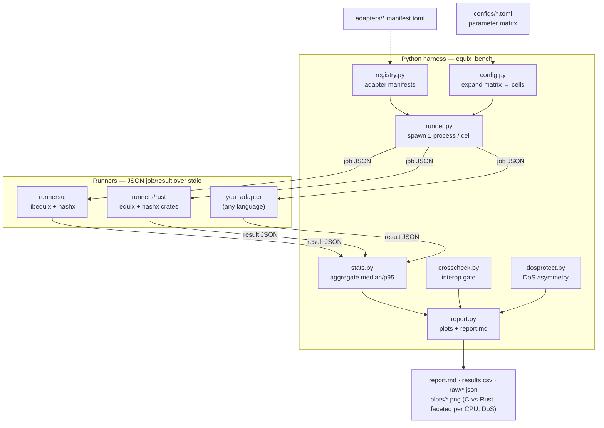

# Equi-X

A benchmarking framework for the **Equi-X** proof-of-work algorithm — tevador's
`Equihash(n=60, k=3)` over the **HashX** pseudo-random hash function (the
client-puzzle used by Tor onion-service PoW, proposal 327).

It benchmarks **multiple implementations** side by side — the reference **C**
(`tevador/equix` + `hashx`) and the **Rust** (Tor `arti` `equix` / `hashx` crates)
— across **all parameters** (runtime backend, operation, challenge, difficulty)
and measures **execution time and cost** (solve/verify throughput, peak memory,
JIT-compile overhead, and difficulty/effort cost). It is extensible to any other
implementation via a small language-agnostic plugin protocol.

## What it measures

- **Solve & verify time + throughput** — the asymmetric core of the PoW.
- **Peak RSS memory** — per implementation and runtime.
- **JIT compile overhead** — interpreter vs compiled HashX, isolated.
- **Difficulty / effort sweep** — Tor prop-327 effort: expected attempts & time to
  reach a target difficulty.
- **DoS-protection effectiveness** — the attacker-solve vs defender-verify asymmetry
  on *this* system, with a verdict (effective from what effort). This figure is
  *per-core* (derived as 1/latency from a single serial op).
- **Sustained throughput under concurrency** *(--full)* — the complementary
  *measured* answer: N worker processes run at once (N = 1, 2, 4, … up to the core
  count) to capture real memory-bandwidth contention, reporting the machine's true
  aggregate solves/s and verifies/s and the saturation knee. Additive — it never
  overwrites the per-core estimate above.
- **Mining rate vs difficulty** *(--full, or standalone via `configs/mining.toml`)* —
  the measured whole-machine token mint rate at each effort target (pooled over
  many independent nonce ranges, one streaming search per core), the basis for
  "control the mint rate by setting difficulty". Outputs `mining.csv` + a report
  section; best measured under idle (`scripts/run_when_idle.sh <cmd>` gates on CPU idle).
- **Compiler-flag comparison** — the same C impl built under different
  `-O` levels / `-march` / `-flto` / gcc-vs-clang, compared side by side.

Two companion documents build on the measurements: `docs/findings.md` (the full
findings report: how Equi-X works, message-exchange schemas, DoS and mining
usage with the measured numbers) and `docs/difficulty-control.md` (closed-loop
difficulty controllers — mint-rate + load — with a simulator calibrated on the
measured curve: `python -m equix_bench.difficulty_control`).

Every generated plot compares the implementations (C vs Rust) on the same axes,
and a correctness **cross-check** proves the implementations agree (solutions from
one verify under the other; effort values match byte-for-byte).

## Architecture



- **Runners** wrap one implementation and speak a JSON-over-stdio protocol
  (`adapters/README.md`). One process per parameter cell keeps memory attributable.
- **Harness** (`harness/equix_bench`) expands the TOML matrix, runs every cell,
  aggregates statistics, cross-checks implementations, evaluates DoS-protection,
  and renders `results/report.md`, `results/results.csv`, and comparison plots.
- **Extensible**: add an implementation by dropping in a runner that speaks the
  protocol plus a manifest — including compiler-flag variants and future GPU runners.

## Run everything (one command)

```bash
./scripts/run_all.sh            # bootstrap deps + build + test + benchmark + compiler variants
./scripts/run_all.sh --full     # deeper sweep (full config + effort sweep; takes longer)
```

Or via make — `make benchmark` depends on `setup` and `test`, so one command gets a
correct-by-construction run:

```bash
make benchmark        # setup -> tests -> quick main benchmark
make benchmark-full   # setup -> tests -> full sweep (concurrency + mining)
make help             # all targets: check/test/compiler-flags/mining/control/clean/distclean
```

Copied or moved the repo (e.g. rsync'd to another machine)? `setup.sh` (and
`make setup`) detects the stale CMake caches that a copy carries and cleans them
automatically; `make clean` / `make distclean` are also available.

`run_all.sh` does the whole pipeline: installs/builds dependencies
(`setup.sh`), runs the unit tests, runs the **main C-vs-Rust benchmark** (all
operations + the **DoS-protection verdict**, with the correctness gate), then
builds the **compiler-flag variants** and compares them. Outputs:

- `results/main/report.md` — C vs Rust: time, throughput, RSS, compile, effort, DoS
  (with `--full` also the concurrency and mining sections + `concurrency.csv`, `mining.csv`)
- `results/compiler_flags/report.md` — compiler-flag comparison

Flags: `--out DIR`, `--no-variants`, `--no-setup`, `--no-tests` (see `--help`).

## Quick start (step by step)

```bash
# 1. Install any missing deps (cmake/compiler/cargo/python) + fetch + build.
#    setup.sh auto-installs via the system package manager / rustup when possible.
#    Use `--check` to only report what's missing; EQUIX_NO_AUTO_INSTALL=1 to disable.
./scripts/setup.sh          # installs the harness + pytest into a project .venv

# 2. Run the smoke benchmark (seconds).  Use the venv interpreter setup.sh made:
.venv/bin/python -m equix_bench run --config configs/smoke.toml --out results/
#    (or `make benchmark` / `scripts/run_all.sh`, which auto-prefer .venv)

# 3. Full sweep (minutes)
python -m equix_bench run --config configs/full.toml --out results/

# One-shot end-to-end check
./scripts/verify.sh
```

Outputs land in `results/`: `report.md`, `results.csv`, `raw/results.json`, and
`plots/*.png` (each comparing C vs Rust).

## DoS-protection evaluation

Equi-X is a DoS defense: requesters *solve* (expensive), the service *verifies*
(cheap). Any run that includes `effort` + `verify` gets a **DoS-protection**
section in the report — measured attacker-cost vs defender-cost on this system,
the asymmetry factor, verify throughput, and a verdict ("effective from effort ≥ E*").

```bash
python -m equix_bench run --config configs/dos_protection.toml --out results/
# report.md -> "DoS-protection effectiveness (this system)" + dos_protection.png
```

## Comparing compiler flags

Build the C runner (and libequix/hashx) under several compiler/optimization flag
sets, then benchmark them as separate impls — every plot compares the variants:

```bash
./scripts/build_variants.sh   # gcc -O0/-O2/-O3/-march=native/-flto, clang -O3, ...
python -m equix_bench run --config configs/compiler_flags.toml --out results/
```

Each variant becomes `equix-c-<name>` via an auto-generated manifest in
`adapters/generated/`; unbuilt variants (missing compiler) are skipped.

The **main** `equix-c` runner is not one fixed guess: `setup.sh` runs
`scripts/autotune_c_flags.sh`, which builds the fast-tier flag candidates
(`-O2`, `-O3`, `-O3 -march=native`, `-O3 -flto`) with the default compiler,
benchmarks the JIT solve path, and installs the **fastest** binary as the main
runner (recording the winning flags in `build/runners/c/equix_runner.flags` and
`build/provenance.json`). Solve is JIT-dominated so the margin is usually small;
when plain `-O3` is within 1% of the best it is preferred (portable, no native
lock-in). Skip the tuning with `EQUIX_NO_AUTOTUNE=1` (falls back to `-O3 -DNDEBUG`).

## Comparing multiple CPUs (and GPUs)

Every run records the **CPU it executed on** (model, arch) and shows it on each
plot. To compare across machines, run on each and merge — no re-benchmarking:

```bash
python -m equix_bench run --config configs/full.toml --out runA/ --device-label host-a
# ...on another machine...
python -m equix_bench run --config configs/full.toml --out runB/ --device-label host-b
python -m equix_bench combine --inputs runA runB --out combined/
```

`combine` produces **faceted plots** (one panel per CPU, C-vs-Rust within each) plus
**`xdev_*` cross-CPU charts** (x=CPU, series=implementation) for headline metrics.
The **concurrency** and **mining** sections/figures are carried across every device
too (faceted per CPU), not just the solve/verify/effort plots.

### Automatic, when results from many devices are collected in one tree

Copy or `rsync` each device's output under a single directory, then combine the
whole tree in one command — no need to list every run by hand:

```bash
scripts/combine_all.sh results-by-device --out combined/   # or: make combine ROOT=results-by-device
```

Discovery is **layout-agnostic**: any directory holding a `raw/results.json` is
treated as a run, and each run's **device identity comes from inside its records**
(CPU model + OS), so folder names are free-form and two machines are never
conflated. Re-runs of the same device are de-duplicated automatically (newest
wins). The layout can be anything, e.g.:

```
results-by-device/
  laptop-x1/main/{raw/results.json, concurrency.csv, mining.csv, ...}
  server-epyc/main/{raw/results.json, ...}
  rpi5/results/main/{raw/results.json, ...}
```

**GPU?** Equi-X/HashX is CPU-oriented by design (deliberately GPU/ASIC-hostile), so
no GPU implementation is benchmarked or bundled. The framework is GPU-ready though:
a runner reporting `device: "gpu"` plugs in via the adapter protocol and appears on
every figure as another device automatically. See `PARAMETERS.md` §8.

## Requirements

- C: `cmake` ≥ 3.10, `gcc`/`clang`. Rust: `cargo`/`rustc`. Python ≥ 3.11 (`matplotlib`).
- x86-64 or aarch64 for HashX JIT; other targets fall back to the interpreter.
- `setup.sh` installs the harness (matplotlib/numpy) and `pytest` into a project
  `.venv`. This sidesteps the Linux "externally-managed-environment" / "pytest not
  importable" failure (PEP-668): a virtualenv has its own writable site-packages, so
  `pip` just works — no `pyenv` or `--break-system-packages` needed. On Debian/Ubuntu
  it provisions `python3-venv` if missing, and falls back to system `pip` if a venv
  can't be created.

## Platform support (Linux, macOS, ARM64, Raspberry Pi 5)

Runners and harness are portable C / Rust / Python. CI builds and runs the smoke
benchmark on **Linux (x86-64)** and **macOS (Apple Silicon)**; both are supported,
along with ARM64 Linux (Raspberry Pi 5).

### macOS (Intel & Apple Silicon)

- **Interpreter runtime: fully supported** on both Intel and Apple Silicon.
- **JIT (compiled runtime):** works on Linux and Intel macOS. On **Apple Silicon**
  the bundled HashX C JIT uses `mmap`+`mprotect` without `MAP_JIT`, which the
  kernel rejects — so the **C runner detects this and uses the interpreter**
  (`try-compile` → interpreter, `must-compile` → clean error), never crashing. The
  Rust impl JITs via `dynasmrt` (which handles Apple Silicon), so `runtime_effective`
  honestly reports what each impl actually ran.
- Platform specifics are handled: peak RSS via `getrusage` (macOS reports bytes, not
  Linux's KB — converted), CPU name via `sysctl` (no `/proc`), OS via `uname`.

### ARM64 / Raspberry Pi 5

The framework is portable C / Rust / Python with no x86-specific code, so it runs
on **ARM64 including the Raspberry Pi 5**:

- **64-bit OS (recommended for Pi 5):** full support, **including the JIT** — HashX
  ships an aarch64 compiler backend (`compiler_a64.c`; the Rust side uses
  `dynasmrt`), so `interpret`, `try-compile`, and `must-compile` all work.
- **32-bit OS (armv7/armhf):** runs **interpreter-only** — there is no 32-bit-ARM
  JIT, so `try-compile` transparently falls back to the interpreter and
  `must-compile` fails by design. Use a 64-bit OS on the Pi 5 to benchmark the JIT.
- CPU identification handles ARM `/proc/cpuinfo` (no `model name` field): the device
  label uses the board `Model` (e.g. `raspberry-pi-5-model-b-rev-1-0-<kernel>`).
- **Comparing x86 vs ARM** is a first-class use case — run on each and `combine` for
  faceted x86-vs-Pi figures (the arch is recorded per device).
- **Caveat:** the Pi 5 can thermal-throttle under sustained solving; use active
  cooling and watch the reported stddev/p95 for stability.

Build on the Pi exactly as elsewhere: `./scripts/setup.sh` (it creates the `.venv`
with the harness installed; use `.venv/bin/python -m equix_bench ...` to run).

## Parameters

See **[PARAMETERS.md](PARAMETERS.md)** for a full description of every parameter
(operation, runtime, challenge/nonce, effort/difficulty, repetitions/warmup) and
its implications for time, memory, and cost.

## Adding an implementation

Write a runner that speaks the protocol in `adapters/README.md`, drop a
`<name>.manifest.toml` next to the examples, and add its name to a config's
`run.impls`. No harness code changes required.

## Licensing

The framework code (runners glue, harness) is MIT (`LICENSE`). The vendored
`tevador/equix` + `hashx` (git submodule) and the Rust `equix`/`hashx` crates are
**LGPL-3.0-only**; they are used as dependencies/submodules and are not
relicensed here.
